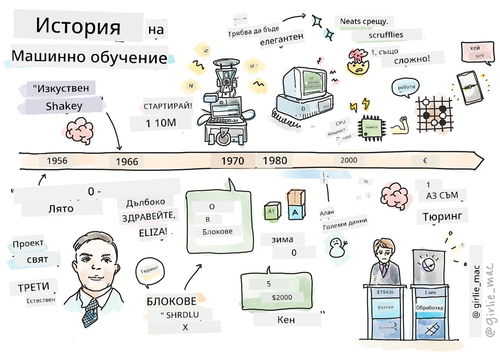
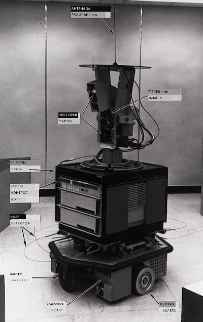
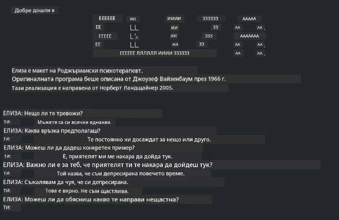

# История на машинното обучение

> Скицноут от [Tomomi Imura](https://www.twitter.com/girlie_mac)

## [Въпросник преди лекцията](https://ff-quizzes.netlify.app/en/ml/)

---

> 🎥 Кликнете върху изображението по-горе за кратко видео, разглеждащо този урок.

В този урок ще преминем през основните етапи в историята на машинното обучение и изкуствения интелект.

Историята на изкуствения интелект (ИИ) като област е преплетена с историята на машинното обучение, тъй като алгоритмите и компютърните постижения, които поддържат МО, са допринесли за развитието на ИИ. Полезно е да се помни, че докато тези области като отделни направления започват да се оформят през 50-те години на XX век, важни [алгоритмични, статистически, математически, компютърни и технически открития](https://wikipedia.org/wiki/Timeline_of_machine_learning) са предхождали и припокривали този период. Всъщност хората мислят за тези въпроси от [стотици години](https://wikipedia.org/wiki/History_of_artificial_intelligence): тази статия разглежда историческите интелектуални основи на идеята за „мислеща машина“.

---
## Значими открития

- 1763, 1812 [Теоремата на Байес](https://wikipedia.org/wiki/Bayes%27_theorem) и нейните предшественици. Тази теорема и приложенията ѝ лежат в основата на извеждането, описвайки вероятността за събитие въз основа на предишни знания.
- 1805 [Теория на най-малките квадрати](https://wikipedia.org/wiki/Least_squares) от френския математик Адриен-Мари Лежандр. Тази теория, която ще изучавате в нашия модул за Регресия, помага при напасването на данни.
- 1913 [Марковски вериги](https://wikipedia.org/wiki/Markov_chain), кръстени на руския математик Андрей Марков, се използват за описание на поредица от възможни събития въз основа на предишно състояние.
- 1957 [Перцептрон](https://wikipedia.org/wiki/Perceptron) е вид линеен класификатор, изобретен от американския психолог Франк Розенблат, който лежи в основата на напредъците в дълбокото обучение.

---

- 1967 [Най-близък съсед](https://wikipedia.org/wiki/Nearest_neighbor) е алгоритъм, първоначално проектиран за картографиране на маршрути. В контекста на МО се използва за откриване на модели.
- 1970 [Обратна пропагация](https://wikipedia.org/wiki/Backpropagation) се използва за обучение на [невронни мрежи тип фийдвърд](https://wikipedia.org/wiki/Feedforward_neural_network).
- 1982 [Рекурентни невронни мрежи](https://wikipedia.org/wiki/Recurrent_neural_network) са изкуствени невронни мрежи, произлизащи от фийдвърд мрежи, които създават времеви графики.

✅ Направете малко проучване. Кои други дати изпъкват като ключови в историята на МО и ИИ?

---
## 1950: Машини, които мислят

Алан Тюринг, изключителен човек, който беше избран [от публиката през 2019 г.](https://wikipedia.org/wiki/Icons:_The_Greatest_Person_of_the_20th_Century) за най-големия учен на XX век, се счита за допринесъл за основаването на концепцията за „машина, която може да мисли“. Той се сблъска с неприятели и със собствената си нужда от емпирични доказателства за тази концепция, създавайки [Тестът на Тюринг](https://www.bbc.com/news/technology-18475646), който ще разгледате в урока по NLP.

---
## 1956: Лятно изследователско събитие в Дартмът

„Лятният изследователски проект на Дартмът върху изкуствения интелект беше основополагащо събитие за изкуствения интелект като област,“ и именно там бе създаден терминът „изкуствен интелект“ ([източник](https://250.dartmouth.edu/highlights/artificial-intelligence-ai-coined-dartmouth)).

> Всеки аспект на ученето или всяка друга характеристика на интелигентността може на принципа да бъде описан толкова точно, че да може да се направи машина, която да го симулира.

---

Водещият изследовател, професор по математика Джон Маккарти, се надяваше „да продължи на база предположението, че всеки аспект на ученето или всяка друга характеристика на интелигентността може на принципа да бъде описан толкова точно, че да може да се направи машина, която да го симулира.“ В участниците се включваше още една забележителна личност в областта, Марвин Мински.

Уъркшопът получава признание за иницииране и насърчаване на няколко дискусии, включително „възхода на символичните методи, системи, фокусирани върху ограничени области (ранни експертни системи) и дедуктивни системи срещу индуктивни системи.“ ([източник](https://wikipedia.org/wiki/Dartmouth_workshop)).

---
## 1956 - 1974: „Златните години“

От 50-те години до средата на 70-те години оптимизмът беше висок с надеждата, че ИИ може да реши много проблеми. През 1967 г. Марвин Мински уверено заяви, че „В рамките на едно поколение ... проблемът с създаването на 'изкуствен интелект' ще бъде съществено решен.“ (Мински, Марвин (1967), Изчисления: крайни и безкрайни машини, Ангълууд Клифтс, Ню Джърси: Прентис-Хол)

Изследванията в обработката на естествен език процъфтяваха, търсенето беше усъвършенствано и направено по-мощно, и бе създадена концепцията за „микросветове“, където прости задачи се изпълняваха с инструкции на обикновен език.

---

Изследванията бяха добре финансирани от държавни агенции, постигнаха се напредъци в изчисленията и алгоритмите, и бяха построени прототипи на интелигентни машини. Някои от тези машини включват:

* [Shakey роботът](https://wikipedia.org/wiki/Shakey_the_robot), който можеше да маневрира и решава как да изпълнява задачи „интелигентно“.

    
    > Shakey през 1972 г.

---

* Eliza, ранен „чатбот“, можеше да комуникира с хора и да действа като първичен „терапевт“. Ще научите повече за Елйза в уроците по NLP.

    
    > Вариант на Елйза, чатбот

---

* „Светът на блоковете“ беше пример за микросвят, където блокове можеха да бъдат нареждани и сортирани, и можеха да се провеждат експерименти по обучение на машини за вземане на решения. Напредъкът, направен с библиотеки като [SHRDLU](https://wikipedia.org/wiki/SHRDLU), помогна за развитието на езиковата обработка.

    

    > 🎥 Кликнете върху изображението по-горе за видео: Светът на блоковете с SHRDLU

---
## 1974 - 1980: „Зима на ИИ“

До средата на 70-те години стана очевидно, че сложността на създаването на „интелигентни машини“ е била подценена и обещанията, предвид наличната изчислителна мощност, са били преувеличени. Финансирането изсъхна и доверието в областта спадна. Някои въпроси, които повлияха на доверието, включваха:
---
- **Ограничения**. Изчислителната мощност беше твърде ограничена.
- **Комбинаторен взрив**. Количеството параметри, които трябваше да бъдат обучени, растеше експоненциално с нарастващите изисквания към компютрите, без паралелно развитие на изчислителната мощност и възможностите.
- **Липса на данни**. Липсата на достатъчно данни възпрепятстваше процеса на тестване, разработка и усъвършенстване на алгоритмите.
- **Задаваме ли правилните въпроси?**. Самите задавани въпроси започнаха да бъдат поставяни под съмнение. Изследователите започнаха да получават критика за подходите си:
  - Тестовете на Тюринг бяха оспорвани с идеи, сред които „теорията на китайската стая“, която твърди, че „програмирането на цифров компютър може да го накара да изглежда, че разбира език, но не би могло да доведе до истинско разбиране.“ ([източник](https://plato.stanford.edu/entries/chinese-room/))
  - Етичната страна на въвеждането на изкуствени интелекти като „терапевта“ Елйза в обществото също беше поставена под въпрос.

---

По същото време започнаха да се формират различни школи в областта на ИИ. Установи се дихотомия между практиките на ["грязен" срещу "чист" ИИ](https://wikipedia.org/wiki/Neats_and_scruffies). _Грязните_ лаборатории променяха програмите с часове, докато постигнат желания резултат. _Чистите_ лаборатории „се фокусираха върху логиката и формалното решаване на проблеми“. Елйза и SHRDLU бяха известни _грязни_ системи. През 80-те, с появата на необходимостта за възпроизвеждане на МО системи, _чистия_ подход постепенно излезе на преден план, тъй като неговите резултати са по-обясними.

---
## Експертни системи през 80-те

С разрастването на областта ставаше все по-ясно ползата за бизнеса, а през 80-те години се увеличи и разпространението на „експертни системи“. „Експертните системи бяха сред първите наистина успешни форми софтуер на изкуствен интелект (ИИ).“ ([източник](https://wikipedia.org/wiki/Expert_system)).

Този тип система всъщност е _хибридна_, състояща се частично от механизъм за правила, дефиниращ бизнес изисквания, и механизъм за извеждане, който използва системата с правила за извеждане на нови факти.

По това време се обръща все повече внимание на невронните мрежи.

---
## 1987 - 1993: „Засилка на ИИ“

Разпространението на специализиран хардуер за експертни системи имаше нещастния ефект да стане твърде специализиран. Възходът на персоналните компютри също конкурира тези големи, специализирани, централизираните системи. Демократизацията на изчисленията започна и в крайна сметка отвори пътя за съвременния взрив на големи данни.

---
## 1993 - 2011

Този период отбеляза нова епоха за МО и ИИ, които успяха да решат някои от проблемите, причинени по-рано от липсата на данни и изчислителна мощност. Количеството данни започна бързо да расте и да бъде по-достъпно, както в положителен, така и в отрицателен аспект, особено с появата на смартфона около 2007 г. Изчислителната мощност нарасна експоненциално, а алгоритмите се развиха паралелно. Областта започна да придобива зрялост, тъй като дните на свободомислието от миналото започнаха да се оформят в истинска дисциплина.

---
## Сега

Днес машинното обучение и ИИ засягат почти всяка част от живота ни. Тази епоха изисква внимателно разбиране на рисковете и потенциалните ефекти на тези алгоритми върху човешкия живот. Както Брад Смит от Microsoft е заявил: „Информационните технологии поставят въпроси, които засягат същността на фундаменталните човешки права като поверителност и свобода на изразяване. Тези въпроси увеличават отговорността за технологичните компании, които създават тези продукти. Според нашето мнение те също изискват внимателна държавна регулация и разработване на норми относно приемливите употреби“ ([източник](https://www.technologyreview.com/2019/12/18/102365/the-future-of-ais-impact-on-society/)).

---

Остава да се види какво ще донесе бъдещето, но е важно да разбираме тези компютърни системи и софтуера и алгоритмите, които те използват. Надяваме се тази учебна програма да ви помогне да придобиете по-добро разбиране, за да можете сами да решите.

> 🎥 Кликнете върху изображението по-горе за видео: Ян Лекан обсъжда историята на дълбокото обучение в тази лекция

---
## 🚀Предизвикателство

Изследвайте един от тези исторически моменти и научете повече за хората зад тях. Има завладяващи личности, и никое научно откритие не е създадено в културна вакуум. Какво откривате?

## [Въпросник след лекцията](https://ff-quizzes.netlify.app/en/ml/)

---
## Преглед и самостоятелно учене

Ето материали, които да гледате и слушате:

[Този подкаст, където Ейми Бойд обсъжда развитието на ИИ](http://runasradio.com/Shows/Show/739)

---

## Задание

[Създайте времева линия](assignment.md)

---

<!-- CO-OP TRANSLATOR DISCLAIMER START -->
**Отказ от отговорност**:
Този документ е преведен с помощта на AI преводачески услуга [Co-op Translator](https://github.com/Azure/co-op-translator). Въпреки че се стремим към точност, моля имайте предвид, че автоматизираните преводи могат да съдържат грешки или неточности. Оригиналният документ на неговия роден език трябва да се счита за авторитетен източник. За критична информация се препоръчва професионален човешки превод. Ние не носим отговорност за каквито и да е недоразумения или неправилни тълкувания, произтичащи от използването на този превод.
<!-- CO-OP TRANSLATOR DISCLAIMER END -->