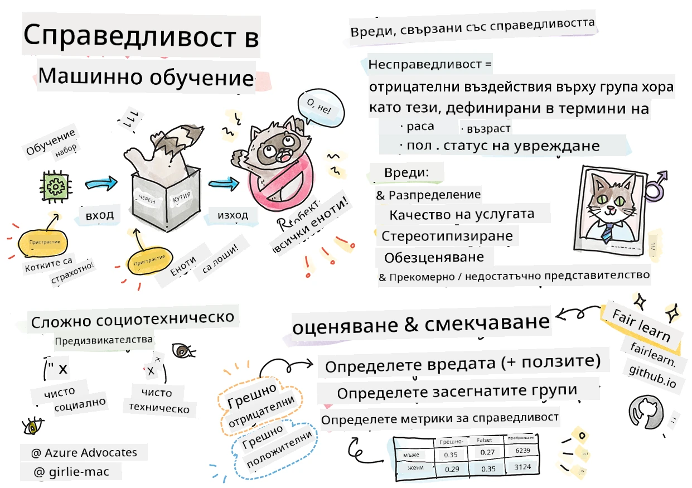

# Създаване на решения за машинно обучение с отговорен ИИ
 

> Скичнот от [Tomomi Imura](https://www.twitter.com/girlie_mac)

## [Квиз преди лекцията](https://ff-quizzes.netlify.app/en/ml/)
 
## Въведение

В тази учебна програма ще започнете да откривате как машинното обучение може и оказва влияние върху нашия всекидневен живот. Дори сега, системи и модели участват в ежедневни задачи за вземане на решения, като диагнози в здравеопазването, одобрения на заеми или откриване на измами. Затова е важно тези модели да работят добре, за да предоставят резултати, на които може да се има доверие. Също като всяко софтуерно приложение, системите с ИИ могат да не отговарят на очакванията или да имат нежелан резултат. Затова е от съществено значение да можем да разбираме и обясняваме поведението на ИИ моделите.

Представете си какво може да се случи, когато данните, които използвате за изграждане на тези модели, липсват определени демографски групи, като раса, пол, политически възгледи, религия, или непропорционално представят такива групи. Какво става, когато изходът на модела се интерпретира в полза на някоя демографска група? Какви са последствията за приложението? Освен това, какво се случва, когато моделът има неблагоприятен резултат и вреди на хората? Кой е отговорен за поведението на ИИ системите? Това са някои от въпросите, които ще разгледаме в тази учебна програма.

В този урок ще:

- Повишите осведомеността си за важността на справедливостта в машинното обучение и свързаните с нея вреди.
- Запознаете се с практиката за изследване на отклонения и необичайни ситуации, за да се гарантира надеждност и безопасност
- Разберете необходимостта от овластяване на всички чрез проектиране на приобщаващи системи
- Изследвате колко е важно да се защитят поверителността и сигурността на данните и хората
- Видите важността на подхода с прозрачна кутия, за да се обясни поведението на ИИ моделите
- Осъзнаете как отговорността е съществена за изграждането на доверие в ИИ системите

## Изисквания

Като предварително изискване, моля, преминете "Принципи на отговорен ИИ" и изгледайте видеото по-долу по темата:

Научете повече за отговорния ИИ, като следвате този [Обучителен път](https://docs.microsoft.com/learn/modules/responsible-ai-principles/?WT.mc_id=academic-77952-leestott)

> 🎥 Кликнете върху изображението по-горе за видео: Подходът на Microsoft към отговорния ИИ

## Справедливост

ИИ системите трябва да третират всички справедливо и да избягват да засягат подобни групи хора по различен начин. Например, когато ИИ системи предоставят насока за медицинско лечение, заявления за заеми или заетост, те трябва да дават същите препоръки на всички с подобни симптоми, финансова ситуация или професионални квалификации. Всеки от нас като човек носи в себе си унаследени предразсъдъци, които влияят на нашите решения и действия. Тези предразсъдъци могат да са видими в данните, с които обучаваме ИИ системи. Такова манипулиране понякога се случва несъзнателно. Често е трудно да осъзнаете кога въвеждате пристрастие в данните.

**„Несправедливостта“** обхваща отрицателни въздействия, или „вреди“, за група хора, например определени чрез раса, пол, възраст или статус на увреждане. Основните вреди, свързани със справедливостта, могат да се класифицират като:

- **Разпределение**, ако например се фаворизира пол или етнос пред друг.
- **Качество на услугата**. Ако обучите данните за един конкретен сценарий, но реалността е много по-сложна, това води до лошо представяне. Например, дозатор за течен сапун, който изглежда не може да разпознава хора с тъмна кожа. [Референция](https://gizmodo.com/why-cant-this-soap-dispenser-identify-dark-skin-1797931773)
- **Дениграция**. Несправедливо критикуване и етикетиране на нещо или някого. Например, технология за етикетиране на изображения с лоша слава, че е етикетирала изображения на хора с тъмна кожа като горили.
- **Прекомерно или недостатъчно представителство**. Идеята е, че дадена група не се вижда в определена професия, и всяка услуга или функция, която продължава да насърчава това, допринася за вредата.
- **Стереотипизиране**. Свързване на дадена група с предварително определени характеристики. Например, система за езиков превод между английски и турски може да има неточности поради думи с типични асоциации с пол.

> превод на турски

> превод обратно на английски

При проектиране и тестване на ИИ системи трябва да гарантираме, че ИИ е справедлив и не е програмиран да взема пристрастни или дискриминационни решения, които също са забранени за хората. Гарантирането на справедливост в ИИ и машинното обучение остава сложен социотехнически предизвикателство.

### Надеждност и безопасност

За изграждане на доверие ИИ системите трябва да са надеждни, безопасни и последователни при нормални и непредвидени условия. Важно е да знаем как ИИ системите ще се държат в различни ситуации, особено когато са отклонения. При изграждане на ИИ решения трябва да се обърне значително внимание на това как да се справим с широк кръг обстоятелства, с които ИИ решенията могат да се сблъскат. Например, автомобил с автономно управление трябва да постави безопасността на хората като основен приоритет. Като резултат, ИИ, който управлява автомобила, трябва да вземе предвид всички възможни сценарии, с които може да се срещне като нощно време, бури, снежни виелици, деца, тичащи по улицата, домашни любимци, пътни ремонти и т.н. Колко добре една ИИ система може да се справи с разнообразни условия надеждно и безопасно отразява нивото на предвидливост, което е имал датасайнтистът или разработчикът на ИИ при проектирането или тестването на системата.

> [🎥 Кликнете тук за видео: ](https://www.microsoft.com/videoplayer/embed/RE4vvIl)

### Приобщаване

ИИ системите трябва да бъдат проектирани така, че да ангажират и овластят всички. При проектиране и внедряване на ИИ системи, датасайнтисти и разработчици на ИИ идентифицират и адресират потенциални бариери в системата, които могат несъзнателно да изключат хора. Например, има 1 милиард хора с увреждания по света. С напредъка на ИИ те могат по-лесно да имат достъп до широка гама от информация и възможности в своя ежедневен живот. Като се адресират бариерите, се създават възможности за иновации и разработване на ИИ продукти с по-добро потребителско изживяване, които да са от полза за всички.

> [🎥 Кликнете тук за видео: приобщаване в ИИ](https://www.microsoft.com/videoplayer/embed/RE4vl9v)

### Сигурност и поверителност

ИИ системите трябва да бъдат безопасни и да уважават личната неприкосновеност на хората. Хората имат по-малко доверие в системи, които застрашават тяхната поверителност, информация или живот. При обучението на модели за машинно обучение разчитаме на данни, за да получим най-добрите резултати. При това, трябва да се вземе под внимание произходът и интегритетът на данните. Например, потребителски данни ли са или са публично достъпни? След това, при работа с данните, е важно да се разработят ИИ системи, които могат да защитят конфиденциална информация и да устоят на атаки. С нарастващото използване на ИИ защитата на поверителността и сигурността на важна лична и бизнес информация става все по-критична и сложна. Въпросите за поверителността и сигурността на данните изискват особено внимание за ИИ, защото достъпът до данни е от съществено значение за ИИ системите да правят точни и информирани прогнози и решения за хората.

> [🎥 Кликнете тук за видео: сигурност в ИИ](https://www.microsoft.com/videoplayer/embed/RE4voJF)

- Като индустрия направихме значителни напредъци в областта на Поверителност и сигурност, значително подпомогнати от регулации като GDPR (Общ регламент за защита на данните).
- Въпреки това при ИИ системите трябва да признаем напрежението между нуждата от повече лични данни, за да се направят системите по-персонални и ефективни – и личната неприкосновеност.
- Както при раждането на свързаните компютри с интернет, също виждаме голямо увеличение на броя на проблемите със сигурността, свързани с ИИ.
- В същото време видяхме ИИ да се използва за подобряване на сигурността. Например, повечето съвременни антивирусни скенери днес се управляват от ИИ евристики.
- Трябва да гарантираме, че нашите процеси в областта на данните се интегрират хармонично с най-новите практики за поверителност и сигурност.

### Прозрачност
ИИ системите трябва да са разбираеми. Ключова част от прозрачността е обяснението на поведението на ИИ системите и техните компоненти. Подобряването на разбирането за ИИ системите изисква заинтересованите страни да разберат как и защо те функционират, за да могат да идентифицират потенциални проблеми с представянето, проблеми със сигурността и поверителността, пристрастия, изключващи практики или нежелани резултати. Ние също вярваме, че тези, които използват ИИ системи, трябва да бъдат честни и откровени за това кога, защо и как избират да ги внедрят. Както и за ограниченията на системите, които използват. Например, ако банка използва ИИ система, за да подпомогне решенията при кредитиране на потребители, е важно да се прегледат резултатите и да се разбере кои данни влияят върху препоръките на системата. Правителствата започват да регулират ИИ в различни индустрии, затова датасайнтисти и организации трябва да могат да обяснят дали ИИ система отговаря на регулаторните изисквания, особено при нежелан резултат.

> [🎥 Кликнете тук за видео: прозрачност в ИИ](https://www.microsoft.com/videoplayer/embed/RE4voJF)

- Поради сложността на ИИ системите е трудно да се разбере как работят и да се интерпретират резултатите.
- Този недостиг на разбиране влияе на начина, по който системите се управляват, експлоатират и документират.
- Още по-важно е, че това недоразумение влияе на решенията, изготвени на базата на резултатите, които тези системи генерират.

### Отговорност
 
Хората, които проектират и внедряват ИИ системи, трябва да бъдат отговорни за начина, по който техните системи работят. Необходимостта от отговорност е особено важна при чувствителни технологии като лицево разпознаване. Наскоро има нарастващо търсене на технология за лицево разпознаване, особено от правоохранителни органи, които виждат потенциала на технологията за намиране на изчезнали деца. Въпреки това тези технологии потенциално могат да бъдат използвани от правителство, за да застрашат основните свободи на гражданите, например чрез осигуряване на непрекъснато наблюдение на определени лица. Поради това датасайнтисти и организации трябва да носят отговорност за това как техните ИИ системи влияят на индивиди или обществото.

> 🎥 Кликнете върху изображението по-горе за видео: Предупреждения за масово наблюдение чрез лицево разпознаване

В крайна сметка един от най-големите въпроси за нашето поколение, като първото поколение, което въвежда ИИ в обществото, е как да се гарантира, че компютрите ще останат отговорни пред хората и как да се гарантира, че хората, които проектират компютрите, остават отговорни пред всички останали.

## Оценка на въздействието

Преди да се обучи модел за машинно обучение, е важно да се проведе оценка на въздействието, за да се разбере целта на ИИ системата; как е предназначена да се използва; къде ще бъде внедрена; и кой ще взаимодейства със системата. Това е полезно за рецензенти или тестери, които ще оценяват системата, за да знаят кои фактори да вземат предвид при идентифициране на потенциални рискове и очаквани последствия.

Следните области са във фокуса при провеждане на оценка на въздействието:

* **Неблагоприятно въздействие върху индивидите**. Осъзнаването на всякакви ограничения или изисквания, неподдържана употреба или известни ограничения, които възпрепятстват представянето на системата, е от съществено значение, за да се гарантира, че системата не се използва по начин, който може да навреди на индивидите.
* **Изисквания към данните**. Разбирането как и къде системата ще използва данни позволява на рецензентите да проучат всякакви изисквания към данните, които трябва да се спазват (напр. GDPR или HIPAA регулации). Освен това, да се провери дали източникът или количеството данни е достатъчно за обучението.
* **Обобщение на въздействието**. Събират се списък с потенциални вреди, които могат да възникнат от използването на системата. През целия жизнен цикъл на машинното обучение се преглежда дали идентифицираните проблеми са смекчени или адресирани.
* **Приложими цели** за всеки от шестте основни принципа. Оценява се дали целите от всеки от принципите са изпълнени и дали съществуват пропуски.

## Отстраняване на грешки с отговорен ИИ

Подобно на отстраняването на грешки при софтуерно приложение, отстраняването на грешки в ИИ система е необходим процес за идентифициране и разрешаване на проблеми в системата. Много фактори могат да повлияят на това моделът да не работи според очакванията или отговорно. Повечето традиционни метрики за представяне на модела са количествени агрегати на представянето, които не са достатъчни за анализ на нарушения на принципите на отговорен ИИ. Освен това, моделът за машинно обучение е черна кутия, която затруднява разбиране на движущите фактори зад резултата или даването на обяснение при грешка. По-нататък в курса ще научите как да използвате таблото за отговорен ИИ, за да помогнете при отстраняване на грешки на ИИ системи. Таблото предоставя цялостен инструмент за датасайнтисти и разработчици на ИИ да изпълняват:

* **Анализ на грешки**. За идентифициране на разпределението на грешките на модела, които могат да повлияят на справедливостта или надеждността на системата.
* **Преглед на модела**. За откриване на различия в представянето на модела сред групи данни.
* **Анализ на данните**. За разбиране на разпределението на данните и идентифициране на потенциална пристрастност, която може да доведе до проблеми със справедливостта, приобщаването и надеждността.
* **Интерпретируемост на модела**. За да се разбере какво влияе или определя прогнозите на модела. Това помага при обяснението на поведението на модела, което е важно за прозрачност и отговорност.

## 🚀 Предизвикателство
 
За да предотвратим въвеждането на вреди още в началото, трябва:

- да имаме разнообразие от среди и гледни точки сред хората, работещи по системите
- да инвестираме в набори от данни, които отразяват многообразието на нашето общество
- да разработваме по-добри методи през целия жизнен цикъл на машинното обучение за откриване и коригиране на нарушения на отговорния ИИ, когато възникнат

Помислете за реални ситуации, в които недоверие към модел е очевидно при изграждане и използване на модел. Какво още трябва да вземем под внимание?

## [Квиз след лекцията](https://ff-quizzes.netlify.app/en/ml/)

## Преглед и самостоятелно изучаване
 

В този урок научихте някои основи на концепциите за справедливост и несправедливост в машинното обучение.  
 
Гледайте този уъркшоп, за да се потопите по-дълбоко в темите: 

- В преследване на отговорния изкуствен интелект: Прилагането на принципите на практика от Бесмира Нуши, Мехрнуш Самеки и Амит Шарма

> 🎥 Кликнете върху изображението по-горе за видео: RAI Toolbox: Отворена рамка за изграждане на отговорен ИИ от Бесмира Нуши, Мехрнуш Самеки и Амит Шарма

Също така, прочетете: 

- Ресурсен център за отговорен ИИ на Microsoft: [Responsible AI Resources – Microsoft AI](https://www.microsoft.com/ai/responsible-ai-resources?activetab=pivot1%3aprimaryr4) 

- Изследователска група FATE на Microsoft: [FATE: Fairness, Accountability, Transparency, and Ethics in AI - Microsoft Research](https://www.microsoft.com/research/theme/fate/) 

RAI Toolbox: 

- [Отворено хранилище GitHub на Responsible AI Toolbox](https://github.com/microsoft/responsible-ai-toolbox)

Прочетете за инструментите на Azure Machine Learning за гарантиране на справедливост:

- [Azure Machine Learning](https://docs.microsoft.com/azure/machine-learning/concept-fairness-ml?WT.mc_id=academic-77952-leestott) 

## Задача

[Изследвайте RAI Toolbox](assignment.md)

---

<!-- CO-OP TRANSLATOR DISCLAIMER START -->
**Отказ от отговорност**:
Този документ е преведен с помощта на AI преводачески услуга [Co-op Translator](https://github.com/Azure/co-op-translator). Въпреки че се стремим към точност, моля имайте предвид, че автоматизираните преводи могат да съдържат грешки или неточности. Оригиналният документ на неговия роден език трябва да се счита за авторитетен източник. За критична информация се препоръчва професионален човешки превод. Ние не носим отговорност за каквито и да е недоразумения или неправилни тълкувания, произтичащи от използването на този превод.
<!-- CO-OP TRANSLATOR DISCLAIMER END -->