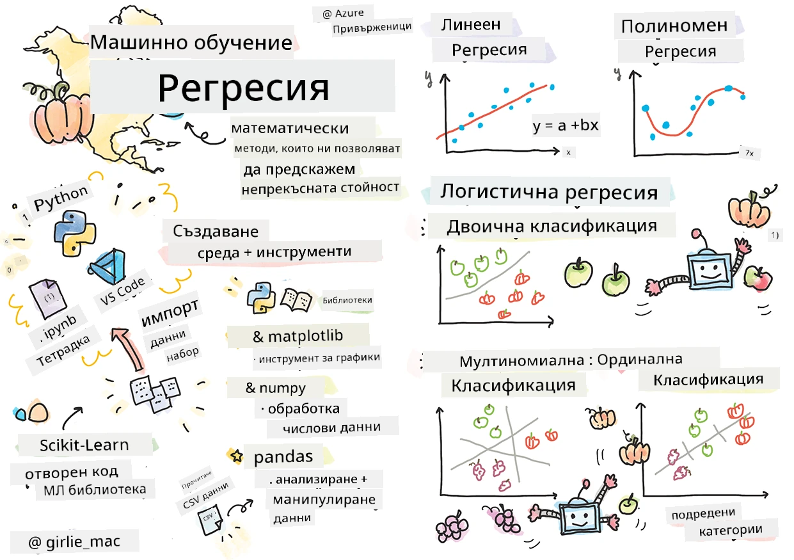
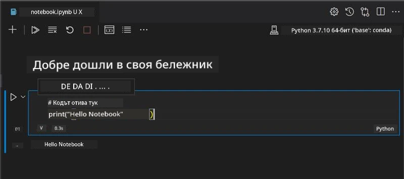
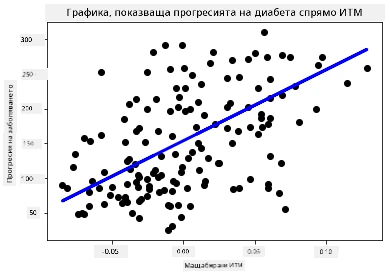

# Започнете с Python и Scikit-learn за регресионни модели



> Скицник от [Tomomi Imura](https://www.twitter.com/girlie_mac)

## [Квиз преди лекцията](https://ff-quizzes.netlify.app/en/ml/)

> ### [Този урок е наличен и на R!](../../../../2-Regression/1-Tools/solution/R/lesson_1.html)

## Въведение

В тези четири урока ще откриете как да изграждате регресионни модели. Скоро ще обсъдим за какво служат те. Но преди да започнете каквото и да е, уверете се, че имате правилните инструменти за започване на процеса!

В този урок ще научите как да:

- Конфигурирате вашия компютър за локални задачи за машинно обучение.
- Работите с Jupyter Notebooks.
- Използвате Scikit-learn, включително инсталация.
- Изследвате линейната регресия чрез практически упражнение.

## Инсталации и конфигурации

[](https://youtu.be/-DfeD2k2Kj0 "ML за начинаещи - Настройте инструментите си готови за изграждане на модели за машинно обучение")

> 🎥 Кликнете върху изображението горе за кратко видео със стъпките за конфигуриране на компютъра за ML.

1. **Инсталирайте Python**. Уверете се, че на вашия компютър е инсталиран [Python](https://www.python.org/downloads/). Ще използвате Python за много задачи в науката за данни и машинното обучение. Повечето компютърни системи вече включват инсталация на Python. Има полезни [Python пакети за кодиране](https://code.visualstudio.com/learn/educators/installers?WT.mc_id=academic-77952-leestott), които улесняват настройката за някои потребители.

   Някои употреби на Python обаче изискват една версия на софтуера, а други - различна версия. Поради тази причина е полезно да работите в [виртуална среда](https://docs.python.org/3/library/venv.html).

2. **Инсталирайте Visual Studio Code**. Уверете се, че имате инсталиран Visual Studio Code на компютъра си. Следвайте тези инструкции, за да [инсталирате Visual Studio Code](https://code.visualstudio.com/). Ще използвате Python във Visual Studio Code в този курс, затова може да искате да научите как да [конфигурирате Visual Studio Code](https://docs.microsoft.com/learn/modules/python-install-vscode?WT.mc_id=academic-77952-leestott) за Python разработка.

   > Запознайте се с Python чрез този сбор от [учебни модули](https://docs.microsoft.com/users/jenlooper-2911/collections/mp1pagggd5qrq7?WT.mc_id=academic-77952-leestott)
   >
   > [](https://youtu.be/yyQM70vi7V8 "Настройка на Python с Visual Studio Code")
   >
   > 🎥 Кликнете върху изображението горе за видео: използване на Python във VS Code.

3. **Инсталирайте Scikit-learn**, като следвате [тези инструкции](https://scikit-learn.org/stable/install.html). Тъй като трябва да използвате Python 3, препоръчително е да използвате виртуална среда. Забележете, ако инсталирате тази библиотека на M1 Mac, има специални инструкции на гореспоменатия сайт.

1. **Инсталирайте Jupyter Notebook**. Трябва да [инсталирате пакета Jupyter](https://pypi.org/project/jupyter/).

## Вашата среда за разработка на ML

Ще използвате **notebooks** за разработка на Python код и създаване на модели за машинно обучение. Този тип файлове е общ инструмент за специалисти по данни, и могат да бъдат разпознати по суфикса или разширението `.ipynb`.

Notebooks са интерактивна среда, която позволява на разработчика както да кодира, така и да добавя бележки и документация около кода, което е много полезно за експериментални или изследователски проекти.

[](https://youtu.be/7E-jC8FLA2E "ML за начинаещи - Настройте Jupyter Notebooks, за да започнете изграждане на регресионни модели")

> 🎥 Кликнете върху изображението горе за кратко видео с упражнението.

### Упражнение - работа с notebook

В тази папка ще намерите файла _notebook.ipynb_.

1. Отворете _notebook.ipynb_ във Visual Studio Code.

   Ще стартира Jupyter сървър с Python 3+. Ще намерите области на notebook-а, които могат да се `изпълнят`, парчета код. Можете да стартирате блок код, като изберете иконата, която прилича на бутон за пускане.

1. Изберете иконата `md` и добавете малко markdown с текста **# Добре дошли във вашия notebook**.

   След това добавете малко Python код.

1. Въведете **print('hello notebook')** в блока с код.
1. Изберете стрелката, за да стартирате кода.

   Трябва да видите отпечатаното изявление:

    ```output
    hello notebook
    ```



Можете да редувате вашия код с коментари, за да документирате notebook-а.

✅ Помислете за момент колко различна е работната среда на уеб разработчик спрямо тази на специалист по данни.

## Натам и с Scikit-learn

Сега, когато Python е настроен във вашата локална среда и сте уверени с Jupyter Notebooks, нека се запознаем и с Scikit-learn (произнася се 'сай', както в 'science'). Scikit-learn предоставя [обширен API](https://scikit-learn.org/stable/modules/classes.html#api-ref), който да ви помогне с машинно-обучителни задачи.

Според техния [уебсайт](https://scikit-learn.org/stable/getting_started.html), "Scikit-learn е библиотека с отворен код за машинно обучение, която поддържа надзирано и ненадзирано обучение. Тя също така предоставя различни инструменти за настройка на модели, предварителна обработка на данни, избор и оценка на модели и много други."

В този курс ще използвате Scikit-learn и други инструменти за изграждане на модели за машинно обучение, които изпълняват това, което наричаме 'традиционни задачи за машинно обучение'. Целенасочено сме избегнали невронните мрежи и дълбокото обучение, понеже те се разглеждат по-добре в предстоящия ни курс 'ИИ за начинаещи'.

Scikit-learn улеснява изграждането и оценката на модели за използване. Тя е основно фокусирана върху числови данни и включва няколко готови набора от данни за учене. Също така включва предварително изградени модели за изпробване от студенти. Нека първо да разгледаме процеса на зареждане на предварително пакетирани данни и използване на вграден оценител - първи ML модел със Scikit-learn с някои основни данни.

## Упражнение - вашият първи Scikit-learn notebook

> Този урок е вдъхновен от [пример за линейна регресия](https://scikit-learn.org/stable/auto_examples/linear_model/plot_ols.html#sphx-glr-auto-examples-linear-model-plot-ols-py) на уебсайта на Scikit-learn.


[](https://youtu.be/2xkXL5EUpS0 "ML за начинаещи - Вашият първи проект за линейна регресия в Python")

> 🎥 Кликнете върху изображението горе за кратко видео с упражнението.

Във файла _notebook.ipynb_, свързан с този урок, изчистете всички клетки, като натиснете иконата на 'кошче'.

В тази секция ще работите с малък набор от данни за диабет, вграден в Scikit-learn за учебни цели. Представете си, че искате да тествате лечение за диабетни пациенти. Моделите за машинно обучение може да ви помогнат да определите кои пациенти биха реагирали по-добре на лечението, базирайки се на комбинации от променливи. Дори много основен регресионен модел, визуализиран, може да покаже информация за променливи, която би помогнала при организирането на теоретични клинични изпитвания.

✅ Има много видове регресионни методи, и кой ще изберете зависи от въпроса, който търсите да отговорите. Ако искате да предскажете вероятна височина за човек на определена възраст, ще използвате линейна регресия, тъй като търсите **числова стойност**. Ако ви интересува дали даден тип кухня трябва да се счита за веганска или не, търсите **класовa принадлежност**, затова ще използвате логистична регресия. Ще научите повече за логистичната регресия по-нататък. Помислете малко за някои въпроси, които можете да зададете на данни, и кой от тези методи би бил по-подходящ.

Нека започнем с тази задача.

### Импортиране на библиотеки

За тази задача ще импортираме някои библиотеки:

- **matplotlib**. Полезен [инструмент за графики](https://matplotlib.org/), който ще използваме за създаване на линейна графика.
- **numpy**. [numpy](https://numpy.org/doc/stable/user/whatisnumpy.html) е полезна библиотека за работа с числови данни в Python.
- **sklearn**. Това е библиотеката [Scikit-learn](https://scikit-learn.org/stable/user_guide.html).

Импортирайте някои библиотеки, за да помогнете с вашите задачи.

1. Добавете импорти, като въведете следния код:

   ```python
   import matplotlib.pyplot as plt
   import numpy as np
   from sklearn import datasets, linear_model, model_selection
   ```

   По-горе импортирате `matplotlib`, `numpy` и импортирате `datasets`, `linear_model` и `model_selection` от `sklearn`. `model_selection` се използва за разделяне на данните на обучителен и тестов комплект.

### Наборът от данни за диабет

Вграденият [набор от данни за диабет](https://scikit-learn.org/stable/datasets/toy_dataset.html#diabetes-dataset) включва 442 проби с данни за диабет с 10 характеристични променливи, някои от които са:

- възраст: възраст в години
- bmi: индекс на телесна маса
- bp: средно кръвно налягане
- s1 tc: T-клетки (вид бели кръвни клетки)

✅ Този набор от данни включва концепцията „пол“ като важна характеристична променлива за изследвания, свързани с диабета. Много медицински набори от данни включват този вид бинарна класификация. Помислете как такива категоризации могат да изключат определени части от населението от лечението.

Сега заредете данните X и y.

> 🎓 Запомнете, че това е надзиравано обучение, и ни трябва именована цел 'y'.

В нов кодов блок заредете набора от данни за диабет, като извикате `load_diabetes()`. Параметърът `return_X_y=True` указва, че `X` ще бъде матрица от данни, а `y` ще бъде целят за регресия.

1. Добавете някои команди за печат, за да покажете размера на матрицата и първия й елемент:

    ```python
    X, y = datasets.load_diabetes(return_X_y=True)
    print(X.shape)
    print(X[0])
    ```

    Това, което връщате като отговор, е кортеж. Това, което правите, е да присвоите първите две стойности на кортежа на `X` и `y` съответно. Научете повече [за кортежите](https://wikipedia.org/wiki/Tuple).

    Можете да видите, че този набор има 442 елемента, подредени в масиви с по 10 елемента:

    ```text
    (442, 10)
    [ 0.03807591  0.05068012  0.06169621  0.02187235 -0.0442235  -0.03482076
    -0.04340085 -0.00259226  0.01990842 -0.01764613]
    ```

    ✅ Помислете малко за връзката между данните и целта на регресията. Линейната регресия предсказва връзки между характеристика X и целева променлива y. Можете ли да намерите [цела](https://scikit-learn.org/stable/datasets/toy_dataset.html#diabetes-dataset) за набора от данни за диабет в документацията? Какво демонстрира този набор от данни, предвид тази цел?

2. След това изберете част от този набор за изобразяване, като изберете 3-тата колона на набора. Можете да го направите, като използвате оператора `:` за избиране на всички редове, след което изберете 3-тата колона с индекс (2). Можете също да преформатирате данните в 2D масив - както е необходимо за изчертаване - чрез използване на `reshape(n_rows, n_columns)`. Ако един от параметрите е -1, съответното измерение се изчислява автоматично.

   ```python
   X = X[:, 2]
   X = X.reshape((-1,1))
   ```

   ✅ По всяко време отпечатвайте данните, за да проверите формата им.

3. Сега, когато имате данни, готови за изобразяване, можете да видите дали машината може да помогне за определяне на логично разделяне между числата в набора. За целта трябва да разделите както данните (X), така и целта (y) на тестови и обучителни множества. Scikit-learn има лесен начин да направите това; можете да разделите тестовите си данни в даден момент.

   ```python
   X_train, X_test, y_train, y_test = model_selection.train_test_split(X, y, test_size=0.33)
   ```

4. Сега сте готови да обучите модела! Заредете линейния регресионен модел и го обучете с вашите обучителни множества X и y, използвайки `model.fit()`:

    ```python
    model = linear_model.LinearRegression()
    model.fit(X_train, y_train)
    ```

    ✅ `model.fit()` е функция, която ще срещнете в много ML библиотеки като TensorFlow

5. След това направете прогноза, използвайки тестовите данни, с функцията `predict()`. Това ще се използва за изчертаване на линия между групите данни.

    ```python
    y_pred = model.predict(X_test)
    ```

6. Сега е време да покажете данните в графика. Matplotlib е много полезен инструмент за тази задача. Създайте scatterplot на всички тестови данни X и y и използвайте прогнозата, за да нарисувате линия на най-подходящото място между групите данни на модела.

    ```python
    plt.scatter(X_test, y_test,  color='black')
    plt.plot(X_test, y_pred, color='blue', linewidth=3)
    plt.xlabel('Scaled BMIs')
    plt.ylabel('Disease Progression')
    plt.title('A Graph Plot Showing Diabetes Progression Against BMI')
    plt.show()
    ```

   


   ✅ Помислете малко върху това, което се случва тук. Една права линия преминава през множество малки точки с данни, но какво точно прави тя? Виждате ли как трябва да можете да използвате тази линия, за да предскажете къде нова, ненаблюдавана точка данни би трябвало да се разположи спрямо оста y на графиката? Опитайте да изразите с думи практическото приложение на този модел.

Поздравления, създадохте първия си модел за линейна регресия, направихте прогноза с него и го визуализирахте в графика!

---
## 🚀Предизвикателство

Начертайте друга променлива от този набор от данни. Подсказка: редактирайте този ред: `X = X[:,2]`. Като имате предвид целта на този набор от данни, какво можете да откриете за прогресията на диабета като заболяване?
## [Куиз след лекцията](https://ff-quizzes.netlify.app/en/ml/)

## Преглед и Самостоятелно обучение

В този урок работихте с проста линейна регресия, а не с унарна или множествена линейна регресия. Прочетете малко за разликите между тези методи или разгледайте [това видео](https://www.coursera.org/lecture/quantifying-relationships-regression-models/linear-vs-nonlinear-categorical-variables-ai2Ef)

Прочетете повече за концепцията за регресия и помислете какви въпроси могат да бъдат отговорени чрез тази техника. Вземете този [урок](https://docs.microsoft.com/learn/modules/train-evaluate-regression-models?WT.mc_id=academic-77952-leestott), за да задълбочите разбирането си.

## Задача

[Друг набор от данни](assignment.md)

---

<!-- CO-OP TRANSLATOR DISCLAIMER START -->
**Отказ от отговорност**:
Този документ е преведен с помощта на AI преводачески услуга [Co-op Translator](https://github.com/Azure/co-op-translator). Въпреки че се стремим към точност, моля имайте предвид, че автоматизираните преводи могат да съдържат грешки или неточности. Оригиналният документ на неговия роден език трябва да се счита за авторитетен източник. За критична информация се препоръчва професионален човешки превод. Ние не носим отговорност за каквито и да е недоразумения или неправилни тълкувания, произтичащи от използването на този превод.
<!-- CO-OP TRANSLATOR DISCLAIMER END -->