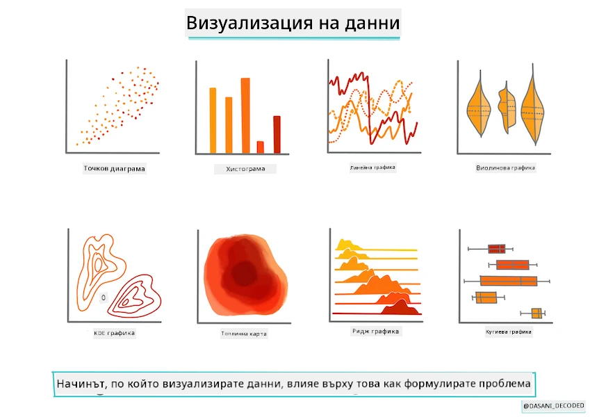
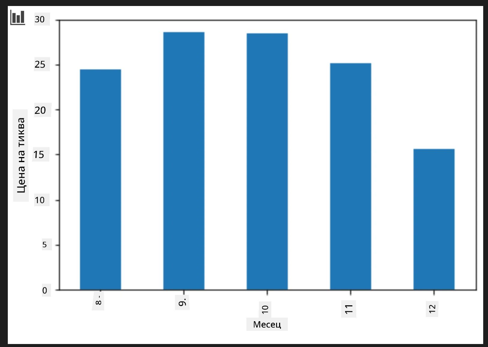
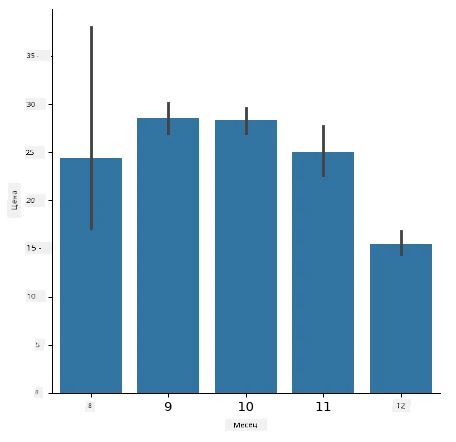

# Създаване на регресионен модел с помощта на Scikit-learn: подготвяне и визуализация на данни



Инфографика от [Dasani Madipalli](https://twitter.com/dasani_decoded)

## [Квиз преди лекцията](https://ff-quizzes.netlify.app/en/ml/)

> ### [Този урок е наличен на R!](../../../../2-Regression/2-Data/solution/R/lesson_2.html)

## Въведение

След като вече разполагате с необходимите инструменти, за да започнете да създавате модели за машинно обучение със Scikit-learn, сте готови да започнете да задавате въпроси към своите данни. Когато работите с данни и прилагате решения с машинно обучение, е много важно да разберете как да зададете правилния въпрос, за да отключите пълния потенциал на вашия набор от данни.

В този урок ще научите:

- Как да подготвите данните си за създаване на модел.
- Как да използвате Matplotlib за визуализация на данни.
- Как да използвате Seaborn за по-изразителна визуализация на данни.

## Задаване на правилния въпрос към вашите данни

Въпросът, на който трябва да получите отговор, ще определи какъв вид алгоритми за машинно обучение ще използвате. А качеството на отговора, който получите, ще зависи силно от естеството на вашите данни.

Разгледайте [данните](https://github.com/microsoft/ML-For-Beginners/blob/main/2-Regression/data/US-pumpkins.csv), предоставени за този урок. Можете да отворите този .csv файл във VS Code. Бърз преглед веднага показва, че има празни места и смес от низове и числови данни. Има и странна колона, наречена 'Package', където данните са смес от 'sacks', 'bins' и други стойности. Данните всъщност са малко объркани.

[](https://youtu.be/5qGjczWTrDQ "ML за начинаещи - Как да анализирате и почистите набор от данни")

> 🎥 Кликнете върху изображението по-горе за кратко видео, в което се разглежда подготовката на данните за този урок.

Всъщност не е често да получите директно набор от данни, който да е напълно готов за създаване на модел за машинно обучение. В този урок ще научите как да подготвите суров набор от данни, използвайки стандартни библиотеки на Python. Също така ще научите различни техники за визуализация на данните.

## Казус: „пазара на тиквите“

В тази папка ще намерите .csv файл в основната папка `data`, наречен [US-pumpkins.csv](https://github.com/microsoft/ML-For-Beginners/blob/main/2-Regression/data/US-pumpkins.csv), който съдържа 1757 реда с данни за пазара на тикви, сортирани по групи по градове. Това са сурови данни, извлечени от [Специализираните терминални пазари за култури - стандартни отчети](https://www.marketnews.usda.gov/mnp/fv-report-config-step1?type=termPrice), разпространявани от Министерството на земеделието на САЩ.

### Подготовка на данните

Тези данни са в публично достояние. Могат да бъдат изтеглени в много отделни файлове, по градове, от уебсайта на USDA. За да избегнем твърде много отделни файлове, ние сме обединили всички градски данни в една таблица, така че вече сме леко _подготвили_ данните. След това нека разгледаме по-подробно данните.

### Данните за тиквите - първоначални заключения

Какво забелязвате по тези данни? Вече видяхте, че има смесица от низове, числа, празни места и странни стойности, които трябва да разберете.

Какъв въпрос можете да зададете към тези данни, използвайки техника на регресия? Например „Прогнозирай цената на тиква за продажба през даден месец“. Като погледнете отново данните, има някои промени, които трябва да направите, за да създадете необходимата структура от данни за тази задача.
## Упражнение - анализирайте данните за тиквите

Нека използваме [Pandas](https://pandas.pydata.org/) (името означава `Python Data Analysis`), много полезен инструмент за оформяне на данни, за да анализираме и подготвим тези данни за тикви.

### Първо, проверете за липсващи дати

Първо ще трябва да предприемете стъпки, за да проверите за липсващи дати:

1. Преобразувайте датите във формат месец (това са американски дати, така че форматът е `MM/DD/YYYY`).
2. Извлечете месеца в нова колона.

Отворете файла _notebook.ipynb_ във Visual Studio Code и импортирайте таблицата в нов Pandas dataframe.

1. Използвайте функцията `head()` за преглед на първите пет реда.

    ```python
    import pandas as pd
    pumpkins = pd.read_csv('../data/US-pumpkins.csv')
    pumpkins.head()
    ```

    ✅ Коя функция бихте използвали, за да видите последните пет реда?

1. Проверете дали има липсващи данни в текущия dataframe:

    ```python
    pumpkins.isnull().sum()
    ```

    Има липсващи данни, но може би това няма да е важно за настоящата задача.

1. За да улесните работата с dataframe, изберете само нужните колони, като използвате функцията `loc`, която извлича от оригиналния dataframe група от редове (първи параметър) и колони (втори параметър). Изразът `:` в случая означава „всички редове“.

    ```python
    columns_to_select = ['Package', 'Low Price', 'High Price', 'Date']
    pumpkins = pumpkins.loc[:, columns_to_select]
    ```

### Второ, определете средната цена на тиква

Помислете как да определите средната цена на тиква за даден месец. Кои колони бихте избрали за тази задача? Подсказка: ще ви трябват 3 колони.

Решение: вземете средната стойност на колоните `Low Price` и `High Price`, за да попълните новата колона Price, и преобразувайте колоната Date, така че да показва само месеца. За щастие, според проверката по-горе, няма липсващи данни за дати или цени.

1. За да изчислите средната стойност, добавете следния код:

    ```python
    price = (pumpkins['Low Price'] + pumpkins['High Price']) / 2

    month = pd.DatetimeIndex(pumpkins['Date']).month

    ```

   ✅ Чувствайте се свободни да отпечатате всякакви данни, които искате да проверите, използвайки `print(month)`.

2. Сега копирайте преобразуваните си данни в нов Pandas dataframe:

    ```python
    new_pumpkins = pd.DataFrame({'Month': month, 'Package': pumpkins['Package'], 'Low Price': pumpkins['Low Price'],'High Price': pumpkins['High Price'], 'Price': price})
    ```

    Отпечатването на dataframe ще ви покаже чист и организиран набор от данни, върху който можете да изградите новия си регресионен модел.

### Но чакайте! Нещо странно

Ако погледнете колоната `Package`, тиквите се продават в много различни конфигурации. Някои се продават в мерки „1 1/9 бушел“, други в „1/2 бушел“, някои на брой, някои на паунд, и някои в големи кутии с различна ширина.

> Тиквите изглеждат много трудни за претегляне по постоянен начин

При по-задълбочен поглед върху оригиналните данни, е интересно, че всичко със `Unit of Sale`, равно на 'EACH' или 'PER BIN', има също `Package` тип на инч, на кош, или 'всяка'. Изглежда тиквите са много трудни за претегляне по постоянен начин, затова ще ги филтрираме като изберем само тиквите с низа 'bushel' в колоната `Package`.

1. Добавете филтър в началото на файла, под първоначалния .csv импорт:

    ```python
    pumpkins = pumpkins[pumpkins['Package'].str.contains('bushel', case=True, regex=True)]
    ```

    Ако отпечатате данните сега, ще видите, че получавате само около 415 реда от данни, съдържащи тикви на бушел.

### Но чакайте! Остава още нещо за правене

Забелязахте ли, че количеството бушели варира при всеки ред? Трябва да нормализирате цените, така че да показват ценообразуването за бушел, затова направете някои математически операции, за да го стандартизирате.

1. Добавете тези редове след блока, създаващ новия dataframe new_pumpkins:

    ```python
    new_pumpkins.loc[new_pumpkins['Package'].str.contains('1 1/9'), 'Price'] = price/(1 + 1/9)

    new_pumpkins.loc[new_pumpkins['Package'].str.contains('1/2'), 'Price'] = price/(1/2)
    ```

✅ Според [The Spruce Eats](https://www.thespruceeats.com/how-much-is-a-bushel-1389308), теглото на бушел зависи от вида на продукцията, тъй като той е обемна мярка. „Например, бушел домати трябва да тежи 56 паунда... Листата и зеленчуците заемат повече място с по-малко тегло, така че бушел спанак тежи само 20 паунда.“ Всичко това е доста сложно! Нека не се занимаваме с преобразуването от бушел към паунд, а вместо това да ценим на бушел. Въпреки това целият този анализ на бушели тикви показва колко е важно да разберем естеството на нашите данни!

Сега можете да анализирате ценообразуването на единица, базирано на мерките им в бушели. Ако отпечатате данните още веднъж, ще видите как са стандартизирани.

✅ Забелязахте ли, че тиквите, продавани на половин бушел, са много скъпи? Можете ли да разберете защо? Подсказка: малките тикви са много по-скъпи от големите, вероятно защото има много повече от тях на бушел, като се има предвид неизползваното пространство, което заема една голяма куха тиква за пай.

## Стратегии за визуализация

Част от ролята на специалиста по данни е да демонстрира качеството и естеството на данните, с които работи. За това те често създават интересни визуализации, графики, диаграми и таблици, които показват различни аспекти на данните. По този начин те могат визуално да покажат зависимости и пропуски, които иначе е трудно да се открият.

[](https://youtu.be/SbUkxH6IJo0 "ML за начинаещи - Как да визуализираме данни с Matplotlib")

> 🎥 Кликнете върху изображението по-горе за кратко видео, в което се разглежда визуализирането на данните за този урок.

Визуализациите могат също така да помогнат за определяне на машинната обучителна техника, най-подходяща за данните. Например точкова диаграма (scatterplot), която изглежда следва линия, показва, че данните са добър кандидат за упражнение с линейна регресия.

Една библиотека за визуализация, която работи добре в Jupyter notebooks, е [Matplotlib](https://matplotlib.org/) (която видяхте и в предишния урок).

> Придобийте повече опит с визуализацията на данни в [тези уроци](https://docs.microsoft.com/learn/modules/explore-analyze-data-with-python?WT.mc_id=academic-77952-leestott).

## Упражнение - експериментирайте с Matplotlib

Опитайте се да създадете някои базови графики, за да покажете новия dataframe, който току-що създадохте. Какво би показала базова линейна графика?

1. Импортирайте Matplotlib в началото на файла, под импорта на Pandas:

    ```python
    import matplotlib.pyplot as plt
    ```

1. Стартирайте цялото notebook отново, за да го обновите.
1. В долната част на notebook добавете клетка, която да нарисува данните като кутиева диаграма:

    ```python
    price = new_pumpkins.Price
    month = new_pumpkins.Month
    plt.scatter(price, month)
    plt.show()
    ```

    

    Полезна ли е тази графика? Нещо ли ви изненадва в нея?

    Тя не е особено полезна, тъй като просто показва разпределението на данните Ви като точки в даден месец.

### Направете я полезна

За да получите графики, които показват полезни данни, обикновено трябва да групирате данните по някакъв начин. Нека опитаме да създадем графика, където y-оста показва месеците, а данните илюстрират разпределението на данните.

1. Добавете клетка, която да създаде групирана стълбова диаграма:

    ```python
    new_pumpkins.groupby(['Month'])['Price'].mean().plot(kind='bar')
    plt.ylabel("Pumpkin Price")
    ```

    

    Това е по-полезна визуализация на данни! Изглежда показва, че най-високата цена на тиквите е през септември и октомври. Това отговаря ли на вашите очаквания? Защо или защо не?

## Упражнение - експериментирайте със Seaborn

Matplotlib е мощен, но може да изисква много код, за да се получи полиранa графика. [Seaborn](https://seaborn.pydata.org/) е библиотека, изградена _върху_ Matplotlib, предназначена за статистическа визуализация на данни. Тя работи директно с Pandas dataframe, прилага атрактивни стилове по подразбиране и ви позволява да създавате информативни графики с много по-малко код. Тъй като Seaborn връща Matplotlib обекти, можете все още да използвате всичко, което вече знаете за Matplotlib, за да донастроите резултата.

> Ако все още нямате инсталиран Seaborn, инсталирайте го с `pip install seaborn`.

1. Импортирайте Seaborn в началото на notebook, под другите импорти. По конвенция се импортира като `sns`:

    ```python
    import seaborn as sns
    ```

### Точкови графики за показване на зависимости

Голяма част от изследването на данните преди създаване на модел е търсенето на _зависимости_ между променливите. [Точкова графика](https://en.wikipedia.org/wiki/Scatter_plot) е един от най-добрите инструменти за това: ако точките изглежда следват линия, двете променливи може да са корелирани, което е добър знак, че линейният регресионен модел може да работи.

1. Пресъздайте точковата графика цена-срещу-месец от преди, но този път използвайте Seaborn [`relplot()`](https://seaborn.pydata.org/generated/seaborn.relplot.html) (релационна графика), която работи директно с колоните на вашия dataframe:

    ```python
    sns.relplot(x="Price", y="Month", data=new_pumpkins)
    ```

    

    Забележете как подавате _имената на колоните_ и dataframe, а Seaborn се грижи за надписите на осите.

2. Можете да превключите на линейна графика, като подадете `kind="line"`. Seaborn дори чертае засенчена лента, показваща доверителния интервал около линията:

    ```python
    sns.relplot(x="Price", y="Month", kind="line", data=new_pumpkins)
    ```

    

    Тези конкретни данни са доста шумни, така че линейната графика не е най-ясният избор тук — но показва колко лесно можете да променяте типове графики в Seaborn.

### Стълбови диаграми за показване на разпределения


По-рано вие групирахте данните ръчно, за да създадете лентов диаграма с Matplotlib. [`catplot()`](https://seaborn.pydata.org/generated/seaborn.catplot.html) на Seaborn (категориален график) може да направи групирането и агрегирането вместо вас. По подразбиране `kind="bar"` показва средното на всяка категория заедно с черна линия, която обозначава интервала на доверие.

1. Създайте лентов диаграма на средната цена за месец:

    ```python
    sns.catplot(x="Month", y="Price", data=new_pumpkins, kind="bar")
    ```

    

    Това потвърждава това, което видяхте с Matplotlib — цените достигат пика си около септември и октомври — но Seaborn също визуализира колко _варира_ цената в рамките на всеки месец.

### Топлинни карти за показване на корелации

Диаграмите с разпръскване сравняват две променливи наведнъж. Когато имате няколко числови колони, [топлинна карта](https://en.wikipedia.org/wiki/Heat_map) ви позволява да видите силата на връзката между _всяка_ двойка колони едновременно. Това е често използван начин за откриване кои характеристики са най-корелирани, преди да изберете какво да подавате в модел (и същият вид диаграма по-късно се използва за показване на матрици на объркване при класификация).

1. Изградете корелационна матрица с Pandas, после я начертайте с [`heatmap()`](https://seaborn.pydata.org/generated/seaborn.heatmap.html) на Seaborn. Опцията `annot=True` отпечатва корелационните стойности във всяка клетка:

    ```python
    correlations = new_pumpkins[['Month', 'Low Price', 'High Price', 'Price']].corr()
    sns.heatmap(correlations, annot=True, cmap="coolwarm")
    ```

    

    Стойности близки до `1` (или `-1`) означават, че колоните са силно _линейно_ корелирани. Обърнете внимание как `Low Price` и `High Price` са почти перфектно корелирани. От друга страна, `Month` показва само слаба линейна корелация с цената — въпреки че лентовата диаграма по-горе разкрива ясно сезонен пик през септември и октомври. Това е важен урок: коефициентът на корелация измерва само _праволинейни_ връзки, така че може да пропусне сезонни или други нелинейни модели. ✅ Защо е полезно да разглеждате както топлинна карта, *така и* диаграми като лентовата преди да решите кои колони да използвате?

### Matplotlib или Seaborn?

Двете библиотеки си струва да ги знаете:

- **Matplotlib** ви дава детайлен контрол върху всеки елемент на диаграмата и е основата, върху която почти всички други Python библиотеки за графики се изграждат.
- **Seaborn** предоставя функции от по-високо ниво и привлекателни настройки за статистически диаграми, работи директно с dataframe-и и често е по-бърз за експлораторен анализ на данни.

Често срещан сценарий е първо да използвате Seaborn за бързо разглеждане на данните, а после да преминете към Matplotlib, когато трябва да персонализирате детайлите.

---

## 🚀Предизвикателство

Изследвайте различните типове визуализации, които предлагат Matplotlib и Seaborn. Кои типове са най-подходящи за регресионни задачи?

## [Кратък тест след лекцията](https://ff-quizzes.netlify.app/en/ml/)

## Преглед и Самостоятельно учене

Вижте многобройните начини за визуализация на данни. Направете списък на наличните библиотеки и отбележете кои са най-подходящи за дадени задачи, например 2D визуализации срещу 3D визуализации. Какво откривате?

## Задача

[Изследване на визуализацията](assignment.md)

---

<!-- CO-OP TRANSLATOR DISCLAIMER START -->
**Отказ от отговорност**:
Този документ е преведен с помощта на AI преводачески услуга [Co-op Translator](https://github.com/Azure/co-op-translator). Въпреки че се стремим към точност, моля имайте предвид, че автоматизираните преводи могат да съдържат грешки или неточности. Оригиналният документ на неговия роден език трябва да се счита за авторитетен източник. За критична информация се препоръчва професионален човешки превод. Ние не носим отговорност за каквито и да е недоразумения или неправилни тълкувания, произтичащи от използването на този превод.
<!-- CO-OP TRANSLATOR DISCLAIMER END -->