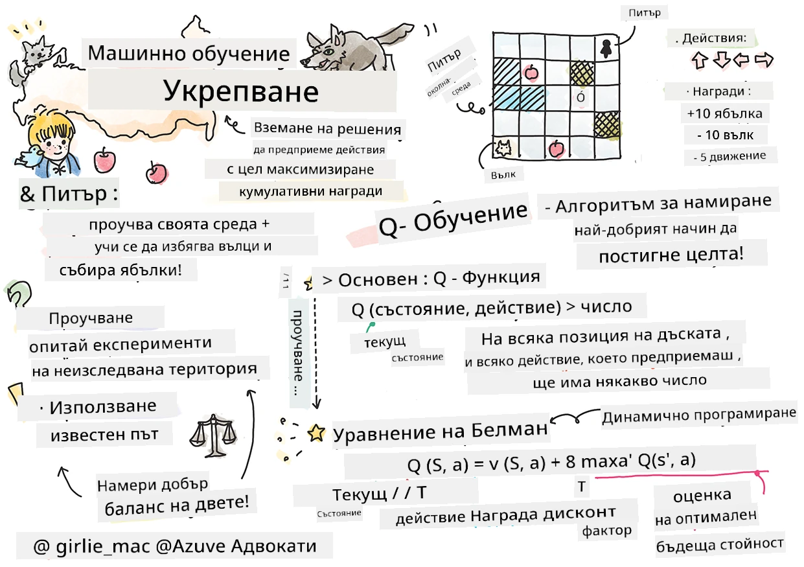

# Въведение в подсилващото обучение и Q-обучението


> Скично от [Tomomi Imura](https://www.twitter.com/girlie_mac)

Подсилващото обучение включва три важни понятия: агент, няколко състояния и набор от действия за всяко състояние. Като изпълнява действие в определено състояние, агентът получава награда. Представете си отново компютърната игра Super Mario. Вие сте Марио, в ниво на игра, стоите до ръба на скала. Над вас има монета. Вие, като Марио, в ниво на игра, на конкретна позиция ... това е вашето състояние. Да направите една крачка вдясно (действие) ще ви изхвърли през ръба, и това ще ви даде нисък числов резултат. Обаче, като натиснете бутона за скок, ще спечелите точка и ще останете жив. Това е положителен резултат и трябва да ви награди с положителна числова оценка.

Използвайки подсилващо обучение и симулатор (играта), можете да научите как да играете играта, за да максимизирате наградата, която е да останете живи и да съберете колкото се може повече точки.

[](https://www.youtube.com/watch?v=lDq_en8RNOo)

> 🎥 Кликнете върху изображението по-горе, за да чуете Дмитрий да обсъжда Подсилващото обучение

## [Предварителен тест](https://ff-quizzes.netlify.app/en/ml/)

## Предварителни условия и настройка

В този урок ще експериментираме с някакъв код на Python. Трябва да можете да стартирате кода в Jupyter Notebook от този урок, или на вашия компютър, или някъде в облака.

Можете да отворите [учебния ноутбук](https://github.com/microsoft/ML-For-Beginners/blob/main/8-Reinforcement/1-QLearning/notebook.ipynb) и да преминете през този урок, за да изградите.

> **Забележка:** Ако отваряте този код от облака, трябва да изтеглите и файла [`rlboard.py`](https://github.com/microsoft/ML-For-Beginners/blob/main/8-Reinforcement/1-QLearning/rlboard.py), който се използва в кода на ноутбука. Добавете го в същата директория с ноутбука.

## Въведение

В този урок ще разгледаме света на **[Питър и вълкът](https://en.wikipedia.org/wiki/Peter_and_the_Wolf)**, вдъхновен от музикална приказка на руския композитор [Сергеј Прокофиев](https://en.wikipedia.org/wiki/Sergei_Prokofiev). Ще използваме **подсилващо обучение**, за да позволим на Питър да изследва своята среда, да събира вкусни ябълки и да избягва срещата с вълка.

**Подсилващото обучение** (RL) е техника на обучение, която ни позволява да научим оптимално поведение на **агента** в някаква **среда** чрез провеждане на множество експерименти. Агентът в тази среда трябва да има някаква **цел**, дефинирана чрез **функция на наградата**.

## Средата

За простота, нека светът на Питър да бъде квадратна дъска с размер `ширина` x `височина`, ето така:


Всяка клетка на тази дъска може да бъде:

* **земя**, по която Питър и други създания могат да ходят.
* **вода**, по която очевидно не може да се ходи.
* **дърво** или **тръстика**, място, където може да се почине.
* **ябълка**, която представлява нещо, което Питър би се радвал да намери, за да се нахрани.
* **вълк**, който е опасен и трябва да се избягва.

Има отделен Python модул, [`rlboard.py`](https://github.com/microsoft/ML-For-Beginners/blob/main/8-Reinforcement/1-QLearning/rlboard.py), който съдържа кода за работа с тази среда. Тъй като този код не е важен за разбирането на нашите концепции, ще импортираме модула и ще го използваме, за да създадем примерна дъска (кодов блок 1):

```python
from rlboard import *

width, height = 8,8
m = Board(width,height)
m.randomize(seed=13)
m.plot()
```

Този код трябва да изведе изображение на средата, подобно на показаното по-горе.

## Действия и политика

В нашия пример целта на Питър е да намери ябълка, като същевременно избягва вълка и други препятствия. За да направи това, той просто може да се разхожда, докато не намери ябълка.

Затова, на всяка позиция той може да избере едно от следните действия: нагоре, надолу, наляво и надясно.

Ще дефинираме тези действия като речник и ще ги асоциираме с двойки от съответните промени в координатите. Например, движението надясно (`R`) ще съответства на двойка `(1,0)`. (кодов блок 2):

```python
actions = { "U" : (0,-1), "D" : (0,1), "L" : (-1,0), "R" : (1,0) }
action_idx = { a : i for i,a in enumerate(actions.keys()) }
```

В резюме, стратегията и целта на този сценарий са както следва:

- **Стратегията**, на нашия агент (Питър) се дефинира чрез т.нар. **политика**. Политиката е функция, която връща действието във всяко дадено състояние. В нашия случай, състоянието на проблема се представя чрез дъската, включително и текущата позиция на играча.

- **Целта** на подсилващото обучение е в крайна сметка да научи добра политика, която да ни позволи да решим проблема ефективно. Но като изходна точка, нека разгледаме най-простата политика, наречена **случайна разходка**.

## Случайна разходка

Нека първо решим нашия проблем като реализираме стратегия за случайна разходка. При случайна разходка ние на произволен принцип избираме следващото действие измежду позволените, докато не достигнем ябълката (кодов блок 3).

1. Реализирайте случайната разходка с долния код:

    ```python
    def random_policy(m):
        return random.choice(list(actions))
    
    def walk(m,policy,start_position=None):
        n = 0 # брой стъпки
        # задаване на начална позиция
        if start_position:
            m.human = start_position 
        else:
            m.random_start()
        while True:
            if m.at() == Board.Cell.apple:
                return n # успех!
            if m.at() in [Board.Cell.wolf, Board.Cell.water]:
                return -1 # изяден от вълк или удавен
            while True:
                a = actions[policy(m)]
                new_pos = m.move_pos(m.human,a)
                if m.is_valid(new_pos) and m.at(new_pos)!=Board.Cell.water:
                    m.move(a) # извършване на действителното движение
                    break
            n+=1
    
    walk(m,random_policy)
    ```

    Извикването на `walk` трябва да върне дължината на съответния път, който може да варира от едно изпълнение до друго.

1. Стартирайте експеримента с разходката няколко пъти (например 100) и изведете получената статистика (кодов блок 4):

    ```python
    def print_statistics(policy):
        s,w,n = 0,0,0
        for _ in range(100):
            z = walk(m,policy)
            if z<0:
                w+=1
            else:
                s += z
                n += 1
        print(f"Average path length = {s/n}, eaten by wolf: {w} times")
    
    print_statistics(random_policy)
    ```

    Обърнете внимание, че средната дължина на пътя е около 30-40 стъпки, което е доста много, имайки предвид факта, че средното разстояние до най-близката ябълка е около 5-6 стъпки.

    Можете също така да видите как изглежда движението на Питър по време на случайната разходка:

    

## Функция за награда

За да направим нашата политика по-интелигентна, трябва да разберем кои ходове са "по-добри" от други. За да направим това, трябва да дефинираме нашата цел.

Целта може да бъде дефинирана чрез **функция на наградата**, която ще връща някаква стойност за всяко състояние. Колкото по-високо е числото, толкова по-добра е функцията на наградата. (кодов блок 5)

```python
move_reward = -0.1
goal_reward = 10
end_reward = -10

def reward(m,pos=None):
    pos = pos or m.human
    if not m.is_valid(pos):
        return end_reward
    x = m.at(pos)
    if x==Board.Cell.water or x == Board.Cell.wolf:
        return end_reward
    if x==Board.Cell.apple:
        return goal_reward
    return move_reward
```

Интересно при функциите на наградата е, че в повечето случаи *получаваме съществена награда само в края на играта*. Това означава, че нашият алгоритъм трябва по някакъв начин да запомни "добрите" стъпки, които водят до положителна награда в края, и да увеличи тяхната важност. Съответно, всички ходове, които водят до лоши резултати, трябва да бъдат възпрепятствани.

## Q-обучение

Алгоритъмът, който ще обсъдим тук, се нарича **Q-обучение**. При този алгоритъм политиката се дефинира чрез функция (или структура от данни), наречена **Q-таблица**. Тя записва "доброто" на всяко от действията в дадено състояние.

Тя се нарича Q-таблица, защото често е удобно да бъде представена като таблица или многомерен масив. Тъй като нашата дъска има размери `ширина` x `височина`, можем да представим Q-таблицата като numpy масив с форма `ширина` x `височина` x `len(actions)`: (кодов блок 6)

```python
Q = np.ones((width,height,len(actions)),dtype=np.float)*1.0/len(actions)
```

Забележете, че инициализираме всички стойности на Q-таблицата с еднаква стойност, в нашия случай - 0.25. Това съответства на политиката "случайна разходка", защото всички ходове във всяко състояние са еднакво добри. Можем да подадем Q-таблицата на функцията `plot`, за да визуализираме таблицата върху дъската: `m.plot(Q)`.


В центъра на всяка клетка има "стрелка", която указва предпочитаната посока на движение. Тъй като всички посоки са равни, се показва точка.

Сега трябва да стартираме симулацията, да изследваме нашата среда и да научим по-добро разпределение на стойностите в Q-таблицата, което ще ни позволи да намерим пътя до ябълката много по-бързо.

## Същност на Q-обучението: уравнението на Белман

След като започнем да се движим, всяко действие ще има съответна награда, т.е. теоретично можем да изберем следващото действие въз основа на най-високата непосредствена награда. Въпреки това в повечето състояния ходът няма да ни доведе до целта – достигането до ябълката, и затова не можем веднага да решим коя посока е по-добра.

> Запомнете, че не непосредственият резултат е важен, а по-скоро крайният резултат, който ще получим в края на симулацията.

За да отчетем това отложено възнаграждение, трябва да използваме принципите на **[динамичното програмиране](https://en.wikipedia.org/wiki/Dynamic_programming)**, които ни позволяват да разсъждаваме за проблема рекурсивно.

Нека сме в състояние *s* и искаме да преминем в следващото състояние *s'*. Като направим това, ще получим непосредствена награда *r(s,a)*, дефинирана от функцията на наградата, плюс някаква бъдеща награда. Ако предположим, че нашата Q-таблица правилно отразява "атрактивността" на всяко действие, тогава в състояние *s'* ще изберем действие *a*, което съответства на максималната стойност на *Q(s',a')*. Следователно най-добрата бъдеща награда, която можем да получим в състояние *s*, ще бъде дефинирана като `max`<sub>a'</sub>*Q(s',a')* (максимумът тук се изчислява за всички възможни действия *a'* в състояние *s'*).

Това дава **формулата на Белман** за изчисляване на стойността на Q-таблицата в състояние *s*, при дадено действие *a*:


Тук γ е т.нар. **фактор на намаление**, който определя до каква степен трябва да предпочитате текущата награда пред бъдещата и обратно.

## Алгоритъм на обучение

Според горното уравнение можем сега да напишем псевдокод за нашия алгоритъм на обучение:

* Инициализирайте Q-таблицата Q с равни стойности за всички състояния и действия
* Задайте скорост на учене α ← 1
* Повтаряйте симулацията многократно
   1. Започнете от произволна позиция
   1. Повтаряйте
        1. Изберете действие *a* в състояние *s*
        2. Изпълнете действието като се преместите в ново състояние *s'*
        3. Ако настъпи условие за край на играта или общата награда е твърде малка - излезте от симулацията  
        4. Изчислете наградата *r* в новото състояние
        5. Обновете Q-функцията според уравнението на Белман: *Q(s,a)* ← *(1-α)Q(s,a)+α(r+γ max<sub>a'</sub>Q(s',a'))*
        6. *s* ← *s'*
        7. Обновете общата награда и намалете α.

## Използване срещу изследване

В горния алгоритъм не посочихме как точно да избираме действие на стъпка 2.1. Ако избираме действието случайно, ние случайно **изследваме** средата, и е много вероятно често да "умираме", както и да изследваме области, където нормално не бихме отишли. Алтернативен подход е да **използваме** стойностите от Q-таблицата, които вече знаем, и по този начин да изберем най-доброто действие (с по-висока стойност в Q-таблицата) в състояние *s*. Това обаче ще ни спре да изследваме други състояния и е вероятно да не намерим оптималното решение.

Следователно, най-добрият подход е да се намери баланс между изследване и използване. Това може да стане, като изберем действие в състояние *s* с вероятности, пропорционални на стойностите в Q-таблицата. В началото, когато стойностите в Q-таблицата са всички еднакви, това ще съответства на случайно избиране, но докато учим повече за нашата среда, ще сме по-склонни да следваме оптималния маршрут, като позволяваме на агента от време на време да поеме неизследван път.

## Реализация на Python

Сега сме готови да реализираме алгоритъма на обучение. Преди това трябва също така да имаме функция, която да превръща произволни числа в Q-таблицата в вектор от вероятности за съответните действия.

1. Създайте функция `probs()`:

    ```python
    def probs(v,eps=1e-4):
        v = v-v.min()+eps
        v = v/v.sum()
        return v
    ```

    Добавяме няколко `eps` към оригиналния вектор, за да избегнем деление на 0 в началния случай, когато всички компоненти на вектора са еднакви.

Стартирайте алгоритъма на обучение през 5000 експеримента, наречени още **епохи**: (кодов блок 8)
```python
    for epoch in range(5000):
    
        # Изберете начална точка
        m.random_start()
        
        # Започнете пътуването
        n=0
        cum_reward = 0
        while True:
            x,y = m.human
            v = probs(Q[x,y])
            a = random.choices(list(actions),weights=v)[0]
            dpos = actions[a]
            m.move(dpos,check_correctness=False) # позволяваме на играча да се движи извън дъската, което прекратява епизода
            r = reward(m)
            cum_reward += r
            if r==end_reward or cum_reward < -1000:
                lpath.append(n)
                break
            alpha = np.exp(-n / 10e5)
            gamma = 0.5
            ai = action_idx[a]
            Q[x,y,ai] = (1 - alpha) * Q[x,y,ai] + alpha * (r + gamma * Q[x+dpos[0], y+dpos[1]].max())
            n+=1
```

След изпълнението на този алгоритъм Q-таблицата трябва да е обновена със стойности, които определят атрактивността на различните действия на всяка стъпка. Можем да опитаме да визуализираме Q-таблицата, като изрисуваме вектор във всяка клетка, който сочи в желаната посока на движение. За простота чертаем малък кръг вместо острие на стрелка.


## Проверка на политиката

Тъй като Q-таблицата изброява "атрактивността" на всяко действие във всяко състояние, лесно можем да я използваме, за да определим ефективна навигация в нашия свят. В най-простия случай можем да изберем действието, съответстващо на най-високата стойност в Q-таблицата: (кодов блок 9)

```python
def qpolicy_strict(m):
        x,y = m.human
        v = probs(Q[x,y])
        a = list(actions)[np.argmax(v)]
        return a

walk(m,qpolicy_strict)
```


> Ако опитате горния код няколко пъти, може да забележите, че понякога той „виси“ и трябва да натиснете бутона STOP в тетрадката, за да го прекъснете. Това се случва, защото може да има ситуации, в които две състояния „сочат“ едно към друго по отношение на оптималната Q-стойност, при което агентът започва да се движи между тези състояния безкрайно.

## 🚀Предизвикателство

> **Задача 1:** Модифицирайте функцията `walk`, така че да ограничи максималната дължина на пътя до определен брой стъпки (например 100) и наблюдавайте как горният код от време на време връща тази стойност.

> **Задача 2:** Модифицирайте функцията `walk`, така че тя да не се връща на места, на които вече е била преди. Това ще предотврати безкрайни цикли в `walk`, но все пак агентът може да се окаже „заложен“ на място, от което не може да избяга.

## Навигация

По-добра навигационна политика би била тази, която използвахме по време на обучението, която комбинира експлоатация и изследване. В тази политика ще избираме всяко действие с определена вероятност, пропорционална на стойностите в Q-таблицата. Тази стратегия все още може да доведе до връщане на агента на вече изследвано място, но, както виждате от кода по-долу, резултира в много кратък среден път до желания обект (помнете, че `print_statistics` изпълнява симулацията 100 пъти): (кодов блок 10)

```python
def qpolicy(m):
        x,y = m.human
        v = probs(Q[x,y])
        a = random.choices(list(actions),weights=v)[0]
        return a

print_statistics(qpolicy)
```

След изпълнението на този код, трябва да получите много по-малка средна дължина на пътя отколкото преди, в диапазона 3-6.

## Изследване на процеса на учене

Както споменахме, процесът на учене е баланс между изследване и експлоатация на придобитите знания за структурата на проблема. Видяхме, че резултатите от обучението (способността да помогне на агента да намери кратък път до целта) са се подобрили, но е интересно да наблюдаваме как средната дължина на пътя се променя по време на процеса на учене:


Изводите могат да се обобщят по следния начин:

- **Средната дължина на пътя се увеличава**. Това, което виждаме тук, е, че първоначално средната дължина на пътя се увеличава. Това вероятно се дължи на факта, че когато не знаем нищо за околната среда, сме склонни да се озоваваме в лоши състояния като вода или вълк. С напредването на ученето и използването на знанията, можем да изследваме средата по-дълго, но все още не знаем много добре къде са ябълките.

- **Дължината на пътя намалява, докато учим повече**. След като научим достатъчно, на агента става по-лесно да достигне целта и дължината на пътя започва да намалява. Все пак сме отворени към изследване, затова често се отклоняваме от най-добрия път и изследваме нови опции, което прави пътя по-дълъг от оптималния.

- **Дължината рязко се увеличава**. Освен това на тази графика се наблюдава, че в някакъв момент дължината се увеличава рязко. Това показва стохастичния характер на процеса и че можем в някакъв момент да „развалим“ коефициентите в Q-таблицата, като ги презапишем с нови стойности. Идеално това трябва да бъде минимизирано чрез намаляване на скоростта на учене (например, към края на обучението коригираме стойностите в Q-таблицата с малки стойности).

Като цяло, важно е да запомните, че успехът и качеството на процеса на учене зависи значително от параметри, като скорост на учене, намаляване на скоростта на учене и фактор на дисконт. Те често се наричат **хиперпараметри**, за да се разграничат от **параметри**, които оптимизираме по време на обучението (например коефициентите в Q-таблицата). Процесът на намиране на най-добрите стойности за хиперпараметрите се нарича **оптимизация на хиперпараметрите** и заслужава отделна тема.

## [Квиз след лекцията](https://ff-quizzes.netlify.app/en/ml/)

## Задание 
[По-реалистичен свят](assignment.md)

---

<!-- CO-OP TRANSLATOR DISCLAIMER START -->
**Отказ от отговорност**:
Този документ е преведен с помощта на AI преводачески услуга [Co-op Translator](https://github.com/Azure/co-op-translator). Въпреки че се стремим към точност, моля имайте предвид, че автоматизираните преводи могат да съдържат грешки или неточности. Оригиналният документ на неговия роден език трябва да се счита за авторитетен източник. За критична информация се препоръчва професионален човешки превод. Ние не носим отговорност за каквито и да е недоразумения или неправилни тълкувания, произтичащи от използването на този превод.
<!-- CO-OP TRANSLATOR DISCLAIMER END -->