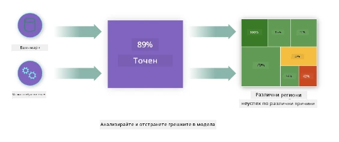
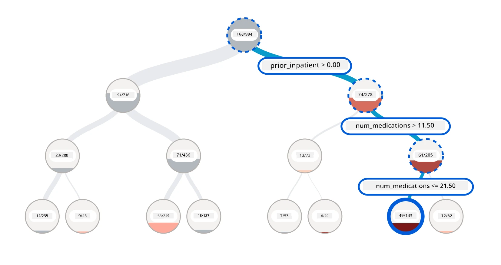
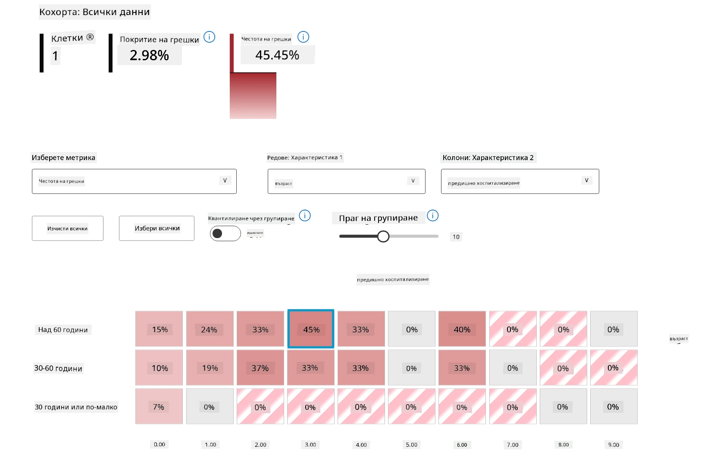
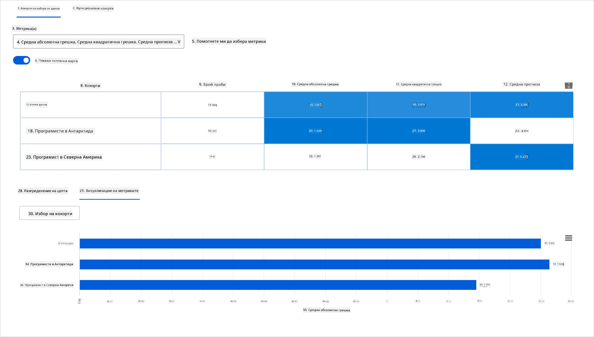
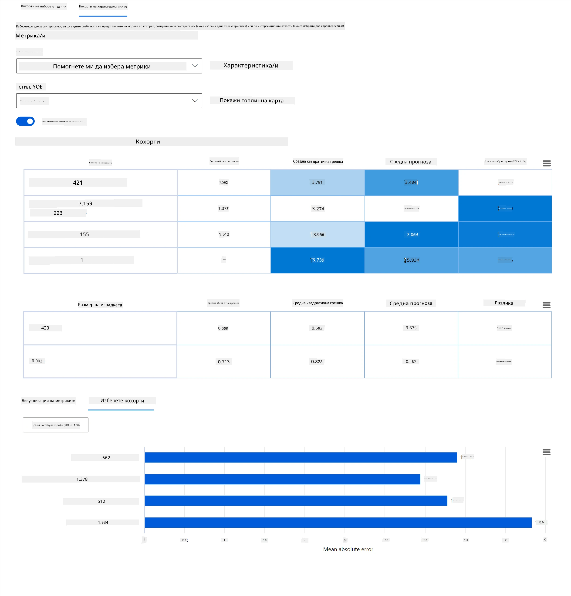
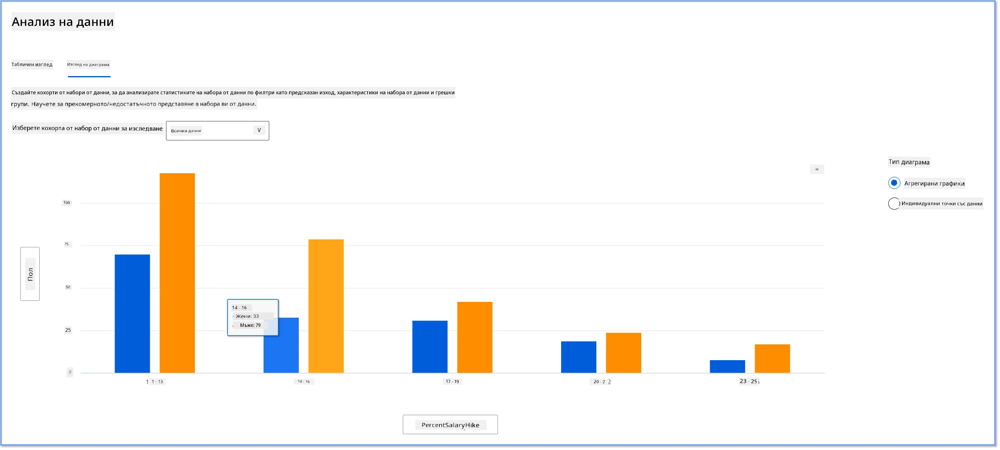
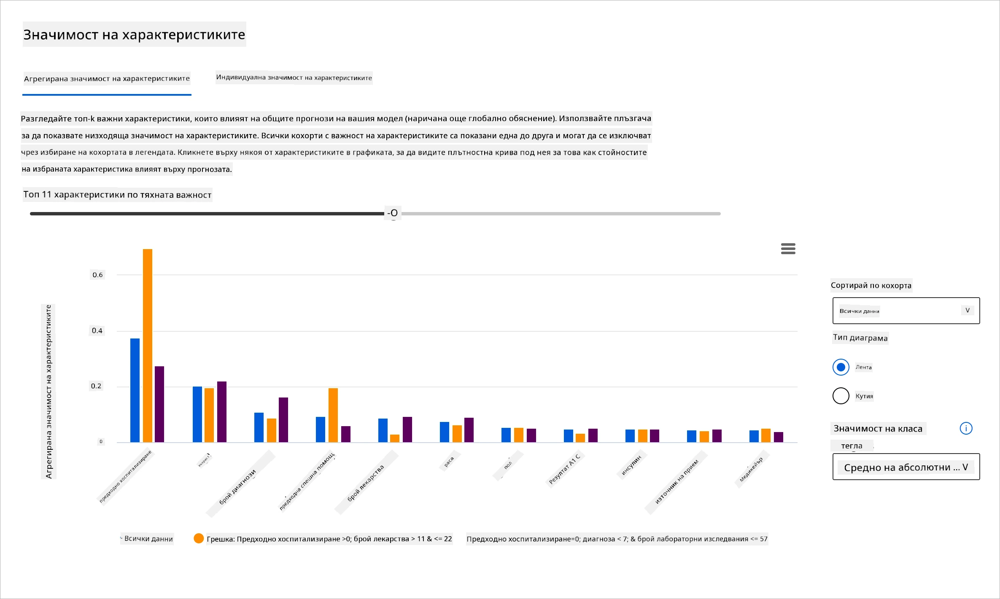
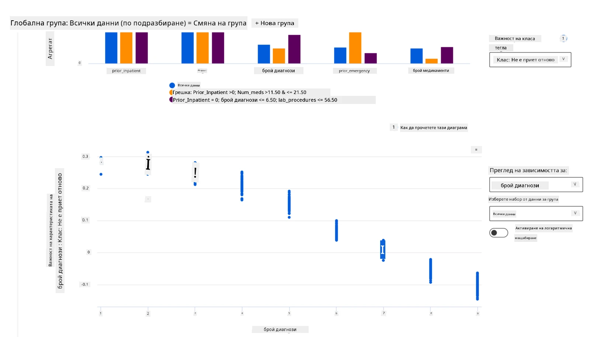

# Постскриптум: Отстраняване на грешки в модели за машинно обучение с помощта на компоненти от таблото за отговорен ИИ
 

## [Предварителен квиз](https://ff-quizzes.netlify.app/en/ml/)
 
## Въведение

Машинното обучение влияе на нашия ежедневен живот. Изкуственият интелект намира място в някои от най-важните системи, които засягат както отделните хора, така и обществото ни – от здравеопазване, финанси, образование до заетост. Например, системи и модели участват в ежедневни задачи за вземане на решения, като здравни диагнози или откриване на измами. В резултат на това напредъкът в ИИ, заедно с ускореното му внедряване, се среща с развиващи се обществени очаквания и растящо регулиране. Непрекъснато виждаме области, в които системите на ИИ продължават да не отговарят на очакванията; те разкриват нови предизвикателства; а правителствата започват да регулират ИИ решенията. Затова е важно тези модели да бъдат анализирани, за да предоставят справедливи, надеждни, включващи, прозрачни и отговорни резултати за всички.

В този курс ще разгледаме практични инструменти, които могат да се използват за оценка дали даден модел има проблеми с отговорния ИИ. Традиционните техники за отстраняване на грешки при машинното обучение обикновено се базират на количествени изчисления като агрегирана точност или средна загуба на грешка. Представете си какво може да се случи, ако данните, които използвате за изграждане на тези модели, не включват определени демографски групи, като раса, пол, политически възглед, религия, или непропорционално представят такива групи. Какво става, когато изходът на модела се интерпретира така, че да фаворизира някоя демографска група? Това може да въведе пре- или недопредставеност на тези чувствителни групи, причинявайки проблеми със справедливостта, включването или надеждността на модела. Друг фактор е, че моделите за машинно обучение се считат за черни кутии, което затруднява разбирането и обяснението на това какво движи предсказанието на модела. Всички тези предизвикателства срещат специалистите по данни и разработчиците на ИИ, когато нямат адекватни инструменти за отстраняване на грешки и оценка на справедливостта или надеждността на модела.

В този урок ще научите за отстраняване на грешки на вашите модели чрез:

-	**Анализ на грешки**: идентифициране къде в разпределението на данните моделът има високи нива на грешки.
-	**Преглед на модела**: извършване на сравнителен анализ на различни кохорти от данни, за да се открият различия в метриките за представяне на модела.
-	**Анализ на данни**: проучване къде може да има пре- или недопредставеност на данни, която да наклони модела да фаворизира една демографска група пред друга.
-	**Значимост на признаците**: разбиране кои признаци задвижват предсказанията на модела на глобално или локално ниво.

## Предварителни изисквания

Като предварително изискване, моля, преминете през прегледа [Инструменти за отговорен ИИ за разработчици](https://www.microsoft.com/ai/ai-lab-responsible-ai-dashboard)

> 

## Анализ на грешки

Традиционните метрики за представяне на модел, използвани за измерване на точност, са в по-голямата си част изчисления базирани на правилни срещу неправилни предсказания. Например, ако се определи, че моделът е точен 89% от времето с грешка от 0.001, това може да се счита за добро представяне. Грешките често не са равномерно разпределени в основния ви набор от данни. Може да получите резултат 89% точност на модела, но да откриете, че има различни региони от данните, в които моделът се проваля 42% от времето. Последствията от тези модели на провали с определени групи данни могат да доведат до проблеми със справедливостта или надеждността. Важно е да се разбере къде моделът се представя добре и къде не. Данните региони с висока неточност в модела може да се окажат важна демографска група.  

Компонентът Анализ на грешки в таблото за отговорен ИИ илюстрира как грешките на модела се разпределят сред различните кохорти с визуализация на дървовидна структура. Това е полезно за идентифициране на признаци или области, където има висока степен на грешки с вашия набор от данни. Като виждате откъде идват повечето неточности на модела, можете да започнете да изследвате основната причина. Можете също така да създавате кохорти от данни за извършване на анализ. Тези кохорти от данни помагат в процеса на отстраняване на грешки, за да се определи защо представянето на модела е добро в една кохорта, но грешно в друга.   

Визуалните индикатори на дървовидната карта помагат за по-бързо локализиране на проблемните области. Например, колкото по-тъмен е червеният цвят на възела, толкова по-висока е степента на грешки.  

Топлинната карта е друга визуална функционалност, която потребителите могат да използват за изследване на степента на грешки с помощта на един или два признака, за да открият фактор, допринасящ за грешките на модела в цял набор от данни или сред кохорти.

Използвайте анализа на грешки, когато трябва да:

* Получите дълбоко разбиране за начина, по който грешките на моделите се разпределят в набора от данни и в няколко измерения на вход и признаци.
* Разградите агрегирани метрики за представяне, за да откриете автоматично грешни кохорти и да информирате мерки за отстраняване.

## Преглед на модела

Оценяването на представянето на модел за машинно обучение изисква цялостно разбиране на неговото поведение. Това може да се постигне чрез преглед на повече от една метрика като скорост на грешки, точност, възстановяване, прецизност или MAE (Средна абсолютна грешка), за да се открият различия в метриките за представяне. Една метрика може да изглежда добре, но неточности могат да се разкрият в друга метрика. Освен това сравнението на метриките за различия през целия набор от данни или кохорти помага да се види къде моделът се представя добре или не. Това е особено важно при разглеждане на представянето на модела между чувствителни и нечувствителни признаци (например раса, пол или възраст на пациента), за да се разкрие потенциална несправедливост. Например, откриването, че моделът е по-грешен в кохорта, която съдържа чувствителни признаци, може да разкрие потенциална несправедливост на модела.

Компонентът Преглед на модела в таблото за отговорен ИИ помага не само при анализа на метриките за представяне на представянето на данните в кохорта, но и дава възможност на потребителите да сравняват поведението на модела в различни кохорти.

Функционалността за анализ на признаци в компонента позволява на потребителите да стесняват подгрупи от данни в даден признак, за да идентифицират аномалии на по-фино ниво. Например, таблото има вградена интелигентност за автоматично генериране на кохорти за избран от потребителя признак (например *"time_in_hospital < 3"* или *"time_in_hospital >= 7"*). Това позволява на потребителя да изолира конкретен признак от по-голяма група данни, за да види дали той оказва съществено влияние върху грешните резултати на модела.

Компонентът Преглед на модела поддържа два класа метрики за различия:

**Различия в представянето на модела**: Тези метрики изчисляват разликата (диспропорцията) в стойностите на избраната метрика за представяне сред подгрупи от данни. Ето няколко примера:

* Различия в скоростта на точност
* Различия в скоростта на грешка
* Различия в прецизността
* Различия във възстановяването
* Различия в средната абсолютна грешка (MAE)

**Различия в степента на селекция**: Тази метрика съдържа разликата в степента на селекция (благоприятно предсказание) между подгрупите. Един пример за това е различията в процентите на одобрение на заем. Степента на селекция означава частта от точките от данни в всяка класова категория, класифицирани като 1 (в двоична класификация) или разпределение на стойностите на предсказанията (в регресия).

## Анализ на данни

> "Ако измъчваш данните достатъчно дълго, те ще признаят всичко" - Роналд Коуз

Това изказване звучи крайно, но е вярно, че данните могат да бъдат манипулирани, за да подкрепят всяко заключение. Понякога такива манипулации се случват неволно. Като хора всички имаме предразсъдъци и често е трудно съзнателно да осъзнаем кога въвеждаме предразсъдъци в данните. Гарантирането на справедливост в ИИ и машинното обучение остава сложно предизвикателство. 

Данните са голяма "слепа зона" за традиционните метрики за представяне на модел. Може да имате високи резултати за точност, но това не винаги отразява скритите пристрастия в набора ви от данни. Например, ако в набор данни за служители има 27% жени на ръководни позиции и 73% мъже на същото ниво, AI модел, обучен с тези данни за рекламиране на работни места, може да таргетира главно мъжка аудитория за високи позиции. Тази дисбалансирана представеност в данните наклонява предсказанията на модела да фаворизират един пол. Това разкрива проблем със справедливостта, при който има полова пристрастност в AI модела.  

Компонентът Анализ на данни в таблото за отговорен ИИ помага да се идентифицират области с пре- и недопредставеност в набора от данни. Той помага на потребителите да диагностицират основната причина за грешки и проблеми със справедливостта, породени от дисбаланси в данните или липса на представеност на конкретна група данни. Това дава възможност на потребителите да визуализират наборите от данни въз основа на предсказани и реални резултати, групи грешки и конкретни признаци. Понякога откриването на недопредставена група данни може също да разкрие, че моделът не се учи добре и затова има висока неточност. Модел, който има пристрастия в данните, не е само проблем със справедливостта, но и показва, че моделът не е приобщаващ или надежден.

Използвайте анализа на данни, когато трябва да:

* Изследвате статистиките на вашия набор от данни чрез избор на различни филтри, за да разделите данните си на различни измерения (наричани още кохорти).
* Разберете разпределението на данните ви между различни кохорти и групи признаци.
* Определите дали вашите наблюдения, свързани със справедливост, анализ на грешки и причинно-следствени връзки (произтичащи от други компоненти на таблото), са резултат от разпределението на набора ви от данни.
* Изберете в кои области да съберете повече данни, за да намалите грешките, произтичащи от проблеми с представеността, шум в етикетите, шум в признаците, предразсъдъци в етикетите и подобни фактори.

## Интерпретируемост на модела

Моделите за машинно обучение често са черни кутии. Разбирането кои ключови признаци водят до предсказанието на модела може да бъде предизвикателство. Важно е да се осигури прозрачност защо модел дава дадено предсказание. Например, ако AI система предскаже, че диабетен пациент има риск да бъде повторно приет в болница за по-малко от 30 дни, тя трябва да може да предостави подкрепящи данни, довели до това предсказание. Наличието на индикатори за подкрепа въвежда прозрачност и помага на клиницисти или болници да взимат информирани решения. Освен това, възможността да се обясни защо модел е дал предсказание за отделен пациент осигурява отчетност според здравните регулации. Когато използвате модели за машинно обучение по начини, които засягат живота на хората, е жизненоважно да разберете и обясните какво влияе върху поведението на модела. Обяснимостта и интерпретируемостта на моделите помагат да се отговори на въпроси в сценарии като:

* Отстраняване на грешки в модел: Защо моят модел направи тази грешка? Как мога да го подобря?
* Сътрудничество между човек и ИИ: Как мога да разбера и да се доверя на решенията на модела?
* Спазване на регулации: Удволетворява ли моят модел законовите изисквания?

Компонентът Значимост на признаците в таблото за отговорен ИИ ви помага да отстранявате грешки и да добивате цялостно разбиране как моделът прави предсказания. Той е полезен инструмент за професионалисти в машинното обучение и вземащи решения, за да обясняват и показват доказателства за признаците, които влияят върху поведението на модела за спазване на регулации. След това потребителите могат да разглеждат както глобални, така и локални обяснения, за да валидират кои признаци движат предсказанията на модела. Глобалните обяснения изброяват основните признаци, които оказват влияние върху общото предсказание на модела. Локалните обяснения показват кои признаци са довели до предсказанието на модела за отделен случай. Възможността да се оценяват локални обяснения е полезна и при отстраняване на грешки или одит на конкретен случай с цел по-добро разбиране и интерпретация защо моделът е направил точно или неточно предсказание. 

* Глобални обяснения: Например, кои признаци влияят на общото поведение на модел за повторно приемане на пациенти с диабет в болница?
* Локални обяснения: Например, защо диабетен пациент над 60 години с предходни хоспитализации беше предсказан да бъде или да не бъде повторно приет в болница в рамките на 30 дни?

В процеса на отстраняване на грешки при разглеждане на представянето на модела в различни кохорти, компонентът Значимост на признаците показва нивото на влияние, което даден признак оказва в кохортите. Той помага да се разкрият аномалии при сравняване на степента, с която признак влияе върху грешните предсказания на модела. Компонентът може да покаже кои стойности в даден признак са оказали положително или отрицателно влияние върху резултата на модела. Например, ако моделът е направил неточно предсказание, компонентът ви дава възможност да навлезете в подробности и да установите кои признаци или стойности на признаците са предизвикали това предсказание. Това ниво на детайлност помага не само при отстраняване на грешки, но и осигурява прозрачност и отчетност при одит. Накрая компонентът може да помогне за идентифициране на проблеми със справедливостта. Например, ако чувствителен признак като етническа принадлежност или пол оказва силно влияние при предсказание на модела, това може да е знак за раса или полова пристрастност в модела.

Използвайте интерпретируемостта, когато трябва да:

* Определите колко доверие заслужават предсказанията на вашата AI система, като разберете кои признаци са най-важни за предсказанията.
* Подходите към отстраняването на грешки на модела, като първо го разберете и установите дали моделът използва здрави признаци или просто фалшиви корелации.
* Откриете потенциални източници на несправедливост, като разберете дали моделът базира предсказанията си на чувствителни признаци или на такива, които са силно корелирани с тях.
* Изградите доверие на потребителите в решенията на модела чрез генериране на локални обяснения, илюстриращи техните резултати.
* Проведете регулаторен одит на AI система за валидиране на модели и наблюдение на въздействието на решенията на модела върху хората.

## Заключение

Всички компоненти от таблото за отговорен ИИ са практични инструменти, които ви помагат да изграждате модели за машинно обучение, които са по-малко вредни и по-надеждни за обществото. Те подобряват превенцията на заплахи за човешките права; дискриминация или изключване на определени групи от възможности за живот; и риска от физически или психологически травми. Също така помагат да се изгради доверие в решенията на вашия модел чрез генериране на локални обяснения за илюстриране на резултатите им. Някои от потенциалните вреди могат да бъдат класифицирани като:

- **Разпределение**, ако например се фаворизира един пол или етнос пред друг.
- **Качество на услугата**. Ако обучите данните за един конкретен сценарий, но реалността е много по-сложна, това води до лошо представяща се услуга.
- **Стереотипизиране**. Свързване на дадена група с предварително зададени атрибути.

- **Обезценяване**. Несправедливо критикуване и етикиране на нещо или някого.
- **Прекомерно или недостатъчно представяне**. Идеята е, че дадена група не се вижда в определена професия и всяка услуга или функция, която продължава да популяризира това, допринася за вреда.

### Azure RAI табло
 
[Azure RAI табло](https://learn.microsoft.com/en-us/azure/machine-learning/concept-responsible-ai-dashboard?WT.mc_id=aiml-90525-ruyakubu) е изградено върху инструменти с отворен код, разработени от водещи академични институции и организации, включително Microsoft, които са от съществено значение за дата учени и AI разработчици да разбират по-добре поведението на моделите, да откриват и смекчават нежелани проблеми в AI моделите.

- Научете как да използвате различните компоненти, като прегледате RAI табло [документацията.](https://learn.microsoft.com/en-us/azure/machine-learning/how-to-responsible-ai-dashboard?WT.mc_id=aiml-90525-ruyakubu)

- Вижте някои RAI табло [примерни тетрадки](https://github.com/Azure/RAI-vNext-Preview/tree/main/examples/notebooks) за отстраняване на грешки в по-отговорни AI сценарии в Azure Machine Learning. 
  
---
## 🚀 Предизвикателство 
 
За да предотвратим въвеждането на статистически или данни предразсъдъци от самото начало, трябва: 

- да има разнообразие от среди и перспективи сред хората, работещи по системите 
- да инвестираме в набори от данни, които отразяват разнообразието на нашето общество 
- да разработим по-добри методи за откриване и коригиране на предразсъдъци, когато възникнат 

Помислете за реални сценарии, в които несправедливостта е очевидна при изграждането и използването на модели. Какво още трябва да вземем предвид? 

## [Тест след лекцията](https://ff-quizzes.netlify.app/en/ml/)
## Преглед и Самообучение 
 
В този урок научихте някои от практическите инструменти за включване на отговорен AI в машинното обучение.  

Гледайте този уъркшоп, за да навлезете по-дълбоко в темите: 

- Отговорно AI табло: Централно място за опериране с RAI на практика от Бесмира Нуши и Мехрнуш Самеки

> 🎥 Кликнете върху изображението по-горе за видео: Отговорно AI табло: Централно място за опериране с RAI на практика от Бесмира Нуши и Мехрнуш Самеки
 
Позовете се на следните материали, за да научите повече за отговорния AI и как да изградите по-доверени модели: 

- Инструменти на Microsoft за отговорно AI за отстраняване на грешки в ML модели: [Отговорни AI ресурси](https://aka.ms/rai-dashboard)

- Разгледайте комплекта за отговорен AI: [Github](https://github.com/microsoft/responsible-ai-toolbox)

- Центърът за ресурси на Microsoft за RAI: [Отговорни AI ресурси – Microsoft AI](https://www.microsoft.com/ai/responsible-ai-resources?activetab=pivot1%3aprimaryr4) 

- Изследователската група на Microsoft FATE: [FATE: Справедливост, Отговорност, Прозрачност и Етика в AI - Microsoft Research](https://www.microsoft.com/research/theme/fate/) 

## Задача

[Разгледайте RAI табло](assignment.md)

---

<!-- CO-OP TRANSLATOR DISCLAIMER START -->
**Отказ от отговорност**:
Този документ е преведен с помощта на AI преводачески услуга [Co-op Translator](https://github.com/Azure/co-op-translator). Въпреки че се стремим към точност, моля имайте предвид, че автоматизираните преводи могат да съдържат грешки или неточности. Оригиналният документ на неговия роден език трябва да се счита за авторитетен източник. За критична информация се препоръчва професионален човешки превод. Ние не носим отговорност за каквито и да е недоразумения или неправилни тълкувания, произтичащи от използването на този превод.
<!-- CO-OP TRANSLATOR DISCLAIMER END -->