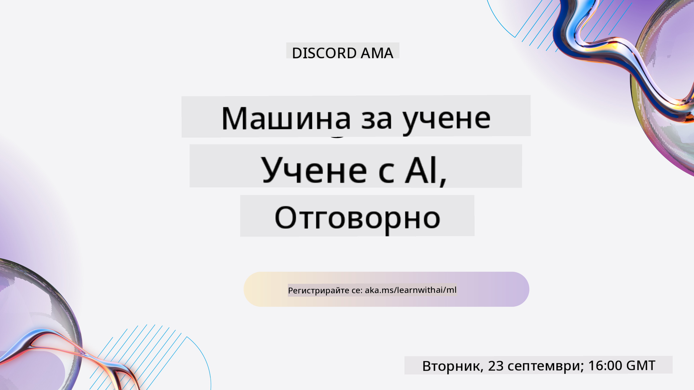
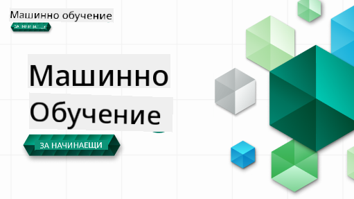

<!--
CO_OP_TRANSLATOR_METADATA:
{
  "original_hash": "7a13afb3674838f557d61f8d67e4d5f8",
  "translation_date": "2025-10-24T09:22:59+00:00",
  "source_file": "README.md",
  "language_code": "bg"
}
-->

### 🌐 Поддръжка на много езици

#### Поддържано чрез GitHub Action (Автоматизирано и винаги актуално)

<!-- CO-OP TRANSLATOR LANGUAGES TABLE START -->
[Арабски](../ar/README.md) | [Бенгалски](../bn/README.md) | [Български](./README.md) | [Бирмански (Мианмар)](../my/README.md) | [Китайски (опростен)](../zh/README.md) | [Китайски (традиционен, Хонконг)](../hk/README.md) | [Китайски (традиционен, Макао)](../mo/README.md) | [Китайски (традиционен, Тайван)](../tw/README.md) | [Хърватски](../hr/README.md) | [Чешки](../cs/README.md) | [Датски](../da/README.md) | [Холандски](../nl/README.md) | [Естонски](../et/README.md) | [Фински](../fi/README.md) | [Френски](../fr/README.md) | [Немски](../de/README.md) | [Гръцки](../el/README.md) | [Иврит](../he/README.md) | [Хинди](../hi/README.md) | [Унгарски](../hu/README.md) | [Индонезийски](../id/README.md) | [Италиански](../it/README.md) | [Японски](../ja/README.md) | [Корейски](../ko/README.md) | [Литовски](../lt/README.md) | [Малайски](../ms/README.md) | [Маратхи](../mr/README.md) | [Непалски](../ne/README.md) | [Норвежки](../no/README.md) | [Персийски (фарси)](../fa/README.md) | [Полски](../pl/README.md) | [Португалски (Бразилия)](../br/README.md) | [Португалски (Португалия)](../pt/README.md) | [Пенджабски (Гурмуки)](../pa/README.md) | [Румънски](../ro/README.md) | [Руски](../ru/README.md) | [Сръбски (кирилица)](../sr/README.md) | [Словашки](../sk/README.md) | [Словенски](../sl/README.md) | [Испански](../es/README.md) | [Суахили](../sw/README.md) | [Шведски](../sv/README.md) | [Тагалог (Филипински)](../tl/README.md) | [Тамилски](../ta/README.md) | [Тайландски](../th/README.md) | [Турски](../tr/README.md) | [Украински](../uk/README.md) | [Урду](../ur/README.md) | [Виетнамски](../vi/README.md)
<!-- CO-OP TRANSLATOR LANGUAGES TABLE END -->

#### Присъединете се към нашата общност

Имаме текуща серия за обучение с AI в Discord, научете повече и се присъединете към нас на [Learn with AI Series](https://aka.ms/learnwithai/discord) от 18 до 30 септември 2025 г. Ще получите съвети и трикове за използване на GitHub Copilot за Data Science.

# Машинно обучение за начинаещи - учебна програма

> 🌍 Пътувайте по света, докато изследваме машинното обучение чрез културите на света 🌍

Екипът на Cloud Advocates в Microsoft с удоволствие предлага 12-седмична учебна програма с 26 урока, посветена на **машинното обучение**. В тази програма ще научите за това, което понякога се нарича **класическо машинно обучение**, като основно използвате библиотеката Scikit-learn и избягвате дълбокото обучение, което е обхванато в нашата [учебна програма за AI за начинаещи](https://aka.ms/ai4beginners). Съчетайте тези уроци с нашата ['учебна програма за Data Science за начинаещи'](https://aka.ms/ds4beginners), също така!

Пътувайте с нас по света, докато прилагаме тези класически техники към данни от различни региони на света. Всеки урок включва тестове преди и след урока, писмени инструкции за завършване на урока, решение, задача и други. Нашата проектно-ориентирана педагогика ви позволява да учите, докато създавате, доказан начин за усвояване на нови умения.

**✍️ Сърдечни благодарности на нашите автори** Джен Лупър, Стивън Хауъл, Франческа Лазери, Томоми Имура, Каси Бревиу, Дмитрий Сошников, Крис Норинг, Анирбан Мукерджи, Орнела Алтунян, Рут Якобу и Ейми Бойд

**🎨 Благодарности и на нашите илюстратори** Томоми Имура, Дасани Мадипали и Джен Лупър

**🙏 Специални благодарности 🙏 на нашите автори, рецензенти и сътрудници от Microsoft Student Ambassador**, особено Ришит Дагли, Мухамад Сакиб Хан Инан, Рохан Радж, Александру Петреску, Абишек Джайсвал, Наврин Табасум, Йоан Самуила и Снигдха Агарвал

**🤩 Допълнителна благодарност към Microsoft Student Ambassadors Ерик Ванджау, Джаслийн Сонди и Видуши Гупта за нашите уроци по R!**

# Започнете

Следвайте тези стъпки:
1. **Fork на хранилището**: Кликнете върху бутона "Fork" в горния десен ъгъл на тази страница.
2. **Клонирайте хранилището**:   `git clone https://github.com/microsoft/ML-For-Beginners.git`

> [намерете всички допълнителни ресурси за този курс в нашата колекция Microsoft Learn](https://learn.microsoft.com/en-us/collections/qrqzamz1nn2wx3?WT.mc_id=academic-77952-bethanycheum)

> 🔧 **Нуждаете се от помощ?** Проверете нашето [Ръководство за отстраняване на проблеми](TROUBLESHOOTING.md) за решения на често срещани проблеми с инсталацията, настройката и изпълнението на уроците.

**[Студенти](https://aka.ms/student-page)**, за да използвате тази учебна програма, направете fork на цялото хранилище във вашия собствен акаунт в GitHub и завършете упражненията сами или в група:

- Започнете с тест преди лекцията.
- Прочетете лекцията и завършете дейностите, като правите паузи и размишлявате при всяка проверка на знанията.
- Опитайте се да създадете проектите, като разбирате уроците, вместо да изпълнявате кода на решението; въпреки това този код е наличен в папките `/solution` във всеки проектно-ориентиран урок.
- Направете теста след лекцията.
- Завършете предизвикателството.
- Завършете задачата.
- След завършване на група уроци, посетете [Дискусионния форум](https://github.com/microsoft/ML-For-Beginners/discussions) и "учете на глас", като попълните съответния PAT рубрик. PAT е инструмент за оценка на напредъка, който представлява рубрик, който попълвате, за да задълбочите обучението си. Можете също така да реагирате на други PAT, за да учим заедно.

> За допълнително обучение препоръчваме да следвате тези [модули и учебни пътеки на Microsoft Learn](https://docs.microsoft.com/en-us/users/jenlooper-2911/collections/k7o7tg1gp306q4?WT.mc_id=academic-77952-leestott).

**Учители**, ние сме [включили някои предложения](for-teachers.md) за това как да използвате тази учебна програма.

---

## Видео уроци

Някои от уроците са налични като кратки видеа. Можете да намерите всички тях в самите уроци или в [плейлиста ML for Beginners в YouTube канала на Microsoft Developer](https://aka.ms/ml-beginners-videos), като кликнете върху изображението по-долу.

---

## Запознайте се с екипа

**Gif от** [Mohit Jaisal](https://linkedin.com/in/mohitjaisal)

> 🎥 Кликнете върху изображението по-горе за видео за проекта и хората, които го създадоха!

---

## Педагогика

Избрахме два педагогически принципа при създаването на тази учебна програма: да гарантираме, че тя е практически **проектно-ориентирана** и че включва **чести тестове**. Освен това, тази учебна програма има обща **тема**, която й придава сплотеност.

Като гарантираме, че съдържанието е свързано с проекти, процесът става по-ангажиращ за студентите и задържането на концепции се увеличава. Освен това, тест с нисък риск преди урока насочва вниманието на студента към изучаването на дадена тема, докато втори тест след урока осигурява допълнително задържане. Тази учебна програма е проектирана да бъде гъвкава и забавна и може да бъде взета изцяло или частично. Проектите започват с малки задачи и стават все по-сложни до края на 12-седмичния цикъл. Тази учебна програма включва и постскрипт за реални приложения на машинното обучение, който може да се използва като допълнителен кредит или като основа за дискусия.

> Намерете нашите [Правила за поведение](CODE_OF_CONDUCT.md), [Принос](CONTRIBUTING.md), [Превод](TRANSLATIONS.md) и [Ръководство за отстраняване на проблеми](TROUBLESHOOTING.md). Очакваме вашата конструктивна обратна връзка!

## Всеки урок включва

- опционална скица
- опционално допълнително видео
- видео урок (само за някои уроци)
- [тест за загряване преди лекцията](https://ff-quizzes.netlify.app/en/ml/)
- писмен урок
- за проектно-ориентирани уроци, ръководства стъпка по стъпка за изграждане на проекта
- проверки на знанията
- предизвикателство
- допълнително четене
- задача
- [тест след лекцията](https://ff-quizzes.netlify.app/en/ml/)

> **Бележка за езиците**: Тези уроци са основно написани на Python, но много от тях са налични и на R. За да завършите урок на R, отидете в папката `/solution` и потърсете уроци на R. Те включват разширение .rmd, което представлява **R Markdown** файл, който може да бъде просто дефиниран като вграждане на `кодови блокове` (на R или други езици) и `YAML заглавие` (което насочва как да се форматират изходите като PDF) в `Markdown документ`. По този начин той служи като примерна рамка за авторство в областта на анализа на данни, тъй като ви позволява да комбинирате вашия код, неговия изход и вашите мисли, като ви позволява да ги записвате в Markdown. Освен това, R Markdown документи могат да бъдат рендирани в изходни формати като PDF, HTML или Word.

> **Бележка за тестовете**: Всички тестове са включени в [папката Quiz App](../../quiz-app), общо 52 теста с по три въпроса всеки. Те са свързани с уроците, но приложението за тестове може да се стартира локално; следвайте инструкциите в папката `quiz-app`, за да го хоствате локално или да го разположите в Azure.

| Номер на урок |                             Тема                              |                   Групиране на уроци                   | Цели на обучението                                                                                                             |                                                              Свързан урок                                                               |                        Автор                        |
| :-----------: | :------------------------------------------------------------: | :-------------------------------------------------: | ------------------------------------------------------------------------------------------------------------------------------- | :--------------------------------------------------------------------------------------------------------------------------------------: | :--------------------------------------------------: |
|      01       |                Въведение в машинното обучение                |      [Въведение](1-Introduction/README.md)       | Научете основните концепции зад машинното обучение                                                                                |                                             [Урок](1-Introduction/1-intro-to-ML/README.md)                                             |                       Мухамад                       |
|      02       |                История на машинното обучение                 |      [Въведение](1-Introduction/README.md)       | Научете историята, която стои зад тази област                                                                                   |                                            [Урок](1-Introduction/2-history-of-ML/README.md)                                            |                     Джен и Ейми                     |
|      03       |                 Справедливост и машинно обучение             |      [Въведение](1-Introduction/README.md)       | Какви са важните философски въпроси относно справедливостта, които студентите трябва да обмислят при създаване и прилагане на ML модели? |                                              [Урок](1-Introduction/3-fairness/README.md)                                               |                        Томоми                        |
|      04       |                Техники за машинно обучение                   |      [Въведение](1-Introduction/README.md)       | Какви техники използват изследователите на ML за създаване на ML модели?                                                        |                                          [Урок](1-Introduction/4-techniques-of-ML/README.md)                                           |                    Крис и Джен                      |
|      05       |                   Въведение в регресия                       |        [Регресия](2-Regression/README.md)         | Започнете с Python и Scikit-learn за регресионни модели                                                                          |         [Python](2-Regression/1-Tools/README.md) • [R](../../2-Regression/1-Tools/solution/R/lesson_1.html)         |      Джен • Ерик Ванджа       |
|      06       |                Цени на тикви в Северна Америка 🎃            |        [Регресия](2-Regression/README.md)         | Визуализирайте и почистете данни в подготовка за ML                                                                              |          [Python](2-Regression/2-Data/README.md) • [R](../../2-Regression/2-Data/solution/R/lesson_2.html)          |      Джен • Ерик Ванджа       |
|      07       |                Цени на тикви в Северна Америка 🎃            |        [Регресия](2-Regression/README.md)         | Създайте линейни и полиномиални регресионни модели                                                                               |        [Python](2-Regression/3-Linear/README.md) • [R](../../2-Regression/3-Linear/solution/R/lesson_3.html)        |      Джен и Дмитрий • Ерик Ванджа       |
|      08       |                Цени на тикви в Северна Америка 🎃            |        [Регресия](2-Regression/README.md)         | Създайте логистичен регресионен модел                                                                                           |     [Python](2-Regression/4-Logistic/README.md) • [R](../../2-Regression/4-Logistic/solution/R/lesson_4.html)      |      Джен • Ерик Ванджа       |
|      09       |                          Уеб приложение 🔌                   |           [Уеб приложение](3-Web-App/README.md)   | Създайте уеб приложение за използване на вашия обучен модел                                                                      |                                                 [Python](3-Web-App/1-Web-App/README.md)                                                  |                         Джен                          |
|      10       |                 Въведение в класификация                    |    [Класификация](4-Classification/README.md)     | Почистете, подгответе и визуализирайте вашите данни; въведение в класификация                                                   | [Python](4-Classification/1-Introduction/README.md) • [R](../../4-Classification/1-Introduction/solution/R/lesson_10.html)  | Джен и Каси • Ерик Ванджа |
|      11       |             Вкусни азиатски и индийски ястия 🍜             |    [Класификация](4-Classification/README.md)     | Въведение в класификатори                                                                                                       | [Python](4-Classification/2-Classifiers-1/README.md) • [R](../../4-Classification/2-Classifiers-1/solution/R/lesson_11.html) | Джен и Каси • Ерик Ванджа |
|      12       |             Вкусни азиатски и индийски ястия 🍜             |    [Класификация](4-Classification/README.md)     | Още класификатори                                                                                                               | [Python](4-Classification/3-Classifiers-2/README.md) • [R](../../4-Classification/3-Classifiers-2/solution/R/lesson_12.html) | Джен и Каси • Ерик Ванджа |
|      13       |             Вкусни азиатски и индийски ястия 🍜             |    [Класификация](4-Classification/README.md)     | Създайте уеб приложение за препоръки, използвайки вашия модел                                                                   |                                              [Python](4-Classification/4-Applied/README.md)                                              |                         Джен                          |
|      14       |                   Въведение в клъстеризация                 |        [Клъстеризация](5-Clustering/README.md)    | Почистете, подгответе и визуализирайте вашите данни; въведение в клъстеризация                                                  |         [Python](5-Clustering/1-Visualize/README.md) • [R](../../5-Clustering/1-Visualize/solution/R/lesson_14.html)         |      Джен • Ерик Ванджа       |
|      15       |              Изследване на музикалните вкусове в Нигерия 🎧 |        [Клъстеризация](5-Clustering/README.md)    | Изследвайте метода на клъстеризация K-Means                                                                                     |           [Python](5-Clustering/2-K-Means/README.md) • [R](../../5-Clustering/2-K-Means/solution/R/lesson_15.html)           |      Джен • Ерик Ванджа       |
|      16       |        Въведение в обработката на естествен език ☕️         |   [Обработка на естествен език](6-NLP/README.md)  | Научете основите на NLP, като създадете прост бот                                                                               |                                             [Python](6-NLP/1-Introduction-to-NLP/README.md)                                              |                       Стивън                        |
|      17       |                      Чести задачи в NLP ☕️                  |   [Обработка на естествен език](6-NLP/README.md)  | Задълбочете знанията си за NLP, като разберете често срещаните задачи при работа със структури на езика                         |                                                    [Python](6-NLP/2-Tasks/README.md)                                                     |                       Стивън                        |
|      18       |             Превод и анализ на настроения ♥️                |   [Обработка на естествен език](6-NLP/README.md)  | Превод и анализ на настроения с Джейн Остин                                                                                     |                                            [Python](6-NLP/3-Translation-Sentiment/README.md)                                             |                       Стивън                        |
|      19       |                  Романтични хотели в Европа ♥️              |   [Обработка на естествен език](6-NLP/README.md)  | Анализ на настроения с хотелски ревюта 1                                                                                        |                                               [Python](6-NLP/4-Hotel-Reviews-1/README.md)                                                |                       Стивън                        |
|      20       |                  Романтични хотели в Европа ♥️              |   [Обработка на естествен език](6-NLP/README.md)  | Анализ на настроения с хотелски ревюта 2                                                                                        |                                               [Python](6-NLP/5-Hotel-Reviews-2/README.md)                                                |                       Стивън                        |
|      21       |            Въведение в прогнозиране на времеви серии         |        [Времеви серии](7-TimeSeries/README.md)    | Въведение в прогнозиране на времеви серии                                                                                       |                                             [Python](7-TimeSeries/1-Introduction/README.md)                                              |                      Франческа                       |
|      22       | ⚡️ Световно потребление на енергия ⚡️ - прогнозиране на времеви серии с ARIMA |        [Времеви серии](7-TimeSeries/README.md)    | Прогнозиране на времеви серии с ARIMA                                                                                           |                                                 [Python](7-TimeSeries/2-ARIMA/README.md)                                                 |                      Франческа                       |
|      23       |  ⚡️ Световно потребление на енергия ⚡️ - прогнозиране на времеви серии със SVR  |        [Времеви серии](7-TimeSeries/README.md)    | Прогнозиране на времеви серии с Support Vector Regressor                                                                         |                                                  [Python](7-TimeSeries/3-SVR/README.md)                                                  |                       Анирбан                        |
|      24       |             Въведение в обучението чрез подсилване           | [Обучение чрез подсилване](8-Reinforcement/README.md) | Въведение в обучението чрез подсилване с Q-Learning                                                                             |                                             [Python](8-Reinforcement/1-QLearning/README.md)                                              |                        Дмитрий                        |
|      25       |                 Помогнете на Питър да избегне вълка! 🐺      | [Обучение чрез подсилване](8-Reinforcement/README.md) | Обучение чрез подсилване в Gym                                                                                                  |                                                [Python](8-Reinforcement/2-Gym/README.md)                                                 |                        Дмитрий                        |
|  Постскриптум |            Реални сценарии и приложения на ML               |      [ML в реалния свят](9-Real-World/README.md)  | Интересни и разкриващи приложения на класическото ML                                                                            |                                             [Урок](9-Real-World/1-Applications/README.md)                                              |                         Екип                         |
|  Постскриптум |            Дебъгване на модели в ML с табло за RAI          |      [ML в реалния свят](9-Real-World/README.md)  | Дебъгване на модели в машинното обучение с компоненти на таблото за отговорен AI                                                |                                             [Урок](9-Real-World/2-Debugging-ML-Models/README.md)                                              |                         Рут Якубу                       |

> [намерете всички допълнителни ресурси за този курс в нашата колекция в Microsoft Learn](https://learn.microsoft.com/en-us/collections/qrqzamz1nn2wx3?WT.mc_id=academic-77952-bethanycheum)

## Офлайн достъп

Можете да използвате тази документация офлайн, като използвате [Docsify](https://docsify.js.org/#/). Форкнете този репо, [инсталирайте Docsify](https://docsify.js.org/#/quickstart) на вашия локален компютър и след това в основната папка на този репо напишете `docsify serve`. Уебсайтът ще бъде достъпен на порт 3000 на вашия локален хост: `localhost:3000`.

## PDF файлове

Намерете PDF файл на учебната програма с линкове [тук](https://microsoft.github.io/ML-For-Beginners/pdf/readme.pdf).

## 🎒 Други курсове 

Нашият екип създава и други курсове! Вижте:

<!-- CO-OP TRANSLATOR OTHER COURSES START -->
### Azure / Edge / MCP / Агенти

---
 
### Серия за генеративен AI

[-9333EA?style=for-the-badge&labelColor=E5E7EB&color=9333EA)](https://github.com/microsoft/Generative-AI-for-beginners-dotnet?WT.mc_id=academic-105485-koreyst)
[-C084FC?style=for-the-badge&labelColor=E5E7EB&color=C084FC)](https://github.com/microsoft/generative-ai-for-beginners-java?WT.mc_id=academic-105485-koreyst)
[-E879F9?style=for-the-badge&labelColor=E5E7EB&color=E879F9)](https://github.com/microsoft/generative-ai-with-javascript?WT.mc_id=academic-105485-koreyst)

---
 
### Основно обучение
  
  
  
  
  
  
  

---

### Серия Copilot  
  
  
  

## Получаване на помощ  

Ако се затрудните или имате въпроси относно създаването на AI приложения, присъединете се:  

  

Ако имате обратна връзка за продукт или срещнете грешки при разработката, посетете:  

  

---

**Отказ от отговорност**:  
Този документ е преведен с помощта на AI услуга за превод [Co-op Translator](https://github.com/Azure/co-op-translator). Въпреки че се стремим към точност, моля, имайте предвид, че автоматизираните преводи може да съдържат грешки или неточности. Оригиналният документ на неговия роден език трябва да се счита за авторитетен източник. За критична информация се препоръчва професионален човешки превод. Не носим отговорност за каквито и да е недоразумения или погрешни интерпретации, произтичащи от използването на този превод.