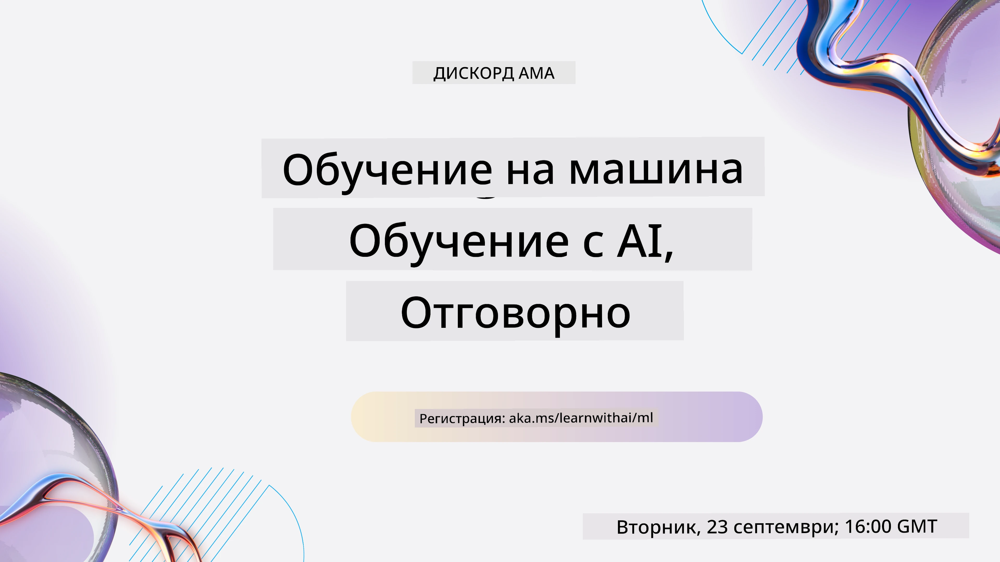
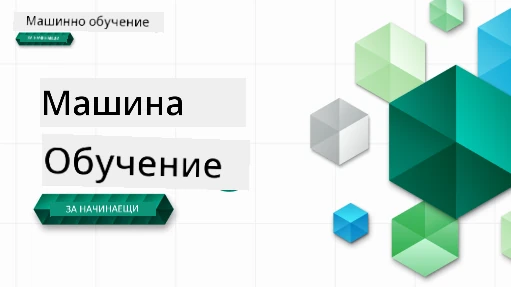

[](https://github.com/microsoft/ML-For-Beginners/blob/master/LICENSE)
[](https://GitHub.com/microsoft/ML-For-Beginners/graphs/contributors/)
[](https://GitHub.com/microsoft/ML-For-Beginners/issues/)
[](https://GitHub.com/microsoft/ML-For-Beginners/pulls/)
[](http://makeapullrequest.com)

[](https://GitHub.com/microsoft/ML-For-Beginners/watchers/)
[](https://GitHub.com/microsoft/ML-For-Beginners/network/)
[](https://GitHub.com/microsoft/ML-For-Beginners/stargazers/)

### 🌐 Поддръжка на множество езици

#### Поддържа се чрез GitHub Action (Автоматизирано и винаги актуално)

<!-- CO-OP TRANSLATOR LANGUAGES TABLE START -->
[Arabic](../ar/README.md) | [Bengali](../bn/README.md) | [Bulgarian](./README.md) | [Burmese (Myanmar)](../my/README.md) | [Chinese (Simplified)](../zh-CN/README.md) | [Chinese (Traditional, Hong Kong)](../zh-HK/README.md) | [Chinese (Traditional, Macau)](../zh-MO/README.md) | [Chinese (Traditional, Taiwan)](../zh-TW/README.md) | [Croatian](../hr/README.md) | [Czech](../cs/README.md) | [Danish](../da/README.md) | [Dutch](../nl/README.md) | [Estonian](../et/README.md) | [Finnish](../fi/README.md) | [French](../fr/README.md) | [German](../de/README.md) | [Greek](../el/README.md) | [Hebrew](../he/README.md) | [Hindi](../hi/README.md) | [Hungarian](../hu/README.md) | [Indonesian](../id/README.md) | [Italian](../it/README.md) | [Japanese](../ja/README.md) | [Kannada](../kn/README.md) | [Khmer](../km/README.md) | [Korean](../ko/README.md) | [Lithuanian](../lt/README.md) | [Malay](../ms/README.md) | [Malayalam](../ml/README.md) | [Marathi](../mr/README.md) | [Nepali](../ne/README.md) | [Nigerian Pidgin](../pcm/README.md) | [Norwegian](../no/README.md) | [Persian (Farsi)](../fa/README.md) | [Polish](../pl/README.md) | [Portuguese (Brazil)](../pt-BR/README.md) | [Portuguese (Portugal)](../pt-PT/README.md) | [Punjabi (Gurmukhi)](../pa/README.md) | [Romanian](../ro/README.md) | [Russian](../ru/README.md) | [Serbian (Cyrillic)](../sr/README.md) | [Slovak](../sk/README.md) | [Slovenian](../sl/README.md) | [Spanish](../es/README.md) | [Swahili](../sw/README.md) | [Swedish](../sv/README.md) | [Tagalog (Filipino)](../tl/README.md) | [Tamil](../ta/README.md) | [Telugu](../te/README.md) | [Thai](../th/README.md) | [Turkish](../tr/README.md) | [Ukrainian](../uk/README.md) | [Urdu](../ur/README.md) | [Vietnamese](../vi/README.md)

> **Предпочитате да клонирате локално?**
>
> Този хранилище включва над 50 езикови превода, което значително увеличава размера на изтеглянето. За да клонирате без преводи, използвайте sparse checkout:
>
> **Bash / macOS / Linux:**
> ```bash
> git clone --filter=blob:none --sparse https://github.com/microsoft/ML-For-Beginners.git
> cd ML-For-Beginners
> git sparse-checkout set --no-cone '/*' '!translations' '!translated_images'
> ```
>
> **CMD (Windows):**
> ```cmd
> git clone --filter=blob:none --sparse https://github.com/microsoft/ML-For-Beginners.git
> cd ML-For-Beginners
> git sparse-checkout set --no-cone "/*" "!translations" "!translated_images"
> ```
>
> Това ви дава всичко необходимо, за да завършите курса с много по-бързо изтегляне.
<!-- CO-OP TRANSLATOR LANGUAGES TABLE END -->

#### Присъединете се към нашата общност

[](https://discord.gg/nTYy5BXMWG)

Имаме текуща серия за учене с AI в Discord, научете повече и се присъединете към нас в [Learn with AI Series](https://aka.ms/learnwithai/discord) от 18 до 30 септември 2025 г. Ще получите съвети и трикове за използването на GitHub Copilot за Data Science.



# Машинно обучение за начинаещи - Учебна програма

> 🌍 Пътувайте из света, докато изследваме машинното обучение чрез световните култури 🌍

Експертите по облачни технологии в Microsoft с удоволствие предлагат 12-седмична учебна програма с 26 урока, посветена на **машинното обучение**. В тази учебна програма ще научите за това, което понякога се нарича **класическо машинно обучение**, като използвате главно библиотеката Scikit-learn и избягвате дълбокото обучение, което се разглежда в нашата [учебна програма AI за начинаещи](https://aka.ms/ai4beginners). Сдвоете тези уроци с нашата [учебна програма „Наука за данни за начинаещи“](https://aka.ms/ds4beginners)!

Пътувайте с нас из света, докато прилагаме тези класически техники върху данни от различни региони по света. Всеки урок включва предварителен и последващ тест, писмени инструкции за изпълнение на урока, решение, задание и още. Нашият проектно-базиран педагогически подход ви позволява да учите чрез създаване, доказан начин за по-добро усвояване на нови умения.

**✍️ Сърдечни благодарности на нашите автори** Джен Лупър, Стивън Хауъл, Франческа Лазери, Томоми Имура, Каси Бревиу, Дмитрий Сошников, Крис Норинг, Анирбан Мукерджи, Орнела Алтунян, Рут Якубу и Ейми Бойд

**🎨 Благодарности и на нашите илюстратори** Томоми Имура, Дасани Мадипали и Джен Лупър

**🙏 Специални благодарности 🙏 на нашите посланици на студенти на Microsoft, автори, рецензенти и съдържателни сътрудници**, особено Ришит Дагли, Мухаммад Сакиб Кхан Инан, Рохан Радж, Александру Петреску, Абхишек Джайсуал, Наврин Табасум, Йоан Самуила и Снигда Агарвал

**🤩 Особена благодарност към посланиците на студенти на Microsoft Ерик Уанджау, Джаслийн Сонди и Видуши Гупта за нашите уроци по R!**

# Започване

Следвайте тези стъпки:
1. **Форкнете хранилището**: Кликнете върху бутона „Fork“ в горния десен ъгъл на тази страница.
2. **Клонирайте хранилището**:   `git clone https://github.com/microsoft/ML-For-Beginners.git`

> 💡 **Бърз старт съвет:** Искате да започнете в браузър без да настройвате Python локално? Използвайте [GitHub Codespaces](https://github.com/features/codespaces), за да създадете облачна среда за разработка за вашето форкване. Отворете зеленото меню **Code**, изберете **Codespaces** и създайте codespace; инсталирайте необходимите зависимости на всеки урок в него.

> [намерете всички допълнителни ресурси за този курс в нашата колекция Microsoft Learn](https://learn.microsoft.com/en-us/collections/qrqzamz1nn2wx3?WT.mc_id=academic-77952-bethanycheum)

> 🔧 **Нуждаете се от помощ?** Вижте нашия [Ръководство за отстраняване на проблеми](TROUBLESHOOTING.md) за решения на често срещани проблеми с инсталиране, настройка и изпълнение на уроците.


**[Студенти](https://aka.ms/student-page)**, за да използвате тази учебна програма, форкнете цялото хранилище в своя GitHub акаунт и завършете упражненията самостоятелно или в група:

- Започнете с предварителен тест преди лекцията.
- Прочетете лекцията и изпълнете активностите, като спирате и разсъждавате при всяка проверка на знания.
- Опитайте да създадете проектите, като разберете уроците, а не просто като изпълните кода за решение; въпреки това, кодът е наличен в папките `/solution` във всеки урок, ориентиран към проекти.
- Направете тест след лекцията.
- Завършете предизвикателството.
- Завършете заданието.
- След завършване на групата с уроци, посетете [Дискусионния борд](https://github.com/microsoft/ML-For-Beginners/discussions) и „учете на глас“, като попълните съответния PAT рубрик. PAT е инструмент за оценка на напредъка, който попълвате за задълбочаване на ученето си. Можете също да реагирате на други PAT, за да учим заедно.

> За по-нататъшно обучение препоръчваме да следвате тези [модули и учебни пътеки на Microsoft Learn](https://docs.microsoft.com/en-us/users/jenlooper-2911/collections/k7o7tg1gp306q4?WT.mc_id=academic-77952-leestott).

**Учители**, ние сме [включили някои предложения](for-teachers.md) как да използвате тази учебна програма.

---

## Видео уроци

Някои от уроците са налични като кратки видеоклипове. Можете да ги намерите в самите уроци, или в [плейлиста ML for Beginners в YouTube канала на Microsoft Developer](https://aka.ms/ml-beginners-videos), като кликнете върху снимката по-долу.

[](https://aka.ms/ml-beginners-videos)

---

## Срещнете екипа

[](https://youtu.be/Tj1XWrDSYJU)

**Gif от** [Mohit Jaisal](https://linkedin.com/in/mohitjaisal)

> 🎥 Кликнете на изображението по-горе за видео за проекта и хората, които го създадоха!

---

## Педагогика

Избрахме два педагогически принципа при изграждането на тази учебна програма: гарантиране, че е практическа и **проектно-базирана**, и че включва **чести тестове**. Освен това тази учебна програма има обща **тема**, която ѝ придава свързаност.

Като осигуряваме съответствие на съдържанието с проекти, процесът става по-ангажиращ за студентите и се увеличава задържането на концепциите. Освен това тест с ниски залози преди занятията задава намерението на студента за научаване на тема, а вторият тест след занятията осигурява допълнително задържане. Тази учебна програма е проектирана да бъде гъвкава и забавна и може да се вземе цялостно или частично. Проектите започват малки и стават все по-сложни до края на 12-седмичния цикъл. Тази учебна програма включва и постскрипт за реални приложения на ML, който може да се използва като допълнителен кредит или като основа за обсъждане.

> Намерете нашите [Правила за поведение](CODE_OF_CONDUCT.md), [Как да допринасяте](CONTRIBUTING.md), [Преводи](..) и [Отстраняване на проблеми](TROUBLESHOOTING.md). Очакваме вашата конструктивна обратна връзка!

## Всеки урок включва

- по желание бележка със скици
- по желание допълнително видео
- видео урок (само в някои уроци)
- [тест за загряване преди лекцията](https://ff-quizzes.netlify.app/en/ml/)
- писмен урок
- за проектно-базирани уроци, стъпка по стъпка ръководства за изграждане на проекта
- проверки на знанията
- предизвикателство
- допълнително четиво
- задание
- [тест след лекцията](https://ff-quizzes.netlify.app/en/ml/)

> **Бележка за езиците**: Тези уроци са главно написани на Python, но много са налични и на R. За да завършите урок на R, отидете в папката `/solution` и потърсете уроци на R. Те имат разширение .rmd, което представлява **R Markdown** файл, който може просто да се определи като вграждане на `кодови блокове` (на R или други езици) и `YAML заглавка` (която указва как да се форматират изходите като PDF) в `Markdown документ`. По този начин той служи като примерна рамка за създаване на съдържание в науката за данни, тъй като позволява да комбинирате кода си, неговия изход и вашите мисли, като ги записвате в Markdown. Освен това документи на R Markdown могат да се визуализират като изходни формати като PDF, HTML или Word.

> **Бележка за тестовете**: Всички тестове са в [папката на Quiz App](../../quiz-app), общо 52 теста с по три въпроса всеки. Те са свързани от уроците, но приложението за тестове може да се изпълнява локално; следвайте инструкциите в папката `quiz-app` за локално хостване или внедряване в Azure.

| Номер на урока |                             Тема                              |                   Групиране на урока                   | Учебни цели                                                                                                             |                                                              Свързан урок                                                               |                        Автор                        |
| :-----------: | :------------------------------------------------------------: | :-------------------------------------------------: | ------------------------------------------------------------------------------------------------------------------------------- | :--------------------------------------------------------------------------------------------------------------------------------------: | :--------------------------------------------------: |
|      01       |                Въведение в машинното обучение                |      [Въведение](1-Introduction/README.md)       | Научете основните концепции зад машинното обучение                                                                                |                                             [Урок](1-Introduction/1-intro-to-ML/README.md)                                             |                       Мухамад                       |
|      02       |                История на машинното обучение                 |      [Въведение](1-Introduction/README.md)       | Научете историята зад тази област                                                                                                 |                                            [Урок](1-Introduction/2-history-of-ML/README.md)                                            |                     Джен и Ейми                      |
|      03       |                 Справедливост и машинно обучение             |      [Въведение](1-Introduction/README.md)       | Какви са важните философски въпроси около справедливостта, които студентите трябва да вземат предвид при създаване и прилагане на модели за машинно обучение? |                                              [Урок](1-Introduction/3-fairness/README.md)                                               |                        Томоми                        |
|      04       |                Техники за машинно обучение                   |      [Въведение](1-Introduction/README.md)       | Какви техники използват изследователите на ML за създаване на модели?                                                           |                                          [Урок](1-Introduction/4-techniques-of-ML/README.md)                                           |                    Крис и Джен                     |
|      05       |                   Въведение в регресия                       |        [Регресия](2-Regression/README.md)         | Започнете с Python и Scikit-learn за регресионни модели                                                                          |         [Python](2-Regression/1-Tools/README.md) • [R](../../2-Regression/1-Tools/solution/R/lesson_1.html)         |      Джен • Ерик Ванджау       |
|      06       |                Цени на тикви в Северна Америка 🎃            |        [Регресия](2-Regression/README.md)         | Визуализирайте и почистете данните в подготовка за ML                                                                            |          [Python](2-Regression/2-Data/README.md) • [R](../../2-Regression/2-Data/solution/R/lesson_2.html)          |      Джен • Ерик Ванджау       |
|      07       |                Цени на тикви в Северна Америка 🎃            |        [Регресия](2-Regression/README.md)         | Създайте линейни и полиномиални регресионни модели                                                                               |        [Python](2-Regression/3-Linear/README.md) • [R](../../2-Regression/3-Linear/solution/R/lesson_3.html)        |      Джен и Дмитрий • Ерик Ванджау       |
|      08       |                Цени на тикви в Северна Америка 🎃            |        [Регресия](2-Regression/README.md)         | Създайте логистичен регресионен модел                                                                                            |     [Python](2-Regression/4-Logistic/README.md) • [R](../../2-Regression/4-Logistic/solution/R/lesson_4.html)      |      Джен • Ерик Ванджау       |
|      09       |                          Уеб приложение 🔌                    |           [Уеб приложение](3-Web-App/README.md)            | Създайте уеб приложение за използване на вашия трениран модел                                                                    |                                                 [Python](3-Web-App/1-Web-App/README.md)                                                  |                         Джен                          |
|      10       |                 Въведение в класификация                      |    [Класификация](4-Classification/README.md)     | Почистете, пригответе и визуализирайте данните си; въведение в класификацията                                                   | [Python](4-Classification/1-Introduction/README.md) • [R](../../4-Classification/1-Introduction/solution/R/lesson_10.html)  | Джен и Каси • Ерик Ванджау |
|      11       |             Вкусни азиатски и индийски кухни 🍜              |    [Класификация](4-Classification/README.md)     | Въведение в классификаторите                                                                                                     | [Python](4-Classification/2-Classifiers-1/README.md) • [R](../../4-Classification/2-Classifiers-1/solution/R/lesson_11.html) | Джен и Каси • Ерик Ванджау |
|      12       |             Вкусни азиатски и индийски кухни 🍜              |    [Класификация](4-Classification/README.md)     | Още класификатори                                                                                                               | [Python](4-Classification/3-Classifiers-2/README.md) • [R](../../4-Classification/3-Classifiers-2/solution/R/lesson_12.html) | Джен и Каси • Ерик Ванджау |
|      13       |             Вкусни азиатски и индийски кухни 🍜              |    [Класификация](4-Classification/README.md)     | Създайте уеб приложение за препоръчване, използвайки вашия модел                                                               |                                              [Python](4-Classification/4-Applied/README.md)                                              |                         Джен                          |
|      14       |                   Въведение в клъстериране                    |        [Клъстериране](5-Clustering/README.md)         | Почистете, пригответе и визуализирайте данните си; въведение в клъстерирането                                                  |         [Python](5-Clustering/1-Visualize/README.md) • [R](../../5-Clustering/1-Visualize/solution/R/lesson_14.html)         |      Джен • Ерик Ванджау       |
|      15       |              Изследване на нигерийските музикални вкусове 🎧 |        [Клъстериране](5-Clustering/README.md)         | Изследвайте метода на клъстериране K-Means                                                                                      |           [Python](5-Clustering/2-K-Means/README.md) • [R](../../5-Clustering/2-K-Means/solution/R/lesson_15.html)           |      Джен • Ерик Ванджау       |
|      16       |        Въведение в обработка на естествен език ☕️           |   [Обработка на естествен език](6-NLP/README.md)    | Научете основите на NLP чрез създаване на прост бот                                                                             |                                             [Python](6-NLP/1-Introduction-to-NLP/README.md)                                              |                       Стивън                        |
|      17       |                      Общи задачи в NLP ☕️                    |   [Обработка на естествен език](6-NLP/README.md)    | Задълбочете знанията си за NLP, като разберете основните задачи при работа с езикови структури                                |                                                    [Python](6-NLP/2-Tasks/README.md)                                                     |                       Стивън                        |
|      18       |             Превод и анализ на настроенията ♥️                |   [Обработка на естествен език](6-NLP/README.md)    | Превод и анализ на настроения с Джейн Остин                                                                                     |                                            [Python](6-NLP/3-Translation-Sentiment/README.md)                                             |                       Стивън                        |
|      19       |                  Романтични хотели в Европа ♥️                |   [Обработка на естествен език](6-NLP/README.md)    | Анализ на настроения с ревюта на хотели 1                                                                                       |                                               [Python](6-NLP/4-Hotel-Reviews-1/README.md)                                                |                       Стивън                        |
|      20       |                  Романтични хотели в Европа ♥️                |   [Обработка на естествен език](6-NLP/README.md)    | Анализ на настроения с ревюта на хотели 2                                                                                       |                                               [Python](6-NLP/5-Hotel-Reviews-2/README.md)                                                |                       Стивън                        |
|      21       |            Въведение в прогнозиране на времеви редове         |        [Времеви редове](7-TimeSeries/README.md)        | Въведение в прогнозиране на времеви редове                                                                                      |                                             [Python](7-TimeSeries/1-Introduction/README.md)                                              |                      Франческа                       |
|      22       | ⚡️ Световна употреба на енергия ⚡️ - прогнозиране с ARIMA   |        [Времеви редове](7-TimeSeries/README.md)        | Прогнозиране на времеви редове с ARIMA                                                                                          |                                                 [Python](7-TimeSeries/2-ARIMA/README.md)                                                 |                      Франческа                       |
|      23       |  ⚡️ Световна употреба на енергия ⚡️ - прогнозиране с SVR    |        [Времеви редове](7-TimeSeries/README.md)        | Прогнозиране на времеви редове с регресор с опорни вектори                                                                     |                                                  [Python](7-TimeSeries/3-SVR/README.md)                                                  |                       Анирбан                        |
|      24       |             Въведение в учене чрез подсилване                 | [Учение чрез подсилване](8-Reinforcement/README.md) | Въведение в учене чрез подсилване с Q-усложнение                                                                               |                                             [Python](8-Reinforcement/1-QLearning/README.md)                                              |                        Дмитрий                        |
|      25       |                 Помогнете на Питър да избегне вълка! 🐺       | [Учение чрез подсилване](8-Reinforcement/README.md) | Учене чрез подсилване в Gym                                                                                                     |                                                [Python](8-Reinforcement/2-Gym/README.md)                                                 |                        Дмитрий                        |
|  Постскрипт   |            Реални сценарии и приложения на ML                |      [ML в дивата природа](9-Real-World/README.md)       | Интересни и разкриващи реални приложения на класическото машинно обучение                                                     |                                             [Урок](9-Real-World/1-Applications/README.md)                                              |                         Екип                          |
|  Постскрипт   |            Отстраняване на грешки при ML с RAI таблото       |      [ML в дивата природа](9-Real-World/README.md)       | Отстраняване на грешки при машинно обучение с помощта на компоненти в таблото Responsible AI                                   |                                             [Урок](9-Real-World/2-Debugging-ML-Models/README.md)                                              |                     Рут Якобу                      |

> [намерете всички допълнителни ресурси за този курс в нашата колекция Microsoft Learn](https://learn.microsoft.com/en-us/collections/qrqzamz1nn2wx3?WT.mc_id=academic-77952-bethanycheum)

## Достъп офлайн

Можете да използвате тази документация офлайн, използвайки [Docsify](https://docsify.js.org/#/). Форкнете това репо, [инсталирайте Docsify](https://docsify.js.org/#/quickstart) на вашата локална машина и след това в кореновата папка на това репо, напишете `docsify serve`. Уебсайтът ще бъде обслужван на порт 3000 на вашия localhost: `localhost:3000`.

## PDF файлове

Намерете pdf на учебната програма с линкове [тук](https://microsoft.github.io/ML-For-Beginners/pdf/readme.pdf).


## 🎒 Други курсове

Нашият екип предлага и други курсове! Вижте:

<!-- CO-OP TRANSLATOR OTHER COURSES START -->
### LangChain
[](https://aka.ms/langchain4j-for-beginners)
[](https://aka.ms/langchainjs-for-beginners?WT.mc_id=m365-94501-dwahlin)
[](https://github.com/microsoft/langchain-for-beginners?WT.mc_id=m365-94501-dwahlin)
---

### Azure / Edge / MCP / Агенти
[](https://github.com/microsoft/AZD-for-beginners?WT.mc_id=academic-105485-koreyst)
[](https://github.com/microsoft/edgeai-for-beginners?WT.mc_id=academic-105485-koreyst)
[](https://github.com/microsoft/mcp-for-beginners?WT.mc_id=academic-105485-koreyst)
[](https://github.com/microsoft/ai-agents-for-beginners?WT.mc_id=academic-105485-koreyst)

---
 
### Серия за генеративен AI
[](https://github.com/microsoft/generative-ai-for-beginners?WT.mc_id=academic-105485-koreyst)
[-9333EA?style=for-the-badge&labelColor=E5E7EB&color=9333EA)](https://github.com/microsoft/Generative-AI-for-beginners-dotnet?WT.mc_id=academic-105485-koreyst)
[-C084FC?style=for-the-badge&labelColor=E5E7EB&color=C084FC)](https://github.com/microsoft/generative-ai-for-beginners-java?WT.mc_id=academic-105485-koreyst)
[-E879F9?style=for-the-badge&labelColor=E5E7EB&color=E879F9)](https://github.com/microsoft/generative-ai-with-javascript?WT.mc_id=academic-105485-koreyst)

---
 
### Основно обучение
[](https://aka.ms/ml-beginners?WT.mc_id=academic-105485-koreyst)
[](https://aka.ms/datascience-beginners?WT.mc_id=academic-105485-koreyst)
[](https://aka.ms/ai-beginners?WT.mc_id=academic-105485-koreyst)
[](https://github.com/microsoft/Security-101?WT.mc_id=academic-96948-sayoung)
[](https://aka.ms/webdev-beginners?WT.mc_id=academic-105485-koreyst)
[](https://aka.ms/iot-beginners?WT.mc_id=academic-105485-koreyst)
[](https://github.com/microsoft/xr-development-for-beginners?WT.mc_id=academic-105485-koreyst)

---
 
### Серия Copilot
[](https://aka.ms/GitHubCopilotAI?WT.mc_id=academic-105485-koreyst)
[](https://github.com/microsoft/mastering-github-copilot-for-dotnet-csharp-developers?WT.mc_id=academic-105485-koreyst)
[](https://github.com/microsoft/CopilotAdventures?WT.mc_id=academic-105485-koreyst)
<!-- CO-OP TRANSLATOR OTHER COURSES END -->

## Получаване на помощ

Ако се затрудните или имате въпроси докато учите машинно обучение или изграждате AI приложения, не се притеснявайте — помощ е налична.

Можете да се присъедините към дискусии с други учащи и разработчици, да задавате въпроси и да споделяте идеите си с общността.

- Присъединете се към общността за задаване на въпроси и учене с други
- Обсъждайте концепции за машинно обучение и проектни идеи
- Получавайте насоки от опитни разработчици

Подкрепяща общност е отличен начин да развиете уменията си и да решавате проблеми по-бързо.

[Microsoft Foundry Discord общност](https://discord.gg/nTYy5BXMWG)

Ако срещнете бъгове, грешки или имате предложения за подобрения, можете също да отворите **Проблем** в това репо, за да докладвате проблема.

За обратна връзка за продукта или за търсене на съществуващи публикации в общността, посетете Форум на разработчиците:

[](https://aka.ms/foundry/forum)

## Допълнителни съвети за обучение

- Преглеждайте тетрадките след всеки урок за по-добро разбиране.
- Практикувайте внедряването на алгоритми сами.
- Изследвайте реални набори от данни с помощта на научените концепции.

---

<!-- CO-OP TRANSLATOR DISCLAIMER START -->
**Отказ от отговорност**:
Този документ е преведен с помощта на AI преводачески услуга [Co-op Translator](https://github.com/Azure/co-op-translator). Въпреки че се стремим към точност, моля имайте предвид, че автоматизираните преводи могат да съдържат грешки или неточности. Оригиналният документ на неговия роден език трябва да се счита за авторитетен източник. За критична информация се препоръчва професионален човешки превод. Ние не носим отговорност за каквито и да е недоразумения или неправилни тълкувания, произтичащи от използването на този превод.
<!-- CO-OP TRANSLATOR DISCLAIMER END -->