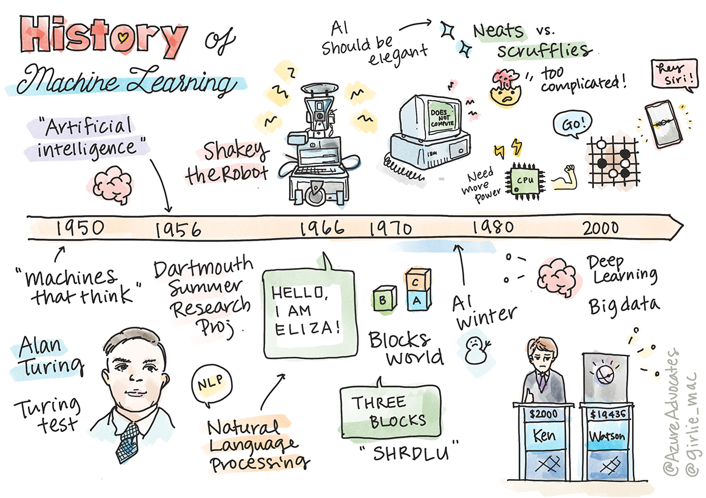

<!--
CO_OP_TRANSLATOR_METADATA:
{
  "original_hash": "b2d11df10030cacc41427a1fbc8bc8f1",
  "translation_date": "2025-08-29T21:30:47+00:00",
  "source_file": "1-Introduction/2-history-of-ML/README.md",
  "language_code": "bn"
}
-->
# মেশিন লার্নিং এর ইতিহাস

> স্কেচনোট: [Tomomi Imura](https://www.twitter.com/girlie_mac)

## [পূর্ব-লেকচার কুইজ](https://gray-sand-07a10f403.1.azurestaticapps.net/quiz/3/)

---

> 🎥 উপরের ছবিতে ক্লিক করুন এই পাঠের সংক্ষিপ্ত ভিডিও দেখার জন্য।

এই পাঠে আমরা মেশিন লার্নিং এবং কৃত্রিম বুদ্ধিমত্তার ইতিহাসের গুরুত্বপূর্ণ মাইলফলকগুলো নিয়ে আলোচনা করব।

কৃত্রিম বুদ্ধিমত্তা (AI) এর ইতিহাস মেশিন লার্নিং এর ইতিহাসের সাথে গভীরভাবে জড়িত, কারণ ML এর ভিত্তি গড়ে তোলা অ্যালগরিদম এবং কম্পিউটেশনাল অগ্রগতি AI এর বিকাশে সহায়তা করেছে। মনে রাখা গুরুত্বপূর্ণ যে, যদিও এই ক্ষেত্রগুলো ১৯৫০ এর দশকে পৃথক গবেষণার ক্ষেত্র হিসেবে গঠিত হতে শুরু করে, তবুও [অ্যালগরিদমিক, পরিসংখ্যানগত, গাণিতিক, কম্পিউটেশনাল এবং প্রযুক্তিগত আবিষ্কার](https://wikipedia.org/wiki/Timeline_of_machine_learning) এই সময়ের আগেই শুরু হয়েছিল এবং এর সাথে মিশে গিয়েছিল। আসলে, মানুষ [শত শত বছর ধরে](https://wikipedia.org/wiki/History_of_artificial_intelligence) এই প্রশ্নগুলো নিয়ে চিন্তা করে আসছে: এই নিবন্ধটি 'চিন্তা করতে সক্ষম যন্ত্র' ধারণার ঐতিহাসিক বুদ্ধিবৃত্তিক ভিত্তি নিয়ে আলোচনা করে।

---
## উল্লেখযোগ্য আবিষ্কার

- ১৭৬৩, ১৮১২ [বায়েস থিওরেম](https://wikipedia.org/wiki/Bayes%27_theorem) এবং এর পূর্বসূরী। এই থিওরেম এবং এর প্রয়োগ অনুমানের ভিত্তি তৈরি করে, যা পূর্বের জ্ঞান থেকে কোনো ঘটনার সম্ভাবনা বর্ণনা করে।
- ১৮০৫ [লিস্ট স্কয়ার থিওরি](https://wikipedia.org/wiki/Least_squares) ফরাসি গণিতবিদ Adrien-Marie Legendre দ্বারা। এই থিওরি, যা আপনি আমাদের রিগ্রেশন ইউনিটে শিখবেন, ডেটা ফিটিংয়ে সহায়তা করে।
- ১৯১৩ [মারকভ চেইন](https://wikipedia.org/wiki/Markov_chain), রাশিয়ান গণিতবিদ Andrey Markov এর নামে নামকরণ করা হয়েছে, যা পূর্ববর্তী অবস্থার ভিত্তিতে সম্ভাব্য ঘটনার একটি ক্রম বর্ণনা করে।
- ১৯৫৭ [পারসেপট্রন](https://wikipedia.org/wiki/Perceptron) একটি ধরনের লিনিয়ার ক্লাসিফায়ার যা আমেরিকান মনোবিজ্ঞানী Frank Rosenblatt আবিষ্কার করেছিলেন এবং যা ডিপ লার্নিং এর উন্নতির ভিত্তি তৈরি করে।

---

- ১৯৬৭ [নিয়ারেস্ট নেবার](https://wikipedia.org/wiki/Nearest_neighbor) একটি অ্যালগরিদম যা মূলত রুট ম্যাপ করার জন্য ডিজাইন করা হয়েছিল। ML এর ক্ষেত্রে এটি প্যাটার্ন সনাক্ত করতে ব্যবহৃত হয়।
- ১৯৭০ [ব্যাকপ্রপাগেশন](https://wikipedia.org/wiki/Backpropagation) [ফিডফরওয়ার্ড নিউরাল নেটওয়ার্ক](https://wikipedia.org/wiki/Feedforward_neural_network) প্রশিক্ষণের জন্য ব্যবহৃত হয়।
- ১৯৮২ [রিকারেন্ট নিউরাল নেটওয়ার্ক](https://wikipedia.org/wiki/Recurrent_neural_network) ফিডফরওয়ার্ড নিউরাল নেটওয়ার্ক থেকে উদ্ভূত কৃত্রিম নিউরাল নেটওয়ার্ক যা সময়গত গ্রাফ তৈরি করে।

✅ একটু গবেষণা করুন। ML এবং AI এর ইতিহাসে আর কোন তারিখগুলো গুরুত্বপূর্ণ বলে মনে হয়?

---
## ১৯৫০: চিন্তা করতে সক্ষম যন্ত্র

Alan Turing, একজন সত্যিই অসাধারণ ব্যক্তি যাকে [২০১৯ সালে জনসাধারণের দ্বারা](https://wikipedia.org/wiki/Icons:_The_Greatest_Person_of_the_20th_Century) ২০ শতকের সর্বশ্রেষ্ঠ বিজ্ঞানী হিসেবে ভোট দেওয়া হয়েছিল, 'চিন্তা করতে সক্ষম যন্ত্র' ধারণার ভিত্তি স্থাপনে সহায়তা করার জন্য কৃতিত্ব দেওয়া হয়। তিনি এই ধারণার জন্য প্রমাণের প্রয়োজনীয়তা এবং সমালোচকদের সাথে লড়াই করেছিলেন এবং [টুরিং টেস্ট](https://www.bbc.com/news/technology-18475646) তৈরি করেছিলেন, যা আপনি আমাদের NLP পাঠে অন্বেষণ করবেন।

---
## ১৯৫৬: ডার্টমাউথ সামার রিসার্চ প্রজেক্ট

"ডার্টমাউথ সামার রিসার্চ প্রজেক্ট অন আর্টিফিশিয়াল ইন্টেলিজেন্স কৃত্রিম বুদ্ধিমত্তার ক্ষেত্রে একটি গুরুত্বপূর্ণ ঘটনা ছিল," এবং এখানেই 'কৃত্রিম বুদ্ধিমত্তা' শব্দটি তৈরি করা হয়েছিল ([source](https://250.dartmouth.edu/highlights/artificial-intelligence-ai-coined-dartmouth))।

> শেখার প্রতিটি দিক বা বুদ্ধিমত্তার অন্য কোনো বৈশিষ্ট্য এমনভাবে বর্ণনা করা যেতে পারে যে একটি যন্ত্র এটি অনুকরণ করতে সক্ষম হয়।

---

প্রধান গবেষক, গণিতের অধ্যাপক John McCarthy, আশা করেছিলেন "এই অনুমানের ভিত্তিতে এগিয়ে যাওয়ার যে শেখার প্রতিটি দিক বা বুদ্ধিমত্তার অন্য কোনো বৈশিষ্ট্য এমনভাবে বর্ণনা করা যেতে পারে যে একটি যন্ত্র এটি অনুকরণ করতে সক্ষম হয়।" অংশগ্রহণকারীদের মধ্যে ছিলেন এই ক্ষেত্রের আরেকজন বিশিষ্ট ব্যক্তি Marvin Minsky।

এই কর্মশালাটি "প্রতীকী পদ্ধতির উত্থান, সীমিত ডোমেইনগুলিতে ফোকাস করা সিস্টেম (প্রাথমিক এক্সপার্ট সিস্টেম), এবং ডিডাকটিভ সিস্টেম বনাম ইনডাকটিভ সিস্টেম" সহ বেশ কয়েকটি আলোচনার সূচনা এবং উৎসাহ দেওয়ার জন্য কৃতিত্ব দেওয়া হয়। ([source](https://wikipedia.org/wiki/Dartmouth_workshop))।

---
## ১৯৫৬ - ১৯৭৪: "সোনালী বছর"

১৯৫০ এর দশক থেকে ৭০ এর দশকের মাঝামাঝি পর্যন্ত, AI এর মাধ্যমে অনেক সমস্যার সমাধানের আশা নিয়ে উচ্চ আশাবাদ ছিল। ১৯৬৭ সালে Marvin Minsky আত্মবিশ্বাসের সাথে বলেছিলেন, "এক প্রজন্মের মধ্যে ... 'কৃত্রিম বুদ্ধিমত্তা' তৈরির সমস্যা উল্লেখযোগ্যভাবে সমাধান হবে।" (Minsky, Marvin (1967), Computation: Finite and Infinite Machines, Englewood Cliffs, N.J.: Prentice-Hall)

প্রাকৃতিক ভাষা প্রক্রিয়াকরণ গবেষণা বিকশিত হয়েছিল, অনুসন্ধান আরও পরিশীলিত এবং শক্তিশালী হয়েছিল, এবং 'মাইক্রো-ওয়ার্ল্ড' ধারণা তৈরি হয়েছিল, যেখানে সাধারণ কাজগুলো সাধারণ ভাষার নির্দেশনা ব্যবহার করে সম্পন্ন করা হয়েছিল।

---

গভর্নমেন্ট এজেন্সিগুলোর দ্বারা গবেষণা ভালোভাবে অর্থায়িত হয়েছিল, কম্পিউটেশন এবং অ্যালগরিদমে অগ্রগতি হয়েছিল, এবং বুদ্ধিমান যন্ত্রের প্রোটোটাইপ তৈরি করা হয়েছিল। এই যন্ত্রগুলোর মধ্যে কিছু হলো:

* [Shakey the robot](https://wikipedia.org/wiki/Shakey_the_robot), যে বুদ্ধিমত্তার সাথে কাজ সম্পাদনের জন্য সিদ্ধান্ত নিতে এবং চলাচল করতে পারত।

    
    > Shakey, ১৯৭২ সালে

---

* Eliza, একটি প্রাথমিক 'চ্যাটারবট', মানুষের সাথে কথা বলতে এবং একটি প্রাথমিক 'থেরাপিস্ট' হিসেবে কাজ করতে পারত। NLP পাঠে আপনি Eliza সম্পর্কে আরও জানবেন।

    
    > Eliza এর একটি সংস্করণ, একটি চ্যাটবট

---

* "Blocks world" ছিল একটি মাইক্রো-ওয়ার্ল্ডের উদাহরণ যেখানে ব্লকগুলো স্তূপ করা এবং সাজানো যেত, এবং যন্ত্রকে সিদ্ধান্ত নিতে শেখানোর পরীক্ষাগুলো করা যেত। [SHRDLU](https://wikipedia.org/wiki/SHRDLU) এর মতো লাইব্রেরি দিয়ে তৈরি অগ্রগতি ভাষা প্রক্রিয়াকরণকে এগিয়ে নিয়ে গিয়েছিল।

    

    > 🎥 উপরের ছবিতে ক্লিক করুন একটি ভিডিও দেখার জন্য: SHRDLU সহ ব্লকস ওয়ার্ল্ড

---
## ১৯৭৪ - ১৯৮০: "AI শীতকাল"

১৯৭০ এর দশকের মাঝামাঝি সময়ে, 'বুদ্ধিমান যন্ত্র' তৈরির জটিলতা কম করে দেখানো হয়েছিল এবং এর প্রতিশ্রুতি, উপলব্ধ কম্পিউট ক্ষমতার ভিত্তিতে, অতিরিক্তভাবে মূল্যায়ন করা হয়েছিল। অর্থায়ন বন্ধ হয়ে যায় এবং এই ক্ষেত্রের প্রতি আত্মবিশ্বাস কমে যায়। কিছু বিষয় যা আত্মবিশ্বাসে প্রভাব ফেলেছিল তা হলো:
---
- **সীমাবদ্ধতা**। কম্পিউট ক্ষমতা খুব সীমিত ছিল।
- **কম্বিনেটোরিয়াল বিস্ফোরণ**। কম্পিউটারের কাছে আরও বেশি কিছু চাওয়া হলে প্রশিক্ষণের জন্য প্রয়োজনীয় প্যারামিটারগুলোর সংখ্যা গাণিতিকভাবে বৃদ্ধি পায়, কিন্তু কম্পিউট ক্ষমতা এবং সক্ষমতার সমান্তরাল উন্নতি হয়নি।
- **ডেটার অভাব**। ডেটার অভাব ছিল যা অ্যালগরিদম পরীক্ষা, উন্নয়ন এবং পরিমার্জনের প্রক্রিয়াকে বাধাগ্রস্ত করেছিল।
- **আমরা কি সঠিক প্রশ্ন করছি?**। যে প্রশ্নগুলো করা হচ্ছিল তা নিয়ে প্রশ্ন উঠতে শুরু করে। গবেষকরা তাদের পদ্ধতির সমালোচনা মোকাবিলা করতে শুরু করেন:
  - টুরিং টেস্ট বিভিন্ন ধারণার মাধ্যমে প্রশ্নবিদ্ধ হয়, যেমন 'চাইনিজ রুম থিওরি' যা বলেছিল, "একটি ডিজিটাল কম্পিউটার প্রোগ্রাম করা হলে এটি ভাষা বুঝতে সক্ষম বলে মনে হতে পারে কিন্তু প্রকৃত বোঝার সৃষ্টি করতে পারে না।" ([source](https://plato.stanford.edu/entries/chinese-room/))
  - কৃত্রিম বুদ্ধিমত্তা যেমন "থেরাপিস্ট" ELIZA কে সমাজে পরিচিত করানোর নৈতিকতা চ্যালেঞ্জ করা হয়।

---

একই সময়ে, বিভিন্ন AI চিন্তাধারা গড়ে উঠতে শুরু করে। ["স্ক্রাফি" বনাম "নিট AI"](https://wikipedia.org/wiki/Neats_and_scruffies) পদ্ধতির মধ্যে একটি বিভাজন তৈরি হয়। _স্ক্রাফি_ ল্যাবগুলো প্রোগ্রামগুলোকে কাঙ্ক্ষিত ফলাফল পাওয়ার জন্য ঘন্টার পর ঘন্টা টুইক করত। _নিট_ ল্যাবগুলো "লজিক এবং আনুষ্ঠানিক সমস্যা সমাধানে" ফোকাস করত। ELIZA এবং SHRDLU ছিল পরিচিত _স্ক্রাফি_ সিস্টেম। ১৯৮০ এর দশকে, যখন ML সিস্টেমগুলোকে পুনরুত্পাদনযোগ্য করার চাহিদা দেখা দেয়, _নিট_ পদ্ধতি ধীরে ধীরে অগ্রাধিকার পায় কারণ এর ফলাফলগুলো আরও ব্যাখ্যাযোগ্য।

---
## ১৯৮০ এর দশক: এক্সপার্ট সিস্টেম

যেমন এই ক্ষেত্রটি বৃদ্ধি পায়, এর ব্যবসায়িক সুবিধা আরও স্পষ্ট হয়ে ওঠে, এবং ১৯৮০ এর দশকে 'এক্সপার্ট সিস্টেম' এর প্রসার ঘটে। "এক্সপার্ট সিস্টেমগুলো ছিল কৃত্রিম বুদ্ধিমত্তা (AI) সফটওয়্যারের প্রথম সত্যিকারের সফল রূপগুলোর মধ্যে একটি।" ([source](https://wikipedia.org/wiki/Expert_system))।

এই ধরনের সিস্টেম আসলে _হাইব্রিড_, যা আংশিকভাবে একটি রুলস ইঞ্জিন নিয়ে গঠিত যা ব্যবসায়িক প্রয়োজনীয়তা সংজ্ঞায়িত করে, এবং একটি ইনফারেন্স ইঞ্জিন যা রুলস সিস্টেম ব্যবহার করে নতুন তথ্য অনুমান করে।

এই যুগে নিউরাল নেটওয়ার্কের প্রতি আরও বেশি মনোযোগ দেওয়া হয়।

---
## ১৯৮৭ - ১৯৯৩: AI 'চিল'

বিশেষায়িত এক্সপার্ট সিস্টেম হার্ডওয়্যারের প্রসারিত হওয়া দুর্ভাগ্যজনকভাবে খুব বেশি বিশেষায়িত হয়ে ওঠে। ব্যক্তিগত কম্পিউটারের উত্থান এই বড়, বিশেষায়িত, কেন্দ্রীভূত সিস্টেমগুলোর সাথে প্রতিযোগিতা করে। কম্পিউটিং এর গণতন্ত্রায়ন শুরু হয়, যা শেষ পর্যন্ত বড় ডেটার আধুনিক বিস্ফোরণের পথ প্রশস্ত করে।

---
## ১৯৯৩ - ২০১১

এই যুগে ML এবং AI এর জন্য নতুন একটি সময় শুরু হয় যেখানে আগের ডেটার অভাব এবং কম্পিউট ক্ষমতার সমস্যাগুলো সমাধান করা সম্ভব হয়। ডেটার পরিমাণ দ্রুত বৃদ্ধি পেতে শুরু করে এবং আরও সহজলভ্য হয়ে ওঠে, ভালো এবং খারাপ উভয়ের জন্যই, বিশেষ করে ২০০৭ সালের আশেপাশে স্মার্টফোনের আবির্ভাবের সাথে। কম্পিউট ক্ষমতা গাণিতিকভাবে বৃদ্ধি পায়, এবং অ্যালগরিদমগুলোও এর সাথে বিকশিত হয়। ক্ষেত্রটি পরিপক্ক হতে শুরু করে কারণ অতীতের স্বাধীন গবেষণাগুলো একটি সত্যিকারের শৃঙ্খলায় রূপ নিতে শুরু করে।

---
## বর্তমান

আজ মেশিন লার্নিং এবং AI আমাদের জীবনের প্রায় প্রতিটি অংশকে স্পর্শ করে। এই যুগে এই অ্যালগরিদমগুলো মানুষের জীবনে কী প্রভাব ফেলতে পারে তা নিয়ে সতর্কভাবে বোঝার প্রয়োজন রয়েছে। Microsoft's Brad Smith বলেছেন, "তথ্য প্রযুক্তি এমন বিষয়গুলো উত্থাপন করে যা মৌলিক মানবাধিকার সুরক্ষার মতো বিষয়গুলোর সাথে সম্পর্কিত, যেমন গোপনীয়তা এবং মত প্রকাশের স্বাধীনতা। এই বিষয়গুলো এই পণ্যগুলো তৈরি করা প্রযুক্তি কোম্পানিগুলোর জন্য দায়িত্ব বাড়িয়ে দেয়। আমাদের দৃষ্টিতে, এগুলো চিন্তাশীল সরকারি নিয়ন্ত্রণ এবং গ্রহণযোগ্য ব্যবহারের চারপাশে মানদণ্ডের বিকাশের জন্যও আহ্বান জানায়।" ([source](https://www.technologyreview.com/2019/12/18/102365/the-future-of-ais-impact-on-society/))।

---

ভবিষ্যতে কী অপেক্ষা করছে তা দেখা বাকি, তবে এই কম্পিউটার সিস্টেম এবং সেগুলো যে সফটওয়্যার এবং অ্যালগরিদম চালায় তা বোঝা গুরুত্বপূর্ণ। আমরা আশা করি এই পাঠ্যক্রম আপনাকে আরও ভালোভাবে বুঝতে সাহায্য করবে যাতে আপনি নিজের জন্য সিদ্ধান্ত নিতে পারেন।

> 🎥 উপরের ছবিতে ক্লিক করুন একটি ভিডিও দেখার জন্য: Yann LeCun এই লেকচারে ডিপ লার্নিং এর ইতিহাস নিয়ে আলোচনা করেছেন

---
## 🚀চ্যালেঞ্জ

এই ঐতিহাসিক মুহূর্তগুলোর মধ্যে একটি নিয়ে গভীরভাবে গবেষণা করুন এবং এর পেছনের মানুষগুলো সম্পর্কে আরও জানুন। এখানে আকর্ষণীয় চরিত্র রয়েছে, এবং কোনো বৈজ্ঞানিক আবিষ্কার কখনোই সাংস্কৃতিক শূন্যতায় তৈরি হয়নি। আপনি কী আবিষ্কার করেন?

## [পোস্ট-লেকচার কুইজ](https://gray-sand-07a10f403.1.azurestaticapps.net/quiz/4/)

---
## পর্যালোচনা এবং স্ব-অধ্যয়ন

এখানে দেখার এবং শোনার জন্য কিছু আইটেম দেওয়া হলো:

[Amy Boyd এর সাথে এই পডকাস্ট যেখানে AI এর বিবর্তন নিয়ে আলোচনা করা হয়েছে](http://runasradio.com/Shows/Show/739)

---

## অ্যাসাইনমেন্ট

[একটি টাইমলাইন তৈরি করুন](assignment.md)

---

**অস্বীকৃতি**:  
এই নথিটি AI অনুবাদ পরিষেবা [Co-op Translator](https://github.com/Azure/co-op-translator) ব্যবহার করে অনুবাদ করা হয়েছে। আমরা যথাসম্ভব সঠিকতা নিশ্চিত করার চেষ্টা করি, তবে অনুগ্রহ করে মনে রাখবেন যে স্বয়ংক্রিয় অনুবাদে ত্রুটি বা অসঙ্গতি থাকতে পারে। মূল ভাষায় থাকা নথিটিকে প্রামাণিক উৎস হিসেবে বিবেচনা করা উচিত। গুরুত্বপূর্ণ তথ্যের জন্য, পেশাদার মানব অনুবাদ সুপারিশ করা হয়। এই অনুবাদ ব্যবহারের ফলে কোনো ভুল বোঝাবুঝি বা ভুল ব্যাখ্যা হলে আমরা দায়বদ্ধ থাকব না।