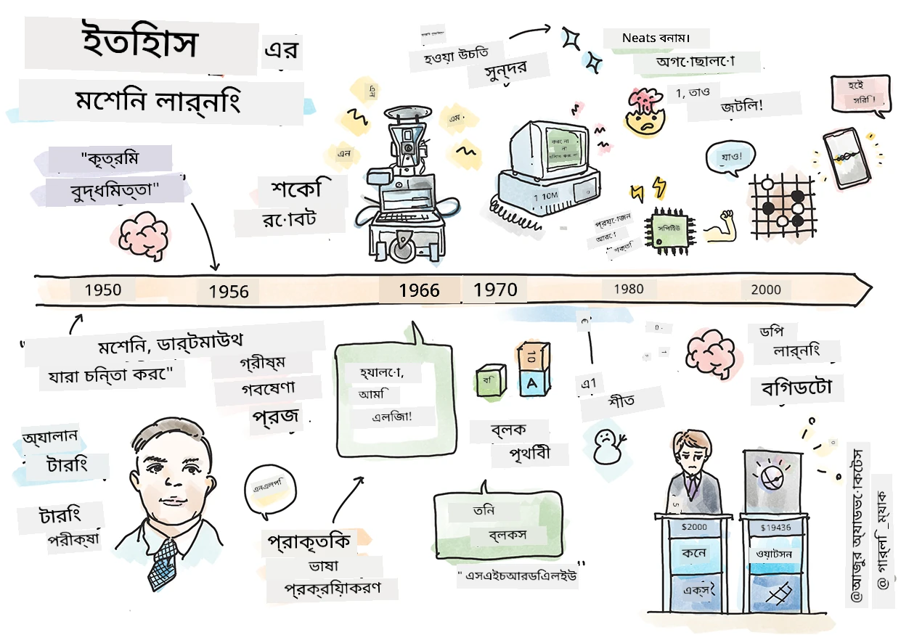
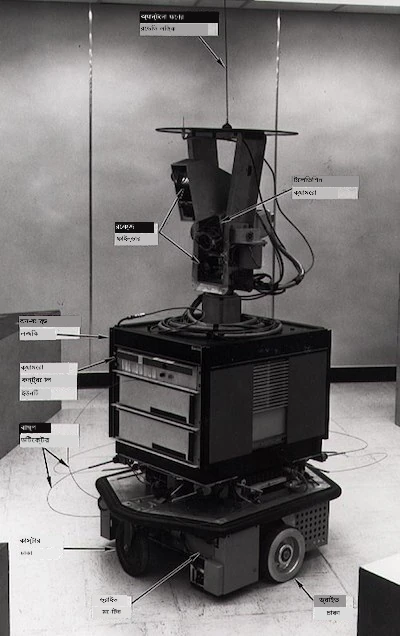
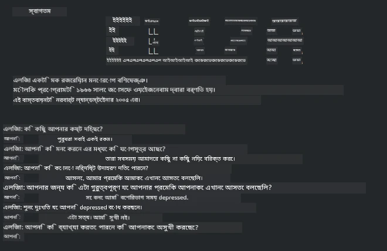

# মেশিন লার্নিংয়ের ইতিহাস

> [টোমোমি ইমুরা](https://www.twitter.com/girlie_mac) কর্তৃক স্কেচনোট

## [পূর্ব-লেকচার কুইজ](https://ff-quizzes.netlify.app/en/ml/)

---

> 🎥 এই পাঠের মাধ্যমে কাজ করার জন্য উপরের ছবিতে ক্লিক করুন একটি সংক্ষিপ্ত ভিডিওর জন্য।

এই পাঠে আমরা মেশিন লার্নিং এবং কৃত্রিম বুদ্ধিমত্তার ইতিহাসের প্রধান মাইলফলকগুলো সম্পর্কে আলোচনা করব।

কৃত্রিম বুদ্ধিমত্তা (এআই) ক্ষেত্র হিসাবে মেশিন লার্নিংয়ের ইতিহাসের সঙ্গে আন্তঃসংযুক্ত, কারণ এমএল-এর ভিত্তি সাপোর্ট করা অ্যালগরিদম এবং গণনাযুক্ত অগ্রগতি এআই-এর উন্নয়নে অবদান রেখেছে। মনে রাখা দরকার, যদিও এই ক্ষেত্রগুলি পৃথক অনুসন্ধানের স্থান হিসেবে ১৯৫০-এর দশকে স্ফটিকৃত হয়েছিল, গুরুত্বপূর্ণ [অ্যালগরিদমিক, পরিসংখ্যানগত, গাণিতিক, কম্পিউটেশনাল এবং প্রযুক্তিগত আবিষ্কার](https://wikipedia.org/wiki/Timeline_of_machine_learning) এই যুগের পূর্বেই ঘটে এবং অতিক্রম করেছিল। প্রকৃতপক্ষে, মানুষ [শতাব্দীর পর শতাব্দী ধরে](https://wikipedia.org/wiki/History_of_artificial_intelligence) এই প্রশ্নগুলো নিয়ে চিন্তা করে আসছে: এই নিবন্ধে 'ভাবনার মেশিন' ধারার ঐতিহাসিক বৌদ্ধিক ভিত্তি আলোচনা করা হয়েছে।

---
## উল্লেখযোগ্য আবিষ্কারসমূহ

- ১৭৬৩, ১৮১২ [বেজ থিওরেম](https://wikipedia.org/wiki/Bayes%27_theorem) এবং এর পূর্বসূরী। এই থিওরেম এবং এর প্রয়োগগুলি ইনফারেন্সের ভিত্তি, যা পূর্ব জ্ঞানের ভিত্তিতে একটি ঘটনাটি সংঘটিত হওয়ার সম্ভাবনা বর্ণনা করে।
- ১৮০৫ [লিস্ট স্কোয়ার থিওরি](https://wikipedia.org/wiki/Least_squares) ফরাসি গাণিতিক অ্যাড্রিয়েন-মেরি লেজান্দ্রে কর্তৃক প্রবর্তিত। এই থিওরি, যা আপনি আমাদের রিগ্রেশন ইউনিটে শিখবেন, ডেটা ফিটিংয়ে সহায়ক।
- ১৯১৩ [মার্কভ চেইনস](https://wikipedia.org/wiki/Markov_chain), রাশিয়ান গাণিতিক আন্দ্রে মার্কভের নামে নামকৃত, একটি পূর্ববর্তী অবস্থার ভিত্তিতে সম্ভাব্য ঘটনাগুলোর ক্রম বর্ণনা করতে ব্যবহৃত হয়।
- ১৯৫৭ [পারসেপট্রন](https://wikipedia.org/wiki/Perceptron) একটি প্রকারের লিনিয়ার ক্লাসিফায়ার যা আমেরিকান মনোবিজ্ঞানি ফ্রাঙ্ক রোজেনব্লাট আবিষ্কার করেছিলেন, যা ডিপ লার্নিং নিয়ে অগ্রগতির ভিত্তি।

---

- ১৯৬৭ [নিকটতম প্রতিবেশী](https://wikipedia.org/wiki/Nearest_neighbor) একটি অ্যালগরিদম যা মূলত রুট ম্যাপ করার জন্য ডিজাইন করা হয়েছিল। এমএল প্রেক্ষাপটে এটি প্যাটার্ন সনাক্ত করতে ব্যবহৃত হয়।
- ১৯৭০ [ব্যাকপ্রোপাগেশন](https://wikipedia.org/wiki/Backpropagation) ব্যবহৃত হয় [ফিডফরওয়ার্ড নিউরাল নেটওয়ার্ক](https://wikipedia.org/wiki/Feedforward_neural_network) প্রশিক্ষণের জন্য।
- ১৯৮২ [রিকারেন্ট নিউরাল নেটওয়ার্কস](https://wikipedia.org/wiki/Recurrent_neural_network) ফিডফরওয়ার্ড নিউরাল নেটওয়ার্ক থেকে উদ্ভূত কৃত্রিম নিউরাল নেটওয়ার্ক যা কালিক গ্রাফ তৈরি করে।

✅ একটু গবেষণা করুন। মেশিন লার্নিং এবং এআই-এর ইতিহাসে আর কী কী গুরুত্বপূর্ণ তারিখ চোখে পড়ে?

---
## ১৯৫০: চিন্তা করতে সক্ষম মেশিন

অ্যালান টুরিং, একজন সত্যিই অসাধারণ ব্যক্তি যিনি [২০১৯ সালে জনসাধারণের ভোটে](https://wikipedia.org/wiki/Icons:_The_Greatest_Person_of_the_20th_Century) ২০ ও শতকের সেরা বিজ্ঞানী নির্বাচিত হয়েছিলেন, 'চিন্তা করতে সক্ষম মেশিন' ধারণার ভিত্তি স্থাপনে সহায়তা করার জন্য পরিচিত। তিনি নিন্দকদের মোকাবিলা করেছিলেন এবং এই ধারণার প্রমাণের অংশ হিসেবে নিজের প্রয়োজনীয়তা মেটাতে [টুরিং টেস্ট](https://www.bbc.com/news/technology-18475646) তৈরি করেছিলেন, যা আপনি আমাদের NLP পাঠে অন্বেষণ করবেন।

---
## ১৯৫৬: ডার্টমাউথ সামার রিসার্চ প্রজেক্ট

"কৃত্রিম বুদ্ধিমত্তা ক্ষেত্র হিসেবে ডার্টমাউথ সামার রিসার্চ প্রজেক্ট একটি গুরুত্বপূর্ণ ঘটনা," এবং এখানেই 'কৃত্রিম বুদ্ধিমত্তা' শব্দটি প্রবর্তিত হয়েছিল ([সুত্র](https://250.dartmouth.edu/highlights/artificial-intelligence-ai-coined-dartmouth))।

> শিক্ষার যেকোনো দিক বা বুদ্ধিমত্তার অন্য যেকোনো বৈশিষ্ট্য এমন সূক্ষ্মভাবে বর্ণনা করা যেতে পারে যে একটি মেশিন সেটা নকল করতে পারে।

---

প্রধান গবেষক, গণিতের অধ্যাপক জন ম্যাককার্থি আশা করেছিলেন "সিদ্ধান্ত নিয়ে কাজ করতে যে, শিক্ষার যেকোনো দিক বা বুদ্ধিমত্তার অন্য বৈশিষ্ট্য এমন সূক্ষ্মভাবে বর্ণনা করা যেতে পারে যে একটি মেশিন তা নকল করতে পারে।" অংশগ্রহণকারীদের মধ্যে এই ক্ষেত্রের আরেকজন প্রখ্যাত ব্যক্তি মারভিন মিনস্কি ছিলেন।

এই কর্মশালাটি "প্রতীকাত্মক পদ্ধতির উত্তরণ, সীমিত ডোমেইনে কেন্দ্রিত সিস্টেমসমূহ (প্রাথমিক বিশেষজ্ঞ সিস্টেম), এবং সংকেততাত্ত্বিক ও অভ্যর্থিত সিস্টেমের মধ্যে আলোচনা" শুরু ও উত্সাহিত করার জন্য স্বীকৃত। ([সুত্র](https://wikipedia.org/wiki/Dartmouth_workshop))

---
## ১৯৫৬ - ১৯৭৪: "সোনালী বছরগুলি"

১৯৫০-এর দশক থেকে ৭০-এর মাঝামাঝি পর্যন্ত, এআই অনেক সমস্যা সমাধানে সক্ষম হবে বলে আশাবাদী ছিল। ১৯৬৭ সালে মারভিন মিনস্কি আত্মবিশ্বাসের সঙ্গে বলেছিলেন, "এক প্রজন্মের মধ্যে ... 'কৃত্রিম বুদ্ধিমত্তা' তৈরির সমস্যা যথেষ্টাংশে সমাধান হবে।" (মিনস্কি, মারভিন (১৯৬৭), কম্পিউটেশন: ফাইনাইট অ্যান্ড ইনফিনাইট মেশিনস, ইংলউড ক্লিফস, এন.জে.: প্রেন্টিস-হল)

প্রাকৃতিক ভাষা প্রক্রিয়াকরণের গবেষণা ফুলে উঠল, অনুসন্ধান পরিমার্জিত ও শক্তিশালী হল, এবং 'মাইক্রো-ওয়ার্ল্ডস' ধারণা সৃষ্টি করা হল, যেখানে সরল কাজগুলি সোজা ভাষার নির্দেশে সম্পন্ন হত।

---

সরকারী সংস্থার ভালো তহবিল নিয়ে গবেষণা চালানো হয়, গণনা ও অ্যালগরিদমে অগ্রগতি ঘটে, এবং বুদ্ধিমান মেশিনের প্রোটোটাইপ তৈরি হয়। কিছু মেশিন হলো:

* [শেকি দ্য রোবট](https://wikipedia.org/wiki/Shakey_the_robot), যিনি 'বুদ্ধিমত্তার সঙ্গে' কাজ করার পদ্ধতি পরিকল্পনা ও সিদ্ধান্ত নিতে পারতেন।

    
    > ১৯৭২ সালে শেকি

---

* এলিজা, একটি প্রাথমিক 'চ্যাটারবট', মানুষের সঙ্গে কথা বলত এবং এক প্রাথমিক 'থেরাপিস্ট' হিসেবে কাজ করত। আপনি NLP পাঠে এলিজা সম্পর্কে আরও জানতে পারবেন।

    
    > এলিজার একটি সংস্করণ, একটি চ্যাটবট

---

* "ব্লকস ওয়ার্ল্ড" ছিল একটি মাইক্রো-ওয়ার্ল্ডের উদাহরণ যেখানে ব্লকগুলোকে স্তূপিত এবং শ্রেণীবদ্ধ করা যেত, এবং মেশিনকে সিদ্ধান্তগ্রহণ শেখানোর পরীক্ষাগুলো সম্পন্ন করা যেত। [SHRDLU](https://wikipedia.org/wiki/SHRDLU) মত লাইব্রেরির মাধ্যমে নির্মিত অগ্রগতি ভাষা প্রক্রিয়াকরণকে এগিয়ে নিয়ে গেল।

    

    > 🎥 ভিডিওর জন্য উপরের ছবিতে ক্লিক করুন: SHRDLU সহ ব্লকস ওয়ার্ল্ড

---
## ১৯৭৪ - ১৯৮০: "এআই শীতকাল"

১৯৭০-এর দশকের মাঝামাঝি সময়ে বোঝা গেল, 'বুদ্ধিমান মেশিন' তৈরি করার জটিলতা কম আঁকা হয়েছে এবং উপলব্ধ কম্পিউট ক্ষমতার জন্য অঙ্গীকার অতিরঞ্জিত ছিল। তহবিল শুকিয়ে গেল এবং ক্ষেত্রের প্রতি আত্মবিশ্বাস কমে গেল। কিছু বিষয় যা আত্মবিশ্বাসে প্রভাব ফেলেছিল:
---
- **সীমাবদ্ধতা**। কম্পিউট ক্ষমতা খুব কম ছিল।
- **কম্বিনেটোরিয়াল বিস্ফোরণ**। প্রশিক্ষণের জন্য প্রয়োজনীয় পরামিতির পরিমাণ বিস্তৃতভাবে বৃদ্ধি পেয়েছিল, কম্পিউট ক্ষমতা বা সক্ষমতার সমান্তরালে নয়।
- **তথ্যের অভাব**। ডেটার অভাব ছিল যা অ্যালগরিদম পরীক্ষা, উন্নয়ন ও পরিমার্জনে বাধা সৃষ্টি করেছিল।
- **আমরা কি সঠিক প্রশ্ন করছি?**। যে প্রশ্নগুলো করা হচ্ছিল সেগুলি নিয়েও প্রশ্ন উঠতে শুরু করে। গবেষকরা তাদের পদ্ধতি নিয়ে সমালোচনার মুখোমুখি হন:
  - টুরিং টেস্টগুলো প্রশ্নবিদ্ধ হলো বিশেষত 'চাইনিজ রুম থিওরি' দ্বারা যা যুক্তি দেয়, "ডিজিটাল কম্পিউটার প্রোগ্রামিং ভাষা বোঝার ছাপ দিতে পারে কিন্তু সত্যিকারের বোঝাপড়া তৈরি করতে পারবে না।" ([সুত্র](https://plato.stanford.edu/entries/chinese-room/))
  - "থেরাপিস্ট" এলিজার মত কৃত্রিম বুদ্ধিমত্তা সমাজে পরিচয় করানোর নৈতিকতা চ্যালেঞ্জের মুখে পড়ে।

---

একই সময়ে, বিভিন্ন এআই চিন্তার বই তৈরি হতে শুরু করে। ["স্ক্রাফি" বনাম "নিট এআই"](https://wikipedia.org/wiki/Neats_and_scruffies) পদ্ধতির মধ্যে একটি দ্বৈততা গড়ে ওঠে। _স্ক্রাফি_ ল্যাবগুলো ঘণ্টার পর ঘণ্টা প্রোগ্রাম পরিবর্তন করতো যতক্ষণ না কাঙ্ক্ষিত ফলাফল আসতো। _নিট_ ল্যাবগুলো "তথ্যগত ও আনুষ্ঠানিক সমস্যা সমাধানে মনোযোগ দিতো"। এলিজা এবং SHRDLU ছিল সুপরিচিত _স্ক্রাফি_ সিস্টেম। ১৯৮০-এর দশকে, এমএল সিস্টেম পুনরুত্পাদনীয় করার চাহিদা জন্ম নিচ্ছিল, তখন _নিট_ পদ্ধতি অগ্রগামী হয় কারণ এর ফলাফলগুলো আরও ব্যাখ্যাযোগ্য।

---
## ১৯৮০-এর দশকের বিশেষজ্ঞ সিস্টেম

ক্ষেত্রটি বাড়ার সঙ্গে সঙ্গে, ব্যবসায়িক উপকারিতা স্পষ্ট হলো, এবং ১৯৮০-এর দশকে 'বিশেষজ্ঞ সিস্টেম' ব্যাপকভাবে ছড়িয়ে পড়ল। "বিশেষজ্ঞ সিস্টেমগুলো প্রথম সফল কৃত্রিম বুদ্ধিমত্তা সফটওয়্যারের মধ্যে একটি।" ([সুত্র](https://wikipedia.org/wiki/Expert_system))

এই ধরনের সিস্টেম প্রকৃতপক্ষে _হাইব্রিড_, আংশিকভাবে একটি নিয়ম ইঞ্জিন যা ব্যবসায়িক চাহিদাগুলি সংজ্ঞায়িত করে এবং একটি ইনফারেন্স ইঞ্জিন যা নতুন তথ্য অনুসন্ধানে নিয়ম ব্যবস্থার ব্যবহার করে।

এই যুগে নিউরাল নেটওয়ার্কের প্রতি মনোযোগ বাড়তে থাকে।

---
## ১৯৮৭ - ১৯৯৩: এআই 'ঠান্ডা'

বিশেষায়িত বিশেষজ্ঞ সিস্টেমের হার্ডওয়্যারগুলোর বিস্তার অত্যধিক বিশেষায়িত হওয়ার কারণ হয়ে দাঁড়ায়। ব্যক্তিগত কম্পিউটারের উত্থানও এই বড়, বিশেষায়িত, কেন্দ্রিয়কৃত সিস্টেমগুলোর সঙ্গে প্রতিযোগিতা করে। গণনার গণতান্ত্রিকরণ শুরু হয়, যা অবশেষে বড় ডেটার আধুনিক বিস্ফোরণের পথ প্রস্তুত করে।

---
## ১৯৯৩ - ২০১১

এই সময়ে এমএল এবং এআই এলাকায় নতুন যুগ শুরু হয় যা আগের ডেটা ও কম্পিউট ক্ষমতার অভাব থেকে সৃষ্ট সমস্যাগুলো সমাধান করতে সক্ষম হয়। ডেটার পরিমাণ দ্রুত বৃদ্ধি পেতে থাকে এবং আরো ব্যাপকভাবে উপলব্ধি হয়, বিশেষ করে ২০০৭ সালে স্মার্টফোন আবির্ভাবের সাথে। কম্পিউট ক্ষমতা বহুগুণ বৃদ্ধি পায়, এবং অ্যালগরিদমও সঙ্গতিপূর্ণ উন্নত হয়। ক্ষেত্রটি পরিপক্বতা লাভ করে কারণ অতীতের স্বাধীন দিনগুলো একটি যথার্থ শাস্ত্রতে রূপ নেয়।

---
## এখন

আজ মেশিন লার্নিং এবং এআই আমাদের জীবনের প্রায় প্রতিটি অংশে ছোঁয়। এই যুগে এই অ্যালগরিদমগুলোর মানুষের জীবনে ঝুঁকি এবং সম্ভাব্য প্রভাবগুলি সাবধানে বোঝা জরুরি। মাইক্রোসফটের ব্র্যাড স্মিথ বলেছেন, "তথ্য প্রযুক্তি মানবাধিকার সুরক্ষা যেমন গোপনীয়তা এবং প্রকাশের স্বাধীনতার মূল বিষয়সমূহ তুলে ধরে। এই বিষয়গুলো প্রযুক্তি কোম্পানিগুলোর জন্য আরও বেশি দায়িত্বের কথা বলে যারা এই পণ্য তৈরি করে। আমাদের দৃষ্টিতে, এগুলোই সরকারী নিয়ন্ত্রনের জন্য চিন্তাশীল আহ্বান এবং গ্রহণযোগ্য ব্যবহারের জন্য নীতিমালা বিকাশের আহ্বান তোলে।" ([সুত্র](https://www.technologyreview.com/2019/12/18/102365/the-future-of-ais-impact-on-society/))

---

ভবিষ্যতে কী ঘটবে তা দেখা বাকি, কিন্তু এই কম্পিউটার সিস্টেম এবং যেসব সফটওয়্যার ও অ্যালগরিদম তারা চালায় তা বোঝা গুরুত্বপূর্ণ। আমরা আশা করি এই কারিকুলাম আপনাকে ভালো বোঝাপড়া অর্জনে সাহায্য করবে যাতে আপনি নিজের জন্য সিদ্ধান্ত নিতে পারেন।

> 🎥 উপরের ছবিতে ক্লিক করুন ভিডিওর জন্য: ইয়্যান লেকুন এই লেকচারে ডিপ লার্নিংয়ের ইতিহাস আলোচনা করছেন

---
## 🚀চ্যালেঞ্জ

ঐতিহাসিক মুহূর্তগুলোর মধ্যে একটিতে গভীরভাবে প্রবেশ করুন এবং তাদের পেছনের ব্যক্তিদের সম্পর্কে আরও জানুন। আকর্ষণীয় চরিত্র রয়েছে, এবং কোনো বৈজ্ঞানিক আবিষ্কার কখনো সাংস্কৃতিক শূন্যস্থান থেকে আবির্ভূত হয়নি। আপনি কী আবিষ্কার করেন?

## [পরবর্তী লেকচার কুইজ](https://ff-quizzes.netlify.app/en/ml/)

---
## পর্যালোচনা এবং স্ব-অধ্যয়ন

এখানে কিছু দেখতে এবং শুনতে উপযুক্ত সামগ্রী:

[এই পডকাস্ট যেখানে অ্যামি বোইড এআই এর বিবর্তন আলোচনা করছেন](http://runasradio.com/Shows/Show/739)

---

## অ্যাসাইনমেন্ট

[একটি টাইমলাইন তৈরি করুন](assignment.md)

---

<!-- CO-OP TRANSLATOR DISCLAIMER START -->
**অস্বীকৃতি**:
এই নথিটি AI অনুবাদ পরিষেবা [Co-op Translator](https://github.com/Azure/co-op-translator) ব্যবহার করে অনূদিত হয়েছে। যদিও আমরা শুদ্ধতার জন্য চেষ্টা করি, অনুগ্রহ করে মনে রাখবেন যে স্বয়ংক্রিয় অনুবাদে ত্রুটি বা অসঙ্গতি থাকতে পারে। মূল নথিটি তার স্বভাষায় কর্তৃত্বপূর্ণ উৎস হিসেবে বিবেচিত হওয়া উচিত। গুরুত্বপূর্ণ তথ্যের জন্য পেশাদার মানব অনুবাদ সুপারিশ করা হয়। এই অনুবাদের ব্যবহারে প্রয়োজনীয় ভুল বোঝাবুঝি বা ভুল ব্যাখ্যার জন্য আমরা দায়বদ্ধ নই।
<!-- CO-OP TRANSLATOR DISCLAIMER END -->