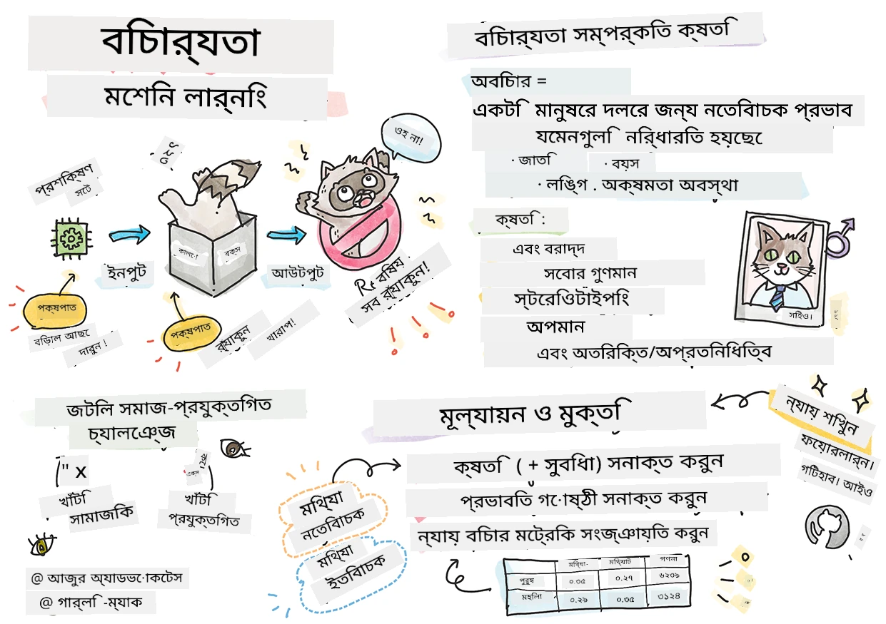

# দায়িত্বশীল AI দিয়ে মেশিন লার্নিং সমাধান তৈরি
 

> স্কেচনোট লিখেছেন [Tomomi Imura](https://www.twitter.com/girlie_mac)

## [প্রী-লেকচার কুইজ](https://ff-quizzes.netlify.app/en/ml/)
 
## পরিচিতি

এই পাঠক্রমে, আপনি আবিষ্কার করতে শুরু করবেন যে কীভাবে মেশিন লার্নিং আমাদের প্রতিদিনের জীবনে প্রভাব ফেলছে এবং ফেলতে পারে। বিশেষ করে আজকের দিনে, সিস্টেম এবং মডেলগুলি প্রতিদিনের সিদ্ধান্ত গ্রহণের কাজগুলোতে জড়িত থাকে, যেমন স্বাস্থ্যসেবা নির্ণয়, ঋণ অনুমোদন বা দুর্নীতির সনাক্তকরণ। তাই, এই মডেলগুলোর সঠিক ও বিশ্বাসযোগ্য ফলাফল দেওয়া জরুরি। যেকোন সফটওয়্যার অ্যাপ্লিকেশনের মতো, AI সিস্টেমও প্রত্যাশা পূরণ করতে না পারা বা অনাকাঙ্ক্ষিত ফলাফল দেয়ার সম্ভাবনা থাকে। এজন্য AI মডেলের আচরণ বোঝা এবং ব্যাখ্যা করার ক্ষমতা থাকা অপরিহার্য।

ভাবুন যখন আপনি মডেল তৈরিতে ব্যবহার করা ডাটাতে কোনো নির্দিষ্ট জনগোষ্ঠীর যেমন: বর্ণ, লিঙ্গ, রাজনৈতিক মতামত, ধর্মের অভাব থাকে বা অনুপাতে বেশি প্রতিনিধিত্ব পায়, তখন কী হতে পারে? যখন মডেলের আউটপুট কোনো নির্দিষ্ট জনগোষ্ঠীর পক্ষে যায় তখন কী হয়? তার পরিণতি কী? এছাড়াও, মডেলের ফলাফল কোনো ক্ষতিকর হলে এবং মানুষের জন্য অযাচিত হলে কী ঘটে? AI সিস্টেমের আচরণের জন্য কে দায়ী? এই প্রশ্নগুলোই আমরা এই পাঠক্রমে অনুসন্ধান করব।

এই পাঠে আপনি: 

- মেশিন লার্নিংয়ে ন্যায়বিচারের গুরুত্ব এবং ন্যায়বিচার সংক্রান্ত ক্ষতির বিষয়ে সচেতনতা বাড়াবেন।
- আউটলায়ার এবং অস্বাভাবিক পরিস্থিতি অন্বেষণ করার অভ্যাসে পরিচিত হবেন, যাতে নির্ভরযোগ্যতা ও নিরাপত্তা নিশ্চিত করা যায়।
- অন্তর্ভুক্তিমূলক সিস্টেম ডিজাইন করে সবাইকে ক্ষমতায়িত করার প্রয়োজনীয়তা সম্পর্কে বোঝাপড়া লাভ করবেন।
- ডেটা এবং মানুষের গোপনীয়তা ও সুরক্ষা রক্ষার গুরুত্ব অন্বেষণ করবেন।
- AI মডেলের আচরণ ব্যাখ্যার জন্য গ্লাস বক্স পদ্ধতির গুরুত্ব দেখবেন।
- AI সিস্টেমে বিশ্বাস গড়ে তুলতে জবাবদিহিতা কতটা অপরিহার্য তা সচেতন থাকবেন।

## পূর্বশর্ত

পূর্বশর্ত হিসেবে, অনুগ্রহ করে "দায়িত্বশীল AI নীতি" লার্ন পাথ সম্পন্ন করুন এবং নিচের ভিডিওটি দেখুন:

দায়িত্বশীল AI সম্পর্কে আরও শিখতে এই [লার্ন পাথ](https://docs.microsoft.com/learn/modules/responsible-ai-principles/?WT.mc_id=academic-77952-leestott) অনুসরণ করুন

> 🎥 ভিডিও দেখতে উপরের ছবিতে ক্লিক করুন: Microsoft-এর দায়িত্বশীল AI-এর পদ্ধতি

## ন্যায়বিচার

AI সিস্টেমকে সবার প্রতি ন্যায়বান হতে হবে এবং একই ধরনের মানুষের গোষ্ঠীগুলোর প্রতি ভিন্নভাবে আচরণ এড়াতে হবে। উদাহরণস্বরূপ, যখন AI সিস্টেম চিকিৎসা নির্দেশনা, ঋণ আবেদন বা চাকরির ক্ষেত্রে পরামর্শ দেয়, তখন একই ধরনের উপসর্গ, আর্থিক পরিস্থিতি বা পেশাগত যোগ্যতা সম্পন্ন সবাইকে একই সুপারিশ করা উচিত। আমরা প্রত্যেকেই এমন বংশগত পক্ষপাত বহন করি যা আমাদের সিদ্ধান্ত ও কার্যকলাপকে প্রভাবিত করে। এই পক্ষপাতগুলি ডেটায় প্রতিফলিত হতে পারে যা AI সিস্টেমকে প্রশিক্ষিত করতে ব্যবহৃত হয়। কখনো কখনো এমন প্রভাব অজান্তে চলে আসে। পক্ষপাত অন্তর্ভুক্তির সজ্ঞানে সচেতন হওয়া কঠিন।

**“অন্যায়”** মানে নেতিবাচক প্রভাব বা “ক্ষতি”, যা নির্দিষ্ট জনগোষ্ঠীর জন্য হয়, যেমন বর্ণ, লিঙ্গ, বয়স বা প্রতিবন্ধী অবস্থার ভিত্তিতে। প্রধান ন্যায়বিচার-সংক্রান্ত ক্ষতি শ্রেণীবদ্ধ করা যায়:

- **বন্টন**, যেমন লিঙ্গ বা জাতিগততার ক্ষেত্রে এক পক্ষের পক্ষে বেশি সুবিধা দেওয়া হয়।
- **পরিষেবার গুণগত মান**। যদি আপনি এক বিশেষ পরিস্থিতির জন্য ডেটা প্রশিক্ষণ দেন কিন্তু বাস্তবতা অনেক বেশি জটিল হয়, তবে তা খারাপ সেবাতে পরিণত হয়। উদাহরণস্বরূপ, এমন একটি হ্যান্ড সাবান ডিসপেন্সার যা গাঢ় রঙের ত্বকের মানুষের উপস্থিতি শনাক্ত করতে পারে না। [তথ্যসূত্র](https://gizmodo.com/why-cant-this-soap-dispenser-identify-dark-skin-1797931773)
- **হেয় করা**। অন্যায়ভাবে কারো সমালোচনা বা খারাপ ট্যাগ দেয়া। উদাহরণস্বরূপ, একটি ছবি লেবেলিং প্রযুক্তি গাঢ় রঙের মানুষের ছবি গোড়িলাদের হিসেবে ভুল চিহ্নিত করেছিল।
- **অধিক বা কম প্রতিনিধিত্ব**। ধারণাটি হলো কোনো নির্দিষ্ট গোষ্ঠী কোনো পেশায় দেখা যায় না এবং যেকোনো পরিষেবা বা কাজ যা তা প্রাধান্য দেয়, তা ক্ষতিকর হতে পারে।
- **স্টেরিওটাইপিং**। কোনো গোষ্ঠীকে পূর্বনির্ধারিত বৈশিষ্ট্যের সাথে যুক্ত করা। উদাহরণস্বরূপ, ইংরেজি এবং তুর্কি ভাষার অনুবাদ ব্যবস্থায় লিঙ্গভিত্তিক স্টেরিওটাইপিক্যাল শব্দ থাকার কারণে ভুল হতে পারে।

> তুর্কিতে অনুবাদ

> আবার ইংরেজিতে অনুবাদ

AI সিস্টেম ডিজাইন ও পরীক্ষার সময় নিশ্চিত করতে হয় যে AI ন্যায়সঙ্গত এবং পক্ষপাতমূলক বা বৈষম্যমূলক সিদ্ধান্ত না দেয়, যা মানবকেও বাধ্যতামূলকভাবে এড়াতে হয়। AI ও মেশিন লার্নিংয়ে ন্যায়প্রদতা নিশ্চিত করা একটি জটিল সামাজিক-প্রযুক্তিগত চ্যালেঞ্জ।

### নির্ভরযোগ্যতা এবং নিরাপত্তা

বিশ্বাস গড়ে তুলতে AI সিস্টেমগুলোকে সাধারণ ও অপ্রত্যাশিত পরিস্থিতিতেও নির্ভরযোগ্য, নিরাপদ এবং নিয়মিত থাকতে হবে। একাধিক পরিস্থিতিতে বিশেষ করে আউটলায়ার হলে AI সিস্টেম কেমন আচরণ করবে জানা গুরুত্বপূর্ণ। AI সমাধান গড়ে তোলার সময়ে AI সমাধানগুলো বিভিন্ন পরিস্থিতি মোকাবেলার উপর শক্ত ফোকাস থাকা প্রয়োজন। উদাহরণস্বরূপ, স্বয়ংচালিত গাড়ি মানুষের নিরাপত্তাকে সর্বোচ্চ অগ্রাধিকার দেবে। তাই গাড়িকে AI চালিত করার সময় গাড়িটি রাত, বিদ্যুৎ ঝড়, তুষারঝড়, রাস্তা পারাপারকারী শিশু, পোষা প্রাণী, রাস্তা নির্মাণ ইত্যাদি সকল সম্ভাব্য পরিস্থিতি বিবেচনা করতে হবে। একটি AI সিস্টেম কতটা ভালোভাবে এবং নিরাপদে বিভিন্ন পরিবেশ মোকাবেলা করতে পারে তা প্রকৌশলী বা AI ডেভেলপার কতটা পূর্বাভাস দিয়েছে, তা প্রতিফলিত করে।

> [🎥 ভিডিও দেখতে এখানে ক্লিক করুন: ](https://www.microsoft.com/videoplayer/embed/RE4vvIl)

### অন্তর্ভুক্তিমূলকতা

AI সিস্টেম এমনভাবে ডিজাইন করা উচিত যা সবাইকে জড়িত করে এবং ক্ষমতায়িত করে। AI সিস্টেম ডিজাইন ও বাস্তবায়নের সময় ডেটা বিজ্ঞানী ও ডেভেলপাররা সিস্টেমের সম্ভাব্য প্রতিবন্ধকতাগুলো সনাক্ত করে যা মানুষের বেছে নিয়ে বাদ দিতে পারে। উদাহরণস্বরূপ, বিশ্বে ১ বিলিয়ন প্রতিবন্ধী মানুষ আছেন। AI প্রগতির মাধ্যমে তারা প্রতিদিনের জীবনে তথ্য ও সুযোগ আরও সহজে পেতে পারেন। প্রতিবন্ধকতাগুলো মোকাবেলা করে, everyoneকে উপকৃত করে এমন AI পণ্য উদ্ভাবন এবং উন্নয়নের সুযোগ তৈরি হয়।

> [🎥 AI-তে অন্তর্ভুক্তিমূলকতা সম্পর্কে ভিডিও দেখতে এখানে ক্লিক করুন](https://www.microsoft.com/videoplayer/embed/RE4vl9v)

### সুরক্ষা ও গোপনীয়তা

AI সিস্টেম নিরাপদ হওয়া উচিত এবং মানুষের গোপনীয়তা সম্মান করা উচিত। যারা তাদের গোপনীয়তা, তথ্য বা জীবন ঝুঁকিতে ফেলে এমন সিস্টেমে কম বিশ্বাস করে। মেশিন লার্নিং মডেল প্রশিক্ষণের সময় সেরা ফলাফল পাওয়ার জন্য আমরা ডেটার ওপর নির্ভর করি। এজন্য ডেটার উৎস ও অখণ্ডতা বিবেচনা জরুরি। যেমন, ডেটা ব্যবহারকারী জমা দিয়েছেন কি না বা এটি কি প্রকাশ্যে উপলব্ধ ছিল? পরবর্তী ধাপে, ডেটার সঙ্গে কাজ করার সময় গোপনীয় তথ্য রক্ষা এবং আক্রমণ প্রতিরোধী AI সিস্টেম তৈরি করা আবশ্যক। AI ব্যাপক হওয়ায় গোপনীয়তা এবং গুরুত্বপূর্ণ ব্যক্তিগত ও ব্যবসায়িক তথ্য রক্ষা করা আরও গুরুত্বপূর্ণ ও জটিল হয়ে দাঁড়িয়েছে। গোপনীয়তা ও ডেটা সুরক্ষা সমস্যা AI-র জন্য বিশেষ মনোযোগ দাবি করে কারণ সঠিক ও সচেতন পূর্বাভাস ও সিদ্ধান্ত নেওয়ার জন্য AI সিস্টেমের ডেটা প্রবেশাধিকার অপরিহার্য।

> [🎥 AI-তে সুরক্ষা সম্পর্কে ভিডিও দেখতে এখানে ক্লিক করুন](https://www.microsoft.com/videoplayer/embed/RE4voJF)

- একটি শিল্প হিসেবে, আমরা গোপনীয়তা ও সুরক্ষায় উল্লেখযোগ্য অগ্রগতি করেছি, বিশেষ করে GDPR (জনरल ডেটা প্রোটেকশন রেগুলেশন) এর মত নিয়মকানুন দ্বারা চালিত হয়। 
- তবে AI সিস্টেমে আমাদের মেনে নিতে হবে যে, ব্যক্তিগত ডেটার বেশি প্রয়োজন এবং গোপনীয়তার মধ্যে একটি টানাপোড়েন আছে। 
- যেমন ইন্টারনেটের জন্মের সময় সংযুক্ত কম্পিউটারগুলোর ক্ষেত্রে, এখনও AI-এর সাথে সম্পর্কিত সুরক্ষা সমস্যাগুলোর ব্যাপক বৃদ্ধি দেখছি। 
- একই সাথে, আমরা দেখেছি AI কে সুরক্ষা উন্নত করতে ব্যবহার করা হচ্ছে। উদাহরণস্বরূপ, অধিকাংশ আধুনিক অ্যান্টিভাইরাস স্ক্যানার আজকাল AI হিউরিস্টিক দ্বারা চালিত হয়। 
- আমাদের ডেটা সায়েন্স প্রক্রিয়াগুলো সম্প্রতি গোপনীয়তা এবং সুরক্ষার সর্বাধুনিক অনুশীলনের সাথে αρμονিয়ভাবে মিশতে হবে। 

### স্বচ্ছতা
AI সিস্টেম বোঝাপড়াযোগ্য হওয়া উচিত। স্বচ্ছতার একটি গুরুত্বপূর্ণ অংশ হলো AI সিস্টেম ও তাদের উপাদানগুলোর আচরণ ব্যাখ্যা করা। AI সিস্টেমের ভালো বোঝাপড়া নিশ্চিত করতে অংশীদারদের বুঝতে হবে তারা কেন এবং কীভাবে কাজ করে যাতে তারা সম্ভাব্য কর্মক্ষমতা সমস্যা, নিরাপত্তা ও গোপনীয়তা উদ্বেগ, পক্ষপাত, বঞ্চনামূলক অনুশীলন অথবা অনিচ্ছাকৃত ফলাফলের সনাক্তকরণ করতে পারে। আমরা বিশ্বাস করি AI ব্যবহারকারীদের উচিত সতর্ক এবং সৎ হওয়া যে কখন, কেন এবং কীভাবে তারা AI ব্যবহার করছেন, এবং ব্যবহৃত সিস্টেমের সীমাবদ্ধতা সম্পর্কে জানান। উদাহরণস্বরূপ, যদি একটি ব্যাংক তাদের ভোক্তা ঋণ সিদ্ধান্ত সমর্থনে AI সিস্টেম ব্যবহার করে, তবে ফলাফলগুলি নিরীক্ষণ ও বুঝা জরুরি কোন ডেটা সিস্টেমের পরামর্শকে প্রভাবিত করে। সরকার শিল্পগুলোর AI নিয়ন্ত্রণ শুরু করছে, তাই ডেটা বিজ্ঞানী ও প্রতিষ্ঠানগুলোকে ব্যাখ্যা করতে হবে যদি AI সিস্টেম আইনগত শর্ত পূরণ করে, বিশেষ করে অনিচ্ছাকৃত ফলাফল হলে।

> [🎥 AI-তে স্বচ্ছতা সম্পর্কিত ভিডিও দেখতে এখানে ক্লিক করুন](https://www.microsoft.com/videoplayer/embed/RE4voJF)

- AI সিস্টেমগুলি এত জটিল যে তারা কীভাবে কাজ করে এবং ফলাফল কেমন আসে বোঝা কঠিন। 
- এর ফলে এই সিস্টেমগুলোর ব্যবস্থাপনা, প্রয়োগ এবং নথিবদ্ধকরণ প্রভাবিত হয়। 
- সবচেয়ে গুরুত্বপূর্ণ, এর ফলে সিস্টেমগুলোর ফলাফল ব্যবহার করে যেসব সিদ্ধান্ত নেওয়া হয়, তারা প্রভাবিত হয়। 

### জবাবদিহিতা
 
যারা AI সিস্টেম ডিজাইন ও প্রয়োগ করে তাদের সিস্টেমের কার্যকরির জন্য দায়ী হতে হবে। বিশেষত ফেসিয়াল রিকগনিশন মত সংবেদনশীল প্রযুক্তিতে জবাবদিহিতা অপরিহার্য। সম্প্রতি, ফেসিয়াল রিকগনিশন প্রযুক্তির উপর চাহিদা বেড়েছে, বিশেষত আইন প্রয়োগকারী সংস্থাগুলো থেকে যারা হারানো শিশু খুঁজে পেতে সম্ভাবনা দেখছেন। তবে এই প্রযুক্তি সরকার দ্বারা নাগরিকদের মৌলিক স্বাধীনতা ঝুঁকিতে ফেলতে ব্যবহৃত হতে পারে যেমন নির্দিষ্ট ব্যক্তিদের অব্যাহত নজরদারি চালানোর মাধ্যমে। তাই, ডেটা বিজ্ঞানী ও প্রতিষ্ঠানগুলোকে দায়িত্বশীল হতে হবে AI সিস্টেম মানুষ অথবা সমাজে কী প্রভাব ফেলে তার জন্য।

> 🎥 ভিডিও দেখতে উপরের ছবিতে ক্লিক করুন: ফেসিয়াল রিকগনিশন দ্বারা বৃহৎ পর্যবেক্ষণের সতর্কতা

আমাদের প্রজন্মের জন্য সবচেয়ে বড় প্রশ্নগুলোর মধ্যে একটি হলো, আমরা কিভাবে নিশ্চিত করব যে কম্পিউটার মানুষের প্রতি দায়বদ্ধ থাকবে এবং যারা কম্পিউটার ডিজাইন করে তারা সকলের প্রতি দায়বদ্ধ থাকবে।

## প্রভাব মূল্যায়ন

মেশিন লার্নিং মডেল প্রশিক্ষণের আগে, AI সিস্টেমের উদ্দেশ্য, এর পরিকল্পিত ব্যবহার, কোথায় এটি বসানো হবে এবং কারা সিস্টেমের সঙ্গে ইন্টার‌্যাক্ট করবে তা বোঝার জন্য প্রভাব মূল্যায়ন করা জরুরি। এটি রিভিউয়ার বা টেস্টারদের জন্য উপকারী যারা সিস্টেম পর্যালোচনা করছেন, যাতে তারা সম্ভাব্য ঝুঁকি ও প্রত্যাশিত পরিণতি নির্ধারণের জন্য প্রাসঙ্গিক বিষয় বিবেচনা করতে পারেন।

প্রভাব মূল্যায়ন করার সময় নিম্নলিখিত বিষয়গুলো ফোকাসের অধীনে থাকে:

* **ব্যক্তিগত ওপর নেতিবাচক প্রভাব**। কোন বিধিনিষেধ, সীমাবদ্ধতা, অপর্যাপ্ত ব্যবহার বা পরিচিত সীমাবদ্ধতা যা সিস্টেমের কর্মদক্ষতাকে বাধাগ্রস্ত করে, তা জেনে রাখা জরুরি যেন সিস্টেম মানুষের ক্ষতি করতে ব্যবহৃত না হয়।
* **ডেটা প্রয়োজনীয়তা**। সিস্টেম কিভাবে এবং কোথায় ডেটা ব্যবহার করবে তা বোঝার মাধ্যমে রিভিউয়াররা কোন ডেটা নিয়ম (যেমন, GDPR বা HIPAA) মেনে চলা প্রয়োজন কী না তা পরীক্ষা করতে পারবেন। আর ডেটার উৎস বা পরিমাণ প্রশিক্ষণের জন্য যথেষ্ট কি না তাও নিশ্চিত করবেন।
* **প্রভাবের সারাংশ**। সিস্টেম ব্যবহার থেকে সম্ভাব্য ক্ষতির একটি তালিকা সংগ্রহ করুন। পুরো মেশিন লার্নিং ব lifecycle জুড়ে এই সমস্যা সমাধান বা মোকাবেলা হচ্ছে কিনা তা পর্যালোচনা করুন।
* প্রতিটি ছয়টি মূল নীতির জন্য **প্রযোজ্য লক্ষ্য**। প্রতিটি নীতির লক্ষ্যে পৌঁছানো হয়েছে কিনা এবং কোনো ফাঁক আছে কিনা তা মূল্যায়ন করুন।

## দায়িত্বশীল AI দিয়ে ডিবাগিং

সফটওয়্যার অ্যাপ্লিকেশন ডিবাগিংয়ের মতোই, AI সিস্টেমে সমস্যা চিহ্নিত করা এবং সমাধান করা একটি অপরিহার্য প্রক্রিয়া। মডেল প্রত্যাশিত বা দায়িত্বশীলভাবে কাজ না করার অনেক কারণ থাকতে পারে। অনেক প্রচলিত মডেল কর্মক্ষমতা মেট্রিক্স একটি মডেলের ফলাফলের পরিমাণগত সামগ্রিক হিসাব প্রদান করে, যা দায়িত্বশীল AI নীতিমালা লঙ্ঘনের বিশ্লেষণে যথেষ্ট নয়। তদুপরি, মেশিন লার্নিং মডেল একটি কালো বাক্স যা এর ফলাফলের কারণ বোঝা বা ভুল হলে ব্যাখ্যা দেওয়া কঠিন করে তোলে। এই কোর্সের পরে, আমরা শেখব কিভাবে দায়িত্বশীল AI ড্যাশবোর্ড ব্যবহার করে AI সিস্টেম ডিবাগ করতে হয়। ড্যাশবোর্ড ডেটা বিজ্ঞানী ও AI ডেভেলপারদের জন্য একটি সমন্বিত টুল যা নিম্নলিখিত কাজ করতে সাহায্য করে:

* **ত্রুটি বিশ্লেষণ**। মডেলের ত্রুটি বণ্টন চিহ্নিত করতে যা সিস্টেমের ন্যায়বিচার বা নির্ভরযোগ্যতাকে প্রভাবিত করতে পারে।
* **মডেল ওভারভিউ**। ডেটা গোষ্ঠীগুলোর মধ্যে মডেলের পারফরম্যান্সের পার্থক্য কোথায় তা আবিষ্কার করতে।
* **ডেটা বিশ্লেষণ**। ডেটা বণ্টন বোঝার ও ডেটায় যে কোনো পক্ষপাত চিহ্নিত করার জন্য, যা ন্যায়বিচার, অন্তর্ভুক্তিমূলকতা, এবং নির্ভরযোগ্যতার সমস্যা তৈরি করতে পারে।
* **মডেল ব্যাখ্যাযোগ্যতা**। মডেলের পূর্বাভাসকে কী প্রভাবিত করে বা প্রভাব ফেলছে তা বুঝতে। এটি মডেলের আচরণ ব্যাখ্যা করতে সাহায্য করে যা স্বচ্ছতা ও জবাবদিহিতার জন্য গুরুত্বপূর্ণ।

## 🚀 চ্যালেঞ্জ
 
প্রথম থেকেই বিপদ এড়াতে আমাদের উচিত:

- সিস্টেমে কাজ করা মানুষের মধ্যে বিভিন্ন পটভূমি ও দৃষ্টিভঙ্গির বৈচিত্র রাখা
- এমন ডেটাসেটগুলিতে বিনিয়োগ করা যা আমাদের সমাজের বৈচিত্র প্রতিফলিত করে
- মেশিন লার্নিং লাইফসাইকেলের প্রতিটি ধাপে দায়িত্বশীল AI এর ত্রুটি সনাক্ত ও সংশোধনের উন্নত পদ্ধতি উন্নয়ন করা

বাস্তব জীবনের পরিস্থিতি ভাবুন যেখানে মডেলের অবিশ্বাসযোগ্যতা মডেল নির্মাণ ও ব্যবহারে স্পষ্ট। আর কী বিবেচনা করা উচিত?

## [পোস্ট-লেকচার কুইজ](https://ff-quizzes.netlify.app/en/ml/)

## পুনর্বিবেচনা ও স্ব-অধ্যয়ন
 

এই পাঠে, আপনি মেশিন লার্নিংয়ে ন্যায্যতা এবং অন্যায়তার ধারণাগুলির কিছু মৌলিক বিষয় শিখেছেন।  
 
এই কর্মশালাটি দেখুন বিষয়গুলির ওপর গভীরভাবে জানতে: 

- দায়িত্বশীল AI অনুসরণে: নীতিগুলোকে অনুশীলনে আনা Besmira Nushi, Mehrnoosh Sameki এবং Amit Sharma দ্বারা

> 🎥 উপরের ছবিতে ক্লিক করুন একটি ভিডিওর জন্য: RAI Toolbox: An open-source framework for building responsible AI by Besmira Nushi, Mehrnoosh Sameki, and Amit Sharma

এছাড়াও পড়ুন: 

- মাইক্রোসফটের RAI রিসোর্স সেন্টার: [Responsible AI Resources – Microsoft AI](https://www.microsoft.com/ai/responsible-ai-resources?activetab=pivot1%3aprimaryr4) 

- মাইক্রোসফটের FATE গবেষণা দল: [FATE: Fairness, Accountability, Transparency, and Ethics in AI - Microsoft Research](https://www.microsoft.com/research/theme/fate/) 

RAI Toolbox: 

- [Responsible AI Toolbox GitHub repository](https://github.com/microsoft/responsible-ai-toolbox)

এজুর মেশিন লার্নিংয়ের সরঞ্জামগুলোর সম্পর্কে পড়ুন যা ন্যায্যতা নিশ্চিত করে:

- [Azure Machine Learning](https://docs.microsoft.com/azure/machine-learning/concept-fairness-ml?WT.mc_id=academic-77952-leestott) 

## অ্যাসাইনমেন্ট

[RAI Toolbox এক্সপ্লোর করুন](assignment.md)

---

<!-- CO-OP TRANSLATOR DISCLAIMER START -->
**অস্বীকৃতি**:
এই নথিটি AI অনুবাদ পরিষেবা [Co-op Translator](https://github.com/Azure/co-op-translator) ব্যবহার করে অনূদিত হয়েছে। যদিও আমরা শুদ্ধতার জন্য চেষ্টা করি, অনুগ্রহ করে মনে রাখবেন যে স্বয়ংক্রিয় অনুবাদে ত্রুটি বা অসঙ্গতি থাকতে পারে। মূল নথিটি তার স্বভাষায় কর্তৃত্বপূর্ণ উৎস হিসেবে বিবেচিত হওয়া উচিত। গুরুত্বপূর্ণ তথ্যের জন্য পেশাদার মানব অনুবাদ সুপারিশ করা হয়। এই অনুবাদের ব্যবহারে প্রয়োজনীয় ভুল বোঝাবুঝি বা ভুল ব্যাখ্যার জন্য আমরা দায়বদ্ধ নই।
<!-- CO-OP TRANSLATOR DISCLAIMER END -->