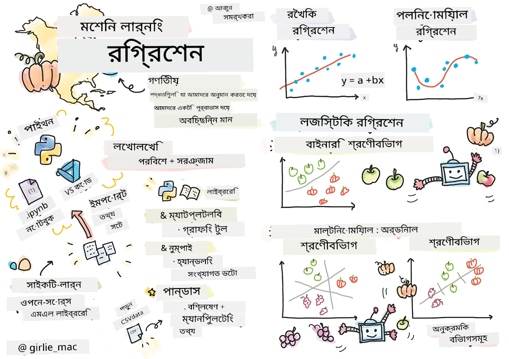
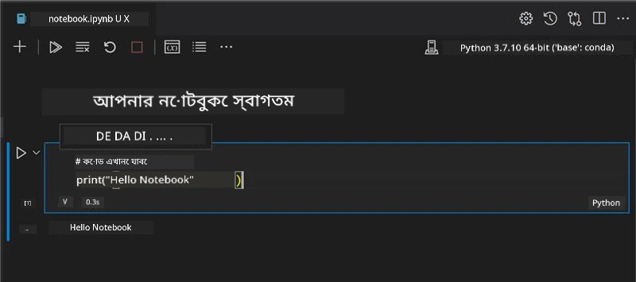
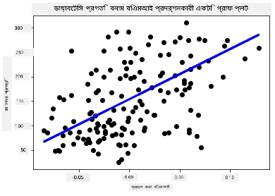

# রিগ্রেশন মডেলগুলির জন্য পাইথন এবং স্কিকিট-লার্ন দিয়ে শুরু করুন



> স্কেচনোট তৈরি করেছেন [তোমোমি ইমুরা](https://www.twitter.com/girlie_mac)

## [পূর্বে-লেকচার কুইজ](https://ff-quizzes.netlify.app/en/ml/)

> ### [এই পাঠটি R-এ উপলব্ধ!](../../../../2-Regression/1-Tools/solution/R/lesson_1.html)

## পরিচিতি

এই চারটি পাঠে, আপনি কিভাবে রিগ্রেশন মডেল তৈরি করতে হয় তা জানবেন। আমরা এক্ষুনি আলোচনা করব এগুলি কী জন্য। কিন্তু কিছু করার আগে, নিশ্চিত করুন যে আপনার কাছে প্রক্রিয়া শুরু করার জন্য সঠিক সরঞ্জাম রয়েছে!

এই পাঠে, আপনি শিখবেন কিভাবে:

- আপনার কম্পিউটারকে স্থানীয় মেশিন লার্নিং কাজের জন্য কনফিগার করবেন।
- জুপিটার নোটবুকের সাথে কাজ করবেন।
- স্কিকিট-লার্ন ব্যবহার করবেন, ইনস্টলেশন সহ।
- একটি হাতে-কলমে অনুশীলন সহ লিনিয়ার রিগ্রেশন অন্বেষণ করবেন।

## ইনস্টলেশন এবং কনফিগারেশন

[](https://youtu.be/-DfeD2k2Kj0 "শুরুর জন্য এমএল - মেশিন লার্নিং মডেল তৈরির জন্য আপনার টুলস প্রস্তুত করুন")

> 🎥 এমএল কনফিগার করার জন্য একটি সংক্ষিপ্ত ভিডিও দেখতে উপরের চিত্রে ক্লিক করুন।

1. **পাইথন ইনস্টল করুন**। নিশ্চিত করুন যে [Python](https://www.python.org/downloads/) আপনার কম্পিউটারে ইনস্টল করা আছে। আপনি অনেক ডেটা সাইন্স এবং মেশিন লার্নিং কাজের জন্য পাইথন ব্যবহার করবেন। বেশিরভাগ কম্পিউটার সিস্টেমে ইতিমধ্যে পাইথন ইনস্টল থাকে। কিছু ব্যবহারকারীর জন্য সহজতর করতে [Python Coding Packs](https://code.visualstudio.com/learn/educators/installers?WT.mc_id=academic-77952-leestott)ও পাওয়া যায়।

   তবে, পাইথনের কিছু ব্যবহার এক ভার্সনের সফটওয়্যার চান, আবার কিছু অন্য ভার্সনের। এজন্য, একটি [ভার্চুয়াল এনভায়রনমেন্টে](https://docs.python.org/3/library/venv.html) কাজ করা উপকারী।

2. **ভিজুয়াল স্টুডিও কোড ইনস্টল করুন**। নিশ্চিত করুন যে আপনার কম্পিউটারে ভিজুয়াল স্টুডিও কোড ইনস্টল করা আছে। বেসিক ইনস্টলেশনের জন্য এই নির্দেশনাগুলো অনুসরণ করুন: [Visual Studio Code ইনস্টল করুন](https://code.visualstudio.com/)। এই কোর্সে আপনি ভিজুয়াল স্টুডিও কোডে পাইথন ব্যবহার করবেন, তাই পাইথন ডেভেলপমেন্টের জন্য [Visual Studio Code কনফিগার করা](https://docs.microsoft.com/learn/modules/python-install-vscode?WT.mc_id=academic-77952-leestott) সম্পর্কেও জানতে পারেন।

   > এই [লার্ন মডিউলস](https://docs.microsoft.com/users/jenlooper-2911/collections/mp1pagggd5qrq7?WT.mc_id=academic-77952-leestott) থেকে কাজ করে পাইথনে স্বাচ্ছন্দ্যতা অর্জন করুন
   >
   > [](https://youtu.be/yyQM70vi7V8 "Visual Studio Code-এ Python সেটআপ করুন")
   >
   > 🎥 ভিডিওটির জন্য উপরের চিত্রে ক্লিক করুন: VS কোডে পাইথন ব্যবহার।

3. **স্কিকিট-লার্ন ইনস্টল করুন**, এই [নির্দেশনাগুলো](https://scikit-learn.org/stable/install.html) অনুসরণ করে। আপনাকে নিশ্চিত করতে হবে যে আপনি পাইথন ৩ ব্যবহার করছেন, তাই ভার্চুয়াল এনভায়রনমেন্ট ব্যবহার করার পরামর্শ দেওয়া হয়। লক্ষ্য করুন, যদি আপনি M1 ম্যাক-এ এই লাইব্রেরি ইনস্টল করছেন, তাহলে উপরের লিঙ্কে বিশেষ নির্দেশনাগুলো আছে।

4. **জুপিটার নোটবুক ইনস্টল করুন**। আপনাকে [জুপিটার প্যাকেজ ইনস্টল](https://pypi.org/project/jupyter/) করতে হবে।

## আপনার এমএল লেখার পরিবেশ

আপনি পাইথন কোড উন্নয়ন এবং মেশিন লার্নিং মডেল তৈরি করতে **নোটবুকস** ব্যবহার করবেন। এই ধরণের ফাইল ডেটা বিজ্ঞানীদের একটি সাধারণ টুল এবং এগুলোর সাফিক্স বা এক্সটেনশন `.ipynb` দ্বারা চিহ্নিত করা হয়।

নোটবুক একটি ইন্টারঅ্যাকটিভ পরিবেশ যা ডেভেলপারকে কোড করার পাশাপাশি কোডের চারপাশে নোট এবং ডকুমেন্টেশন লেখার সুযোগ দেয়, যা পরীক্ষামূলক বা গবেষণাভিত্তিক প্রকল্পে খুব সহায়ক।

[](https://youtu.be/7E-jC8FLA2E "শুরুর জন্য এমএল - রিগ্রেশন মডেল তৈরির জন্য জুপিটার নোটবুক সেটআপ করুন")

> 🎥 এই অনুশীলনটি করতে উপরের ছবিতে ক্লিক করুন একটি সংক্ষিপ্ত ভিডিওর জন্য।

### অনুশীলন - একটি নোটবুকের সাথে কাজ করুন

এই ফোল্ডারে, আপনি _notebook.ipynb_ ফাইলটি দেখতে পাবেন।

1. Visual Studio Code-এ _notebook.ipynb_ খুলুন।

   একটি জুপিটার সার্ভার Python 3+ দিয়ে চালু হবে। আপনি নোটবুকের এমন স্থান পাবেন যা `run` করা যাবে, কোডের টুকরা। কার্টির মত দেখতে আইকনটি নির্বাচন করে কোড ব্লক চালাতে পারেন।

2. `md` আইকন নির্বাচন করুন এবং কিছু মার্কডাউন লিখুন, এবং নিম্নলিখিত টেক্সট দিন **# আপনার নোটবুকে স্বাগতম**।

   এরপর, কিছু পাইথন কোড যোগ করুন।

3. কোড ব্লকে টাইপ করুন **print('hello notebook')**।
4. কোড চালাতে তীর চিহ্ন নির্বাচন করুন।

   আপনি নিম্নলিখিত প্রিন্টেড স্টেটমেন্ট দেখতে পাবেন:

    ```output
    hello notebook
    ```



আপনি নোটবুক নিজেই ডকুমেন্ট করার জন্য মন্তব্যসহ কোডের মধ্যে ইন্টারলিফ করতে পারেন।

✅ একটি ওয়েব ডেভেলপার এবং একটি ডেটা বিজ্ঞানীর কাজের পরিবেশ কতোটা ভিন্ন হতে পারে, একটু ভাবুন।

## স্কিকিট-লার্ন দিয়ে কাজ শুরু করুন

এখন যেহেতু পাইথন আপনার স্থানীয় পরিবেশে প্রস্তুত, এবং আপনি জুপিটার নোটবুকে স্বাচ্ছন্দ্যবোধ করছেন, চলুন স্কিকিট-লার্নের সাথেও সমান স্বাচ্ছন্দ্য অর্জন করি (উচ্চারণ `sci` যেমন `science`)। স্কিকিট-লার্ন একটি [বিস্তৃত এপিআই](https://scikit-learn.org/stable/modules/classes.html#api-ref) দেয় যেটা আপনাকে এমএল কাজ করতে সাহায্য করবে।

তাদের [ওয়েবসাইট](https://scikit-learn.org/stable/getting_started.html) অনুযায়ী, "স্কিকিট-লার্ন একটি ওপেন সোর্স মেশিন লার্নিং লাইব্রেরি যা সুপারভাইজড এবং আনসুপারভাইজড লার্নিং সাপোর্ট করে। এটি মডেল ফিটিং, ডেটা প্রিপ্রসেসিং, মডেল সিলেকশন এবং ইভ্যালুয়েশন, এবং অন্যান্য অনেক টুলস প্রদান করে।"

এই কোর্সে, আপনি স্কিকিট-লার্ন এবং অন্যান্য সরঞ্জাম ব্যবহার করে একটি মেশিন লার্নিং মডেল গড়ে তুলবেন যা আমরা 'পরম্পরাগত মেশিন লার্নিং' কাজ বলে থাকি। আমরা ইচ্ছাকৃতভাবে নিউরাল নেটওয়ার্ক এবং ডিপ লার্নিং এড়িয়েছি, কারণ এগুলো আমাদের আসন্ন 'এআই ফর বিগিনার্স' কারিকুলামে ভালোভাবে কভার করা হয়েছে।

স্কিকিট-লার্ন মডেল তৈরি করা এবং সেগুলোর মূল্যায়ন সহজ করে তোলে। এটি প্রধানত সংখ্যাগত ডেটা ব্যবহার করে এবং শেখার সরঞ্জাম হিসেবে বেশ কিছু প্রস্তুত ডেটাসেট রয়েছে। এতে শিক্ষার্থীদের জন্য প্রাক-তৈরি মডেলও আছে। প্রথমে স্কিকিট-লার্নের সাথে প্রিপ্যাকেজড ডেটা লোড এবং বিল্ট-ইন এস্টিমেটর ব্যবহার করে মৌলিক এমএল মডেল তৈরির প্রক্রিয়া অন্বেষণ করি।

## অনুশীলন - আপনার প্রথম স্কিকিট-লার্ন নোটবুক

> এই টিউটোরিয়ালটি অনুপ্র inspirationণ হয়েছে স্কিকিট-লার্নের ওয়েবসাইটের [লিনিয়ার রিগ্রেশন উদাহরণ](https://scikit-learn.org/stable/auto_examples/linear_model/plot_ols.html#sphx-glr-auto-examples-linear-model-plot-ols-py) থেকে।


[](https://youtu.be/2xkXL5EUpS0 "শুরুর জন্য এমএল - পাইথনে আপনার প্রথম লিনিয়ার রিগ্রেশন প্রকল্প")

> 🎥 এই অনুশীলনটি দেখতে উপরের চিত্রে ক্লিক করুন একটি সংক্ষিপ্ত ভিডিওর জন্য।

এই পাঠের সাথে সংযুক্ত _notebook.ipynb_ ফাইলে, সকল সেলগুলি 'ট্র্যাশ ক্যান' আইকন চাপ দিয়ে ক্লিয়ার করুন।

এই অংশে, আপনি ডায়াবেটিস সম্পর্কে একটি ছোট ডেটাসেট নিয়ে কাজ করবেন যা স্কিকিট-লার্নে শেখার জন্য অন্তর্ভুক্ত। কল্পনা করুন আপনি ডায়াবেটিক রোগীদের জন্য একটি চিকিৎসা পরীক্ষা করতে চান। মেশিন লার্নিং মডেল আপনাকে নির্ধারণ করতে সাহায্য করতে পারে কোন রোগী চিকিৎসায় ভাল সাড়া দেবে বিভিন্ন ভেরিয়েবলের সংমিশ্রণের ভিত্তিতে। একটি মৌলিক রিগ্রেশন মডেল, ভিজুয়ালাইজ করা হলে, ভেরিয়েবলের তথ্য দেখাতে পারে যা আপনার তাত্ত্বিক ক্লিনিক্যাল ট্রায়াল সংগঠনে সাহায্য করবে।

✅ রিগ্রেশনের অনেক ধরন আছে এবং আপনি কোনটি বেছে নেন তা নির্ভর করে আপনি কোন প্রশ্নের উত্তর খুঁজছেন তার উপর। যদি আপনি নির্দিষ্ট বয়সের একজন ব্যক্তির সম্ভাব্য উচ্চতা পূর্বাভাস দিতে চান, তাহলে আপনি লিনিয়ার রিগ্রেশন ব্যবহার করবেন, কারণ আপনি একটি **সংখ্যাগত মান** খুঁজছেন। যদি আপনি জানতে চান একটি রান্নার ধরন নিরামিষ কিনা, তাহলে সেটি একটি **শ্রেণিবিন্যাস** তাই আপনি লজিস্টিক রিগ্রেশন ব্যবহার করবেন। লজিস্টিক রিগ্রেশন সম্পর্কে পরে শিখবেন। কিছু প্রশ্ন নিয়ে ভাবুন যা আপনি ডেটাবেজে করতে পারেন এবং কোন পদ্ধতিটি উপযুক্ত হবে।

চলুন এই কাজ শুরু করি।

### লাইব্রেরি আমদানি

এই কাজের জন্য আমরা কিছু লাইব্রেরি আমদানি করব:

- **matplotlib**। এটি একটি উপকারী [গ্রাফিং টুল](https://matplotlib.org/) এবং আমরা একটি লাইন প্লট তৈরি করতে এটি ব্যবহার করব।
- **numpy**। [numpy](https://numpy.org/doc/stable/user/whatisnumpy.html) পাইথনে সংখ্যাগত ডেটা পরিচালনার জন্য একটি দরকারী লাইব্রেরি।
- **sklearn**। এটি [স্কিকিট-লার্ন](https://scikit-learn.org/stable/user_guide.html) লাইব্রেরি।

আপনার কাজের জন্য কিছু লাইব্রেরি আমদানি করুন।

1. নিচের কোড টাইপ করে আমদানি করুন:

   ```python
   import matplotlib.pyplot as plt
   import numpy as np
   from sklearn import datasets, linear_model, model_selection
   ```

   উপরে আপনি `matplotlib`, `numpy` আমদানি করছেন এবং `sklearn` থেকে `datasets`, `linear_model` এবং `model_selection` আমদানি করছেন। `model_selection` ডেটাকে প্রশিক্ষণ এবং পরীক্ষা সেটে ভাগ করার জন্য ব্যবহৃত।

### ডায়াবেটিস ডেটাসেট

অন্তর্ভুক্ত [ডায়াবেটিস ডেটাসেট](https://scikit-learn.org/stable/datasets/toy_dataset.html#diabetes-dataset) এ ৪৪২টি নমুনা রয়েছে, যেখানে ১০টি বৈশিষ্ট্য ভেরিয়েবল আছে, কিছু হল:

- বয়স: বছরে বয়স
- BMI: শরীরের ভর সূচক
- রক্তচাপ: গড় রক্তচাপ
- s1 tc: টি-সেলস (সাদা রক্তকণিকার একটি প্রকার)

✅ এই ডেটাসেটে 'লিঙ্গ' নামক একটি বৈশিষ্ট্য ভেরিয়েবল অন্তর্ভুক্ত আছে, যা ডায়াবেটিস গবেষণায় গুরুত্বপূর্ণ। অনেক চিকিৎসা তথ্যসেট এই ধরনের বাইনারি শ্রেণিবিভাজন অন্তর্ভুক্ত করে। ভাবুন কিভাবে এমন শ্রেণিবিভাজন কিছু জনগোষ্ঠীকে চিকিৎসা থেকে বাদ দিতে পারে।

এখন, X এবং y ডেটা লোড করুন।

> 🎓 মনে রাখবেন, এটি একটি সুপারভাইজড লার্নিং, এবং আমাদের একটি নামকৃত 'y' লক্ষ্য দরকার।

একটি নতুন কোড সেলে, `load_diabetes()` কল করে ডায়াবেটিস ডেটাসেট লোড করুন। `return_X_y=True` ইনপুট মানে হল `X` একটি ডেটা ম্যাট্রিক্স হবে, এবং `y` হবে রিগ্রেশন লক্ষ্য।

1. ডেটা ম্যাট্রিক্সের আকৃতি এবং এর প্রথম উপাদান প্রদর্শনের জন্য কিছু প্রিন্ট কমান্ড যোগ করুন:

    ```python
    X, y = datasets.load_diabetes(return_X_y=True)
    print(X.shape)
    print(X[0])
    ```

    আপনি যে রেসপন্স পাচ্ছেন, তা একটি tuple। আপনি tuple- এর প্রথম দুটি মান `X` এবং `y` তে আলাদা করছেন। [tuple সম্পর্কে আরও জানুন](https://wikipedia.org/wiki/Tuple)।

    আপনি দেখতে পাচ্ছেন ডেটা ৪৪২টি আইটেম নিয়ে তৈরি, যার প্রতিটি ১০টি উপাদানের অ্যারে আকারে:

    ```text
    (442, 10)
    [ 0.03807591  0.05068012  0.06169621  0.02187235 -0.0442235  -0.03482076
    -0.04340085 -0.00259226  0.01990842 -0.01764613]
    ```

    ✅ কিছুক্ষণ ভেবে দেখুন ডেটা এবং রিগ্রেশন লক্ষ্য এর সম্পর্ক। লিনিয়ার রিগ্রেশন বৈশিষ্ট্য X এবং লক্ষ্য ভেরিয়েবল y-এর মধ্যে সম্পর্ক পূর্বাভাস দেয়। আপনি কি ডকুমেন্টেশনে ডায়াবেটিস ডেটাসেটের [লক্ষ্য](https://scikit-learn.org/stable/datasets/toy_dataset.html#diabetes-dataset) খুঁজে পেয়েছেন? এই ডেটাসেটটি কি প্রদর্শন করছে, লক্ষ্য দেখে?

2. তারপরে, ডেটাসেটের একটি অংশ নির্বাচন করুন প্লট করার জন্য: ডেটাসেটের ৩য় কলাম নির্বাচিত করুন। `:` অপারেটর ব্যবহার করে সব সারি নির্বাচন করে তারপর ইনডেক্স (২) ব্যবহার করে তৃতীয় কলাম নির্বাচন করতে পারেন। প্লট করার জন্য ডেটাকে 2D অ্যারেতে রিশেপ করা দরকার `reshape(n_rows, n_columns)` ব্যবহার করে। যদি একটি প্যারামিটার -1 হয়, সংশ্লিষ্ট মাত্রা স্বয়ংক্রিয়ভাবে হিসাব হয়।

   ```python
   X = X[:, 2]
   X = X.reshape((-1,1))
   ```

   ✅ যেকোনো সময় ডেটার আকৃতি পরীক্ষা করতে প্রিন্ট করুন।

3. এখন ডেটা প্লট করার প্রস্তুত, দেখুন একটি মেশিন সংখ্যাগুলোর মধ্যে যৌক্তিক বিভাজন নির্ধারণে সাহায্য করতে পারে কিনা। এর জন্য, আপনাকে ডেটা (X) এবং লক্ষ্য (y) উভয়ই পরীক্ষা এবং প্রশিক্ষণ সেটে ভাগ করতে হবে। স্কিকিট-লার্নে এর জন্য সরল উপায় আছে; আপনি নির্দিষ্ট পয়েন্টে পরীক্ষা ডেটা ভাগ করতে পারবেন।

   ```python
   X_train, X_test, y_train, y_test = model_selection.train_test_split(X, y, test_size=0.33)
   ```

4. এখন আপনার মডেল প্রশিক্ষণের জন্য প্রস্তুত! লিনিয়ার রিগ্রেশন মডেল লোড করুন এবং `model.fit()` ব্যবহার করে X ও y প্রশিক্ষণ সেট দিয়ে প্রশিক্ষণ দিন:

    ```python
    model = linear_model.LinearRegression()
    model.fit(X_train, y_train)
    ```

    ✅ `model.fit()` একটি ফাংশন যা আপনি অনেক এমএল লাইব্রেরিতে যেমন TensorFlow দেথতে পাবেন

5. এরপর, `predict()` ফাংশন ব্যবহার করে পরীক্ষার ডেটা দিয়ে পূর্বাভাস তৈরি করুন। এটি ডেটা গ্রুপের মধ্যে একটি লাইন আঁকতে ব্যবহৃত হবে

    ```python
    y_pred = model.predict(X_test)
    ```

6. এখন ডেটা একটি প্লটে প্রদর্শনের সময়। এই কাজের জন্য matplotlib খুব দরকারী টুল। সমস্ত X এবং y পরীক্ষার ডেটার একটি scatterplot তৈরি করুন এবং পূর্বাভাস ব্যবহার করে মডেলের ডেটা গ্রুপের মধ্যে সবচেয়ে উপযুক্ত স্থানে একটি লাইন আঁকুন।

    ```python
    plt.scatter(X_test, y_test,  color='black')
    plt.plot(X_test, y_pred, color='blue', linewidth=3)
    plt.xlabel('Scaled BMIs')
    plt.ylabel('Disease Progression')
    plt.title('A Graph Plot Showing Diabetes Progression Against BMI')
    plt.show()
    ```

   


   ✅ এখানে কী ঘটছে তা একটু ভাবুন। একটি সরলরেখা অনেক ছোট ডেটার বিন্দুর মধ্য দিয়ে যাচ্ছে, কিন্তু এটি ঠিক কী করছে? আপনি কি দেখতে পাচ্ছেন কীভাবে এই রেখাটিকে ব্যবহার করে কোনও নতুন, অদেখা ডেটা পয়েন্ট কোথায় প্লটের y অক্ষের সাথে সম্পর্ক করে বসাতে হবে তা পূর্বাভাস দেবে? এই মডেলের ব্যবহারিক উপযোগিতাটি শব্দে প্রকাশ করার চেষ্টা করুন।

অভিনন্দন, আপনি প্রথম লিনিয়ার রিগ্রেশন মডেলটি তৈরি করেছেন, এটি দিয়ে একটি পূর্বাভাস তৈরি করেছেন, এবং এটি একটি প্লটে প্রদর্শন করেছেন!

---
## 🚀চ্যালেঞ্জ

এই ডেটাসেট থেকে একটি আলাদা ভেরিয়েবল প্লট করুন। ইঙ্গিত: এই লাইনটি সম্পাদনা করুন: `X = X[:,2]`। এই ডেটাসেটের টার্গেট বিবেচনায়, আপনি কী জানতে পারছেন ডায়াবেটিস রোগের অগ্রগতির সম্পর্কে?
## [পোস্ট-লেকচার কুইজ](https://ff-quizzes.netlify.app/en/ml/)

## পর্যালোচনা এবং স্ব-অধ্যয়ন

এই টিউটোরিয়ালে, আপনি সহজ সরলরেখীয় রিগ্রেশন নিয়ে কাজ করেছেন, যা ইউনিভেরিয়েট বা মাল্টিপল লিনিয়ার রিগ্রেশনের থেকে আলাদা। এই পদ্ধতিগুলির মধ্যে পার্থক্য সম্পর্কে একটু পড়ুন, অথবা [এই ভিডিওটি](https://www.coursera.org/lecture/quantifying-relationships-regression-models/linear-vs-nonlinear-categorical-variables-ai2Ef) দেখুন।

রিগ্রেশন ধারণা সম্পর্কে আরও পড়ুন এবং ভাবুন কী ধরনের প্রশ্ন এই প্রযুক্তি দ্বারা উত্তরযোগ্য। আপনার বোঝাপড়া গভীর করার জন্য এই [টিউটোরিয়ালটি](https://docs.microsoft.com/learn/modules/train-evaluate-regression-models?WT.mc_id=academic-77952-leestott) অনুসরণ করুন।

## অ্যাসাইনমেন্ট

[একটি ভিন্ন ডেটাসেট](assignment.md)

---

<!-- CO-OP TRANSLATOR DISCLAIMER START -->
**অস্বীকৃতি**:
এই নথিটি AI অনুবাদ পরিষেবা [Co-op Translator](https://github.com/Azure/co-op-translator) ব্যবহার করে অনূদিত হয়েছে। যদিও আমরা শুদ্ধতার জন্য চেষ্টা করি, অনুগ্রহ করে মনে রাখবেন যে স্বয়ংক্রিয় অনুবাদে ত্রুটি বা অসঙ্গতি থাকতে পারে। মূল নথিটি তার স্বভাষায় কর্তৃত্বপূর্ণ উৎস হিসেবে বিবেচিত হওয়া উচিত। গুরুত্বপূর্ণ তথ্যের জন্য পেশাদার মানব অনুবাদ সুপারিশ করা হয়। এই অনুবাদের ব্যবহারে প্রয়োজনীয় ভুল বোঝাবুঝি বা ভুল ব্যাখ্যার জন্য আমরা দায়বদ্ধ নই।
<!-- CO-OP TRANSLATOR DISCLAIMER END -->