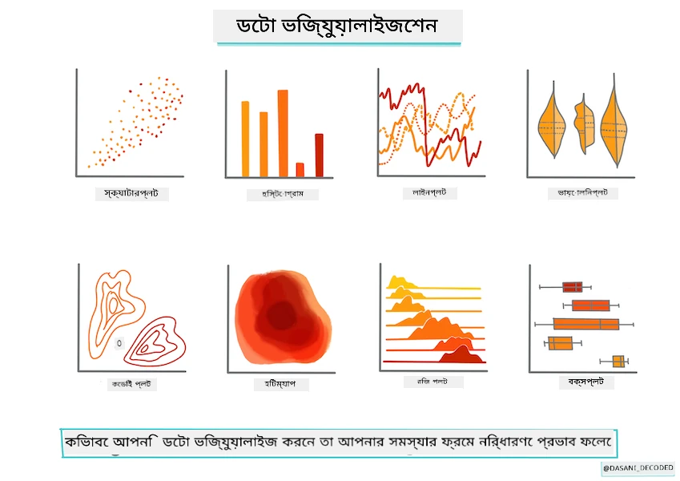
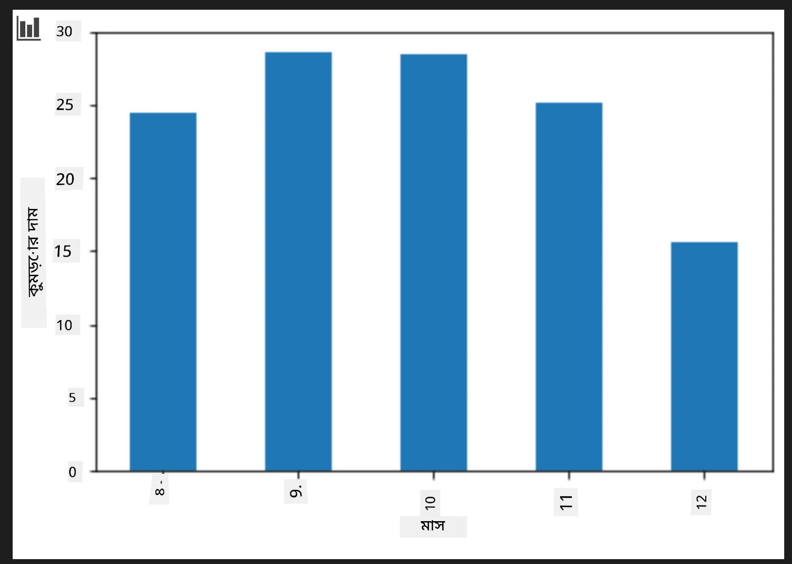
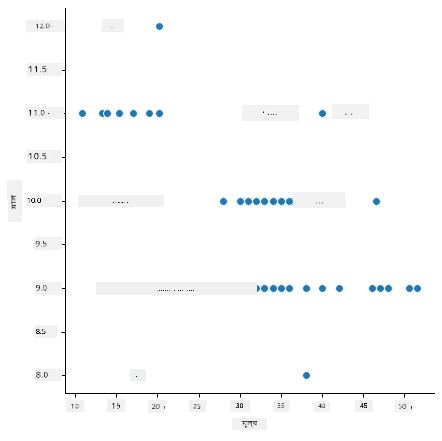
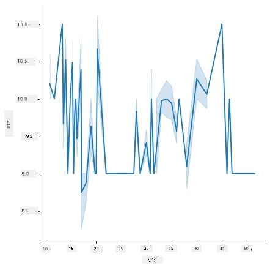
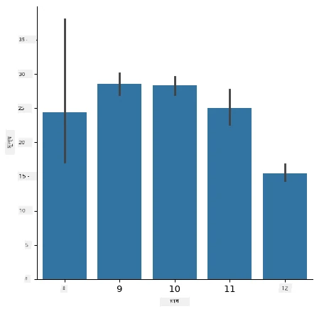
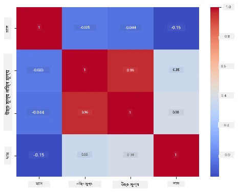

# Scikit-learn ব্যবহার করে রিগ্রেশন মডেল তৈরি করুন: ডেটা প্রস্তুত করুন এবং ভিজ্যুয়ালাইজ করুন



ইনফোগ্রাফিক [দাসানি মাদিপালি](https://twitter.com/dasani_decoded) দ্বারা

## [প্রাক-লেকচার কুইজ](https://ff-quizzes.netlify.app/en/ml/)

> ### [এই পাঠ R-এ উপলব্ধ!](../../../../2-Regression/2-Data/solution/R/lesson_2.html)

## পরিচিতি

এখন যেহেতু আপনি Scikit-learn সহ মেশিন লার্নিং মডেল তৈরি শুরু করার জন্য প্রয়োজনীয় সরঞ্জাম দিয়ে প্রস্তুত, আপনি আপনার ডেটাকে প্রশ্ন করার জন্য প্রস্তুত। ডেটার সাথে কাজ করার সময় এবং ML সমাধান প্রয়োগ করার সময়, আপনার ডেটাসেটের সম্ভাবনা সঠিকভাবে প্রকাশ করার জন্য সঠিক প্রশ্ন কিভাবে করতে হয় তা বোঝা খুবই গুরুত্বপূর্ণ।

এই পাঠে, আপনি শিখবেন:

- কিভাবে মডেল তৈরির জন্য আপনার ডেটা প্রস্তুত করবেন।
- কিভাবে Matplotlib দিয়ে ডেটা ভিজ্যুয়ালাইজেশন করবেন।
- কিভাবে Seaborn দিয়ে আরও প্রকাশময় ডেটা ভিজ্যুয়ালাইজেশন করবেন।

## আপনার ডেটার জন্য সঠিক প্রশ্ন করা

আপনি যে প্রশ্নের উত্তর জানতে চান তা নির্ধারণ করবে আপনি কোন ধরনের ML অ্যালগরিদম ব্যবহার করবেন। এবং আপনি যে উত্তরের মান পাবেন তা আপনার ডেটার প্রকৃতির উপর অনেক নির্ভর করবে।

এই পাঠের জন্য প্রদত্ত [ডেটা](https://github.com/microsoft/ML-For-Beginners/blob/main/2-Regression/data/US-pumpkins.csv) দেখুন। আপনি এই .csv ফাইলটি VS Code-এ খুলতে পারেন। দ্রুত একবার দেখে বুঝা যায় যে সেখানে ফাঁকা ক্ষেত্র এবং স্ট্রিং ও সংখ্যাসূচক ডেটার মিশ্রণ রয়েছে। 'Package' নামে একটি অদ্ভুত কলামও আছে যেখানে ডেটা 'sacks', 'bins' এবং অন্যান্য মানের মিশ্রণ। আসলেই, ডেটাটি কিছুটা এলোমেলো।

[](https://youtu.be/5qGjczWTrDQ "ML for beginners - How to Analyze and Clean a Dataset")

> 🎥 উপরের ছবিতে ক্লিক করে এই পাঠের জন্য ডেটা প্রস্তুত করার একটি সংক্ষিপ্ত ভিডিও দেখুন।

আসলে, ডেটাসেট সরাসরি ব্যবহার করার জন্য সম্পূর্ণ প্রস্তুত পাওয়া খুবই অস্বাভাবিক। এই পাঠে, আপনি শিখবেন কিভাবে স্ট্যান্ডার্ড পাইথন লাইব্রেরি ব্যবহার করে র ডেটাসেট প্রস্তুত করতে হয়। এছাড়াও আপনি বিভিন্ন পদ্ধতি শিখবেন ডেটা ভিজ্যুয়ালাইজেশনের।

## কেস স্টাডি: 'পাম্পকিন (কুমড়া) বাজার'

এই ফোল্ডারে আপনি রুট `data` ফোল্ডারে [US-pumpkins.csv](https://github.com/microsoft/ML-For-Beginners/blob/main/2-Regression/data/US-pumpkins.csv) নামে একটি .csv ফাইল পাবেন যার মধ্যে পাম্পকিন বাজার সম্পর্কিত ১৭৫৭টি তথ্য সারি রয়েছে, শহরভিত্তিক গোষ্ঠীতে বিন্যস্ত। এটি [Specialty Crops Terminal Markets Standard Reports](https://www.marketnews.usda.gov/mnp/fv-report-config-step1?type=termPrice) থেকে সংগৃহীত কাঁচা ডেটা যা যুক্তরাষ্ট্রের কৃষি বিভাগের দ্বারা বিতরণ করা হয়।

### ডেটা প্রস্তুতি

এই ডেটা পাবলিক ডোমেইনে রয়েছে। এটি USDA ওয়েবসাইট থেকে প্রতিটি শহরের আলাদা আলাদা ফাইল হিসাবে ডাউনলোড করা যায়। অনেকগুলো আলাদা ফাইল এড়াতে, আমরা সব শহরের ডেটা একক স্প্রেডশীটে যুক্ত করেছি, অর্থাৎ আমরা ডেটা কিছুটা _প্রস্তুত_ করেছি। এবার, ডেটার প্রতি আরও গভীর দৃষ্টি দেওয়া যাক।

### পাম্পকিন ডেটা - প্রাথমিক উপসংহার

আপনি এই ডেটার সম্পর্কে কি লক্ষ্য করেছেন? আপনি ইতোমধ্যেই দেখেছেন যে এখানে স্ট্রিং, সংখ্যা, ফাঁকা স্থান এবং কিছু অদ্ভুত মানের মিশ্রণ রয়েছে যার অর্থ আপনি খুঁজে বের করতে হবে।

আপনি এই ডেটার কাছে কোন প্রশ্ন করতে পারেন, রিগ্রেশন টেকনিক ব্যবহার করে? উদাহরণস্বরূপ, "নির্দিষ্ট মাসে বিক্রির জন্য পাম্পকিনের দাম পূর্বানুমান করুন"। আবার ডেটা দেখে, কাজের জন্য প্রয়োজনীয় ডেটা স্ট্রাকচার তৈরি করতে কিছু পরিবর্তন করতে হবে।
## অনুশীলন - পাম্পকিন ডেটা বিশ্লেষণ

চলুন [Pandas](https://pandas.pydata.org/) (যার অর্থ `Python Data Analysis`) ব্যবহার করি, যা ডেটা বিন্যাসে খুবই কাজে লাগে, এই পাম্পকিন ডেটা বিশ্লেষণ এবং প্রস্তুত করার জন্য।

### প্রথমে, অনুপস্থিত তারিখ পরীক্ষা করুন

আপনাকে প্রথমে অনুপস্থিত তারিখগুলি পরীক্ষা করার পদক্ষেপ নিতে হবে:

১. তারিখগুলোকে মাস বিন্যাসে রূপান্তর করুন (এগুলো US তারিখ, তাই বিন্যাস `MM/DD/YYYY`)।
২. একটি নতুন কলামে মাস আলাদা করুন।

_notebook.ipynb_ ফাইলটি Visual Studio Code-এ খুলুন এবং স্প্রেডশীটটি নতুন Pandas ডেটাফ্রেমে ইম্পোর্ট করুন।

১. প্রথম পাঁচটি সারি দেখার জন্য `head()` ফাংশন ব্যবহার করুন।

    ```python
    import pandas as pd
    pumpkins = pd.read_csv('../data/US-pumpkins.csv')
    pumpkins.head()
    ```

    ✅ সর্বশেষ পাঁচটি সারি দেখার জন্য কোন ফাংশনটি ব্যবহার করবেন?

১. চেক করুন বর্তমান ডেটাফ্রেমে কি অনুপস্থিত তথ্য আছে কি না:

    ```python
    pumpkins.isnull().sum()
    ```

    কিছু ডেটা অনুপস্থিত, কিন্তু হয়তো তা কাজের জন্য অনেকটা ততটা প্রভাব ফেলবে না।

১. ডেটাফ্রেম কাজ করা সহজ করতে, কেবল প্রয়োজনীয় কলামগুলি `loc` ফাংশন ব্যবহার করে বাছাই করুন, যা মূল ডেটাফ্রেম থেকে নির্দিষ্ট সারি (প্রথম প্যারামিটার) এবং কলাম (দ্বিতীয় প্যারামিটার) বের করে আনে। নিচে `:` মানে "সকল সারি"।

    ```python
    columns_to_select = ['Package', 'Low Price', 'High Price', 'Date']
    pumpkins = pumpkins.loc[:, columns_to_select]
    ```

### দ্বিতীয়, পাম্পকিনের গড় দাম নির্ণয় করুন

একটি নির্দিষ্ট মাসের পাম্পকিনের গড় দাম কিভাবে নির্ণয় করবেন ভাবুন। এই কাজের জন্য কোন কোন কলাম প্রয়োজন? সূত্র: আপনাকে ৩টি কলাম দরকার হবে।

সমাধান: `Low Price` এবং `High Price` কলামগুলোর গড় নিয়ে নতুন `Price` কলাম পূরণ করুন, এবং `Date` কলাম শুধুমাত্র মাস দেখাবে। সৌভাগ্যক্রমে, উপরের পরীক্ষা অনুযায়ী, তারিখ বা মূল্যের জন্য কোন ডেটা অনুপস্থিত নয়।

১. গড় নির্ণয় করতে নিম্নলিখিত কোড যোগ করুন:

    ```python
    price = (pumpkins['Low Price'] + pumpkins['High Price']) / 2

    month = pd.DatetimeIndex(pumpkins['Date']).month

    ```

   ✅ আপনি চেক করতে চাইলে `print(month)` ব্যবহার করে যেকোনো ডেটা মুদ্রণ করতে পারেন।

২. এখন, আপনার রূপান্তরকৃত ডেটা একটি নতুন Pandas ডেটাফ্রেমে অনুলিপি করুন:

    ```python
    new_pumpkins = pd.DataFrame({'Month': month, 'Package': pumpkins['Package'], 'Low Price': pumpkins['Low Price'],'High Price': pumpkins['High Price'], 'Price': price})
    ```

    আপনার ডেটাফ্রেম মুদ্রণ করলে একটি পরিচ্ছন্ন, সুশৃঙ্খল ডেটাসেট দেখতে পাবেন, যার ওপর আপনি নতুন রিগ্রেশন মডেল নির্মাণ করতে পারবেন।

### কিন্তু অপেক্ষা করুন! এখানে কিছু অদ্ভুততা আছে

যদি আপনি `Package` কলাম দেখেন, পাম্পকিন বিক্রি হয় বিভিন্ন বিন্যাসে। কিছু বিক্রি হয় '1 1/9 bushel' মাপে, কিছু '1/2 bushel' মাপে, কিছু প্রতি পাম্পকিন, কিছু প্রতি পাউন্ড, এবং কিছু বড় বক্সে বিভিন্ন প্রস্থে।

> পাম্পকিন গুলো ধারাবাহিকভাবে ওজন করা খুব কঠিন বলে মনে হচ্ছে

মূল ডেটা বিশ্লেষণ করলে দেখা যায়, যেগুলোর `Unit of Sale` ধারায় 'EACH' বা 'PER BIN' আছে সেগুলোর `Package` প্রকার হয় প্রতি ইঞ্চি, প্রতি বিন, বা 'each'। পাম্পকিন ধারাবাহিকভাবে মাপা কঠিন, তাই `Package` কলামে 'bushel' স্ট্রিং থাকার পাম্পকিন গুলো বাছাই করে ফিল্টার করুন।

১. ফাইলের শীর্ষে .csv ইম্পোর্টের নিচে একটি ফিল্টার যোগ করুন:

    ```python
    pumpkins = pumpkins[pumpkins['Package'].str.contains('bushel', case=True, regex=True)]
    ```

    এখন যদি ডেটা প্রিন্ট করেন, দেখতে পাবেন প্রায় ৪১৫ সারি ডেটা আসছে যা 'bushel' অনুযায়ী পাম্পকিন সম্পর্কিত।

### কিন্তু অপেক্ষা করুন! আরেকটি কাজ বাকি আছে

আপনি কি লক্ষ্য করেছেন যে প্রতি সারিতে bushel-এর পরিমাণ বিভিন্ন? আপনাকে মূল্যমানকে bushel প্রতি হিসেবে স্বাভাবিকীকরণ করতে হবে, তাই কিছু গণিত করতে হবে।

১. নতুন_pumpkins ডেটাফ্রেম তৈরির ব্লকের নিচে এই লাইনগুলো যোগ করুন:

    ```python
    new_pumpkins.loc[new_pumpkins['Package'].str.contains('1 1/9'), 'Price'] = price/(1 + 1/9)

    new_pumpkins.loc[new_pumpkins['Package'].str.contains('1/2'), 'Price'] = price/(1/2)
    ```

✅ [The Spruce Eats](https://www.thespruceeats.com/how-much-is-a-bushel-1389308) অনুযায়ী, একটি bushel-এর ওজন উৎপাদনের ধরণ অনুসারে নির্ভর করে, কারণ এটি ভলিউম মাপ। "উদাহরণস্বরূপ, একটি bushel টমেটোর ওজন ৫৬ পাউন্ড হওয়া উচিত... পাতা এবং সবজি কম ওজনের পাশাপাশি বেশি স্থান নেয়, তাই স্পিনাচের bushel মাত্র ২০ পাউন্ড।" এটা বেশ জটিল! আমরা bushel থেকে pound রূপান্তরে না গিয়ে bushel অনুযায়ী মূল্য নির্ধারণ করব। এই bushel ভিত্তিক পাম্পকিন অধ্যয়ন দেখায় কতটা গুরুত্বপূর্ণ আপনার ডেটার প্রকৃতি বোঝা!

এখন আপনি তাদের bushel মাপ অনুযায়ী ইউনিট প্রতি মূল্য বিশ্লেষণ করতে পারবেন। যদি আবার ডেটা প্রিন্ট করেন, দেখতে পাবেন এটা স্বাভাবিকীকৃত।

✅ আপনি কি দেখেছেন যে অর্ধেক bushel এ বিক্রয় হওয়া পাম্পকিনগুলো অনেক ব্যয়বহুল? আপনি কি এর কারণ বের করতে পারবেন? সূত্র: ছোট পাম্পকিনগুলো বড়দের থেকে অনেক বেশি দামী, সম্ভবত কারণ প্রতিটি bushel এ অনেক বেশি ছোট পাম্পকিন থাকে, যেখানে একটি বড় গর্তযুক্ত পাই পাম্পকিনের কারণে অনেক স্পেস ফাঁকা থাকে।

## ভিজ্যুয়ালাইজেশন কৌশল

ডেটা বিজ্ঞানীর একটি অংশ হল তারা যে ডেটার ওপর কাজ করছে তার গুণমান ও প্রকৃতি প্রদর্শন করা। এজন্য তারা সাধারণত আকর্ষণীয় ভিজ্যুয়ালাইজেশন, প্লট, গ্রাফ এবং চার্ট তৈরি করে, যা ডেটার বিভিন্ন দিক প্রদর্শন করে। এর মাধ্যমে তারা এমন সম্পর্ক এবং ফাঁক গুলো ভিজ্যুয়ালি দেখতে পান যা অন্যথায় খুঁজে বের করা কঠিন।

[](https://youtu.be/SbUkxH6IJo0 "ML for beginners - How to Visualize Data with Matplotlib")

> 🎥 উপরের ছবিতে ক্লিক করে এই পাঠের জন্য ডেটা ভিজ্যুয়ালাইজ করার একটি সংক্ষিপ্ত ভিডিও দেখুন।

ভিজ্যুয়ালাইজেশন ডেটার জন্য সবচেয়ে উপযুক্ত মেশিন লার্নিং কৌশল নির্ধারণেও সাহায্য করে। উদাহরণস্বরূপ, একটি স্ক্যাটারপ্লট যা একটি রেখা অনুসরণ করে মনে হয়, তা নির্দেশ করে যে ডেটা একটি লিনিয়ার রিগ্রেশন অনুশীলনের জন্য ভাল প্রার্থী।

একটি ডেটা ভিজ্যুয়ালাইজেশন লাইব্রেরি যা Jupyter নোটবুকে ভাল কাজ করে তা হল [Matplotlib](https://matplotlib.org/) (যা আপনি আগের পাঠেও দেখেছিলেন)।

> আরও অভিজ্ঞতা পেতে [এই টিউটোরিয়ালগুলোতে](https://docs.microsoft.com/learn/modules/explore-analyze-data-with-python?WT.mc_id=academic-77952-leestott) ডেটা ভিজ্যুয়ালাইজেশন অনুশীলন করুন।

## অনুশীলন - Matplotlib দিয়ে পরীক্ষা করুন

আপনি এখন যা তৈরি করেছেন নতুন ডেটাফ্রেম প্রদর্শনের জন্য কিছু মৌলিক প্লট তৈরি করার চেষ্টা করুন। একটি মৌলিক লাইন প্লট কী দেখাবে?

১. ফাইলের উপরে, Pandas ইম্পোর্টের নিচে Matplotlib ইম্পোর্ট করুন:

    ```python
    import matplotlib.pyplot as plt
    ```

১. নোটবুকটি সম্পূর্ণ আবার চালান রিফ্রেশ করার জন্য।
১. নোটবুকের নীচে একটি সেল যোগ করুন এবং ডেটাকে বক্স হিসাবে প্লট করুন:

    ```python
    price = new_pumpkins.Price
    month = new_pumpkins.Month
    plt.scatter(price, month)
    plt.show()
    ```

    

    এটা কি একটি ব্যবহারযোগ্য প্লট? এতে কি কিছু চমকপ্রদ আছে?

    এটা বিশেষত ব্যবহারযোগ্য নয় কারণ এটি কেবল আপনার ডেটা একটি নির্দিষ্ট মাসে বিন্দু হিসেবে দেখায়।

### এটাকে ব্যবহারযোগ্য করুন

চার্টে ব্যবহারযোগ্য ডেটা প্রদর্শনের জন্য সাধারণত আপনাকে ডেটাকে কোন না কোনভাবে গোষ্ঠীবদ্ধ করতে হয়। আসুন একটি প্লট তৈরির চেষ্টা করি যেখানে y অক্ষ মাস দেখায় এবং ডেটা ডিস্ট্রিবিউশন প্রদর্শন করে।

১. একটি সেল যোগ করুন গ্রুপ করা বার চার্ট তৈরি করতে:

    ```python
    new_pumpkins.groupby(['Month'])['Price'].mean().plot(kind='bar')
    plt.ylabel("Pumpkin Price")
    ```

    

    এটা একটি বেশি ব্যবহারযোগ্য ডেটা ভিজ্যুয়ালাইজেশন! এটা দেখাচ্ছে যে পাম্পকিনের সর্বোচ্চ মূল্য সেপ্টেম্বর ও অক্টোবর মাসে হয়। এটা আপনার প্রত্যাশার সাথে সঙ্গতিপূর্ণ? কেন বা কেন নয়?

## অনুশীলন - Seaborn দিয়ে পরীক্ষা করুন

Matplotlib শক্তিশালী, কিন্তু একটি পলিশড চার্ট তৈরির জন্য অনেক কোড লাগতে পারে। [Seaborn](https://seaborn.pydata.org/) হল Matplotlib এর উপরে নির্মিত একটি লাইব্রেরি যা স্ট্যাটিস্টিক্যাল ডেটা ভিজ্যুয়ালাইজেশনের জন্য ডিজাইন করা হয়েছে। এটি সরাসরি Pandas ডেটাফ্রেমের সঙ্গে কাজ করে, আকর্ষণীয় ডিফল্ট স্টাইল দেয়, এবং অনেক কম কোডে তথ্যবহুল প্লট তৈরির সুযোগ দেয়। কারণ Seaborn Matplotlib অবজেক্ট ফেরত দেয়, তাই আপনি Matplotlib সম্পর্কে যা জানেন সবকিছু ব্যবহার করে ফলাফল আরও সূক্ষ্ম করতে পারবেন।

> যদি আপনার কাছে ইতিমধ্যেই Seaborn ইনস্টল না থাকে, তাহলে `pip install seaborn` দিয়ে ইনস্টল করুন।

১. নোটবুকের উপরে অন্য ইম্পোর্টের নিচে Seaborn ইম্পোর্ট করুন। এটি সাধারণত `sns` নামে ইম্পোর্ট করা হয়:

    ```python
    import seaborn as sns
    ```

### সম্পর্ক প্রদর্শনের জন্য স্ক্যাটার প্লট

মডেল তৈরি করার আগে ডেটা অনুসন্ধানের একটি বড় অংশ হল ভেরিয়েবলগুলোর মধ্যে _সম্পর্ক_ খোঁজা। একটি [স্ক্যাটার প্লট](https://en.wikipedia.org/wiki/Scatter_plot) এর সাহায্যে এটা সবচেয়ে ভাল জানা যায়: যদি বিন্দুগুলো একটি রেখার সাথেই চলে, তাহলে দুই ভেরিয়েবল হয়ত সম্পর্কিত, যা লিনিয়ার রিগ্রেশন মডেলের জন্য ভালো সংকেত।

১. আগের মতো মূল্য থেকে মাসের স্ক্যাটার প্লট আবার তৈরি করুন, এবার Seaborn-এর [`relplot()`](https://seaborn.pydata.org/generated/seaborn.relplot.html) (রিলেশনাল প্লট) ব্যবহার করে, যা সরাসরি আপনার ডেটাফ্রেম কলামের সাথে কাজ করে:

    ```python
    sns.relplot(x="Price", y="Month", data=new_pumpkins)
    ```

    

    লক্ষ্য করুন কিভাবে আপনি কলামের নাম এবং ডেটাফ্রেম পাঠান, আর Seaborn অক্ষের লেবেল দেখভাল করে।

২. `kind="line"` পাস করে আপনি একটি লাইন প্লটে পরিবর্তন করতে পারেন। Seaborn রেখার আশপাশে কনফিডেন্স ইন্টারভ্যালও দেখায়:

    ```python
    sns.relplot(x="Price", y="Month", kind="line", data=new_pumpkins)
    ```

    

    এই ডেটাটি যথেষ্ট শব্দপূর্ণ, তাই লাইন প্লট সবচেয়ে স্পষ্ট নয় — তবে এটি দেখায় আপনি কিভাবে সহজেই Seaborn-এ চার্ট ধরনের পরিবর্তন করতে পারেন।

### বারের চিত্রগুলি ডিস্ট্রিবিউশন দেখানোর জন্য


আগে আপনি ম্যানুয়ালি ডেটাগুলো গ্রুপ করে Matplotlib দিয়ে একটি বার চার্ট তৈরি করেছিলেন। Seaborn-এর [`catplot()`](https://seaborn.pydata.org/generated/seaborn.catplot.html) (বর্গীকরণমূলক প্লট) আপনার জন্য গ্রুপিং এবং সংক্ষেপণ করতে পারে। ডিফল্ট হিসেবে `kind="bar"` প্রতিটি ক্যাটেগরির গড় দেখায় একটি কালো লাইনের সাথে যা বিশ্বাসযোগ্যতার ইন্টারভ্যাল নির্দেশ করে।

১. মাসিক গড় মূল্যের একটি বার চার্ট তৈরি করুন:

    ```python
    sns.catplot(x="Month", y="Price", data=new_pumpkins, kind="bar")
    ```

    

    এটি Matplotlib দিয়ে যা আপনি দেখেছেন তা নিশ্চিত করে — দাম সেপ্টেম্বর এবং অক্টোবরের আশেপাশে শীর্ষে থাকে — তবে Seaborn এছাড়াও ভিজ্যুয়ালাইজ করে প্রতিটি মাসের মধ্যে দাম কতটা _পরিবর্তিত_ হয়।

### হিটম্যাপ দিয়ে সম্পর্ক দেখানো

স্ক্যাটার প্লট একই সময়ে দুইটি ভেরিয়েবল তুলনা করে। যখন আপনার একাধিক সংখ্যাসূচক কলাম থাকে, একটি [হিটম্যাপ](https://en.wikipedia.org/wiki/Heat_map) সব কলামের প্রতিটি জোড়ার সম্পর্কের শক্তি একবারে দেখায়। এটা একটি সাধারণ উপায় কোন ফিচারগুলো সবচেয়ে বেশি সম্পর্কিত তা চিহ্নিত করার আগে (এবং একই ধরনের চার্ট পরে শ্রেণিবিন্যাসে বিভ্রান্তি ম্যাট্রিক্স প্রদর্শনের জন্য ব্যবহার করা হয়) মডেলে কি ফিড দিতে হবে তা সিদ্ধান্ত নেওয়ার জন্য।

১. Pandas দিয়ে একটি সম্পর্ক ম্যাট্রিক্স তৈরি করুন, তারপর Seaborn-এর [`heatmap()`](https://seaborn.pydata.org/generated/seaborn.heatmap.html) দিয়ে এটি আঁকুন। `annot=True` অপশন প্রতিটি সেলে সম্পর্কের মানগুলো প্রিন্ট করে:

    ```python
    correlations = new_pumpkins[['Month', 'Low Price', 'High Price', 'Price']].corr()
    sns.heatmap(correlations, annot=True, cmap="coolwarm")
    ```

    

    মানগুলো `1` (অথবা `-1`) এর কাছে থাকলে বোঝায় কলামগুলো শক্তভাবে _রৈখিক_ সম্পর্কযুক্ত। লক্ষ্য করুন `Low Price` এবং `High Price` প্রায় পরিপূর্ণভাবে সম্পর্কিত। অপরদিকে `Month` মূল্যগুলোর সাথে শুধুমাত্র দুর্বল রৈখিক সম্পর্ক দেখায় — যদিও উপরোক্ত বার চার্টে সেপ্টেম্বর ও অক্টোবর মাসে স্পষ্ট ঋতুবৈশিষ্ট্য দেখা গেছে। এটা একটি গুরুত্বপূর্ণ শিক্ষা: সম্পর্ক সহগ শুধু _সোজা-সারি_ সম্পর্ক মাপতে পারে, তাই ঋতুসংক্রান্ত বা অন্য কোনো ধরণের অ-রৈখিক প্যাটার্ন মিস করতে পারে। ✅ কেন একটি হিটম্যাপ *এবং* বার চার্টের মতো চার্ট দুটোই দেখে সিদ্ধান্ত নেওয়া উচিত কোন কলামগুলো ব্যবহার করবেন?

### Matplotlib নাকি Seaborn?

উভয় লাইব্রেরি জানা উচিত:

- **Matplotlib** প্রতিটি উপাদানের উপর সূক্ষ্ম নিয়ন্ত্রণ দেয় এবং প্রায় সব অন্যান্য পাইথন প্লটিং লাইব্রেরির ভিত্তি।
- **Seaborn** উচ্চ-স্তরের ফাংশন এবং আকর্ষণীয় ডিফল্ট প্রদান করে পরিসংখ্যানমূলক চার্টের জন্য, সরাসরি ডেটাফ্রেমের সাথে কাজ করে, এবং প্রায়শই অনুসন্ধানী ডেটা বিশ্লেষণের জন্য দ্রুত।

একটি সাধারণ কাজের প্রবাহ হলো দ্রুত ডেটা পর্যবেক্ষণের জন্য Seaborn ব্যবহার করা, তারপর বিস্তারিত কাস্টমাইজেশনের জন্য Matplotlib-এ নেমে যাওয়া।

---

## 🚀চ্যালেঞ্জ

Matplotlib এবং Seaborn যে ধরনের ভিজ্যুয়ালাইজেশন দিয়ে থাকে তা অনুসন্ধান করুন। কোন ধরনের ভিজ্যুয়ালাইজেশন রিগ্রেশন সমস্যার জন্য সবচেয়ে উপযোগী?

## [পরবর্তী লেকচার কুইজ](https://ff-quizzes.netlify.app/en/ml/)

## পর্যালোচনা ও স্ব-মূল্যায়ন

ডেটা ভিজ্যুয়ালাইজ করার বিভিন্ন উপায় দেখুন। বিভিন্ন লাইব্রেরির একটি তালিকা তৈরি করুন এবং কোনগুলো নির্দিষ্ট ধরনের কাজের জন্য সবচেয়ে ভালো, যেমন ২ডি ভিজ্যুয়ালাইজেশন বনাম ৩ডি ভিজ্যুয়ালাইজেশন। আপনি কি আবিষ্কার করেছেন?

## অ্যাসাইনমেন্ট

[ভিজ্যুয়ালাইজেশন অনুসন্ধান](assignment.md)

---

<!-- CO-OP TRANSLATOR DISCLAIMER START -->
**অস্বীকৃতি**:
এই নথিটি AI অনুবাদ পরিষেবা [Co-op Translator](https://github.com/Azure/co-op-translator) ব্যবহার করে অনূদিত হয়েছে। যদিও আমরা শুদ্ধতার জন্য চেষ্টা করি, অনুগ্রহ করে মনে রাখবেন যে স্বয়ংক্রিয় অনুবাদে ত্রুটি বা অসঙ্গতি থাকতে পারে। মূল নথিটি তার স্বভাষায় কর্তৃত্বপূর্ণ উৎস হিসেবে বিবেচিত হওয়া উচিত। গুরুত্বপূর্ণ তথ্যের জন্য পেশাদার মানব অনুবাদ সুপারিশ করা হয়। এই অনুবাদের ব্যবহারে প্রয়োজনীয় ভুল বোঝাবুঝি বা ভুল ব্যাখ্যার জন্য আমরা দায়বদ্ধ নই।
<!-- CO-OP TRANSLATOR DISCLAIMER END -->