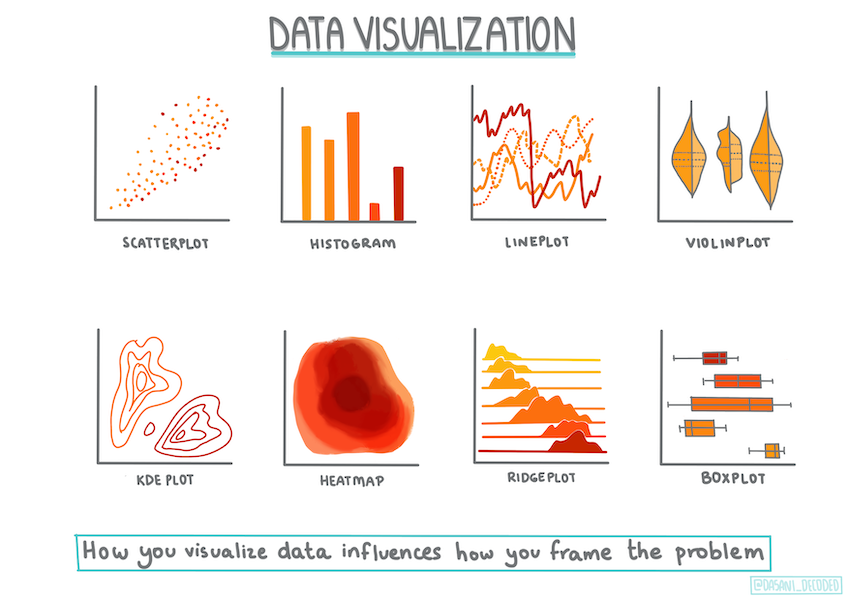

<!--
CO_OP_TRANSLATOR_METADATA:
{
  "original_hash": "a683e1fe430bb0d4a10b68f6ca15e0a6",
  "translation_date": "2025-08-29T20:34:00+00:00",
  "source_file": "2-Regression/2-Data/README.md",
  "language_code": "bn"
}
-->
# স্কিকিট-লার্ন ব্যবহার করে একটি রিগ্রেশন মডেল তৈরি করা: ডেটা প্রস্তুত এবং ভিজুয়ালাইজেশন



ইনফোগ্রাফিক: [দাসানি মাদিপল্লি](https://twitter.com/dasani_decoded)

## [পূর্ব-লেকচার কুইজ](https://gray-sand-07a10f403.1.azurestaticapps.net/quiz/11/)

> ### [এই পাঠটি R-এও উপলব্ধ!](../../../../2-Regression/2-Data/solution/R/lesson_2.html)

## ভূমিকা

আপনি যখন স্কিকিট-লার্ন ব্যবহার করে মেশিন লার্নিং মডেল তৈরি করতে প্রস্তুত, তখন আপনার ডেটা থেকে সঠিক প্রশ্ন জিজ্ঞাসা করাটা অত্যন্ত গুরুত্বপূর্ণ। ডেটার সাথে কাজ করার সময় এবং মেশিন লার্নিং সমাধান প্রয়োগ করার সময়, সঠিক প্রশ্ন জিজ্ঞাসা করা অত্যন্ত গুরুত্বপূর্ণ যাতে ডেটার সম্ভাবনাগুলি সঠিকভাবে উন্মোচিত হয়।

এই পাঠে আপনি শিখবেন:

- কীভাবে মডেল তৈরির জন্য আপনার ডেটা প্রস্তুত করবেন।
- কীভাবে ম্যাটপ্লটলিব ব্যবহার করে ডেটা ভিজুয়ালাইজ করবেন।

## আপনার ডেটা থেকে সঠিক প্রশ্ন জিজ্ঞাসা করা

আপনার যে প্রশ্নের উত্তর প্রয়োজন তা নির্ধারণ করবে আপনি কোন ধরনের মেশিন লার্নিং অ্যালগরিদম ব্যবহার করবেন। এবং আপনি যে উত্তরটি পাবেন তার গুণমান অনেকাংশে আপনার ডেটার প্রকৃতির উপর নির্ভর করবে।

এই পাঠের জন্য সরবরাহিত [ডেটা](https://github.com/microsoft/ML-For-Beginners/blob/main/2-Regression/data/US-pumpkins.csv) দেখুন। আপনি এই .csv ফাইলটি VS Code-এ খুলতে পারেন। দ্রুত স্ক্যান করলে দেখা যায় যে এতে ফাঁকা জায়গা এবং স্ট্রিং ও সংখ্যার মিশ্রণ রয়েছে। এছাড়াও একটি অদ্ভুত কলাম রয়েছে যার নাম 'Package', যেখানে ডেটা 'sacks', 'bins' এবং অন্যান্য মানের মিশ্রণ। ডেটাটি আসলে কিছুটা বিশৃঙ্খল।

[](https://youtu.be/5qGjczWTrDQ "শিক্ষার্থীদের জন্য মেশিন লার্নিং - কীভাবে একটি ডেটাসেট বিশ্লেষণ এবং পরিষ্কার করবেন")

> 🎥 উপরের ছবিতে ক্লিক করুন এই পাঠের জন্য ডেটা প্রস্তুত করার একটি সংক্ষিপ্ত ভিডিও দেখার জন্য।

আসলে, এমন একটি ডেটাসেট পাওয়া খুবই বিরল যা সম্পূর্ণ প্রস্তুত এবং সরাসরি একটি মেশিন লার্নিং মডেল তৈরির জন্য ব্যবহার করা যায়। এই পাঠে, আপনি শিখবেন কীভাবে স্ট্যান্ডার্ড পাইথন লাইব্রেরি ব্যবহার করে একটি কাঁচা ডেটাসেট প্রস্তুত করবেন। এছাড়াও, আপনি ডেটা ভিজুয়ালাইজ করার বিভিন্ন কৌশল শিখবেন।

## কেস স্টাডি: 'কুমড়ার বাজার'

এই ফোল্ডারে, মূল `data` ফোল্ডারে [US-pumpkins.csv](https://github.com/microsoft/ML-For-Beginners/blob/main/2-Regression/data/US-pumpkins.csv) নামে একটি .csv ফাইল রয়েছে, যেখানে ১৭৫৭টি লাইন ডেটা রয়েছে যা শহর অনুযায়ী গোষ্ঠীবদ্ধ কুমড়ার বাজার সম্পর্কিত। এটি কাঁচা ডেটা যা [Specialty Crops Terminal Markets Standard Reports](https://www.marketnews.usda.gov/mnp/fv-report-config-step1?type=termPrice) থেকে সংগ্রহ করা হয়েছে, যা মার্কিন যুক্তরাষ্ট্রের কৃষি বিভাগের দ্বারা বিতরণ করা হয়।

### ডেটা প্রস্তুত করা

এই ডেটা পাবলিক ডোমেইনে রয়েছে। এটি USDA ওয়েবসাইট থেকে বিভিন্ন শহরের জন্য আলাদা আলাদা ফাইল হিসেবে ডাউনলোড করা যায়। অনেক আলাদা ফাইল এড়াতে, আমরা সমস্ত শহরের ডেটা একত্রিত করে একটি স্প্রেডশিটে রেখেছি। সুতরাং, আমরা ইতিমধ্যে ডেটা কিছুটা _প্রস্তুত_ করেছি। এখন, আসুন ডেটাটি আরও কাছ থেকে দেখি।

### কুমড়ার ডেটা - প্রাথমিক পর্যবেক্ষণ

এই ডেটা সম্পর্কে আপনি কী লক্ষ্য করেন? আপনি ইতিমধ্যে দেখেছেন যে এখানে স্ট্রিং, সংখ্যা, ফাঁকা জায়গা এবং অদ্ভুত মানের মিশ্রণ রয়েছে যা আপনাকে বুঝতে হবে।

রিগ্রেশন পদ্ধতি ব্যবহার করে আপনি এই ডেটা থেকে কী প্রশ্ন করতে পারেন? যেমন, "একটি নির্দিষ্ট মাসে বিক্রয়ের জন্য একটি কুমড়ার দাম পূর্বানুমান করুন।" ডেটার দিকে আবার তাকালে, আপনি লক্ষ্য করবেন যে এই কাজের জন্য প্রয়োজনীয় ডেটা কাঠামো তৈরি করতে কিছু পরিবর্তন করতে হবে।

## অনুশীলন - কুমড়ার ডেটা বিশ্লেষণ করুন

[পান্ডাস](https://pandas.pydata.org/) ব্যবহার করুন, যা ডেটা আকারে রূপান্তর করার জন্য একটি খুব কার্যকর টুল, কুমড়ার এই ডেটা বিশ্লেষণ এবং প্রস্তুত করতে।

### প্রথমে, অনুপস্থিত তারিখগুলি পরীক্ষা করুন

আপনাকে প্রথমে অনুপস্থিত তারিখগুলি পরীক্ষা করার জন্য কিছু পদক্ষেপ নিতে হবে:

1. তারিখগুলিকে মাসের ফরম্যাটে রূপান্তর করুন (এগুলি মার্কিন তারিখ, তাই ফরম্যাটটি `MM/DD/YYYY`)।
2. একটি নতুন কলামে মাসটি বের করুন।

_নোটবুক.ipynb_ ফাইলটি Visual Studio Code-এ খুলুন এবং স্প্রেডশিটটি একটি নতুন Pandas ডেটাফ্রেমে আমদানি করুন।

1. প্রথম পাঁচটি সারি দেখতে `head()` ফাংশনটি ব্যবহার করুন।

    ```python
    import pandas as pd
    pumpkins = pd.read_csv('../data/US-pumpkins.csv')
    pumpkins.head()
    ```

    ✅ শেষ পাঁচটি সারি দেখতে আপনি কোন ফাংশনটি ব্যবহার করবেন?

1. বর্তমান ডেটাফ্রেমে অনুপস্থিত ডেটা আছে কিনা তা পরীক্ষা করুন:

    ```python
    pumpkins.isnull().sum()
    ```

    অনুপস্থিত ডেটা রয়েছে, তবে এটি হয়তো এই কাজের জন্য গুরুত্বপূর্ণ নাও হতে পারে।

1. আপনার ডেটাফ্রেমটি আরও সহজে কাজ করার জন্য, কেবল প্রয়োজনীয় কলামগুলি নির্বাচন করুন, `loc` ফাংশন ব্যবহার করে যা মূল ডেটাফ্রেম থেকে একটি নির্দিষ্ট সারি এবং কলাম গোষ্ঠী বের করে। নিচের ক্ষেত্রে `:` এর অর্থ "সব সারি।"

    ```python
    columns_to_select = ['Package', 'Low Price', 'High Price', 'Date']
    pumpkins = pumpkins.loc[:, columns_to_select]
    ```

### দ্বিতীয়ত, কুমড়ার গড় দাম নির্ধারণ করুন

একটি নির্দিষ্ট মাসে কুমড়ার গড় দাম নির্ধারণ করার জন্য কীভাবে এগোবেন? এই কাজের জন্য আপনি কোন কলামগুলি বাছাই করবেন? ইঙ্গিত: আপনাকে ৩টি কলাম প্রয়োজন হবে।

সমাধান: `Low Price` এবং `High Price` কলামের গড় বের করে নতুন Price কলামটি পূরণ করুন এবং Date কলামটি কেবল মাস দেখানোর জন্য রূপান্তর করুন। সৌভাগ্যক্রমে, উপরের পরীক্ষার মতে, তারিখ বা দামের জন্য কোনো অনুপস্থিত ডেটা নেই।

1. গড় বের করতে, নিচের কোডটি যোগ করুন:

    ```python
    price = (pumpkins['Low Price'] + pumpkins['High Price']) / 2

    month = pd.DatetimeIndex(pumpkins['Date']).month

    ```

   ✅ আপনি `print(month)` ব্যবহার করে যেকোনো ডেটা পরীক্ষা করতে পারেন।

2. এখন, আপনার রূপান্তরিত ডেটা একটি নতুন Pandas ডেটাফ্রেমে কপি করুন:

    ```python
    new_pumpkins = pd.DataFrame({'Month': month, 'Package': pumpkins['Package'], 'Low Price': pumpkins['Low Price'],'High Price': pumpkins['High Price'], 'Price': price})
    ```

    আপনার ডেটাফ্রেমটি প্রিন্ট করলে একটি পরিষ্কার, সুশৃঙ্খল ডেটাসেট দেখতে পাবেন, যার উপর ভিত্তি করে আপনি একটি নতুন রিগ্রেশন মডেল তৈরি করতে পারবেন।

### কিন্তু অপেক্ষা করুন! এখানে কিছু অদ্ভুত আছে

যদি আপনি `Package` কলামটি দেখেন, কুমড়াগুলি বিভিন্ন কনফিগারেশনে বিক্রি হয়। কিছু '1 1/9 bushel' পরিমাপে বিক্রি হয়, কিছু '1/2 bushel' পরিমাপে, কিছু প্রতি কুমড়া, কিছু প্রতি পাউন্ড, এবং কিছু বড় বাক্সে বিভিন্ন প্রস্থে।

> কুমড়াগুলি সঠিকভাবে ওজন করা খুবই কঠিন বলে মনে হয়

মূল ডেটা বিশ্লেষণ করে দেখা যায় যে `Unit of Sale` যদি 'EACH' বা 'PER BIN' হয়, তবে `Package` টাইপটি প্রতি ইঞ্চি, প্রতি বিন, বা 'each'। কুমড়াগুলি সঠিকভাবে ওজন করা খুবই কঠিন বলে মনে হয়, তাই আসুন কেবল `Package` কলামে 'bushel' শব্দটি থাকা কুমড়াগুলিকে বাছাই করি।

1. ফাইলের শুরুতে, প্রাথমিক .csv আমদানির নিচে একটি ফিল্টার যোগ করুন:

    ```python
    pumpkins = pumpkins[pumpkins['Package'].str.contains('bushel', case=True, regex=True)]
    ```

    এখন ডেটা প্রিন্ট করলে, আপনি দেখতে পাবেন যে কেবল প্রায় ৪১৫টি সারি রয়েছে যেখানে কুমড়াগুলি bushel-এ বিক্রি হয়।

### কিন্তু অপেক্ষা করুন! আরও একটি কাজ বাকি আছে

আপনি কি লক্ষ্য করেছেন যে bushel-এর পরিমাণ প্রতি সারিতে ভিন্ন? আপনাকে দামটি bushel প্রতি দেখানোর জন্য স্বাভাবিক করতে হবে, তাই এটি মানক করার জন্য কিছু গণনা করুন।

1. নতুন_pumpkins ডেটাফ্রেম তৈরি করার ব্লকের পরে এই লাইনগুলি যোগ করুন:

    ```python
    new_pumpkins.loc[new_pumpkins['Package'].str.contains('1 1/9'), 'Price'] = price/(1 + 1/9)

    new_pumpkins.loc[new_pumpkins['Package'].str.contains('1/2'), 'Price'] = price/(1/2)
    ```

✅ [The Spruce Eats](https://www.thespruceeats.com/how-much-is-a-bushel-1389308) অনুসারে, bushel-এর ওজন উৎপাদনের ধরন অনুযায়ী পরিবর্তিত হয়, কারণ এটি একটি ভলিউম পরিমাপ। "উদাহরণস্বরূপ, টমেটোর একটি bushel-এর ওজন ৫৬ পাউন্ড হওয়া উচিত... পাতাগুলি এবং শাকসবজি বেশি জায়গা নেয় কিন্তু কম ওজন হয়, তাই পালং শাকের একটি bushel কেবল ২০ পাউন্ড।" এটি বেশ জটিল! আসুন bushel-থেকে-পাউন্ড রূপান্তর নিয়ে মাথা ঘামাই না এবং bushel অনুযায়ী দাম নির্ধারণ করি। তবে এই bushel-এ কুমড়ার গবেষণা দেখায় যে আপনার ডেটার প্রকৃতি বোঝা কতটা গুরুত্বপূর্ণ!

এখন, আপনি bushel পরিমাপের ভিত্তিতে ইউনিট প্রতি দাম বিশ্লেষণ করতে পারেন। ডেটা একবার প্রিন্ট করলে, আপনি দেখতে পাবেন এটি কীভাবে মানক করা হয়েছে।

✅ আপনি কি লক্ষ্য করেছেন যে অর্ধ-bushel-এ বিক্রি হওয়া কুমড়াগুলি খুবই ব্যয়বহুল? আপনি কি এর কারণ বের করতে পারেন? ইঙ্গিত: ছোট কুমড়াগুলি বড়গুলোর তুলনায় অনেক বেশি দামী, সম্ভবত কারণ bushel-এ অনেক বেশি ছোট কুমড়া থাকে, বড় ফাঁপা পাই কুমড়ার কারণে ব্যবহৃত জায়গা কম থাকে।

## ভিজুয়ালাইজেশন কৌশল

ডেটা বিজ্ঞানীর কাজের একটি অংশ হল তারা যে ডেটা নিয়ে কাজ করছেন তার গুণমান এবং প্রকৃতি প্রদর্শন করা। এটি করতে, তারা প্রায়ই আকর্ষণীয় ভিজুয়ালাইজেশন তৈরি করেন, যেমন প্লট, গ্রাফ এবং চার্ট, যা ডেটার বিভিন্ন দিক দেখায়। এইভাবে, তারা এমন সম্পর্ক এবং ফাঁকগুলি চাক্ষুষভাবে প্রদর্শন করতে সক্ষম হন যা অন্যথায় খুঁজে পাওয়া কঠিন।

[](https://youtu.be/SbUkxH6IJo0 "শিক্ষার্থীদের জন্য মেশিন লার্নিং - কীভাবে ম্যাটপ্লটলিব দিয়ে ডেটা ভিজুয়ালাইজ করবেন")

> 🎥 উপরের ছবিতে ক্লিক করুন এই পাঠের জন্য ডেটা ভিজুয়ালাইজ করার একটি সংক্ষিপ্ত ভিডিও দেখার জন্য।

ভিজুয়ালাইজেশনগুলি মেশিন লার্নিং কৌশল নির্ধারণ করতেও সহায়তা করতে পারে। উদাহরণস্বরূপ, একটি স্ক্যাটারপ্লট যা একটি রেখার মতো মনে হয়, তা নির্দেশ করে যে ডেটা একটি লিনিয়ার রিগ্রেশন অনুশীলনের জন্য উপযুক্ত।

একটি ডেটা ভিজুয়ালাইজেশন লাইব্রেরি যা জুপিটার নোটবুকে ভাল কাজ করে তা হল [ম্যাটপ্লটলিব](https://matplotlib.org/) (যা আপনি আগের পাঠেও দেখেছেন)।

> ডেটা ভিজুয়ালাইজেশনের আরও অভিজ্ঞতা পেতে [এই টিউটোরিয়ালগুলি](https://docs.microsoft.com/learn/modules/explore-analyze-data-with-python?WT.mc_id=academic-77952-leestott) দেখুন।

## অনুশীলন - ম্যাটপ্লটলিব নিয়ে পরীক্ষা করুন

আপনি যে নতুন ডেটাফ্রেমটি তৈরি করেছেন তা প্রদর্শনের জন্য কিছু মৌলিক প্লট তৈরি করার চেষ্টা করুন। একটি মৌলিক লাইন প্লট কী দেখাবে?

1. ফাইলের শুরুতে, Pandas আমদানির নিচে ম্যাটপ্লটলিব আমদানি করুন:

    ```python
    import matplotlib.pyplot as plt
    ```

1. পুরো নোটবুকটি পুনরায় চালান।
1. নোটবুকের নিচে একটি সেল যোগ করুন এবং ডেটা একটি বক্স প্লট হিসাবে প্রদর্শন করুন:

    ```python
    price = new_pumpkins.Price
    month = new_pumpkins.Month
    plt.scatter(price, month)
    plt.show()
    ```

    

    এটি কি একটি কার্যকর প্লট? এটি কি আপনাকে অবাক করে?

    এটি বিশেষভাবে কার্যকর নয় কারণ এটি কেবল একটি নির্দিষ্ট মাসে আপনার ডেটাকে পয়েন্টের একটি বিস্তৃতি হিসাবে প্রদর্শন করে।

### এটি কার্যকর করুন

ডেটা প্রদর্শনের জন্য চার্টগুলি কার্যকর করতে, সাধারণত আপনাকে ডেটা কোনোভাবে গোষ্ঠীবদ্ধ করতে হয়। আসুন একটি প্লট তৈরি করার চেষ্টা করি যেখানে y অক্ষ মাসগুলি দেখায় এবং ডেটা ডেটার বিতরণ প্রদর্শন করে।

1. একটি সেল যোগ করুন এবং একটি গোষ্ঠীবদ্ধ বার চার্ট তৈরি করুন:

    ```python
    new_pumpkins.groupby(['Month'])['Price'].mean().plot(kind='bar')
    plt.ylabel("Pumpkin Price")
    ```

    

    এটি একটি আরও কার্যকর ডেটা ভিজুয়ালাইজেশন! এটি মনে হয় যে কুমড়ার সর্বোচ্চ দাম সেপ্টেম্বর এবং অক্টোবর মাসে হয়। এটি কি আপনার প্রত্যাশার সাথে মেলে? কেন বা কেন নয়?

---

## 🚀চ্যালেঞ্জ

ম্যাটপ্লটলিব যে বিভিন্ন ধরনের ভিজুয়ালাইজেশন অফার করে তা অন্বেষণ করুন। রিগ্রেশন সমস্যার জন্য কোন ধরনের ভিজুয়ালাইজেশন সবচেয়ে উপযুক্ত?

## [পোস্ট-লেকচার কুইজ](https://gray-sand-07a10f403.1.azurestaticapps.net/quiz/12/)

## পর্যালোচনা ও স্ব-অধ্যয়ন

ডেটা ভিজুয়ালাইজ করার বিভিন্ন উপায় দেখুন। উপলব্ধ বিভিন্ন লাইব্রেরির একটি তালিকা তৈরি করুন এবং নোট করুন কোনটি কোন ধরনের কাজের জন্য সবচেয়ে উপযুক্ত, যেমন ২ডি ভিজুয়ালাইজেশন বনাম ৩ডি ভিজুয়ালাইজেশন। আপনি কী আবিষ্কার করেন?

## অ্যাসাইনমেন্ট

[ভিজুয়ালাইজেশন অন্বেষণ](assignment.md)

---

**অস্বীকৃতি**:  
এই নথিটি AI অনুবাদ পরিষেবা [Co-op Translator](https://github.com/Azure/co-op-translator) ব্যবহার করে অনুবাদ করা হয়েছে। আমরা যথাসম্ভব সঠিক অনুবাদ প্রদানের চেষ্টা করি, তবে অনুগ্রহ করে মনে রাখবেন যে স্বয়ংক্রিয় অনুবাদে ত্রুটি বা অসঙ্গতি থাকতে পারে। মূল ভাষায় থাকা নথিটিকে প্রামাণিক উৎস হিসেবে বিবেচনা করা উচিত। গুরুত্বপূর্ণ তথ্যের জন্য, পেশাদার মানব অনুবাদ সুপারিশ করা হয়। এই অনুবাদ ব্যবহারের ফলে কোনো ভুল বোঝাবুঝি বা ভুল ব্যাখ্যা হলে আমরা তার জন্য দায়ী থাকব না।