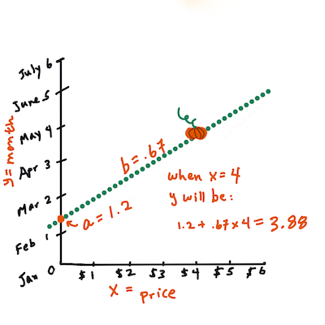

<!--
CO_OP_TRANSLATOR_METADATA:
{
  "original_hash": "2f88fbc741d792890ff2f1430fe0dae0",
  "translation_date": "2025-08-29T20:13:53+00:00",
  "source_file": "2-Regression/3-Linear/README.md",
  "language_code": "bn"
}
-->
# স্কিকিট-লার্ন ব্যবহার করে রিগ্রেশন মডেল তৈরি করুন: চারটি পদ্ধতিতে রিগ্রেশন


> ইনফোগ্রাফিক: [দাসানি মাদিপল্লি](https://twitter.com/dasani_decoded)
## [পূর্ব-লেকচার কুইজ](https://gray-sand-07a10f403.1.azurestaticapps.net/quiz/13/)

> ### [এই পাঠটি R-এও উপলব্ধ!](../../../../2-Regression/3-Linear/solution/R/lesson_3.html)
### ভূমিকা

এখন পর্যন্ত আপনি রিগ্রেশন কী তা কুমড়ার দাম সম্পর্কিত একটি নমুনা ডেটাসেট ব্যবহার করে অন্বেষণ করেছেন, যা আমরা এই পাঠে ব্যবহার করব। আপনি এটি ম্যাটপ্লটলিব ব্যবহার করে ভিজুয়ালাইজও করেছেন।

এখন আপনি মেশিন লার্নিংয়ের জন্য রিগ্রেশন সম্পর্কে আরও গভীরভাবে জানার জন্য প্রস্তুত। ভিজুয়ালাইজেশন ডেটা বোঝার জন্য সহায়ক হলেও, মেশিন লার্নিংয়ের আসল শক্তি আসে _মডেল প্রশিক্ষণ_ থেকে। মডেলগুলি ঐতিহাসিক ডেটার উপর প্রশিক্ষিত হয় যাতে ডেটার নির্ভরশীলতা স্বয়ংক্রিয়ভাবে ধরা যায় এবং নতুন ডেটার জন্য ফলাফল পূর্বাভাস দেওয়া যায়, যা মডেল আগে দেখেনি।

এই পাঠে, আপনি দুটি ধরণের রিগ্রেশন সম্পর্কে আরও জানবেন: _বেসিক লিনিয়ার রিগ্রেশন_ এবং _পলিনোমিয়াল রিগ্রেশন_, এবং এই কৌশলগুলির সাথে সম্পর্কিত কিছু গণিত। এই মডেলগুলি আমাদের বিভিন্ন ইনপুট ডেটার উপর ভিত্তি করে কুমড়ার দাম পূর্বাভাস দিতে সাহায্য করবে।

[](https://youtu.be/CRxFT8oTDMg "শিক্ষার্থীদের জন্য মেশিন লার্নিং - লিনিয়ার রিগ্রেশন বোঝা")

> 🎥 উপরের ছবিতে ক্লিক করে লিনিয়ার রিগ্রেশন সম্পর্কে একটি সংক্ষিপ্ত ভিডিও দেখুন।

> এই পাঠ্যক্রম জুড়ে, আমরা গণিতের ন্যূনতম জ্ঞান ধরে নিই এবং এটি অন্যান্য ক্ষেত্র থেকে আসা শিক্ষার্থীদের জন্য সহজলভ্য করার চেষ্টা করি। তাই নোট, 🧮 কলআউট, ডায়াগ্রাম এবং অন্যান্য শেখার সরঞ্জামগুলির দিকে নজর রাখুন যা বোঝার জন্য সহায়ক।

### পূর্বশর্ত

এখন পর্যন্ত আপনি যে কুমড়ার ডেটা বিশ্লেষণ করছেন তার গঠন সম্পর্কে পরিচিত হওয়া উচিত। এই পাঠের _notebook.ipynb_ ফাইলে এটি প্রিলোড এবং প্রি-ক্লিন করা অবস্থায় পাবেন। ফাইলে, কুমড়ার দাম একটি নতুন ডেটা ফ্রেমে প্রতি বাসেল হিসেবে প্রদর্শিত হয়েছে। নিশ্চিত করুন যে আপনি এই নোটবুকগুলি ভিজ্যুয়াল স্টুডিও কোডের কার্নেলে চালাতে পারেন।

### প্রস্তুতি

মনে করিয়ে দেওয়ার জন্য, আপনি এই ডেটা লোড করছেন যাতে এটি থেকে প্রশ্ন করতে পারেন।

- কুমড়া কেনার সেরা সময় কখন?
- একটি মিনিয়েচার কুমড়ার কেসের দাম কত হতে পারে?
- আমি কি এগুলি অর্ধ-বাসেল ঝুড়িতে কিনব নাকি ১ ১/৯ বাসেল বাক্সে কিনব?
চলুন এই ডেটা আরও গভীরভাবে বিশ্লেষণ করি।

পূর্ববর্তী পাঠে, আপনি একটি প্যান্ডাস ডেটা ফ্রেম তৈরি করেছেন এবং এটি মূল ডেটাসেটের একটি অংশ দিয়ে পূরণ করেছেন, দামকে বাসেল অনুযায়ী মানক করে। তবে, এটি করার মাধ্যমে আপনি প্রায় ৪০০ ডেটাপয়েন্ট এবং শুধুমাত্র শরৎকালের মাসগুলির জন্য ডেটা সংগ্রহ করতে পেরেছিলেন।

এই পাঠের সাথে থাকা নোটবুকে প্রিলোড করা ডেটা দেখুন। ডেটা প্রিলোড করা হয়েছে এবং একটি প্রাথমিক স্ক্যাটারপ্লট মাসের ডেটা দেখানোর জন্য চার্ট করা হয়েছে। হয়তো আমরা ডেটার প্রকৃতি সম্পর্কে আরও বিশদ পেতে পারি যদি এটি আরও পরিষ্কার করি।

## একটি লিনিয়ার রিগ্রেশন লাইন

পাঠ ১-এ আপনি শিখেছেন যে একটি লিনিয়ার রিগ্রেশন অনুশীলনের লক্ষ্য হল একটি লাইন প্লট করা যা:

- **ভেরিয়েবল সম্পর্ক দেখায়**। ভেরিয়েবলের মধ্যে সম্পর্ক দেখায়।
- **পূর্বাভাস দেয়**। একটি নতুন ডেটাপয়েন্ট এই লাইনের সাথে সম্পর্কিত কোথায় পড়বে তা সঠিকভাবে পূর্বাভাস দেয়।

**লিস্ট-স্কোয়ার রিগ্রেশন** সাধারণত এই ধরণের লাইন আঁকতে ব্যবহৃত হয়। 'লিস্ট-স্কোয়ার' শব্দটি বোঝায় যে রিগ্রেশন লাইনের চারপাশের সমস্ত ডেটাপয়েন্ট স্কোয়ার করা হয় এবং তারপর যোগ করা হয়। আদর্শভাবে, এই চূড়ান্ত যোগফল যতটা সম্ভব ছোট হওয়া উচিত, কারণ আমরা কম সংখ্যক ত্রুটি বা `লিস্ট-স্কোয়ার` চাই।

আমরা এটি করি কারণ আমরা এমন একটি লাইন মডেল করতে চাই যার সমস্ত ডেটাপয়েন্ট থেকে সর্বনিম্ন সামগ্রিক দূরত্ব থাকে। আমরা টার্মগুলিকে যোগ করার আগে স্কোয়ার করি কারণ আমরা এর দিকের চেয়ে এর মাত্রা নিয়ে বেশি উদ্বিগ্ন।

> **🧮 আমাকে গণিত দেখান**
>
> এই লাইন, যা _সেরা ফিটের লাইন_ নামে পরিচিত, [একটি সমীকরণ](https://en.wikipedia.org/wiki/Simple_linear_regression) দ্বারা প্রকাশ করা যেতে পারে:
>
> ```
> Y = a + bX
> ```
>
> `X` হল 'ব্যাখ্যামূলক ভেরিয়েবল'। `Y` হল 'নির্ভরশীল ভেরিয়েবল'। লাইনের ঢাল হল `b` এবং `a` হল y-ইন্টারসেপ্ট, যা বোঝায় `X = 0` হলে `Y` এর মান।
>
>
>
> প্রথমে, ঢাল `b` গণনা করুন। ইনফোগ্রাফিক: [জেন লুপার](https://twitter.com/jenlooper)
>
> অন্য কথায়, এবং আমাদের কুমড়ার ডেটার মূল প্রশ্নের দিকে ইঙ্গিত করে: "মাস অনুযায়ী প্রতি বাসেলে কুমড়ার দাম পূর্বাভাস দিন", `X` দাম বোঝাবে এবং `Y` বিক্রয়ের মাস বোঝাবে।
>
>
>
> `Y` এর মান গণনা করুন। যদি আপনি প্রায় $৪ দিচ্ছেন, তবে এটি অবশ্যই এপ্রিল! ইনফোগ্রাফিক: [জেন লুপার](https://twitter.com/jenlooper)
>
> লাইনের ঢাল গণনা করার জন্য যে গণিত প্রয়োজন তা ইন্টারসেপ্টের উপরও নির্ভরশীল, বা যেখানে `X = 0` হলে `Y` অবস্থিত।
>
> এই মানগুলির গণনার পদ্ধতি [Math is Fun](https://www.mathsisfun.com/data/least-squares-regression.html) ওয়েবসাইটে পর্যবেক্ষণ করতে পারেন। এছাড়াও [এই লিস্ট-স্কোয়ার ক্যালকুলেটর](https://www.mathsisfun.com/data/least-squares-calculator.html) দেখুন যাতে সংখ্যার মানগুলি লাইনে কীভাবে প্রভাব ফেলে তা দেখতে পারেন।

## সহসম্পর্ক

আরেকটি গুরুত্বপূর্ণ শব্দ হল **সহসম্পর্ক সহগ** যা প্রদত্ত X এবং Y ভেরিয়েবলের মধ্যে সম্পর্ক বোঝায়। একটি স্ক্যাটারপ্লট ব্যবহার করে আপনি দ্রুত এই সহগটি ভিজুয়ালাইজ করতে পারেন। একটি প্লটে যদি ডেটাপয়েন্টগুলি একটি সুশৃঙ্খল লাইনে থাকে তবে উচ্চ সহসম্পর্ক থাকে, কিন্তু যদি ডেটাপয়েন্টগুলি X এবং Y এর মধ্যে এলোমেলোভাবে ছড়িয়ে থাকে তবে নিম্ন সহসম্পর্ক থাকে।

একটি ভাল লিনিয়ার রিগ্রেশন মডেল হবে এমন একটি যা লিস্ট-স্কোয়ার রিগ্রেশন পদ্ধতি ব্যবহার করে একটি রিগ্রেশন লাইনের সাথে উচ্চ (১ এর কাছাকাছি) সহসম্পর্ক সহগ রাখে।

✅ এই পাঠের সাথে থাকা নোটবুক চালান এবং মাস থেকে দামের স্ক্যাটারপ্লট দেখুন। কুমড়া বিক্রির জন্য মাস থেকে দামের ডেটা কি আপনার ভিজুয়াল ব্যাখ্যা অনুযায়ী উচ্চ বা নিম্ন সহসম্পর্ক দেখায়? যদি আপনি `Month` এর পরিবর্তে আরও সূক্ষ্ম পরিমাপ ব্যবহার করেন, যেমন *বছরের দিন* (অর্থাৎ বছরের শুরু থেকে দিন সংখ্যা), তবে কি এটি পরিবর্তিত হয়?

নিচের কোডে, আমরা ধরে নেব যে আমরা ডেটা পরিষ্কার করেছি এবং একটি ডেটা ফ্রেম পেয়েছি যার নাম `new_pumpkins`, যা নিম্নলিখিতের মতো:

ID | Month | DayOfYear | Variety | City | Package | Low Price | High Price | Price
---|-------|-----------|---------|------|---------|-----------|------------|-------
70 | 9 | 267 | PIE TYPE | BALTIMORE | 1 1/9 bushel cartons | 15.0 | 15.0 | 13.636364
71 | 9 | 267 | PIE TYPE | BALTIMORE | 1 1/9 bushel cartons | 18.0 | 18.0 | 16.363636
72 | 10 | 274 | PIE TYPE | BALTIMORE | 1 1/9 bushel cartons | 18.0 | 18.0 | 16.363636
73 | 10 | 274 | PIE TYPE | BALTIMORE | 1 1/9 bushel cartons | 17.0 | 17.0 | 15.454545
74 | 10 | 281 | PIE TYPE | BALTIMORE | 1 1/9 bushel cartons | 15.0 | 15.0 | 13.636364

> ডেটা পরিষ্কার করার কোড [`notebook.ipynb`](notebook.ipynb)-এ উপলব্ধ। আমরা পূর্ববর্তী পাঠের মতো একই পরিষ্কার করার ধাপগুলি সম্পন্ন করেছি এবং নিম্নলিখিত এক্সপ্রেশন ব্যবহার করে `DayOfYear` কলাম গণনা করেছি:

```python
day_of_year = pd.to_datetime(pumpkins['Date']).apply(lambda dt: (dt-datetime(dt.year,1,1)).days)
```

এখন যেহেতু আপনি লিনিয়ার রিগ্রেশনের পেছনের গণিত সম্পর্কে একটি ধারণা পেয়েছেন, আসুন একটি রিগ্রেশন মডেল তৈরি করি এবং দেখি কোন কুমড়ার প্যাকেজের দাম সবচেয়ে ভালো হবে তা পূর্বাভাস দেওয়া যায় কিনা। ছুটির দিনগুলির জন্য একটি কুমড়ার প্যাচ কিনতে আগ্রহী কেউ এই তথ্যটি ব্যবহার করতে পারে তাদের কুমড়ার প্যাকেজ কেনার জন্য অপ্টিমাইজ করতে।

## সহসম্পর্ক খোঁজা

[](https://youtu.be/uoRq-lW2eQo "শিক্ষার্থীদের জন্য মেশিন লার্নিং - সহসম্পর্ক খোঁজা: লিনিয়ার রিগ্রেশনের চাবিকাঠি")

> 🎥 উপরের ছবিতে ক্লিক করে সহসম্পর্ক সম্পর্কে একটি সংক্ষিপ্ত ভিডিও দেখুন।

পূর্ববর্তী পাঠ থেকে আপনি সম্ভবত দেখেছেন যে বিভিন্ন মাসের জন্য গড় দাম এই রকম দেখায়:


এটি নির্দেশ করে যে কিছু সহসম্পর্ক থাকতে পারে, এবং আমরা `Month` এবং `Price` এর মধ্যে সম্পর্ক বা `DayOfYear` এবং `Price` এর মধ্যে সম্পর্ক পূর্বাভাস দেওয়ার জন্য একটি লিনিয়ার রিগ্রেশন মডেল প্রশিক্ষণ দেওয়ার চেষ্টা করতে পারি। এখানে একটি স্ক্যাটারপ্লট রয়েছে যা দ্বিতীয় সম্পর্কটি দেখায়:

 

আসুন `corr` ফাংশন ব্যবহার করে দেখি সহসম্পর্ক আছে কিনা:

```python
print(new_pumpkins['Month'].corr(new_pumpkins['Price']))
print(new_pumpkins['DayOfYear'].corr(new_pumpkins['Price']))
```

এটি মনে হচ্ছে সহসম্পর্ক খুবই ছোট, `Month` অনুযায়ী -0.15 এবং `DayOfYear` অনুযায়ী -0.17, তবে অন্য একটি গুরুত্বপূর্ণ সম্পর্ক থাকতে পারে। মনে হচ্ছে বিভিন্ন কুমড়ার প্রকারভেদের সাথে সম্পর্কিত বিভিন্ন দামের ক্লাস্টার রয়েছে। এই অনুমানটি নিশ্চিত করতে, আসুন প্রতিটি কুমড়ার ক্যাটাগরি একটি ভিন্ন রঙ ব্যবহার করে প্লট করি। `scatter` প্লটিং ফাংশনে একটি `ax` প্যারামিটার পাস করে আমরা সমস্ত পয়েন্ট একই গ্রাফে প্লট করতে পারি:

```python
ax=None
colors = ['red','blue','green','yellow']
for i,var in enumerate(new_pumpkins['Variety'].unique()):
    df = new_pumpkins[new_pumpkins['Variety']==var]
    ax = df.plot.scatter('DayOfYear','Price',ax=ax,c=colors[i],label=var)
```

 

আমাদের তদন্ত নির্দেশ করে যে বিক্রির তারিখের চেয়ে প্রকারভেদ সামগ্রিক দামের উপর বেশি প্রভাব ফেলে। আমরা এটি একটি বার গ্রাফ দিয়ে দেখতে পারি:

```python
new_pumpkins.groupby('Variety')['Price'].mean().plot(kind='bar')
```

 

চলুন আপাতত শুধুমাত্র একটি কুমড়ার প্রকারভেদ, 'পাই টাইপ', এর উপর মনোযোগ দিই এবং দেখি তারিখের দামের উপর কী প্রভাব পড়ে:

```python
pie_pumpkins = new_pumpkins[new_pumpkins['Variety']=='PIE TYPE']
pie_pumpkins.plot.scatter('DayOfYear','Price') 
```
 

যদি আমরা এখন `corr` ফাংশন ব্যবহার করে `Price` এবং `DayOfYear` এর মধ্যে সহসম্পর্ক গণনা করি, আমরা প্রায় `-0.27` পাব - যা নির্দেশ করে যে একটি পূর্বাভাসমূলক মডেল প্রশিক্ষণ দেওয়া যৌক্তিক।

> একটি লিনিয়ার রিগ্রেশন মডেল প্রশিক্ষণ দেওয়ার আগে, আমাদের ডেটা পরিষ্কার করা নিশ্চিত করা গুরুত্বপূর্ণ। লিনিয়ার রিগ্রেশন অনুপস্থিত মানগুলির সাথে ভাল কাজ করে না, তাই সমস্ত খালি সেল বাদ দেওয়া যৌক্তিক:

```python
pie_pumpkins.dropna(inplace=True)
pie_pumpkins.info()
```

অন্য একটি পদ্ধতি হতে পারে খালি মানগুলি সংশ্লিষ্ট কলামের গড় মান দিয়ে পূরণ করা।

## সহজ লিনিয়ার রিগ্রেশন

[](https://youtu.be/e4c_UP2fSjg "শিক্ষার্থীদের জন্য মেশিন লার্নিং - স্কিকিট-লার্ন ব্যবহার করে লিনিয়ার এবং পলিনোমিয়াল রিগ্রেশন")

> 🎥 উপরের ছবিতে ক্লিক করে লিনিয়ার এবং পলিনোমিয়াল রিগ্রেশন সম্পর্কে একটি সংক্ষিপ্ত ভিডিও দেখুন।

আমাদের লিনিয়ার রিগ্রেশন মডেল প্রশিক্ষণ দেওয়ার জন্য, আমরা **স্কিকিট-লার্ন** লাইব্রেরি ব্যবহার করব।

```python
from sklearn.linear_model import LinearRegression
from sklearn.metrics import mean_squared_error
from sklearn.model_selection import train_test_split
```

আমরা ইনপুট মান (ফিচার) এবং প্রত্যাশিত আউটপুট (লেবেল) পৃথক নাম্পাই অ্যারেতে ভাগ করে শুরু করি:

```python
X = pie_pumpkins['DayOfYear'].to_numpy().reshape(-1,1)
y = pie_pumpkins['Price']
```

> লক্ষ্য করুন যে আমরা ইনপুট ডেটার উপর `reshape` প্রয়োগ করতে হয়েছিল যাতে লিনিয়ার রিগ্রেশন প্যাকেজ এটি সঠিকভাবে বুঝতে পারে। লিনিয়ার রিগ্রেশন একটি 2D-অ্যারে ইনপুট হিসাবে প্রত্যাশা করে, যেখানে অ্যারেটির প্রতিটি সারি ইনপুট ফিচারের একটি ভেক্টরের সাথে সম্পর্কিত। আমাদের ক্ষেত্রে, যেহেতু আমাদের শুধুমাত্র একটি ইনপুট রয়েছে - আমাদের একটি N×1 আকৃতির অ্যারে প্রয়োজন, যেখানে N হল ডেটাসেটের আকার।

তারপর, আমরা ডেটাকে প্রশিক্ষণ এবং পরীক্ষা ডেটাসেটে ভাগ করি, যাতে প্রশিক্ষণের পরে আমাদের মডেলটি যাচাই করতে পারি:

```python
X_train, X_test, y_train, y_test = train_test_split(X, y, test_size=0.2, random_state=0)
```

অবশেষে, প্রকৃত লিনিয়ার রিগ্রেশন মডেল প্রশিক্ষণ দেওয়া মাত্র দুটি লাইনের কোডে সম্পন্ন হয়। আমরা `LinearRegression` অবজেক্টটি সংজ্ঞায়িত করি এবং `fit` পদ্ধতি ব্যবহার করে এটি আমাদের ডেটার সাথে ফিট করি:

```python
lin_reg = LinearRegression()
lin_reg.fit(X_train,y_train)
```

`LinearRegression` অবজেক্টটি `fit` করার পরে সমস্ত রিগ্রেশনের সহগ ধারণ করে, যা `.coef_` প্রপার্টি ব্যবহার করে অ্যাক্সেস করা যায়। আমাদের ক্ষেত্রে, এখানে মাত্র একটি সহগ রয়েছে, যা প্রায় `-0.017` হওয়া উচিত। এটি বোঝায় যে সময়ের সাথে দাম কিছুটা কমে যায়, তবে খুব বেশি নয়, প্রতিদিন প্রায় ২ সেন্ট। আমরা `lin_reg.intercept_` ব্যবহার করে রিগ্রেশনের Y-অক্ষের সাথে ছেদ বিন্দুটিও অ্যাক্সেস করতে পারি - এটি আমাদের ক্ষেত্রে প্রায় `21` হবে, যা বছরের শুরুতে দামের ইঙ্গিত দেয়।

আমাদের মডেলটি কতটা সঠিক তা দেখতে, আমরা একটি টেস্ট ডেটাসেটে দাম পূর্বাভাস দিতে পারি এবং তারপর প্রত্যাশিত এবং পূর্বাভাসিত মানের মধ্যে পার্থক্য কতটা কাছাকাছি তা পরিমাপ করতে পারি। এটি গড় বর্গ ত্রুটি (MSE) মেট্রিক্স ব্যবহার করে করা যেতে পারে, যা প্রত্যাশিত এবং পূর্বাভাসিত মানের মধ্যে সমস্ত বর্গ পার্থক্যের গড়।

```python
pred = lin_reg.predict(X_test)

mse = np.sqrt(mean_squared_error(y_test,pred))
print(f'Mean error: {mse:3.3} ({mse/np.mean(pred)*100:3.3}%)')
```
আমাদের ত্রুটি প্রায় ২টি পয়েন্টের আশেপাশে, যা ~১৭%। খুব ভালো নয়। মডেলের গুণমানের আরেকটি সূচক হলো **coefficient of determination**, যা এইভাবে পাওয়া যায়:

```python
score = lin_reg.score(X_train,y_train)
print('Model determination: ', score)
```  
যদি মান ০ হয়, তাহলে এর অর্থ মডেল ইনপুট ডেটাকে বিবেচনা করে না এবং *সবচেয়ে খারাপ লিনিয়ার প্রেডিক্টর* হিসেবে কাজ করে, যা কেবলমাত্র ফলাফলের গড় মান। মান ১ হলে আমরা সমস্ত প্রত্যাশিত আউটপুট নিখুঁতভাবে পূর্বাভাস দিতে পারি। আমাদের ক্ষেত্রে, coefficient প্রায় ০.০৬, যা বেশ কম।

আমরা পরীক্ষার ডেটা এবং রিগ্রেশন লাইনের সাথে একটি গ্রাফ আঁকতে পারি, যাতে আমাদের ক্ষেত্রে রিগ্রেশন কীভাবে কাজ করছে তা আরও ভালোভাবে দেখা যায়:

```python
plt.scatter(X_test,y_test)
plt.plot(X_test,pred)
```  


## পলিনোমিয়াল রিগ্রেশন  

লিনিয়ার রিগ্রেশনের আরেকটি ধরন হলো পলিনোমিয়াল রিগ্রেশন। কখনও কখনও ভেরিয়েবলগুলোর মধ্যে একটি লিনিয়ার সম্পর্ক থাকে - যেমন কুমড়ার আয়তন যত বড়, দাম তত বেশি - কিন্তু কখনও কখনও এই সম্পর্কগুলোকে একটি সমতল বা সরল রেখা হিসেবে চিত্রিত করা যায় না।  

✅ এখানে [আরও কিছু উদাহরণ](https://online.stat.psu.edu/stat501/lesson/9/9.8) রয়েছে, যেখানে পলিনোমিয়াল রিগ্রেশন ব্যবহার করা যেতে পারে।  

Date এবং Price-এর মধ্যে সম্পর্ক আবার দেখুন। এই scatterplot কি সরল রেখা দিয়ে বিশ্লেষণ করা উচিত বলে মনে হয়? দাম কি ওঠানামা করতে পারে না? এই ক্ষেত্রে, আপনি পলিনোমিয়াল রিগ্রেশন চেষ্টা করতে পারেন।  

✅ পলিনোমিয়াল হলো গাণিতিক প্রকাশ, যা এক বা একাধিক ভেরিয়েবল এবং coefficients নিয়ে গঠিত হতে পারে।  

পলিনোমিয়াল রিগ্রেশন একটি বাঁকা রেখা তৈরি করে, যা nonlinear ডেটার সাথে আরও ভালোভাবে মানানসই হয়। আমাদের ক্ষেত্রে, যদি আমরা ইনপুট ডেটায় একটি বর্গাকার `DayOfYear` ভেরিয়েবল অন্তর্ভুক্ত করি, তাহলে আমরা একটি parabolic curve দিয়ে আমাদের ডেটা ফিট করতে পারব, যার একটি নির্দিষ্ট সময়ে সর্বনিম্ন মান থাকবে।  

Scikit-learn একটি সহায়ক [pipeline API](https://scikit-learn.org/stable/modules/generated/sklearn.pipeline.make_pipeline.html?highlight=pipeline#sklearn.pipeline.make_pipeline) অন্তর্ভুক্ত করে, যা ডেটা প্রসেসিংয়ের বিভিন্ন ধাপ একসাথে সংযুক্ত করতে সাহায্য করে। একটি **pipeline** হলো **estimators**-এর একটি চেইন। আমাদের ক্ষেত্রে, আমরা একটি pipeline তৈরি করব, যা প্রথমে আমাদের মডেলে পলিনোমিয়াল ফিচার যোগ করবে এবং তারপর রিগ্রেশন প্রশিক্ষণ দেবে:  

```python
from sklearn.preprocessing import PolynomialFeatures
from sklearn.pipeline import make_pipeline

pipeline = make_pipeline(PolynomialFeatures(2), LinearRegression())

pipeline.fit(X_train,y_train)
```  

`PolynomialFeatures(2)` ব্যবহার করার অর্থ হলো আমরা ইনপুট ডেটা থেকে সমস্ত দ্বিতীয়-ডিগ্রি পলিনোমিয়াল অন্তর্ভুক্ত করব। আমাদের ক্ষেত্রে এটি কেবল `DayOfYear`<sup>2</sup> হবে, কিন্তু দুটি ইনপুট ভেরিয়েবল X এবং Y দেওয়া হলে এটি X<sup>2</sup>, XY এবং Y<sup>2</sup> যোগ করবে। আমরা চাইলে আরও উচ্চ-ডিগ্রি পলিনোমিয়াল ব্যবহার করতে পারি।  

Pipeline-গুলোকে মূল `LinearRegression` অবজেক্টের মতোই ব্যবহার করা যায়, অর্থাৎ আমরা pipeline-কে `fit` করতে পারি এবং তারপর `predict` ব্যবহার করে পূর্বাভাসের ফলাফল পেতে পারি। এখানে পরীক্ষার ডেটা এবং approximation curve দেখানো হয়েছে:  

  

পলিনোমিয়াল রিগ্রেশন ব্যবহার করে আমরা সামান্য কম MSE এবং বেশি determination পেতে পারি, কিন্তু খুব বেশি নয়। আমাদের অন্যান্য ফিচার বিবেচনা করতে হবে!  

> আপনি দেখতে পাচ্ছেন যে Halloween-এর আশেপাশে কুমড়ার সর্বনিম্ন দাম দেখা যায়। আপনি এটি কীভাবে ব্যাখ্যা করবেন?  

🎃 অভিনন্দন, আপনি একটি মডেল তৈরি করেছেন, যা পাই কুমড়ার দাম পূর্বাভাস দিতে সাহায্য করতে পারে। আপনি সম্ভবত একই পদ্ধতি সমস্ত কুমড়ার ধরনগুলোর জন্য পুনরাবৃত্তি করতে পারেন, কিন্তু এটি বেশ ক্লান্তিকর হবে। এখন চলুন শিখি কীভাবে আমাদের মডেলে কুমড়ার বৈচিত্র্যকে বিবেচনায় নেওয়া যায়!  

## ক্যাটেগরিকাল ফিচার  

আদর্শ ক্ষেত্রে, আমরা চাই একই মডেল ব্যবহার করে বিভিন্ন কুমড়ার ধরনগুলোর দাম পূর্বাভাস দিতে সক্ষম হতে। তবে, `Variety` কলামটি `Month`-এর মতো নয়, কারণ এটি non-numeric মান ধারণ করে। এই ধরনের কলামগুলোকে **categorical** বলা হয়।  

[](https://youtu.be/DYGliioIAE0 "ML for beginners - Categorical Feature Predictions with Linear Regression")  

> 🎥 উপরের ছবিতে ক্লিক করুন ক্যাটেগরিকাল ফিচার ব্যবহার সম্পর্কে একটি সংক্ষিপ্ত ভিডিও দেখার জন্য।  

এখানে আপনি দেখতে পাচ্ছেন কীভাবে গড় দাম বৈচিত্র্যের উপর নির্ভর করে:  

  

বৈচিত্র্যকে বিবেচনায় নিতে, প্রথমে এটি numeric আকারে রূপান্তর করতে হবে, বা **encode** করতে হবে। এটি করার কয়েকটি উপায় রয়েছে:  

* সাধারণ **numeric encoding** একটি টেবিল তৈরি করবে, যেখানে বিভিন্ন বৈচিত্র্য থাকবে এবং তারপর বৈচিত্র্যের নামকে সেই টেবিলের একটি সূচকে প্রতিস্থাপন করবে। এটি লিনিয়ার রিগ্রেশনের জন্য সেরা ধারণা নয়, কারণ লিনিয়ার রিগ্রেশন সূচকের প্রকৃত সংখ্যাসূচক মান গ্রহণ করে এবং এটি ফলাফলে যোগ করে, কিছু coefficient দ্বারা গুণ করে। আমাদের ক্ষেত্রে, সূচক নম্বর এবং দামের মধ্যে সম্পর্ক স্পষ্টতই non-linear, এমনকি যদি আমরা নিশ্চিত করি যে সূচকগুলো নির্দিষ্টভাবে সাজানো হয়েছে।  
* **One-hot encoding** `Variety` কলামটিকে ৪টি ভিন্ন কলামে প্রতিস্থাপন করবে, প্রতিটি বৈচিত্র্যের জন্য একটি। প্রতিটি কলামে `1` থাকবে যদি সংশ্লিষ্ট সারিটি একটি নির্দিষ্ট বৈচিত্র্যের হয়, অন্যথায় `0` থাকবে। এর অর্থ হলো লিনিয়ার রিগ্রেশনে ৪টি coefficient থাকবে, প্রতিটি কুমড়ার বৈচিত্র্যের জন্য একটি, যা সেই নির্দিষ্ট বৈচিত্র্যের জন্য "starting price" (বা বরং "additional price") নির্ধারণ করবে।  

নিচের কোডটি দেখায় কীভাবে আমরা একটি বৈচিত্র্যকে one-hot encode করতে পারি:  

```python
pd.get_dummies(new_pumpkins['Variety'])
```  

 ID | FAIRYTALE | MINIATURE | MIXED HEIRLOOM VARIETIES | PIE TYPE  
----|-----------|-----------|--------------------------|----------  
70 | 0 | 0 | 0 | 1  
71 | 0 | 0 | 0 | 1  
... | ... | ... | ... | ...  
1738 | 0 | 1 | 0 | 0  
1739 | 0 | 1 | 0 | 0  
1740 | 0 | 1 | 0 | 0  
1741 | 0 | 1 | 0 | 0  
1742 | 0 | 1 | 0 | 0  

One-hot encoded বৈচিত্র্যকে ইনপুট হিসেবে ব্যবহার করে লিনিয়ার রিগ্রেশন প্রশিক্ষণ দিতে, আমাদের কেবল `X` এবং `y` ডেটা সঠিকভাবে initialize করতে হবে:  

```python
X = pd.get_dummies(new_pumpkins['Variety'])
y = new_pumpkins['Price']
```  

বাকি কোডটি উপরে ব্যবহৃত লিনিয়ার রিগ্রেশন প্রশিক্ষণের কোডের মতোই। যদি আপনি এটি চেষ্টা করেন, আপনি দেখতে পাবেন যে গড় স্কোয়ার্ড ত্রুটি প্রায় একই, কিন্তু আমরা অনেক বেশি coefficient of determination (~৭৭%) পাই। আরও সঠিক পূর্বাভাস পেতে, আমরা আরও ক্যাটেগরিকাল ফিচার এবং সংখ্যাসূচক ফিচার যেমন `Month` বা `DayOfYear` বিবেচনা করতে পারি। একটি বড় ফিচার array পেতে, আমরা `join` ব্যবহার করতে পারি:  

```python
X = pd.get_dummies(new_pumpkins['Variety']) \
        .join(new_pumpkins['Month']) \
        .join(pd.get_dummies(new_pumpkins['City'])) \
        .join(pd.get_dummies(new_pumpkins['Package']))
y = new_pumpkins['Price']
```  

এখানে আমরা `City` এবং `Package` টাইপকেও বিবেচনায় নিয়েছি, যা আমাদের MSE ২.৮৪ (১০%) এবং determination ০.৯৪ দেয়!  

## সবকিছু একত্রিত করা  

সেরা মডেল তৈরি করতে, আমরা উপরের উদাহরণ থেকে পলিনোমিয়াল রিগ্রেশনের সাথে একত্রিত (one-hot encoded ক্যাটেগরিকাল + সংখ্যাসূচক) ডেটা ব্যবহার করতে পারি। আপনার সুবিধার জন্য এখানে সম্পূর্ণ কোড দেওয়া হলো:  

```python
# set up training data
X = pd.get_dummies(new_pumpkins['Variety']) \
        .join(new_pumpkins['Month']) \
        .join(pd.get_dummies(new_pumpkins['City'])) \
        .join(pd.get_dummies(new_pumpkins['Package']))
y = new_pumpkins['Price']

# make train-test split
X_train, X_test, y_train, y_test = train_test_split(X, y, test_size=0.2, random_state=0)

# setup and train the pipeline
pipeline = make_pipeline(PolynomialFeatures(2), LinearRegression())
pipeline.fit(X_train,y_train)

# predict results for test data
pred = pipeline.predict(X_test)

# calculate MSE and determination
mse = np.sqrt(mean_squared_error(y_test,pred))
print(f'Mean error: {mse:3.3} ({mse/np.mean(pred)*100:3.3}%)')

score = pipeline.score(X_train,y_train)
print('Model determination: ', score)
```  

এটি আমাদের প্রায় ৯৭% determination coefficient এবং MSE=২.২৩ (~৮% পূর্বাভাস ত্রুটি) দেবে।  

| Model | MSE | Determination |  
|-------|-----|---------------|  
| `DayOfYear` Linear | 2.77 (17.2%) | 0.07 |  
| `DayOfYear` Polynomial | 2.73 (17.0%) | 0.08 |  
| `Variety` Linear | 5.24 (19.7%) | 0.77 |  
| All features Linear | 2.84 (10.5%) | 0.94 |  
| All features Polynomial | 2.23 (8.25%) | 0.97 |  

🏆 অভিনন্দন! আপনি এক পাঠে চারটি রিগ্রেশন মডেল তৈরি করেছেন এবং মডেলের গুণমান ৯৭% পর্যন্ত উন্নত করেছেন। রিগ্রেশনের চূড়ান্ত অংশে, আপনি ক্যাটেগরি নির্ধারণের জন্য Logistic Regression সম্পর্কে শিখবেন।  

---  
## 🚀চ্যালেঞ্জ  

এই নোটবুকে বিভিন্ন ভেরিয়েবল পরীক্ষা করুন এবং দেখুন কীভাবে correlation মডেলের সঠিকতার সাথে সম্পর্কিত।  

## [পোস্ট-লেকচার কুইজ](https://gray-sand-07a10f403.1.azurestaticapps.net/quiz/14/)  

## পর্যালোচনা ও স্ব-অধ্যয়ন  

এই পাঠে আমরা লিনিয়ার রিগ্রেশন সম্পর্কে শিখেছি। রিগ্রেশনের আরও গুরুত্বপূর্ণ ধরন রয়েছে। Stepwise, Ridge, Lasso এবং Elasticnet কৌশল সম্পর্কে পড়ুন। আরও শেখার জন্য একটি ভালো কোর্স হলো [Stanford Statistical Learning course](https://online.stanford.edu/courses/sohs-ystatslearning-statistical-learning)।  

## অ্যাসাইনমেন্ট  

[একটি মডেল তৈরি করুন](assignment.md)  

---

**অস্বীকৃতি**:  
এই নথিটি AI অনুবাদ পরিষেবা [Co-op Translator](https://github.com/Azure/co-op-translator) ব্যবহার করে অনুবাদ করা হয়েছে। আমরা যথাসাধ্য সঠিকতা নিশ্চিত করার চেষ্টা করি, তবে অনুগ্রহ করে মনে রাখবেন যে স্বয়ংক্রিয় অনুবাদে ত্রুটি বা অসঙ্গতি থাকতে পারে। মূল ভাষায় থাকা নথিটিকে প্রামাণিক উৎস হিসেবে বিবেচনা করা উচিত। গুরুত্বপূর্ণ তথ্যের জন্য, পেশাদার মানব অনুবাদ সুপারিশ করা হয়। এই অনুবাদ ব্যবহারের ফলে কোনো ভুল বোঝাবুঝি বা ভুল ব্যাখ্যা হলে আমরা দায়বদ্ধ থাকব না।