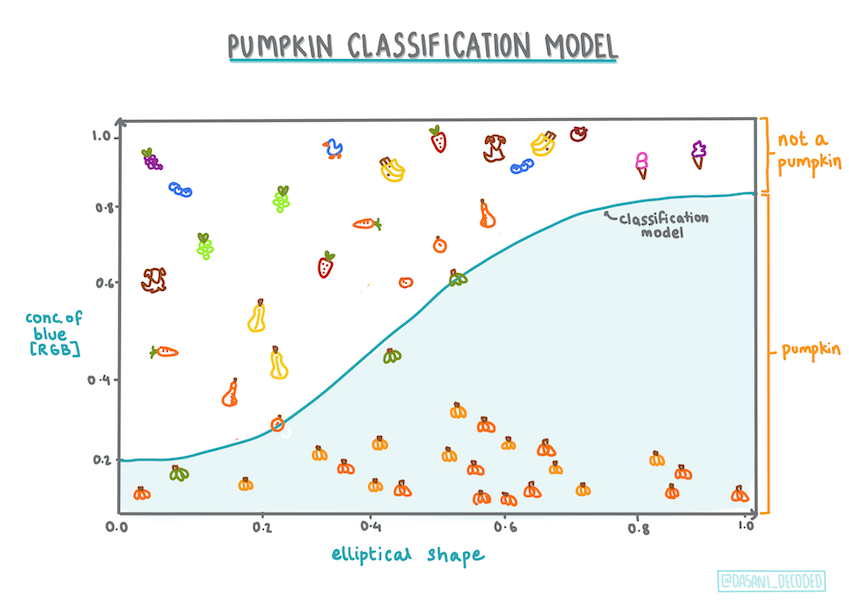
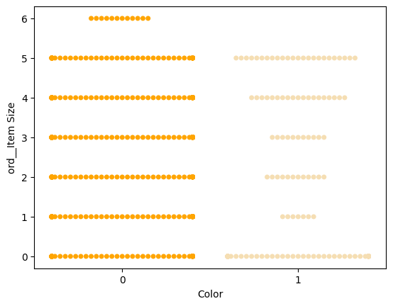
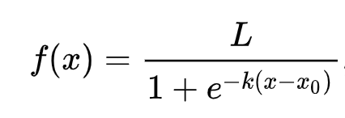

<!--
CO_OP_TRANSLATOR_METADATA:
{
  "original_hash": "72b5bae0879baddf6aafc82bb07b8776",
  "translation_date": "2025-08-29T20:20:11+00:00",
  "source_file": "2-Regression/4-Logistic/README.md",
  "language_code": "bn"
}
-->
# লজিস্টিক রিগ্রেশন দিয়ে ক্যাটাগরি প্রেডিকশন


## [পূর্ব-লেকচার কুইজ](https://gray-sand-07a10f403.1.azurestaticapps.net/quiz/15/)

> ### [এই লেসনটি R-এও পাওয়া যায়!](../../../../2-Regression/4-Logistic/solution/R/lesson_4.html)

## ভূমিকা

রিগ্রেশনের উপর এই চূড়ান্ত পাঠে, যা একটি মৌলিক _ক্লাসিক_ মেশিন লার্নিং কৌশল, আমরা লজিস্টিক রিগ্রেশনের দিকে নজর দেব। এই কৌশলটি ব্যবহার করে আপনি বাইনারি ক্যাটাগরি প্রেডিক্ট করার জন্য প্যাটার্ন খুঁজে বের করতে পারেন। এই ক্যান্ডি চকলেট কিনা? এই রোগ সংক্রামক কিনা? এই গ্রাহক এই পণ্যটি কিনবে কিনা?

এই পাঠে আপনি শিখবেন:

- ডেটা ভিজ্যুয়ালাইজেশনের জন্য একটি নতুন লাইব্রেরি
- লজিস্টিক রিগ্রেশনের কৌশল

✅ এই [Learn module](https://docs.microsoft.com/learn/modules/train-evaluate-classification-models?WT.mc_id=academic-77952-leestott) থেকে এই ধরনের রিগ্রেশনের সাথে কাজ করার দক্ষতা আরও গভীর করুন।

## পূর্বশর্ত

কুমড়ার ডেটার সাথে কাজ করার পর, আমরা এখন যথেষ্ট পরিচিত যে বুঝতে পারি যে একটি বাইনারি ক্যাটাগরি আছে যার সাথে আমরা কাজ করতে পারি: `Color`।

চলুন একটি লজিস্টিক রিগ্রেশন মডেল তৈরি করি যা প্রেডিক্ট করবে, কিছু ভেরিয়েবলের ভিত্তিতে, _একটি নির্দিষ্ট কুমড়ার রঙ কী হতে পারে_ (কমলা 🎃 বা সাদা 👻)।

> কেন আমরা রিগ্রেশনের পাঠে বাইনারি ক্লাসিফিকেশনের কথা বলছি? শুধুমাত্র ভাষাগত সুবিধার জন্য, কারণ লজিস্টিক রিগ্রেশন [আসলে একটি ক্লাসিফিকেশন পদ্ধতি](https://scikit-learn.org/stable/modules/linear_model.html#logistic-regression), যদিও এটি লিনিয়ার ভিত্তিক। পরবর্তী পাঠে ডেটা ক্লাসিফাই করার অন্যান্য পদ্ধতি সম্পর্কে জানুন।

## প্রশ্ন নির্ধারণ

আমাদের উদ্দেশ্যে, আমরা এটিকে একটি বাইনারি হিসেবে প্রকাশ করব: 'সাদা' বা 'সাদা নয়'। আমাদের ডেটাসেটে একটি 'স্ট্রাইপড' ক্যাটাগরিও আছে, কিন্তু এর উদাহরণ খুব কম, তাই আমরা এটি ব্যবহার করব না। যাই হোক, এটি ডেটাসেট থেকে নাল ভ্যালু সরানোর পর অদৃশ্য হয়ে যায়।

> 🎃 মজার তথ্য, আমরা কখনও কখনও সাদা কুমড়াকে 'ভূত' কুমড়া বলি। এগুলো খোদাই করা খুব সহজ নয়, তাই এগুলো কমলা কুমড়ার মতো জনপ্রিয় নয়, কিন্তু দেখতে বেশ সুন্দর! সুতরাং আমরা আমাদের প্রশ্নটি এভাবেও পুনর্গঠন করতে পারি: 'ভূত' বা 'ভূত নয়'। 👻

## লজিস্টিক রিগ্রেশন সম্পর্কে

লজিস্টিক রিগ্রেশন লিনিয়ার রিগ্রেশনের থেকে কিছু গুরুত্বপূর্ণ দিক দিয়ে আলাদা, যা আপনি পূর্বে শিখেছেন।

[](https://youtu.be/KpeCT6nEpBY "শিক্ষার্থীদের জন্য মেশিন লার্নিং - লজিস্টিক রিগ্রেশন বুঝুন")

> 🎥 লজিস্টিক রিগ্রেশনের একটি সংক্ষিপ্ত ভিডিও ওভারভিউ দেখতে উপরের ছবিতে ক্লিক করুন।

### বাইনারি ক্লাসিফিকেশন

লজিস্টিক রিগ্রেশন লিনিয়ার রিগ্রেশনের মতো একই বৈশিষ্ট্য প্রদান করে না। প্রথমটি একটি বাইনারি ক্যাটাগরি সম্পর্কে প্রেডিকশন প্রদান করে ("সাদা বা সাদা নয়"), যেখানে দ্বিতীয়টি ধারাবাহিক মান প্রেডিক্ট করতে সক্ষম, যেমন কুমড়ার উৎপত্তি এবং ফসল কাটার সময়ের ভিত্তিতে, _এর দাম কতটা বাড়বে_।


> ইনফোগ্রাফিক: [দাসানি মাদিপল্লি](https://twitter.com/dasani_decoded)

### অন্যান্য ক্লাসিফিকেশন

লজিস্টিক রিগ্রেশনের অন্যান্য ধরনও আছে, যেমন মাল্টিনোমিয়াল এবং অর্ডিনাল:

- **মাল্টিনোমিয়াল**, যেখানে একাধিক ক্যাটাগরি থাকে - "কমলা, সাদা এবং স্ট্রাইপড"।
- **অর্ডিনাল**, যেখানে ক্যাটাগরিগুলো ক্রমানুসারে সাজানো থাকে, যা তখনই উপকারী যখন আমরা আমাদের ফলাফলগুলোকে যৌক্তিকভাবে সাজাতে চাই, যেমন আমাদের কুমড়াগুলোকে আকার অনুযায়ী সাজানো (মিনি, ছোট, মাঝারি, বড়, এক্সএল, ডাবল এক্সএল)।


### ভেরিয়েবলগুলোর সম্পর্ক থাকা জরুরি নয়

মনে আছে লিনিয়ার রিগ্রেশন কিভাবে আরও ভালো কাজ করত যখন ভেরিয়েবলগুলোর মধ্যে সম্পর্ক বেশি ছিল? লজিস্টিক রিগ্রেশন ঠিক উল্টো - ভেরিয়েবলগুলোর সম্পর্ক থাকা জরুরি নয়। এটি এই ডেটার জন্য কার্যকর, যেখানে সম্পর্ক তুলনামূলকভাবে দুর্বল।

### প্রচুর পরিষ্কার ডেটা প্রয়োজন

লজিস্টিক রিগ্রেশন আরও সঠিক ফলাফল দেবে যদি আপনি বেশি ডেটা ব্যবহার করেন; আমাদের ছোট ডেটাসেট এই কাজের জন্য আদর্শ নয়, তাই এটি মনে রাখুন।

[](https://youtu.be/B2X4H9vcXTs "শিক্ষার্থীদের জন্য মেশিন লার্নিং - লজিস্টিক রিগ্রেশনের জন্য ডেটা বিশ্লেষণ এবং প্রস্তুতি")

> 🎥 লিনিয়ার রিগ্রেশনের জন্য ডেটা প্রস্তুতির একটি সংক্ষিপ্ত ভিডিও ওভারভিউ দেখতে উপরের ছবিতে ক্লিক করুন।

✅ এমন ডেটার ধরন নিয়ে ভাবুন যা লজিস্টিক রিগ্রেশনের জন্য উপযুক্ত হতে পারে।

## অনুশীলন - ডেটা পরিষ্কার করুন

প্রথমে, ডেটা কিছুটা পরিষ্কার করুন, নাল ভ্যালু বাদ দিন এবং শুধুমাত্র কিছু কলাম নির্বাচন করুন:

1. নিচের কোডটি যোগ করুন:

    ```python
  
    columns_to_select = ['City Name','Package','Variety', 'Origin','Item Size', 'Color']
    pumpkins = full_pumpkins.loc[:, columns_to_select]

    pumpkins.dropna(inplace=True)
    ```

    আপনার নতুন ডেটাফ্রেমটি দেখতে চাইলে:

    ```python
    pumpkins.info
    ```

### ভিজ্যুয়ালাইজেশন - ক্যাটাগরিকাল প্লট

এখন পর্যন্ত আপনি [স্টার্টার নোটবুক](./notebook.ipynb) এ কুমড়ার ডেটা লোড করেছেন এবং এটি পরিষ্কার করেছেন যাতে কিছু ভেরিয়েবল সহ একটি ডেটাসেট সংরক্ষণ করা যায়, যার মধ্যে `Color` অন্তর্ভুক্ত। চলুন নোটবুকে ডেটাফ্রেমটি ভিজ্যুয়ালাইজ করি একটি ভিন্ন লাইব্রেরি ব্যবহার করে: [Seaborn](https://seaborn.pydata.org/index.html), যা পূর্বে ব্যবহৃত Matplotlib এর উপর ভিত্তি করে তৈরি।

Seaborn ডেটা ভিজ্যুয়ালাইজ করার কিছু চমৎকার উপায় প্রদান করে। উদাহরণস্বরূপ, আপনি `Variety` এবং `Color` এর জন্য ডেটার ডিস্ট্রিবিউশন তুলনা করতে পারেন একটি ক্যাটাগরিকাল প্লটে।

1. `catplot` ফাংশন ব্যবহার করে একটি প্লট তৈরি করুন, আমাদের কুমড়ার ডেটা `pumpkins` ব্যবহার করে এবং প্রতিটি কুমড়া ক্যাটাগরির জন্য একটি রঙের ম্যাপিং নির্ধারণ করে (কমলা বা সাদা):

    ```python
    import seaborn as sns
    
    palette = {
    'ORANGE': 'orange',
    'WHITE': 'wheat',
    }

    sns.catplot(
    data=pumpkins, y="Variety", hue="Color", kind="count",
    palette=palette, 
    )
    ```

    

    ডেটা পর্যবেক্ষণ করে, আপনি দেখতে পাবেন কিভাবে Color ডেটা Variety এর সাথে সম্পর্কিত।

    ✅ এই ক্যাটাগরিকাল প্লট দেখে, আপনি কী ধরনের আকর্ষণীয় অনুসন্ধান কল্পনা করতে পারেন? 

### ডেটা প্রি-প্রসেসিং: ফিচার এবং লেবেল এনকোডিং
আমাদের কুমড়ার ডেটাসেটে প্রতিটি কলামের জন্য স্ট্রিং মান রয়েছে। মানুষের জন্য ক্যাটাগরিকাল ডেটা নিয়ে কাজ করা সহজ হলেও মেশিনের জন্য তা নয়। মেশিন লার্নিং অ্যালগরিদমগুলো সংখ্যার সাথে ভালো কাজ করে। এজন্য এনকোডিং একটি গুরুত্বপূর্ণ ধাপ ডেটা প্রি-প্রসেসিং পর্যায়ে, কারণ এটি আমাদের ক্যাটাগরিকাল ডেটাকে সংখ্যায় রূপান্তর করতে সক্ষম করে, কোনো তথ্য হারানো ছাড়াই। ভালো এনকোডিং একটি ভালো মডেল তৈরিতে সহায়তা করে।

ফিচার এনকোডিংয়ের জন্য দুটি প্রধান ধরনের এনকোডার রয়েছে:

1. অর্ডিনাল এনকোডার: এটি অর্ডিনাল ভেরিয়েবলের জন্য উপযুক্ত, যা ক্যাটাগরিকাল ভেরিয়েবল যেখানে ডেটা যৌক্তিক ক্রম অনুসরণ করে, যেমন আমাদের ডেটাসেটের `Item Size` কলাম। এটি একটি ম্যাপিং তৈরি করে যাতে প্রতিটি ক্যাটাগরি একটি সংখ্যার দ্বারা উপস্থাপিত হয়, যা কলামে ক্যাটাগরির ক্রম।

    ```python
    from sklearn.preprocessing import OrdinalEncoder

    item_size_categories = [['sml', 'med', 'med-lge', 'lge', 'xlge', 'jbo', 'exjbo']]
    ordinal_features = ['Item Size']
    ordinal_encoder = OrdinalEncoder(categories=item_size_categories)
    ```

2. ক্যাটাগরিকাল এনকোডার: এটি নোমিনাল ভেরিয়েবলের জন্য উপযুক্ত, যা ক্যাটাগরিকাল ভেরিয়েবল যেখানে ডেটা যৌক্তিক ক্রম অনুসরণ করে না, যেমন আমাদের ডেটাসেটের `Item Size` ব্যতীত অন্যান্য ফিচার। এটি একটি ওয়ান-হট এনকোডিং, যার মানে প্রতিটি ক্যাটাগরি একটি বাইনারি কলামের দ্বারা উপস্থাপিত হয়: এনকোড করা ভেরিয়েবলটি 1 এর সমান যদি কুমড়া সেই Variety এর অন্তর্ভুক্ত হয় এবং অন্যথায় 0।

    ```python
    from sklearn.preprocessing import OneHotEncoder

    categorical_features = ['City Name', 'Package', 'Variety', 'Origin']
    categorical_encoder = OneHotEncoder(sparse_output=False)
    ```
এরপর, `ColumnTransformer` ব্যবহার করে একাধিক এনকোডারকে একটি ধাপে একত্রিত করা হয় এবং সেগুলোকে উপযুক্ত কলামে প্রয়োগ করা হয়।

```python
    from sklearn.compose import ColumnTransformer
    
    ct = ColumnTransformer(transformers=[
        ('ord', ordinal_encoder, ordinal_features),
        ('cat', categorical_encoder, categorical_features)
        ])
    
    ct.set_output(transform='pandas')
    encoded_features = ct.fit_transform(pumpkins)
```
অন্যদিকে, লেবেল এনকোড করতে, আমরা স্কিকিট-লার্নের `LabelEncoder` ক্লাস ব্যবহার করি, যা একটি ইউটিলিটি ক্লাস যা লেবেলগুলোকে স্বাভাবিক করতে সহায়তা করে যাতে সেগুলো শুধুমাত্র 0 থেকে n_classes-1 (এখানে, 0 এবং 1) এর মধ্যে মান ধারণ করে।

```python
    from sklearn.preprocessing import LabelEncoder

    label_encoder = LabelEncoder()
    encoded_label = label_encoder.fit_transform(pumpkins['Color'])
```
ফিচার এবং লেবেল এনকোড করার পর, আমরা সেগুলোকে একটি নতুন ডেটাফ্রেম `encoded_pumpkins` এ একত্রিত করতে পারি।

```python
    encoded_pumpkins = encoded_features.assign(Color=encoded_label)
```
✅ `Item Size` কলামের জন্য অর্ডিনাল এনকোডার ব্যবহারের সুবিধাগুলো কী?

### ভেরিয়েবলগুলোর মধ্যে সম্পর্ক বিশ্লেষণ

এখন যেহেতু আমরা আমাদের ডেটা প্রি-প্রসেস করেছি, আমরা ফিচার এবং লেবেলের মধ্যে সম্পর্ক বিশ্লেষণ করতে পারি যাতে মডেলটি ফিচারগুলো থেকে লেবেল প্রেডিক্ট করতে কতটা কার্যকর হবে তা বোঝা যায়।
এই ধরনের বিশ্লেষণ করার সেরা উপায় হলো ডেটা প্লট করা। আমরা আবার Seaborn এর `catplot` ফাংশন ব্যবহার করব, `Item Size`, `Variety` এবং `Color` এর মধ্যে সম্পর্ক ভিজ্যুয়ালাইজ করতে একটি ক্যাটাগরিকাল প্লটে। ডেটা আরও ভালোভাবে প্লট করার জন্য আমরা এনকোড করা `Item Size` কলাম এবং আনএনকোড করা `Variety` কলাম ব্যবহার করব।

```python
    palette = {
    'ORANGE': 'orange',
    'WHITE': 'wheat',
    }
    pumpkins['Item Size'] = encoded_pumpkins['ord__Item Size']

    g = sns.catplot(
        data=pumpkins,
        x="Item Size", y="Color", row='Variety',
        kind="box", orient="h",
        sharex=False, margin_titles=True,
        height=1.8, aspect=4, palette=palette,
    )
    g.set(xlabel="Item Size", ylabel="").set(xlim=(0,6))
    g.set_titles(row_template="{row_name}")
```


### একটি 'সোয়ার্ম' প্লট ব্যবহার করুন

যেহেতু Color একটি বাইনারি ক্যাটাগরি (সাদা বা সাদা নয়), এটি ভিজ্যুয়ালাইজেশনের জন্য 'একটি [বিশেষ পদ্ধতি](https://seaborn.pydata.org/tutorial/categorical.html?highlight=bar)' প্রয়োজন। এই ক্যাটাগরির সাথে অন্যান্য ভেরিয়েবলের সম্পর্ক ভিজ্যুয়ালাইজ করার আরও উপায় রয়েছে।

আপনি Seaborn প্লট ব্যবহার করে ভেরিয়েবলগুলোকে পাশাপাশি ভিজ্যুয়ালাইজ করতে পারেন।

1. একটি 'সোয়ার্ম' প্লট চেষ্টা করুন যা মানগুলোর ডিস্ট্রিবিউশন দেখায়:

    ```python
    palette = {
    0: 'orange',
    1: 'wheat'
    }
    sns.swarmplot(x="Color", y="ord__Item Size", data=encoded_pumpkins, palette=palette)
    ```

    

**সতর্ক থাকুন**: উপরের কোডটি একটি সতর্কবার্তা তৈরি করতে পারে, কারণ Seaborn এত সংখ্যক ডেটাপয়েন্টকে সোয়ার্ম প্লটে উপস্থাপন করতে ব্যর্থ হতে পারে। একটি সম্ভাব্য সমাধান হলো মার্কারের আকার কমানো, 'size' প্যারামিটার ব্যবহার করে। তবে, মনে রাখবেন এটি প্লটের পাঠযোগ্যতাকে প্রভাবিত করতে পারে।

> **🧮 আমাকে গাণিতিক ব্যাখ্যা দিন**
>
> লজিস্টিক রিগ্রেশন 'সর্বাধিক সম্ভাব্যতা' ধারণার উপর নির্ভর করে [সিগময়েড ফাংশন](https://wikipedia.org/wiki/Sigmoid_function) ব্যবহার করে। একটি 'সিগময়েড ফাংশন' একটি প্লটে 'S' আকৃতির দেখায়। এটি একটি মান নেয় এবং সেটিকে 0 এবং 1 এর মধ্যে কোথাও ম্যাপ করে। এর কার্ভটিকে 'লজিস্টিক কার্ভ'ও বলা হয়। এর সূত্রটি এ রকম দেখায়:
>
> 
>
> যেখানে সিগময়েডের মধ্যবিন্দু x এর 0 পয়েন্টে থাকে, L হলো কার্ভের সর্বাধিক মান, এবং k হলো কার্ভের খাড়াভাব। যদি ফাংশনের ফলাফল 0.5 এর বেশি হয়, সংশ্লিষ্ট লেবেলটি বাইনারি পছন্দের '1' ক্লাসে দেওয়া হবে। অন্যথায়, এটি '0' হিসেবে শ্রেণীবদ্ধ হবে।

## আপনার মডেল তৈরি করুন

স্কিকিট-লার্নে এই বাইনারি ক্লাসিফিকেশন খুঁজে বের করার জন্য একটি মডেল তৈরি করা আশ্চর্যজনকভাবে সহজ।

[](https://youtu.be/MmZS2otPrQ8 "শিক্ষার্থীদের জন্য মেশিন লার্নিং - ডেটা ক্লাসিফিকেশনের জন্য লজিস্টিক রিগ্রেশন")

> 🎥 একটি লিনিয়ার রিগ্রেশন মডেল তৈরির সংক্ষিপ্ত ভিডিও ওভারভিউ দেখতে উপরের ছবিতে ক্লিক করুন।

1. আপনার ক্লাসিফিকেশন মডেলে ব্যবহার করতে চান এমন ভেরিয়েবলগুলো নির্বাচন করুন এবং `train_test_split()` কল করে ট্রেনিং এবং টেস্ট সেটগুলো ভাগ করুন:

    ```python
    from sklearn.model_selection import train_test_split
    
    X = encoded_pumpkins[encoded_pumpkins.columns.difference(['Color'])]
    y = encoded_pumpkins['Color']

    X_train, X_test, y_train, y_test = train_test_split(X, y, test_size=0.2, random_state=0)
    
    ```

2. এখন আপনি আপনার মডেলটি ট্রেন করতে পারেন, আপনার ট্রেনিং ডেটা দিয়ে `fit()` কল করে, এবং এর ফলাফল প্রিন্ট করতে পারেন:

    ```python
    from sklearn.metrics import f1_score, classification_report 
    from sklearn.linear_model import LogisticRegression

    model = LogisticRegression()
    model.fit(X_train, y_train)
    predictions = model.predict(X_test)

    print(classification_report(y_test, predictions))
    print('Predicted labels: ', predictions)
    print('F1-score: ', f1_score(y_test, predictions))
    ```

    আপনার মডেলের স্কোরবোর্ডটি দেখুন। এটি খারাপ নয়, বিশেষ করে যখন আপনার কাছে মাত্র ১০০০টি ডেটা রো আছে:

    ```output
                       precision    recall  f1-score   support
    
                    0       0.94      0.98      0.96       166
                    1       0.85      0.67      0.75        33
    
        accuracy                                0.92       199
        macro avg           0.89      0.82      0.85       199
        weighted avg        0.92      0.92      0.92       199
    
        Predicted labels:  [0 0 0 0 0 0 0 0 0 0 0 0 0 0 0 0 0 0 0 0 1 0 0 1 0 0 0 0 0 0 0 0 1 0 0 0 0
        0 0 0 0 0 1 0 1 0 0 1 0 0 0 0 0 1 0 1 0 1 0 1 0 0 0 0 0 0 0 0 0 0 0 0 0 0
        1 0 0 0 0 0 0 0 1 0 0 0 0 0 0 0 1 0 0 0 0 0 0 0 0 1 0 1 0 0 0 0 0 0 0 1 0
        0 0 0 0 0 0 0 0 0 0 0 0 0 0 0 0 0 0 0 0 0 1 0 0 0 0 0 0 0 0 1 0 0 0 1 1 0
        0 0 0 0 1 0 0 0 0 0 1 0 0 0 0 0 0 0 0 0 0 0 0 0 0 0 0 0 0 0 0 0 0 0 0 0 1
        0 0 0 1 0 0 0 0 0 0 0 0 1 1]
        F1-score:  0.7457627118644068
    ```

## কনফিউশন ম্যাট্রিক্সের মাধ্যমে আরও ভালো বোঝাপড়া

যদিও আপনি উপরের আইটেমগুলো প্রিন্ট করে একটি স্কোরবোর্ড রিপোর্ট [টার্ম](https://scikit-learn.org/stable/modules/generated/sklearn.metrics.classification_report.html?highlight=classification_report#sklearn.metrics.classification_report) পেতে পারেন, আপনি সম্ভবত একটি [কনফিউশন ম্যাট্রিক্স](https://scikit-learn.org/stable/modules/model_evaluation.html#confusion-matrix) ব্যবহার করে আপনার মডেলটি আরও সহজে বুঝতে পারবেন, যা আমাদের মডেলের কার্যকারিতা বোঝাতে সাহায্য করে।

> 🎓 একটি '[কনফিউশন ম্যাট্রিক্স](https://wikipedia.org/wiki/Confusion_matrix)' (বা 'এরর ম্যাট্রিক্স') হলো একটি টেবিল যা আপনার মডেলের সত্য বনাম মিথ্যা পজিটিভ এবং নেগেটিভ প্রকাশ করে, এভাবে প্রেডিকশনের সঠিকতা পরিমাপ করে।

1. একটি কনফিউশন ম্যাট্রিক্স ব্যবহার করতে, `confusion_matrix()` কল করুন:

    ```python
    from sklearn.metrics import confusion_matrix
    confusion_matrix(y_test, predictions)
    ```

    আপনার মডেলের কনফিউশন ম্যাট্রিক্সটি দেখুন:

    ```output
    array([[162,   4],
           [ 11,  22]])
    ```

স্কিকিট-লার্নে, কনফিউশন ম্যাট্রিক্সের সারি (অক্ষ 0) হলো প্রকৃত লেবেল এবং কলাম (অক্ষ 1) হলো প্রেডিক্টেড লেবেল।

|       |   0   |   1   |
| :---: | :---: | :---: |
|   0   |  TN   |  FP   |
|   1   |  FN   |  TP   |

এখানে কী ঘটছে? ধরুন আমাদের মডেলকে কুমড়াগুলোকে দুটি বাইনার
কনফিউশন ম্যাট্রিক্স কীভাবে প্রিসিশন এবং রিকল-এর সাথে সম্পর্কিত? মনে রাখুন, উপরে প্রিন্ট করা ক্লাসিফিকেশন রিপোর্টে প্রিসিশন (0.85) এবং রিকল (0.67) দেখানো হয়েছিল।

প্রিসিশন = tp / (tp + fp) = 22 / (22 + 4) = 0.8461538461538461

রিকল = tp / (tp + fn) = 22 / (22 + 11) = 0.6666666666666666

✅ প্রশ্ন: কনফিউশন ম্যাট্রিক্স অনুযায়ী মডেলটি কেমন করেছে? উত্তর: খারাপ নয়; বেশ কিছু ট্রু নেগেটিভ আছে, তবে কিছু ফলস নেগেটিভও রয়েছে।

চলুন, কনফিউশন ম্যাট্রিক্সের TP/TN এবং FP/FN ম্যাপিংয়ের সাহায্যে আমরা আগে দেখা টার্মগুলো আবার দেখে নিই:

🎓 প্রিসিশন: TP/(TP + FP)  
রিট্রিভ করা ইনস্ট্যান্সগুলোর মধ্যে প্রাসঙ্গিক ইনস্ট্যান্সের অনুপাত (যেমন, কোন লেবেলগুলো সঠিকভাবে লেবেল করা হয়েছে)

🎓 রিকল: TP/(TP + FN)  
প্রাসঙ্গিক ইনস্ট্যান্সগুলোর অনুপাত যা রিট্রিভ করা হয়েছে, সঠিকভাবে লেবেল করা হোক বা না হোক

🎓 f1-স্কোর: (2 * প্রিসিশন * রিকল)/(প্রিসিশন + রিকল)  
প্রিসিশন এবং রিকলের একটি ওজনযুক্ত গড়, যেখানে সর্বোচ্চ মান 1 এবং সর্বনিম্ন মান 0

🎓 সাপোর্ট: প্রতিটি লেবেলের রিট্রিভ হওয়া ঘটনার সংখ্যা

🎓 একিউরেসি: (TP + TN)/(TP + TN + FP + FN)  
একটি স্যাম্পলের জন্য সঠিকভাবে প্রেডিক্ট করা লেবেলের শতাংশ।

🎓 ম্যাক্রো অ্যাভারেজ: প্রতিটি লেবেলের জন্য ওজনহীন গড় মেট্রিকের হিসাব, লেবেলের ভারসাম্যকে বিবেচনায় না নিয়ে।

🎓 ওয়েটেড অ্যাভারেজ: প্রতিটি লেবেলের জন্য গড় মেট্রিকের হিসাব, সাপোর্ট (প্রতিটি লেবেলের জন্য সত্যিকারের ঘটনার সংখ্যা) দ্বারা ওজন করে লেবেলের ভারসাম্যকে বিবেচনায় নিয়ে।

✅ আপনি কি ভাবতে পারেন কোন মেট্রিকটি আপনি মনোযোগ দেবেন যদি আপনি চান আপনার মডেল ফলস নেগেটিভের সংখ্যা কমিয়ে আনুক?

## এই মডেলের ROC কার্ভ ভিজুয়ালাইজ করুন

[](https://youtu.be/GApO575jTA0 "ML for beginners - Analyzing Logistic Regression Performance with ROC Curves")

> 🎥 উপরের ছবিতে ক্লিক করুন ROC কার্ভের একটি সংক্ষিপ্ত ভিডিও ওভারভিউ দেখার জন্য

চলুন, আমরা আরেকটি ভিজুয়ালাইজেশন করি যাতে তথাকথিত 'ROC' কার্ভ দেখা যায়:

```python
from sklearn.metrics import roc_curve, roc_auc_score
import matplotlib
import matplotlib.pyplot as plt
%matplotlib inline

y_scores = model.predict_proba(X_test)
fpr, tpr, thresholds = roc_curve(y_test, y_scores[:,1])

fig = plt.figure(figsize=(6, 6))
plt.plot([0, 1], [0, 1], 'k--')
plt.plot(fpr, tpr)
plt.xlabel('False Positive Rate')
plt.ylabel('True Positive Rate')
plt.title('ROC Curve')
plt.show()
```

Matplotlib ব্যবহার করে মডেলের [Receiving Operating Characteristic](https://scikit-learn.org/stable/auto_examples/model_selection/plot_roc.html?highlight=roc) বা ROC প্লট করুন। ROC কার্ভ সাধারণত একটি ক্লাসিফায়ারের আউটপুটের একটি ভিউ পেতে ব্যবহৃত হয়, যা ট্রু পজিটিভ বনাম ফলস পজিটিভের দিক থেকে। "ROC কার্ভ সাধারণত Y অক্ষে ট্রু পজিটিভ রেট এবং X অক্ষে ফলস পজিটিভ রেট দেখায়।" তাই কার্ভের খাড়া হওয়া এবং মধ্যরেখা ও কার্ভের মধ্যবর্তী স্থান গুরুত্বপূর্ণ: আপনি এমন একটি কার্ভ চান যা দ্রুত উপরে উঠে এবং রেখার ওপরে চলে যায়। আমাদের ক্ষেত্রে, শুরুতে কিছু ফলস পজিটিভ রয়েছে, তারপর রেখাটি সঠিকভাবে উপরে উঠে যায়:


শেষে, Scikit-learn-এর [`roc_auc_score` API](https://scikit-learn.org/stable/modules/generated/sklearn.metrics.roc_auc_score.html?highlight=roc_auc#sklearn.metrics.roc_auc_score) ব্যবহার করে প্রকৃত 'Area Under the Curve' (AUC) গণনা করুন:

```python
auc = roc_auc_score(y_test,y_scores[:,1])
print(auc)
```  
ফলাফল হলো `0.9749908725812341`। যেহেতু AUC-এর মান 0 থেকে 1 পর্যন্ত হয়, আপনি একটি বড় স্কোর চান, কারণ একটি মডেল যা 100% সঠিক প্রেডিকশন করে তার AUC হবে 1; এই ক্ষেত্রে, মডেলটি _খুব ভালো_।

ভবিষ্যতের ক্লাসিফিকেশন লেসনে, আপনি শিখবেন কীভাবে আপনার মডেলের স্কোর উন্নত করতে ইটারেট করবেন। তবে আপাতত, অভিনন্দন! আপনি এই রিগ্রেশন লেসনগুলো সম্পন্ন করেছেন!

---
## 🚀চ্যালেঞ্জ

লজিস্টিক রিগ্রেশন সম্পর্কে আরও অনেক কিছু জানার আছে! তবে শেখার সেরা উপায় হলো পরীক্ষা-নিরীক্ষা করা। এমন একটি ডেটাসেট খুঁজুন যা এই ধরনের বিশ্লেষণের জন্য উপযুক্ত এবং এর সাথে একটি মডেল তৈরি করুন। আপনি কী শিখলেন? টিপ: [Kaggle](https://www.kaggle.com/search?q=logistic+regression+datasets) এ আকর্ষণীয় ডেটাসেট খুঁজে দেখুন।

## [পোস্ট-লেকচার কুইজ](https://gray-sand-07a10f403.1.azurestaticapps.net/quiz/16/)

## রিভিউ এবং স্ব-অধ্যয়ন

[স্ট্যানফোর্ডের এই পেপারের](https://web.stanford.edu/~jurafsky/slp3/5.pdf) প্রথম কয়েকটি পৃষ্ঠা পড়ুন যেখানে লজিস্টিক রিগ্রেশনের কিছু ব্যবহারিক প্রয়োগ নিয়ে আলোচনা করা হয়েছে। এমন কাজগুলো নিয়ে ভাবুন যা আমরা এখন পর্যন্ত অধ্যয়ন করা রিগ্রেশন টাস্কগুলোর মধ্যে একটির জন্য বেশি উপযুক্ত। কোনটি সবচেয়ে ভালো কাজ করবে?

## অ্যাসাইনমেন্ট

[এই রিগ্রেশনটি পুনরায় চেষ্টা করুন](assignment.md)

---

**অস্বীকৃতি**:  
এই নথিটি AI অনুবাদ পরিষেবা [Co-op Translator](https://github.com/Azure/co-op-translator) ব্যবহার করে অনুবাদ করা হয়েছে। আমরা যথাসম্ভব সঠিক অনুবাদ প্রদানের চেষ্টা করি, তবে অনুগ্রহ করে মনে রাখবেন যে স্বয়ংক্রিয় অনুবাদে ত্রুটি বা অসঙ্গতি থাকতে পারে। মূল ভাষায় থাকা নথিটিকে প্রামাণিক উৎস হিসেবে বিবেচনা করা উচিত। গুরুত্বপূর্ণ তথ্যের জন্য, পেশাদার মানব অনুবাদ সুপারিশ করা হয়। এই অনুবাদ ব্যবহারের ফলে কোনো ভুল বোঝাবুঝি বা ভুল ব্যাখ্যা হলে আমরা দায়বদ্ধ থাকব না।