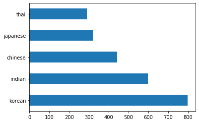
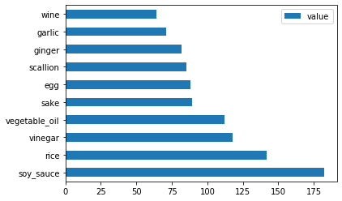

<!--
CO_OP_TRANSLATOR_METADATA:
{
  "original_hash": "76438ce4e5d48982d48f1b55c981caac",
  "translation_date": "2025-08-29T21:50:57+00:00",
  "source_file": "4-Classification/1-Introduction/README.md",
  "language_code": "bn"
}
-->
# শ্রেণীবিভাগের পরিচিতি

এই চারটি পাঠে, আপনি ক্লাসিক মেশিন লার্নিং-এর একটি মৌলিক দিক - _শ্রেণীবিভাগ_ অন্বেষণ করবেন। আমরা এশিয়া এবং ভারতের অসাধারণ রান্নার একটি ডেটাসেট ব্যবহার করে বিভিন্ন শ্রেণীবিভাগ অ্যালগরিদমের সাথে কাজ করব। আশা করি আপনি ক্ষুধার্ত!


> এই পাঠে প্যান-এশিয়ান রান্নার উদযাপন করুন! ছবি: [Jen Looper](https://twitter.com/jenlooper)

শ্রেণীবিভাগ [supervised learning](https://wikipedia.org/wiki/Supervised_learning)-এর একটি রূপ, যা রিগ্রেশন কৌশলের সাথে অনেক মিল রাখে। যদি মেশিন লার্নিং ডেটাসেট ব্যবহার করে মান বা নাম পূর্বাভাস দেওয়ার বিষয়ে হয়, তবে শ্রেণীবিভাগ সাধারণত দুটি গ্রুপে বিভক্ত হয়: _বাইনারি শ্রেণীবিভাগ_ এবং _মাল্টিক্লাস শ্রেণীবিভাগ_।

[](https://youtu.be/eg8DJYwdMyg "শ্রেণীবিভাগের পরিচিতি")

> 🎥 উপরের ছবিতে ক্লিক করুন একটি ভিডিওর জন্য: MIT-এর John Guttag শ্রেণীবিভাগের পরিচিতি দিচ্ছেন

মনে রাখুন:

- **লিনিয়ার রিগ্রেশন** আপনাকে ভেরিয়েবলের মধ্যে সম্পর্ক পূর্বাভাস দিতে এবং একটি নতুন ডেটাপয়েন্ট সেই লাইনের সাথে সম্পর্কিত কোথায় পড়বে তা সঠিকভাবে পূর্বাভাস দিতে সাহায্য করেছিল। উদাহরণস্বরূপ, আপনি পূর্বাভাস দিতে পারতেন _সেপ্টেম্বর বনাম ডিসেম্বর মাসে একটি কুমড়ার দাম কত হবে_।
- **লজিস্টিক রিগ্রেশন** আপনাকে "বাইনারি ক্যাটাগরি" আবিষ্কার করতে সাহায্য করেছিল: এই দামের পয়েন্টে, _এই কুমড়া কমলা রঙের নাকি কমলা নয়_?

শ্রেণীবিভাগ বিভিন্ন অ্যালগরিদম ব্যবহার করে একটি ডেটাপয়েন্টের লেবেল বা শ্রেণী নির্ধারণের অন্যান্য উপায় নির্ধারণ করে। আসুন এই রান্নার ডেটা নিয়ে কাজ করি এবং দেখি, উপাদানগুলোর একটি গ্রুপ পর্যবেক্ষণ করে, আমরা এর উৎসের রান্না নির্ধারণ করতে পারি কিনা।

## [পাঠ-পূর্ব কুইজ](https://gray-sand-07a10f403.1.azurestaticapps.net/quiz/19/)

> ### [এই পাঠটি R-এ উপলব্ধ!](../../../../4-Classification/1-Introduction/solution/R/lesson_10.html)

### পরিচিতি

শ্রেণীবিভাগ মেশিন লার্নিং গবেষক এবং ডেটা বিজ্ঞানীদের একটি মৌলিক কার্যকলাপ। একটি বাইনারি মানের মৌলিক শ্রেণীবিভাগ থেকে ("এই ইমেলটি স্প্যাম কিনা?"), জটিল ইমেজ শ্রেণীবিভাগ এবং কম্পিউটার ভিশন ব্যবহার করে সেগমেন্টেশন পর্যন্ত, ডেটাকে শ্রেণীতে সাজানো এবং এর উপর প্রশ্ন করা সবসময়ই উপকারী।

বৈজ্ঞানিকভাবে প্রক্রিয়াটি ব্যাখ্যা করতে গেলে, আপনার শ্রেণীবিভাগ পদ্ধতি একটি প্রেডিক্টিভ মডেল তৈরি করে যা ইনপুট ভেরিয়েবলের সাথে আউটপুট ভেরিয়েবলের সম্পর্ক ম্যাপ করতে সক্ষম করে।


> শ্রেণীবিভাগ অ্যালগরিদমের জন্য বাইনারি বনাম মাল্টিক্লাস সমস্যা। ইনফোগ্রাফিক: [Jen Looper](https://twitter.com/jenlooper)

আমাদের ডেটা পরিষ্কার করা, ভিজ্যুয়ালাইজ করা এবং মেশিন লার্নিং কাজের জন্য প্রস্তুত করার প্রক্রিয়া শুরু করার আগে, আসুন শিখি কীভাবে মেশিন লার্নিং ডেটা শ্রেণীবদ্ধ করতে ব্যবহার করা যায়।

[পরিসংখ্যান](https://wikipedia.org/wiki/Statistical_classification) থেকে উদ্ভূত, ক্লাসিক মেশিন লার্নিং ব্যবহার করে শ্রেণীবিভাগ বৈশিষ্ট্য ব্যবহার করে, যেমন `smoker`, `weight`, এবং `age` _কোনো রোগ হওয়ার সম্ভাবনা_ নির্ধারণ করতে। এটি একটি সুপারভাইজড লার্নিং কৌশল যা আপনি পূর্বে সম্পাদিত রিগ্রেশন অনুশীলনের অনুরূপ। আপনার ডেটা লেবেলযুক্ত এবং মেশিন লার্নিং অ্যালগরিদম সেই লেবেলগুলি ব্যবহার করে ডেটাসেটের শ্রেণী (বা 'ফিচার') শ্রেণীবদ্ধ এবং পূর্বাভাস দেয় এবং সেগুলিকে একটি গ্রুপ বা ফলাফলে বরাদ্দ করে।

✅ একটি রান্নার ডেটাসেট কল্পনা করার জন্য এক মুহূর্ত সময় নিন। একটি মাল্টিক্লাস মডেল কী উত্তর দিতে পারবে? একটি বাইনারি মডেল কী উত্তর দিতে পারবে? যদি আপনি নির্ধারণ করতে চান যে একটি নির্দিষ্ট রান্নায় মেথি ব্যবহার করার সম্ভাবনা আছে কিনা? যদি আপনি দেখতে চান যে, একটি মুদির ব্যাগে তারকা মৌরি, আর্টিচোক, ফুলকপি এবং হর্সর‍্যাডিশ থাকলে, আপনি একটি সাধারণ ভারতীয় খাবার তৈরি করতে পারবেন কিনা?

[](https://youtu.be/GuTeDbaNoEU "পাগল রহস্যের ঝুড়ি")

> 🎥 উপরের ছবিতে ক্লিক করুন একটি ভিডিওর জন্য। 'Chopped' শো-এর পুরো ভিত্তি হলো 'মিস্ট্রি বাস্কেট', যেখানে শেফদের একটি এলোমেলো উপাদান দিয়ে একটি খাবার তৈরি করতে হয়। নিশ্চিতভাবেই একটি মেশিন লার্নিং মডেল সাহায্য করত!

## হ্যালো 'ক্লাসিফায়ার'

আমরা এই রান্নার ডেটাসেট থেকে যে প্রশ্নটি করতে চাই তা আসলে একটি **মাল্টিক্লাস প্রশ্ন**, কারণ আমাদের কাজ করার জন্য বেশ কয়েকটি সম্ভাব্য জাতীয় রান্না রয়েছে। একটি উপাদানের ব্যাচ দেওয়া হলে, এই অনেক শ্রেণীর মধ্যে কোনটিতে ডেটা ফিট করবে?

Scikit-learn বিভিন্ন ধরনের অ্যালগরিদম অফার করে যা আপনি ডেটা শ্রেণীবদ্ধ করতে ব্যবহার করতে পারেন, এটি নির্ভর করে আপনি কী ধরনের সমস্যা সমাধান করতে চান তার উপর। পরবর্তী দুটি পাঠে, আপনি এই অ্যালগরিদমগুলোর কয়েকটি সম্পর্কে শিখবেন।

## অনুশীলন - আপনার ডেটা পরিষ্কার এবং ভারসাম্যপূর্ণ করুন

প্রকল্পটি শুরু করার আগে প্রথম কাজটি হলো আপনার ডেটা পরিষ্কার এবং **ভারসাম্যপূর্ণ** করা যাতে আরও ভালো ফলাফল পাওয়া যায়। এই ফোল্ডারের মূল অংশে থাকা _notebook.ipynb_ ফাইল দিয়ে শুরু করুন।

প্রথমে ইনস্টল করুন [imblearn](https://imbalanced-learn.org/stable/)। এটি একটি Scikit-learn প্যাকেজ যা আপনাকে ডেটা আরও ভালোভাবে ভারসাম্যপূর্ণ করতে সাহায্য করবে (আপনি এই কাজ সম্পর্কে একটু পরে আরও শিখবেন)।

1. `imblearn` ইনস্টল করতে, `pip install` চালান, যেমন:

    ```python
    pip install imblearn
    ```

1. আপনার ডেটা আমদানি এবং ভিজ্যুয়ালাইজ করার জন্য প্রয়োজনীয় প্যাকেজ আমদানি করুন, এছাড়াও `imblearn` থেকে `SMOTE` আমদানি করুন।

    ```python
    import pandas as pd
    import matplotlib.pyplot as plt
    import matplotlib as mpl
    import numpy as np
    from imblearn.over_sampling import SMOTE
    ```

    এখন আপনি ডেটা আমদানি করার জন্য প্রস্তুত।

1. পরবর্তী কাজটি হলো ডেটা আমদানি করা:

    ```python
    df  = pd.read_csv('../data/cuisines.csv')
    ```

   `read_csv()` ব্যবহার করে _cusines.csv_ ফাইলের বিষয়বস্তু পড়ুন এবং এটি `df` ভেরিয়েবলে রাখুন।

1. ডেটার আকার পরীক্ষা করুন:

    ```python
    df.head()
    ```

   প্রথম পাঁচটি সারি দেখতে এরকম:

    ```output
    |     | Unnamed: 0 | cuisine | almond | angelica | anise | anise_seed | apple | apple_brandy | apricot | armagnac | ... | whiskey | white_bread | white_wine | whole_grain_wheat_flour | wine | wood | yam | yeast | yogurt | zucchini |
    | --- | ---------- | ------- | ------ | -------- | ----- | ---------- | ----- | ------------ | ------- | -------- | --- | ------- | ----------- | ---------- | ----------------------- | ---- | ---- | --- | ----- | ------ | -------- |
    | 0   | 65         | indian  | 0      | 0        | 0     | 0          | 0     | 0            | 0       | 0        | ... | 0       | 0           | 0          | 0                       | 0    | 0    | 0   | 0     | 0      | 0        |
    | 1   | 66         | indian  | 1      | 0        | 0     | 0          | 0     | 0            | 0       | 0        | ... | 0       | 0           | 0          | 0                       | 0    | 0    | 0   | 0     | 0      | 0        |
    | 2   | 67         | indian  | 0      | 0        | 0     | 0          | 0     | 0            | 0       | 0        | ... | 0       | 0           | 0          | 0                       | 0    | 0    | 0   | 0     | 0      | 0        |
    | 3   | 68         | indian  | 0      | 0        | 0     | 0          | 0     | 0            | 0       | 0        | ... | 0       | 0           | 0          | 0                       | 0    | 0    | 0   | 0     | 0      | 0        |
    | 4   | 69         | indian  | 0      | 0        | 0     | 0          | 0     | 0            | 0       | 0        | ... | 0       | 0           | 0          | 0                       | 0    | 0    | 0   | 0     | 1      | 0        |
    ```

1. `info()` কল করে এই ডেটা সম্পর্কে তথ্য পান:

    ```python
    df.info()
    ```

    আপনার আউটপুট এরকম দেখাবে:

    ```output
    <class 'pandas.core.frame.DataFrame'>
    RangeIndex: 2448 entries, 0 to 2447
    Columns: 385 entries, Unnamed: 0 to zucchini
    dtypes: int64(384), object(1)
    memory usage: 7.2+ MB
    ```

## অনুশীলন - রান্না সম্পর্কে শেখা

এখন কাজ আরও আকর্ষণীয় হয়ে উঠছে। আসুন ডেটার বণ্টন আবিষ্কার করি, রান্না অনুযায়ী।

1. `barh()` কল করে ডেটা বার আকারে প্লট করুন:

    ```python
    df.cuisine.value_counts().plot.barh()
    ```

    

    রান্নার সংখ্যা সীমিত, কিন্তু ডেটার বণ্টন অসম। আপনি এটি ঠিক করতে পারেন! তবে তার আগে আরও একটু অন্বেষণ করুন।

1. রান্না অনুযায়ী কত ডেটা উপলব্ধ তা খুঁজে বের করুন এবং এটি প্রিন্ট করুন:

    ```python
    thai_df = df[(df.cuisine == "thai")]
    japanese_df = df[(df.cuisine == "japanese")]
    chinese_df = df[(df.cuisine == "chinese")]
    indian_df = df[(df.cuisine == "indian")]
    korean_df = df[(df.cuisine == "korean")]
    
    print(f'thai df: {thai_df.shape}')
    print(f'japanese df: {japanese_df.shape}')
    print(f'chinese df: {chinese_df.shape}')
    print(f'indian df: {indian_df.shape}')
    print(f'korean df: {korean_df.shape}')
    ```

    আউটপুট এরকম দেখাবে:

    ```output
    thai df: (289, 385)
    japanese df: (320, 385)
    chinese df: (442, 385)
    indian df: (598, 385)
    korean df: (799, 385)
    ```

## উপাদান আবিষ্কার

এখন আপনি ডেটার গভীরে যেতে পারেন এবং জানতে পারেন প্রতিটি রান্নার জন্য সাধারণ উপাদান কী। বিভ্রান্তি তৈরি করে এমন পুনরাবৃত্ত উপাদানগুলো পরিষ্কার করুন, তাই আসুন এই সমস্যাটি সম্পর্কে শিখি।

1. একটি ফাংশন `create_ingredient()` তৈরি করুন যা একটি উপাদান ডেটাফ্রেম তৈরি করবে। এই ফাংশনটি একটি অপ্রয়োজনীয় কলাম বাদ দিয়ে উপাদানগুলো তাদের গণনা অনুযায়ী সাজাবে:

    ```python
    def create_ingredient_df(df):
        ingredient_df = df.T.drop(['cuisine','Unnamed: 0']).sum(axis=1).to_frame('value')
        ingredient_df = ingredient_df[(ingredient_df.T != 0).any()]
        ingredient_df = ingredient_df.sort_values(by='value', ascending=False,
        inplace=False)
        return ingredient_df
    ```

   এখন আপনি এই ফাংশনটি ব্যবহার করে রান্না অনুযায়ী শীর্ষ দশটি জনপ্রিয় উপাদানের ধারণা পেতে পারেন।

1. `create_ingredient()` কল করুন এবং `barh()` কল করে এটি প্লট করুন:

    ```python
    thai_ingredient_df = create_ingredient_df(thai_df)
    thai_ingredient_df.head(10).plot.barh()
    ```

    

1. জাপানি ডেটার জন্য একই কাজ করুন:

    ```python
    japanese_ingredient_df = create_ingredient_df(japanese_df)
    japanese_ingredient_df.head(10).plot.barh()
    ```

    

1. এবার চীনা উপাদানগুলো প্লট করুন:

    ```python
    chinese_ingredient_df = create_ingredient_df(chinese_df)
    chinese_ingredient_df.head(10).plot.barh()
    ```

    

1. ভারতীয় উপাদানগুলো প্লট করুন:

    ```python
    indian_ingredient_df = create_ingredient_df(indian_df)
    indian_ingredient_df.head(10).plot.barh()
    ```

    

1. অবশেষে, কোরিয়ান উপাদানগুলো প্লট করুন:

    ```python
    korean_ingredient_df = create_ingredient_df(korean_df)
    korean_ingredient_df.head(10).plot.barh()
    ```

    

1. এখন, `drop()` কল করে বিভিন্ন রান্নার মধ্যে বিভ্রান্তি তৈরি করে এমন সবচেয়ে সাধারণ উপাদানগুলো বাদ দিন:

   সবাই ভাত, রসুন এবং আদা পছন্দ করে!

    ```python
    feature_df= df.drop(['cuisine','Unnamed: 0','rice','garlic','ginger'], axis=1)
    labels_df = df.cuisine #.unique()
    feature_df.head()
    ```

## ডেটাসেট ভারসাম্যপূর্ণ করুন

এখন যেহেতু আপনি ডেটা পরিষ্কার করেছেন, [SMOTE](https://imbalanced-learn.org/dev/references/generated/imblearn.over_sampling.SMOTE.html) - "Synthetic Minority Over-sampling Technique" ব্যবহার করে এটি ভারসাম্যপূর্ণ করুন।

1. `fit_resample()` কল করুন, এই কৌশলটি ইন্টারপোলেশনের মাধ্যমে নতুন নমুনা তৈরি করে।

    ```python
    oversample = SMOTE()
    transformed_feature_df, transformed_label_df = oversample.fit_resample(feature_df, labels_df)
    ```

    ডেটা ভারসাম্যপূর্ণ করার মাধ্যমে, আপনি এটি শ্রেণীবিভাগ করার সময় আরও ভালো ফলাফল পাবেন। একটি বাইনারি শ্রেণীবিভাগের কথা ভাবুন। যদি আপনার বেশিরভাগ ডেটা একটি শ্রেণীর হয়, একটি মেশিন লার্নিং মডেল সেই শ্রেণীটি আরও ঘন ঘন পূর্বাভাস দেবে, শুধুমাত্র কারণ এর জন্য আরও ডেটা রয়েছে। ডেটা ভারসাম্যপূর্ণ করা যেকোনো পক্ষপাত দূর করতে সাহায্য করে।

1. এখন আপনি উপাদান অনুযায়ী লেবেলের সংখ্যা পরীক্ষা করতে পারেন:

    ```python
    print(f'new label count: {transformed_label_df.value_counts()}')
    print(f'old label count: {df.cuisine.value_counts()}')
    ```

    আপনার আউটপুট এরকম দেখাবে:

    ```output
    new label count: korean      799
    chinese     799
    indian      799
    japanese    799
    thai        799
    Name: cuisine, dtype: int64
    old label count: korean      799
    indian      598
    chinese     442
    japanese    320
    thai        289
    Name: cuisine, dtype: int64
    ```

    ডেটা সুন্দর এবং পরিষ্কার, ভারসাম্যপূর্ণ এবং খুবই সুস্বাদু!

1. শেষ ধাপ হলো আপনার ভারসাম্যপূর্ণ ডেটা, লেবেল এবং বৈশিষ্ট্যসহ, একটি নতুন ডেটাফ্রেমে সংরক্ষণ করা যা একটি ফাইলে রপ্তানি করা যেতে পারে:

    ```python
    transformed_df = pd.concat([transformed_label_df,transformed_feature_df],axis=1, join='outer')
    ```

1. `transformed_df.head()` এবং `transformed_df.info()` ব্যবহার করে ডেটার দিকে একবার তাকান। ভবিষ্যতের পাঠে ব্যবহারের জন্য এই ডেটার একটি কপি সংরক্ষণ করুন:

    ```python
    transformed_df.head()
    transformed_df.info()
    transformed_df.to_csv("../data/cleaned_cuisines.csv")
    ```

    এই নতুন CSV এখন মূল ডেটা ফোল্ডারে পাওয়া যাবে।

---

## 🚀চ্যালেঞ্জ

এই কারিকুলামে বেশ কয়েকটি আকর্ষণীয় ডেটাসেট রয়েছে। `data` ফোল্ডারগুলো ঘেঁটে দেখুন, কোনো ডেটাসেট কি বাইনারি বা মাল্টিক্লাস শ্রেণীবিভাগের জন্য উপযুক্ত? আপনি এই ডেটাসেট থেকে কী প্রশ্ন করবেন?

## [পাঠ-পরবর্তী কুইজ](https://gray-sand-07a10f403.1.azurestaticapps.net/quiz/20/)

## পর্যালোচনা ও স্ব-অধ্যয়ন

SMOTE-এর API অন্বেষণ করুন। এটি কোন ব্যবহার ক্ষেত্রে সবচেয়ে ভালোভাবে ব্যবহৃত হয়? এটি কোন সমস্যাগুলো সমাধান করে?

## অ্যাসাইনমেন্ট 

[শ্রেণীবিভাগ পদ্ধতি অন্বেষণ করুন](assignment.md)

---

**অস্বীকৃতি**:  
এই নথিটি AI অনুবাদ পরিষেবা [Co-op Translator](https://github.com/Azure/co-op-translator) ব্যবহার করে অনুবাদ করা হয়েছে। আমরা যথাসম্ভব সঠিক অনুবাদ প্রদানের চেষ্টা করি, তবে অনুগ্রহ করে মনে রাখবেন যে স্বয়ংক্রিয় অনুবাদে ত্রুটি বা অসঙ্গতি থাকতে পারে। মূল ভাষায় থাকা নথিটিকে প্রামাণিক উৎস হিসেবে বিবেচনা করা উচিত। গুরুত্বপূর্ণ তথ্যের জন্য, পেশাদার মানব অনুবাদ সুপারিশ করা হয়। এই অনুবাদ ব্যবহারের ফলে কোনো ভুল বোঝাবুঝি বা ভুল ব্যাখ্যা হলে আমরা দায়বদ্ধ থাকব না।