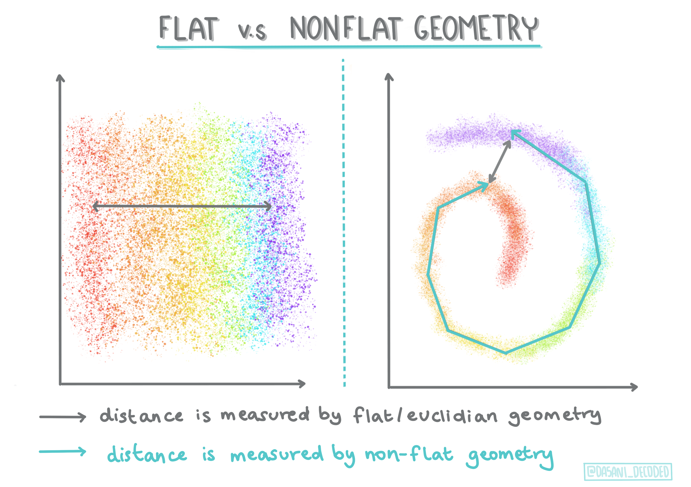
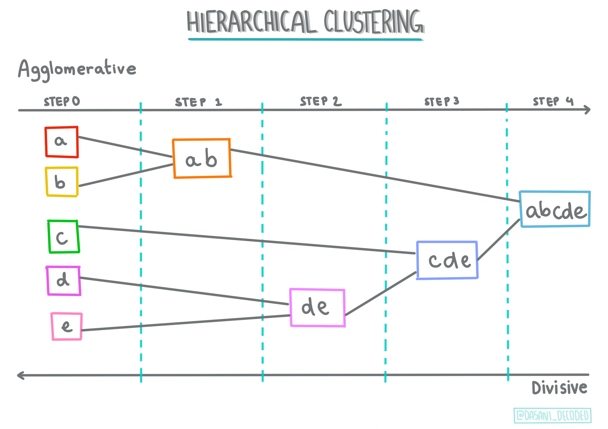
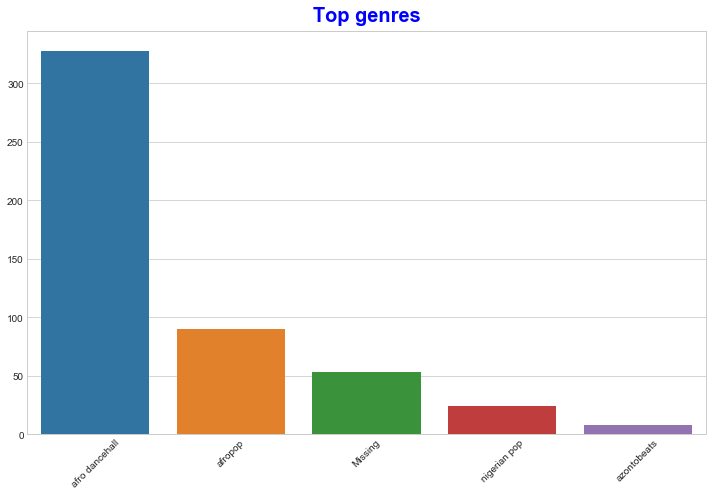

<!--
CO_OP_TRANSLATOR_METADATA:
{
  "original_hash": "0ab69b161efd7a41d325ee28b29415d7",
  "translation_date": "2025-08-29T20:54:13+00:00",
  "source_file": "5-Clustering/1-Visualize/README.md",
  "language_code": "bn"
}
-->
# ক্লাস্টারিং-এর পরিচিতি

ক্লাস্টারিং হলো [অপরিচালিত শিক্ষণ](https://wikipedia.org/wiki/Unsupervised_learning)-এর একটি ধরণ, যেখানে ধরে নেওয়া হয় যে একটি ডেটাসেট লেবেলবিহীন বা এর ইনপুট পূর্বনির্ধারিত আউটপুটের সাথে মেলানো হয়নি। এটি বিভিন্ন অ্যালগরিদম ব্যবহার করে লেবেলবিহীন ডেটা বিশ্লেষণ করে এবং ডেটায় পাওয়া প্যাটার্ন অনুযায়ী গ্রুপিং প্রদান করে। 

[](https://youtu.be/ty2advRiWJM "PSquare-এর 'No One Like You'")

> 🎥 উপরের ছবিতে ক্লিক করুন একটি ভিডিও দেখার জন্য। ক্লাস্টারিং-এর মাধ্যমে মেশিন লার্নিং শিখতে শিখতে কিছু নাইজেরিয়ান ডান্স হল ট্র্যাক উপভোগ করুন - এটি PSquare-এর ২০১৪ সালের একটি জনপ্রিয় গান।

## [পূর্ব-লেকচার কুইজ](https://gray-sand-07a10f403.1.azurestaticapps.net/quiz/27/)

### পরিচিতি

[ক্লাস্টারিং](https://link.springer.com/referenceworkentry/10.1007%2F978-0-387-30164-8_124) ডেটা এক্সপ্লোরেশনের জন্য অত্যন্ত কার্যকর। দেখা যাক এটি নাইজেরিয়ান শ্রোতারা কীভাবে সঙ্গীত গ্রহণ করেন তার প্রবণতা এবং প্যাটার্ন আবিষ্কার করতে সাহায্য করতে পারে কিনা।

✅ এক মিনিট সময় নিয়ে ক্লাস্টারিং-এর ব্যবহার সম্পর্কে ভাবুন। বাস্তব জীবনে, ক্লাস্টারিং ঘটে যখন আপনার কাছে একটি লন্ড্রির স্তূপ থাকে এবং আপনাকে পরিবারের সদস্যদের কাপড় আলাদা করতে হয় 🧦👕👖🩲। ডেটা সায়েন্সে, ক্লাস্টারিং ঘটে যখন ব্যবহারকারীর পছন্দ বিশ্লেষণ করতে হয় বা কোনো লেবেলবিহীন ডেটাসেটের বৈশিষ্ট্য নির্ধারণ করতে হয়। একভাবে, ক্লাস্টারিং বিশৃঙ্খলার মধ্যে অর্থ খুঁজে পেতে সাহায্য করে, যেমন একটি মোজা রাখার ড্রয়ার।

[](https://youtu.be/esmzYhuFnds "ক্লাস্টারিং-এর পরিচিতি")

> 🎥 উপরের ছবিতে ক্লিক করুন একটি ভিডিও দেখার জন্য: MIT-এর জন গুটটাগ ক্লাস্টারিং-এর পরিচিতি দিচ্ছেন।

পেশাদার ক্ষেত্রে, ক্লাস্টারিং ব্যবহার করা যেতে পারে যেমন বাজার বিভাজন নির্ধারণ করা, উদাহরণস্বরূপ কোন বয়সের গ্রুপ কী ধরনের পণ্য কিনছে তা নির্ধারণ করা। আরেকটি ব্যবহার হতে পারে অস্বাভাবিকতা সনাক্তকরণ, যেমন ক্রেডিট কার্ড লেনদেনের ডেটাসেট থেকে জালিয়াতি সনাক্ত করা। অথবা আপনি এটি ব্যবহার করতে পারেন মেডিকেল স্ক্যানের একটি ব্যাচ থেকে টিউমার নির্ধারণ করতে।

✅ এক মিনিট সময় নিয়ে ভাবুন, আপনি কীভাবে 'প্রকৃত জীবনে' ক্লাস্টারিং-এর মুখোমুখি হয়েছেন, যেমন ব্যাংকিং, ই-কমার্স, বা ব্যবসায়িক ক্ষেত্রে।

> 🎓 মজার বিষয় হলো, ক্লাস্টার বিশ্লেষণ ১৯৩০-এর দশকে নৃতত্ত্ব এবং মনোবিজ্ঞানের ক্ষেত্রে উদ্ভূত হয়েছিল। কল্পনা করুন এটি কীভাবে ব্যবহার করা হতে পারে?

অন্যভাবে, আপনি এটি অনুসন্ধান ফলাফল গ্রুপ করার জন্য ব্যবহার করতে পারেন - যেমন কেনাকাটার লিঙ্ক, ছবি, বা রিভিউ। ক্লাস্টারিং কার্যকর যখন আপনার কাছে একটি বড় ডেটাসেট থাকে যা আপনি হ্রাস করতে চান এবং যার উপর আরও বিশদ বিশ্লেষণ করতে চান, তাই এই কৌশলটি অন্যান্য মডেল তৈরি করার আগে ডেটা সম্পর্কে জানার জন্য ব্যবহার করা যেতে পারে।

✅ একবার আপনার ডেটা ক্লাস্টারে সংগঠিত হলে, আপনি এটিকে একটি ক্লাস্টার আইডি বরাদ্দ করেন, এবং এই কৌশলটি একটি ডেটাসেটের গোপনীয়তা সংরক্ষণে কার্যকর হতে পারে; আপনি ক্লাস্টারের অন্যান্য উপাদানের পরিবর্তে একটি ডেটা পয়েন্টকে তার ক্লাস্টার আইডি দ্বারা উল্লেখ করতে পারেন। আপনি কি অন্য কোনো কারণ ভাবতে পারেন কেন আপনি ক্লাস্টার আইডি ব্যবহার করবেন ক্লাস্টারের অন্যান্য উপাদানের পরিবর্তে এটি চিহ্নিত করতে?

ক্লাস্টারিং কৌশল সম্পর্কে আপনার বোঝাপড়া বাড়ান এই [শিক্ষণ মডিউল](https://docs.microsoft.com/learn/modules/train-evaluate-cluster-models?WT.mc_id=academic-77952-leestott)-এ।

## ক্লাস্টারিং শুরু করা

[Scikit-learn একটি বড় পরিসরের](https://scikit-learn.org/stable/modules/clustering.html) পদ্ধতি প্রদান করে ক্লাস্টারিং সম্পাদনের জন্য। আপনি কোনটি বেছে নেবেন তা নির্ভর করবে আপনার ব্যবহারের ক্ষেত্রে। ডকুমেন্টেশন অনুযায়ী, প্রতিটি পদ্ধতির বিভিন্ন সুবিধা রয়েছে। এখানে Scikit-learn দ্বারা সমর্থিত পদ্ধতিগুলির একটি সরলীকৃত টেবিল এবং তাদের উপযুক্ত ব্যবহারের ক্ষেত্র দেওয়া হলো:

| পদ্ধতির নাম                  | ব্যবহারের ক্ষেত্র                                                      |
| :--------------------------- | :--------------------------------------------------------------------- |
| K-Means                      | সাধারণ উদ্দেশ্য, ইনডাকটিভ                                             |
| Affinity propagation         | অনেক, অসম ক্লাস্টার, ইনডাকটিভ                                         |
| Mean-shift                   | অনেক, অসম ক্লাস্টার, ইনডাকটিভ                                         |
| Spectral clustering          | কম, সমান ক্লাস্টার, ট্রান্সডাকটিভ                                      |
| Ward hierarchical clustering | অনেক, সীমাবদ্ধ ক্লাস্টার, ট্রান্সডাকটিভ                                |
| Agglomerative clustering     | অনেক, সীমাবদ্ধ, অ-ইউক্লিডিয়ান দূরত্ব, ট্রান্সডাকটিভ                  |
| DBSCAN                       | অ-সমতল জ্যামিতি, অসম ক্লাস্টার, ট্রান্সডাকটিভ                         |
| OPTICS                       | অ-সমতল জ্যামিতি, অসম ক্লাস্টার ভেরিয়েবল ঘনত্ব সহ, ট্রান্সডাকটিভ     |
| Gaussian mixtures            | সমতল জ্যামিতি, ইনডাকটিভ                                              |
| BIRCH                        | বড় ডেটাসেট আউটলাইয়ার সহ, ইনডাকটিভ                                   |

> 🎓 আমরা কীভাবে ক্লাস্টার তৈরি করি তা অনেকাংশে নির্ভর করে কীভাবে আমরা ডেটা পয়েন্টগুলোকে গ্রুপে একত্র করি। চলুন কিছু শব্দভাণ্ডার বিশ্লেষণ করি:
>
> 🎓 ['ট্রান্সডাকটিভ' বনাম 'ইনডাকটিভ'](https://wikipedia.org/wiki/Transduction_(machine_learning))
> 
> ট্রান্সডাকটিভ ইনফারেন্স পর্যবেক্ষণকৃত প্রশিক্ষণ কেস থেকে নির্ধারিত হয় যা নির্দিষ্ট টেস্ট কেসের সাথে মানানসই। ইনডাকটিভ ইনফারেন্স প্রশিক্ষণ কেস থেকে নির্ধারিত হয় যা সাধারণ নিয়মে মানানসই হয় এবং তারপর টেস্ট কেসে প্রয়োগ করা হয়। 
> 
> উদাহরণ: কল্পনা করুন আপনার কাছে একটি ডেটাসেট রয়েছে যা আংশিকভাবে লেবেলযুক্ত। কিছু জিনিস 'রেকর্ড', কিছু 'সিডি', এবং কিছু ফাঁকা। আপনার কাজ হলো ফাঁকা জিনিসগুলোর জন্য লেবেল প্রদান করা। যদি আপনি ইনডাকটিভ পদ্ধতি বেছে নেন, আপনি 'রেকর্ড' এবং 'সিডি' খুঁজে বের করার জন্য একটি মডেল প্রশিক্ষণ দেবেন এবং সেই লেবেলগুলো আপনার লেবেলবিহীন ডেটায় প্রয়োগ করবেন। এই পদ্ধতিটি এমন জিনিস শ্রেণীবদ্ধ করতে সমস্যায় পড়বে যা আসলে 'ক্যাসেট'। অন্যদিকে, একটি ট্রান্সডাকটিভ পদ্ধতি এই অজানা ডেটা আরও কার্যকরভাবে পরিচালনা করে কারণ এটি একই ধরনের আইটেমগুলোকে একত্রিত করার জন্য কাজ করে এবং তারপর একটি গ্রুপে লেবেল প্রয়োগ করে। 
> 
> 🎓 ['অ-সমতল' বনাম 'সমতল' জ্যামিতি](https://datascience.stackexchange.com/questions/52260/terminology-flat-geometry-in-the-context-of-clustering)
> 
> গণিতের পরিভাষা থেকে উদ্ভূত, অ-সমতল বনাম সমতল জ্যামিতি পয়েন্টগুলোর মধ্যে দূরত্ব পরিমাপের পদ্ধতি বোঝায়, যা হয় 'সমতল' ([ইউক্লিডিয়ান](https://wikipedia.org/wiki/Euclidean_geometry)) বা 'অ-সমতল' (অ-ইউক্লিডিয়ান) জ্যামিতিক পদ্ধতিতে হয়। 
>
>'সমতল' এই প্রসঙ্গে ইউক্লিডিয়ান জ্যামিতিকে বোঝায় (যার কিছু অংশ 'প্লেন' জ্যামিতি হিসেবে শেখানো হয়), এবং অ-সমতল বোঝায় অ-ইউক্লিডিয়ান জ্যামিতি। মেশিন লার্নিং-এর সাথে জ্যামিতির কী সম্পর্ক? যেহেতু দুটি ক্ষেত্রই গণিতের উপর ভিত্তি করে, পয়েন্টগুলোর মধ্যে দূরত্ব পরিমাপের একটি সাধারণ উপায় থাকতে হবে, এবং এটি ডেটার প্রকৃতির উপর নির্ভর করে 'সমতল' বা 'অ-সমতল' পদ্ধতিতে করা যেতে পারে। [ইউক্লিডিয়ান দূরত্ব](https://wikipedia.org/wiki/Euclidean_distance) পরিমাপ করা হয় দুটি পয়েন্টের মধ্যে একটি রেখা খণ্ডের দৈর্ঘ্য হিসাবে। [অ-ইউক্লিডিয়ান দূরত্ব](https://wikipedia.org/wiki/Non-Euclidean_geometry) একটি বক্ররেখা বরাবর পরিমাপ করা হয়। যদি আপনার ডেটা, ভিজ্যুয়ালাইজড, একটি প্লেনে বিদ্যমান না থাকে, তবে এটি পরিচালনা করার জন্য একটি বিশেষ অ্যালগরিদম ব্যবহার করা প্রয়োজন হতে পারে।
>

> ইনফোগ্রাফিক: [দাসানি মাদিপল্লি](https://twitter.com/dasani_decoded)
> 
> 🎓 ['দূরত্ব'](https://web.stanford.edu/class/cs345a/slides/12-clustering.pdf)
> 
> ক্লাস্টারগুলো তাদের দূরত্ব ম্যাট্রিক্স দ্বারা সংজ্ঞায়িত হয়, যেমন পয়েন্টগুলোর মধ্যে দূরত্ব। এই দূরত্ব কয়েকটি উপায়ে পরিমাপ করা যেতে পারে। ইউক্লিডিয়ান ক্লাস্টারগুলো পয়েন্ট মানগুলোর গড় দ্বারা সংজ্ঞায়িত হয়, এবং একটি 'সেন্ট্রয়েড' বা কেন্দ্র বিন্দু থাকে। দূরত্বগুলো সেই সেন্ট্রয়েড থেকে দূরত্ব দ্বারা পরিমাপ করা হয়। অ-ইউক্লিডিয়ান দূরত্ব 'ক্লাস্ট্রয়েড' বোঝায়, যা অন্যান্য পয়েন্টের নিকটতম বিন্দু। ক্লাস্ট্রয়েড বিভিন্ন উপায়ে সংজ্ঞায়িত করা যেতে পারে।
> 
> 🎓 ['সীমাবদ্ধ'](https://wikipedia.org/wiki/Constrained_clustering)
> 
> [সীমাবদ্ধ ক্লাস্টারিং](https://web.cs.ucdavis.edu/~davidson/Publications/ICDMTutorial.pdf) এই অপরিচালিত পদ্ধতিতে 'আংশিক-পরিচালিত' শিক্ষণ প্রবর্তন করে। পয়েন্টগুলোর মধ্যে সম্পর্ক 'লিঙ্ক করা যাবে না' বা 'লিঙ্ক করতে হবে' হিসাবে চিহ্নিত করা হয়, তাই ডেটাসেটে কিছু নিয়ম আরোপ করা হয়।
>
> উদাহরণ: যদি একটি অ্যালগরিদমকে একটি লেবেলবিহীন বা আংশিক-লেবেলযুক্ত ডেটার ব্যাচে মুক্ত করা হয়, এটি যে ক্লাস্টার তৈরি করে তা নিম্নমানের হতে পারে। উপরের উদাহরণে, ক্লাস্টারগুলো 'গোলাকার সঙ্গীত জিনিস', 'চৌকো সঙ্গীত জিনিস', 'ত্রিভুজাকার জিনিস', এবং 'কুকি' গ্রুপ করতে পারে। যদি কিছু সীমাবদ্ধতা বা অনুসরণ করার নিয়ম দেওয়া হয় ("আইটেমটি অবশ্যই প্লাস্টিকের তৈরি হতে হবে", "আইটেমটি সঙ্গীত তৈরি করতে সক্ষম হতে হবে") এটি অ্যালগরিদমকে আরও ভাল পছন্দ করতে সাহায্য করতে পারে।
> 
> 🎓 'ঘনত্ব'
> 
> যে ডেটা 'শব্দযুক্ত' বলে বিবেচিত হয় তাকে 'ঘন' বলা হয়। প্রতিটি ক্লাস্টারের পয়েন্টগুলোর মধ্যে দূরত্ব পরীক্ষা করলে দেখা যায় যে এটি বেশি বা কম ঘন, বা 'ভিড়যুক্ত', এবং তাই এই ডেটা বিশ্লেষণ করার জন্য উপযুক্ত ক্লাস্টারিং পদ্ধতি প্রয়োজন। [এই নিবন্ধটি](https://www.kdnuggets.com/2020/02/understanding-density-based-clustering.html) একটি শব্দযুক্ত ডেটাসেটের উপর K-Means ক্লাস্টারিং বনাম HDBSCAN অ্যালগরিদম ব্যবহার করে পার্থক্য প্রদর্শন করে।

## ক্লাস্টারিং অ্যালগরিদম

ক্লাস্টারিং-এর জন্য ১০০টিরও বেশি অ্যালগরিদম রয়েছে, এবং সেগুলোর ব্যবহার নির্ভর করে ডেটার প্রকৃতির উপর। আসুন প্রধান কয়েকটি নিয়ে আলোচনা করি:

- **হায়ারার্কিকাল ক্লাস্টারিং**। যদি কোনো বস্তু তার নিকটবর্তী বস্তুর সাথে তার দূরত্বের ভিত্তিতে শ্রেণীবদ্ধ হয়, তবে ক্লাস্টারগুলো তাদের সদস্যদের অন্যান্য বস্তুর সাথে দূরত্বের ভিত্তিতে গঠিত হয়। Scikit-learn-এর agglomerative clustering হায়ারার্কিকাল।

   
   > ইনফোগ্রাফিক: [দাসানি মাদিপল্লি](https://twitter.com/dasani_decoded)

- **সেন্ট্রয়েড ক্লাস্টারিং**। এই জনপ্রিয় অ্যালগরিদমটি 'k', বা গঠিত ক্লাস্টারের সংখ্যা বেছে নেওয়ার প্রয়োজন হয়, তারপর অ্যালগরিদম একটি ক্লাস্টারের কেন্দ্র বিন্দু নির্ধারণ করে এবং সেই বিন্দুর চারপাশে ডেটা সংগ্রহ করে। [K-means ক্লাস্টারিং](https://wikipedia.org/wiki/K-means_clustering) সেন্ট্রয়েড ক্লাস্টারিং-এর একটি জনপ্রিয় সংস্করণ। কেন্দ্রটি নিকটতম গড় দ্বারা নির্ধারিত হয়, তাই এর নাম। ক্লাস্টারের বর্গ দূরত্ব হ্রাস করা হয়।

   
   > ইনফোগ্রাফিক: [দাসানি মাদিপল্লি](https://twitter.com/dasani_decoded)

- **বিতরণ-ভিত্তিক ক্লাস্টারিং**। পরিসংখ্যানগত মডেলিংয়ের উপর ভিত্তি করে, বিতরণ-ভিত্তিক ক্লাস্টারিং একটি ডেটা পয়েন্ট একটি ক্লাস্টারের অন্তর্গত হওয়ার সম্ভাবনা নির্ধারণ করে এবং সেই অনুযায়ী এটি বরাদ্দ করে। Gaussian মিশ্রণ পদ্ধতি এই ধরনের অন্তর্গত।

- **ঘনত্ব-ভিত্তিক ক্লাস্টারিং**। ডেটা পয়েন্টগুলো তাদের ঘনত্বের ভিত্তিতে ক্লাস্টারে বরাদ্দ করা হয়, বা তাদের একে অপরের চারপাশে গঠনের ভিত্তিতে। গ্রুপ থেকে দূরে থাকা ডেটা পয়েন্টগুলোকে আউটলায়ার বা শব্দ হিসাবে বিবেচনা করা হয়। DBSCAN, Mean-shift এবং OPTICS এই ধরনের ক্লাস্টারিং-এর অন্তর্গত।

- **গ্রিড-ভিত্তিক ক্লাস্টারিং**। বহু-মাত্রিক ডেটাসেটের জন্য, একটি গ্রিড তৈরি করা হয় এবং ডেটা গ্রিডের কোষগুলোর মধ্যে বিভক্ত করা হয়, ফলে ক্লাস্টার তৈরি হয়।

## অনুশীলন - আপনার ডেটা ক্লাস্টার করুন

ক্লাস্টারিং একটি কৌশল হিসেবে সঠিক ভিজ্যুয়ালাইজেশনের মাধ্যমে অনেক সাহায্য পায়, তাই আসুন আমাদের সঙ্গীত ডেটা ভিজ্যুয়ালাইজ করে শুরু করি। এই অনুশীলনটি আমাদের সিদ্ধান্ত নিতে সাহায্য করবে যে এই ডেটার প্রকৃতির জন্য কোন ক্লাস্টারিং পদ্ধতি সবচেয়ে কার্যকরভাবে ব্যবহার করা উচিত।

1. এই ফোল্ডারের [_notebook.ipynb_](https://github.com/microsoft/ML-For-Beginners/blob/main/5-Clustering/1-Visualize/notebook.ipynb) ফাইলটি খুলুন।

1. ভালো ডেটা ভিজ্যুয়ালাইজেশনের জন্য `Seaborn` প্যাকেজটি ইমপোর্ট করুন।

    ```python
    !pip install seaborn
    ```

1. [_nigerian-songs.csv_](https://github.com/microsoft/ML-For-Beginners/blob/main/5-Clustering/data/nigerian-songs.csv) থেকে গান ডেটা যোগ করুন। গানগুলোর ডেটা নিয়ে একটি ডেটাফ্রেম লোড করুন। লাইব্রেরিগুলো ইমপোর্ট করে এবং ডেটা আউটপুট করে এই ডেটা এক্সপ্লোর করার জন্য প্রস্তুত হন:

    ```python
    import matplotlib.pyplot as plt
    import pandas as pd
    
    df = pd.read_csv("../data/nigerian-songs.csv")
    df.head()
    ```

    ডেটার প্রথম কয়েকটি লাইন পরীক্ষা করুন:

    |     | নাম                     | অ্যালবাম                        | শিল্পী              | শিল্পীর শীর্ষ ঘরানা | প্রকাশের তারিখ | দৈর্ঘ্য | জনপ্রিয়তা | নাচের ক্ষমতা | অ্যাকোস্টিকনেস | শক্তি | ইন্সট্রুমেন্টালনেস | লাইভনেস | লাউ
| 2   | LITT!                    | LITT!                        | AYLØ                | indie r&b        | 2018         | 207758 | 40         | 0.836        | 0.272        | 0.564  | 0.000537         | 0.11     | -7.127   | 0.0424      | 130.005 | 4              |
| 3   | Confident / Feeling Cool | Enjoy Your Life              | Lady Donli          | nigerian pop     | 2019         | 175135 | 14         | 0.894        | 0.798        | 0.611  | 0.000187         | 0.0964   | -4.961   | 0.113       | 111.087 | 4              |
| 4   | wanted you               | rare.                        | Odunsi (The Engine) | afropop          | 2018         | 152049 | 25         | 0.702        | 0.116        | 0.833  | 0.91             | 0.348    | -6.044   | 0.0447      | 105.115 | 4              |

1. ডেটাফ্রেম সম্পর্কে কিছু তথ্য পেতে `info()` কল করুন:

    ```python
    df.info()
    ```

   আউটপুট দেখতে এরকম:

    ```output
    <class 'pandas.core.frame.DataFrame'>
    RangeIndex: 530 entries, 0 to 529
    Data columns (total 16 columns):
     #   Column            Non-Null Count  Dtype  
    ---  ------            --------------  -----  
     0   name              530 non-null    object 
     1   album             530 non-null    object 
     2   artist            530 non-null    object 
     3   artist_top_genre  530 non-null    object 
     4   release_date      530 non-null    int64  
     5   length            530 non-null    int64  
     6   popularity        530 non-null    int64  
     7   danceability      530 non-null    float64
     8   acousticness      530 non-null    float64
     9   energy            530 non-null    float64
     10  instrumentalness  530 non-null    float64
     11  liveness          530 non-null    float64
     12  loudness          530 non-null    float64
     13  speechiness       530 non-null    float64
     14  tempo             530 non-null    float64
     15  time_signature    530 non-null    int64  
    dtypes: float64(8), int64(4), object(4)
    memory usage: 66.4+ KB
    ```

1. নাল মানগুলোর জন্য ডাবল-চেক করুন, `isnull()` কল করে এবং নিশ্চিত করুন যে যোগফল 0:

    ```python
    df.isnull().sum()
    ```

    সবকিছু ঠিকঠাক:

    ```output
    name                0
    album               0
    artist              0
    artist_top_genre    0
    release_date        0
    length              0
    popularity          0
    danceability        0
    acousticness        0
    energy              0
    instrumentalness    0
    liveness            0
    loudness            0
    speechiness         0
    tempo               0
    time_signature      0
    dtype: int64
    ```

1. ডেটা বর্ণনা করুন:

    ```python
    df.describe()
    ```

    |       | release_date | length      | popularity | danceability | acousticness | energy   | instrumentalness | liveness | loudness  | speechiness | tempo      | time_signature |
    | ----- | ------------ | ----------- | ---------- | ------------ | ------------ | -------- | ---------------- | -------- | --------- | ----------- | ---------- | -------------- |
    | count | 530          | 530         | 530        | 530          | 530          | 530      | 530              | 530      | 530       | 530         | 530        | 530            |
    | mean  | 2015.390566  | 222298.1698 | 17.507547  | 0.741619     | 0.265412     | 0.760623 | 0.016305         | 0.147308 | -4.953011 | 0.130748    | 116.487864 | 3.986792       |
    | std   | 3.131688     | 39696.82226 | 18.992212  | 0.117522     | 0.208342     | 0.148533 | 0.090321         | 0.123588 | 2.464186  | 0.092939    | 23.518601  | 0.333701       |
    | min   | 1998         | 89488       | 0          | 0.255        | 0.000665     | 0.111    | 0                | 0.0283   | -19.362   | 0.0278      | 61.695     | 3              |
    | 25%   | 2014         | 199305      | 0          | 0.681        | 0.089525     | 0.669    | 0                | 0.07565  | -6.29875  | 0.0591      | 102.96125  | 4              |
    | 50%   | 2016         | 218509      | 13         | 0.761        | 0.2205       | 0.7845   | 0.000004         | 0.1035   | -4.5585   | 0.09795     | 112.7145   | 4              |
    | 75%   | 2017         | 242098.5    | 31         | 0.8295       | 0.403        | 0.87575  | 0.000234         | 0.164    | -3.331    | 0.177       | 125.03925  | 4              |
    | max   | 2020         | 511738      | 73         | 0.966        | 0.954        | 0.995    | 0.91             | 0.811    | 0.582     | 0.514       | 206.007    | 5              |

> 🤔 যদি আমরা ক্লাস্টারিং নিয়ে কাজ করি, যা একটি আনসুপারভাইজড পদ্ধতি এবং লেবেলড ডেটার প্রয়োজন হয় না, তাহলে কেন আমরা এই ডেটা লেবেলসহ দেখাচ্ছি? ডেটা এক্সপ্লোরেশনের পর্যায়ে এগুলো কাজে লাগে, কিন্তু ক্লাস্টারিং অ্যালগরিদমের কাজের জন্য এগুলো প্রয়োজনীয় নয়। আপনি চাইলে কলাম হেডারগুলো সরিয়ে দিয়ে কলাম নম্বর দিয়ে ডেটাকে উল্লেখ করতে পারেন।

ডেটার সাধারণ মানগুলো দেখুন। লক্ষ্য করুন যে জনপ্রিয়তা '0' হতে পারে, যা এমন গানগুলো দেখায় যেগুলোর কোনো র‍্যাংকিং নেই। আসুন এগুলো শীঘ্রই সরিয়ে ফেলি।

1. বারপ্লট ব্যবহার করে সবচেয়ে জনপ্রিয় ঘরানাগুলো খুঁজে বের করুন:

    ```python
    import seaborn as sns
    
    top = df['artist_top_genre'].value_counts()
    plt.figure(figsize=(10,7))
    sns.barplot(x=top[:5].index,y=top[:5].values)
    plt.xticks(rotation=45)
    plt.title('Top genres',color = 'blue')
    ```

    

✅ যদি আপনি আরও শীর্ষ মান দেখতে চান, তাহলে `[:5]`-কে বড় মানে পরিবর্তন করুন, অথবা সরিয়ে ফেলুন সব দেখতে।

লক্ষ্য করুন, যখন শীর্ষ ঘরানা 'Missing' হিসেবে বর্ণিত হয়, তখন এর মানে Spotify এটি শ্রেণীবদ্ধ করেনি, তাই আসুন এটি সরিয়ে ফেলি।

1. মিসিং ডেটা সরিয়ে ফেলুন ফিল্টারিং করে

    ```python
    df = df[df['artist_top_genre'] != 'Missing']
    top = df['artist_top_genre'].value_counts()
    plt.figure(figsize=(10,7))
    sns.barplot(x=top.index,y=top.values)
    plt.xticks(rotation=45)
    plt.title('Top genres',color = 'blue')
    ```

    এখন ঘরানাগুলো পুনরায় পরীক্ষা করুন:

    

1. স্পষ্টভাবে, শীর্ষ তিনটি ঘরানা এই ডেটাসেটে আধিপত্য বিস্তার করে। আসুন `afro dancehall`, `afropop`, এবং `nigerian pop`-এ মনোযোগ দিই, এবং অতিরিক্তভাবে ডেটাসেট থেকে এমন কিছু সরিয়ে ফেলি যার জনপ্রিয়তা মান 0 (যার মানে এটি ডেটাসেটে জনপ্রিয়তা দিয়ে শ্রেণীবদ্ধ হয়নি এবং আমাদের উদ্দেশ্যে এটি শোরগোল হিসেবে বিবেচিত হতে পারে):

    ```python
    df = df[(df['artist_top_genre'] == 'afro dancehall') | (df['artist_top_genre'] == 'afropop') | (df['artist_top_genre'] == 'nigerian pop')]
    df = df[(df['popularity'] > 0)]
    top = df['artist_top_genre'].value_counts()
    plt.figure(figsize=(10,7))
    sns.barplot(x=top.index,y=top.values)
    plt.xticks(rotation=45)
    plt.title('Top genres',color = 'blue')
    ```

1. দ্রুত পরীক্ষা করুন ডেটা কোনো বিশেষভাবে শক্তিশালী উপায়ে সম্পর্কিত কিনা:

    ```python
    corrmat = df.corr(numeric_only=True)
    f, ax = plt.subplots(figsize=(12, 9))
    sns.heatmap(corrmat, vmax=.8, square=True)
    ```

    

    একমাত্র শক্তিশালী সম্পর্ক `energy` এবং `loudness`-এর মধ্যে, যা খুবই স্বাভাবিক, কারণ জোরে গান সাধারণত বেশ শক্তিশালী হয়। অন্যথায়, সম্পর্কগুলো তুলনামূলকভাবে দুর্বল। এটি দেখতে আকর্ষণীয় হবে যে একটি ক্লাস্টারিং অ্যালগরিদম এই ডেটা থেকে কী বের করতে পারে।

    > 🎓 মনে রাখুন, সম্পর্ক কারণ নির্দেশ করে না! আমাদের কাছে সম্পর্কের প্রমাণ আছে, কিন্তু কারণের প্রমাণ নেই। একটি [মজার ওয়েবসাইট](https://tylervigen.com/spurious-correlations) কিছু ভিজ্যুয়াল দেখায় যা এই পয়েন্টটি জোর দেয়।

এই ডেটাসেটে একটি গানের জনপ্রিয়তা এবং নাচের যোগ্যতার মধ্যে কোনো মিল আছে কি? একটি FacetGrid দেখায় যে ঘরানার পার্থক্য সত্ত্বেও কিছু কেন্দ্রীভূত বৃত্ত রয়েছে। হতে পারে যে নাইজেরিয়ান স্বাদ এই ঘরানার জন্য একটি নির্দিষ্ট নাচের যোগ্যতার স্তরে মিলিত হয়?  

✅ বিভিন্ন ডেটাপয়েন্ট (energy, loudness, speechiness) এবং আরও বা ভিন্ন সঙ্গীত ঘরানা চেষ্টা করুন। আপনি কী আবিষ্কার করতে পারেন? ডেটার সাধারণ বিস্তৃতি দেখতে `df.describe()` টেবিলটি দেখুন।

### অনুশীলন - ডেটা বিতরণ

জনপ্রিয়তার উপর ভিত্তি করে নাচের যোগ্যতার ধারণায় এই তিনটি ঘরানা কি উল্লেখযোগ্যভাবে ভিন্ন?

1. আমাদের শীর্ষ তিনটি ঘরানার ডেটা বিতরণ পরীক্ষা করুন জনপ্রিয়তা এবং নাচের যোগ্যতার জন্য একটি প্রদত্ত x এবং y অক্ষ বরাবর।

    ```python
    sns.set_theme(style="ticks")
    
    g = sns.jointplot(
        data=df,
        x="popularity", y="danceability", hue="artist_top_genre",
        kind="kde",
    )
    ```

    আপনি একটি সাধারণ মিলন বিন্দুর চারপাশে কেন্দ্রীভূত বৃত্ত আবিষ্কার করতে পারেন, যা পয়েন্টগুলোর বিতরণ দেখায়।

    > 🎓 লক্ষ্য করুন যে এই উদাহরণটি একটি KDE (Kernel Density Estimate) গ্রাফ ব্যবহার করে যা ডেটাকে একটি ধারাবাহিক সম্ভাব্যতা ঘনত্ব বক্ররেখা দিয়ে উপস্থাপন করে। এটি আমাদের একাধিক বিতরণের সাথে কাজ করার সময় ডেটা ব্যাখ্যা করতে সাহায্য করে।

    সাধারণভাবে, তিনটি ঘরানা তাদের জনপ্রিয়তা এবং নাচের যোগ্যতার ক্ষেত্রে আলগাভাবে মিলিত হয়। এই আলগাভাবে মিলিত ডেটায় ক্লাস্টার নির্ধারণ করা একটি চ্যালেঞ্জ হবে:

    

1. একটি স্ক্যাটার প্লট তৈরি করুন:

    ```python
    sns.FacetGrid(df, hue="artist_top_genre", height=5) \
       .map(plt.scatter, "popularity", "danceability") \
       .add_legend()
    ```

    একই অক্ষের স্ক্যাটারপ্লট একটি মিলিত প্যাটার্ন দেখায়

    

সাধারণভাবে, ক্লাস্টারিংয়ের জন্য, আপনি ডেটার ক্লাস্টার দেখানোর জন্য স্ক্যাটারপ্লট ব্যবহার করতে পারেন, তাই এই ধরনের ভিজ্যুয়ালাইজেশন আয়ত্ত করা খুবই কার্যকর। পরবর্তী পাঠে, আমরা এই ফিল্টার করা ডেটা নিয়ে k-means ক্লাস্টারিং ব্যবহার করব যাতে এই ডেটায় আকর্ষণীয় উপায়ে ওভারল্যাপ করা গ্রুপগুলো আবিষ্কার করা যায়।

---

## 🚀চ্যালেঞ্জ

পরবর্তী পাঠের প্রস্তুতির জন্য, একটি চার্ট তৈরি করুন বিভিন্ন ক্লাস্টারিং অ্যালগরিদম সম্পর্কে যা আপনি আবিষ্কার করতে পারেন এবং প্রোডাকশন পরিবেশে ব্যবহার করতে পারেন। ক্লাস্টারিং কী ধরনের সমস্যার সমাধান করার চেষ্টা করছে?

## [পোস্ট-লেকচার কুইজ](https://gray-sand-07a10f403.1.azurestaticapps.net/quiz/28/)

## পর্যালোচনা ও স্ব-অধ্যয়ন

ক্লাস্টারিং অ্যালগরিদম প্রয়োগ করার আগে, আমরা শিখেছি, আপনার ডেটাসেটের প্রকৃতি বোঝা একটি ভালো ধারণা। এই বিষয়ে আরও পড়ুন [এখানে](https://www.kdnuggets.com/2019/10/right-clustering-algorithm.html)

[এই সহায়ক নিবন্ধটি](https://www.freecodecamp.org/news/8-clustering-algorithms-in-machine-learning-that-all-data-scientists-should-know/) বিভিন্ন ক্লাস্টারিং অ্যালগরিদমের আচরণ ব্যাখ্যা করে, বিভিন্ন ডেটা আকারের ভিত্তিতে।

## অ্যাসাইনমেন্ট

[ক্লাস্টারিংয়ের জন্য অন্যান্য ভিজ্যুয়ালাইজেশন গবেষণা করুন](assignment.md)

---

**অস্বীকৃতি**:  
এই নথিটি AI অনুবাদ পরিষেবা [Co-op Translator](https://github.com/Azure/co-op-translator) ব্যবহার করে অনুবাদ করা হয়েছে। আমরা যথাসম্ভব সঠিক অনুবাদ প্রদানের চেষ্টা করি, তবে অনুগ্রহ করে মনে রাখবেন যে স্বয়ংক্রিয় অনুবাদে ত্রুটি বা অসঙ্গতি থাকতে পারে। মূল ভাষায় থাকা নথিটিকে প্রামাণিক উৎস হিসেবে বিবেচনা করা উচিত। গুরুত্বপূর্ণ তথ্যের জন্য, পেশাদার মানব অনুবাদ সুপারিশ করা হয়। এই অনুবাদ ব্যবহারের ফলে কোনো ভুল বোঝাবুঝি বা ভুল ব্যাখ্যা হলে আমরা তার জন্য দায়ী থাকব না।