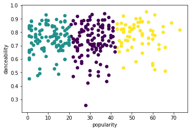
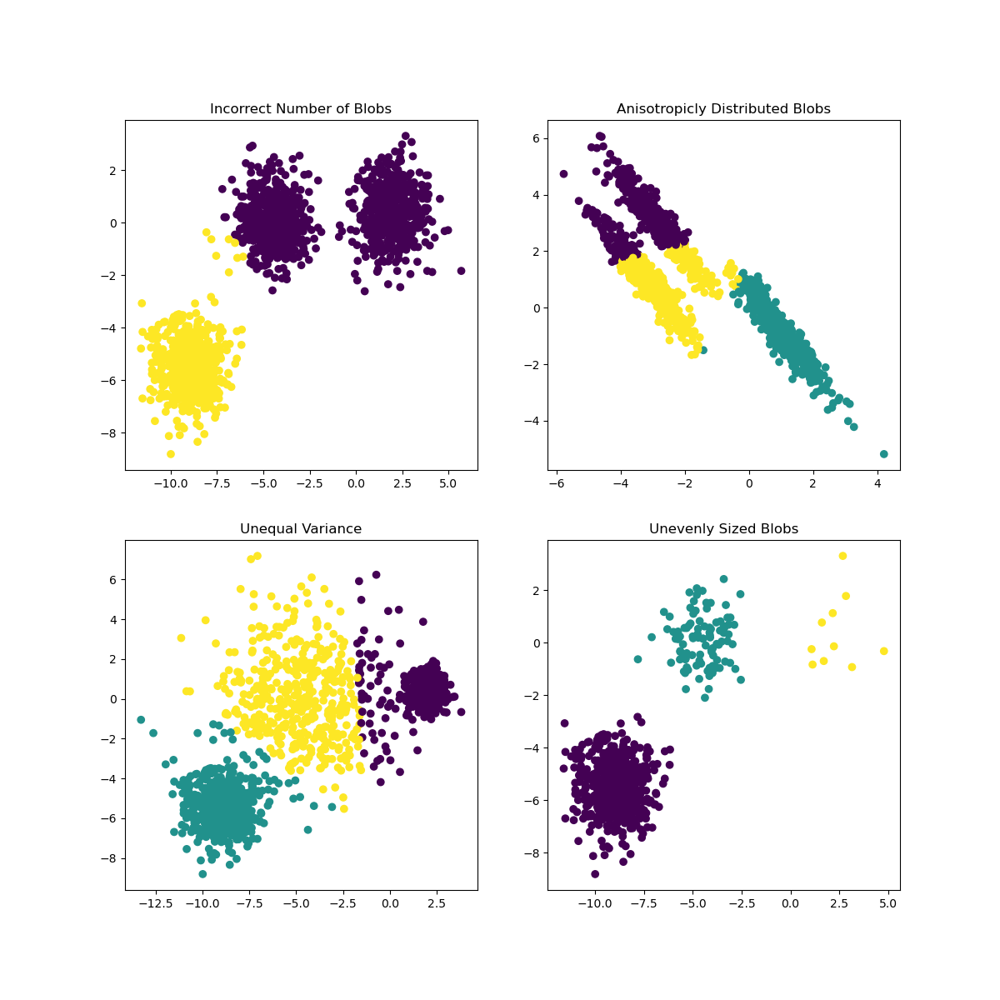

<!--
CO_OP_TRANSLATOR_METADATA:
{
  "original_hash": "085d571097d201810720df4cd379f8c2",
  "translation_date": "2025-08-29T21:05:02+00:00",
  "source_file": "5-Clustering/2-K-Means/README.md",
  "language_code": "bn"
}
-->
# K-Means ক্লাস্টারিং

## [পূর্ব-লেকচার কুইজ](https://gray-sand-07a10f403.1.azurestaticapps.net/quiz/29/)

এই পাঠে, আপনি Scikit-learn এবং পূর্বে আমদানি করা নাইজেরিয়ান মিউজিক ডেটাসেট ব্যবহার করে ক্লাস্টার তৈরি করতে শিখবেন। আমরা ক্লাস্টারিংয়ের জন্য K-Means এর মৌলিক বিষয়গুলি আলোচনা করব। মনে রাখবেন, পূর্বের পাঠে আপনি শিখেছেন যে ক্লাস্টার নিয়ে কাজ করার অনেক পদ্ধতি রয়েছে এবং আপনি যে পদ্ধতি ব্যবহার করবেন তা আপনার ডেটার উপর নির্ভর করে। আমরা K-Means চেষ্টা করব কারণ এটি সবচেয়ে সাধারণ ক্লাস্টারিং কৌশল। চলুন শুরু করি!

আপনি যেসব শব্দ শিখবেন:

- সিলুয়েট স্কোরিং
- এলবো পদ্ধতি
- ইনর্শিয়া
- ভ্যারিয়েন্স

## পরিচিতি

[K-Means Clustering](https://wikipedia.org/wiki/K-means_clustering) একটি পদ্ধতি যা সিগন্যাল প্রসেসিং ডোমেইন থেকে উদ্ভূত। এটি ডেটার গ্রুপগুলোকে 'k' ক্লাস্টারে ভাগ এবং বিভাজন করতে ব্যবহৃত হয় একটি পর্যবেক্ষণের সিরিজ ব্যবহার করে। প্রতিটি পর্যবেক্ষণ একটি নির্দিষ্ট ডেটাপয়েন্টকে তার নিকটতম 'mean' বা ক্লাস্টারের কেন্দ্রবিন্দুর সাথে গ্রুপ করতে কাজ করে।

ক্লাস্টারগুলোকে [Voronoi diagrams](https://wikipedia.org/wiki/Voronoi_diagram) হিসেবে চিত্রিত করা যায়, যেখানে একটি পয়েন্ট (বা 'seed') এবং তার সংশ্লিষ্ট অঞ্চল অন্তর্ভুক্ত থাকে।


> ইনফোগ্রাফিক: [Jen Looper](https://twitter.com/jenlooper)

K-Means ক্লাস্টারিং প্রক্রিয়া [তিনটি ধাপে সম্পন্ন হয়](https://scikit-learn.org/stable/modules/clustering.html#k-means):

1. অ্যালগরিদমটি ডেটাসেট থেকে k-সংখ্যক কেন্দ্রবিন্দু নির্বাচন করে। এরপর এটি লুপ করে:
    1. এটি প্রতিটি নমুনাকে নিকটতম সেন্ট্রয়েডে বরাদ্দ করে।
    2. এটি পূর্ববর্তী সেন্ট্রয়েডে বরাদ্দ করা সমস্ত নমুনার গড় মান গ্রহণ করে নতুন সেন্ট্রয়েড তৈরি করে।
    3. তারপর এটি নতুন এবং পুরনো সেন্ট্রয়েডের মধ্যে পার্থক্য গণনা করে এবং সেন্ট্রয়েড স্থিতিশীল না হওয়া পর্যন্ত পুনরাবৃত্তি করে।

K-Means ব্যবহারের একটি অসুবিধা হল আপনাকে 'k', অর্থাৎ সেন্ট্রয়েডের সংখ্যা নির্ধারণ করতে হবে। সৌভাগ্যক্রমে, 'elbow method' একটি ভালো প্রাথমিক মান অনুমান করতে সাহায্য করে। আপনি এটি একটু পরে চেষ্টা করবেন।

## পূর্বশর্ত

আপনি এই পাঠের [_notebook.ipynb_](https://github.com/microsoft/ML-For-Beginners/blob/main/5-Clustering/2-K-Means/notebook.ipynb) ফাইলটি ব্যবহার করবেন, যেখানে আপনি আগের পাঠে ডেটা আমদানি এবং প্রাথমিক পরিষ্কারকরণ করেছেন।

## অনুশীলন - প্রস্তুতি

গানের ডেটা আবার দেখুন।

1. প্রতিটি কলামের জন্য `boxplot()` কল করে একটি বক্সপ্লট তৈরি করুন:

    ```python
    plt.figure(figsize=(20,20), dpi=200)
    
    plt.subplot(4,3,1)
    sns.boxplot(x = 'popularity', data = df)
    
    plt.subplot(4,3,2)
    sns.boxplot(x = 'acousticness', data = df)
    
    plt.subplot(4,3,3)
    sns.boxplot(x = 'energy', data = df)
    
    plt.subplot(4,3,4)
    sns.boxplot(x = 'instrumentalness', data = df)
    
    plt.subplot(4,3,5)
    sns.boxplot(x = 'liveness', data = df)
    
    plt.subplot(4,3,6)
    sns.boxplot(x = 'loudness', data = df)
    
    plt.subplot(4,3,7)
    sns.boxplot(x = 'speechiness', data = df)
    
    plt.subplot(4,3,8)
    sns.boxplot(x = 'tempo', data = df)
    
    plt.subplot(4,3,9)
    sns.boxplot(x = 'time_signature', data = df)
    
    plt.subplot(4,3,10)
    sns.boxplot(x = 'danceability', data = df)
    
    plt.subplot(4,3,11)
    sns.boxplot(x = 'length', data = df)
    
    plt.subplot(4,3,12)
    sns.boxplot(x = 'release_date', data = df)
    ```

    এই ডেটা কিছুটা গোলমেলে: প্রতিটি কলামকে বক্সপ্লট হিসেবে পর্যবেক্ষণ করে আপনি আউটলায়ার দেখতে পারেন।

    

আপনি ডেটাসেটটি পর্যালোচনা করে এই আউটলায়ারগুলো সরিয়ে ফেলতে পারেন, তবে এটি ডেটাকে বেশ কমিয়ে দেবে।

1. আপাতত, আপনি কোন কলামগুলো ক্লাস্টারিং অনুশীলনের জন্য ব্যবহার করবেন তা নির্বাচন করুন। একই রেঞ্জের কলামগুলো বেছে নিন এবং `artist_top_genre` কলামটিকে সংখ্যাসূচক ডেটা হিসেবে এনকোড করুন:

    ```python
    from sklearn.preprocessing import LabelEncoder
    le = LabelEncoder()
    
    X = df.loc[:, ('artist_top_genre','popularity','danceability','acousticness','loudness','energy')]
    
    y = df['artist_top_genre']
    
    X['artist_top_genre'] = le.fit_transform(X['artist_top_genre'])
    
    y = le.transform(y)
    ```

1. এখন আপনাকে কতগুলো ক্লাস্টার লক্ষ্য করতে হবে তা নির্বাচন করতে হবে। আপনি জানেন যে ডেটাসেট থেকে আমরা ৩টি গান জেনার বের করেছি, তাই চলুন ৩টি চেষ্টা করি:

    ```python
    from sklearn.cluster import KMeans
    
    nclusters = 3 
    seed = 0
    
    km = KMeans(n_clusters=nclusters, random_state=seed)
    km.fit(X)
    
    # Predict the cluster for each data point
    
    y_cluster_kmeans = km.predict(X)
    y_cluster_kmeans
    ```

আপনি একটি অ্যারে দেখতে পাবেন যা প্রতিটি ডেটাফ্রেমের সারির জন্য পূর্বাভাসিত ক্লাস্টার (0, 1, বা 2) প্রিন্ট করে।

1. এই অ্যারে ব্যবহার করে একটি 'সিলুয়েট স্কোর' গণনা করুন:

    ```python
    from sklearn import metrics
    score = metrics.silhouette_score(X, y_cluster_kmeans)
    score
    ```

## সিলুয়েট স্কোর

একটি সিলুয়েট স্কোর 1 এর কাছাকাছি দেখুন। এই স্কোর -1 থেকে 1 পর্যন্ত পরিবর্তিত হয়, এবং যদি স্কোর 1 হয়, তাহলে ক্লাস্টারটি ঘন এবং অন্যান্য ক্লাস্টার থেকে ভালোভাবে পৃথক। 0 এর কাছাকাছি একটি মান ক্লাস্টারগুলোর মধ্যে ওভারল্যাপ নির্দেশ করে, যেখানে নমুনাগুলো প্রতিবেশী ক্লাস্টারের সিদ্ধান্ত সীমার খুব কাছাকাছি থাকে। [(উৎস)](https://dzone.com/articles/kmeans-silhouette-score-explained-with-python-exam)

আমাদের স্কোর **.53**, যা মাঝামাঝি। এটি নির্দেশ করে যে আমাদের ডেটা এই ধরনের ক্লাস্টারিংয়ের জন্য বিশেষভাবে উপযুক্ত নয়, তবে চলুন এগিয়ে যাই।

### অনুশীলন - একটি মডেল তৈরি করুন

1. `KMeans` আমদানি করুন এবং ক্লাস্টারিং প্রক্রিয়া শুরু করুন।

    ```python
    from sklearn.cluster import KMeans
    wcss = []
    
    for i in range(1, 11):
        kmeans = KMeans(n_clusters = i, init = 'k-means++', random_state = 42)
        kmeans.fit(X)
        wcss.append(kmeans.inertia_)
    
    ```

    এখানে কয়েকটি অংশ রয়েছে যা ব্যাখ্যা করার যোগ্য।

    > 🎓 range: এটি ক্লাস্টারিং প্রক্রিয়ার পুনরাবৃত্তি।

    > 🎓 random_state: "সেন্ট্রয়েড ইনিশিয়ালাইজেশনের জন্য র্যান্ডম নম্বর জেনারেশন নির্ধারণ করে।" [উৎস](https://scikit-learn.org/stable/modules/generated/sklearn.cluster.KMeans.html#sklearn.cluster.KMeans)

    > 🎓 WCSS: "within-cluster sums of squares" একটি ক্লাস্টারের সেন্ট্রয়েড থেকে সমস্ত পয়েন্টের গড় দূরত্বের বর্গ পরিমাপ করে। [উৎস](https://medium.com/@ODSC/unsupervised-learning-evaluating-clusters-bd47eed175ce)

    > 🎓 Inertia: K-Means অ্যালগরিদমগুলো সেন্ট্রয়েড নির্বাচন করার চেষ্টা করে যাতে 'inertia' কমানো যায়, যা "ক্লাস্টারগুলো কতটা অভ্যন্তরীণভাবে সঙ্গতিপূর্ণ তার একটি পরিমাপ।" [উৎস](https://scikit-learn.org/stable/modules/clustering.html)। এই মানটি প্রতিটি পুনরাবৃত্তিতে wcss ভেরিয়েবলে যোগ করা হয়।

    > 🎓 k-means++: [Scikit-learn](https://scikit-learn.org/stable/modules/clustering.html#k-means) এ আপনি 'k-means++' অপ্টিমাইজেশন ব্যবহার করতে পারেন, যা "সেন্ট্রয়েডগুলোকে সাধারণত একে অপরের থেকে দূরে ইনিশিয়ালাইজ করে, যা র্যান্ডম ইনিশিয়ালাইজেশনের চেয়ে সম্ভবত ভালো ফলাফল দেয়।"

### এলবো পদ্ধতি

পূর্বে, আপনি অনুমান করেছিলেন যে, যেহেতু আপনি ৩টি গান জেনার লক্ষ্য করেছেন, আপনাকে ৩টি ক্লাস্টার বেছে নেওয়া উচিত। কিন্তু তা কি সত্যিই সঠিক?

1. নিশ্চিত করতে 'এলবো পদ্ধতি' ব্যবহার করুন।

    ```python
    plt.figure(figsize=(10,5))
    sns.lineplot(x=range(1, 11), y=wcss, marker='o', color='red')
    plt.title('Elbow')
    plt.xlabel('Number of clusters')
    plt.ylabel('WCSS')
    plt.show()
    ```

    পূর্ববর্তী ধাপে তৈরি করা `wcss` ভেরিয়েবল ব্যবহার করে একটি চার্ট তৈরি করুন যা এলবোতে 'বাঁক' দেখায়, যা ক্লাস্টারের সর্বোত্তম সংখ্যা নির্দেশ করে। হয়তো এটি **৩**!

    

## অনুশীলন - ক্লাস্টারগুলো প্রদর্শন করুন

1. প্রক্রিয়াটি আবার চেষ্টা করুন, এবার তিনটি ক্লাস্টার সেট করুন এবং ক্লাস্টারগুলোকে একটি স্ক্যাটারপ্লট হিসেবে প্রদর্শন করুন:

    ```python
    from sklearn.cluster import KMeans
    kmeans = KMeans(n_clusters = 3)
    kmeans.fit(X)
    labels = kmeans.predict(X)
    plt.scatter(df['popularity'],df['danceability'],c = labels)
    plt.xlabel('popularity')
    plt.ylabel('danceability')
    plt.show()
    ```

1. মডেলের সঠিকতা পরীক্ষা করুন:

    ```python
    labels = kmeans.labels_
    
    correct_labels = sum(y == labels)
    
    print("Result: %d out of %d samples were correctly labeled." % (correct_labels, y.size))
    
    print('Accuracy score: {0:0.2f}'. format(correct_labels/float(y.size)))
    ```

    এই মডেলের সঠিকতা খুব ভালো নয়, এবং ক্লাস্টারগুলোর আকৃতি আপনাকে একটি ইঙ্গিত দেয় কেন।

    

    এই ডেটা খুবই অসমতল, খুব কম সম্পর্কযুক্ত এবং কলাম মানগুলোর মধ্যে খুব বেশি ভ্যারিয়েন্স রয়েছে যা ভালোভাবে ক্লাস্টার করতে পারে। প্রকৃতপক্ষে, গঠিত ক্লাস্টারগুলো সম্ভবত উপরে সংজ্ঞায়িত তিনটি জেনার বিভাগ দ্বারা প্রভাবিত বা বিকৃত হয়েছে। এটি একটি শেখার প্রক্রিয়া ছিল!

    Scikit-learn এর ডকুমেন্টেশনে, আপনি দেখতে পারেন যে এই ধরনের একটি মডেল, যেখানে ক্লাস্টারগুলো খুব ভালোভাবে চিহ্নিত নয়, একটি 'ভ্যারিয়েন্স' সমস্যা রয়েছে:

    
    > ইনফোগ্রাফিক: Scikit-learn

## ভ্যারিয়েন্স

ভ্যারিয়েন্সকে "Mean থেকে বর্গ পার্থক্যের গড়" হিসেবে সংজ্ঞায়িত করা হয় [(উৎস)](https://www.mathsisfun.com/data/standard-deviation.html)। এই ক্লাস্টারিং সমস্যার প্রসঙ্গে, এটি নির্দেশ করে যে আমাদের ডেটাসেটের সংখ্যাগুলো Mean থেকে একটু বেশিই বিচ্যুত হতে থাকে।

✅ এটি একটি চমৎকার মুহূর্ত যেখানে আপনি এই সমস্যাটি ঠিক করার সমস্ত উপায় নিয়ে চিন্তা করতে পারেন। ডেটা আরও সামঞ্জস্য করুন? ভিন্ন কলাম ব্যবহার করুন? ভিন্ন অ্যালগরিদম ব্যবহার করুন? ইঙ্গিত: আপনার ডেটা [স্কেলিং](https://www.mygreatlearning.com/blog/learning-data-science-with-k-means-clustering/) করে স্বাভাবিক করুন এবং অন্যান্য কলাম পরীক্ষা করুন।

> এই '[ভ্যারিয়েন্স ক্যালকুলেটর](https://www.calculatorsoup.com/calculators/statistics/variance-calculator.php)' ব্যবহার করে ধারণাটি আরও ভালোভাবে বুঝুন।

---

## 🚀চ্যালেঞ্জ

এই নোটবুক নিয়ে কিছু সময় ব্যয় করুন, প্যারামিটারগুলো সামঞ্জস্য করুন। আউটলায়ার সরিয়ে ডেটা আরও পরিষ্কার করে মডেলের সঠিকতা উন্নত করতে পারেন কি? আপনি নির্দিষ্ট ডেটা নমুনাগুলোকে আরও বেশি ওজন দিতে ওজন ব্যবহার করতে পারেন। আরও ভালো ক্লাস্টার তৈরি করতে আপনি আর কী করতে পারেন?

ইঙ্গিত: আপনার ডেটা স্কেল করার চেষ্টা করুন। নোটবুকে মন্তব্য করা কোড রয়েছে যা স্ট্যান্ডার্ড স্কেলিং যোগ করে যাতে ডেটা কলামগুলো রেঞ্জের ক্ষেত্রে একে অপরের সাথে আরও ঘনিষ্ঠভাবে সাদৃশ্যপূর্ণ হয়। আপনি দেখতে পাবেন যে সিলুয়েট স্কোর কমে যায়, তবে এলবো গ্রাফের 'বাঁক' মসৃণ হয়ে যায়। এর কারণ হল ডেটা স্কেল না করলে কম ভ্যারিয়েন্সযুক্ত ডেটা বেশি ওজন বহন করতে পারে। এই সমস্যাটি সম্পর্কে আরও পড়ুন [এখানে](https://stats.stackexchange.com/questions/21222/are-mean-normalization-and-feature-scaling-needed-for-k-means-clustering/21226#21226)।

## [পোস্ট-লেকচার কুইজ](https://gray-sand-07a10f403.1.azurestaticapps.net/quiz/30/)

## পর্যালোচনা ও স্ব-অধ্যয়ন

একটি K-Means সিমুলেটর [যেমন এটি](https://user.ceng.metu.edu.tr/~akifakkus/courses/ceng574/k-means/) দেখুন। আপনি এই টুলটি ব্যবহার করে নমুনা ডেটা পয়েন্টগুলো চিত্রিত করতে এবং এর সেন্ট্রয়েড নির্ধারণ করতে পারেন। আপনি ডেটার র্যান্ডমনেস, ক্লাস্টারের সংখ্যা এবং সেন্ট্রয়েডের সংখ্যা সম্পাদনা করতে পারেন। এটি কি আপনাকে ডেটা কীভাবে গ্রুপ করা যায় সে সম্পর্কে ধারণা পেতে সাহায্য করে?

এছাড়াও, [Stanford থেকে এই K-Means হ্যান্ডআউট](https://stanford.edu/~cpiech/cs221/handouts/kmeans.html) দেখুন।

## অ্যাসাইনমেন্ট

[বিভিন্ন ক্লাস্টারিং পদ্ধতি চেষ্টা করুন](assignment.md)

---

**অস্বীকৃতি**:  
এই নথিটি AI অনুবাদ পরিষেবা [Co-op Translator](https://github.com/Azure/co-op-translator) ব্যবহার করে অনুবাদ করা হয়েছে। আমরা যথাসম্ভব সঠিক অনুবাদ প্রদানের চেষ্টা করি, তবে অনুগ্রহ করে মনে রাখবেন যে স্বয়ংক্রিয় অনুবাদে ত্রুটি বা অসঙ্গতি থাকতে পারে। মূল ভাষায় থাকা নথিটিকে প্রামাণিক উৎস হিসেবে বিবেচনা করা উচিত। গুরুত্বপূর্ণ তথ্যের জন্য, পেশাদার মানব অনুবাদ সুপারিশ করা হয়। এই অনুবাদ ব্যবহারের ফলে কোনো ভুল বোঝাবুঝি বা ভুল ব্যাখ্যা হলে আমরা দায়বদ্ধ থাকব না।