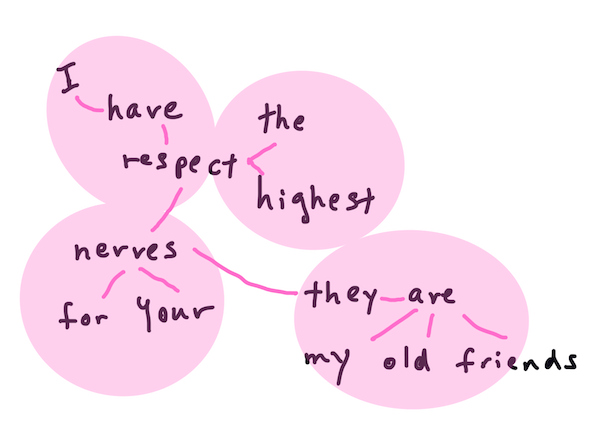
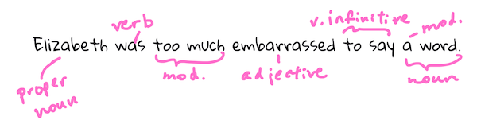

<!--
CO_OP_TRANSLATOR_METADATA:
{
  "original_hash": "6534e145d52a3890590d27be75386e5d",
  "translation_date": "2025-08-29T22:18:12+00:00",
  "source_file": "6-NLP/2-Tasks/README.md",
  "language_code": "bn"
}
-->
# সাধারণ প্রাকৃতিক ভাষা প্রক্রিয়াকরণ কাজ এবং কৌশল

বেশিরভাগ *প্রাকৃতিক ভাষা প্রক্রিয়াকরণ* কাজের জন্য, প্রক্রিয়াকরণের জন্য পাঠ্যটি ভেঙে বিশ্লেষণ করতে হয় এবং ফলাফল সংরক্ষণ বা নিয়ম এবং ডেটাসেটের সাথে ক্রস রেফারেন্স করতে হয়। এই কাজগুলো প্রোগ্রামারকে পাঠ্যের মধ্যে শব্দ এবং শব্দের _অর্থ_, _উদ্দেশ্য_ বা শুধুমাত্র _ঘনত্ব_ নির্ধারণ করতে সাহায্য করে।

## [পূর্ব-লেকচার কুইজ](https://gray-sand-07a10f403.1.azurestaticapps.net/quiz/33/)

চলুন পাঠ্য প্রক্রিয়াকরণের সাধারণ কৌশলগুলি আবিষ্কার করি। মেশিন লার্নিংয়ের সাথে মিলিত হয়ে, এই কৌশলগুলি আপনাকে বড় পরিমাণে পাঠ্য দক্ষতার সাথে বিশ্লেষণ করতে সাহায্য করে। তবে, এই কাজগুলিতে মেশিন লার্নিং প্রয়োগ করার আগে, একজন NLP বিশেষজ্ঞের সম্মুখীন হওয়া সমস্যাগুলি বুঝতে হবে।

## NLP-তে সাধারণ কাজ

আপনি যে পাঠ্যের উপর কাজ করছেন তা বিশ্লেষণ করার বিভিন্ন উপায় রয়েছে। কিছু নির্দিষ্ট কাজ সম্পাদন করে আপনি পাঠ্যটি বুঝতে এবং সিদ্ধান্ত নিতে সক্ষম হন। সাধারণত এই কাজগুলো একটি নির্দিষ্ট ক্রমে সম্পাদিত হয়।

### টোকেনাইজেশন

সম্ভবত প্রথম কাজ যা বেশিরভাগ NLP অ্যালগরিদমকে করতে হয় তা হলো পাঠ্যকে টোকেন বা শব্দে বিভক্ত করা। যদিও এটি সহজ মনে হয়, বিরামচিহ্ন এবং বিভিন্ন ভাষার শব্দ এবং বাক্য বিভাজনকারীদের হিসাব করতে হয়, যা এটি জটিল করে তুলতে পারে। আপনাকে বিভাজন নির্ধারণের জন্য বিভিন্ন পদ্ধতি ব্যবহার করতে হতে পারে।


> **Pride and Prejudice** থেকে একটি বাক্য টোকেনাইজ করা। ইনফোগ্রাফিক: [Jen Looper](https://twitter.com/jenlooper)

### এমবেডিংস

[ওয়ার্ড এমবেডিংস](https://wikipedia.org/wiki/Word_embedding) হলো আপনার পাঠ্য ডেটাকে সংখ্যায় রূপান্তর করার একটি উপায়। এমবেডিংস এমনভাবে করা হয় যাতে একই অর্থের বা একসাথে ব্যবহৃত শব্দগুলো একসাথে ক্লাস্টার করে।


> "I have the highest respect for your nerves, they are my old friends." - **Pride and Prejudice** থেকে একটি বাক্যের জন্য ওয়ার্ড এমবেডিংস। ইনফোগ্রাফিক: [Jen Looper](https://twitter.com/jenlooper)

✅ [এই আকর্ষণীয় টুলটি](https://projector.tensorflow.org/) ব্যবহার করে ওয়ার্ড এমবেডিংস নিয়ে পরীক্ষা করুন। একটি শব্দে ক্লিক করলে একই ধরনের শব্দের ক্লাস্টার দেখায়: 'toy' ক্লাস্টার করে 'disney', 'lego', 'playstation', এবং 'console' এর সাথে।

### পার্সিং এবং পার্ট-অফ-স্পিচ ট্যাগিং

প্রতিটি টোকেনাইজ করা শব্দকে পার্ট-অফ-স্পিচ হিসেবে ট্যাগ করা যায় - যেমন নাউন, ভার্ব, বা অ্যাডজেকটিভ। বাক্য `the quick red fox jumped over the lazy brown dog` এর POS ট্যাগ হতে পারে fox = noun, jumped = verb।



> **Pride and Prejudice** থেকে একটি বাক্য পার্স করা। ইনফোগ্রাফিক: [Jen Looper](https://twitter.com/jenlooper)

পার্সিং হলো একটি বাক্যে কোন শব্দগুলো একে অপরের সাথে সম্পর্কিত তা চিহ্নিত করা - যেমন `the quick red fox jumped` হলো একটি adjective-noun-verb সিকোয়েন্স যা `lazy brown dog` সিকোয়েন্স থেকে আলাদা।

### শব্দ এবং বাক্যাংশের ঘনত্ব

বড় পরিমাণে পাঠ্য বিশ্লেষণ করার সময় একটি দরকারী পদ্ধতি হলো প্রতিটি শব্দ বা আগ্রহের বাক্যাংশের একটি ডিকশনারি তৈরি করা এবং এটি কতবার উপস্থিত হয়েছে তা গণনা করা। বাক্য `the quick red fox jumped over the lazy brown dog` এ `the` শব্দটির ঘনত্ব ২।

চলুন একটি উদাহরণ পাঠ্য দেখি যেখানে আমরা শব্দের ঘনত্ব গণনা করি। রুডইয়ার্ড কিপলিং-এর কবিতা **The Winners** এর একটি অংশ:

```output
What the moral? Who rides may read.
When the night is thick and the tracks are blind
A friend at a pinch is a friend, indeed,
But a fool to wait for the laggard behind.
Down to Gehenna or up to the Throne,
He travels the fastest who travels alone.
```

যেহেতু বাক্যাংশের ঘনত্ব প্রয়োজন অনুযায়ী কেস সেনসিটিভ বা কেস ইনসেনসিটিভ হতে পারে, তাই `a friend` বাক্যাংশের ঘনত্ব ২ এবং `the` এর ঘনত্ব ৬, এবং `travels` এর ঘনত্ব ২।

### এন-গ্রাম

একটি পাঠ্যকে নির্দিষ্ট দৈর্ঘ্যের শব্দের সিকোয়েন্সে বিভক্ত করা যায়, যেমন একক শব্দ (ইউনিগ্রাম), দুই শব্দ (বাইগ্রাম), তিন শব্দ (ট্রাইগ্রাম) বা যেকোনো সংখ্যক শব্দ (এন-গ্রাম)।

উদাহরণস্বরূপ, `the quick red fox jumped over the lazy brown dog` বাক্যটি ২ এন-গ্রামের স্কোর দিয়ে নিম্নলিখিত এন-গ্রাম তৈরি করে:

1. the quick  
2. quick red  
3. red fox  
4. fox jumped  
5. jumped over  
6. over the  
7. the lazy  
8. lazy brown  
9. brown dog  

এটি একটি স্লাইডিং বক্সের মতো বাক্যের উপর কল্পনা করা সহজ হতে পারে। এখানে এটি ৩ শব্দের এন-গ্রামের জন্য দেখানো হয়েছে, প্রতিটি বাক্যে এন-গ্রামটি **বোল্ড**:

1.   <u>**the quick red**</u> fox jumped over the lazy brown dog  
2.   the **<u>quick red fox</u>** jumped over the lazy brown dog  
3.   the quick **<u>red fox jumped</u>** over the lazy brown dog  
4.   the quick red **<u>fox jumped over</u>** the lazy brown dog  
5.   the quick red fox **<u>jumped over the</u>** lazy brown dog  
6.   the quick red fox jumped **<u>over the lazy</u>** brown dog  
7.   the quick red fox jumped over <u>**the lazy brown**</u> dog  
8.   the quick red fox jumped over the **<u>lazy brown dog</u>**  


> ৩ এন-গ্রামের মান: ইনফোগ্রাফিক: [Jen Looper](https://twitter.com/jenlooper)

### নাউন বাক্যাংশ নির্যাস

বেশিরভাগ বাক্যে একটি নাউন থাকে যা বাক্যের বিষয় বা বস্তু। ইংরেজিতে এটি প্রায়শই `a`, `an`, বা `the` দ্বারা চিহ্নিত করা যায়। বাক্যের অর্থ বোঝার চেষ্টা করার সময় `নাউন বাক্যাংশ নির্যাস` একটি সাধারণ NLP কাজ।

✅ বাক্যে "I cannot fix on the hour, or the spot, or the look or the words, which laid the foundation. It is too long ago. I was in the middle before I knew that I had begun." আপনি কি নাউন বাক্যাংশগুলো চিহ্নিত করতে পারেন?

বাক্য `the quick red fox jumped over the lazy brown dog` এ ২টি নাউন বাক্যাংশ রয়েছে: **quick red fox** এবং **lazy brown dog**।

### অনুভূতি বিশ্লেষণ

একটি বাক্য বা পাঠ্য *ইতিবাচক* বা *নেতিবাচক* কতটা তা বিশ্লেষণ করা যায়। অনুভূতি *পোলারিটি* এবং *অবজেক্টিভিটি/সাবজেক্টিভিটি* দ্বারা পরিমাপ করা হয়। পোলারিটি -1.0 থেকে 1.0 (নেতিবাচক থেকে ইতিবাচক) এবং 0.0 থেকে 1.0 (সবচেয়ে অবজেক্টিভ থেকে সবচেয়ে সাবজেক্টিভ) দ্বারা পরিমাপ করা হয়।

✅ পরে আপনি শিখবেন যে মেশিন লার্নিং ব্যবহার করে অনুভূতি নির্ধারণের বিভিন্ন উপায় রয়েছে, তবে একটি উপায় হলো মানুষের বিশেষজ্ঞ দ্বারা ইতিবাচক বা নেতিবাচক হিসেবে শ্রেণীবদ্ধ শব্দ এবং বাক্যাংশের একটি তালিকা থাকা এবং সেই মডেলটি পাঠ্যে প্রয়োগ করে একটি পোলারিটি স্কোর গণনা করা। আপনি কি দেখতে পাচ্ছেন এটি কিছু পরিস্থিতিতে কীভাবে কাজ করবে এবং অন্য কিছুতে কম কার্যকর হবে?

### ইনফ্লেকশন

ইনফ্লেকশন আপনাকে একটি শব্দের একবচন বা বহুবচন পেতে সক্ষম করে।

### লেমাটাইজেশন

একটি *লেমা* হলো একটি শব্দের মূল বা প্রধান শব্দ, যেমন *flew*, *flies*, *flying* এর লেমা হলো ক্রিয়া *fly*।

এছাড়াও NLP গবেষকের জন্য কিছু দরকারী ডেটাবেস রয়েছে, বিশেষত:

### ওয়ার্ডনেট

[ওয়ার্ডনেট](https://wordnet.princeton.edu/) হলো বিভিন্ন ভাষার প্রতিটি শব্দের জন্য শব্দ, সমার্থক শব্দ, বিপরীত শব্দ এবং অন্যান্য অনেক বিশদ বিবরণের একটি ডেটাবেস। এটি অনুবাদ, বানান পরীক্ষক বা যেকোনো ধরনের ভাষা সরঞ্জাম তৈরি করার সময় অত্যন্ত কার্যকর।

## NLP লাইব্রেরি

সৌভাগ্যক্রমে, আপনাকে এই কৌশলগুলো নিজে তৈরি করতে হবে না, কারণ Python-এর চমৎকার লাইব্রেরিগুলো রয়েছে যা প্রাকৃতিক ভাষা প্রক্রিয়াকরণ বা মেশিন লার্নিংয়ে বিশেষজ্ঞ নয় এমন ডেভেলপারদের জন্য এটি আরও সহজলভ্য করে তোলে। পরবর্তী পাঠগুলোতে এর আরও উদাহরণ থাকবে, তবে এখানে আপনি কিছু দরকারী উদাহরণ শিখবেন যা আপনাকে পরবর্তী কাজে সাহায্য করবে।

### অনুশীলন - `TextBlob` লাইব্রেরি ব্যবহার করা

চলুন TextBlob নামক একটি লাইব্রেরি ব্যবহার করি কারণ এটি এই ধরনের কাজ মোকাবেলার জন্য সহায়ক API সরবরাহ করে। TextBlob "[NLTK](https://nltk.org) এবং [pattern](https://github.com/clips/pattern) এর উপর ভিত্তি করে তৈরি হয়েছে এবং উভয়ের সাথে সুন্দরভাবে কাজ করে।" এর API-তে উল্লেখযোগ্য পরিমাণে মেশিন লার্নিং অন্তর্ভুক্ত রয়েছে।

> নোট: TextBlob-এর একটি দরকারী [Quick Start](https://textblob.readthedocs.io/en/dev/quickstart.html#quickstart) গাইড রয়েছে যা অভিজ্ঞ Python ডেভেলপারদের জন্য সুপারিশ করা হয়।

নাউন বাক্যাংশ চিহ্নিত করার চেষ্টা করার সময়, TextBlob নাউন বাক্যাংশ খুঁজে বের করার জন্য বিভিন্ন এক্সট্রাক্টর অফার করে।

1. `ConllExtractor` দেখুন।

    ```python
    from textblob import TextBlob
    from textblob.np_extractors import ConllExtractor
    # import and create a Conll extractor to use later 
    extractor = ConllExtractor()
    
    # later when you need a noun phrase extractor:
    user_input = input("> ")
    user_input_blob = TextBlob(user_input, np_extractor=extractor)  # note non-default extractor specified
    np = user_input_blob.noun_phrases                                    
    ```

    > এখানে কী ঘটছে? [ConllExtractor](https://textblob.readthedocs.io/en/dev/api_reference.html?highlight=Conll#textblob.en.np_extractors.ConllExtractor) হলো "একটি নাউন বাক্যাংশ এক্সট্রাক্টর যা ConLL-2000 প্রশিক্ষণ কর্পাস দিয়ে প্রশিক্ষিত চাঙ্ক পার্সিং ব্যবহার করে।" ConLL-2000 হলো Computational Natural Language Learning-এর ২০০০ সালের সম্মেলন। প্রতি বছর সম্মেলন একটি কঠিন NLP সমস্যার সমাধান করার জন্য একটি কর্মশালা আয়োজন করত, এবং ২০০০ সালে এটি ছিল নাউন চাঙ্কিং। একটি মডেল Wall Street Journal-এ প্রশিক্ষিত হয়েছিল, "sections 15-18 প্রশিক্ষণ ডেটা (211727 টোকেন) এবং section 20 পরীক্ষার ডেটা (47377 টোকেন)" হিসেবে। আপনি ব্যবহৃত পদ্ধতিগুলো [এখানে](https://www.clips.uantwerpen.be/conll2000/chunking/) এবং [ফলাফল](https://ifarm.nl/erikt/research/np-chunking.html) দেখতে পারেন।

### চ্যালেঞ্জ - NLP দিয়ে আপনার বট উন্নত করা

পূর্ববর্তী পাঠে আপনি একটি খুব সাধারণ Q&A বট তৈরি করেছিলেন। এখন, আপনি মারভিনকে আরও সহানুভূতিশীল করে তুলবেন আপনার ইনপুট বিশ্লেষণ করে এবং সেই অনুযায়ী একটি প্রতিক্রিয়া মুদ্রণ করে। আপনাকে একটি `noun_phrase` চিহ্নিত করতে হবে এবং সেই বিষয়ে আরও ইনপুট চাইতে হবে।

আপনার বটকে আরও ভালোভাবে কথোপকথন করতে তৈরি করার ধাপগুলো:

1. ব্যবহারকারীকে বটের সাথে কীভাবে যোগাযোগ করতে হবে তা নির্দেশনা মুদ্রণ করুন  
2. লুপ শুরু করুন  
   1. ব্যবহারকারীর ইনপুট গ্রহণ করুন  
   2. যদি ব্যবহারকারী প্রস্থান করতে চায়, তাহলে প্রস্থান করুন  
   3. ব্যবহারকারীর ইনপুট প্রক্রিয়াকরণ করুন এবং উপযুক্ত অনুভূতি প্রতিক্রিয়া নির্ধারণ করুন  
   4. যদি একটি নাউন বাক্যাংশ অনুভূতিতে সনাক্ত হয়, তাহলে এটি বহুবচন করুন এবং সেই বিষয়ে আরও ইনপুট চাইতে বলুন  
   5. প্রতিক্রিয়া মুদ্রণ করুন  
3. ধাপ ২-এ ফিরে যান  

TextBlob ব্যবহার করে অনুভূতি নির্ধারণের জন্য কোড স্নিপেট এখানে রয়েছে। লক্ষ্য করুন যে শুধুমাত্র চারটি *গ্রেডিয়েন্ট* অনুভূতি প্রতিক্রিয়ার রয়েছে (আপনি চাইলে আরও যোগ করতে পারেন):

```python
if user_input_blob.polarity <= -0.5:
  response = "Oh dear, that sounds bad. "
elif user_input_blob.polarity <= 0:
  response = "Hmm, that's not great. "
elif user_input_blob.polarity <= 0.5:
  response = "Well, that sounds positive. "
elif user_input_blob.polarity <= 1:
  response = "Wow, that sounds great. "
```

নিম্নলিখিত নমুনা আউটপুটটি আপনাকে গাইড করবে (ব্যবহারকারীর ইনপুট > দিয়ে শুরু হওয়া লাইনে):

```output
Hello, I am Marvin, the friendly robot.
You can end this conversation at any time by typing 'bye'
After typing each answer, press 'enter'
How are you today?
> I am ok
Well, that sounds positive. Can you tell me more?
> I went for a walk and saw a lovely cat
Well, that sounds positive. Can you tell me more about lovely cats?
> cats are the best. But I also have a cool dog
Wow, that sounds great. Can you tell me more about cool dogs?
> I have an old hounddog but he is sick
Hmm, that's not great. Can you tell me more about old hounddogs?
> bye
It was nice talking to you, goodbye!
```

এই কাজের একটি সম্ভাব্য সমাধান [এখানে](https://github.com/microsoft/ML-For-Beginners/blob/main/6-NLP/2-Tasks/solution/bot.py)

✅ জ্ঞান যাচাই

1. আপনি কি মনে করেন সহানুভূতিশীল প্রতিক্রিয়াগুলো কাউকে 'প্রতারণা' করতে পারে যাতে তারা মনে করে যে বটটি তাদের আসলেই বুঝেছে?  
2. নাউন বাক্যাংশ চিহ্নিত করা কি বটকে আরও 'বিশ্বাসযোগ্য' করে তোলে?  
3. কেন একটি বাক্য থেকে 'নাউন বাক্যাংশ' বের করা একটি দরকারী কাজ হতে পারে?

---

পূর্ববর্তী জ্ঞান যাচাইয়ের বটটি বাস্তবায়ন করুন এবং এটি আপনার বন্ধুর উপর পরীক্ষা করুন। এটি কি তাদের প্রতারণা করতে পারে? আপনি কি আপনার বটকে আরও 'বিশ্বাসযোগ্য' করতে পারেন?

## 🚀চ্যালেঞ্জ

পূর্ববর্তী জ্ঞান যাচাইয়ের একটি কাজ নিন এবং এটি বাস্তবায়ন করার চেষ্টা করুন। বটটি আপনার বন্ধুর উপর পরীক্ষা করুন। এটি কি তাদের প্রতারণা করতে পারে? আপনি কি আপনার বটকে আরও 'বিশ্বাসযোগ্য' করতে পারেন?

## [পোস্ট-লেকচার কুইজ](https://gray-sand-07a10f403.1.azurestaticapps.net/quiz/34/)

## পর্যালোচনা এবং স্ব-অধ্যয়ন

পরবর্তী কয়েকটি পাঠে আপনি অনুভূতি বিশ্লেষণ সম্পর্কে আরও শিখবেন। [KDNuggets](https://www.kdnuggets.com/tag/nlp)-এর মতো প্রবন্ধে এই আকর্ষণীয় কৌশলটি গবেষণা করুন।

## অ্যাসাইনমেন্ট 

[বটকে কথা বলাতে শেখান](assignment.md)

---

**অস্বীকৃতি**:  
এই নথিটি AI অনুবাদ পরিষেবা [Co-op Translator](https://github.com/Azure/co-op-translator) ব্যবহার করে অনুবাদ করা হয়েছে। আমরা যথাসম্ভব সঠিকতার জন্য চেষ্টা করি, তবে অনুগ্রহ করে মনে রাখবেন যে স্বয়ংক্রিয় অনুবাদে ত্রুটি বা অসঙ্গতি থাকতে পারে। মূল ভাষায় থাকা নথিটিকে প্রামাণিক উৎস হিসেবে বিবেচনা করা উচিত। গুরুত্বপূর্ণ তথ্যের জন্য, পেশাদার মানব অনুবাদ সুপারিশ করা হয়। এই অনুবাদ ব্যবহারের ফলে কোনো ভুল বোঝাবুঝি বা ভুল ব্যাখ্যা হলে আমরা তার জন্য দায়বদ্ধ নই।