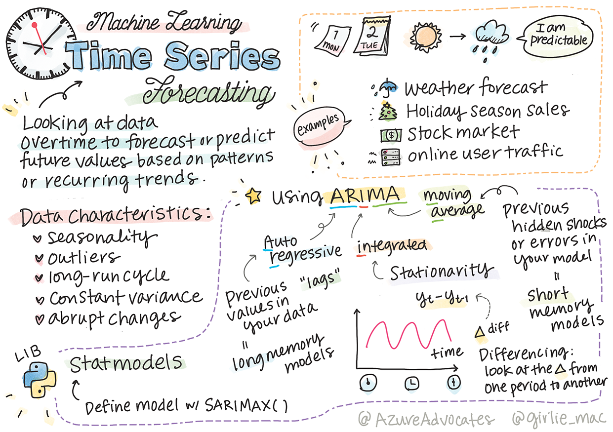
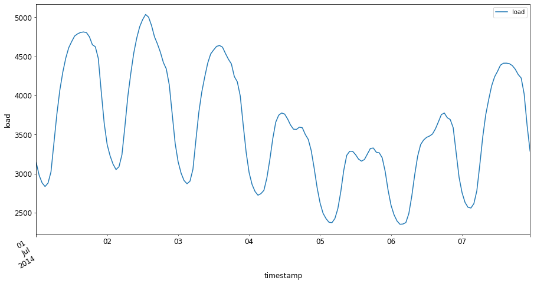

<!--
CO_OP_TRANSLATOR_METADATA:
{
  "original_hash": "3150d40f36a77857316ecaed5f31e856",
  "translation_date": "2025-08-29T20:44:03+00:00",
  "source_file": "7-TimeSeries/1-Introduction/README.md",
  "language_code": "bn"
}
-->
# টাইম সিরিজ পূর্বাভাসের পরিচিতি



> স্কেচনোট: [Tomomi Imura](https://www.twitter.com/girlie_mac)

এই পাঠ এবং পরবর্তী পাঠে, আপনি টাইম সিরিজ পূর্বাভাস সম্পর্কে কিছু শিখবেন, যা একটি মেশিন লার্নিং বিজ্ঞানীর দক্ষতার একটি আকর্ষণীয় এবং মূল্যবান অংশ। এটি অন্যান্য বিষয়ের তুলনায় কিছুটা কম পরিচিত। টাইম সিরিজ পূর্বাভাস একটি ধরনের 'ক্রিস্টাল বল': পূর্বের পারফরম্যান্সের উপর ভিত্তি করে, যেমন মূল্য, আপনি এর ভবিষ্যৎ সম্ভাব্য মান পূর্বাভাস দিতে পারেন।

[](https://youtu.be/cBojo1hsHiI "টাইম সিরিজ পূর্বাভাসের পরিচিতি")

> 🎥 উপরের ছবিতে ক্লিক করুন টাইম সিরিজ পূর্বাভাস সম্পর্কে একটি ভিডিও দেখার জন্য

## [পাঠ-পূর্ব কুইজ](https://gray-sand-07a10f403.1.azurestaticapps.net/quiz/41/)

এটি একটি কার্যকর এবং আকর্ষণীয় ক্ষেত্র যা ব্যবসার জন্য বাস্তব মূল্য প্রদান করে, কারণ এটি মূল্য নির্ধারণ, ইনভেন্টরি এবং সাপ্লাই চেইন সমস্যার সরাসরি প্রয়োগের সাথে সম্পর্কিত। যদিও গভীর শিক্ষণ (ডিপ লার্নিং) কৌশলগুলি ভবিষ্যৎ পারফরম্যান্স আরও ভালোভাবে পূর্বাভাস দেওয়ার জন্য ব্যবহার করা শুরু হয়েছে, টাইম সিরিজ পূর্বাভাস এখনও ক্লাসিক মেশিন লার্নিং কৌশল দ্বারা ব্যাপকভাবে প্রভাবিত।

> পেন স্টেটের কার্যকর টাইম সিরিজ পাঠ্যক্রম [এখানে](https://online.stat.psu.edu/stat510/lesson/1) পাওয়া যাবে।

## পরিচিতি

ধরুন আপনি একটি স্মার্ট পার্কিং মিটার নেটওয়ার্ক পরিচালনা করেন যা সময়ের সাথে সাথে কতবার এবং কতক্ষণ ব্যবহৃত হয় তার ডেটা প্রদান করে।

> যদি আপনি মিটারের পূর্বের পারফরম্যান্সের উপর ভিত্তি করে ভবিষ্যৎ মান পূর্বাভাস দিতে পারেন, তাহলে কী হবে?

যখন কাজ করার সঠিক সময় পূর্বাভাস দেওয়া একটি চ্যালেঞ্জ, তখন টাইম সিরিজ পূর্বাভাস এই সমস্যার সমাধান করতে পারে। ব্যস্ত সময়ে পার্কিং স্পট খুঁজতে গিয়ে বেশি চার্জ করা লোকদের খুশি করবে না, তবে এটি রাস্তা পরিষ্কার করার জন্য রাজস্ব তৈরি করার একটি নিশ্চিত উপায় হতে পারে!

চলুন টাইম সিরিজ অ্যালগরিদমের কিছু ধরন অন্বেষণ করি এবং কিছু ডেটা পরিষ্কার ও প্রস্তুত করার জন্য একটি নোটবুক শুরু করি। আপনি যে ডেটা বিশ্লেষণ করবেন তা GEFCom2014 পূর্বাভাস প্রতিযোগিতা থেকে নেওয়া হয়েছে। এটি ২০১২ থেকে ২০১৪ সালের মধ্যে ৩ বছরের ঘণ্টাভিত্তিক বিদ্যুৎ লোড এবং তাপমাত্রার মান নিয়ে গঠিত। বিদ্যুৎ লোড এবং তাপমাত্রার ঐতিহাসিক প্যাটার্নের ভিত্তিতে, আপনি ভবিষ্যৎ বিদ্যুৎ লোডের মান পূর্বাভাস দিতে পারেন।

এই উদাহরণে, আপনি শুধুমাত্র ঐতিহাসিক লোড ডেটা ব্যবহার করে এক সময় ধাপ পূর্বাভাস দেওয়া শিখবেন। তবে শুরু করার আগে, পর্দার পিছনে কী ঘটছে তা বোঝা দরকার।

## কিছু সংজ্ঞা

'টাইম সিরিজ' শব্দটি যখন শুনবেন, তখন এর বিভিন্ন প্রসঙ্গে ব্যবহারের অর্থ বুঝতে হবে।

🎓 **টাইম সিরিজ**

গণিতের ভাষায়, "টাইম সিরিজ হল সময়ক্রমে সূচিবদ্ধ (বা তালিকাভুক্ত বা গ্রাফ করা) ডেটা পয়েন্টের একটি সিরিজ। সাধারণত, টাইম সিরিজ হল সমানভাবে ব্যবধানে সময়ের পয়েন্টে নেওয়া একটি ক্রম।" টাইম সিরিজের একটি উদাহরণ হল [ডাউ জোন্স ইন্ডাস্ট্রিয়াল অ্যাভারেজ](https://wikipedia.org/wiki/Time_series)-এর দৈনিক ক্লোজিং মান। টাইম সিরিজ প্লট এবং পরিসংখ্যানগত মডেলিং সিগন্যাল প্রসেসিং, আবহাওয়া পূর্বাভাস, ভূমিকম্প পূর্বাভাস এবং অন্যান্য ক্ষেত্রে প্রায়ই দেখা যায় যেখানে ঘটনা ঘটে এবং ডেটা পয়েন্ট সময়ের সাথে প্লট করা যায়।

🎓 **টাইম সিরিজ বিশ্লেষণ**

টাইম সিরিজ বিশ্লেষণ হল উপরে উল্লেখিত টাইম সিরিজ ডেটার বিশ্লেষণ। টাইম সিরিজ ডেটা বিভিন্ন রূপ নিতে পারে, যার মধ্যে 'ইন্টারাপ্টেড টাইম সিরিজ' অন্তর্ভুক্ত, যা একটি টাইম সিরিজের বিবর্তনে একটি বাধা ঘটনার আগে এবং পরে প্যাটার্ন সনাক্ত করে। টাইম সিরিজের জন্য প্রয়োজনীয় বিশ্লেষণ ডেটার প্রকৃতির উপর নির্ভর করে। টাইম সিরিজ ডেটা নিজেই সংখ্যা বা অক্ষরের সিরিজের রূপ নিতে পারে।

এই বিশ্লেষণ বিভিন্ন পদ্ধতি ব্যবহার করে সম্পন্ন হয়, যার মধ্যে রয়েছে ফ্রিকোয়েন্সি-ডোমেইন এবং টাইম-ডোমেইন, লিনিয়ার এবং নন-লিনিয়ার, এবং আরও অনেক কিছু। [আরও জানুন](https://www.itl.nist.gov/div898/handbook/pmc/section4/pmc4.htm) এই ধরনের ডেটা বিশ্লেষণের বিভিন্ন উপায় সম্পর্কে।

🎓 **টাইম সিরিজ পূর্বাভাস**

টাইম সিরিজ পূর্বাভাস হল একটি মডেল ব্যবহার করে পূর্বে সংগৃহীত ডেটার প্যাটার্নের ভিত্তিতে ভবিষ্যৎ মান পূর্বাভাস দেওয়া। যদিও টাইম সিরিজ ডেটা অন্বেষণ করতে রিগ্রেশন মডেল ব্যবহার করা সম্ভব, টাইম সিরিজ ডেটা বিশেষ ধরনের মডেল ব্যবহার করে বিশ্লেষণ করা সবচেয়ে ভালো।

টাইম সিরিজ ডেটা হল একটি ক্রমবদ্ধ পর্যবেক্ষণের তালিকা, যা লিনিয়ার রিগ্রেশন দ্বারা বিশ্লেষণযোগ্য ডেটার মতো নয়। সবচেয়ে সাধারণ মডেল হল ARIMA, যার পূর্ণরূপ "Autoregressive Integrated Moving Average"।

[ARIMA মডেল](https://online.stat.psu.edu/stat510/lesson/1/1.1) "বর্তমান মানকে পূর্বের মান এবং পূর্বাভাসের ত্রুটির সাথে সম্পর্কিত করে।" এটি টাইম-ডোমেইন ডেটা বিশ্লেষণের জন্য সবচেয়ে উপযুক্ত, যেখানে ডেটা সময়ের সাথে ক্রমানুসারে সাজানো থাকে।

> ARIMA মডেলের বিভিন্ন ধরন রয়েছে, যা আপনি [এখানে](https://people.duke.edu/~rnau/411arim.htm) শিখতে পারেন এবং যা আপনি পরবর্তী পাঠে স্পর্শ করবেন।

পরবর্তী পাঠে, আপনি [Univariate Time Series](https://itl.nist.gov/div898/handbook/pmc/section4/pmc44.htm) ব্যবহার করে একটি ARIMA মডেল তৈরি করবেন, যা একটি পরিবর্তনশীলকে কেন্দ্র করে যা সময়ের সাথে তার মান পরিবর্তন করে। এই ধরনের ডেটার একটি উদাহরণ হল [এই ডেটাসেট](https://itl.nist.gov/div898/handbook/pmc/section4/pmc4411.htm), যা Mauna Loa Observatory-তে মাসিক CO2 ঘনত্ব রেকর্ড করে:

|  CO2   | YearMonth | Year  | Month |
| :----: | :-------: | :---: | :---: |
| 330.62 |  1975.04  | 1975  |   1   |
| 331.40 |  1975.13  | 1975  |   2   |
| 331.87 |  1975.21  | 1975  |   3   |
| 333.18 |  1975.29  | 1975  |   4   |
| 333.92 |  1975.38  | 1975  |   5   |
| 333.43 |  1975.46  | 1975  |   6   |
| 331.85 |  1975.54  | 1975  |   7   |
| 330.01 |  1975.63  | 1975  |   8   |
| 328.51 |  1975.71  | 1975  |   9   |
| 328.41 |  1975.79  | 1975  |  10   |
| 329.25 |  1975.88  | 1975  |  11   |
| 330.97 |  1975.96  | 1975  |  12   |

✅ এই ডেটাসেটে সময়ের সাথে পরিবর্তিত পরিবর্তনশীলটি সনাক্ত করুন।

## টাইম সিরিজ ডেটার বৈশিষ্ট্য বিবেচনা করা

টাইম সিরিজ ডেটা দেখার সময়, আপনি লক্ষ্য করতে পারেন যে এতে [কিছু বৈশিষ্ট্য](https://online.stat.psu.edu/stat510/lesson/1/1.1) রয়েছে যা এর প্যাটার্নগুলি আরও ভালোভাবে বুঝতে এবং বিশ্লেষণ করতে আপনাকে বিবেচনা করতে হবে। যদি আপনি টাইম সিরিজ ডেটাকে একটি 'সিগন্যাল' হিসাবে ভাবেন যা আপনি বিশ্লেষণ করতে চান, তবে এই বৈশিষ্ট্যগুলি 'নয়েজ' হিসাবে বিবেচিত হতে পারে। এই 'নয়েজ' কমানোর জন্য কিছু পরিসংখ্যানগত কৌশল ব্যবহার করতে হতে পারে।

টাইম সিরিজ নিয়ে কাজ করার জন্য এখানে কিছু ধারণা রয়েছে যা আপনাকে জানতে হবে:

🎓 **ট্রেন্ড**

ট্রেন্ড হল সময়ের সাথে পরিমাপযোগ্য বৃদ্ধি এবং হ্রাস। [আরও পড়ুন](https://machinelearningmastery.com/time-series-trends-in-python)। টাইম সিরিজের প্রসঙ্গে, এটি ট্রেন্ড ব্যবহার এবং প্রয়োজনে টাইম সিরিজ থেকে ট্রেন্ড সরানোর বিষয়ে।

🎓 **[সিজনালিটি](https://machinelearningmastery.com/time-series-seasonality-with-python/)**

সিজনালিটি হল পর্যায়ক্রমিক ওঠানামা, যেমন ছুটির সময় বিক্রয়ে প্রভাব। [দেখুন](https://itl.nist.gov/div898/handbook/pmc/section4/pmc443.htm) কীভাবে বিভিন্ন ধরনের প্লট ডেটায় সিজনালিটি প্রদর্শন করে।

🎓 **আউটলায়ার**

আউটলায়ার হল ডেটার সাধারণ বৈচিত্র্যের থেকে অনেক দূরে থাকা মান।

🎓 **দীর্ঘমেয়াদী চক্র**

সিজনালিটির বাইরে, ডেটা দীর্ঘমেয়াদী চক্র প্রদর্শন করতে পারে, যেমন এক বছরের বেশি সময় ধরে চলা অর্থনৈতিক মন্দা।

🎓 **স্থির বৈচিত্র্য**

সময়ের সাথে, কিছু ডেটা স্থির ওঠানামা প্রদর্শন করে, যেমন দিনের এবং রাতের শক্তি ব্যবহারের পরিমাণ।

🎓 **হঠাৎ পরিবর্তন**

ডেটা হঠাৎ পরিবর্তন প্রদর্শন করতে পারে যা আরও বিশ্লেষণের প্রয়োজন হতে পারে। উদাহরণস্বরূপ, COVID-এর কারণে ব্যবসা বন্ধ হয়ে যাওয়া ডেটায় পরিবর্তন ঘটিয়েছে।

✅ এখানে একটি [নমুনা টাইম সিরিজ প্লট](https://www.kaggle.com/kashnitsky/topic-9-part-1-time-series-analysis-in-python) রয়েছে যা কয়েক বছরের মধ্যে দৈনিক ইন-গেম কারেন্সি ব্যয়ের প্রদর্শন করে। আপনি কি এই ডেটায় উপরে তালিকাভুক্ত বৈশিষ্ট্যগুলির মধ্যে কোনোটি সনাক্ত করতে পারেন?


## অনুশীলন - বিদ্যুৎ ব্যবহারের ডেটা দিয়ে শুরু করা

চলুন একটি টাইম সিরিজ মডেল তৈরি করা শুরু করি যা পূর্বের ব্যবহারের ভিত্তিতে ভবিষ্যৎ বিদ্যুৎ ব্যবহারের পূর্বাভাস দেয়।

> এই উদাহরণে ব্যবহৃত ডেটা GEFCom2014 পূর্বাভাস প্রতিযোগিতা থেকে নেওয়া হয়েছে। এটি ২০১২ থেকে ২০১৪ সালের মধ্যে ৩ বছরের ঘণ্টাভিত্তিক বিদ্যুৎ লোড এবং তাপমাত্রার মান নিয়ে গঠিত।
>
> Tao Hong, Pierre Pinson, Shu Fan, Hamidreza Zareipour, Alberto Troccoli এবং Rob J. Hyndman, "Probabilistic energy forecasting: Global Energy Forecasting Competition 2014 and beyond", International Journal of Forecasting, vol.32, no.3, pp 896-913, July-September, 2016।

1. এই পাঠের `working` ফোল্ডারে, _notebook.ipynb_ ফাইলটি খুলুন। ডেটা লোড এবং ভিজ্যুয়ালাইজ করতে সাহায্যকারী লাইব্রেরি যোগ করে শুরু করুন:

    ```python
    import os
    import matplotlib.pyplot as plt
    from common.utils import load_data
    %matplotlib inline
    ```

    লক্ষ্য করুন, আপনি অন্তর্ভুক্ত `common` ফোল্ডারের ফাইলগুলি ব্যবহার করছেন যা আপনার পরিবেশ সেট আপ করে এবং ডেটা ডাউনলোড পরিচালনা করে।

2. এরপর, `load_data()` এবং `head()` কল করে ডেটাকে একটি ডেটাফ্রেম হিসেবে পরীক্ষা করুন:

    ```python
    data_dir = './data'
    energy = load_data(data_dir)[['load']]
    energy.head()
    ```

    আপনি দেখতে পাবেন যে দুটি কলাম রয়েছে যা তারিখ এবং লোড উপস্থাপন করে:

    |                     |  load  |
    | :-----------------: | :----: |
    | 2012-01-01 00:00:00 | 2698.0 |
    | 2012-01-01 01:00:00 | 2558.0 |
    | 2012-01-01 02:00:00 | 2444.0 |
    | 2012-01-01 03:00:00 | 2402.0 |
    | 2012-01-01 04:00:00 | 2403.0 |

3. এখন, `plot()` কল করে ডেটা প্লট করুন:

    ```python
    energy.plot(y='load', subplots=True, figsize=(15, 8), fontsize=12)
    plt.xlabel('timestamp', fontsize=12)
    plt.ylabel('load', fontsize=12)
    plt.show()
    ```

    

4. এখন, ২০১৪ সালের জুলাই মাসের প্রথম সপ্তাহের ডেটা `[from date]: [to date]` প্যাটার্নে `energy`-তে ইনপুট দিয়ে প্লট করুন:

    ```python
    energy['2014-07-01':'2014-07-07'].plot(y='load', subplots=True, figsize=(15, 8), fontsize=12)
    plt.xlabel('timestamp', fontsize=12)
    plt.ylabel('load', fontsize=12)
    plt.show()
    ```

    

    একটি সুন্দর প্লট! এই প্লটগুলি দেখুন এবং উপরে তালিকাভুক্ত বৈশিষ্ট্যগুলির মধ্যে কোনোটি নির্ধারণ করতে পারেন কিনা তা দেখুন। ডেটা ভিজ্যুয়ালাইজ করে আমরা কী অনুমান করতে পারি?

পরবর্তী পাঠে, আপনি একটি ARIMA মডেল তৈরি করবেন যা কিছু পূর্বাভাস তৈরি করবে।

---

## 🚀চ্যালেঞ্জ

আপনার মনে আসা সমস্ত শিল্প এবং গবেষণার ক্ষেত্রের একটি তালিকা তৈরি করুন যা টাইম সিরিজ পূর্বাভাস থেকে উপকৃত হতে পারে। আপনি কি এই কৌশলগুলির কোনো প্রয়োগ শিল্পকলায়, অর্থনীতিতে, পরিবেশবিদ্যায়, খুচরা ব্যবসায়, শিল্পে, আর্থিক ক্ষেত্রে কল্পনা করতে পারেন? আর কোথায়?

## [পাঠ-পরবর্তী কুইজ](https://gray-sand-07a10f403.1.azurestaticapps.net/quiz/42/)

## পর্যালোচনা ও স্ব-অধ্যয়ন

যদিও আমরা এখানে আলোচনা করব না, নিউরাল নেটওয়ার্ক কখনও কখনও টাইম সিরিজ পূর্বাভাসের ক্লাসিক পদ্ধতিগুলিকে উন্নত করতে ব্যবহৃত হয়। [এই নিবন্ধে](https://medium.com/microsoftazure/neural-networks-for-forecasting-financial-and-economic-time-series-6aca370ff412) তাদের সম্পর্কে আরও পড়ুন।

## অ্যাসাইনমেন্ট

[আরও টাইম সিরিজ ভিজ্যুয়ালাইজ করুন](assignment.md)

---

**অস্বীকৃতি**:  
এই নথিটি AI অনুবাদ পরিষেবা [Co-op Translator](https://github.com/Azure/co-op-translator) ব্যবহার করে অনুবাদ করা হয়েছে। আমরা যথাসম্ভব সঠিকতার জন্য চেষ্টা করি, তবে অনুগ্রহ করে মনে রাখবেন যে স্বয়ংক্রিয় অনুবাদে ত্রুটি বা অসঙ্গতি থাকতে পারে। মূল ভাষায় থাকা নথিটিকে প্রামাণিক উৎস হিসেবে বিবেচনা করা উচিত। গুরুত্বপূর্ণ তথ্যের জন্য, পেশাদার মানব অনুবাদ সুপারিশ করা হয়। এই অনুবাদ ব্যবহারের ফলে কোনো ভুল বোঝাবুঝি বা ভুল ব্যাখ্যা হলে আমরা দায়ী থাকব না।