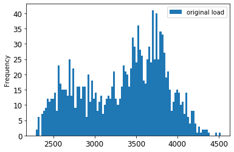
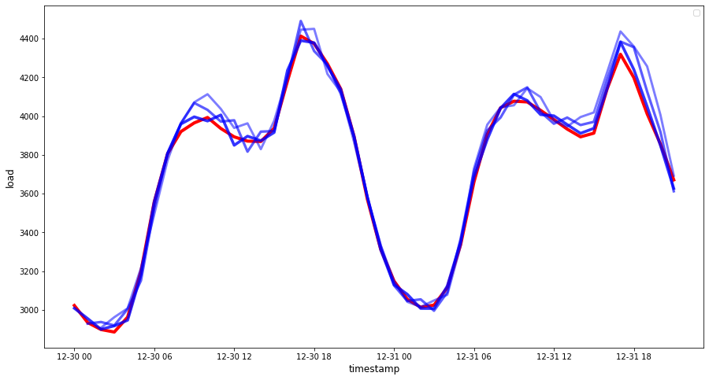

<!--
CO_OP_TRANSLATOR_METADATA:
{
  "original_hash": "2f400075e003e749fdb0d6b3b4787a99",
  "translation_date": "2025-08-29T20:38:54+00:00",
  "source_file": "7-TimeSeries/2-ARIMA/README.md",
  "language_code": "bn"
}
-->
# ARIMA দিয়ে টাইম সিরিজ পূর্বাভাস

পূর্ববর্তী পাঠে, আপনি টাইম সিরিজ পূর্বাভাস সম্পর্কে কিছু শিখেছেন এবং একটি ডেটাসেট লোড করেছেন যা একটি নির্দিষ্ট সময়কালে বৈদ্যুতিক লোডের ওঠানামা দেখায়।

[](https://youtu.be/IUSk-YDau10 "ARIMA মডেলের পরিচিতি")

> 🎥 উপরের ছবিতে ক্লিক করুন একটি ভিডিওর জন্য: ARIMA মডেলের সংক্ষিপ্ত পরিচিতি। উদাহরণটি R-এ করা হয়েছে, তবে ধারণাগুলি সার্বজনীন।

## [পূর্ব-লেকচার কুইজ](https://gray-sand-07a10f403.1.azurestaticapps.net/quiz/43/)

## পরিচিতি

এই পাঠে, আপনি [ARIMA: *A*uto*R*egressive *I*ntegrated *M*oving *A*verage](https://wikipedia.org/wiki/Autoregressive_integrated_moving_average) ব্যবহার করে মডেল তৈরি করার একটি নির্দিষ্ট পদ্ধতি আবিষ্কার করবেন। ARIMA মডেলগুলি বিশেষভাবে উপযুক্ত এমন ডেটার জন্য যা [non-stationarity](https://wikipedia.org/wiki/Stationary_process) প্রদর্শন করে।

## সাধারণ ধারণা

ARIMA নিয়ে কাজ করতে হলে কিছু ধারণা সম্পর্কে জানা দরকার:

- 🎓 **Stationarity**। পরিসংখ্যানগত প্রেক্ষাপটে, স্টেশনারিটি এমন ডেটাকে বোঝায় যার বিতরণ সময়ের সাথে পরিবর্তিত হয় না। Non-stationary ডেটা, তখন প্রবণতার কারণে ওঠানামা দেখায় যা বিশ্লেষণ করার জন্য রূপান্তরিত করতে হয়। উদাহরণস্বরূপ, মৌসুমীতা ডেটায় ওঠানামা আনতে পারে এবং এটি 'seasonal-differencing' প্রক্রিয়ার মাধ্যমে দূর করা যেতে পারে।

- 🎓 **[Differencing](https://wikipedia.org/wiki/Autoregressive_integrated_moving_average#Differencing)**। পরিসংখ্যানগত প্রেক্ষাপটে, ডেটাকে ডিফারেন্সিং করা বলতে non-stationary ডেটাকে রূপান্তরিত করে স্টেশনারি করা বোঝায়, এর non-constant প্রবণতা সরিয়ে। "ডিফারেন্সিং টাইম সিরিজের স্তরের পরিবর্তনগুলি সরিয়ে দেয়, প্রবণতা এবং মৌসুমীতা দূর করে এবং ফলস্বরূপ টাইম সিরিজের গড়কে স্থিতিশীল করে।" [Shixiong et al-এর পেপার](https://arxiv.org/abs/1904.07632)

## টাইম সিরিজের প্রেক্ষাপটে ARIMA

ARIMA-এর অংশগুলো বিশ্লেষণ করে দেখা যাক কীভাবে এটি টাইম সিরিজ মডেল করতে এবং পূর্বাভাস দিতে সাহায্য করে।

- **AR - AutoRegressive**। Autoregressive মডেলগুলি, নাম অনুসারে, ডেটার পূর্ববর্তী মানগুলিকে বিশ্লেষণ করতে এবং সেগুলোর উপর ভিত্তি করে অনুমান করতে 'পেছনে' তাকায়। এই পূর্ববর্তী মানগুলোকে 'lags' বলা হয়। উদাহরণস্বরূপ, মাসিক পেন্সিল বিক্রির ডেটা। প্রতিটি মাসের বিক্রির মোট পরিমাণ ডেটাসেটে একটি 'evolving variable' হিসেবে বিবেচিত হবে। এই মডেলটি তৈরি হয় যেখানে "evolving variable of interest তার নিজস্ব lagged (অর্থাৎ, পূর্ববর্তী) মানগুলোর উপর ভিত্তি করে রিগ্রেস করা হয়।" [wikipedia](https://wikipedia.org/wiki/Autoregressive_integrated_moving_average)

- **I - Integrated**। 'ARMA' মডেলের সাথে তুলনামূলকভাবে, ARIMA-তে 'I' তার *[integrated](https://wikipedia.org/wiki/Order_of_integration)* দিকটি বোঝায়। ডিফারেন্সিং ধাপগুলো প্রয়োগ করে ডেটাকে 'ইন্টিগ্রেটেড' করা হয় যাতে non-stationarity দূর করা যায়।

- **MA - Moving Average**। এই মডেলের [moving-average](https://wikipedia.org/wiki/Moving-average_model) দিকটি বর্তমান এবং পূর্ববর্তী lag মানগুলো পর্যবেক্ষণ করে আউটপুট ভেরিয়েবল নির্ধারণ করে।

মূল কথা: ARIMA ব্যবহার করা হয় টাইম সিরিজ ডেটার বিশেষ ফর্মের সাথে যতটা সম্ভব ঘনিষ্ঠভাবে মডেল ফিট করার জন্য।

## অনুশীলন - একটি ARIMA মডেল তৈরি করুন

এই পাঠের [_/working_](https://github.com/microsoft/ML-For-Beginners/tree/main/7-TimeSeries/2-ARIMA/working) ফোল্ডার খুলুন এবং [_notebook.ipynb_](https://github.com/microsoft/ML-For-Beginners/blob/main/7-TimeSeries/2-ARIMA/working/notebook.ipynb) ফাইলটি খুঁজুন।

1. `statsmodels` Python লাইব্রেরি লোড করতে নোটবুক চালান; ARIMA মডেলের জন্য এটি প্রয়োজন।

1. প্রয়োজনীয় লাইব্রেরি লোড করুন।

1. এখন, ডেটা প্লট করার জন্য আরও কিছু দরকারী লাইব্রেরি লোড করুন:

    ```python
    import os
    import warnings
    import matplotlib.pyplot as plt
    import numpy as np
    import pandas as pd
    import datetime as dt
    import math

    from pandas.plotting import autocorrelation_plot
    from statsmodels.tsa.statespace.sarimax import SARIMAX
    from sklearn.preprocessing import MinMaxScaler
    from common.utils import load_data, mape
    from IPython.display import Image

    %matplotlib inline
    pd.options.display.float_format = '{:,.2f}'.format
    np.set_printoptions(precision=2)
    warnings.filterwarnings("ignore") # specify to ignore warning messages
    ```

1. `/data/energy.csv` ফাইল থেকে ডেটা একটি Pandas ডেটাফ্রেমে লোড করুন এবং দেখুন:

    ```python
    energy = load_data('./data')[['load']]
    energy.head(10)
    ```

1. জানুয়ারি 2012 থেকে ডিসেম্বর 2014 পর্যন্ত সমস্ত উপলব্ধ এনার্জি ডেটা প্লট করুন। এখানে কোনো চমক থাকবে না কারণ আমরা এই ডেটা আগের পাঠে দেখেছি:

    ```python
    energy.plot(y='load', subplots=True, figsize=(15, 8), fontsize=12)
    plt.xlabel('timestamp', fontsize=12)
    plt.ylabel('load', fontsize=12)
    plt.show()
    ```

    এখন, একটি মডেল তৈরি করা যাক!

### ট্রেনিং এবং টেস্টিং ডেটাসেট তৈরি করুন

এখন আপনার ডেটা লোড হয়েছে, তাই আপনি এটি ট্রেন এবং টেস্ট সেটে ভাগ করতে পারেন। আপনি আপনার মডেলটি ট্রেন সেটে প্রশিক্ষণ দেবেন। সাধারণত, মডেলটি প্রশিক্ষণ শেষ করার পরে, আপনি টেস্ট সেট ব্যবহার করে এর সঠিকতা মূল্যায়ন করবেন। নিশ্চিত করুন যে টেস্ট সেটটি ট্রেন সেটের চেয়ে পরবর্তী সময়কালকে কভার করে যাতে মডেল ভবিষ্যতের সময়কাল থেকে তথ্য না পায়।

1. সেপ্টেম্বর 1 থেকে অক্টোবর 31, 2014 পর্যন্ত দুই মাসের সময়কাল ট্রেন সেটে বরাদ্দ করুন। টেস্ট সেটে নভেম্বর 1 থেকে ডিসেম্বর 31, 2014 পর্যন্ত দুই মাসের সময়কাল অন্তর্ভুক্ত থাকবে:

    ```python
    train_start_dt = '2014-11-01 00:00:00'
    test_start_dt = '2014-12-30 00:00:00'
    ```

    যেহেতু এই ডেটা দৈনিক এনার্জি ব্যবহারের প্রতিফলন করে, তাই এখানে একটি শক্তিশালী মৌসুমী প্যাটার্ন রয়েছে, তবে সাম্প্রতিক দিনের ব্যবহারের সাথে সবচেয়ে বেশি মিল রয়েছে।

1. পার্থক্যগুলো ভিজ্যুয়ালাইজ করুন:

    ```python
    energy[(energy.index < test_start_dt) & (energy.index >= train_start_dt)][['load']].rename(columns={'load':'train'}) \
        .join(energy[test_start_dt:][['load']].rename(columns={'load':'test'}), how='outer') \
        .plot(y=['train', 'test'], figsize=(15, 8), fontsize=12)
    plt.xlabel('timestamp', fontsize=12)
    plt.ylabel('load', fontsize=12)
    plt.show()
    ```

    

    সুতরাং, ডেটা প্রশিক্ষণের জন্য একটি তুলনামূলকভাবে ছোট সময় উইন্ডো ব্যবহার করা যথেষ্ট হওয়া উচিত।

    > নোট: যেহেতু আমরা ARIMA মডেল ফিট করার জন্য যে ফাংশনটি ব্যবহার করি তা ফিটিংয়ের সময় ইন-স্যাম্পল ভ্যালিডেশন ব্যবহার করে, আমরা ভ্যালিডেশন ডেটা বাদ দেব।

### ট্রেনিংয়ের জন্য ডেটা প্রস্তুত করুন

এখন, আপনাকে ডেটা ফিল্টারিং এবং স্কেলিংয়ের মাধ্যমে ট্রেনিংয়ের জন্য প্রস্তুত করতে হবে। আপনার ডেটাসেটটি শুধুমাত্র প্রয়োজনীয় সময়কাল এবং কলামগুলো অন্তর্ভুক্ত করতে ফিল্টার করুন এবং ডেটাকে 0,1 এর মধ্যে প্রজেক্ট করার জন্য স্কেলিং করুন।

1. মূল ডেটাসেটটি শুধুমাত্র উল্লেখিত সময়কাল এবং সেট অনুযায়ী প্রয়োজনীয় কলাম 'load' এবং তারিখ অন্তর্ভুক্ত করতে ফিল্টার করুন:

    ```python
    train = energy.copy()[(energy.index >= train_start_dt) & (energy.index < test_start_dt)][['load']]
    test = energy.copy()[energy.index >= test_start_dt][['load']]

    print('Training data shape: ', train.shape)
    print('Test data shape: ', test.shape)
    ```

    আপনি ডেটার আকার দেখতে পারেন:

    ```output
    Training data shape:  (1416, 1)
    Test data shape:  (48, 1)
    ```

1. ডেটাকে (0, 1) পরিসরে স্কেল করুন।

    ```python
    scaler = MinMaxScaler()
    train['load'] = scaler.fit_transform(train)
    train.head(10)
    ```

1. মূল বনাম স্কেল করা ডেটা ভিজ্যুয়ালাইজ করুন:

    ```python
    energy[(energy.index >= train_start_dt) & (energy.index < test_start_dt)][['load']].rename(columns={'load':'original load'}).plot.hist(bins=100, fontsize=12)
    train.rename(columns={'load':'scaled load'}).plot.hist(bins=100, fontsize=12)
    plt.show()
    ```

    

    > মূল ডেটা

    

    > স্কেল করা ডেটা

1. এখন আপনি স্কেল করা ডেটা ক্যালিব্রেট করেছেন, আপনি টেস্ট ডেটা স্কেল করতে পারেন:

    ```python
    test['load'] = scaler.transform(test)
    test.head()
    ```

### ARIMA বাস্তবায়ন করুন

এখন ARIMA বাস্তবায়নের সময়! আপনি আগে ইনস্টল করা `statsmodels` লাইব্রেরি ব্যবহার করবেন।

এখন আপনাকে কয়েকটি ধাপ অনুসরণ করতে হবে:

   1. `SARIMAX()` কল করে এবং মডেল প্যারামিটারগুলো: p, d, এবং q প্যারামিটার, এবং P, D, এবং Q প্যারামিটার পাস করে মডেলটি সংজ্ঞায়িত করুন।
   2. `fit()` ফাংশন কল করে ট্রেনিং ডেটার জন্য মডেল প্রস্তুত করুন।
   3. `forecast()` ফাংশন কল করে এবং পূর্বাভাসের ধাপের সংখ্যা (হরাইজন) নির্দিষ্ট করে পূর্বাভাস তৈরি করুন।

> 🎓 এই প্যারামিটারগুলো কী জন্য? একটি ARIMA মডেলে 3টি প্যারামিটার থাকে যা টাইম সিরিজের প্রধান দিকগুলো মডেল করতে সাহায্য করে: মৌসুমীতা, প্রবণতা, এবং শব্দ। এই প্যারামিটারগুলো হলো:

`p`: মডেলের auto-regressive অংশের সাথে সম্পর্কিত প্যারামিটার, যা *পূর্ববর্তী* মানগুলো অন্তর্ভুক্ত করে।
`d`: মডেলের integrated অংশের সাথে সম্পর্কিত প্যারামিটার, যা টাইম সিরিজে *differencing* (🎓 ডিফারেন্সিং মনে আছে 👆?) প্রয়োগের পরিমাণকে প্রভাবিত করে।
`q`: মডেলের moving-average অংশের সাথে সম্পর্কিত প্যারামিটার।

> নোট: যদি আপনার ডেটায় মৌসুমী দিক থাকে - যেমন এই ডেটায় আছে - , তাহলে আমরা একটি seasonal ARIMA মডেল (SARIMA) ব্যবহার করি। এই ক্ষেত্রে আপনাকে আরেকটি প্যারামিটার সেট ব্যবহার করতে হবে: `P`, `D`, এবং `Q` যা `p`, `d`, এবং `q` এর মতো একই সম্পর্ক বর্ণনা করে, তবে মডেলের মৌসুমী উপাদানগুলোর সাথে সম্পর্কিত।

1. আপনার পছন্দের হরাইজন মান সেট করুন। চলুন 3 ঘণ্টা চেষ্টা করি:

    ```python
    # Specify the number of steps to forecast ahead
    HORIZON = 3
    print('Forecasting horizon:', HORIZON, 'hours')
    ```

    ARIMA মডেলের প্যারামিটারগুলোর সেরা মান নির্বাচন করা চ্যালেঞ্জিং হতে পারে কারণ এটি কিছুটা বিষয়ভিত্তিক এবং সময়সাপেক্ষ। আপনি [`pyramid` লাইব্রেরি](https://alkaline-ml.com/pmdarima/0.9.0/modules/generated/pyramid.arima.auto_arima.html) থেকে `auto_arima()` ফাংশন ব্যবহার করার কথা বিবেচনা করতে পারেন।

1. আপাতত কিছু ম্যানুয়াল নির্বাচন চেষ্টা করুন একটি ভালো মডেল খুঁজে পেতে।

    ```python
    order = (4, 1, 0)
    seasonal_order = (1, 1, 0, 24)

    model = SARIMAX(endog=train, order=order, seasonal_order=seasonal_order)
    results = model.fit()

    print(results.summary())
    ```

    একটি ফলাফলের টেবিল প্রিন্ট করা হয়।

আপনি আপনার প্রথম মডেল তৈরি করেছেন! এখন এটি মূল্যায়নের একটি উপায় খুঁজে বের করতে হবে।

### আপনার মডেল মূল্যায়ন করুন

আপনার মডেল মূল্যায়ন করতে, আপনি তথাকথিত `walk forward` ভ্যালিডেশন করতে পারেন। বাস্তবে, টাইম সিরিজ মডেলগুলো প্রতিবার নতুন ডেটা উপলব্ধ হলে পুনরায় প্রশিক্ষণ দেওয়া হয়। এটি মডেলকে প্রতিটি সময় ধাপে সেরা পূর্বাভাস দিতে সক্ষম করে।

টাইম সিরিজের শুরু থেকে এই কৌশল ব্যবহার করে, ট্রেন ডেটা সেটে মডেলটি প্রশিক্ষণ দিন। তারপর পরবর্তী সময় ধাপে একটি পূর্বাভাস তৈরি করুন। পূর্বাভাসটি পরিচিত মানের সাথে মূল্যায়ন করা হয়। তারপর ট্রেনিং সেটটি পরিচিত মানটি অন্তর্ভুক্ত করতে প্রসারিত করা হয় এবং প্রক্রিয়াটি পুনরাবৃত্তি করা হয়।

> নোট: আরও দক্ষ প্রশিক্ষণের জন্য আপনার ট্রেনিং সেট উইন্ডো স্থির রাখা উচিত যাতে আপনি প্রতিবার ট্রেনিং সেটে একটি নতুন পর্যবেক্ষণ যোগ করেন, আপনি সেটের শুরু থেকে পর্যবেক্ষণটি সরিয়ে ফেলেন।

এই প্রক্রিয়াটি মডেলটি বাস্তবে কীভাবে কাজ করবে তার আরও শক্তিশালী অনুমান প্রদান করে। তবে, এটি এতগুলো মডেল তৈরি করার গণনা খরচে আসে। যদি ডেটা ছোট হয় বা মডেলটি সহজ হয় তবে এটি গ্রহণযোগ্য, তবে স্কেলে এটি একটি সমস্যা হতে পারে।

Walk-forward validation টাইম সিরিজ মডেল মূল্যায়নের সোনার মান এবং এটি আপনার নিজস্ব প্রকল্পগুলোর জন্য সুপারিশ করা হয়।

1. প্রথমে, প্রতিটি HORIZON ধাপে একটি টেস্ট ডেটা পয়েন্ট তৈরি করুন।

    ```python
    test_shifted = test.copy()

    for t in range(1, HORIZON+1):
        test_shifted['load+'+str(t)] = test_shifted['load'].shift(-t, freq='H')

    test_shifted = test_shifted.dropna(how='any')
    test_shifted.head(5)
    ```

    |            |          | load | load+1 | load+2 |
    | ---------- | -------- | ---- | ------ | ------ |
    | 2014-12-30 | 00:00:00 | 0.33 | 0.29   | 0.27   |
    | 2014-12-30 | 01:00:00 | 0.29 | 0.27   | 0.27   |
    | 2014-12-30 | 02:00:00 | 0.27 | 0.27   | 0.30   |
    | 2014-12-30 | 03:00:00 | 0.27 | 0.30   | 0.41   |
    | 2014-12-30 | 04:00:00 | 0.30 | 0.41   | 0.57   |

    ডেটা তার horizon পয়েন্ট অনুযায়ী অনুভূমিকভাবে স্থানান্তরিত হয়।

1. এই স্লাইডিং উইন্ডো পদ্ধতি ব্যবহার করে টেস্ট ডেটায় পূর্বাভাস তৈরি করুন টেস্ট ডেটার দৈর্ঘ্যের আকারে একটি লুপে:

    ```python
    %%time
    training_window = 720 # dedicate 30 days (720 hours) for training

    train_ts = train['load']
    test_ts = test_shifted

    history = [x for x in train_ts]
    history = history[(-training_window):]

    predictions = list()

    order = (2, 1, 0)
    seasonal_order = (1, 1, 0, 24)

    for t in range(test_ts.shape[0]):
        model = SARIMAX(endog=history, order=order, seasonal_order=seasonal_order)
        model_fit = model.fit()
        yhat = model_fit.forecast(steps = HORIZON)
        predictions.append(yhat)
        obs = list(test_ts.iloc[t])
        # move the training window
        history.append(obs[0])
        history.pop(0)
        print(test_ts.index[t])
        print(t+1, ': predicted =', yhat, 'expected =', obs)
    ```

    আপনি প্রশিক্ষণটি ঘটতে দেখতে পারেন:

    ```output
    2014-12-30 00:00:00
    1 : predicted = [0.32 0.29 0.28] expected = [0.32945389435989236, 0.2900626678603402, 0.2739480752014323]

    2014-12-30 01:00:00
    2 : predicted = [0.3  0.29 0.3 ] expected = [0.2900626678603402, 0.2739480752014323, 0.26812891674127126]

    2014-12-30 02:00:00
    3 : predicted = [0.27 0.28 0.32] expected = [0.2739480752014323, 0.26812891674127126, 0.3025962399283795]
    ```

1. পূর্বাভাসগুলোকে প্রকৃত লোডের সাথে তুলনা করুন:

    ```python
    eval_df = pd.DataFrame(predictions, columns=['t+'+str(t) for t in range(1, HORIZON+1)])
    eval_df['timestamp'] = test.index[0:len(test.index)-HORIZON+1]
    eval_df = pd.melt(eval_df, id_vars='timestamp', value_name='prediction', var_name='h')
    eval_df['actual'] = np.array(np.transpose(test_ts)).ravel()
    eval_df[['prediction', 'actual']] = scaler.inverse_transform(eval_df[['prediction', 'actual']])
    eval_df.head()
    ```

    আউটপুট
    |     |            | timestamp | h   | prediction | actual   |
    | --- | ---------- | --------- | --- | ---------- | -------- |
    | 0   | 2014-12-30 | 00:00:00  | t+1 | 3,008.74   | 3,023.00 |
    | 1   | 2014-12-30 | 01:00:00  | t+1 | 2,955.53   | 2,935.00 |
    | 2   | 2014-12-30 | 02:00:00  | t+1 | 2,900.17   | 2,899.00 |
    | 3   | 2014-12-30 | 03:00:00  | t+1 | 2,917.69   | 2,886.00 |
    | 4   | 2014-12-30 | 04:00:00  | t+1 | 2,946.99   | 2,963.00 |

    ঘণ্টাভিত্তিক ডেটার পূর্বাভাস দেখুন, প্রকৃত লোডের সাথে তুলনা করুন। এটি কতটা সঠিক?

### মডেলের সঠিকতা পরীক্ষা করুন

আপনার মডেলের সঠিকতা পরীক্ষা করুন সমস্ত পূর্বাভাসের উপর এর mean absolute percentage error (MAPE) পরীক্ষা করে।
> **🧮 গণিত দেখুন**
>
> 
>
> [MAPE](https://www.linkedin.com/pulse/what-mape-mad-msd-time-series-allameh-statistics/) ব্যবহার করা হয় পূর্বাভাসের সঠিকতা একটি অনুপাত হিসেবে দেখানোর জন্য, যা উপরের সূত্র দ্বারা সংজ্ঞায়িত। প্রকৃত এবং পূর্বাভাসিত মানের পার্থক্য প্রকৃত মান দ্বারা ভাগ করা হয়। 
>
> "এই গণনায় প্রাপ্ত মানের পরম মান প্রতিটি পূর্বাভাসিত সময় বিন্দুর জন্য যোগ করা হয় এবং ফিট করা বিন্দুর সংখ্যা n দ্বারা ভাগ করা হয়।" [wikipedia](https://wikipedia.org/wiki/Mean_absolute_percentage_error)
1. কোডে সমীকরণ প্রকাশ করুন:

    ```python
    if(HORIZON > 1):
        eval_df['APE'] = (eval_df['prediction'] - eval_df['actual']).abs() / eval_df['actual']
        print(eval_df.groupby('h')['APE'].mean())
    ```

1. এক ধাপের MAPE গণনা করুন:

    ```python
    print('One step forecast MAPE: ', (mape(eval_df[eval_df['h'] == 't+1']['prediction'], eval_df[eval_df['h'] == 't+1']['actual']))*100, '%')
    ```

    এক ধাপের পূর্বাভাস MAPE:  0.5570581332313952 %

1. বহু ধাপের পূর্বাভাস MAPE প্রিন্ট করুন:

    ```python
    print('Multi-step forecast MAPE: ', mape(eval_df['prediction'], eval_df['actual'])*100, '%')
    ```

    ```output
    Multi-step forecast MAPE:  1.1460048657704118 %
    ```

    একটি সুন্দর কম সংখ্যা সর্বোত্তম: মনে রাখুন, যদি পূর্বাভাসের MAPE 10 হয়, তবে এটি 10% দ্বারা ভুল।

1. তবে সবসময়ই, এই ধরনের সঠিকতা পরিমাপ দৃশ্যত দেখা সহজ, তাই চলুন এটি প্লট করি:

    ```python
     if(HORIZON == 1):
        ## Plotting single step forecast
        eval_df.plot(x='timestamp', y=['actual', 'prediction'], style=['r', 'b'], figsize=(15, 8))

    else:
        ## Plotting multi step forecast
        plot_df = eval_df[(eval_df.h=='t+1')][['timestamp', 'actual']]
        for t in range(1, HORIZON+1):
            plot_df['t+'+str(t)] = eval_df[(eval_df.h=='t+'+str(t))]['prediction'].values

        fig = plt.figure(figsize=(15, 8))
        ax = plt.plot(plot_df['timestamp'], plot_df['actual'], color='red', linewidth=4.0)
        ax = fig.add_subplot(111)
        for t in range(1, HORIZON+1):
            x = plot_df['timestamp'][(t-1):]
            y = plot_df['t+'+str(t)][0:len(x)]
            ax.plot(x, y, color='blue', linewidth=4*math.pow(.9,t), alpha=math.pow(0.8,t))

        ax.legend(loc='best')

    plt.xlabel('timestamp', fontsize=12)
    plt.ylabel('load', fontsize=12)
    plt.show()
    ```

    

🏆 একটি খুব সুন্দর প্লট, যা একটি ভালো সঠিকতার মডেল দেখাচ্ছে। খুব ভালো কাজ!

---

## 🚀চ্যালেঞ্জ

টাইম সিরিজ মডেলের সঠিকতা পরীক্ষা করার বিভিন্ন পদ্ধতি নিয়ে গবেষণা করুন। এই পাঠে আমরা MAPE নিয়ে আলোচনা করেছি, তবে আপনি কি অন্য পদ্ধতি ব্যবহার করতে পারেন? সেগুলো গবেষণা করুন এবং ব্যাখ্যা করুন। একটি সহায়ক ডকুমেন্ট [এখানে](https://otexts.com/fpp2/accuracy.html) পাওয়া যাবে।

## [পোস্ট-লেকচার কুইজ](https://gray-sand-07a10f403.1.azurestaticapps.net/quiz/44/)

## পর্যালোচনা ও স্ব-অধ্যয়ন

এই পাঠে ARIMA দিয়ে টাইম সিরিজ পূর্বাভাসের শুধুমাত্র মৌলিক বিষয়গুলো আলোচনা করা হয়েছে। [এই রিপোজিটরি](https://microsoft.github.io/forecasting/) এবং এর বিভিন্ন মডেল টাইপ নিয়ে গবেষণা করে টাইম সিরিজ মডেল তৈরির অন্যান্য পদ্ধতি শিখে আপনার জ্ঞান আরও গভীর করুন।

## অ্যাসাইনমেন্ট

[একটি নতুন ARIMA মডেল](assignment.md)

---

**অস্বীকৃতি**:  
এই নথিটি AI অনুবাদ পরিষেবা [Co-op Translator](https://github.com/Azure/co-op-translator) ব্যবহার করে অনুবাদ করা হয়েছে। আমরা যথাসম্ভব সঠিক অনুবাদের চেষ্টা করি, তবে অনুগ্রহ করে মনে রাখবেন যে স্বয়ংক্রিয় অনুবাদে ত্রুটি বা অসঙ্গতি থাকতে পারে। নথিটির মূল ভাষায় রচিত সংস্করণটিকেই প্রামাণিক উৎস হিসেবে বিবেচনা করা উচিত। গুরুত্বপূর্ণ তথ্যের জন্য, পেশাদার মানব অনুবাদ ব্যবহার করার পরামর্শ দেওয়া হচ্ছে। এই অনুবাদ ব্যবহারের ফলে সৃষ্ট কোনো ভুল বোঝাবুঝি বা ভুল ব্যাখ্যার জন্য আমরা দায়ী নই।