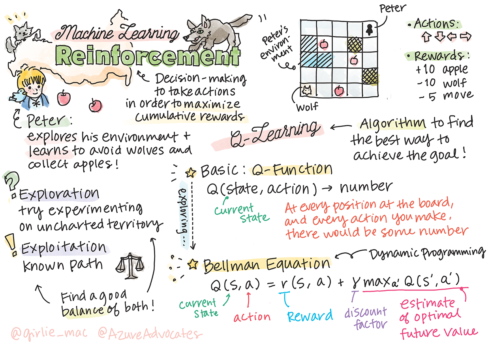

<!--
CO_OP_TRANSLATOR_METADATA:
{
  "original_hash": "0ffe994d1cc881bdeb49226a064116e5",
  "translation_date": "2025-08-29T22:04:03+00:00",
  "source_file": "8-Reinforcement/1-QLearning/README.md",
  "language_code": "bn"
}
-->
# রিইনফোর্সমেন্ট লার্নিং এবং কিউ-লার্নিং এর পরিচিতি


> স্কেচনোট: [Tomomi Imura](https://www.twitter.com/girlie_mac)

রিইনফোর্সমেন্ট লার্নিং তিনটি গুরুত্বপূর্ণ ধারণার উপর ভিত্তি করে কাজ করে: এজেন্ট, কিছু স্টেট এবং প্রতিটি স্টেটের জন্য একটি অ্যাকশনের সেট। নির্দিষ্ট স্টেটে একটি অ্যাকশন সম্পাদন করার মাধ্যমে, এজেন্ট একটি রিওয়ার্ড পায়। আবার কল্পনা করুন কম্পিউটার গেম সুপার মারিও। আপনি মারিও, আপনি একটি গেম লেভেলে আছেন, একটি খাদের কিনারায় দাঁড়িয়ে। আপনার উপরে একটি কয়েন। আপনি মারিও হিসেবে, একটি গেম লেভেলে, একটি নির্দিষ্ট অবস্থানে আছেন ... এটিই আপনার স্টেট। ডানদিকে এক ধাপ এগোনো (একটি অ্যাকশন) আপনাকে খাদে ফেলে দেবে, এবং এটি আপনাকে একটি কম সংখ্যাসূচক স্কোর দেবে। তবে, জাম্প বাটন চাপলে আপনি একটি পয়েন্ট পাবেন এবং বেঁচে থাকবেন। এটি একটি ইতিবাচক ফলাফল এবং এটি আপনাকে একটি ইতিবাচক সংখ্যাসূচক স্কোর দেবে।

রিইনফোর্সমেন্ট লার্নিং এবং একটি সিমুলেটর (গেম) ব্যবহার করে, আপনি গেমটি খেলার কৌশল শিখতে পারেন যাতে আপনি বেঁচে থাকতে পারেন এবং যত বেশি সম্ভব পয়েন্ট অর্জন করতে পারেন।

[](https://www.youtube.com/watch?v=lDq_en8RNOo)

> 🎥 উপরের ছবিতে ক্লিক করে Dmitry এর রিইনফোর্সমেন্ট লার্নিং নিয়ে আলোচনা শুনুন

## [পূর্ব-লেকচার কুইজ](https://gray-sand-07a10f403.1.azurestaticapps.net/quiz/45/)

## প্রয়োজনীয়তা এবং সেটআপ

এই পাঠে, আমরা পাইথন কোড নিয়ে কিছু পরীক্ষা করব। আপনাকে এই পাঠের জুপিটার নোটবুক কোড চালাতে সক্ষম হতে হবে, হয় আপনার কম্পিউটারে অথবা ক্লাউডে।

আপনি [পাঠের নোটবুকটি](https://github.com/microsoft/ML-For-Beginners/blob/main/8-Reinforcement/1-QLearning/notebook.ipynb) খুলে এই পাঠটি অনুসরণ করতে পারেন।

> **নোট:** যদি আপনি ক্লাউড থেকে এই কোডটি খুলে থাকেন, তবে আপনাকে [`rlboard.py`](https://github.com/microsoft/ML-For-Beginners/blob/main/8-Reinforcement/1-QLearning/rlboard.py) ফাইলটিও আনতে হবে, যা নোটবুক কোডে ব্যবহৃত হয়। এটি নোটবুকের একই ডিরেক্টরিতে যোগ করুন।

## পরিচিতি

এই পাঠে, আমরা **[Peter and the Wolf](https://en.wikipedia.org/wiki/Peter_and_the_Wolf)** এর জগৎ অন্বেষণ করব, যা রাশিয়ান সুরকার [Sergei Prokofiev](https://en.wikipedia.org/wiki/Sergei_Prokofiev) এর একটি সঙ্গীতধর্মী রূপকথা দ্বারা অনুপ্রাণিত। আমরা **রিইনফোর্সমেন্ট লার্নিং** ব্যবহার করব যাতে পিটার তার পরিবেশ অন্বেষণ করতে পারে, সুস্বাদু আপেল সংগ্রহ করতে পারে এবং নেকড়ের সাথে দেখা এড়াতে পারে।

**রিইনফোর্সমেন্ট লার্নিং** (RL) একটি শেখার কৌশল যা আমাদেরকে একটি **এজেন্ট** এর **পরিবেশে** একটি সর্বোত্তম আচরণ শেখার সুযোগ দেয়, অনেক পরীক্ষা চালানোর মাধ্যমে। এই পরিবেশে একটি এজেন্টের একটি **লক্ষ্য** থাকা উচিত, যা একটি **রিওয়ার্ড ফাংশন** দ্বারা সংজ্ঞায়িত।

## পরিবেশ

সরলতার জন্য, পিটারের জগৎকে একটি `width` x `height` আকারের বর্গাকার বোর্ড হিসেবে বিবেচনা করা যাক, যেমন:


এই বোর্ডের প্রতিটি সেল হতে পারে:

* **মাটি**, যেখানে পিটার এবং অন্যান্য প্রাণীরা হাঁটতে পারে।
* **পানি**, যেখানে হাঁটা সম্ভব নয়।
* একটি **গাছ** বা **ঘাস**, যেখানে বিশ্রাম নেওয়া যায়।
* একটি **আপেল**, যা পিটারের জন্য খাওয়ার উপযোগী।
* একটি **নেকড়ে**, যা বিপজ্জনক এবং এড়িয়ে চলা উচিত।

একটি পৃথক পাইথন মডিউল, [`rlboard.py`](https://github.com/microsoft/ML-For-Beginners/blob/main/8-Reinforcement/1-QLearning/rlboard.py), এই পরিবেশের সাথে কাজ করার কোড ধারণ করে। যেহেতু এই কোডটি আমাদের ধারণাগুলি বোঝার জন্য গুরুত্বপূর্ণ নয়, আমরা মডিউলটি ইমপোর্ট করব এবং একটি নমুনা বোর্ড তৈরি করতে এটি ব্যবহার করব (কোড ব্লক 1):

```python
from rlboard import *

width, height = 8,8
m = Board(width,height)
m.randomize(seed=13)
m.plot()
```

এই কোডটি পরিবেশের একটি ছবি প্রিন্ট করবে যা উপরের ছবির মতো।

## অ্যাকশন এবং পলিসি

আমাদের উদাহরণে, পিটারের লক্ষ্য হবে আপেল খুঁজে পাওয়া, নেকড়ে এবং অন্যান্য বাধা এড়িয়ে। এটি করতে, সে মূলত হাঁটতে পারে যতক্ষণ না সে একটি আপেল খুঁজে পায়।

তাই, যেকোনো অবস্থানে, সে নিম্নলিখিত অ্যাকশনগুলির মধ্যে একটি বেছে নিতে পারে: উপরে, নিচে, বামে এবং ডানে।

আমরা এই অ্যাকশনগুলোকে একটি ডিকশনারি হিসেবে সংজ্ঞায়িত করব এবং সংশ্লিষ্ট কোঅর্ডিনেট পরিবর্তনের সাথে ম্যাপ করব। উদাহরণস্বরূপ, ডানে সরানো (`R`) একটি জোড়া `(1,0)` এর সাথে সম্পর্কিত হবে। (কোড ব্লক 2):

```python
actions = { "U" : (0,-1), "D" : (0,1), "L" : (-1,0), "R" : (1,0) }
action_idx = { a : i for i,a in enumerate(actions.keys()) }
```

এই পরিস্থিতির কৌশল এবং লক্ষ্য সংক্ষেপে নিম্নরূপ:

- **কৌশল**, আমাদের এজেন্টের (পিটার) একটি **পলিসি** দ্বারা সংজ্ঞায়িত। একটি পলিসি হলো একটি ফাংশন যা যেকোনো প্রদত্ত স্টেটে অ্যাকশন প্রদান করে। আমাদের ক্ষেত্রে, সমস্যার স্টেট বোর্ড দ্বারা উপস্থাপিত, যার মধ্যে প্লেয়ারের বর্তমান অবস্থান অন্তর্ভুক্ত।

- **লক্ষ্য**, রিইনফোর্সমেন্ট লার্নিং এর উদ্দেশ্য হলো একটি ভালো পলিসি শেখা যা আমাদের সমস্যাটি দক্ষতার সাথে সমাধান করতে সাহায্য করবে। তবে, একটি বেসলাইন হিসেবে, আসুন **র‍্যান্ডম ওয়াক** নামে একটি সহজ পলিসি বিবেচনা করি।

## র‍্যান্ডম ওয়াক

প্রথমে, আসুন র‍্যান্ডম ওয়াক কৌশলটি বাস্তবায়ন করি। র‍্যান্ডম ওয়াকের মাধ্যমে, আমরা অনুমোদিত অ্যাকশনগুলির মধ্যে থেকে এলোমেলোভাবে পরবর্তী অ্যাকশনটি বেছে নেব, যতক্ষণ না আমরা আপেল খুঁজে পাই (কোড ব্লক 3)।

1. নিচের কোড দিয়ে র‍্যান্ডম ওয়াক বাস্তবায়ন করুন:

    ```python
    def random_policy(m):
        return random.choice(list(actions))
    
    def walk(m,policy,start_position=None):
        n = 0 # number of steps
        # set initial position
        if start_position:
            m.human = start_position 
        else:
            m.random_start()
        while True:
            if m.at() == Board.Cell.apple:
                return n # success!
            if m.at() in [Board.Cell.wolf, Board.Cell.water]:
                return -1 # eaten by wolf or drowned
            while True:
                a = actions[policy(m)]
                new_pos = m.move_pos(m.human,a)
                if m.is_valid(new_pos) and m.at(new_pos)!=Board.Cell.water:
                    m.move(a) # do the actual move
                    break
            n+=1
    
    walk(m,random_policy)
    ```

    `walk` ফাংশনের কলটি সংশ্লিষ্ট পথের দৈর্ঘ্য ফেরত দেবে, যা এক রান থেকে অন্য রানে পরিবর্তিত হতে পারে।

1. ওয়াক পরীক্ষাটি একাধিকবার (ধরা যাক, 100 বার) চালান এবং ফলাফল পরিসংখ্যান প্রিন্ট করুন (কোড ব্লক 4):

    ```python
    def print_statistics(policy):
        s,w,n = 0,0,0
        for _ in range(100):
            z = walk(m,policy)
            if z<0:
                w+=1
            else:
                s += z
                n += 1
        print(f"Average path length = {s/n}, eaten by wolf: {w} times")
    
    print_statistics(random_policy)
    ```

    লক্ষ্য করুন যে একটি পথের গড় দৈর্ঘ্য প্রায় 30-40 ধাপ, যা বেশ দীর্ঘ, কারণ গড় দূরত্ব আপেলের কাছাকাছি প্রায় 5-6 ধাপ।

    আপনি পিটারের র‍্যান্ডম ওয়াক চলাকালীন গতিবিধি দেখতে পারেন:

    

## রিওয়ার্ড ফাংশন

আমাদের পলিসিকে আরও বুদ্ধিমান করতে, আমাদের বুঝতে হবে কোন পদক্ষেপগুলো অন্যগুলোর চেয়ে "ভালো"। এটি করতে, আমাদের লক্ষ্য সংজ্ঞায়িত করতে হবে।

লক্ষ্যটি একটি **রিওয়ার্ড ফাংশন** এর মাধ্যমে সংজ্ঞায়িত করা যেতে পারে, যা প্রতিটি স্টেটের জন্য একটি স্কোর মান প্রদান করবে। সংখ্যাটি যত বেশি হবে, রিওয়ার্ড ফাংশন তত ভালো। (কোড ব্লক 5)

```python
move_reward = -0.1
goal_reward = 10
end_reward = -10

def reward(m,pos=None):
    pos = pos or m.human
    if not m.is_valid(pos):
        return end_reward
    x = m.at(pos)
    if x==Board.Cell.water or x == Board.Cell.wolf:
        return end_reward
    if x==Board.Cell.apple:
        return goal_reward
    return move_reward
```

রিওয়ার্ড ফাংশনগুলোর একটি আকর্ষণীয় দিক হলো বেশিরভাগ ক্ষেত্রে, *আমরা শুধুমাত্র গেমের শেষে একটি উল্লেখযোগ্য রিওয়ার্ড পাই*। এর মানে হলো আমাদের অ্যালগরিদমকে "ভালো" পদক্ষেপগুলো মনে রাখতে হবে যা শেষের দিকে একটি ইতিবাচক রিওয়ার্ডে নিয়ে যায় এবং তাদের গুরুত্ব বাড়াতে হবে। একইভাবে, যেসব পদক্ষেপ খারাপ ফলাফলে নিয়ে যায় সেগুলো নিরুৎসাহিত করতে হবে।

## কিউ-লার্নিং

আমরা এখানে যে অ্যালগরিদমটি আলোচনা করব সেটি হলো **কিউ-লার্নিং**। এই অ্যালগরিদমে, পলিসি একটি ফাংশন (বা একটি ডেটা স্ট্রাকচার) দ্বারা সংজ্ঞায়িত, যাকে **কিউ-টেবিল** বলা হয়। এটি একটি প্রদত্ত স্টেটে প্রতিটি অ্যাকশনের "ভালত্ব" রেকর্ড করে।

এটিকে কিউ-টেবিল বলা হয় কারণ এটি একটি টেবিল বা মাল্টি-ডাইমেনশনাল অ্যারে হিসেবে উপস্থাপন করা সুবিধাজনক। যেহেতু আমাদের বোর্ডের ডাইমেনশন `width` x `height`, আমরা কিউ-টেবিলকে একটি `width` x `height` x `len(actions)` আকৃতির নাম্পাই অ্যারে ব্যবহার করে উপস্থাপন করতে পারি: (কোড ব্লক 6)

```python
Q = np.ones((width,height,len(actions)),dtype=np.float)*1.0/len(actions)
```

লক্ষ্য করুন যে আমরা কিউ-টেবিলের সমস্ত মান সমান মান দিয়ে আরম্ভ করি, আমাদের ক্ষেত্রে - 0.25। এটি "র‍্যান্ডম ওয়াক" পলিসির সাথে সম্পর্কিত, কারণ প্রতিটি স্টেটে সমস্ত পদক্ষেপ সমানভাবে ভালো। আমরা কিউ-টেবিলকে বোর্ডে ভিজ্যুয়ালাইজ করতে `plot` ফাংশনে পাস করতে পারি: `m.plot(Q)`।


প্রতিটি সেলের কেন্দ্রে একটি "তীর" রয়েছে যা চলাচলের পছন্দসই দিক নির্দেশ করে। যেহেতু সমস্ত দিক সমান, একটি বিন্দু প্রদর্শিত হয়।

এখন আমাদের সিমুলেশন চালাতে হবে, আমাদের পরিবেশ অন্বেষণ করতে হবে এবং কিউ-টেবিল মানগুলোর একটি ভালো বন্টন শিখতে হবে, যা আমাদের আপেলের পথটি অনেক দ্রুত খুঁজে পেতে সাহায্য করবে।

## কিউ-লার্নিং এর মূল বিষয়: বেলম্যান সমীকরণ

একবার আমরা চলতে শুরু করলে, প্রতিটি অ্যাকশনের একটি সংশ্লিষ্ট রিওয়ার্ড থাকবে, অর্থাৎ আমরা তাত্ত্বিকভাবে সর্বোচ্চ তাৎক্ষণিক রিওয়ার্ডের উপর ভিত্তি করে পরবর্তী অ্যাকশনটি নির্বাচন করতে পারি। তবে, বেশিরভাগ স্টেটে, পদক্ষেপটি আমাদের আপেল খুঁজে পাওয়ার লক্ষ্য অর্জন করবে না, এবং তাই আমরা তাৎক্ষণিকভাবে সিদ্ধান্ত নিতে পারি না কোন দিকটি ভালো।

> মনে রাখবেন যে তাৎক্ষণিক ফলাফলটি গুরুত্বপূর্ণ নয়, বরং চূড়ান্ত ফলাফলটি গুরুত্বপূর্ণ, যা আমরা সিমুলেশনের শেষে প্রাপ্ত হব।

এই বিলম্বিত রিওয়ার্ডটি বিবেচনায় নিতে, আমাদের **[ডাইনামিক প্রোগ্রামিং](https://en.wikipedia.org/wiki/Dynamic_programming)** এর নীতিগুলি ব্যবহার করতে হবে, যা আমাদের সমস্যাটি পুনরাবৃত্তিমূলকভাবে চিন্তা করতে সাহায্য করে।

ধরা যাক আমরা এখন স্টেট *s* এ আছি, এবং আমরা পরবর্তী স্টেট *s'* এ যেতে চাই। এটি করার মাধ্যমে, আমরা তাৎক্ষণিক রিওয়ার্ড *r(s,a)* পাব, যা রিওয়ার্ড ফাংশন দ্বারা সংজ্ঞায়িত, এবং এর সাথে কিছু ভবিষ্যৎ রিওয়ার্ড। যদি আমরা ধরে নিই যে আমাদের কিউ-টেবিল প্রতিটি অ্যাকশনের "আকর্ষণীয়তা" সঠিকভাবে প্রতিফলিত করে, তবে স্টেট *s'* এ আমরা এমন একটি অ্যাকশন *a'* বেছে নেব যা *Q(s',a')* এর সর্বাধিক মানের সাথে সম্পর্কিত। সুতরাং, স্টেট *s* এ আমরা যে সর্বোত্তম ভবিষ্যৎ রিওয়ার্ড পেতে পারি তা সংজ্ঞায়িত হবে `max` *Q(s',a')* দ্বারা (এখানে সর্বাধিক মানটি স্টেট *s'* এ সমস্ত সম্ভাব্য অ্যাকশন *a'* এর উপর গণনা করা হয়)।

এটি আমাদের কিউ-টেবিলের মান গণনার জন্য **বেলম্যান ফর্মুলা** প্রদান করে।

## নীতিমালা পরীক্ষা করা

Q-Table-এ প্রতিটি অবস্থায় প্রতিটি কাজের "আকর্ষণীয়তা" তালিকাভুক্ত করা হয়েছে, তাই আমাদের জগতে কার্যকর নেভিগেশনের জন্য এটি ব্যবহার করা বেশ সহজ। সবচেয়ে সহজ ক্ষেত্রে, আমরা সেই কাজটি নির্বাচন করতে পারি যা Q-Table-এ সর্বোচ্চ মানের সাথে মিলে যায়: (কোড ব্লক ৯)

```python
def qpolicy_strict(m):
        x,y = m.human
        v = probs(Q[x,y])
        a = list(actions)[np.argmax(v)]
        return a

walk(m,qpolicy_strict)
```

> উপরের কোডটি কয়েকবার চালানোর চেষ্টা করলে, আপনি লক্ষ্য করতে পারেন যে এটি কখনও কখনও "আটকে যায়", এবং আপনাকে নোটবুকে STOP বোতাম টিপে এটি বন্ধ করতে হয়। এটি ঘটে কারণ এমন পরিস্থিতি হতে পারে যেখানে দুটি অবস্থা একে অপরের দিকে "ইঙ্গিত" করে তাদের সর্বোত্তম Q-Value অনুযায়ী, যার ফলে এজেন্টটি অনির্দিষ্টভাবে ঐ অবস্থাগুলোর মধ্যে ঘুরতে থাকে।

## 🚀চ্যালেঞ্জ

> **কাজ ১:** `walk` ফাংশনটি পরিবর্তন করুন যাতে পথের সর্বোচ্চ দৈর্ঘ্য একটি নির্দিষ্ট ধাপের সংখ্যা (ধরা যাক, ১০০) দ্বারা সীমাবদ্ধ করা যায়, এবং উপরের কোডটি মাঝে মাঝে এই মানটি ফেরত দেয় কিনা তা দেখুন।

> **কাজ ২:** `walk` ফাংশনটি এমনভাবে পরিবর্তন করুন যাতে এটি পূর্বে যেখানে গিয়েছিল সেখানে আর না যায়। এটি `walk`-কে লুপিং থেকে রোধ করবে, তবে এজেন্টটি এমন একটি স্থানে "ফাঁদে পড়তে" পারে যেখান থেকে এটি বের হতে অক্ষম।

## নেভিগেশন

একটি আরও ভালো নেভিগেশন নীতিমালা হবে সেই নীতিমালা যা আমরা প্রশিক্ষণের সময় ব্যবহার করেছি, যা শোষণ এবং অনুসন্ধানের সংমিশ্রণ। এই নীতিমালায়, আমরা Q-Table-এ মানগুলোর আনুপাতিকতার ভিত্তিতে প্রতিটি কাজ একটি নির্দিষ্ট সম্ভাবনায় নির্বাচন করব। এই কৌশলটি এখনও এজেন্টকে পূর্বে অন্বেষণ করা অবস্থানে ফিরে যেতে পারে, তবে, নিচের কোড থেকে আপনি দেখতে পাবেন, এটি কাঙ্ক্ষিত স্থানে পৌঁছানোর জন্য গড়পথকে খুবই সংক্ষিপ্ত করে (মনে রাখুন `print_statistics` সিমুলেশনটি ১০০ বার চালায়): (কোড ব্লক ১০)

```python
def qpolicy(m):
        x,y = m.human
        v = probs(Q[x,y])
        a = random.choices(list(actions),weights=v)[0]
        return a

print_statistics(qpolicy)
```

এই কোডটি চালানোর পরে, আপনি আগের তুলনায় অনেক ছোট গড় পথ দৈর্ঘ্য পাবেন, যা ৩-৬ এর মধ্যে থাকবে।

## শেখার প্রক্রিয়া পর্যবেক্ষণ

আমরা আগেই উল্লেখ করেছি, শেখার প্রক্রিয়া হলো অনুসন্ধান এবং সমস্যার স্থান সম্পর্কে অর্জিত জ্ঞানের শোষণের মধ্যে একটি ভারসাম্য। আমরা দেখেছি যে শেখার ফলাফল (এজেন্টকে লক্ষ্যবস্তুতে পৌঁছানোর জন্য একটি সংক্ষিপ্ত পথ খুঁজে পেতে সাহায্য করার ক্ষমতা) উন্নত হয়েছে, তবে শেখার প্রক্রিয়ার সময় গড় পথ দৈর্ঘ্য কীভাবে আচরণ করে তা পর্যবেক্ষণ করাও আকর্ষণীয়:

### শেখার সারাংশ:

- **গড় পথ দৈর্ঘ্য বৃদ্ধি পায়**। প্রথমে, গড় পথ দৈর্ঘ্য বৃদ্ধি পায়। এর কারণ হতে পারে যে পরিবেশ সম্পর্কে কিছু না জানার কারণে আমরা খারাপ অবস্থায়, যেমন জল বা নেকড়ের ফাঁদে পড়ে যাই। আমরা যত বেশি শিখি এবং এই জ্ঞান ব্যবহার করতে শুরু করি, তত বেশি সময় ধরে পরিবেশ অন্বেষণ করতে পারি, তবে এখনও আপেল কোথায় আছে তা খুব ভালোভাবে জানি না।

- **পথের দৈর্ঘ্য কমে, যত বেশি শিখি**। একবার আমরা যথেষ্ট শিখে গেলে, এজেন্টের জন্য লক্ষ্য অর্জন করা সহজ হয়ে যায়, এবং পথের দৈর্ঘ্য কমতে শুরু করে। তবে, আমরা এখনও অনুসন্ধানের জন্য উন্মুক্ত থাকি, তাই আমরা প্রায়ই সেরা পথ থেকে সরে যাই এবং নতুন বিকল্প অন্বেষণ করি, যা পথকে আদর্শের চেয়ে দীর্ঘ করে তোলে।

- **দৈর্ঘ্য হঠাৎ বৃদ্ধি পায়**। আমরা এই গ্রাফে যা লক্ষ্য করি তা হলো, কোনো এক সময়ে দৈর্ঘ্য হঠাৎ বৃদ্ধি পায়। এটি প্রক্রিয়ার স্টোকাস্টিক প্রকৃতিকে নির্দেশ করে, এবং যে কোনো সময় আমরা Q-Table এর গুণফলগুলো নতুন মান দিয়ে ওভাররাইট করতে পারি। এটি আদর্শভাবে শেখার হার কমিয়ে (যেমন, প্রশিক্ষণের শেষের দিকে, আমরা Q-Table এর মানগুলো খুব ছোট মান দিয়ে সামঞ্জস্য করি) কমিয়ে আনা উচিত।

সামগ্রিকভাবে, মনে রাখা গুরুত্বপূর্ণ যে শেখার প্রক্রিয়ার সাফল্য এবং গুণমান উল্লেখযোগ্যভাবে নির্ভর করে বিভিন্ন প্যারামিটারের উপর, যেমন শেখার হার, শেখার হারের ক্ষয়, এবং ডিসকাউন্ট ফ্যাক্টর। এগুলোকে প্রায়ই **হাইপারপ্যারামিটার** বলা হয়, যাতে **প্যারামিটার** থেকে আলাদা করা যায়, যা আমরা প্রশিক্ষণের সময় অপ্টিমাইজ করি (যেমন, Q-Table এর গুণফল)। সেরা হাইপারপ্যারামিটার মান খুঁজে বের করার প্রক্রিয়াকে **হাইপারপ্যারামিটার অপ্টিমাইজেশন** বলা হয়, এবং এটি একটি আলাদা আলোচনার বিষয়।

## [পোস্ট-লেকচার কুইজ](https://gray-sand-07a10f403.1.azurestaticapps.net/quiz/46/)

## অ্যাসাইনমেন্ট 
[একটি আরও বাস্তবসম্মত জগৎ](assignment.md)

---

**অস্বীকৃতি**:  
এই নথিটি AI অনুবাদ পরিষেবা [Co-op Translator](https://github.com/Azure/co-op-translator) ব্যবহার করে অনুবাদ করা হয়েছে। আমরা যথাসম্ভব সঠিক অনুবাদের চেষ্টা করি, তবে অনুগ্রহ করে মনে রাখবেন যে স্বয়ংক্রিয় অনুবাদে ত্রুটি বা অসঙ্গতি থাকতে পারে। নথিটির মূল ভাষায় লেখা সংস্করণটিকেই প্রামাণিক উৎস হিসেবে বিবেচনা করা উচিত। গুরুত্বপূর্ণ তথ্যের জন্য, পেশাদার মানব অনুবাদ ব্যবহার করার পরামর্শ দেওয়া হচ্ছে। এই অনুবাদ ব্যবহারের ফলে সৃষ্ট কোনো ভুল বোঝাবুঝি বা ভুল ব্যাখ্যার জন্য আমরা দায়ী নই।