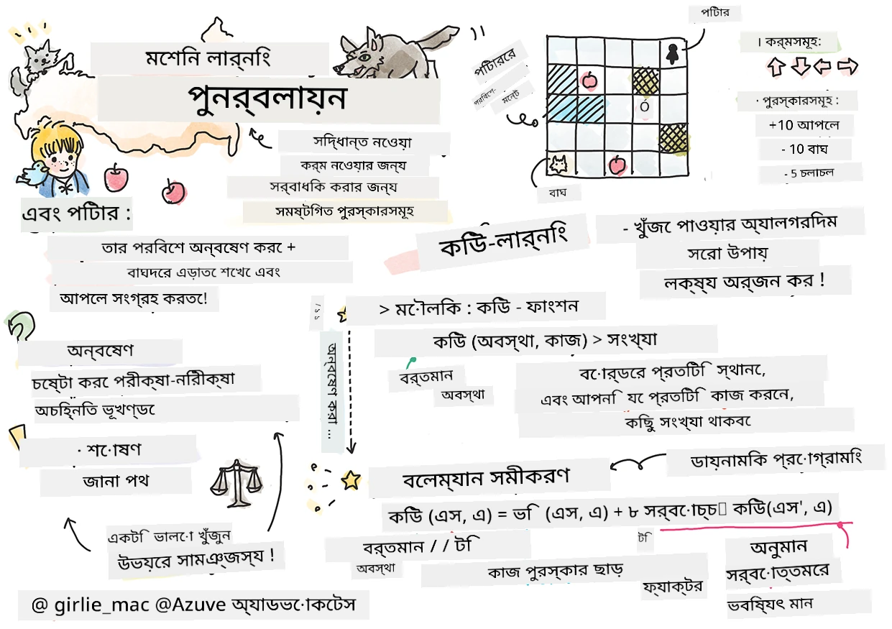
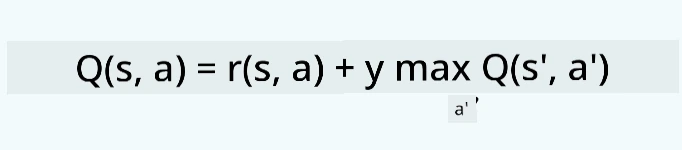
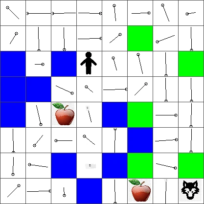

# রিইনফোর্সমেন্ট লার্নিং এবং কিউ-লার্নিং এর পরিচিতি


> স্কেচনোট করেছেন [Tomomi Imura](https://www.twitter.com/girlie_mac)

রিইনফোর্সমেন্ট লার্নিং-এ তিনটি গুরুত্বপূর্ণ ধারণা রয়েছে: এজেন্ট, কিছু স্টেট, এবং প্রতি স্টেটে কিছু ক্রিয়া। নির্দিষ্ট স্টেটে একটি ক্রিয়া সম্পাদনের মাধ্যমে এজেন্টকে একটি পুরস্কার দেওয়া হয়। আবার কম্পিউটার গেম সুপার মারিও কল্পনা করুন। আপনি মারিও, আপনি একটি গেম লেভেলে, একটি ঝরনার পাশে দাঁড়িয়ে আছেন। আপনার উপর একটি কয়েন আছে। আপনি মারিও, একটি গেম লেভেলে, একটি নির্দিষ্ট স্থানে ... এটাই আপনার স্টেট। ডানদিকে এক ধাপ এগিয়ে যাওয়া (একটি ক্রিয়া) আপনাকে ঝরনার উপর দিয়ে নিয়ে যাবে, এবং আপনাকে একটি নিচু সংখ্যামূলক স্কোর দেবে। তবে, জাম্প বোতাম চাপলে আপনি একটি পয়েন্ট স্কোর করবেন এবং জীবিত থাকবেন। এটা একটি ইতিবাচক ফলাফল এবং এটা আপনাকে একটি ইতিবাচক সংখ্যাত্মক স্কোর প্রদান করবে।

রিইনফোর্সমেন্ট লার্নিং এবং একটি সিমুলেটর (গেম) ব্যবহার করে, আপনি গেমটি কীভাবে খেলতে হয় তা শিখতে পারেন যাতে পুরস্কার সর্বাধিক হয়, যা হলো জীবিত থাকা এবং যতটা সম্ভব বেশি পয়েন্ট স্কোর করা।

[](https://www.youtube.com/watch?v=lDq_en8RNOo)

> 🎥 উপরের ছবিতে ক্লিক করে Dmitry কে রিইনফোর্সমেন্ট লার্নিং নিয়ে আলোচনা করতে শুনুন

## [পূর্ব-লেকচার কুইজ](https://ff-quizzes.netlify.app/en/ml/)

## পূর্বশর্ত এবং সেটআপ

এই পাঠে, আমরা পাইথনে কিছু কোড পরীক্ষা করব। আপনি এই পাঠের জুপিটার नोटবুক কোড চালাতে সক্ষম হওয়া উচিত, আপনার কম্পিউটারে অথবা ক্লাউডে কোথাও।

আপনি [পাঠের নোটবুক](https://github.com/microsoft/ML-For-Beginners/blob/main/8-Reinforcement/1-QLearning/notebook.ipynb) খুলে এই পাঠের মাধ্যমে এগিয়ে যেতে পারেন।

> **দ্রষ্টব্য:** যদি আপনি কোডটি ক্লাউড থেকে খুলেন, তাহলে আপনাকে নোটবুক কোডে ব্যবহৃত [`rlboard.py`](https://github.com/microsoft/ML-For-Beginners/blob/main/8-Reinforcement/1-QLearning/rlboard.py) ফাইলটিও ডাউনলোড করতে হবে। এটি নোটবুকের একই ডিরেক্টরিতে যোগ করুন।

## পরিচিতি

এই পাঠে, আমরা রুশ সুরকার [Sergei Prokofiev](https://en.wikipedia.org/wiki/Sergei_Prokofiev) দ্বারা অনুপ্রাণিত সঙ্গীত নাটক **[Peter and the Wolf](https://en.wikipedia.org/wiki/Peter_and_the_Wolf)** এর জগৎ অন্বেষণ করব। আমরা **রিইনফোর্সমেন্ট লার্নিং** ব্যবহার করব যাতে পিটার তার পরিবেশ অন্বেষণ করতে পারে, সুস্বাদু আপেল সংগ্রহ করতে পারে এবং উলের সাথে দেখা এড়াতে পারে।

**রিইনফোর্সমেন্ট লার্নিং** (RL) একটি শেখার কৌশল যা আমাদের একটি **এজেন্ট**-এর জন্য একটি অর্থপূর্ণ আচরণ শেখার সুযোগ দেয় কিছু **পরিবেশে** বহু পরীক্ষা চালিয়ে। এই পরিবেশে একজন এজেন্টের একটি **লক্ষ্য** থাকা উচিত, যা একটি **পুরস্কার ফাংশন** দ্বারা সংজ্ঞায়িত।

## পরিবেশ

সহজতার জন্য, আমরা ধরব পিটার এর জগত একটি `width` x `height` মাপের স্কুয়ার বোর্ড, এভাবে:


এই বোর্ডের প্রতিটি সেল হতে পারে:

* **মাটি**, যেখানে পিটার এবং অন্য প্রাণীরা হাঁটতে পারে।
* **পানি**, যেখানে আপনি অবশ্যই হাঁটতে পারবেন না।
* একটি **গাছ** অথবা **ঘাস**, যা বিশ্রামের স্থান।
* একটি **আপেল**, যা পিটার খুঁজে পেলে নিজেকে খাওয়াতে পছন্দ করবে।
* একটি **বাঘ**, যা বিপজ্জনক এবং এড়ানো উচিত।

একটি পৃথক পাইথন মডিউল আছে, [`rlboard.py`](https://github.com/microsoft/ML-For-Beginners/blob/main/8-Reinforcement/1-QLearning/rlboard.py), যা এই পরিবেশের সাথে কাজ করার কোড ধারণ করে। কারণ এই কোড আমাদের ধারণাগুলি বোঝার জন্য গুরুত্বপূর্ণ নয়, আমরা মডিউলটি ইমপোর্ট করে নমুনা বোর্ড তৈরি করব (কোড ব্লক ১):

```python
from rlboard import *

width, height = 8,8
m = Board(width,height)
m.randomize(seed=13)
m.plot()
```

এই কোডটি উপরের পরিবেশের একটি ছবি প্রিন্ট করবে।

## ক্রিয়া এবং নীতি

আমাদের উদাহরণে, পিটার এর লক্ষ্য একটি আপেল খুঁজে পাওয়া, তবে উল এবং অন্যান্য বাধা এড়ানো। এজন্য সে মূলত হাঁটতে পারে যতক্ষণ না সে আপেল পায়।

তাই, যেকোন স্থানে সে নিচের যেকোন একটি ক্রিয়া বেছে নিতে পারে: উপরে, নিচে, বামে, এবং ডানে।

আমরা এই ক্রিয়াগুলোকে একটি অভিধান হিসেবে সংজ্ঞায়িত করব, এবং তাদের সংশ্লিষ্ট স্থানাঙ্ক পরিবর্তনের সাথে যুক্ত করব। উদাহরণস্বরূপ, ডানদিকে যাওয়া (`R`) হবে একটি জোড়া `(1,0)`। (কোড ব্লক ২):

```python
actions = { "U" : (0,-1), "D" : (0,1), "L" : (-1,0), "R" : (1,0) }
action_idx = { a : i for i,a in enumerate(actions.keys()) }
```

সংক্ষেপে, এই পরিস্থিতির কৌশল এবং লক্ষ্য নিম্নরূপ:

- **কৌশল**, আমাদের এজেন্ট (পিটার) দ্বারা সংজ্ঞায়িত একটি তথাকথিত **নীতির** দ্বারা নির্ধারিত। একটি নীতি একটি ফাংশন যা যেকোন স্টেটে ক্রিয়া নির্ধারণ করে। আমাদের ক্ষেত্রে, সমস্যার স্টেট বোর্ড দ্বারা উপস্থাপিত, যার মধ্যে খেলোয়াড়ের বর্তমান অবস্থান অন্তর্ভুক্ত।

- **লক্ষ্য**, রিইনফোর্সমেন্ট লার্নিং এর উদ্দেশ্য হলো এমন একটি ভালো নীতি শেখা যা আমাদের সমস্যা দক্ষতার সাথে সমাধান করতে সাহায্য করে। তবে, একটি বেসলাইন হিসাবে, আমরা সবচেয়ে সহজ নীতি **র্যান্ডম ওয়াক** বিবেচনা করব।

## র্যান্ডম ওয়াক

প্রথমে আমরা একটি র্যান্ডম ওয়াক কৌশল বাস্তবায়ন করে আমাদের সমস্যা সমাধান করব। র্যান্ডম ওয়াকে, আমরা অনুমোদিত ক্রিয়াগুলোর মধ্যে থেকে এলোমেলোভাবে পরবর্তী ক্রিয়া নির্বাচন করব যতক্ষণ না আমরা আপেল পৌঁছাই (কোড ব্লক ৩)।

1. নিচের কোড দিয়ে র্যান্ডম ওয়াক বাস্তবায়ন করুন:

    ```python
    def random_policy(m):
        return random.choice(list(actions))
    
    def walk(m,policy,start_position=None):
        n = 0 # ধাপের সংখ্যা
        # প্রাথমিক অবস্থান সেট করুন
        if start_position:
            m.human = start_position 
        else:
            m.random_start()
        while True:
            if m.at() == Board.Cell.apple:
                return n # সাফল্য!
            if m.at() in [Board.Cell.wolf, Board.Cell.water]:
                return -1 # নেকড়ে খেয়ে ফেলেছে অথবা ডুবে গেছে
            while True:
                a = actions[policy(m)]
                new_pos = m.move_pos(m.human,a)
                if m.is_valid(new_pos) and m.at(new_pos)!=Board.Cell.water:
                    m.move(a) # আসল স্থানান্তর করুন
                    break
            n+=1
    
    walk(m,random_policy)
    ```

    `walk` কলের ফলাফল হবে সংশ্লিষ্ট পথের দৈর্ঘ্য, যা একবারের রান থেকে অন্য রানের মধ্যে পরিবর্তিত হতে পারে।

1. হেঁটার পরীক্ষা অনেকবার চালান (ধরা যাক, ১০০ বার), এবং ফলাফল পরিসংখ্যান প্রিন্ট করুন (কোড ব্লক ৪):

    ```python
    def print_statistics(policy):
        s,w,n = 0,0,0
        for _ in range(100):
            z = walk(m,policy)
            if z<0:
                w+=1
            else:
                s += z
                n += 1
        print(f"Average path length = {s/n}, eaten by wolf: {w} times")
    
    print_statistics(random_policy)
    ```

    লক্ষ্য করুন যে পথের গড় দৈর্ঘ্য প্রায় ৩০-৪০ ধাপ, যা বেশ বড়, কারণ নিকটস্থ আপেলের গড় দূরত্ব প্রায় ৫-৬ ধাপ।

    আপনি পিটারের চলাফেরার র্যান্ডম ওয়াক চলাকালীন দেখতে পারেন:

    

## পুরস্কার ফাংশন

আমাদের নীতিকে আরো বুদ্ধিমান করতে, আমাদের বুঝতে হবে কোন চলাচল "অন্যের চেয়ে ভালো"। এ জন্য, আমাদের লক্ষ্য সংজ্ঞায়িত করতে হবে।

লক্ষ্যকে একটি **পুরস্কার ফাংশন** এর মাধ্যমে সংজ্ঞায়িত করা যায়, যা প্রতি স্টেটে একটি স্কোর মান প্রদান করবে। মান যত বেশি, পুরস্কার ফাংশন তত ভাল। (কোড ব্লক ৫)

```python
move_reward = -0.1
goal_reward = 10
end_reward = -10

def reward(m,pos=None):
    pos = pos or m.human
    if not m.is_valid(pos):
        return end_reward
    x = m.at(pos)
    if x==Board.Cell.water or x == Board.Cell.wolf:
        return end_reward
    if x==Board.Cell.apple:
        return goal_reward
    return move_reward
```

পুরস্কার ফাংশন নিয়ে একটি আকর্ষণীয় দিক হলো অধিকাংশ ক্ষেত্রে, *আমাদেরকে গেমের শেষে একটি গুরুত্বপূর্ণ পুরস্কার দেওয়া হয়*। এর মানে হলো আমাদের অ্যালগরিদমকে "ভালো" ধাপ মনে রাখতে হবে যা গেম শেষে ইতিবাচক পুরস্কারে নিয়ে যায়, এবং তাদের গুরুত্ব বাড়াতে হবে। একইভাবে, সব ভুল ধাপকে হ্রাস করতে হবে।

## কিউ-লার্নিং

আমরা যে অ্যালগরিদমটি আলোচনা করব তা হল **কিউ-লার্নিং**। এই অ্যালগরিদমে, নীতি একটি ফাংশন (বা ডেটা স্ট্রাকচার) দ্বারা সংজ্ঞায়িত যা **কিউ-টেবিল** নামে পরিচিত। এটি প্রতিটি স্টেটে প্রতিটি ক্রিয়ার "মধ্যস্থতা" রেকর্ড করে।

এটা কিউ-টেবিল বলা হয় কারণ এটি প্রায়শই একটি টেবিল বা বহু-মাত্রিক অ্যারে হিসেবে উপস্থাপন করা সুবিধাজনক। আমাদের বোর্ডের মাত্রা `width` x `height` হওয়ায়, আমরা একটি numpy অ্যারে ব্যবহার করে কিউ-টেবিল উপস্থাপন করতে পারি যার আকার `width` x `height` x `len(actions)`: (কোড ব্লক ৬)

```python
Q = np.ones((width,height,len(actions)),dtype=np.float)*1.0/len(actions)
```

লক্ষ্য করুন, আমরা কিউ-টেবিলের সব মান একরকম দিয়ে প্রাথমিক করিনি, আমাদের ক্ষেত্রে - 0.25। এটা "র্যান্ডম ওয়াক" নীতির সমতুল্য, কারণ প্রতিটি স্টেটে সব ক্রিয়াই সমান ভাল। আমরা `plot` ফাংশনে কিউ-টেবিল পাস করব যাতে বোর্ডে টেবিল ভিজ্যুয়ালাইজ করা যায়: `m.plot(Q)`.


প্রতিটি সেলের কেন্দ্রবিন্দুতে একটি "তীর" থাকে যা পছন্দসই চলাচলের দিক নির্দেশ করে। যেহেতু সব দিক সমান, একটি বিন্দু প্রদর্শিত হয়।

এখন আমাদের সিমুলেশন চালাতে হবে, পরিবেশ অন্বেষণ করতে হবে, এবং কিউ-টেবিল মানের একটি উন্নত বন্টন শিখতে হবে, যা আপেলের পথে দ্রুত পৌঁছানোর সুযোগ দেবে।

## কিউ-লার্নিং এর সারমর্ম: বেলম্যান সমীকরণ

যখন আমরা চলতে শুরু করব, প্রতিটি ক্রিয়ার জন্য একটি সংশ্লিষ্ট পুরস্কার থাকবে, অর্থাৎ আমরা তাত্ক্ষণিক পুরস্কারের সর্বোচ্চ ভিত্তিতে পরবর্তী ক্রিয়া নির্বাচন করতে পারব। তবে বেশিরভাগ স্টেটে, চলাচল আমাদের লক্ষ্য — আপেল পৌঁছানো — অর্জন করবে না, তাই আমরা সাথে সাথেই সিদ্ধান্ত নিতে পারব না কোন দিক ভালো।

> মনে রাখবেন তাত্ক্ষণিক ফলাফল নয় যে গুরুত্বপূর্ণ, বরং চূড়ান্ত ফলাফল যা আমরা সিমুলেশন শেষে পাবো।

এই বিলম্বিত পুরস্কার বিবেচনার জন্য, আমাদের **[ডাইনামিক প্রোগ্রামিং](https://en.wikipedia.org/wiki/Dynamic_programming)** এর নীতিমালা ব্যবহার করতে হবে, যা আমাদের সমস্যাটিকে রিকার্সিভ ভাবতে দেয়।

ধরুন আমরা এখন স্টেট *s* এ আছি, এবং পরবর্তী স্টেট *s'* তে যেতে চাই। তখন আমরা তাত্ক্ষণিক পুরস্কার *r(s,a)* পাব, যা পুরস্কার ফাংশন দ্বারা নির্ধারিত, এবং ভবিষ্যতের কিছু পুরস্কার পাব। যদি আমরা ধরি আমাদের কিউ-টেবিল প্রতিটি ক্রিয়ার আকর্ষণীয়তা সঠিকভাবে প্রতিফলিত করে, তাহলে স্টেট *s'* এ আমরা এমন একটি ক্রিয়া *a* বাছাই করব যার মান সর্বোচ্চ *Q(s',a')*। অতএব, স্টেট *s* এ সর্বোত্তম সম্ভব ভবিষ্যত পুরস্কার হবে `max`<sub>a'</sub>*Q(s',a')* (এই সর্বোচ্চ সকল সম্ভাব্য ক্রিয়া *a'* এর উপর গণনা করা হবে স্টেট *s'* এ)।

এটি দেয় **বেলম্যান ফর্মুলা** কিউ-টেবিল এর মান গণনার জন্য স্টেট *s*, ক্রিয়া *a* দেওয়া হলে:



এখানে γ হল তথাকথিত **ডিসকাউন্ট ফ্যাক্টর** যা নির্ধারণ করে আপনি বর্তমান পুরস্কারের তুলনায় ভবিষ্যৎ পুরস্কারের কতটা গুরুত্ব দেবেন।

## শেখার অ্যালগরিদম

উপরের সমীকরণ অনুযায়ী, আমরা এখন আমাদের শেখার অ্যালগরিদমের ছদ্ম-কোড লিখতে পারি:

* সব স্টেট এবং ক্রিয়ার জন্য সমান সংখ্যায় Q-টেবিল Q শুরু করুন
* শেখার হার α ← 1 সেট করুন
* বহুবার সিমুলেশন পুনরাবৃত্তি করুন
   1. এলোমেলো অবস্থান থেকে শুরু করুন
   1. পুনরাবৃত্তি করুন
        1. স্টেট *s* এ একটি ক্রিয়া *a* নির্বাচন করুন
        2. নতুন স্টেট *s'* এ যেতে ক্রিয়া সম্পাদন করুন
        3. গেমের শেষ শর্ত পাওয়া গেলে, অথবা মোট পুরস্কার খুব কম হলে সিমুলেশন বন্ধ করুন  
        4. নতুন স্টেটে পুরস্কার *r* গুণিত করুন
        5. বেলম্যান সমীকরণ অনুযায়ী Q ফাংশন আপডেট করুন: *Q(s,a)* ← *(1-α)Q(s,a)+α(r+γ max<sub>a'</sub>Q(s',a'))*
        6. *s* ← *s'*
        7. মোট পুরস্কার আপডেট করুন এবং α হ্রাস করুন।

## এক্সপ্লয়েট বনাম এক্সপ্লোর

উপরের অ্যালগরিদমে, আমরা বিস্তারিত উল্লেখ করিনি কীভাবে ২.১ ধাপে ক্রিয়া নির্বাচন করা উচিত। যদি আপনি এলোমেলোভাবে ক্রিয়া নির্বাচন করেন, তাহলে আপনি এলোমেলোভাবে পরিবেশ অন্বেষণ করবেন, এবং বেশীরভাগ সময় মরতে পারেন এবং এমন এলাকা অন্বেষণ করবেন যেখানে আপনি সাধারণত যাবেন না। একটি বিকল্প হলো ইতিমধ্যেই পরিচিত কিউ-টেবিল মান ব্যবহার করে সর্বোত্তম ক্রিয়া বেছে নেওয়া (যার মান বেশি) স্টেট *s* এ। এই পদ্ধতি পরিবেশের অন্য স্টেটগুলি অন্বেষণ না করায় হয়তো আমরা সেরা সমাধান না পেতে পারি।

তাই, সবচেয়ে ভালো পদ্ধতি হল অন্বেষণ এবং শোষণের মধ্যে ভারসাম্য রাখা। এটি করা যায় স্টেট *s* এ এমনভাবে ক্রিয়া নির্বাচন করে যার সম্ভাবনা কিউ-টেবিল মানের সমানুপাতিক। শুরুতে, যখন সব মান সমান, এটি এলোমেলো নির্বাচনের মতো হবে, কিন্তু পরিবেশ সম্পর্কে আমরা যেমনই শিখব, তেমনই আমরা সম্ভবত সর্বোত্তম পথ অনুসরণ করব তবে মাঝে মাঝে এজেন্টকে অন্বেষণ করতে দেব।

## পাইথন বাস্তবায়ন

এখন আমরা শেখার অ্যালগরিদম বাস্তবায়ন করতে প্রস্তুত। এর আগে, আমাদের একটি ফাংশন দরকার যা কিউ-টেবিলের যেকোন সংখ্যাকে সংশ্লিষ্ট ক্রিয়াগুলোর সম্ভাবনার ভেক্টরে রূপান্তর করবে।

1. একটি ফাংশন `probs()` তৈরি করুন:

    ```python
    def probs(v,eps=1e-4):
        v = v-v.min()+eps
        v = v/v.sum()
        return v
    ```

    আমরা মূল ভেক্টরে কিছু `eps` যোগ করি যাতে প্রাথমিক অবস্থায়, যখন সব উপাদান সমান, ভাগফল 0 হওয়া এড়ানো যায়।

এই শেখার অ্যালগরিদম ৫০০০ পরীক্ষার মাধ্যমে চালান, যাকে **ইপোক** বলা হয়: (কোড ব্লক ৮)
```python
    for epoch in range(5000):
    
        # প্রাথমিক পয়েন্ট নির্বাচন করুন
        m.random_start()
        
        # যাত্রা শুরু করুন
        n=0
        cum_reward = 0
        while True:
            x,y = m.human
            v = probs(Q[x,y])
            a = random.choices(list(actions),weights=v)[0]
            dpos = actions[a]
            m.move(dpos,check_correctness=False) # আমরা খেলোয়াড়কে বোর্ডের বাইরে চলার অনুমতি দিই, যা পর্ব শেষ করে দেয়
            r = reward(m)
            cum_reward += r
            if r==end_reward or cum_reward < -1000:
                lpath.append(n)
                break
            alpha = np.exp(-n / 10e5)
            gamma = 0.5
            ai = action_idx[a]
            Q[x,y,ai] = (1 - alpha) * Q[x,y,ai] + alpha * (r + gamma * Q[x+dpos[0], y+dpos[1]].max())
            n+=1
```

অ্যালগরিদম চালানোর পর, কিউ-টেবিল এমন মান দিয়ে আপডেট হবে যা প্রতিটি ধাপে বিভিন্ন ক্রিয়ার আকর্ষণীয়তা সংজ্ঞায়িত করে। আমরা প্রতিটি সেলে একটি ভেক্টর প্লট করে কিউ-টেবিল ভিজ্যুয়ালাইজ করতে পারি যা পছন্দসই চলাচলের দিক নির্দেশ করবে। সহজতার জন্য, আমরা তীরের পরিবর্তে একটি ছোট বৃত্ত আঁকব।



## নীতি যাচাই

যেহেতু কিউ-টেবিল প্রতিটি স্টেটে প্রতিটি ক্রিয়ার "আকর্ষণীয়তা" তালিকাভুক্ত করে, তাই এটি ব্যবহার করে আমাদের পৃথিবীতে কার্যকর নেভিগেশন সংজ্ঞায়িত করা সহজ। সবচেয়ে সাধারণ ক্ষেত্রে, আমরা সর্বোচ্চ কিউ-টেবিল মানের সাথে ক্রিয়া নির্বাচন করতে পারি: (কোড ব্লক ৯)

```python
def qpolicy_strict(m):
        x,y = m.human
        v = probs(Q[x,y])
        a = list(actions)[np.argmax(v)]
        return a

walk(m,qpolicy_strict)
```


> উপরোক্ত কোডটি কয়েকবার চেষ্টা করলে, আপনি লক্ষ্য করতে পারেন যে কখনও কখনও এটি "হ্যাং" হয়ে যায়, এবং আপনাকে নোটবুকে STOP বোতামটি চাপতে হয় এটি থামানোর জন্য। এটি ঘটে কারণ এমন পরিস্থিতি হতে পারে যেখানে দুটি অবস্থা পরস্পরের প্রতি অপ্টিমাল Q-মানের দিক থেকে "ইঙ্গিত" করে, এমনক্ষেত্রে এজেন্ট সেই অবস্থাগুলোর মধ্যে অনির্দিষ্টকালের জন্য চলাচল করতে থাকে।

## 🚀চ্যালেঞ্জ

> **টাস্ক ১:** `walk` ফাংশনটি পরিবর্তন করুন যাতে পথের সর্বোচ্চ দৈর্ঘ্য নির্দিষ্ট সংখ্যক ধাপ দ্বারা সীমাবদ্ধ থাকে (ধরা যাক, ১০০), এবং উপরের কোডটি মাঝে মাঝে এই মানটি ফেরত দেয় তা পর্যবেক্ষণ করুন।

> **টাস্ক ২:** `walk` ফাংশনটি পরিবর্তন করুন যাতে এটি পূর্বে যেসব স্থানে গিয়েছিল সেগুলোতে ফিরে না যায়। এটি `walk` এর লুপিং প্রতিরোধ করবে, তবে, এজেন্ট তখনও এমন একটি জায়গায় ফসকে থাকতে পারে যেখানে থেকে সে পালাতে পারবে না।

## নেভিগেশন

একটি উন্নত নেভিগেশন নীতি হবে যে নীতিটি আমরা প্রশিক্ষণের সময় ব্যবহার করেছি, যা এক্সপ্লোইটেশন এবং এক্সপ্লোরেশনের সমন্বয়। এই নীতিতে, আমরা Q-টেবিলের মান অনুযায়ী নির্দিষ্ট সম্ভাবনার সাথে প্রতিটি কর্ম নির্বাচন করব। এই কৌশলটি এখনও এজেন্টকে এমন একটি অবস্থানে ফিরিয়ে নিয়ে যেতে পারে যা সে পূর্বে অন্বেষণ করেছে, কিন্তু, নিচের কোড থেকে দেখা যাচ্ছে, এটি কাঙ্ক্ষিত অবস্থানে খুব ছোট গড় পথের ফলাফল দেয় (মনে রাখবেন `print_statistics` ১০০ বার সিমুলেশন চালায়): (কোড ব্লক ১০)

```python
def qpolicy(m):
        x,y = m.human
        v = probs(Q[x,y])
        a = random.choices(list(actions),weights=v)[0]
        return a

print_statistics(qpolicy)
```

এই কোড চালানোর পর, আপনার আগের তুলনায় অনেক ছোট গড় পথ দৈর্ঘ্য পাওয়া উচিত, যে পরিসর ৩-৬ এর মধ্যে থাকবে।

## শেখার প্রক্রিয়া তদন্ত

যেমন আমরা উল্লেখ করেছি, শেখার প্রক্রিয়াটি হচ্ছে সমস্যা ক্ষেত্রের গঠন সম্পর্কে প্রাপ্ত জ্ঞানের অনুসন্ধান এবং ব্যবহার এর মধ্যে একটি সুষম অবস্থা। আমরা দেখেছি শেখার ফলাফল (এজেন্টকে একটি ছোট পথ খুঁজে পেতে সাহায্য করার ক্ষমতা) উন্নত হয়েছে, তবে শিক্ষণ প্রক্রিয়ার সময় গড় পথের দৈর্ঘ্য কীভাবে পরিবর্তিত হয় তাও পর্যবেক্ষণ করা আকর্ষণীয়:


শিক্ষাগুলো সংক্ষেপে হল:

- **গড় পথের দৈর্ঘ্য বৃদ্ধি পায়**। প্রথম দিকে দেখা যাচ্ছে যে গড় পথের দৈর্ঘ্য বৃদ্ধি পায়। সম্ভবত এর কারণ হল যখন পরিবেশ সম্পর্কে আমরা কিছুই জানি না, তখন আমরা খারাপ অবস্থায়, জলের মধ্যে বা বাঘের কাছে আটকে যেতে পারি। যতই আমরা শিখি এবং এই জ্ঞান ব্যবহার শুরু করি, আমরা পরিবেশকে দীর্ঘ সময় ধরে অনুসন্ধান করতে পারি, তবে আপেল কোথায় আছে সেটা এখনও আমরা খুব ভাল জানি না।

- **শেখার সাথে সাথে পথের দৈর্ঘ্য কমে**। একবার আমরা যথেষ্ট শিখে গেলে, এজেন্টের জন্য লক্ষ্য অর্জন করা সহজ হয়ে উঠে, এবং পথের দৈর্ঘ্য কমতে শুরু করে। তবে আমরা এখনো অনুসন্ধান চালিয়ে যাচ্ছি, তাই আমরা প্রায়ই সেরা পথে থেকে সরে গিয়ে নতুন বিকল্প পরীক্ষা করি, ফলে পথটি অপ্টিমালের চেয়ে দীর্ঘ হয়।

- **দৈর্ঘ্য আকস্মিকভাবে বৃদ্ধি পায়**। এই গ্রাফে আমরা আরও দেখতে পাই যে কোথাও কোথাও দৈর্ঘ্য হঠাৎ করে বেড়ে গেছে। এটি প্রক্রিয়াটির সম্ভাব্য বৈশিষ্ট্যকে নির্দেশ করে, এবং যে আমরা কখনও কখনও Q-টেবিলের সহগ গুলো নতুন মান দিয়ে ওভাররাইট করে "বিরূপ" করতে পারি। এটি কমানোর জন্য সাধারণত শেখার হার হ্রাস করা হয় (উদাহরণস্বরূপ, প্রশিক্ষণের শেষ দিকে আমরা শুধু ছোট মান দিয়ে Q-টেবিল মানগুলি সামঞ্জস্য করি)।

মোটের উপর, শেখার প্রক্রিয়ার সফলতা এবং গুণমান উল্লেখযোগ্যভাবে নির্ভর করে প্যারামিটারগুলোর উপর, যেমন শেখার হার, শেখার হারের অবনতি, এবং ছাড়ের কারক। এগুলিকে প্রায়ই **হাইপারপ্যারামিটার** বলা হয়, যা **প্যারামিটার** থেকে পৃথক যেগুলোকে আমরা প্রশিক্ষণের সময় অপ্টিমাইজ করি (উদাঃ Q-টেবিলের সহগ)। সেরা হাইপারপ্যারামিটার মানগুলো খোঁজার প্রক্রিয়াটিকে **হাইপারপ্যারামিটার অপ্টিমাইজেশন** বলা হয়, এবং এটি একটি স্বতন্ত্র বিষয়।

## [পোস্ট-লেকচার কুইজ](https://ff-quizzes.netlify.app/en/ml/)

## অ্যাসাইনমেন্ট 
[একটি আরো বাস্তবসম্মত বিশ্ব](assignment.md)

---

<!-- CO-OP TRANSLATOR DISCLAIMER START -->
**অস্বীকৃতি**:
এই নথিটি AI অনুবাদ পরিষেবা [Co-op Translator](https://github.com/Azure/co-op-translator) ব্যবহার করে অনূদিত হয়েছে। যদিও আমরা শুদ্ধতার জন্য চেষ্টা করি, অনুগ্রহ করে মনে রাখবেন যে স্বয়ংক্রিয় অনুবাদে ত্রুটি বা অসঙ্গতি থাকতে পারে। মূল নথিটি তার স্বভাষায় কর্তৃত্বপূর্ণ উৎস হিসেবে বিবেচিত হওয়া উচিত। গুরুত্বপূর্ণ তথ্যের জন্য পেশাদার মানব অনুবাদ সুপারিশ করা হয়। এই অনুবাদের ব্যবহারে প্রয়োজনীয় ভুল বোঝাবুঝি বা ভুল ব্যাখ্যার জন্য আমরা দায়বদ্ধ নই।
<!-- CO-OP TRANSLATOR DISCLAIMER END -->