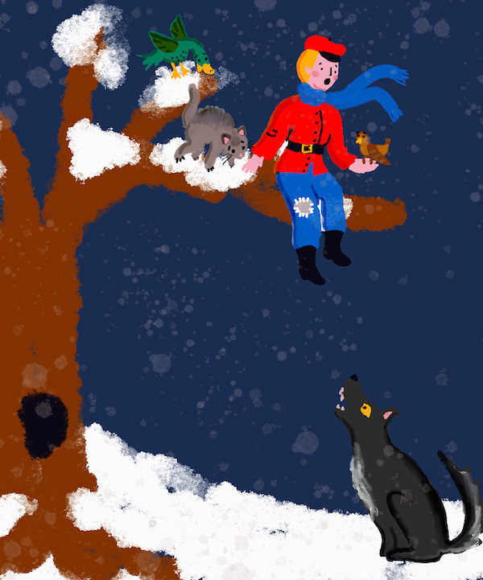

<!--
CO_OP_TRANSLATOR_METADATA:
{
  "original_hash": "20ca019012b1725de956681d036d8b18",
  "translation_date": "2025-08-29T22:01:39+00:00",
  "source_file": "8-Reinforcement/README.md",
  "language_code": "bn"
}
-->
# রিইনফোর্সমেন্ট লার্নিং-এর পরিচিতি

রিইনফোর্সমেন্ট লার্নিং, RL, সুপারভাইজড লার্নিং এবং আনসুপারভাইজড লার্নিং-এর পাশাপাশি অন্যতম মৌলিক মেশিন লার্নিং প্যারাডাইম হিসেবে বিবেচিত হয়। RL মূলত সিদ্ধান্ত গ্রহণের উপর ভিত্তি করে: সঠিক সিদ্ধান্ত প্রদান করা বা অন্তত সেগুলো থেকে শেখা।

ধরুন আপনার কাছে একটি সিমুলেটেড পরিবেশ আছে, যেমন শেয়ার বাজার। যদি আপনি একটি নির্দিষ্ট নিয়ম আরোপ করেন, তাহলে কী ঘটে? এর ইতিবাচক বা নেতিবাচক প্রভাব কি? যদি কিছু নেতিবাচক ঘটে, তাহলে আপনাকে এই _নেতিবাচক রিইনফোর্সমেন্ট_ থেকে শিখতে হবে এবং পথ পরিবর্তন করতে হবে। যদি এটি ইতিবাচক ফলাফল হয়, তাহলে আপনাকে সেই _ইতিবাচক রিইনফোর্সমেন্ট_ এর উপর ভিত্তি করে এগিয়ে যেতে হবে।

> পিটার এবং তার বন্ধুরা ক্ষুধার্ত নেকড়ের হাত থেকে পালাতে হবে! ছবি: [জেন লুপার](https://twitter.com/jenlooper)

## আঞ্চলিক বিষয়: পিটার এবং নেকড়ে (রাশিয়া)

[পিটার এবং নেকড়ে](https://en.wikipedia.org/wiki/Peter_and_the_Wolf) একটি সঙ্গীতধর্মী রূপকথা, যা রাশিয়ান সুরকার [সের্গেই প্রোকোফিয়েভ](https://en.wikipedia.org/wiki/Sergei_Prokofiev) লিখেছেন। এটি তরুণ পায়োনিয়ার পিটারের গল্প, যে সাহসিকতার সাথে তার বাড়ি থেকে বেরিয়ে বনাঞ্চলে নেকড়েকে তাড়ানোর জন্য যায়। এই অংশে, আমরা মেশিন লার্নিং অ্যালগরিদম প্রশিক্ষণ দেব যা পিটারকে সাহায্য করবে:

- **অন্বেষণ**: আশেপাশের এলাকা পর্যবেক্ষণ করে একটি সর্বোত্তম নেভিগেশন মানচিত্র তৈরি করা।
- **শেখা**: স্কেটবোর্ড ব্যবহার করা এবং এর উপর ভারসাম্য বজায় রাখা, যাতে দ্রুত চলাচল করা যায়।

> 🎥 উপরের ছবিতে ক্লিক করে প্রোকোফিয়েভের "পিটার এবং নেকড়ে" শুনুন

## রিইনফোর্সমেন্ট লার্নিং

পূর্ববর্তী অংশগুলোতে, আপনি মেশিন লার্নিং সমস্যার দুটি উদাহরণ দেখেছেন:

- **সুপারভাইজড**, যেখানে আমাদের কাছে ডেটাসেট থাকে যা সমস্যার সমাধানের নমুনা সমাধান প্রস্তাব করে। [ক্লাসিফিকেশন](../4-Classification/README.md) এবং [রিগ্রেশন](../2-Regression/README.md) সুপারভাইজড লার্নিং টাস্ক।
- **আনসুপারভাইজড**, যেখানে আমাদের কাছে লেবেলযুক্ত প্রশিক্ষণ ডেটা থাকে না। আনসুপারভাইজড লার্নিং-এর প্রধান উদাহরণ হলো [ক্লাস্টারিং](../5-Clustering/README.md)।

এই অংশে, আমরা আপনাকে একটি নতুন ধরনের লার্নিং সমস্যার সাথে পরিচয় করিয়ে দেব, যা লেবেলযুক্ত প্রশিক্ষণ ডেটার প্রয়োজন হয় না। এই ধরনের সমস্যার কয়েকটি ধরন রয়েছে:

- **[সেমি-সুপারভাইজড লার্নিং](https://wikipedia.org/wiki/Semi-supervised_learning)**, যেখানে আমাদের কাছে প্রচুর অ-লেবেলযুক্ত ডেটা থাকে যা মডেল প্রি-ট্রেন করার জন্য ব্যবহার করা যেতে পারে।
- **[রিইনফোর্সমেন্ট লার্নিং](https://wikipedia.org/wiki/Reinforcement_learning)**, যেখানে একটি এজেন্ট সিমুলেটেড পরিবেশে পরীক্ষা চালিয়ে কীভাবে আচরণ করতে হয় তা শেখে।

### উদাহরণ - কম্পিউটার গেম

ধরুন আপনি একটি কম্পিউটারকে গেম খেলতে শেখাতে চান, যেমন দাবা বা [সুপার মারিও](https://wikipedia.org/wiki/Super_Mario)। কম্পিউটারকে গেম খেলতে শেখানোর জন্য, আমাদের প্রয়োজন যে এটি প্রতিটি গেম স্টেটে কোন পদক্ষেপ নিতে হবে তা পূর্বাভাস দিতে পারে। যদিও এটি একটি ক্লাসিফিকেশন সমস্যার মতো মনে হতে পারে, এটি আসলে নয় - কারণ আমাদের কাছে স্টেট এবং সংশ্লিষ্ট অ্যাকশন সহ ডেটাসেট নেই। যদিও আমাদের কাছে কিছু ডেটা থাকতে পারে, যেমন বিদ্যমান দাবা ম্যাচ বা সুপার মারিও খেলার রেকর্ডিং, এটি সম্ভবত পর্যাপ্ত সংখ্যক সম্ভাব্য স্টেট কভার করবে না।

বিদ্যমান গেম ডেটা খোঁজার পরিবর্তে, **রিইনফোর্সমেন্ট লার্নিং** (RL) এর ধারণা হলো *কম্পিউটারকে বারবার গেম খেলতে দেওয়া* এবং ফলাফল পর্যবেক্ষণ করা। তাই রিইনফোর্সমেন্ট লার্নিং প্রয়োগ করতে আমাদের দুটি জিনিস প্রয়োজন:

- **একটি পরিবেশ** এবং **একটি সিমুলেটর**, যা আমাদের গেমটি বারবার খেলতে দেয়। এই সিমুলেটর গেমের সমস্ত নিয়ম, সম্ভাব্য স্টেট এবং অ্যাকশন সংজ্ঞায়িত করবে।

- **একটি রিওয়ার্ড ফাংশন**, যা আমাদের জানাবে প্রতিটি পদক্ষেপ বা গেমে আমরা কতটা ভালো করেছি।

অন্যান্য মেশিন লার্নিং এবং RL-এর মধ্যে প্রধান পার্থক্য হলো RL-এ আমরা সাধারণত গেম শেষ না হওয়া পর্যন্ত জানি না যে আমরা জিতেছি বা হেরেছি। তাই আমরা বলতে পারি না যে একটি নির্দিষ্ট পদক্ষেপ একাই ভালো বা খারাপ - আমরা শুধুমাত্র গেমের শেষে একটি রিওয়ার্ড পাই। এবং আমাদের লক্ষ্য হলো এমন অ্যালগরিদম ডিজাইন করা যা অনিশ্চিত পরিস্থিতিতে একটি মডেল প্রশিক্ষণ দিতে পারে। আমরা **Q-learning** নামে একটি RL অ্যালগরিদম সম্পর্কে শিখব।

## পাঠসমূহ

1. [রিইনফোর্সমেন্ট লার্নিং এবং Q-Learning-এর পরিচিতি](1-QLearning/README.md)
2. [জিম সিমুলেশন পরিবেশ ব্যবহার করা](2-Gym/README.md)

## ক্রেডিট

"রিইনফোর্সমেন্ট লার্নিং-এর পরিচিতি" ♥️ দিয়ে লিখেছেন [দিমিত্রি সশনিকভ](http://soshnikov.com)

---

**অস্বীকৃতি**:  
এই নথিটি AI অনুবাদ পরিষেবা [Co-op Translator](https://github.com/Azure/co-op-translator) ব্যবহার করে অনুবাদ করা হয়েছে। আমরা যথাসম্ভব সঠিক অনুবাদের চেষ্টা করি, তবে অনুগ্রহ করে মনে রাখবেন যে স্বয়ংক্রিয় অনুবাদে ত্রুটি বা অসঙ্গতি থাকতে পারে। নথিটির মূল ভাষায় লেখা সংস্করণটিকেই প্রামাণিক উৎস হিসেবে বিবেচনা করা উচিত। গুরুত্বপূর্ণ তথ্যের জন্য, পেশাদার মানব অনুবাদ ব্যবহার করার পরামর্শ দেওয়া হচ্ছে। এই অনুবাদ ব্যবহারের ফলে সৃষ্ট কোনো ভুল বোঝাবুঝি বা ভুল ব্যাখ্যার জন্য আমরা দায়ী নই।