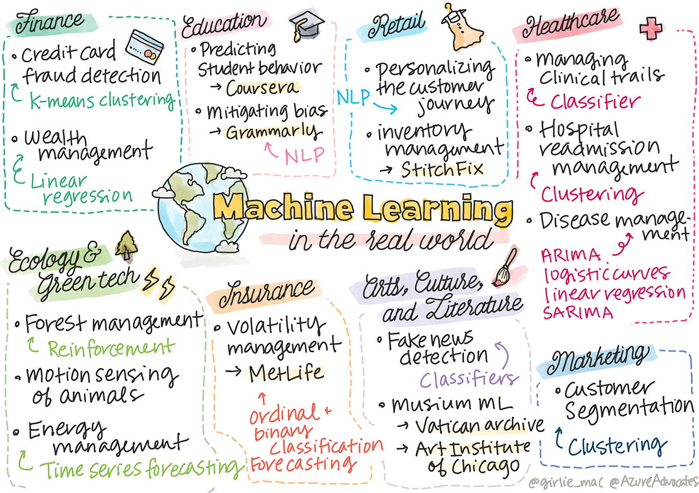

<!--
CO_OP_TRANSLATOR_METADATA:
{
  "original_hash": "20f18ff565638be615df4174858e4a7f",
  "translation_date": "2025-08-29T21:09:44+00:00",
  "source_file": "9-Real-World/1-Applications/README.md",
  "language_code": "bn"
}
-->
# পোস্টস্ক্রিপ্ট: বাস্তব জীবনে মেশিন লার্নিং

> স্কেচনোট: [Tomomi Imura](https://www.twitter.com/girlie_mac)

এই পাঠ্যক্রমে, আপনি ডেটা প্রশিক্ষণের জন্য প্রস্তুত করার এবং মেশিন লার্নিং মডেল তৈরি করার বিভিন্ন পদ্ধতি শিখেছেন। আপনি একাধিক ক্লাসিক রিগ্রেশন, ক্লাস্টারিং, ক্লাসিফিকেশন, প্রাকৃতিক ভাষা প্রক্রিয়াকরণ এবং টাইম সিরিজ মডেল তৈরি করেছেন। অভিনন্দন! এখন, আপনি হয়তো ভাবছেন, এই সবের উদ্দেশ্য কী... এই মডেলগুলোর বাস্তব জীবনে কী ব্যবহার রয়েছে?

যদিও শিল্পে AI-এর প্রতি অনেক আগ্রহ দেখা গেছে, যা সাধারণত ডিপ লার্নিং ব্যবহার করে, তবুও ক্লাসিক্যাল মেশিন লার্নিং মডেলগুলোর মূল্যবান ব্যবহার রয়েছে। আপনি হয়তো আজই এই অ্যাপ্লিকেশনগুলোর কিছু ব্যবহার করছেন! এই পাঠে, আপনি দেখবেন কীভাবে আটটি ভিন্ন শিল্প এবং বিষয়-ভিত্তিক ক্ষেত্র এই ধরনের মডেল ব্যবহার করে তাদের অ্যাপ্লিকেশনগুলোকে আরও কার্যকর, নির্ভরযোগ্য, বুদ্ধিমান এবং ব্যবহারকারীদের জন্য মূল্যবান করে তোলে।

## [পূর্ব-লেকচার কুইজ](https://gray-sand-07a10f403.1.azurestaticapps.net/quiz/49/)

## 💰 ফাইন্যান্স

ফাইন্যান্স সেক্টরে মেশিন লার্নিং-এর জন্য অনেক সুযোগ রয়েছে। এই ক্ষেত্রের অনেক সমস্যাই মডেলিং এবং সমাধানের জন্য মেশিন লার্নিং ব্যবহার উপযোগী।

### ক্রেডিট কার্ড জালিয়াতি সনাক্তকরণ

আমরা এই কোর্সে [k-means ক্লাস্টারিং](../../5-Clustering/2-K-Means/README.md) সম্পর্কে শিখেছি, কিন্তু এটি কীভাবে ক্রেডিট কার্ড জালিয়াতি সম্পর্কিত সমস্যাগুলো সমাধানে ব্যবহার করা যেতে পারে?

k-means ক্লাস্টারিং একটি ক্রেডিট কার্ড জালিয়াতি সনাক্তকরণ কৌশল, যা **আউটলায়ার ডিটেকশন** নামে পরিচিত, এর সময় কাজে লাগে। আউটলায়ার বা ডেটার সেট সম্পর্কে পর্যবেক্ষণে বিচ্যুতি আমাদের জানাতে পারে যে একটি ক্রেডিট কার্ড স্বাভাবিকভাবে ব্যবহার করা হচ্ছে কিনা বা কিছু অস্বাভাবিক ঘটছে কিনা। নিচের লিঙ্কে দেওয়া পেপারে দেখানো হয়েছে, আপনি k-means ক্লাস্টারিং অ্যালগরিদম ব্যবহার করে ক্রেডিট কার্ড ডেটা সাজাতে পারেন এবং প্রতিটি লেনদেনকে একটি ক্লাস্টারে বরাদ্দ করতে পারেন এটি কতটা আউটলায়ার বলে মনে হয় তার উপর ভিত্তি করে। এরপর, আপনি জালিয়াতি বনাম বৈধ লেনদেনের জন্য সবচেয়ে ঝুঁকিপূর্ণ ক্লাস্টারগুলো মূল্যায়ন করতে পারেন।
[রেফারেন্স](https://citeseerx.ist.psu.edu/viewdoc/download?doi=10.1.1.680.1195&rep=rep1&type=pdf)

### সম্পদ ব্যবস্থাপনা

সম্পদ ব্যবস্থাপনার ক্ষেত্রে, একজন ব্যক্তি বা প্রতিষ্ঠান তাদের ক্লায়েন্টদের পক্ষ থেকে বিনিয়োগ পরিচালনা করে। তাদের কাজ হলো দীর্ঘমেয়াদে সম্পদ টিকিয়ে রাখা এবং বৃদ্ধি করা, তাই এমন বিনিয়োগ বেছে নেওয়া গুরুত্বপূর্ণ যা ভালো পারফর্ম করে।

কোনো নির্দিষ্ট বিনিয়োগ কীভাবে পারফর্ম করে তা মূল্যায়নের একটি উপায় হলো পরিসংখ্যানগত রিগ্রেশন। [লিনিয়ার রিগ্রেশন](../../2-Regression/1-Tools/README.md) একটি মূল্যবান টুল যা বুঝতে সাহায্য করে একটি ফান্ড কোনো বেঞ্চমার্কের তুলনায় কীভাবে পারফর্ম করে। আমরা এটাও নির্ধারণ করতে পারি যে রিগ্রেশনের ফলাফল পরিসংখ্যানগতভাবে গুরুত্বপূর্ণ কিনা বা এটি ক্লায়েন্টের বিনিয়োগে কতটা প্রভাব ফেলবে। আপনি আরও বিশ্লেষণ করতে পারেন মাল্টিপল রিগ্রেশন ব্যবহার করে, যেখানে অতিরিক্ত ঝুঁকির কারণগুলো বিবেচনায় নেওয়া যেতে পারে। একটি নির্দিষ্ট ফান্ডের জন্য এটি কীভাবে কাজ করবে তার উদাহরণ দেখতে নিচের পেপারটি দেখুন।
[রেফারেন্স](http://www.brightwoodventures.com/evaluating-fund-performance-using-regression/)

## 🎓 শিক্ষা

শিক্ষা ক্ষেত্রেও মেশিন লার্নিং প্রয়োগের জন্য একটি খুবই আকর্ষণীয় ক্ষেত্র। এখানে চমৎকার সমস্যাগুলো সমাধান করা যেতে পারে, যেমন পরীক্ষায় বা প্রবন্ধে প্রতারণা সনাক্ত করা বা সংশোধন প্রক্রিয়ায় পক্ষপাতিত্ব পরিচালনা করা।

### শিক্ষার্থীর আচরণ পূর্বাভাস

[Coursera](https://coursera.com), একটি অনলাইন ওপেন কোর্স প্রদানকারী, তাদের টেক ব্লগে অনেক ইঞ্জিনিয়ারিং সিদ্ধান্ত নিয়ে আলোচনা করে। এই কেস স্টাডিতে, তারা একটি রিগ্রেশন লাইন প্লট করেছে যাতে একটি নিম্ন NPS (Net Promoter Score) রেটিং এবং কোর্স ধরে রাখা বা ছেড়ে দেওয়ার মধ্যে কোনো সম্পর্ক রয়েছে কিনা তা অন্বেষণ করা যায়।
[রেফারেন্স](https://medium.com/coursera-engineering/controlled-regression-quantifying-the-impact-of-course-quality-on-learner-retention-31f956bd592a)

### পক্ষপাতিত্ব কমানো

[Grammarly](https://grammarly.com), একটি লেখার সহকারী যা বানান এবং ব্যাকরণ ত্রুটি পরীক্ষা করে, তাদের পণ্যগুলোর মধ্যে উন্নত [প্রাকৃতিক ভাষা প্রক্রিয়াকরণ সিস্টেম](../../6-NLP/README.md) ব্যবহার করে। তাদের টেক ব্লগে একটি আকর্ষণীয় কেস স্টাডি প্রকাশিত হয়েছে যেখানে তারা মেশিন লার্নিং-এ লিঙ্গ পক্ষপাতিত্ব মোকাবিলা করেছে, যা আপনি আমাদের [প্রারম্ভিক ন্যায্যতা পাঠে](../../1-Introduction/3-fairness/README.md) শিখেছেন।
[রেফারেন্স](https://www.grammarly.com/blog/engineering/mitigating-gender-bias-in-autocorrect/) 

## 👜 খুচরা

খুচরা সেক্টর অবশ্যই মেশিন লার্নিং-এর সুবিধা নিতে পারে, সবকিছু থেকে শুরু করে একটি ভালো গ্রাহক যাত্রা তৈরি করা থেকে শুরু করে ইনভেন্টরি অপ্টিমাইজ করার জন্য।

### গ্রাহক যাত্রা ব্যক্তিগতকরণ

Wayfair, একটি কোম্পানি যা আসবাবপত্রের মতো গৃহস্থালির সামগ্রী বিক্রি করে, গ্রাহকদের তাদের পছন্দ এবং প্রয়োজনের জন্য সঠিক পণ্য খুঁজে পেতে সাহায্য করা অত্যন্ত গুরুত্বপূর্ণ। এই নিবন্ধে, কোম্পানির ইঞ্জিনিয়াররা বর্ণনা করেছেন কীভাবে তারা ML এবং NLP ব্যবহার করে "গ্রাহকদের জন্য সঠিক ফলাফল তুলে ধরেন"। বিশেষভাবে, তাদের Query Intent Engine তৈরি করা হয়েছে গ্রাহক পর্যালোচনাগুলোর উপর সত্তা নিষ্কাশন, ক্লাসিফায়ার প্রশিক্ষণ, সম্পদ এবং মতামত নিষ্কাশন এবং অনুভূতি ট্যাগিং ব্যবহার করে। এটি অনলাইন খুচরা বিক্রিতে NLP কীভাবে কাজ করে তার একটি ক্লাসিক ব্যবহার।
[রেফারেন্স](https://www.aboutwayfair.com/tech-innovation/how-we-use-machine-learning-and-natural-language-processing-to-empower-search)

### ইনভেন্টরি ব্যবস্থাপনা

[StitchFix](https://stitchfix.com)-এর মতো উদ্ভাবনী, চটপটে কোম্পানিগুলো সুপারিশ এবং ইনভেন্টরি ব্যবস্থাপনার জন্য ব্যাপকভাবে ML-এর উপর নির্ভর করে। তাদের স্টাইলিং টিম এবং মার্চেন্ডাইজিং টিম একসঙ্গে কাজ করে, প্রকৃতপক্ষে: "আমাদের একজন ডেটা বিজ্ঞানী একটি জেনেটিক অ্যালগরিদম নিয়ে পরীক্ষা-নিরীক্ষা করেছেন এবং এটি পোশাকের ক্ষেত্রে প্রয়োগ করেছেন যাতে ভবিষ্যদ্বাণী করা যায় যে এমন একটি সফল পোশাকের টুকরো কী হতে পারে যা আজ বিদ্যমান নেই। আমরা এটি মার্চেন্ডাইজ টিমের কাছে নিয়ে এসেছি এবং এখন তারা এটি একটি টুল হিসেবে ব্যবহার করতে পারে।"
[রেফারেন্স](https://www.zdnet.com/article/how-stitch-fix-uses-machine-learning-to-master-the-science-of-styling/) 

## 🏥 স্বাস্থ্যসেবা

স্বাস্থ্যসেবা সেক্টর গবেষণা কাজগুলো অপ্টিমাইজ করতে এবং রোগীদের পুনরায় ভর্তি বা রোগের বিস্তার বন্ধ করার মতো লজিস্টিক সমস্যাগুলো সমাধানে ML ব্যবহার করতে পারে।

### ক্লিনিকাল ট্রায়াল ব্যবস্থাপনা

ক্লিনিকাল ট্রায়ালে বিষাক্ততা ড্রাগ নির্মাতাদের জন্য একটি বড় উদ্বেগ। কতটা বিষাক্ততা সহনীয়? এই গবেষণায়, বিভিন্ন ক্লিনিকাল ট্রায়াল পদ্ধতি বিশ্লেষণ করে ক্লিনিকাল ট্রায়ালের ফলাফলগুলোর সম্ভাবনা পূর্বাভাসের জন্য একটি নতুন পদ্ধতি তৈরি করা হয়েছে। বিশেষভাবে, তারা র‍্যান্ডম ফরেস্ট ব্যবহার করে একটি [ক্লাসিফায়ার](../../4-Classification/README.md) তৈরি করতে সক্ষম হয়েছে যা ড্রাগের গ্রুপগুলোর মধ্যে পার্থক্য করতে পারে।
[রেফারেন্স](https://www.sciencedirect.com/science/article/pii/S2451945616302914)

### হাসপাতাল পুনরায় ভর্তি ব্যবস্থাপনা

হাসপাতাল যত্ন ব্যয়বহুল, বিশেষত যখন রোগীদের পুনরায় ভর্তি করতে হয়। এই পেপারটি একটি কোম্পানির আলোচনা করে যারা [ক্লাস্টারিং](../../5-Clustering/README.md) অ্যালগরিদম ব্যবহার করে পুনরায় ভর্তি সম্ভাবনা পূর্বাভাস দেয়। এই ক্লাস্টারগুলো বিশ্লেষকদের "পুনরায় ভর্তি গ্রুপগুলো আবিষ্কার করতে সাহায্য করে যা একটি সাধারণ কারণ ভাগ করতে পারে।"
[রেফারেন্স](https://healthmanagement.org/c/healthmanagement/issuearticle/hospital-readmissions-and-machine-learning)

### রোগ ব্যবস্থাপনা

সম্প্রতি মহামারীটি দেখিয়েছে কীভাবে মেশিন লার্নিং রোগের বিস্তার বন্ধ করতে সাহায্য করতে পারে। এই নিবন্ধে, আপনি ARIMA, লজিস্টিক কার্ভ, লিনিয়ার রিগ্রেশন এবং SARIMA-এর ব্যবহার চিনতে পারবেন। "এই কাজটি এই ভাইরাসের বিস্তারের হার গণনা করার এবং মৃত্যুর হার, পুনরুদ্ধার এবং নিশ্চিত কেসগুলো পূর্বাভাস দেওয়ার একটি প্রচেষ্টা, যাতে এটি আমাদের আরও ভালোভাবে প্রস্তুত হতে এবং বেঁচে থাকতে সাহায্য করতে পারে।"
[রেফারেন্স](https://www.ncbi.nlm.nih.gov/pmc/articles/PMC7979218/) 

## 🌲 প্রকৃতি এবং সবুজ প্রযুক্তি

প্রকৃতি এবং বাস্তুসংস্থান অনেক সংবেদনশীল সিস্টেম নিয়ে গঠিত যেখানে প্রাণী এবং প্রকৃতির মধ্যে আন্তঃক্রিয়া গুরুত্বপূর্ণ। এই সিস্টেমগুলো সঠিকভাবে পরিমাপ করা এবং কিছু ঘটলে যথাযথভাবে কাজ করা গুরুত্বপূর্ণ, যেমন একটি বন আগুন বা প্রাণীর জনসংখ্যার হ্রাস।

### বন ব্যবস্থাপনা

আপনি আগের পাঠে [রিইনফোর্সমেন্ট লার্নিং](../../8-Reinforcement/README.md) সম্পর্কে শিখেছেন। এটি প্রকৃতিতে প্যাটার্ন পূর্বাভাস দেওয়ার সময় খুবই কার্যকর হতে পারে। বিশেষভাবে, এটি বন আগুন এবং আক্রমণাত্মক প্রজাতির বিস্তারের মতো বাস্তুসংস্থান সমস্যাগুলো ট্র্যাক করতে ব্যবহার করা যেতে পারে। কানাডায়, একটি গবেষক দল রিইনফোর্সমেন্ট লার্নিং ব্যবহার করে স্যাটেলাইট ইমেজ থেকে বন আগুনের গতিশীলতার মডেল তৈরি করেছে। একটি উদ্ভাবনী "স্পেশালি স্প্রেডিং প্রসেস (SSP)" ব্যবহার করে, তারা একটি বন আগুনকে "ল্যান্ডস্কেপের যেকোনো সেলে এজেন্ট" হিসেবে কল্পনা করেছে। "আগুন একটি অবস্থান থেকে যেকোনো সময়ে উত্তর, দক্ষিণ, পূর্ব বা পশ্চিমে ছড়িয়ে পড়া বা না ছড়িয়ে পড়ার মতো পদক্ষেপ নিতে পারে।"

এই পদ্ধতি সাধারণ RL সেটআপকে উল্টে দেয় কারণ সংশ্লিষ্ট মার্কোভ ডিসিশন প্রসেস (MDP)-এর গতিশীলতা তাৎক্ষণিক আগুনের বিস্তারের জন্য একটি পরিচিত ফাংশন।" এই দলের দ্বারা ব্যবহৃত ক্লাসিক অ্যালগরিদম সম্পর্কে আরও পড়ুন নিচের লিঙ্কে।
[রেফারেন্স](https://www.frontiersin.org/articles/10.3389/fict.2018.00006/full)

### প্রাণীর গতিশীলতা সনাক্তকরণ

যদিও ডিপ লার্নিং প্রাণীর গতিশীলতা ট্র্যাক করার ক্ষেত্রে বিপ্লব ঘটিয়েছে (আপনি [পোলার বিয়ার ট্র্যাকার](https://docs.microsoft.com/learn/modules/build-ml-model-with-azure-stream-analytics/?WT.mc_id=academic-77952-leestott) তৈরি করতে পারেন), ক্লাসিক্যাল ML এখনও এই কাজে একটি স্থান ধরে রেখেছে।

ফার্ম প্রাণীর গতিশীলতা ট্র্যাক করার জন্য সেন্সর এবং IoT এই ধরনের ভিজ্যুয়াল প্রসেসিং ব্যবহার করে, তবে আরও মৌলিক ML কৌশলগুলো ডেটা প্রি-প্রসেস করার জন্য কার্যকর। উদাহরণস্বরূপ, এই পেপারে, বিভিন্ন ক্লাসিফায়ার অ্যালগরিদম ব্যবহার করে ভেড়ার অঙ্গভঙ্গি পর্যবেক্ষণ এবং বিশ্লেষণ করা হয়েছে। আপনি পৃষ্ঠা ৩৩৫-এ ROC কার্ভ চিনতে পারবেন।
[রেফারেন্স](https://druckhaus-hofmann.de/gallery/31-wj-feb-2020.pdf)

### ⚡️ শক্তি ব্যবস্থাপনা

আমাদের [টাইম সিরিজ পূর্বাভাস](../../7-TimeSeries/README.md) পাঠে, আমরা একটি শহরের জন্য সরবরাহ এবং চাহিদা বোঝার উপর ভিত্তি করে রাজস্ব তৈরি করতে স্মার্ট পার্কিং মিটার ধারণার কথা বলেছিলাম। এই নিবন্ধটি বিস্তারিতভাবে আলোচনা করে কীভাবে ক্লাস্টারিং, রিগ্রেশন এবং টাইম সিরিজ পূর্বাভাস একত্রিত হয়ে আয়ারল্যান্ডে ভবিষ্যতের শক্তি ব্যবহারের পূর্বাভাস দিতে সাহায্য করেছে, স্মার্ট মিটারিং-এর উপর ভিত্তি করে।
[রেফারেন্স](https://www-cdn.knime.com/sites/default/files/inline-images/knime_bigdata_energy_timeseries_whitepaper.pdf)

## 💼 বীমা

বীমা সেক্টর আর্থিক এবং অ্যাকচুয়ারিয়াল মডেল তৈরি এবং অপ্টিমাইজ করতে ML ব্যবহার করে।

### অস্থিরতা ব্যবস্থাপনা

MetLife, একটি জীবন বীমা প্রদানকারী, তাদের আর্থিক মডেলগুলোতে অস্থিরতা বিশ্লেষণ এবং প্রশমনের উপায় সম্পর্কে খোলামেলা। এই নিবন্ধে আপনি বাইনারি এবং অর্ডিনাল ক্লাসিফিকেশন ভিজ্যুয়ালাইজেশন লক্ষ্য করবেন। আপনি পূর্বাভাস ভিজ্যুয়ালাইজেশনও আবিষ্কার করবেন।
[রেফারেন্স](https://investments.metlife.com/content/dam/metlifecom/us/investments/insights/research-topics/macro-strategy/pdf/MetLifeInvestmentManagement_MachineLearnedRanking_070920.pdf)

## 🎨 শিল্প, সংস্কৃতি এবং সাহিত্য

শিল্পে, উদাহরণস্বরূপ সাংবাদিকতায়, অনেক আকর্ষণীয় সমস্যা রয়েছে। ভুয়া খবর সনাক্ত করা একটি বড় সমস্যা কারণ এটি প্রমাণিত হয়েছে যে এটি মানুষের মতামতকে প্রভাবিত করতে এবং এমনকি গণতন্ত্রকে বিপর্যস্ত করতে পারে। জাদুঘরগুলোও ML ব্যবহার করে উপকৃত হতে পারে, যেমন নিদর্শনগুলোর মধ্যে সংযোগ খুঁজে বের করা থেকে শুরু করে সম্পদ পরিকল্পনা পর্যন্ত।

### ভুয়া খবর সনাক্তকরণ

আজকের মিডিয়ায় ভুয়া খবর সনাক্তকরণ একটি বিড়াল-ইঁদুরের খেলায় পরিণত হয়েছে। এই নিবন্ধে, গবেষকরা প্রস্তাব করেছেন যে আমরা অধ্যয়ন করা ML কৌশলগুলোর সমন্বয়ে একটি সিস্টেম পরীক্ষা করতে পারি এবং সেরা মডেলটি মোতায়েন করতে পারি: "এই সিস্টেমটি ডেটা থেকে বৈশিষ্ট্য নিষ্কাশনের জন্য প্রাকৃতিক ভাষা প্রক্রিয়াকরণের উপর ভিত্তি করে এবং তারপর এই বৈশিষ্ট্যগুলো ব্যবহার করা হয় মেশিন লার্নিং ক্লাসিফায়ার যেমন Naive Bayes, Support Vector Machine (SVM), Random Forest (RF), Stochastic Gradient Descent (SGD), এবং Logistic Regression(LR) প্রশিক্ষণের জন্য।"
[রেফারেন্স](https://www.irjet.net/archives/V7/i6/IRJET-V7I6688.pdf)

এই নিবন্ধটি দেখায় কীভাবে বিভিন্ন ML ক্ষেত্রের সমন্বয় আকর্ষণীয় ফলাফল তৈরি করতে পারে যা ভুয়া খবর ছড়ানো এবং প্রকৃত ক্ষতি তৈরি করা বন্ধ করতে সাহায্য করতে পারে; এই ক্ষেত্রে, প্রেরণা ছিল COVID চিকিৎসা সম্পর্কে গুজব ছড়ানো যা জনতার সহিংসতা উস্কে দিয়েছিল।

### জাদুঘরের ML

জাদুঘরগুলো AI বিপ্লবের দ্বারপ্রান্তে রয়েছে যেখানে সংগ্রহগুলো ক্যাটালগ এবং ডিজিটাইজ করা এবং নিদর্শনগুলোর মধ্যে সংযোগ খুঁজে পাওয়া প্রযুক্তির অগ্রগতির সাথে সহজ হয়ে উঠছে। [In Codice Ratio](https://www.sciencedirect.com/science/article/abs/pii/S0306457321001035#:~:text=1.,studies%20over%20large%20historical%20sources.) প্রকল্পগুলো ভ্যাটিকান আর্কাইভের মতো অপ্রাপ্য সংগ্রহের রহস্য উন্মোচনে সাহায্য করছে। তবে, জাদুঘরের ব্যবসায়িক দিকটি ML মডেল থেকে উপকৃত হয়।

উদাহরণস্বরূপ, শিকাগোর আর্ট ইনস্টিটিউট মডেল তৈরি করেছে যা ভবিষ্যদ্বাণী করে দর্শকরা
আরেকটি ক্ষেত্র চিহ্নিত করুন যা এই পাঠ্যক্রমে শেখা কিছু কৌশল থেকে উপকৃত হয় এবং খুঁজে বের করুন এটি কীভাবে মেশিন লার্নিং (ML) ব্যবহার করে।

## [পোস্ট-লেকচার কুইজ](https://gray-sand-07a10f403.1.azurestaticapps.net/quiz/50/)

## পর্যালোচনা ও স্ব-অধ্যয়ন

Wayfair ডেটা সায়েন্স টিমের কাছে বেশ কিছু আকর্ষণীয় ভিডিও রয়েছে যেখানে তারা দেখিয়েছে কীভাবে তারা তাদের কোম্পানিতে মেশিন লার্নিং ব্যবহার করে। এটি [দেখার মতো](https://www.youtube.com/channel/UCe2PjkQXqOuwkW1gw6Ameuw/videos) হতে পারে!

## অ্যাসাইনমেন্ট

[একটি মেশিন লার্নিং স্ক্যাভেঞ্জার হান্ট](assignment.md)

---

**অস্বীকৃতি**:  
এই নথিটি AI অনুবাদ পরিষেবা [Co-op Translator](https://github.com/Azure/co-op-translator) ব্যবহার করে অনুবাদ করা হয়েছে। আমরা যথাসম্ভব সঠিক অনুবাদ প্রদানের চেষ্টা করি, তবে অনুগ্রহ করে মনে রাখবেন যে স্বয়ংক্রিয় অনুবাদে ত্রুটি বা অসঙ্গতি থাকতে পারে। মূল ভাষায় থাকা নথিটিকে প্রামাণিক উৎস হিসেবে বিবেচনা করা উচিত। গুরুত্বপূর্ণ তথ্যের জন্য, পেশাদার মানব অনুবাদ সুপারিশ করা হয়। এই অনুবাদ ব্যবহারের ফলে কোনো ভুল বোঝাবুঝি বা ভুল ব্যাখ্যা হলে আমরা দায়বদ্ধ থাকব না।