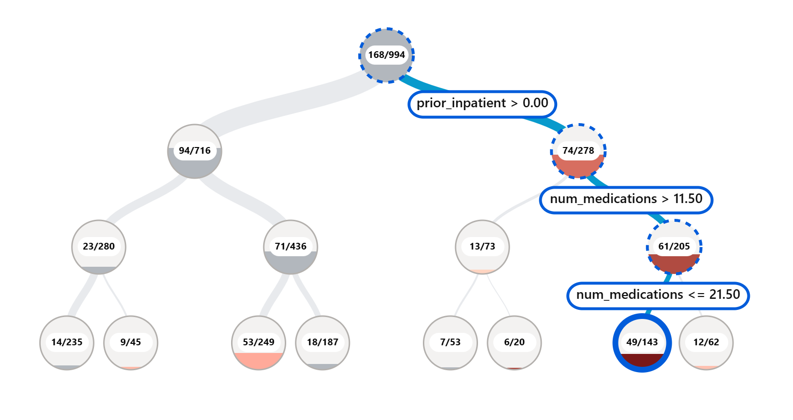
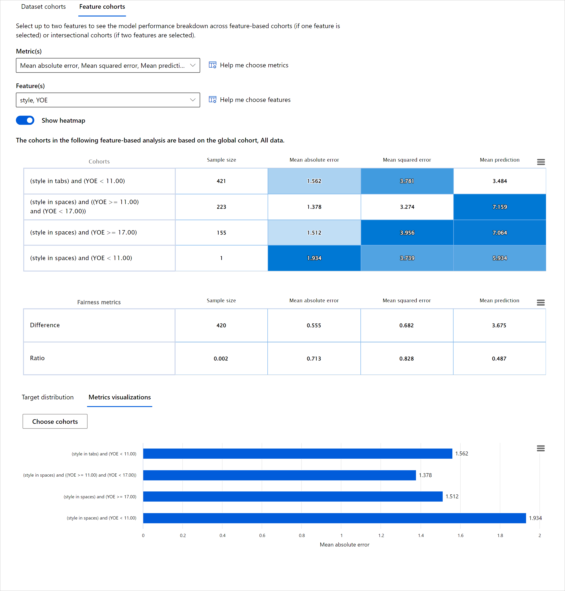

<!--
CO_OP_TRANSLATOR_METADATA:
{
  "original_hash": "ba0f6e1019351351c8ee4c92867b6a0b",
  "translation_date": "2025-08-29T21:14:21+00:00",
  "source_file": "9-Real-World/2-Debugging-ML-Models/README.md",
  "language_code": "bn"
}
-->
# পোস্টস্ক্রিপ্ট: মেশিন লার্নিং মডেল ডিবাগিংয়ে রেসপন্সিবল এআই ড্যাশবোর্ড কম্পোনেন্ট ব্যবহার

## [পূর্ব-লেকচার কুইজ](https://gray-sand-07a10f403.1.azurestaticapps.net/quiz/5/)

## ভূমিকা

মেশিন লার্নিং আমাদের দৈনন্দিন জীবনে গভীর প্রভাব ফেলে। স্বাস্থ্যসেবা, অর্থনীতি, শিক্ষা এবং কর্মসংস্থানের মতো গুরুত্বপূর্ণ ক্ষেত্রগুলোতে এআই ব্যবহৃত হচ্ছে, যা আমাদের ব্যক্তি এবং সমাজ উভয়ের ওপর প্রভাব ফেলে। উদাহরণস্বরূপ, স্বাস্থ্যসেবা নির্ণয় বা প্রতারণা সনাক্তকরণের মতো দৈনন্দিন সিদ্ধান্ত গ্রহণের কাজে সিস্টেম এবং মডেল ব্যবহৃত হয়। এর ফলে, এআই-এর উন্নতি এবং দ্রুত গ্রহণযোগ্যতার সঙ্গে সঙ্গে সামাজিক প্রত্যাশা এবং নিয়ন্ত্রণও পরিবর্তিত হচ্ছে। আমরা প্রায়ই দেখি যে এআই সিস্টেমগুলো প্রত্যাশা পূরণে ব্যর্থ হচ্ছে; নতুন চ্যালেঞ্জ উন্মোচিত হচ্ছে; এবং সরকার এআই সমাধানগুলো নিয়ন্ত্রণ করতে শুরু করেছে। তাই, এই মডেলগুলো বিশ্লেষণ করা গুরুত্বপূর্ণ যাতে সবার জন্য ন্যায্য, নির্ভরযোগ্য, অন্তর্ভুক্তিমূলক, স্বচ্ছ এবং দায়বদ্ধ ফলাফল নিশ্চিত করা যায়।

এই পাঠ্যক্রমে, আমরা এমন কিছু ব্যবহারিক টুল নিয়ে আলোচনা করব যা দিয়ে মডেলের রেসপন্সিবল এআই সমস্যা আছে কিনা তা মূল্যায়ন করা যায়। প্রচলিত মেশিন লার্নিং ডিবাগিং কৌশলগুলো সাধারণত পরিমাণগত হিসাবের ওপর ভিত্তি করে, যেমন সামগ্রিক সঠিকতা বা গড় ত্রুটি হার। কল্পনা করুন, যদি আপনার ডেটাসেটে কিছু নির্দিষ্ট ডেমোগ্রাফিক (যেমন জাতি, লিঙ্গ, রাজনৈতিক মতামত, ধর্ম) অনুপস্থিত থাকে বা অতিরিক্তভাবে প্রতিনিধিত্ব করে, তাহলে কী হতে পারে। আবার, যদি মডেলের আউটপুট কোনো নির্দিষ্ট ডেমোগ্রাফিককে প্রাধান্য দেয়, তাহলে এটি সংবেদনশীল বৈশিষ্ট্য গোষ্ঠীগুলোর অতিরিক্ত বা কম প্রতিনিধিত্বের কারণ হতে পারে, যা মডেলের ন্যায্যতা, অন্তর্ভুক্তি বা নির্ভরযোগ্যতায় সমস্যা সৃষ্টি করতে পারে। আরেকটি বিষয় হলো, মেশিন লার্নিং মডেলগুলোকে "ব্ল্যাক বক্স" হিসেবে বিবেচনা করা হয়, যা মডেলের পূর্বাভাসের কারণ বোঝা এবং ব্যাখ্যা করা কঠিন করে তোলে। এই সমস্ত চ্যালেঞ্জগুলো ডেটা বিজ্ঞানী এবং এআই ডেভেলপারদের জন্য সমস্যা তৈরি করে যখন তাদের কাছে মডেলের ন্যায্যতা বা বিশ্বাসযোগ্যতা মূল্যায়নের জন্য যথাযথ টুল থাকে না।

এই পাঠে, আপনি আপনার মডেল ডিবাগিং সম্পর্কে শিখবেন:

- **ত্রুটি বিশ্লেষণ**: আপনার ডেটা বিতরণে মডেলের উচ্চ ত্রুটি হার কোথায় তা সনাক্ত করা।
- **মডেল ওভারভিউ**: বিভিন্ন ডেটা কোহর্টের মধ্যে তুলনামূলক বিশ্লেষণ করে মডেলের পারফরম্যান্স মেট্রিকের বৈষম্য আবিষ্কার করা।
- **ডেটা বিশ্লেষণ**: আপনার ডেটায় কোথায় অতিরিক্ত বা কম প্রতিনিধিত্ব থাকতে পারে তা তদন্ত করা, যা মডেলকে এক ডেটা ডেমোগ্রাফিকের পক্ষে বা বিপক্ষে পক্ষপাতিত্ব করতে প্রভাবিত করতে পারে।
- **ফিচার ইম্পর্টেন্স**: বৈশ্বিক বা স্থানীয় স্তরে মডেলের পূর্বাভাসে কোন বৈশিষ্ট্যগুলো প্রভাব ফেলছে তা বোঝা।

## পূর্বশর্ত

পূর্বশর্ত হিসেবে, দয়া করে [ডেভেলপারদের জন্য রেসপন্সিবল এআই টুল](https://www.microsoft.com/ai/ai-lab-responsible-ai-dashboard) পর্যালোচনা করুন।

> 

## ত্রুটি বিশ্লেষণ

প্রচলিত মডেল পারফরম্যান্স মেট্রিক, যেমন সঠিকতা পরিমাপ, সাধারণত সঠিক বনাম ভুল পূর্বাভাসের ভিত্তিতে হিসাব করা হয়। উদাহরণস্বরূপ, একটি মডেল ৮৯% সঠিক এবং ০.০০১ ত্রুটি হারের সঙ্গে কাজ করছে বলে বিবেচনা করা যেতে পারে। তবে, ত্রুটিগুলো আপনার ডেটাসেটে সমানভাবে বিতরণ নাও হতে পারে। আপনি ৮৯% সঠিকতার স্কোর পেতে পারেন, কিন্তু দেখতে পারেন যে ডেটার কিছু নির্দিষ্ট অঞ্চলে মডেল ৪২% সময় ব্যর্থ হচ্ছে। এই ব্যর্থতার ধরণগুলো নির্দিষ্ট ডেটা গোষ্ঠীর জন্য ন্যায্যতা বা নির্ভরযোগ্যতার সমস্যার কারণ হতে পারে। মডেল কোথায় ভালো করছে বা করছে না তা বোঝা অত্যন্ত গুরুত্বপূর্ণ। ডেটার সেই অঞ্চলগুলো, যেখানে মডেলের ত্রুটি বেশি, একটি গুরুত্বপূর্ণ ডেটা ডেমোগ্রাফিক হতে পারে।

আরএআই ড্যাশবোর্ডের ত্রুটি বিশ্লেষণ কম্পোনেন্ট একটি গাছের ভিজ্যুয়ালাইজেশনের মাধ্যমে মডেলের ব্যর্থতা বিভিন্ন কোহর্টে কীভাবে বিতরণ হয়েছে তা দেখায়। এটি আপনার ডেটাসেটে উচ্চ ত্রুটি হারের বৈশিষ্ট্য বা অঞ্চল সনাক্ত করতে সহায়তা করে। মডেলের বেশিরভাগ ত্রুটি কোথা থেকে আসছে তা দেখে আপনি মূল কারণ অনুসন্ধান শুরু করতে পারেন। আপনি ডেটার কোহর্ট তৈরি করেও বিশ্লেষণ করতে পারেন। এই ডেটা কোহর্টগুলো ডিবাগিং প্রক্রিয়ায় সহায়তা করে, যেমন কেন একটি কোহর্টে মডেলের পারফরম্যান্স ভালো, কিন্তু অন্যটিতে ত্রুটিপূর্ণ।

গাছের মানচিত্রে দৃশ্যমান সূচকগুলো সমস্যার অঞ্চলগুলো দ্রুত সনাক্ত করতে সহায়তা করে। উদাহরণস্বরূপ, একটি গাছের নোড যত গাঢ় লাল রঙের হয়, ত্রুটি হার তত বেশি।

হিট ম্যাপ হলো আরেকটি ভিজ্যুয়ালাইজেশন কার্যকারিতা, যা ব্যবহারকারীদের একটি বা দুটি বৈশিষ্ট্যের মাধ্যমে ত্রুটি হার বিশ্লেষণ করতে সহায়তা করে এবং মডেলের ত্রুটির কারণ সনাক্ত করতে সহায়তা করে।

ত্রুটি বিশ্লেষণ ব্যবহার করুন যখন আপনাকে প্রয়োজন:

* মডেলের ব্যর্থতা কীভাবে ডেটাসেট এবং বিভিন্ন ইনপুট ও বৈশিষ্ট্য মাত্রায় বিতরণ হয়েছে তা গভীরভাবে বোঝা।
* সামগ্রিক পারফরম্যান্স মেট্রিক ভেঙে ত্রুটিপূর্ণ কোহর্ট সনাক্ত করা এবং লক্ষ্যভিত্তিক সমাধানের পদক্ষেপ নেওয়া।

## মডেল ওভারভিউ

একটি মেশিন লার্নিং মডেলের পারফরম্যান্স মূল্যায়ন করতে হলে এর আচরণ সম্পর্কে সামগ্রিক ধারণা পাওয়া প্রয়োজন। এটি একাধিক মেট্রিক পর্যালোচনা করে অর্জন করা যায়, যেমন ত্রুটি হার, সঠিকতা, রিকল, প্রিসিশন, বা এমএইই (গড় পরম ত্রুটি) এবং পারফরম্যান্স মেট্রিকের মধ্যে বৈষম্য খুঁজে বের করা। একটি মেট্রিক ভালো দেখাতে পারে, কিন্তু অন্য মেট্রিকে ত্রুটি প্রকাশ পেতে পারে। এছাড়া, পুরো ডেটাসেট বা কোহর্টের মধ্যে মেট্রিকের বৈষম্য তুলনা করলে মডেল কোথায় ভালো করছে বা করছে না তা বোঝা যায়। এটি বিশেষভাবে গুরুত্বপূর্ণ সংবেদনশীল বনাম অসংবেদনশীল বৈশিষ্ট্যের (যেমন রোগীর জাতি, লিঙ্গ, বা বয়স) মধ্যে মডেলের পারফরম্যান্স দেখতে, যাতে মডেলের সম্ভাব্য পক্ষপাতিত্ব উন্মোচিত হয়। উদাহরণস্বরূপ, যদি দেখা যায় যে মডেল একটি সংবেদনশীল বৈশিষ্ট্যযুক্ত কোহর্টে বেশি ত্রুটিপূর্ণ, তাহলে এটি মডেলের সম্ভাব্য পক্ষপাতিত্ব প্রকাশ করতে পারে।

আরএআই ড্যাশবোর্ডের মডেল ওভারভিউ কম্পোনেন্ট কেবল ডেটা প্রতিনিধিত্বের পারফরম্যান্স মেট্রিক বিশ্লেষণে সহায়তা করে না, এটি ব্যবহারকারীদের বিভিন্ন কোহর্টের মধ্যে মডেলের আচরণ তুলনা করার ক্ষমতা দেয়।

কম্পোনেন্টের বৈশিষ্ট্য-ভিত্তিক বিশ্লেষণ কার্যকারিতা ব্যবহারকারীদের একটি নির্দিষ্ট বৈশিষ্ট্যের মধ্যে ডেটা উপগোষ্ঠী সংকুচিত করতে এবং সূক্ষ্ম স্তরে অস্বাভাবিকতা সনাক্ত করতে সহায়তা করে। উদাহরণস্বরূপ, ড্যাশবোর্ডে একটি ব্যবহারকারী-নির্বাচিত বৈশিষ্ট্যের জন্য স্বয়ংক্রিয়ভাবে কোহর্ট তৈরি করার বুদ্ধিমত্তা অন্তর্নির্মিত রয়েছে (যেমন *"time_in_hospital < 3"* বা *"time_in_hospital >= 7"*)। এটি ব্যবহারকারীকে একটি বৃহত্তর ডেটা গোষ্ঠী থেকে একটি নির্দিষ্ট বৈশিষ্ট্য আলাদা করতে সক্ষম করে, যাতে এটি মডেলের ত্রুটিপূর্ণ ফলাফলের একটি মূল প্রভাবক কিনা তা দেখা যায়।

মডেল ওভারভিউ কম্পোনেন্ট দুটি শ্রেণির বৈষম্য মেট্রিক সমর্থন করে:

**মডেল পারফরম্যান্সে বৈষম্য**: এই মেট্রিকগুলো ডেটার উপগোষ্ঠীগুলোর মধ্যে নির্বাচিত পারফরম্যান্স মেট্রিকের মানের বৈষম্য (পার্থক্য) গণনা করে। উদাহরণ:

* সঠিকতার হারে বৈষম্য
* ত্রুটি হারে বৈষম্য
* প্রিসিশনে বৈষম্য
* রিকলে বৈষম্য
* গড় পরম ত্রুটিতে (MAE) বৈষম্য

**নির্বাচনের হারে বৈষম্য**: এই মেট্রিক উপগোষ্ঠীগুলোর মধ্যে নির্বাচনের হারের (অনুকূল পূর্বাভাস) পার্থক্য ধারণ করে। উদাহরণস্বরূপ, ঋণ অনুমোদনের হারে বৈষম্য। নির্বাচনের হার বলতে বোঝায় প্রতিটি শ্রেণির ডেটা পয়েন্টের ভগ্নাংশ যা ১ হিসেবে শ্রেণীবদ্ধ (বাইনারি শ্রেণীবিভাজনে) বা পূর্বাভাসের মানের বিতরণ (রিগ্রেশনে)। 

## ডেটা বিশ্লেষণ

> "যদি আপনি ডেটাকে যথেষ্ট সময় ধরে নির্যাতন করেন, এটি যেকোনো কিছু স্বীকার করবে" - রোনাল্ড কোজ

এই উক্তিটি চরম শোনালেও সত্য যে ডেটাকে এমনভাবে প্রক্রিয়াজাত করা যায় যাতে এটি যেকোনো সিদ্ধান্তকে সমর্থন করে। এই ধরনের প্রক্রিয়াজাতকরণ কখনও কখনও অনিচ্ছাকৃতভাবে ঘটে। আমরা সবাই পক্ষপাতের শিকার, এবং কখন আমরা ডেটায় পক্ষপাত আনছি তা সচেতনভাবে বোঝা কঠিন। এআই এবং মেশিন লার্নিং-এ ন্যায্যতা নিশ্চিত করা একটি জটিল চ্যালেঞ্জ। 

ডেটা হলো প্রচলিত মডেল পারফরম্যান্স মেট্রিকের একটি বড় অন্ধকার দিক। আপনার সঠিকতার স্কোর উচ্চ হতে পারে, কিন্তু এটি সবসময় আপনার ডেটাসেটে থাকা অন্তর্নিহিত পক্ষপাত প্রতিফলিত করে না। উদাহরণস্বরূপ, একটি কোম্পানির নির্বাহী পদে ২৭% নারী এবং ৭৩% পুরুষ থাকলে, এই ডেটার ওপর প্রশিক্ষিত একটি চাকরি বিজ্ঞাপন এআই মডেল মূলত পুরুষদের লক্ষ্য করে বিজ্ঞাপন দেখাতে পারে। ডেটায় এই ভারসাম্যহীনতা মডেলের পূর্বাভাসকে এক লিঙ্গের পক্ষে পক্ষপাতিত্ব করতে প্রভাবিত করেছে। এটি একটি ন্যায্যতার সমস্যা প্রকাশ করে যেখানে এআই মডেলে লিঙ্গ পক্ষপাত রয়েছে। 

আরএআই ড্যাশবোর্ডের ডেটা বিশ্লেষণ কম্পোনেন্ট ডেটাসেটে কোথায় অতিরিক্ত বা কম প্রতিনিধিত্ব রয়েছে তা সনাক্ত করতে সহায়তা করে। এটি ব্যবহারকারীদের ডেটা ভারসাম্যহীনতা বা একটি নির্দিষ্ট ডেটা গোষ্ঠীর প্রতিনিধিত্বের অভাব থেকে উদ্ভূত ত্রুটি এবং ন্যায্যতার সমস্যার মূল কারণ নির্ণয়ে সহায়তা করে। এটি ব্যবহারকারীদের পূর্বাভাস এবং প্রকৃত ফলাফল, ত্রুটি গোষ্ঠী এবং নির্দিষ্ট বৈশিষ্ট্যের ভিত্তিতে ডেটাসেট ভিজ্যুয়ালাইজ করতে সক্ষম করে। কখনও কখনও একটি কম প্রতিনিধিত্বকারী ডেটা গোষ্ঠী আবিষ্কার করা মডেলটি ভালোভাবে শিখছে না তা প্রকাশ করতে পারে, যার ফলে উচ্চ ত্রুটি দেখা দেয়। একটি পক্ষপাতযুক্ত ডেটা মডেল কেবল ন্যায্যতার সমস্যাই নয়, এটি দেখায় যে মডেলটি অন্তর্ভুক্তিমূলক বা নির্ভরযোগ্য নয়।

ডেটা বিশ্লেষণ ব্যবহার করুন যখন আপনাকে প্রয়োজন:

* বিভিন্ন ফিল্টার নির্বাচন করে আপনার ডেটাসেটের পরিসংখ্যান অন্বেষণ করা এবং বিভিন্ন মাত্রায় (কোহর্ট নামে পরিচিত) ডেটা বিভক্ত করা।
* বিভিন্ন কোহর্ট এবং বৈশিষ্ট্য গোষ্ঠীর মধ্যে আপনার ডেটাসেটের বিতরণ বোঝা।
* ন্যায্যতা, ত্রুটি বিশ্লেষণ এবং কারণ নির্ধারণ সম্পর্কিত আপনার অনুসন্ধানগুলো (ড্যাশবোর্ডের অন্যান্য কম্পোনেন্ট থেকে প্রাপ্ত) আপনার ডেটাসেটের বিতরণের ফলাফল কিনা তা নির্ধারণ করা।
* প্রতিনিধিত্বের সমস্যাগুলো থেকে উদ্ভূত ত্রুটি কমাতে কোন অঞ্চলে আরও ডেটা সংগ্রহ করা প্রয়োজন তা সিদ্ধান্ত নেওয়া।

## মডেল ব্যাখ্যা

মেশিন লার্নিং মডেলগুলো সাধারণত "ব্ল্যাক বক্স" হিসেবে বিবেচিত হয়। একটি মডেলের পূর্বাভাসে কোন প্রধান বৈশিষ্ট্যগুলো প্রভাব ফেলে তা বোঝা চ্যালেঞ্জিং হতে পারে। একটি মডেল কেন একটি নির্দিষ্ট পূর্বাভাস করেছে তা স্বচ্ছভাবে জানানো গুরুত্বপূর্ণ। উদাহরণস্বরূপ, যদি একটি এআই সিস্টেম পূর্বাভাস দেয় যে একজন ডায়াবেটিক রোগী ৩০ দিনের মধ্যে আবার হাসপাতালে ভর্তি হওয়ার ঝুঁকিতে রয়েছে, তবে এটি পূর্বাভাসের পেছনে থাকা ডেটা সমর্থন প্রদান করতে সক্ষম হওয়া উচিত। এই ধরনের সমর্থনকারী ডেটা সূচক স্বচ্ছতা আনে, যা ক্লিনিশিয়ান বা হাসপাতালগুলোকে সঠিক সিদ্ধান্ত নিতে সহায়তা করে। এছাড়া, একটি নির্দিষ্ট রোগীর জন্য মডেল কেন একটি পূর্বাভাস দিয়েছে তা ব্যাখ্যা করতে পারা স্বাস্থ্যবিধি সম্পর্কিত নিয়মকানুনে দায়বদ্ধতা নিশ্চিত করে। যখন আপনি মেশিন লার্নিং মডেল এমনভাবে ব্যবহার করছেন যা মানুষের জীবনে প্রভাব ফেলে, তখন মডেলের আচরণ কী প্রভাবিত করে তা বোঝা এবং ব্যাখ্যা করা অত্যন্ত গুরুত্বপূর্ণ। মডেল ব্যাখ্যা এবং ব্যাখ্যাত্মকতা নিম্নলিখিত প্রশ্নগুলোর উত্তর দিতে সহায়তা করে:

* মডেল ডিবাগিং: আমার মডেল কেন এই ভুলটি করেছে? আমি কীভাবে আমার মডেল উন্নত করতে পারি?
* মানব-এআই সহযোগিতা: আমি কীভাবে মডেলের সিদ্ধান্তগুলো বুঝতে এবং বিশ্বাস করতে পারি?
* নিয়মতান্ত্রিক সম্মতি: আমার মডেল কি আইনি প্রয়োজনীয়তাগুলো পূরণ করে?

আরএআই ড্যাশবোর্ডের ফিচার ইম্পর্টেন্স কম্পোনেন্ট আপনাকে ডিবাগ করতে এবং একটি মডেল কীভাবে পূর্বাভাস তৈরি করে তা ব্যাপকভাবে বুঝতে সহায়তা করে। এটি মেশিন লার্নিং পেশাদার এবং সিদ্ধান্ত গ্রহণকারীদের জন্য একটি কার্যকরী টুল, যা মডেলের আচরণে প্রভাব ফেলা বৈশিষ্ট্যগুলোর প্রমাণ দেখাতে এবং ব্যাখ্যা করতে সহায়তা করে। ব্যবহারকারীরা বৈশ্বিক এবং স্থানীয় ব্যাখ্যা উভয়ই অন্বেষণ করতে পারেন, যা মডেলের পূর্বাভাসে কোন বৈশিষ্ট্যগুলো প্রভাব ফেলেছে তা যাচাই করতে সহায়তা করে। বৈশ্বিক ব্যাখ্যা মডেলের সামগ্রিক পূর্বাভাসে প্রভাব ফেলা শীর্ষ বৈশিষ্ট্যগুলো তালিকাভুক্ত করে। স্থানীয় ব্যাখ্যা দেখায় যে একটি নির্দিষ্ট ক্ষেত্রে মডেলের পূর্বাভাসে কোন বৈশিষ্ট্যগুলো প্রভাব ফেলেছে। নির্দিষ্ট একটি ক্ষেত্রে ডিবাগিং বা অডিটিংয়ে স্থানীয় ব্যাখ্যা মূল্যায়ন করার ক্ষমতা মডেলটি সঠিক বা ভুল পূর্বাভাস কেন দিয়েছে তা আরও ভালোভাবে বুঝতে এবং ব্যাখ্যা করতে সহায়তা করে।

* বৈশ্বিক ব্যাখ্যা: উদাহরণস্বরূপ, ডায়াবেটিস হাসপাতাল পুনঃভর্তি মডেলের সামগ্রিক আচরণে কোন বৈশিষ্ট্যগুলো প্রভাব ফেলে?
* স্থানীয় ব্যাখ্যা: উদাহরণস্বরূপ, কেন ৬০ বছরের বেশি বয়সী এবং পূর্বে হাসপাতালে ভর্তি হওয়া একজন
- **অতিরিক্ত বা অপর্যাপ্ত প্রতিনিধিত্ব**। ধারণাটি হলো একটি নির্দিষ্ট গোষ্ঠীকে একটি নির্দিষ্ট পেশায় দেখা যায় না, এবং যে কোনো পরিষেবা বা কার্যক্রম যা এটি প্রচার করে চলেছে, তা ক্ষতির কারণ হয়ে দাঁড়ায়।

### Azure RAI ড্যাশবোর্ড

[Azure RAI ড্যাশবোর্ড](https://learn.microsoft.com/en-us/azure/machine-learning/concept-responsible-ai-dashboard?WT.mc_id=aiml-90525-ruyakubu) ওপেন-সোর্স টুলের উপর ভিত্তি করে তৈরি, যা শীর্ষস্থানীয় একাডেমিক প্রতিষ্ঠান এবং সংস্থাগুলোর (যেমন Microsoft) দ্বারা উন্নত করা হয়েছে। এটি ডেটা বিজ্ঞানী এবং AI ডেভেলপারদের মডেলের আচরণ আরও ভালোভাবে বোঝা, এবং AI মডেল থেকে উদ্ভূত অপ্রত্যাশিত সমস্যাগুলি আবিষ্কার ও সমাধান করতে সহায়ক।

- RAI ড্যাশবোর্ডের বিভিন্ন উপাদান কীভাবে ব্যবহার করবেন তা জানতে [ডকুমেন্টেশন](https://learn.microsoft.com/en-us/azure/machine-learning/how-to-responsible-ai-dashboard?WT.mc_id=aiml-90525-ruyakubu) দেখুন।

- Azure Machine Learning-এ আরও দায়িত্বশীল AI পরিস্থিতি ডিবাগ করার জন্য কিছু RAI ড্যাশবোর্ডের [নমুনা নোটবুক](https://github.com/Azure/RAI-vNext-Preview/tree/main/examples/notebooks) দেখুন।

---
## 🚀 চ্যালেঞ্জ

প্রথম থেকেই পরিসংখ্যানগত বা ডেটা পক্ষপাত এড়ানোর জন্য, আমাদের উচিত:

- সিস্টেমে কাজ করা ব্যক্তিদের মধ্যে বিভিন্ন পটভূমি এবং দৃষ্টিভঙ্গি নিশ্চিত করা  
- এমন ডেটাসেটে বিনিয়োগ করা যা আমাদের সমাজের বৈচিত্র্যকে প্রতিফলিত করে  
- পক্ষপাত সনাক্ত এবং সংশোধন করার জন্য আরও উন্নত পদ্ধতি বিকাশ করা  

বাস্তব জীবনের সেই পরিস্থিতিগুলি নিয়ে ভাবুন যেখানে মডেল তৈরির এবং ব্যবহারের ক্ষেত্রে অন্যায় স্পষ্ট। আর কী বিষয় আমাদের বিবেচনা করা উচিত?

## [পোস্ট-লেকচার কুইজ](https://gray-sand-07a10f403.1.azurestaticapps.net/quiz/6/)
## পর্যালোচনা ও স্ব-অধ্যয়ন

এই পাঠে, আপনি মেশিন লার্নিং-এ দায়িত্বশীল AI অন্তর্ভুক্ত করার কিছু ব্যবহারিক টুল সম্পর্কে শিখেছেন।

এই ওয়ার্কশপটি দেখুন এবং বিষয়গুলো আরও গভীরভাবে জানুন:

- দায়িত্বশীল AI ড্যাশবোর্ড: বাস্তবে RAI পরিচালনার জন্য একক প্ল্যাটফর্ম, Besmira Nushi এবং Mehrnoosh Sameki দ্বারা

> 🎥 উপরের ছবিতে ক্লিক করুন ভিডিও দেখার জন্য: দায়িত্বশীল AI ড্যাশবোর্ড: বাস্তবে RAI পরিচালনার জন্য একক প্ল্যাটফর্ম, Besmira Nushi এবং Mehrnoosh Sameki দ্বারা

দায়িত্বশীল AI এবং আরও বিশ্বাসযোগ্য মডেল তৈরির বিষয়ে আরও জানতে নিম্নলিখিত উপকরণগুলি দেখুন:

- ML মডেল ডিবাগ করার জন্য Microsoft's RAI ড্যাশবোর্ড টুল: [দায়িত্বশীল AI টুল রিসোর্স](https://aka.ms/rai-dashboard)

- দায়িত্বশীল AI টুলকিট অন্বেষণ করুন: [Github](https://github.com/microsoft/responsible-ai-toolbox)

- Microsoft's RAI রিসোর্স সেন্টার: [দায়িত্বশীল AI রিসোর্স – Microsoft AI](https://www.microsoft.com/ai/responsible-ai-resources?activetab=pivot1%3aprimaryr4)

- Microsoft's FATE গবেষণা দল: [FATE: AI-তে ন্যায্যতা, জবাবদিহিতা, স্বচ্ছতা এবং নৈতিকতা - Microsoft Research](https://www.microsoft.com/research/theme/fate/)

## অ্যাসাইনমেন্ট

[RAI ড্যাশবোর্ড অন্বেষণ করুন](assignment.md)

---

**অস্বীকৃতি**:  
এই নথিটি AI অনুবাদ পরিষেবা [Co-op Translator](https://github.com/Azure/co-op-translator) ব্যবহার করে অনুবাদ করা হয়েছে। আমরা যথাসম্ভব সঠিকতার জন্য চেষ্টা করি, তবে অনুগ্রহ করে মনে রাখবেন যে স্বয়ংক্রিয় অনুবাদে ত্রুটি বা অসঙ্গতি থাকতে পারে। মূল ভাষায় থাকা নথিটিকে প্রামাণিক উৎস হিসেবে বিবেচনা করা উচিত। গুরুত্বপূর্ণ তথ্যের জন্য, পেশাদার মানব অনুবাদ সুপারিশ করা হয়। এই অনুবাদ ব্যবহারের ফলে কোনো ভুল বোঝাবুঝি বা ভুল ব্যাখ্যা হলে আমরা দায়বদ্ধ থাকব না।