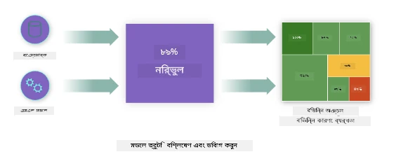
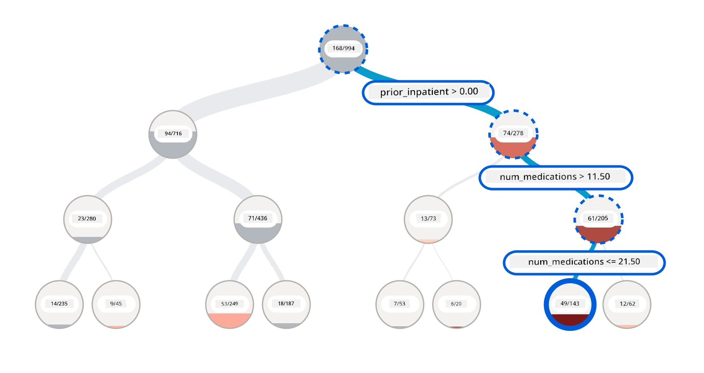
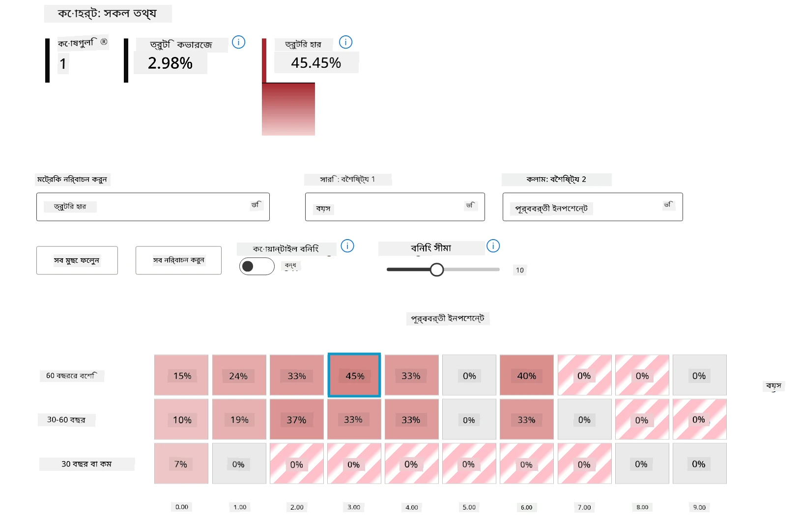
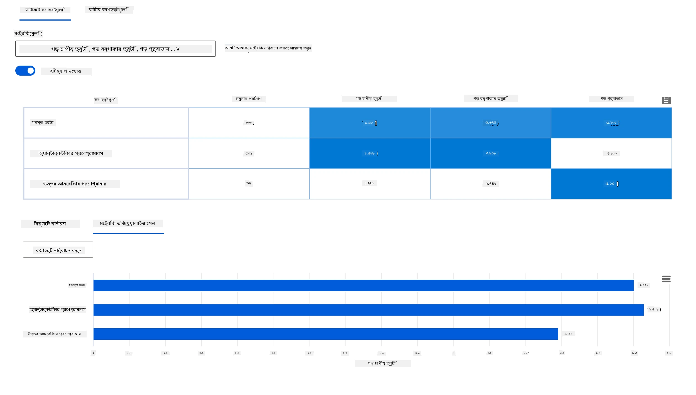
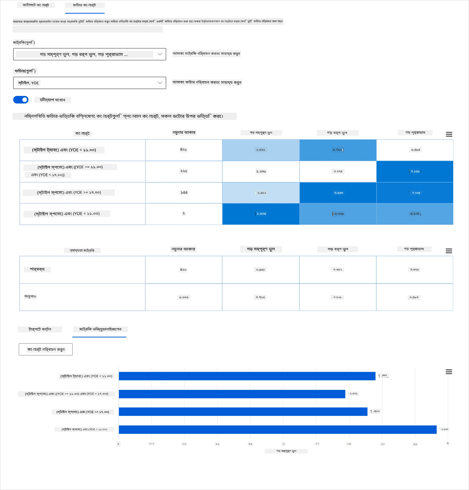
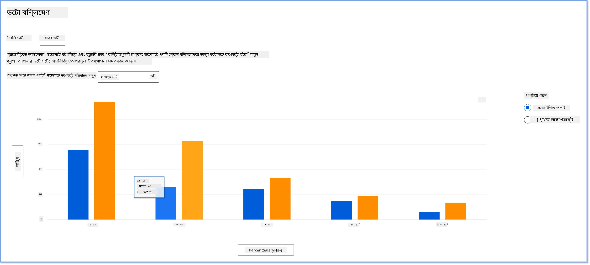
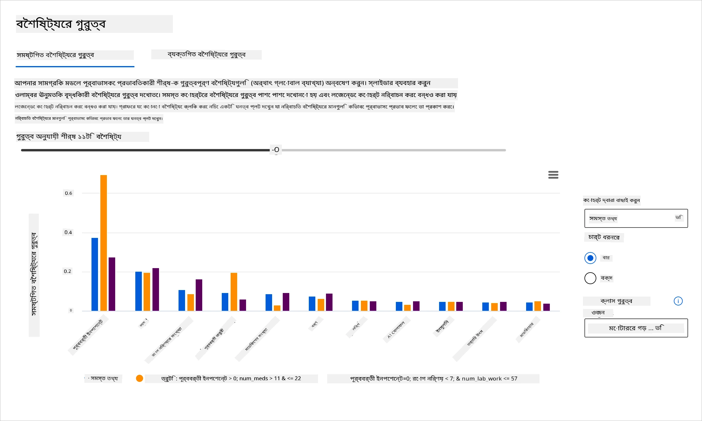
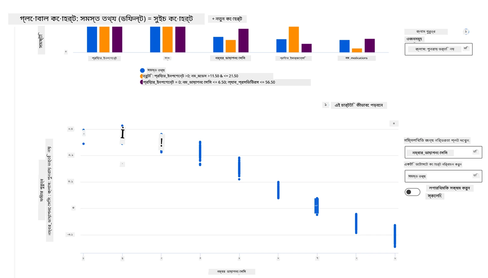

# পোস্টস্ক্রিপ্ট: রেস্পন্সিবল AI ড্যাশবোর্ড কম্পোনেন্ট ব্যবহার করে মেশিন লার্নিংয়ে মডেল ডিবাগিং
 

## [প্রাক-লেকচার কুইজ](https://ff-quizzes.netlify.app/en/ml/)
 
## পরিচিতি

মেশিন লার্নিং আমাদের দৈনন্দিন জীবনে প্রভাব ফেলে। AI আমাদের প্রত্যেকে এবং আমাদের সমাজের উপর প্রভাবিত করা সবচেয়ে গুরুত্বপূর্ণ কিছু সিস্টেমে প্রবেশ করছে, যেমন স্বাস্থ্যসেবা, আর্থিক, শিক্ষা, এবং কর্মসংস্থান। উদাহরণস্বরূপ, সিস্টেম এবং মডেলগুলি দৈনন্দিন সিদ্ধান্ত গ্রহণের কাজগুলিতে জড়িত থাকে, যেমন স্বাস্থ্যসেবা নির্ণয় বা প্রতারণা সনাক্তকরণ। এর ফলে, AI এর অগ্রগতি এবং দ্রুত গ্রহণের সাথে সাথে সমাজের পরিবর্তিত প্রত্যাশা এবং বৃদ্ধিপ্রাপ্ত নিয়ন্ত্রণের মুখোমুখি হচ্ছে। আমরা ক্রমাগত দেখি এমন জায়গা যেখানে AI সিস্টেমগুলি প্রত্যাশা পূরণে ব্যর্থ হয়; তারা নতুন চ্যালেঞ্জ উন্মোচন করে; এবং সরকারগুলি AI সমাধান নিয়ন্ত্রণ শুরু করছে। তাই, এই মডেলগুলি বিশ্লেষণ করা গুরুত্বপূর্ণ যাতে সবার জন্য ন্যায়সঙ্গত, বিশ্বস্ত, অন্তর্ভুক্তিমূলক, স্বচ্ছ এবং দায়বদ্ধ ফলাফল প্রদান করা যায়।

এই পাঠক্রমে, আমরা বাস্তবিক টুলগুলি দেখব যা ব্যবহার করে যাচাই করা যায় একটি মডেলে রেস্পন্সিবল AI সমস্যা আছে কিনা। ঐতিহ্যগত মেশিন লার্নিং ডিবাগিং কৌশলগুলি সাধারণত পরিমাপের উপর ভিত্তি করে যেমন সম্মিলিত সঠিকতা বা গড় ত্রুটির ক্ষতি। ভাবুন, যখন আপনি যে তথ্য ব্যবহার করে মডেলগুলি নির্মাণ করছেন তা কিছু জনসংখ্যার প্রতিনিধিত্ব করছে না, যেমন বর্ণ, লিঙ্গ, রাজনৈতিক দৃষ্টিভঙ্গি, ধর্ম বা এই ধরনের জনসংখ্যার অতিরিক্ত/অপ্রতুল প্রতিনিধিত্ব। মডেলের আউটপুট যদি নির্দিষ্ট কোন জনসংখ্যার পক্ষে ব্যাখ্যা করা হয় তাহলে কী হয়? এটি সংবেদনশীল বৈশিষ্ট্য গোষ্ঠীর অতিরিক্ত বা কম প্রতিনিধিত্ব সৃষ্টি করতে পারে, যার ফলে মডেলের ন্যায্যতা, অন্তর্ভুক্তিতা বা নির্ভরযোগ্যতা সমস্যা দেখা দেয়। আরেকটি কারণ হলো, মেশিন লার্নিং মডেলগুলি কালো বাক্স হিসেবে বিবেচিত হয়, যার ফলে মডেলের পূর্বাভাস কীভাবে কাজ করে তা বোঝা এবং ব্যাখ্যা করা কঠিন। এ সকলই চ্যালেঞ্জ যা ডেটা বিজ্ঞানী এবং AI ডেভেলপাররা সম্মুখীন হন যখন তাদের কাছে পর্যাপ্ত ডিবাগ এবং ন্যায়সঙ্গতা বা বিশ্বাসযোগ্যতা যাচাই করার সরঞ্জাম থাকে না।

এই পাঠে আপনি শিখবেন কিভাবে আপনার মডেলগুলি ডিবাগ করবেন:

-	**ত্রুটি বিশ্লেষণ**: আপনার ডেটা বিতরণে মডেলের কোথায় উচ্চ ত্রুটির হার আছে তা নির্ণয় করুন।
-	**মডেল ওভারভিউ**: বিভিন্ন ডেটা গোষ্ঠীর মধ্যে তুলনামূলক বিশ্লেষণ করুন এবং মডেলের কর্মক্ষমতার ভিন্নতা আবিষ্কার করুন।
-	**ডেটা বিশ্লেষণ**: কোথায় আপনার ডেটার অতিরিক্ত বা কম প্রতিনিধিত্ব থাকতে পারে তা অনুসন্ধান করুন যা মডেলকে এক ডেটা জনসংখ্যার পক্ষে পক্ষপাতপূর্ণ করতে পারে।
-	**ফিচার ইম্পরটেন্স**: বুঝুন কোন বৈশিষ্ট্যগুলি গ্লোবাল অথবা লোকাল স্তরে মডেলের পূর্বাভাস চালায়।

## পূর্বপ্রয়োজনীয়তা

পূর্বপ্রয়োজনীয়তা হিসেবে, অনুগ্রহ করে পর্যালোচনা করুন [উন্নয়নকারীদের জন্য রেস্পন্সিবল AI টুল](https://www.microsoft.com/ai/ai-lab-responsible-ai-dashboard)

> 

## ত্রুটি বিশ্লেষণ

মডেলের পারফরম্যান্স পরিমাপের জন্য ঐতিহ্যগত কর্মক্ষমতা সূচকগুলি সাধারণত সঠিক বনাম ভুল পূর্বাভাসের উপর ভিত্তি করে গণনা করা হয়। উদাহরণস্বরূপ, একটি মডেল ৮৯% সময় সঠিক বলে নির্ধারণ করা এবং ত্রুটি হার ০.০০১ হলে সেটিকে ভালো পারফরম্যান্স বলা যেতে পারে। কিন্তু ত্রুটিগুলি আপনার মূল ডেটাসেটে সমানভাবে বিতরণ হয় না। আপনি হয়তো ৮৯% সঠিকতা পাবেন কিন্তু দেখতে পাবেন এমন ডেটার বিভিন্ন অঞ্চল রয়েছে যেখানে মডেল ৪২% সময় ব্যর্থ হচ্ছে। এই ধরনের ব্যর্থতা নিদর্শন নির্দিষ্ট ডেটা গোষ্ঠীর জন্য ন্যায়সঙ্গতা বা বিশ্বাসযোগ্যতা সমস্যা তৈরি করতে পারে। মডেলটি কোথায় ভালো কাজ করছে বা করছে না তা বোঝা অত্যন্ত গুরুত্বপূর্ণ। যেখানে মডেলে ভুলের সংখ্যা বেশি সেখানে তথ্যটি একটি গুরুত্বপূর্ণ ডেটা জনসংখ্যা হতে পারে।

RAI ড্যাশবোর্ডের ত্রুটি বিশ্লেষণ কম্পোনেন্টটি দেখায় কিভাবে মডেল ব্যর্থতা বিভিন্ন গোষ্ঠীর মধ্যে বিতরণ হয়েছে একটি ট্রি ভিজ্যুয়ালাইজেশনের মাধ্যমে। এটি বৈশিষ্ট্য বা এমন কোন এলাকাগুলো চিহ্নিত করতে সাহায্য করে যেখানে আপনার ডেটাসেটে উচ্চ ত্রুটির হার আছে। মডেলের ভুলের উৎস খুঁজে পেতে এটি সহায়ক। আপনি ডেটার গোষ্ঠীও তৈরি করতে পারেন বিশ্লেষণের জন্য। এই গোষ্ঠীগুলো ডিবাগিং প্রক্রিয়ায় সহায়তা করে বুঝতে কেন মডেলের পারফরম্যান্স এক গোষ্ঠীতে ভাল কিন্তু অন্যটিতে ত্রুটিপূর্ণ।

ট্রি ম্যাপের ভিজ্যুয়াল নির্দেশকগুলি সমস্যা এলাকাগুলো দ্রুত সনাক্ত করতে সাহায্য করে। উদাহরণস্বরূপ, একটি ট্রি নোডের লাল রং যত গাঢ় হবে তত ত্রুটির হার বেশি থাকবে।

হিট ম্যাপ আরেকটি ভিজ্যুয়ালাইজেশন ফিচার যা ব্যবহারকারীরা একটি বা দুটি বৈশিষ্ট্যের মাধ্যমে ত্রুটির হার তদন্তে ব্যবহার করতে পারেন যা সম্পূর্ণ ডেটাসেট অথবা গোষ্ঠীর মধ্যে মডেল ত্রুটির কারণ খুঁজতে সাহায্য করে।

ত্রুটি বিশ্লেষণ ব্যবহার করুন যখন আপনাকে:

* গভীরভাবে বুঝতে হবে কিভাবে মডেল ব্যর্থতা ডেটাসেট এবং বিভিন্ন ইনপুট ও বৈশিষ্ট্য মাত্রায় বিতরণ হয়েছে।
* সম্মিলিত কর্মক্ষমতা সূচক ভাঙ্গা এবং স্বয়ংক্রিয়ভাবেই ভুল গোষ্ঠী আবিষ্কার করতে যা লক্ষ্যভিত্তিক সমাধান পদক্ষেপে সাহায্য করবে।

## মডেল ওভারভিউ

মেশিন লার্নিং মডেলের পারফরম্যান্স মূল্যায়নের জন্য এর আচরণের সম্পূর্ণ ধারণা প্রয়োজন। এটি একাধিক সূচক যেমন ত্রুটির হার, সঠিকতা, রিকল, প্রিসিশন, বা MAE (গড় আপেক্ষিক ত্রুটি) পর্যালোচনা করে প্রাপ্ত হতে পারে যা পারফরম্যান্স সূচকের মধ্যে বৈষম্য খুঁজে পেতে সাহায্য করে। একটি সূচক ভাল দেখলেও অন্য সূচকে ভুলসাধ্যতা প্রকাশ পেতে পারে। এছাড়া, সমগ্র ডেটাসেট বা গোষ্ঠীর মধ্যে সূচক তুলনা মডেল কোথায় ভাল কাজ করছে বা কাজ করছে না তা স্পষ্ট করে তোলে। এটি বিশেষ করে সংবেদনশীল বনাম অসংবেদনশীল বৈশিষ্ট্যের পারফরম্যান্স পর্যবেক্ষণে গুরুত্বপূর্ণ (যেমন রোগীর বর্ণ, লিঙ্গ বা বয়স) যা মডেলের সম্ভাব্য পক্ষপাত উন্মোচন করতে পারে। উদাহরণস্বরূপ, মডেল সংবেদনশীল বৈশিষ্ট্যযুক্ত গোষ্ঠীতে বেশি ভুল করলে এটি মডেলের সম্ভাব্য পক্ষপাত প্রকাশ করে।

RAI ড্যাশবোর্ডের মডেল ওভারভিউ কম্পোনেন্টটি কেবল গোষ্ঠীর মধ্যে ডেটার কর্মক্ষমতা সূচক বিশ্লেষণই নয় বরং ভিন্ন গোষ্ঠীর মধ্যে মডেলের আচরণ তুলনা করার সুযোগ দেয়।

এই কম্পোনেন্টের বৈশিষ্ট্য-ভিত্তিক বিশ্লেষণ ফাংশনালিটি ব্যবহারকারীকে নির্দিষ্ট বৈশিষ্ট্যের মধ্যে ডেটার উপগোষ্ঠী সংকুচিত করতে সাহায্য করে যাতে সূক্ষ্ম স্তরে ব্যতিক্রম সনাক্ত করা যায়। উদাহরণস্বরূপ, ড্যাশবোর্ডে বিল্ট-ইন বুদ্ধিমত্তা আছে যা ব্যবহারকারীর নির্বাচিত বৈশিষ্ট্যের জন্য স্বয়ংক্রিয়ভাবে গোষ্ঠী তৈরি করে (যেমন, *"time_in_hospital < 3"* অথবা *"time_in_hospital >= 7"*)। এটি ব্যবহারকারীকে বড় ডেটা গোষ্ঠী থেকে একটি কিছু বৈশিষ্ট্য পৃথক করে দেখতে দেয় যে তা মডেলের ভুল ফলাফলে গুরুত্বপূর্ণ প্রভাব ফেলে কিনা।

মডেল ওভারভিউ কম্পোনেন্ট দুই ধরনের বৈষম্য সূচক সমর্থন করে:

**মডেল কর্মক্ষমতায় বৈষম্য**: এই সূচকগুলি নির্বাচিত কর্মক্ষমতা সূচকের (metric) মানগুলোর মধ্যে উপগোষ্ঠীর মধ্যে পার্থক্য গণনা করে। কিছু উদাহরণ:

* সঠিকতার হার বৈষম্য
* ত্রুটি হারের বৈষম্য
* প্রিসিশনের বৈষম্য
* রিকলের বৈষম্য
* গড় আপেক্ষিক ত্রুটি (MAE) এর বৈষম্য

**নির্বাচন হারে বৈষম্য**: এই সূচকে উপগোষ্ঠীর মধ্যে নির্বাচনের হার (পক্ষপাতমূলক পূর্বাভাস) এর পার্থক্য থাকে। যেমন ঋণ অনুমোদনের হারে বৈষম্য। নির্বাচনের হার মানে হলো প্রতিটি শ্রেণীতে ডেটা পয়েন্টগুলোর ভাগ যা ১ হিসাবে শ্রেণীবদ্ধ হয় (বাইনারি শ্রেণীবিভাগে) অথবা পূর্বাভাসের মানের বিতরণ (রিগ্রেশনে)।

## ডেটা বিশ্লেষণ

> "যদি তুমি ডেটাকে যথেষ্ট লম্বা সময় ধরে শিকলবন্দী করো, তবে এটি যেকোন কিছু স্বীকার করবে" - রোনাল্ড কোস

এই উক্তিটি অতিরঞ্জিত শোনায়, তবে সত্য হলো তথ্যকে যেকোন সিদ্ধান্তের পক্ষে প্রভাবিত করা যায়। এমন প্রভাব কখনো তাৎক্ষণিকভাবে ঘটতে পারে। আমরা সবাই পক্ষপাত ধারণ করি, এবং সচেতনভাবে কখন ডেটায় পক্ষপাত প্রবেশ করাচ্ছি তা বুঝতে কঠিন। AI এবং মেশিন লার্নিংয়ে ন্যায়সঙ্গতা নিশ্চিত করা একটি জটিল চ্যালেঞ্জ।

ডেটা ঐতিহ্যগত মডেল কর্মক্ষমতা সূচকের জন্য একটি বড় অন্ধস্থান। আপনার উচ্চ সঠিকতা থাকতে পারে, তবে এটি সবসময় ডেটাসেটের মধ্যে থাকা পক্ষপাত প্রতিফলিত করে না। উদাহরণস্বরূপ, যদি কোনো প্রতিষ্ঠানের কর্মচারীদের ডেটাসেটে ২৭% মহিলা নির্বাহী পদে থাকে এবং ৭৩% পুরুষ একই স্তরে থাকে, তাহলে এ তথ্য ব্যবহার করে প্রশিক্ষিত একটি চাকরির বিজ্ঞাপন AI মডেল প্রধানত পুরুষ শ্রোতাদের লক্ষ্য করত; যা লিঙ্গ পক্ষপাত প্রকাশ করে। এই ধরনের ডেটা অসমতা মডেলের পূর্বাভাসকে একটি লিঙ্গের পক্ষে পক্ষপাতপ্রবণ করে। এটা ন্যায়সঙ্গতার ইস্যু নির্দেশ করে যেখানে AI মডেলে লিঙ্গ পক্ষপাত আছে।

RAI ড্যাশবোর্ডের ডেটা বিশ্লেষণ কম্পোনেন্ট আস্তে সাহায্য করে সনাক্ত করতে কোথায় 과অঙ্গ বা কম প্রতিনিধিত্ব আছে। এটি ব্যবহারকারীদের নির্ণয় করতে সাহায্য করে ডেটার অসমতা বা নির্দিষ্ট গোষ্ঠীর প্রতিনিধিত্বের অভাব থেকে ত্রুটি এবং ন্যায়সঙ্গতার সমস্যা কোথা থেকে আসছে। এটি ব্যবহারকারীদের অনুমানকৃত এবং প্রকৃত ফলাফল, ত্রুটি গোষ্ঠী এবং নির্দিষ্ট বৈশিষ্ট্যের ভিত্তিতে ডেটাসেট ভিজ্যুয়ালাইজ করার অনুমতি দেয়। কখনো কখনো কম প্রতিনিধিত্বশীল ডেটা গোষ্ঠী আবিষ্কার কেবল তা নয় যে মডেল ভালো শিখছে না, ফলে ভুলের সংখ্যা বেশি। পক্ষপাতপূর্ণ মডেল হওয়া মানেই শুধু ন্যায়সঙ্গতার সমস্যা নয়, বরং মডেল অন্তর্ভুক্তিমূলক বা বিশ্বাসযোগ্য নয় তা নির্দেশ করে।

ডেটা বিশ্লেষণ ব্যবহার করুন যখন আপনাকে:

* বিভিন্ন ফিল্টার নির্বাচন করে আপনার ডেটাসেট পরিসংখ্যান অনুসন্ধান করতে হবে (যাকে কোহর্টও বলা হয়)।
* বিভিন্ন গোষ্ঠী ও বৈশিষ্ট্য গোষ্ঠীগুলোর মধ্যে ডেটাসেটের বিতরণ বুঝতে হবে।
* জানতে হবে যে অন্য ড্যাশবোর্ড কম্পোনেন্ট থেকে প্রাপ্ত ন্যায়সঙ্গতা, ত্রুটি বিশ্লেষণ এবং কারণ-প্রমাণিত ফলাফল কি ডেটাসেটের বিতরণের কারণে হয়েছে কিনা।
* সিদ্ধান্ত নিতে হবে কোন এলাকায় আরও ডেটা সংগ্রহ করা দরকার যাতে প্রতিনিধিত্বের জনিত সমস্যা, লেবেল গোলমাল, বৈশিষ্ট্যের গোলমাল ইত্যাদি থেকে উদ্ভূত ত্রুটি দূর করা যায়।

## মডেল ব্যাখ্যাত্মকতা

মেশিন লার্নিং মডেলগুলি সাধারণত কালো বাক্স হিসেবে বিবেচিত হয়। কোন প্রধান বৈশিষ্ট্য মডেলের পূর্বাভাস চালাচ্ছে তা বোঝা কঠিন। কোন মডেল কেন নির্দিষ্ট পূর্বাভাস দেয় তা স্পষ্টতা দেওয়া গুরুত্বপূর্ণ। উদাহরণস্বরূপ, যদি কোনো AI সিস্টেম পূর্বাভাস দেয় যে একজন ডায়াবেটিস রোগীর ৩০ দিনের কম সময়ের মধ্যে হাসপাতলে পুনরায় ভর্তি হওয়ার ঝুঁকি আছে, তবে এটি তার পূর্বাভাসের পেছনে থাকা সমর্থনকারী তথ্য দিতে পারা উচিত। এই সমর্থক তথ্য প্রদান স্বচ্ছতা আনে যা ক্লিনিশিয়ান বা হাসপাতালকে সুষ্ঠু সিদ্ধান্ত নিতে সাহায্য করে। এছাড়া, একজন নির্দিষ্ট রোগীর জন্য মডেল কেন পূর্বাভাস দিয়েছে তা ব্যাখ্যা করা স্বাস্থ্য নিয়মাবলীর সঙ্গে দায়বদ্ধতা জড়িত করে। যখন আপনি মেশিন লার্নিং মডেল মানুষের জীবনে প্রভাবিত করার জন্য ব্যবহার করছেন, তখন মডেলের আচরণ কী দ্বারা প্রভাবিত হচ্ছে তা বোঝা এবং ব্যাখ্যা করা অত্যন্ত গুরুত্বপূর্ণ। মডেল ব্যাখ্যাত্মকতা এবং বোধগম্যতা এই ধরনের প্রশ্নের উত্তর দেয় যেমন:

* মডেল ডিবাগিং: আমার মডেল কেন এই ভুল করল? কিভাবে আমি মডেল উন্নত করতে পারি?
* মানব-AI সমবায়: কিভাবে আমি মডেলের সিদ্ধান্ত বোঝব এবং বিশ্বাস করব?
* নিয়ন্ত্রক অনুপালন: আমার মডেল কি আইনি শর্ত পূরণ করে?

RAI ড্যাশবোর্ডের ফিচার ইম্পরটেন্স কম্পোনেন্ট আপনাকে ডিবাগ করতে এবং বুঝতে সাহায্য করে কিভাবে মডেল পূর্বাভাস দেয়। এটি মেশিন লার্নিং পেশাজীবী এবং সিদ্ধান্ত গ্রহণকারীদের জন্য গুরুত্বপূর্ণ যা একটি মডেলের আচরণে প্রভাব ফেলা বৈশিষ্ট্যগুলোর প্রমাণ দেখিয়ে আইনগত নিয়মাবলীর সঙ্গতি নিশ্চিত করে। পরবর্তীতে, ব্যবহারকারীরা গ্লোবাল এবং লোকাল ব্যাখ্যাত্মকতা দুটোই অন্বেষণ করতে পারেন যা যাচাই করে কোন বৈশিষ্ট্য মডেলের পূর্বাভাস চালায়। গ্লোবাল ব্যাখ্যাত্মকতায় মডেলের ওপর সর্বাধিক প্রভাব ফেলা শীর্ষ বৈশিষ্ট্য তালিকাভুক্ত হয়। লোকাল ব্যাখ্যাত্মকতায় একটি নির্দিষ্ট মামলার পূর্বাভাস চালানো বৈশিষ্ট্যগুলো প্রদর্শিত হয়। লোকাল ব্যাখ্যাত্মকতা নিরীক্ষণ বা ডিবাগিং এর জন্য সহায়ক, কারণ এতে একটি নির্দিষ্ট মামলার সঠিক বা ভুল পূর্বাভাস কেন হয় তা ব্যাখ্যা করা যায়।

* গ্লোবাল ব্যাখ্যাত্মকতা: উদাহরণস্বরূপ, কোন বৈশিষ্ট্য একটি ডায়াবেটিস হাসপাতালের পুনর্ভর্তি মডেলের সামগ্রিক আচরণে প্রভাব ফেলে?
* লোকাল ব্যাখ্যাত্মকতা: উদাহরণস্বরূপ, কেন এক রোগী, যাঁর বয়স ৬০ এর বেশি এবং আগের ভর্তি ইতিহাস আছে, তাকে পূর্বাভাস দেওয়া হয় যে সে ৩০ দিনের মধ্যে পুনরায় ভর্তি হবে বা হবে না?

মডেলের পারফরম্যান্স বিভিন্ন গোষ্ঠীতে বিশ্লেষণের সময়, ফিচার ইম্পরটেন্স দেখায় বৈশিষ্ট্যের প্রভাবের মাত্রা। এটি মডেলের ভুল পূর্বাভাসে বৈশিষ্ট্যের প্রভাবের পার্থক্য প্রকাশ করে। কম্পোনেন্টটি দেখাতে পারে কোন বৈশিষ্ট্যের কোন মান মডেলের ফলাফলে ইতিবাচক বা নেতিবাচক প্রভাব ফেলেছে। উদাহরণস্বরূপ, যদি মডেল ভুল পূর্বাভাস দেয়, এটি বিস্তারিত তথ্য দিয়ে বোঝায় কোন বৈশিষ্ট্য বা মান পূর্বাভাস চালায়। এই স্তরের তথ্য ডিবাগিং ছাড়াও স্বচ্ছতা এবং যাচাই প্রক্রিয়াতে দায়বদ্ধতা বাড়ায়। অবশেষে, এটি ন্যায়সঙ্গতার সমস্যা চিহ্নিত করতে সাহায্য করে। উদাহরণস্বরূপ, যদি এক সংবেদনশীল বৈশিষ্ট্য যেমন জাতিত্ব বা লিঙ্গ মডেলের পূর্বাভাসে অত্যন্ত প্রভাবশালী হয়, তবে এটি মডেলে জাতি বা লিঙ্গ পক্ষপাতের সংকেত হতে পারে।

ব্যাখ্যাত্মকতা ব্যবহার করুন যখন আপনাকে:

* বুঝতে হবে আপনার AI সিস্টেমের পূর্বাভাস কতটা বিশ্বস্ত এবং কোন বৈশিষ্ট্যগুলি পূর্বাভাসে সবচেয়ে গুরুত্বপূর্ণ ভূমিকা রাখে।
* মডেল ডিবাগ করার সময় প্রথমে মডেলটি বুঝতে হবে এবং নির্ণয় করতে হবে মডেল কি স্বাস্থ্যকর বৈশিষ্ট্য ব্যবহার করছে বা শুধুই ভুল সম্পর্ক।
* সম্ভাব্য পক্ষপাত উন্মোচন করতে হবে যে মডেল সংবেদনশীল বৈশিষ্ট্যের ওপর পূর্বাভাস করছে বা তাদের সাথে উচ্চমাত্রায় সম্পর্কিত বৈশিষ্ট্যগুলোর ওপর।
* ব্যবহারকারীদের মডেলের সিদ্ধান্তে বিশ্বাস তৈরি করতে হবে স্থানীয় ব্যাখ্যা তৈরি করে।
* AI সিস্টেমের নিয়ন্ত্রক নিরীক্ষা সম্পন্ন করতে হবে যাতে মডেলগুলি যাচাই হয় এবং মানুষের ওপর মডেল সিদ্ধান্তের প্রভাব পর্যবেক্ষণ করা যায়।

## উপসংহার

RAI ড্যাশবোর্ডের সব কম্পোনেন্টই ব্যাবহারিক সরঞ্জাম যা মেশিন লার্নিং মডেলগুলি কম ক্ষতিকর এবং সমাজের জন্য বেশি বিশ্বাসযোগ্য করতে সাহায্য করে। এটি মানবাধিকারের হুমকি প্রতিরোধে উন্নতি করে; নির্দিষ্ট গোষ্ঠীকে জীবন সুযোগ থেকে বঞ্চিত বা বৈষম্যমূলক আচরণ থেকে রক্ষা করে; এবং শারীরিক বা মানসিক আঘাতের ঝুঁকি হ্রাস করে। এটি মডেলের সিদ্ধান্তে বিশ্বাস তৈরি করতে স্থানীয় ব্যাখ্যা তৈরি করতেও সাহায্য করে। সম্ভাব্য ক্ষতিগুলোর শ্রেণীবিভাগ হতে পারে:

- **বন্টন**, যেমন একটি লিঙ্গ বা জাতি অন্যটির থেকে অধিক প্রাধান্য পাওয়া।
- **সেবা গুণমান**। আপনি যদি ডেটা প্রশিক্ষণ দেন একটি নির্দিষ্ট ক্ষেত্রের জন্য, কিন্তু বাস্তবতা অনেক বেশি জটিল, তাহলে সেবা কর্মক্ষমতা খারাপ হয়।
- **স্টেরিয়োটাইপিং**। একটি নির্দিষ্ট গোষ্ঠীকে পূর্বনির্ধারিত বৈশিষ্ট্যের সাথে যুক্ত করা।

- **অবমাননা**। অন্যায়ভাবে কারো বা কারো কিছু সমালোচনা এবং লেবেল করা।
- **অতিরিক্ত বা কম প্রতিনিধিত্ব**। ধারণাটি হল একটি নির্দিষ্ট গোষ্ঠী কোনো নির্দিষ্ট পেশায় দেখা যায় না, এবং যে কোনো পরিষেবা বা কার্যকলাপ যা তা প্রচার করে তা ক্ষতি সাধনে অবদান রাখে।

### অ্যাজুর RAI ড্যাশবোর্ড
 
[অ্যাজুর RAI ড্যাশবোর্ড](https://learn.microsoft.com/en-us/azure/machine-learning/concept-responsible-ai-dashboard?WT.mc_id=aiml-90525-ruyakubu) প্রধান একাডেমিক প্রতিষ্ঠান এবং সংস্থাগুলির দ্বারা বিকশিত ওপেন-সোর্স সরঞ্জামগুলির ওপর নির্মিত, যার মধ্যে Microsoft রয়েছে, যা ডেটা বিজ্ঞানী ও AI ডেভেলপারদের মডেল আচরণ ভালোভাবে বুঝতে, AI মডেল থেকে অপ্রত্যাশিত সমস্যাগুলো আবিষ্কার এবং প্রশমিত করতে সহায়ক।

- RAI ড্যাশবোর্ডের বিভিন্ন উপাদান ব্যবহার শিখতে RAI ড্যাশবোর্ডের [ডকুমেন্টেশন](https://learn.microsoft.com/en-us/azure/machine-learning/how-to-responsible-ai-dashboard?WT.mc_id=aiml-90525-ruyakubu) দেখুন।

- অ্যাজুর মেশিন লার্নিংয়ে আরও দায়িত্বশীল AI পরিস্থিতির ডিবাগিং-এর জন্য RAI ড্যাশবোর্ডের কিছু [স্যাম্পল নোটবুক](https://github.com/Azure/RAI-vNext-Preview/tree/main/examples/notebooks) দেখুন। 
  
---
## 🚀 চ্যালেঞ্জ 
 
পরিসংখ্যানগত বা ডেটা পক্ষপাত প্রথম থেকেই এড়াতে, আমাদের উচিত: 

- সিস্টেমগুলিতে কাজ করা লোকদের মধ্যে বিভিন্ন পটভূমি এবং দৃষ্টিভঙ্গি থাকা
- আমাদের সমাজের বৈচিত্র্য প্রতিফলিত করে এমন ডেটাসেটে বিনিয়োগ করা
- পক্ষপাত সনাক্ত এবং সংশোধনের জন্য আরো উন্নত পদ্ধতি বিকাশ করা যখনই এটি ঘটে

বাস্তব জীবনের এমন পরিস্থিতি ভাবুন যেখানে মডেল তৈরি এবং ব্যবহারে অন্যায়তা স্পষ্ট। আমরা আর কী বিবেচনা করা উচিত? 

## [পোস্ট-লেকচার কুইজ](https://ff-quizzes.netlify.app/en/ml/)
## পর্যালোচনা ও স্ব-অধ্যয়ন 
 
এই পাঠে, আপনি দায়িত্বশীল AI মেশিন লার্নিং-এ অন্তর্ভুক্ত করার কিছু ব্যবহারিক টুল সম্পর্কে শিখেছেন।  

এই বিষয়গুলো আরও গভীরভাবে জানতে নিম্নলিখিত কর্মশালাটি দেখুন: 

- দায়িত্বশীল AI ড্যাশবোর্ড: বাস্তবায়নে রাই-কে একত্রে সজ্জিত করার জন্য একটি এক-স্টপ শপ, বেসমিরা নুশি ও মেহরনূশ সামেকির দ্বারা

> 🎥 ভিডিও দেখতে উপরের ছবিতে ক্লিক করুন: দায়িত্বশীল AI ড্যাশবোর্ড: বাস্তবায়নে রাই-কে একত্রে সজ্জিত করার জন্য একটি এক-স্টপ শপ, বেসমিরা নুশি ও মেহরনূশ সামেকির দ্বারা
 
আরও বিশ্বাসযোগ্য মডেল তৈরি ও দায়িত্বশীল AI সম্পর্কে জানতে নিম্নলিখিত উপকরণগুলোর সাহায্য নিন: 

- মাইক্রোসফটের RAI ড্যাশবোর্ড টুলস মেশিন লার্নিং মডেল ডিবাগ করার জন্য: [দায়িত্বশীল AI টুলস রিসোর্সেস](https://aka.ms/rai-dashboard)

- দায়িত্বশীল AI টুলকিট অন্বেষণ করুন: [Github](https://github.com/microsoft/responsible-ai-toolbox)

- মাইক্রোসফটের RAI রিসোর্স সেন্টার: [দায়িত্বশীল AI রিসোর্স – Microsoft AI](https://www.microsoft.com/ai/responsible-ai-resources?activetab=pivot1%3aprimaryr4) 

- মাইক্রোসফটের FATE গবেষণা গ্রুপ: [FATE: ন্যায্যতা, হিসাবদারি, স্বচ্ছতা এবং AI-তে নীতি - মাইক্রোসফট রিসার্চ](https://www.microsoft.com/research/theme/fate/) 

## অ্যাসাইনমেন্ট

[RAI ড্যাশবোর্ড অন্বেষণ করুন](assignment.md)

---

<!-- CO-OP TRANSLATOR DISCLAIMER START -->
**অস্বীকৃতি**:
এই নথিটি AI অনুবাদ পরিষেবা [Co-op Translator](https://github.com/Azure/co-op-translator) ব্যবহার করে অনূদিত হয়েছে। যদিও আমরা শুদ্ধতার জন্য চেষ্টা করি, অনুগ্রহ করে মনে রাখবেন যে স্বয়ংক্রিয় অনুবাদে ত্রুটি বা অসঙ্গতি থাকতে পারে। মূল নথিটি তার স্বভাষায় কর্তৃত্বপূর্ণ উৎস হিসেবে বিবেচিত হওয়া উচিত। গুরুত্বপূর্ণ তথ্যের জন্য পেশাদার মানব অনুবাদ সুপারিশ করা হয়। এই অনুবাদের ব্যবহারে প্রয়োজনীয় ভুল বোঝাবুঝি বা ভুল ব্যাখ্যার জন্য আমরা দায়বদ্ধ নই।
<!-- CO-OP TRANSLATOR DISCLAIMER END -->