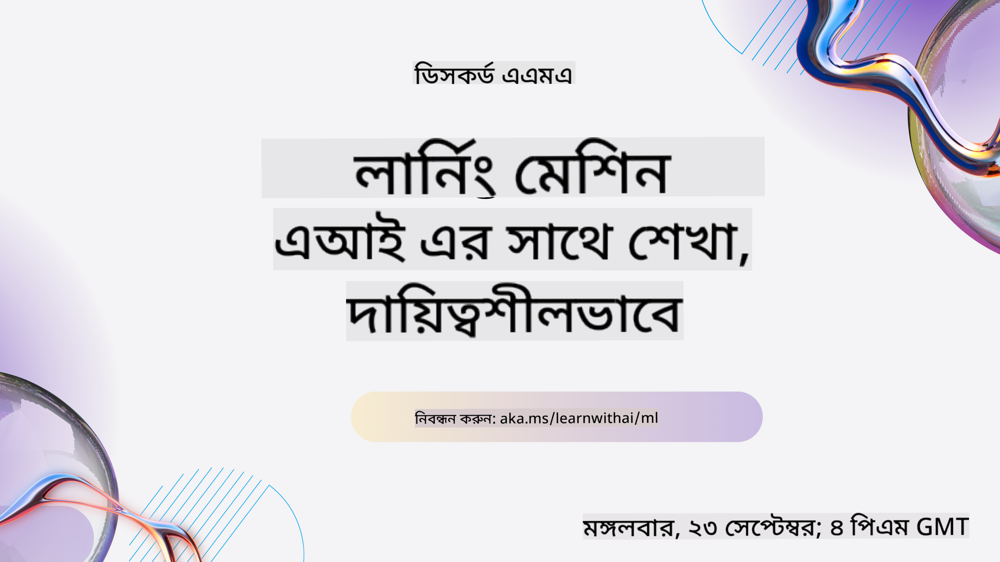

<!--
CO_OP_TRANSLATOR_METADATA:
{
  "original_hash": "ec8385130a8239ad9d827175126a0722",
  "translation_date": "2026-01-01T11:05:06+00:00",
  "source_file": "README.md",
  "language_code": "bn"
}
-->

### 🌐 একাধিক ভাষার সমর্থন

#### GitHub Action-এর মাধ্যমে সমর্থিত (স্বয়ংক্রিয় ও সর্বদা হালনাগাদ)

<!-- CO-OP TRANSLATOR LANGUAGES TABLE START -->
[আরবি](../ar/README.md) | [বাংলা](./README.md) | [বুলগেরিয়ান](../bg/README.md) | [বার্মিজ (মায়ানমার)](../my/README.md) | [চীনা (সরলীকৃত)](../zh/README.md) | [চীনা (প্রচলিত, হংকং)](../hk/README.md) | [চীনা (প্রচলিত, ম্যাকাও)](../mo/README.md) | [চীনা (প্রচলিত, তাইওয়ান)](../tw/README.md) | [ক্রোয়েশিয়ান](../hr/README.md) | [চেক](../cs/README.md) | [ডেনিশ](../da/README.md) | [ডাচ](../nl/README.md) | [এস্তোনিয়ান](../et/README.md) | [ফিনিশ](../fi/README.md) | [ফরাসি](../fr/README.md) | [জার্মান](../de/README.md) | [গ্রীক](../el/README.md) | [হিব্রু](../he/README.md) | [হিন্দি](../hi/README.md) | [হাঙ্গেরিয়ান](../hu/README.md) | [ইন্দোনেশীয়](../id/README.md) | [ইতালীয়](../it/README.md) | [জাপানি](../ja/README.md) | [কন্নডা](../kn/README.md) | [কোরিয়ান](../ko/README.md) | [লিথুয়ানিয়ান](../lt/README.md) | [মালয়](../ms/README.md) | [মালায়ালম](../ml/README.md) | [মরাঠি](../mr/README.md) | [নেপালি](../ne/README.md) | [নাইজেরিয়ান পিডজিন](../pcm/README.md) | [নরওয়েজিয়ান](../no/README.md) | [ফার্সি (পার্সিয়ান)](../fa/README.md) | [পোলিশ](../pl/README.md) | [পর্তুগিজ (ব্রাজিল)](../br/README.md) | [পর্তুগিজ (পর্তুগাল)](../pt/README.md) | [পাঞ্জাবি (গুরুমুখি)](../pa/README.md) | [রোমানিয়ান](../ro/README.md) | [রাশিয়ান](../ru/README.md) | [সার্বীয় (সিরিলিক)](../sr/README.md) | [স্লোভাক](../sk/README.md) | [স্লোভেনিয়ান](../sl/README.md) | [স্প্যানিশ](../es/README.md) | [সোয়াহিলি](../sw/README.md) | [সুইডিশ](../sv/README.md) | [টাগালগ (ফিলিপিনো)](../tl/README.md) | [তামিল](../ta/README.md) | [তেলেগু](../te/README.md) | [থাই](../th/README.md) | [তুর্কি](../tr/README.md) | [ইউক্রেনীয়](../uk/README.md) | [উর্দু](../ur/README.md) | [ভিয়েতনামি](../vi/README.md)
<!-- CO-OP TRANSLATOR LANGUAGES TABLE END -->

#### আমাদের সম্প্রদায়ে যোগ দিন

আমাদের কাছে একটি Discord-ভিত্তিক "AI-এর সাথে শেখা" সিরিজ চলছে, আরো জানতে এবং আমাদের সঙ্গে যোগ দিতে যান [AI-এর সাথে শেখার সিরিজ](https://aka.ms/learnwithai/discord) এ, সময়কাল 18 - 30 সেপ্টেম্বর, 2025। আপনি GitHub Copilot ব্যবহার করে ডেটা সায়েন্সের জন্য টিপস এবং কৌশল শিখবেন।

# শুরুরদের জন্য মেশিন লার্নিং - একটি পাঠক্রম

> 🌍 বিশ্বজুড়ে ভ্রমণ করুন যখন আমরা বিশ্বের সংস্কৃতির মাধ্যমে মেশিন লার্নিং অন্বেষণ করি 🌍

Microsoft-এর Cloud Advocates একটি 12 সপ্তাহ, 26-উপাঠের একটি সম্পূর্ণ পাঠক্রম উপহার দেওয়ার আনন্দ পাচ্ছে যা সম্পূর্ণরূপে **মেশিন লার্নিং** সম্পর্কে। এই পাঠক্রমে, আপনি যা কখনও কখনও **ক্লাসিকাল মেশিন লার্নিং** বলা হয় তা সম্পর্কে জানবেন, প্রধানত Scikit-learn লাইব্রেরি ব্যবহার করে এবং ডিপ লার্নিং এড়িয়ে চলা, যা আমাদের [AI for Beginners' curriculum](https://aka.ms/ai4beginners)-এ কভার করা হয়েছে। এই পাঠগুলোকে আমাদের ['Data Science for Beginners' curriculum](https://aka.ms/ds4beginners)-এর সঙ্গে মিলিয়ে নিন।

আমাদের সঙ্গে বিশ্বের বিভিন্ন স্থান থেকে আসা ডেটার ওপর ক্লাসিক্যাল কৌশলগুলো প্রয়োগ করে ভ্রমণ করুন। প্রতিটি পাঠে আছে প্রি- ও পোস্ট-লেকচার কুইজ, লেখ্য নির্দেশিকা পাঠ সম্পন্ন করার জন্য, একটি সমাধান, একটি অ্যাসাইনমেন্ট, এবং আরো অনেক কিছু। আমাদের প্রকল্প-ভিত্তিক শিক্ষাদান পদ্ধতি আপনাকে নির্মাণ করার সময় শেখার সুযোগ দেয়, যা নতুন দক্ষতা গেঁথে রাখার প্রমাণিত উপায়।

**✍️ আমাদের লেখকদের প্রতি আন্তরিক ধন্যবাদ** Jen Looper, Stephen Howell, Francesca Lazzeri, Tomomi Imura, Cassie Breviu, Dmitry Soshnikov, Chris Noring, Anirban Mukherjee, Ornella Altunyan, Ruth Yakubu এবং Amy Boyd

**🎨 আমাদের Ilustrator দেরও ধন্যবাদ** Tomomi Imura, Dasani Madipalli, এবং Jen Looper

**🙏 বিশেষ ধন্যবাদ 🙏 আমাদের Microsoft Student Ambassador লেখক, পর্যবেক্ষক এবং বিষয়বস্তু অবদানকারীদের**, বিশেষ করে Rishit Dagli, Muhammad Sakib Khan Inan, Rohan Raj, Alexandru Petrescu, Abhishek Jaiswal, Nawrin Tabassum, Ioan Samuila, এবং Snigdha Agarwal

**🤩 অতিরিক্ত কৃতজ্ঞতা Microsoft Student Ambassadors Eric Wanjau, Jasleen Sondhi, এবং Vidushi Gupta-কে আমাদের R পাঠগুলো জন্য!**

# শুরু করা

নিম্নলিখিত ধাপগুলো অনুসরণ করুন:
1. **রিপোজিটরি Fork করুন**: এই পৃষ্ঠার উপরের ডানদিকে অবস্থিত "Fork" বোতামে ক্লিক করুন।
2. **রিপোজিটরি ক্লোন করুন**:   `git clone https://github.com/microsoft/ML-For-Beginners.git`

> [এই কোর্সের সমস্ত অতিরিক্ত সম্পদ আমাদের Microsoft Learn সংগ্রহে খুঁজুন](https://learn.microsoft.com/en-us/collections/qrqzamz1nn2wx3?WT.mc_id=academic-77952-bethanycheum)

> 🔧 **সহায়তা দরকার?** ইনস্টলেশন, সেটআপ, এবং লেসন চালানোর সাধারণ সমস্যাগুলোর সমাধানের জন্য আমাদের [Troubleshooting Guide](TROUBLESHOOTING.md) দেখুন।

**[ছাত্রছাত্রী](https://aka.ms/student-page)**, এই পাঠক্রম ব্যবহারের জন্য, পুরো রিপোটি আপনার নিজস্ব GitHub অ্যাকাউন্টে fork করুন এবং একা বা গ্রুপের সঙ্গে অনুশীলনগুলি সম্পন্ন করুন:

- একটি প্রি-লেকচার কুইজ দিয়ে শুরু করুন।
- লেকচার পড়ুন এবং কার্যকলাপগুলো সম্পন্ন করুন, প্রতিটি জ্ঞান-চেক এ থামুন এবং প্রতিফলন করুন।
- সমাধান কোড চালানোর বদলে পাঠগুলো বুঝে প্রকল্পগুলো তৈরি করার চেষ্টা করুন; তবুও সেই কোড প্রতিটি প্রকল্প-ভিত্তিক লেসনের `/solution` ফোল্ডারে উপলব্ধ।
- পোস্ট-লেকচার কুইজ দিন।
- চ্যালেঞ্জ সম্পন্ন করুন।
- অ্যাসাইনমেন্ট সম্পন্ন করুন।
- একটি লেসন গ্রুপ সম্পন্ন করার পরে, [Discussion Board](https://github.com/microsoft/ML-For-Beginners/discussions) এ যান এবং উপযুক্ত PAT রুব্রিক পূরণ করে "ভাৎ করে শেখা" শেয়ার করুন। একটি 'PAT' হল একটি Progress Assessment Tool — একটি রুব্রিক যা আপনি আপনার শেখার উন্নতির জন্য পূরণ করেন। আপনি অন্যান্য PAT-এ প্রতিক্রিয়া জানাতে পারেন যাতে আমরা একসাথে শিখতে পারি।

> আরো অধ্যয়নের জন্য, আমরা এই [Microsoft Learn](https://docs.microsoft.com/en-us/users/jenlooper-2911/collections/k7o7tg1gp306q4?WT.mc_id=academic-77952-leestott) মডিউল এবং লার্নিং পাথগুলো অনুসরণ করার পরামর্শ দিই।

**শিক্ষকগণ**, এই পাঠক্রম কীভাবে ব্যবহার করতে পারেন সে বিষয়ে আমরা [কিছু পরামর্শ অন্তর্ভুক্ত করেছি](for-teachers.md)।

---

## ভিডিও ওয়াকথ্রু

কিছু পাঠ শর্ট-ফর্ম ভিডিও হিসেবে উপলব্ধ। আপনি এগুলো পাঠের ভিতরে দেখতে পাবেন, অথবা নিচের চিত্রে ক্লিক করে [Microsoft Developer YouTube চ্যানেলের ML for Beginners প্লেলিস্টে](https://aka.ms/ml-beginners-videos) যেতে পারেন।

---

## টিমের সাথে পরিচিত হন

**GIF করেছেন** [Mohit Jaisal](https://linkedin.com/in/mohitjaisal)

> 🎥 প্রকল্প এবং যারা এটি তৈরি করেছেন তাদের সম্পর্কে একটি ভিডিও দেখতে উপরের চিত্রে ক্লিক করুন!

---

## শিক্ষণ পদ্ধতি

এ এই পাঠক্রমটি তৈরির সময় আমরা দুইটি শিক্ষাদান মূলনীতি বেছে নিয়েছি: এটি হস্তগতভাবে **প্রকল্প-ভিত্তিক** করা এবং এতে **ঘন ঘন কুইজ** অন্তর্ভুক্ত করা। এছাড়াও, এই পাঠক্রমের একটি সাধারণ **থিম** রয়েছে যা এটিকে সংহতি দেয়।

বিষয়বস্তু প্রকল্পের সাথে সামঞ্জস্যপূর্ণ রাখলে, শিক্ষার্থীদের জন্য প্রক্রিয়াটি আরও আকর্ষণীয় হয় এবং ধারণাগুলোর ধারণ ক্ষমতা বাড়ে। এর পাশাপাশি, ক্লাসের আগে একটি নিম্ন-স্টেক্স কুইজ ছাত্রের শেখার অভিপ্রায় নির্ধারণ করে, এবং ক্লাসের পরের কুইজ নিশ্চিত করে যে ধারণাগুলো স্থায়ী হয়েছে। এই পাঠক্রমটি নমনীয় এবং মজাদারভাবে নকশা করা হয়েছে এবং সম্পূর্ণ বা আংশিকভাবে গ্রহণ করা যায়। প্রকল্পগুলো ছোটভাবে শুরু করে এবং 12-সপ্তাহের শেষ পর্যন্ত ক্রমশ জটিল হয়ে ওঠে। এই পাঠক্রমে বাস্তব-জগতের ML অ্যাপ্লিকেশনগুলোর উপর একটি পরিশিষ্টও রয়েছে, যা অতিরিক্ত ক্রেডিট বা আলোচনার ভিত্তি হিসেবে ব্যবহার করা যেতে পারে।

> আমাদের [Code of Conduct](CODE_OF_CONDUCT.md), [Contributing](CONTRIBUTING.md), [Translation](TRANSLATIONS.md), এবং [Troubleshooting](TROUBLESHOOTING.md) নির্দেশিকা দেখুন। আমরা আপনার রचनাত্মক প্রতিক্রিয়া স্বাগত জানাই!

## প্রতিটি পাঠে অন্তর্ভুক্ত

- ঐচ্ছিক স্কেচনোট
- ঐচ্ছিক পরিপূরক ভিডিও
- ভিডিও ওয়াকথ্রু (কিছু পাঠের জন্যই)
- [প্রী-লেকচার ওয়ার্মআপ কুইজ](https://ff-quizzes.netlify.app/en/ml/)
- লেখ্য লেকচার
- প্রকল্প-ভিত্তিক পাঠগুলোর জন্য, প্রকল্পটি কীভাবে তৈরি করবেন সে সম্পর্কে ধাপে ধাপে গাইড
- জ্ঞান-চেক
- একটি চ্যালেঞ্জ
- পরিপূরক পাঠ
- অ্যাসাইনমেন্ট
- [পোস্ট-লেকচার কুইজ](https://ff-quizzes.netlify.app/en/ml/)

> **ভাষা সম্পর্কিত একটি নোট**: এই পাঠগুলো মূলত Python-এ লেখা, কিন্তু অনেকগুলো R-এও উপলব্ধ। একটি R লেকচার সম্পন্ন করতে, `/solution` ফোল্ডারে যান এবং R পাঠগুলো সন্ধান করুন। সেগুলোতে .rmd এক্সটেনশন থাকবে যা একটি **R Markdown** ফাইল নির্দেশ করে যা সহজভাবে `code chunks` (R বা অন্যান্য ভাষার) এবং একটি `YAML header` (যা PDF-এর মতো আউটপুট কিভাবে ফরম্যাট করা হবে তা নির্দেশ করে) মিলিয়ে একটি `Markdown document` হিসেবে এমবেড করা যায়। ফলে, এটি ডেটা সায়েন্সের জন্য একটি আদর্শ লেখন কাঠামো হিসেবে কাজ করে কারণ এতে আপনি আপনার কোড, তার আউটপুট এবং আপনার চিন্তা একসাথে Markdown-এ লিখে রাখতে পারেন। এছাড়াও, R Markdown ডকুমেন্টগুলো PDF, HTML, বা Word-এর মতো আউটপুট ফরম্যাটে রেন্ডার করা যায়।

> **কুইজ সম্পর্কে একটি নোট**: সব কুইজ [Quiz App folder](../../quiz-app) এ রয়েছে, মোট 52টি কুইজ আছে প্রতিটিতে তিনটি প্রশ্ন। সেগুলো লেসনের ভিতর থেকে লিঙ্ক করা হয়েছে তবে কুইজ অ্যাপটি লোকালি চালানো যেতে পারে; লোকালি হোস্ট বা Azure-এ ডিপ্লয় করার নির্দেশনার জন্য `quiz-app` ফোল্ডারের নির্দেশিকা অনুসরণ করুন।

| Lesson Number |                             Topic                              |                   Lesson Grouping                   | Learning Objectives                                                                                                             |                                                              Linked Lesson                                                               |                        Author                        |
| :-----------: | :------------------------------------------------------------: | :-------------------------------------------------: | ------------------------------------------------------------------------------------------------------------------------------- | :--------------------------------------------------------------------------------------------------------------------------------------: | :--------------------------------------------------: |
|      01       |                মেশিন লার্নিং-এর পরিচিতি                |      [ভূমিকা](1-Introduction/README.md)       | মেশিন লার্নিং-এর মূল ধারণাগুলো শিখুন                                                                                |                                             [পাঠ](1-Introduction/1-intro-to-ML/README.md)                                             |                       Muhammad                       |
|      02       |                মেশিন লার্নিং-এর ইতিহাস                 |      [ভূমিকা](1-Introduction/README.md)       | এই ক্ষেত্রের ইতিহাস শিখুন                                                                                         |                                            [পাঠ](1-Introduction/2-history-of-ML/README.md)                                            |                     Jen and Amy                      |
|      03       |                 ন্যায় ও মেশিন লার্নিং                  |      [ভূমিকা](1-Introduction/README.md)       | মডেল নির্মাণ ও প্রয়োগের সময় ছাত্রদের বিবেচনা করা উচিত এমন ন্যায়সংক্রান্ত গুরুত্বপূর্ণ দার্শনিক বিষয়গুলো কী কী? |                                              [পাঠ](1-Introduction/3-fairness/README.md)                                               |                        Tomomi                        |
|      04       |                মেশিন লার্নিং-এর কৌশলসমূহ                 |      [ভূমিকা](1-Introduction/README.md)       | ML গবেষকরা ML মডেল গঠনের জন্য কী কী কৌশল ব্যবহার করে?                                                                       |                                          [পাঠ](1-Introduction/4-techniques-of-ML/README.md)                                           |                    Chris and Jen                     |
|      05       |                   রিগ্রেশনে পরিচিতি                   |        [রিগ্রেশন](2-Regression/README.md)         | রিগ্রেশন মডেলগুলির জন্য Python এবং Scikit-learn দিয়ে শুরু করুন                                                                  |         [Python](2-Regression/1-Tools/README.md) • [R](../../2-Regression/1-Tools/solution/R/lesson_1.html)         |      Jen • Eric Wanjau       |
|      06       |                উত্তর আমেরিকার কুমড়োর দাম 🎃                |        [রিগ্রেশন](2-Regression/README.md)         | মেশিন লার্নিং-এর প্রস্তুতির জন্য ডেটা ভিজ্যুয়ালাইজ ও পরিষ্কার করুন                                                                                  |          [Python](2-Regression/2-Data/README.md) • [R](../../2-Regression/2-Data/solution/R/lesson_2.html)          |      Jen • Eric Wanjau       |
|      07       |                উত্তর আমেরিকার কুমড়োর দাম 🎃                |        [রিগ্রেশন](2-Regression/README.md)         | রৈখিক ও বহুপদী রিগ্রেশন মডেল নির্মাণ করুন                                                                                   |        [Python](2-Regression/3-Linear/README.md) • [R](../../2-Regression/3-Linear/solution/R/lesson_3.html)        |      Jen and Dmitry • Eric Wanjau       |
|      08       |                উত্তর আমেরিকার কুমড়োর দাম 🎃                |        [রিগ্রেশন](2-Regression/README.md)         | একটি লজিস্টিক রিগ্রেশন মডেল তৈরি করুন                                                                                               |     [Python](2-Regression/4-Logistic/README.md) • [R](../../2-Regression/4-Logistic/solution/R/lesson_4.html)      |      Jen • Eric Wanjau       |
|      09       |                          একটি ওয়েব অ্যাপ 🔌                          |           [ওয়েব অ্যাপ](3-Web-App/README.md)            | আপনার প্রশিক্ষিত মডেল ব্যবহার করার জন্য একটি ওয়েব অ্যাপ নির্মাণ করুন                                                                                       |                                                 [Python](3-Web-App/1-Web-App/README.md)                                                  |                         Jen                          |
|      10       |                 ক্লাসিফিকেশনে পরিচিতি                 |    [ক্লাসিফিকেশন](4-Classification/README.md)     | আপনার ডেটা পরিষ্কার, প্রস্তুত ও ভিজ্যুয়ালাইজ করুন; ক্লাসিফিকেশনের পরিচিতি                                                            | [Python](4-Classification/1-Introduction/README.md) • [R](../../4-Classification/1-Introduction/solution/R/lesson_10.html)  | Jen and Cassie • Eric Wanjau |
|      11       |             সুস্বাদু এশিয়ান ও ভারতীয় খাবার 🍜             |    [ক্লাসিফিকেশন](4-Classification/README.md)     | ক্লাসিফায়ারদের পরিচিতি                                                                                                     | [Python](4-Classification/2-Classifiers-1/README.md) • [R](../../4-Classification/2-Classifiers-1/solution/R/lesson_11.html) | Jen and Cassie • Eric Wanjau |
|      12       |             সুস্বাদু এশিয়ান ও ভারতীয় খাবার 🍜             |    [ক্লাসিফিকেশন](4-Classification/README.md)     | আরও ক্লাসিফায়ার                                                                                                                | [Python](4-Classification/3-Classifiers-2/README.md) • [R](../../4-Classification/3-Classifiers-2/solution/R/lesson_12.html) | Jen and Cassie • Eric Wanjau |
|      13       |             সুস্বাদু এশিয়ান ও ভারতীয় খাবার 🍜             |    [ক্লাসিফিকেশন](4-Classification/README.md)     | আপনার মডেল ব্যবহার করে একটি রিকমেন্ডার ওয়েব অ্যাপ তৈরি করুন                                                                                    |                                              [Python](4-Classification/4-Applied/README.md)                                              |                         Jen                          |
|      14       |                   ক্লাস্টারিংয়ে পরিচিতি                   |        [ক্লাস্টারিং](5-Clustering/README.md)         | আপনার ডেটা পরিষ্কার, প্রস্তুত ও ভিজ্যুয়ালাইজ করুন; ক্লাস্টারিংয়ের পরিচিতি                                                                |         [Python](5-Clustering/1-Visualize/README.md) • [R](../../5-Clustering/1-Visualize/solution/R/lesson_14.html)         |      Jen • Eric Wanjau       |
|      15       |              নাইজেরিয়ান সঙ্গীত পছন্দ অনুসন্ধান 🎧              |        [ক্লাস্টারিং](5-Clustering/README.md)         | K-Means ক্লাস্টারিং পদ্ধতি অন্বেষণ করুন                                                                                           |           [Python](5-Clustering/2-K-Means/README.md) • [R](../../5-Clustering/2-K-Means/solution/R/lesson_15.html)           |      Jen • Eric Wanjau       |
|      16       |        প্রাকৃতিক ভাষা প্রক্রিয়াকরণে পরিচিতি ☕️         |   [প্রাকৃতিক ভাষা প্রক্রিয়াকরণ](6-NLP/README.md)    | একটি সহজ বট তৈরি করে NLP-এর মৌলিক বিষয়গুলো শিখুন                                                                             |                                             [Python](6-NLP/1-Introduction-to-NLP/README.md)                                              |                       Stephen                        |
|      17       |                      সাধারণ NLP কাজসমূহ ☕️                      |   [প্রাকৃতিক ভাষা প্রক্রিয়াকরণ](6-NLP/README.md)    | ভাষাগত কাঠামো নিয়ে কাজ করার সময় প্রয়োজনীয় সাধারণ কাজগুলো বুঝে আপনার NLP জ্ঞান গভীর করুন                          |                                                    [Python](6-NLP/2-Tasks/README.md)                                                     |                       Stephen                        |
|      18       |             অনুবাদ ও অনুভূতি বিশ্লেষণ ♥️              |   [প্রাকৃতিক ভাষা প্রক্রিয়াকরণ](6-NLP/README.md)    | Jane Austen-এর সাথে অনুবাদ ও অনুভূতি বিশ্লেষণ                                                                             |                                            [Python](6-NLP/3-Translation-Sentiment/README.md)                                             |                       Stephen                        |
|      19       |                  ইউরোপের রোমান্টিক হোটেলগুলো ♥️                  |   [প্রাকৃতিক ভাষা প্রক্রিয়াকরণ](6-NLP/README.md)    | হোটেল রিভিউ দিয়ে অনুভূতি বিশ্লেষণ ১                                                                                         |                                               [Python](6-NLP/4-Hotel-Reviews-1/README.md)                                                |                       Stephen                        |
|      20       |                  ইউরোপের রোমান্টিক হোটেলগুলো ♥️                  |   [প্রাকৃতিক ভাষা প্রক্রিয়াকরণ](6-NLP/README.md)    | হোটেল রিভিউ দিয়ে অনুভূতি বিশ্লেষণ ২                                                                                         |                                               [Python](6-NLP/5-Hotel-Reviews-2/README.md)                                                |                       Stephen                        |
|      21       |            টাইম সিরিজ পূর্বাভাসে পরিচিতি             |        [টাইম সিরিজ](7-TimeSeries/README.md)        | টাইম সিরিজ পূর্বাভাসে পরিচিতি                                                                                         |                                             [Python](7-TimeSeries/1-Introduction/README.md)                                              |                      Francesca                       |
|      22       | ⚡️ বিশ্ব বিদ্যুৎ ব্যবহার ⚡️ - ARIMA দিয়ে টাইম সিরিজ পূর্বাভাস |        [টাইম সিরিজ](7-TimeSeries/README.md)        | ARIMA দিয়ে টাইম সিরিজ পূর্বাভাস                                                                                              |                                                 [Python](7-TimeSeries/2-ARIMA/README.md)                                                 |                      Francesca                       |
|      23       |  ⚡️ বিশ্ব বিদ্যুৎ ব্যবহার ⚡️ - SVR দিয়ে টাইম সিরিজ পূর্বাভাস  |        [টাইম সিরিজ](7-TimeSeries/README.md)        | Support Vector Regressor দিয়ে টাইম সিরিজ পূর্বাভাস                                                                           |                                                  [Python](7-TimeSeries/3-SVR/README.md)                                                  |                       Anirban                        |
|      24       |             রিইনফোর্সমেন্ট লার্নিং-এর পরিচিতি             | [রিইনফোর্সমেন্ট লার্নিং](8-Reinforcement/README.md) | Q-Learning দিয়ে রিইনফোর্সমেন্ট লার্নিং-এর পরিচিতি                                                                          |                                             [Python](8-Reinforcement/1-QLearning/README.md)                                              |                        Dmitry                        |
|      25       |                 পিটারকে নেকড়ে থেকে বাঁচাতে সাহায্য করুন! 🐺                  | [রিইনফোর্সমেন্ট লার্নিং](8-Reinforcement/README.md) | রিইনফোর্সমেন্ট লার্নিং জিম                                                                                                      |                                                [Python](8-Reinforcement/2-Gym/README.md)                                                 |                        Dmitry                        |
|  পোস্টস্ক্রিপ্ট   |            বাস্তব জীবনের ML দৃশ্যপট ও অ্যাপ্লিকেশন            |      [ML in the Wild](9-Real-World/README.md)       | শাস্ত্রীয় ML-এর কিছু আকর্ষণীয় ও উন্মোচনমূলক বাস্তব-জগতের অ্যাপ্লিকেশন                                                               |                                             [পাঠ](9-Real-World/1-Applications/README.md)                                              |                         Team                         |
|  পোস্টস্ক্রিপ্ট   |            RAI ড্যাশবোর্ড ব্যবহার করে ML-এ মডেল ডিবাগিং          |      [ML in the Wild](9-Real-World/README.md)       | Responsible AI ড্যাশবোর্ড উপাদান ব্যবহার করে মেশিন লার্নিং-এ মডেল ডিবাগিং                                                              |                                             [পাঠ](9-Real-World/2-Debugging-ML-Models/README.md)                                              |                         Ruth Yakubu                       |

> [এই কোর্সের সব অতিরিক্ত সম্পদ আমাদের Microsoft Learn সংগ্রহে খুঁজে দেখুন](https://learn.microsoft.com/en-us/collections/qrqzamz1nn2wx3?WT.mc_id=academic-77952-bethanycheum)

## অফলাইন অ্যাক্সেস

আপনি এই ডকুমেন্টেশনটি অফলাইনে চালাতে পারেন [Docsify](https://docsify.js.org/#/) ব্যবহার করে। এই রিপোটি fork করুন, আপনার লোকাল মেশিনে [Docsify ইনস্টল করুন](https://docsify.js.org/#/quickstart), এবং তারপর এই রিপোর রুট ফোল্ডারে টাইপ করুন `docsify serve`. ওয়েবসাইটটি আপনার লোকালহোস্টে পোর্ট 3000-এ সার্ভ হবে: `localhost:3000`.

## পিডিএফ

কোরিকুলামের লিঙ্কসহ একটি পিডিএফ [এখানে](https://microsoft.github.io/ML-For-Beginners/pdf/readme.pdf) দেখুন。

## 🎒 অন্যান্য কোর্স 

আমাদের দল অন্যান্য কোর্সও তৈরি করে! দেখুন:

<!-- CO-OP TRANSLATOR OTHER COURSES START -->
### LangChain

---

### Azure / Edge / MCP / Agents

---
 
### জেনারেটিভ AI সিরিজ

[-9333EA?style=for-the-badge&labelColor=E5E7EB&color=9333EA)](https://github.com/microsoft/Generative-AI-for-beginners-dotnet?WT.mc_id=academic-105485-koreyst)
[-C084FC?style=for-the-badge&labelColor=E5E7EB&color=C084FC)](https://github.com/microsoft/generative-ai-for-beginners-java?WT.mc_id=academic-105485-koreyst)
[-E879F9?style=for-the-badge&labelColor=E5E7EB&color=E879F9)](https://github.com/microsoft/generative-ai-with-javascript?WT.mc_id=academic-105485-koreyst)

---
 
### মূল শেখা

---
 
### Copilot সিরিজ

<!-- CO-OP TRANSLATOR OTHER COURSES END -->

## সহায়তা

If you get stuck or have any questions about building AI apps. Join fellow learners and experienced developers in discussions about MCP. It's a supportive community where questions are welcome and knowledge is shared freely.

If you have product feedback or errors while building visit:

---

<!-- CO-OP TRANSLATOR DISCLAIMER START -->
দায়-অস্বীকৃতি:
এই নথিটি AI অনুবাদ সেবা Co-op Translator (https://github.com/Azure/co-op-translator) ব্যবহার করে অনুবাদ করা হয়েছে। আমরা সঠিকতার প্রতি যত্নশীল হলেও, অনুগ্রহ করে মনে রাখবেন যে স্বয়ংক্রিয় অনুবাদে ভুল বা অসঙ্গতি থাকতে পারে। মূল নথিটিকে তার মূল ভাষায়ই কর্তৃত্বপ্রাপ্ত উৎস হিসেবে বিবেচনা করা উচিত। গুরুত্বপূর্ণ তথ্যের জন্য পেশাদার মানব অনুবাদ গ্রহণ করার পরামর্শ দেওয়া হচ্ছে। এই অনুবাদ ব্যবহারের ফলে সৃষ্ট কোনো ভুলবোঝা বা ভুল ব্যাখ্যার জন্য আমরা দায়ী নই।
<!-- CO-OP TRANSLATOR DISCLAIMER END -->