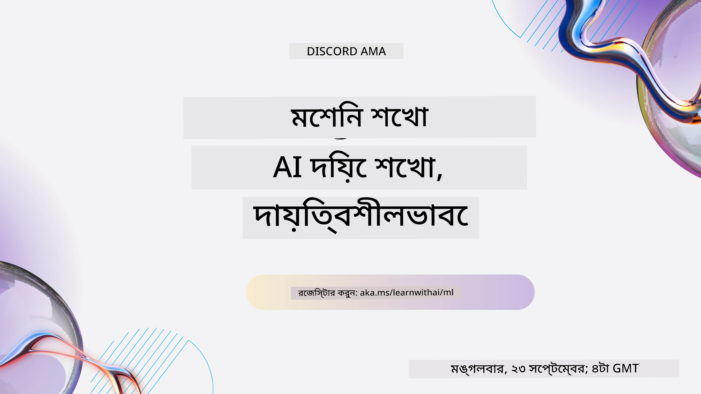
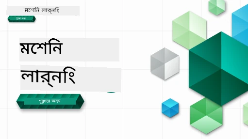

[](https://github.com/microsoft/ML-For-Beginners/blob/master/LICENSE)
[](https://GitHub.com/microsoft/ML-For-Beginners/graphs/contributors/)
[](https://GitHub.com/microsoft/ML-For-Beginners/issues/)
[](https://GitHub.com/microsoft/ML-For-Beginners/pulls/)
[](http://makeapullrequest.com)

[](https://GitHub.com/microsoft/ML-For-Beginners/watchers/)
[](https://GitHub.com/microsoft/ML-For-Beginners/network/)
[](https://GitHub.com/microsoft/ML-For-Beginners/stargazers/)

### 🌐 বহুভাষিক সমর্থন

#### GitHub Action এর মাধ্যমে সমর্থিত (স্বয়ংক্রিয় ও সর্বদা আপডেট থাকে)

<!-- CO-OP TRANSLATOR LANGUAGES TABLE START -->
[Arabic](../ar/README.md) | [Bengali](./README.md) | [Bulgarian](../bg/README.md) | [Burmese (Myanmar)](../my/README.md) | [Chinese (Simplified)](../zh-CN/README.md) | [Chinese (Traditional, Hong Kong)](../zh-HK/README.md) | [Chinese (Traditional, Macau)](../zh-MO/README.md) | [Chinese (Traditional, Taiwan)](../zh-TW/README.md) | [Croatian](../hr/README.md) | [Czech](../cs/README.md) | [Danish](../da/README.md) | [Dutch](../nl/README.md) | [Estonian](../et/README.md) | [Finnish](../fi/README.md) | [French](../fr/README.md) | [German](../de/README.md) | [Greek](../el/README.md) | [Hebrew](../he/README.md) | [Hindi](../hi/README.md) | [Hungarian](../hu/README.md) | [Indonesian](../id/README.md) | [Italian](../it/README.md) | [Japanese](../ja/README.md) | [Kannada](../kn/README.md) | [Khmer](../km/README.md) | [Korean](../ko/README.md) | [Lithuanian](../lt/README.md) | [Malay](../ms/README.md) | [Malayalam](../ml/README.md) | [Marathi](../mr/README.md) | [Nepali](../ne/README.md) | [Nigerian Pidgin](../pcm/README.md) | [Norwegian](../no/README.md) | [Persian (Farsi)](../fa/README.md) | [Polish](../pl/README.md) | [Portuguese (Brazil)](../pt-BR/README.md) | [Portuguese (Portugal)](../pt-PT/README.md) | [Punjabi (Gurmukhi)](../pa/README.md) | [Romanian](../ro/README.md) | [Russian](../ru/README.md) | [Serbian (Cyrillic)](../sr/README.md) | [Slovak](../sk/README.md) | [Slovenian](../sl/README.md) | [Spanish](../es/README.md) | [Swahili](../sw/README.md) | [Swedish](../sv/README.md) | [Tagalog (Filipino)](../tl/README.md) | [Tamil](../ta/README.md) | [Telugu](../te/README.md) | [Thai](../th/README.md) | [Turkish](../tr/README.md) | [Ukrainian](../uk/README.md) | [Urdu](../ur/README.md) | [Vietnamese](../vi/README.md)

> **স্থানীয়ভাবে ক্লোন করতে চান?**
>
> এই রিপোজিটরিতে ৫০টিরও বেশি ভাষার অনুবাদ রয়েছে যা ডাউনলোডের আকার অনেক বাড়িয়ে দেয়। অনুবাদ ছাড়া ক্লোন করতে, স্পার্স চেকআউট ব্যবহার করুন:
>
> **Bash / macOS / Linux:**
> ```bash
> git clone --filter=blob:none --sparse https://github.com/microsoft/ML-For-Beginners.git
> cd ML-For-Beginners
> git sparse-checkout set --no-cone '/*' '!translations' '!translated_images'
> ```
>
> **CMD (Windows):**
> ```cmd
> git clone --filter=blob:none --sparse https://github.com/microsoft/ML-For-Beginners.git
> cd ML-For-Beginners
> git sparse-checkout set --no-cone "/*" "!translations" "!translated_images"
> ```
>
> এটি আপনাকে দ্রুত ডাউনলোডের মাধ্যমে কোর্স সম্পূর্ণ করার জন্য প্রয়োজনীয় সবকিছু দেয়।
<!-- CO-OP TRANSLATOR LANGUAGES TABLE END -->

#### আমাদের কমিউনিটিতে যোগ দিন

[](https://discord.gg/nTYy5BXMWG)

আমাদের একটি Discord এ আই সহ শেখার সিরিজ চলছে, আরও জানুন এবং আমাদের সাথে যোগ দিন [Learn with AI Series](https://aka.ms/learnwithai/discord) ১৮ - ৩০ সেপ্টেম্বর, ২০২৫ পর্যন্ত। আপনি GitHub Copilot ব্যবহার করে Data Science এর টিপস ও ট্রিক্স পাবেন।



# নবাগতদের জন্য মেশিন লার্নিং - একটি পাঠ্যক্রম

> 🌍 বিশ্ব সংস্কৃতির মাধ্যমে মেশিন লার্নিং অন্বেষণ করতে বিশ্বজুড়ে ভ্রমণ করুন 🌍

মাইক্রোসফটের ক্লাউড অ্যাডভোকেটরা একটি ১২ সপ্তাহের, ২৬-টি পাঠের পাঠ্যক্রম প্রদান করতে পেরে আনন্দিত, যা সম্পূর্ণরূপে **মেশিন লার্নিং** নিয়ে। এই পাঠ্যক্রমে আপনি যাকে কখনও কখনও **ক্লাসিক মেশিন লার্নিং** বলা হয়, তা শিখবেন, প্রধানত Scikit-learn লাইব্রেরি ব্যবহার করে এবং দীপ্ লার্নিং এড়িয়ে যাবেন, যা আমাদের [নবাগতদের জন্য এআই পাঠ্যক্রমে](https://aka.ms/ai4beginners) অন্তর্ভুক্ত। এই পাঠগুলো আমাদের ['Data Science for Beginners' পাঠ্যক্রমের](https://aka.ms/ds4beginners) সাথে মিলিয়েও নিতে পারেন!

বিশ্বজুড়ে বিভিন্ন এলাকা থেকে তথ্য নিয়ে এই ক্লাসিক প্রযুক্তিগুলো প্রয়োগ করতে আমাদের সাথে ভ্রমণ করুন। প্রতিটি পাঠে থাকবে পূর্ব ও পরবর্তী কুইজ, লিখিত নির্দেশনা, একটি সমাধান, একটি নিয়োগ এবং আরও অনেক কিছু। আমাদের প্রকল্প-ভিত্তিক শিক্ষাদান পদ্ধতি আপনাকে নির্মাণের মাধ্যমে শেখার সুযোগ দেয়, যা নতুন দক্ষতা গুলো দৃঢ় হয়।

**✍️ আমাদের লেখকদের প্রতি আন্তরিক ধন্যবাদ:** Jen Looper, Stephen Howell, Francesca Lazzeri, Tomomi Imura, Cassie Breviu, Dmitry Soshnikov, Chris Noring, Anirban Mukherjee, Ornella Altunyan, Ruth Yakubu এবং Amy Boyd

**🎨 আমাদের চিত্রকারদের প্রতি ধন্যবাদ** Tomomi Imura, Dasani Madipalli, এবং Jen Looper

**🙏 বিশেষ ধন্যবাদ 🙏 আমাদের Microsoft Student Ambassador লেখক, পর্যালোচক এবং বিষয়বস্তু প্রদানকারীদের, বিশেষত Rishit Dagli, Muhammad Sakib Khan Inan, Rohan Raj, Alexandru Petrescu, Abhishek Jaiswal, Nawrin Tabassum, Ioan Samuila, এবং Snigdha Agarwal কে**

**🤩 আমাদের R পাঠগুলির জন্য Microsoft Student Ambassadors Eric Wanjau, Jasleen Sondhi, এবং Vidushi Gupta কে অতিরিক্ত কৃতজ্ঞতা!**

# শুরু করা

এই ধাপগুলো অনুসরণ করুন:
1. **রিপোজিটরি ফর্ক করুন:** এই পাতার ডান দিকে উপরের "Fork" বোতামে ক্লিক করুন।
2. **রিপোজিটরি ক্লোন করুন:**   `git clone https://github.com/microsoft/ML-For-Beginners.git`

> 💡 **দ্রুত শুরু করার পরামর্শ:** আপনি কি ব্রাউজারে সরাসরি শুরু করতে চান, লোকালি পাইথন সেটআপ ছাড়াই? আপনার ফর্কের জন্য ক্লাউড ডেভেলপমেন্ট পরিবেশ তৈরি করতে [GitHub Codespaces](https://github.com/features/codespaces) ব্যবহার করুন। সবুজ **Code** মেনু খুলুন, **Codespaces** নির্বাচন করুন, এবং একটি কোডস্পেস তৈরি করুন; প্রয়োজন অনুযায়ী প্রতিটি পাঠের জন্য প্রয়োজনীয় ডিপেন্ডেন্সি ইনস্টল করুন।

> [এই কোর্সের সকল অতিরিক্ত সম্পদ আমাদের Microsoft Learn সংগ্রহে খুঁজুন](https://learn.microsoft.com/en-us/collections/qrqzamz1nn2wx3?WT.mc_id=academic-77952-bethanycheum)

> 🔧 **সহায়তা প্রয়োজন?** ইনস্টলেশন, সেটআপ এবং পাঠ চালানোর সাথে সম্পর্কিত সাধারণ সমস্যার সমাধানের জন্য আমাদের [Troubleshooting Guide](TROUBLESHOOTING.md) দেখুন।


**[ছাত্র-ছাত্রীদের জন্য](https://aka.ms/student-page)**, এই পাঠ্যক্রম ব্যবহারের জন্য, পুরো রিপোটি নিজের GitHub অ্যাকাউন্টে ফর্ক করুন এবং অভ্যাসগুলো নিজের বা গোষ্ঠীর সাথে সম্পন্ন করুন:

- প্র‌্যাক্টিস শুরু করুন একটি প্রাক-লেকচার কুইজ দিয়ে।
- লেকচার পড়ুন এবং কাজ সম্পন্ন করুন, প্রতিটি জ্ঞান যাচাইয়ের সময় বিরতি নিন এবং চিন্তা করুন।
- পাঠ বুঝে প্রকল্পগুলো তৈরি করার চেষ্টা করুন, সমাধান কোড চালানোর চাইতে; যদিও সেই কোড প্রতিটি প্রকল্প-ভিত্তিক পাঠে `/solution` ফোল্ডারে পাওয়া যাবে।
- লেকচারের পরবর্তী কুইজ নিন।
- চ্যালেঞ্জ সম্পন্ন করুন।
- নিয়োগ সম্পন্ন করুন।
- একটি লেসন গ্রুপ শেষ করার পর, [Discussion Board](https://github.com/microsoft/ML-For-Beginners/discussions) এ যান এবং যথাযথ PAT রুব্রিকে পূরণ করে "শিখে প্রকাশ করুন"। 'PAT' হলো একটি প্রগ্রেস অ্যাসেসমেন্ট টুল যা আপনাকে শেখার উন্নতি করতে সহায়তা করে। আপনি অন্যদের PAT-এ প্রতিক্রিয়া জানাতে পারেন, যাতে আমরা একসাথে শিখতে পারি।

> অতিরিক্ত অধ্যয়নের জন্য, আমরা এই [Microsoft Learn](https://docs.microsoft.com/en-us/users/jenlooper-2911/collections/k7o7tg1gp306q4?WT.mc_id=academic-77952-leestott) মডিউল এবং শেখার পথে অনুসরণ করার পরামর্শ দিই।

**শিক্ষকদের জন্য**, আমরা [কিছু পরামর্শ](for-teachers.md) যুক্ত করেছি কিভাবে এই পাঠ্যক্রম ব্যবহার করবেন।

---

## ভিডিও ওয়াকথ্রু

কিছু পাঠ স্বল্প দৈর্ঘ্যের ভিডিওতে পাওয়া যায়। আপনি এগুলো পাঠের ভিতরে অথবা [Microsoft Developer YouTube চ্যানেলের ML for Beginners প্লেলিস্টে](https://aka.ms/ml-beginners-videos) নিচের ছবিতে ক্লিক করে পেতে পারেন।

[](https://aka.ms/ml-beginners-videos)

---

## দলের পরিচিতি

[](https://youtu.be/Tj1XWrDSYJU)

**গিফ তৈরি করেছেন** [Mohit Jaisal](https://linkedin.com/in/mohitjaisal)

> 🎥 প্রকল্প এবং এটি নির্মাতা সম্পর্কে ভিডিও দেখতে উপরের ছবিতে ক্লিক করুন!

---

## শিক্ষাদান পদ্ধতি

এই পাঠ্যক্রম তৈরির সময় আমরা দুটি শিক্ষাদান তত্ত্ব বেছে নিয়েছি: এটি অবশ্যই হাতে-কলমে **প্রকল্পভিত্তিক** হতে হবে এবং এর মধ্যে থাকতে হবে **নিয়মিত কুইজ**। এছাড়াও, এই পাঠ্যক্রমের একটি সাধারণ **থিম** আছে যা একঘনত্ব প্রদান করে।

বিষয়বস্তুকে প্রকল্পের সঙ্গে সমন্বয় করে ছাত্রদের জন্য আরও আকর্ষণীয় করা হয় এবং ধারণাগুলোর ধারণ ক্ষমতা বাড়ানো হয়। পাশাপাশি, ক্লাস শুরুর আগে একটি কম ঝুঁকিপূর্ণ কুইজ ছাত্রের শেখার উদ্দেশ্য নির্ধারণ করে এবং ক্লাস শেষে দ্বিতীয় কুইজ ধারণ ক্ষমতা বৃদ্ধি করে। এই পাঠ্যক্রমটি নমনীয় এবং মজাদার হওয়ার জন্য ডিজাইন করা হয়েছে এবং আপনি এটি সম্পূর্ণ অথবা আংশিক ভাবে নিতে পারেন। প্রকল্পগুলি ছোট থেকে শুরু হয়ে ১২-সপ্তাহের শেষে ধীরে ধীরে জটিল হয়। এই পাঠ্যক্রমে মেশিন লার্নিং এর বাস্তব জীবনের প্রয়োগ নিয়ে একটি পোস্টস্ক্রিপটও অন্তর্ভুক্ত, যা অতিরিক্ত ক্রেডিট হিসেবে অথবা আলোচনা ভিত্তি হিসেবে ব্যবহার করা যেতে পারে।

> আমাদের [Code of Conduct](CODE_OF_CONDUCT.md), [Contributing](CONTRIBUTING.md), [Translations](..), এবং [Troubleshooting](TROUBLESHOOTING.md) নির্দেশিকা দেখুন। আমরা আপনার গঠনমূলক প্রতিক্রিয়াকে স্বাগত জানাই!

## প্রতিটি পাঠের মধ্যে অন্তর্ভুক্ত

- ঐচ্ছিক স্কেচনোট
- ঐচ্ছিক সহায়ক ভিডিও
- ভিডিও ওয়াকথ্রু (কিছু পাঠে)
- [প্রাক-লেকচার ওয়ার্মআপ কুইজ](https://ff-quizzes.netlify.app/en/ml/)
- লিখিত পাঠ
- প্রকল্প-ভিত্তিক পাঠের জন্য, প্রকল্প নির্মাণের ধাপে ধাপে নির্দেশনা
- জ্ঞান যাচাই
- একটি চ্যালেঞ্জ
- সহায়ক পড়াশোনা
- নিয়োগ
- [পরবর্তী-লেকচার কুইজ](https://ff-quizzes.netlify.app/en/ml/)

> **একটি ভাষা সম্পর্কে নোট**: এই পাঠগুলো প্রাথমিকভাবে Python এ লেখা, কিন্তু অনেকগুলো R তেও পাওয়া যায়। একটি R পাঠ সম্পন্ন করতে, `/solution` ফোল্ডারে যান এবং R পাঠ খুঁজুন। এগুলোতে .rmd এক্সটেনশন থাকে যা একটি **R Markdown** ফাইল বোঝায়, যা R অথবা অন্যান্য ভাষার `কোড ব্লক` এবং একটি `YAML হেডার` (যা আউটপুট যেমন PDF কিভাবে তৈরি হবে সেটি নির্দেশ করে) যুক্ত একটি `Markdown ডকুমেন্ট`। এটি ডেটা সায়েন্সের জন্য একটি আদর্শ লেখন কাঠামো, কারণ এটি আপনাকে আপনার কোড, আউটপুট ও চিন্তাভাবনা Markdown এ লিখতে দেয়। এছাড়াও, R Markdown ডকুমেন্টগুলো PDF, HTML, বা Word আউটপুট ফরম্যাটে রেন্ডার করা যায়।

> **কুইজ সম্পর্কে নোট**: সমস্ত কুইজ [Quiz App ফোল্ডারে](../../quiz-app) রয়েছে, মোট ৫২টি কুইজ যা প্রতি একটি তিনটি প্রশ্ন নিয়ে গঠিত। এগুলো পাঠের মধ্যে লিঙ্কযুক্ত, তবে কুইজ অ্যাপ লোকালি চালানো যেতে পারে; লোকালি হোস্ট বা Azure-তে ডিপ্লয় করার নির্দেশিকা `quiz-app` ফোল্ডারে পাওয়া যাবে।

| Lesson Number |                             Topic                              |                   Lesson Grouping                   | Learning Objectives                                                                                                             |                                                              Linked Lesson                                                               |                        Author                        |
| :-----------: | :------------------------------------------------------------: | :-------------------------------------------------: | ------------------------------------------------------------------------------------------------------------------------------- | :--------------------------------------------------------------------------------------------------------------------------------------: | :--------------------------------------------------: |
|      01       |                মেশিন লার্নিংয়ের পরিচিতি                |      [Introduction](1-Introduction/README.md)       | মেশিন লার্নিংয়ের মৌলিক ধারণাগুলো শিখুন                                                                                       |                                             [Lesson](1-Introduction/1-intro-to-ML/README.md)                                             |                       মুহাম্মদ                       |
|      02       |                মেশিন লার্নিংয়ের ইতিহাস                 |      [Introduction](1-Introduction/README.md)       | এই ক্ষেত্রটির ইতিহাস শিখুন                                                                                                    |                                            [Lesson](1-Introduction/2-history-of-ML/README.md)                                            |                     জেন ও অ্যামি                      |
|      03       |                 ন্যায্যতা এবং মেশিন লার্নিং                  |      [Introduction](1-Introduction/README.md)       | ন্যায্যতা সম্পর্কিত গুরুত্বপূর্ণ দার্শনিক বিষয়গুলো কী, যা শিক্ষার্থীদের মেশিন লার্নিং মডেল তৈরি ও প্রয়োগের সময় বিবেচনা করা উচিত? |                                              [Lesson](1-Introduction/3-fairness/README.md)                                               |                        টোমোমি                        |
|      04       |                মেশিন লার্নিংয়ের কৌশলসমূহ                 |      [Introduction](1-Introduction/README.md)       | মেশিন লার্নিং গবেষকরা মডেল তৈরির জন্য কী কী কৌশল ব্যবহার করেন?                                                            |                                          [Lesson](1-Introduction/4-techniques-of-ML/README.md)                                           |                    ক্রিস এবং জেন                     |
|      05       |                   রিগ্রেশন পরিচিতি                   |        [Regression](2-Regression/README.md)         | রিগ্রেশন মডেলের জন্য পাইথন ও স্কাইকিট-লার্ন দিয়ে শুরু করুন                                                                  |         [Python](2-Regression/1-Tools/README.md) • [R](../../2-Regression/1-Tools/solution/R/lesson_1.html)         |      জেন • এরিক ওয়ানজাউ       |
|      06       |                উত্তর আমেরিকার কুমড়োর দাম 🎃                |        [Regression](2-Regression/README.md)         | মেশিন লার্নিংয়ের জন্য ডেটা ভিজ্যুয়ালাইজ ও পরিষ্কার করুন                                                                     |          [Python](2-Regression/2-Data/README.md) • [R](../../2-Regression/2-Data/solution/R/lesson_2.html)          |      জেন • এরিক ওয়ানজাউ       |
|      07       |                উত্তর আমেরিকার কুমড়োর দাম 🎃                |        [Regression](2-Regression/README.md)         | লিনিয়ার এবং পলিনোমিয়াল রিগ্রেশন মডেল তৈরি করুন                                                                            |        [Python](2-Regression/3-Linear/README.md) • [R](../../2-Regression/3-Linear/solution/R/lesson_3.html)        |      জেন এবং দিমিত্রি • এরিক ওয়ানজাউ       |
|      08       |                উত্তর আমেরিকার কুমড়োর দাম 🎃                |        [Regression](2-Regression/README.md)         | লগিস্টিক রিগ্রেশন মডেল তৈরি করুন                                                                                             |     [Python](2-Regression/4-Logistic/README.md) • [R](../../2-Regression/4-Logistic/solution/R/lesson_4.html)      |      জেন • এরিক ওয়ানজাউ       |
|      09       |                          ওয়েব অ্যাপ 🔌                          |           [Web App](3-Web-App/README.md)            | প্রশিক্ষিত মডেল ব্যবহার করার জন্য একটি ওয়েব অ্যাপ তৈরি করুন                                                                   |                                                 [Python](3-Web-App/1-Web-App/README.md)                                                  |                         জেন                          |
|      10       |                 শ্রেণীবিন্যাসে পরিচিতি                 |    [Classification](4-Classification/README.md)     | ডেটা পরিষ্কার, প্রস্তুত এবং ভিজ্যুয়ালাইজ করুন; শ্রেণীবিন্যাসের পরিচিতি                                                       | [Python](4-Classification/1-Introduction/README.md) • [R](../../4-Classification/1-Introduction/solution/R/lesson_10.html)  | জেন এবং ক্যাসি • এরিক ওয়ানজাউ |
|      11       |             সুস্বাদু এশীয় এবং ভারতীয় রান্নাঘর 🍜             |    [Classification](4-Classification/README.md)     | শ্রেণীবিন্যাসের পরিচিতি                                                                                                      | [Python](4-Classification/2-Classifiers-1/README.md) • [R](../../4-Classification/2-Classifiers-1/solution/R/lesson_11.html) | জেন এবং ক্যাসি • এরিক ওয়ানজাউ |
|      12       |             সুস্বাদু এশীয় এবং ভারতীয় রান্নাঘর 🍜             |    [Classification](4-Classification/README.md)     | আরও শ্রেণীবিন্যাসকারী                                                                                                         | [Python](4-Classification/3-Classifiers-2/README.md) • [R](../../4-Classification/3-Classifiers-2/solution/R/lesson_12.html) | জেন এবং ক্যাসি • এরিক ওয়ানজাউ |
|      13       |             সুস্বাদু এশীয় এবং ভারতীয় রান্নাঘর 🍜             |    [Classification](4-Classification/README.md)     | আপনার মডেল ব্যবহার করে একটি সুপারিশমূলক ওয়েব অ্যাপ তৈরি করুন                                                                |                                              [Python](4-Classification/4-Applied/README.md)                                              |                         জেন                          |
|      14       |                   ক্লাস্টারিংয়ের পরিচিতি                   |        [Clustering](5-Clustering/README.md)         | ডেটা পরিষ্কার, প্রস্তুত এবং ভিজ্যুয়ালাইজ করুন; ক্লাস্টারিংয়ের পরিচিতি                                                     |         [Python](5-Clustering/1-Visualize/README.md) • [R](../../5-Clustering/1-Visualize/solution/R/lesson_14.html)         |      জেন • এরিক ওয়ানজাউ       |
|      15       |              নাইজেরিয়ান সঙ্গীতের স্বাদ আবিষ্কার 🎧              |        [Clustering](5-Clustering/README.md)         | K-Mean ক্লাস্টারিং পদ্ধতি পরীক্ষা করুন                                                                                         |           [Python](5-Clustering/2-K-Means/README.md) • [R](../../5-Clustering/2-K-Means/solution/R/lesson_15.html)           |      জেন • এরিক ওয়ানজাউ       |
|      16       |        প্রাকৃত ভাষা প্রক্রিয়াকরণ পরিচিতি ☕️         |   [Natural language processing](6-NLP/README.md)    | একটি সাধারণ বট তৈরি করে NLP-এর মৌলিক বিষয়াবলী শিখুন                                                                         |                                             [Python](6-NLP/1-Introduction-to-NLP/README.md)                                              |                       স্টিফেন                        |
|      17       |                      সাধারণ NLP কাজগুলো ☕️                      |   [Natural language processing](6-NLP/README.md)    | ভাষার গঠন নিয়ে কাজ করার সময় প্রয়োজনীয় সাধারণ কাজগুলো বোঝার মাধ্যমে আপনার NLP জ্ঞান গভীর করুন                               |                                                    [Python](6-NLP/2-Tasks/README.md)                                                     |                       স্টিফেন                        |
|      18       |             অনুবাদ এবং ভাব বিশ্লেষণ ♥️              |   [Natural language processing](6-NLP/README.md)    | জেন অস্টেনের সাথে অনুবাদ এবং অনুভূতি বিশ্লেষণ                                                                                 |                                            [Python](6-NLP/3-Translation-Sentiment/README.md)                                             |                       স্টিফেন                        |
|      19       |                  ইউরোপের রোমান্টিক হোটেলগুলি ♥️                  |   [Natural language processing](6-NLP/README.md)    | হোটেল পর্যালোচনার সাথে অনুভূতি বিশ্লেষণ ১                                                                                     |                                               [Python](6-NLP/4-Hotel-Reviews-1/README.md)                                                |                       স্টিফেন                        |
|      20       |                  ইউরোপের রোমান্টিক হোটেলগুলি ♥️                  |   [Natural language processing](6-NLP/README.md)    | হোটেল পর্যালোচনার সাথে অনুভূতি বিশ্লেষণ ২                                                                                     |                                               [Python](6-NLP/5-Hotel-Reviews-2/README.md)                                                |                       স্টিফেন                        |
|      21       |            টাইম সিরিজ পূর্বাভাসে পরিচিতি             |        [Time series](7-TimeSeries/README.md)        | টাইম সিরিজ পূর্বাভাসের পরিচিতি                                                                                                |                                             [Python](7-TimeSeries/1-Introduction/README.md)                                              |                      ফ্রান্সেস্কা                       |
|      22       | ⚡️ বিশ্ব শক্তি ব্যবহার ⚡️ - ARIMA দিয়ে টাইম সিরিজ পূর্বাভাস  |        [Time series](7-TimeSeries/README.md)        | ARIMA দিয়ে টাইম সিরিজ পূর্বাভাস                                                                                                |                                                 [Python](7-TimeSeries/2-ARIMA/README.md)                                                 |                      ফ্রান্সেস্কা                       |
|      23       |  ⚡️ বিশ্ব শক্তি ব্যবহার ⚡️ - SVR দিয়ে টাইম সিরিজ পূর্বাভাস  |        [Time series](7-TimeSeries/README.md)        | সাপোর্ট ভেক্টর রিগ্রেসর দিয়ে টাইম সিরিজ পূর্বাভাস                                                                             |                                                  [Python](7-TimeSeries/3-SVR/README.md)                                                  |                       অনির্বাণ                        |
|      24       |             রিইনফোর্সমেন্ট লার্নিংয়ের পরিচিতি             | [Reinforcement learning](8-Reinforcement/README.md) | Q-Learning সহ রিইনফোর্সমেন্ট লার্নিংয়ের পরিচিতি                                                                             |                                             [Python](8-Reinforcement/1-QLearning/README.md)                                              |                        দিমিত্রি                        |
|      25       |                 পিটারকে বাঘের হাত থেকে বাঁচাতে সাহায্য করুন! 🐺                  | [Reinforcement learning](8-Reinforcement/README.md) | রিইনফোর্সমেন্ট লার্নিং জিম                                                                                                |                                                [Python](8-Reinforcement/2-Gym/README.md)                                                 |                        দিমিত্রি                        |
|  Postscript   |            বাস্তব জীবনের মেশিন লার্নিং দৃশ্য এবং প্রয়োগ            |      [ML in the Wild](9-Real-World/README.md)       | ক্লাসিক্যাল ML-এর আকর্ষণীয় এবং প্রকাশক বাস্তব বিশ্বের প্রয়োগ                                                                 |                                             [Lesson](9-Real-World/1-Applications/README.md)                                              |                         টিম                         |
|  Postscript   |            RAI ড্যাশবোর্ড ব্যবহার করে মডেল ডিবাগিং            |      [ML in the Wild](9-Real-World/README.md)       | রেসপনসিবল এআই ড্যাশবোর্ড উপাদান ব্যবহার করে মেশিন লার্নিংয়ে মডেল ডিবাগিং                                                        |                                             [Lesson](9-Real-World/2-Debugging-ML-Models/README.md)                                              |                     রুথ ইয়াকুবু                      |

> [এই কোর্সের সমস্ত অতিরিক্ত সম্পদ আমাদের Microsoft Learn সংগ্রহে খুঁজুন](https://learn.microsoft.com/en-us/collections/qrqzamz1nn2wx3?WT.mc_id=academic-77952-bethanycheum)

## অফলাইন এক্সেস

আপনি [Docsify](https://docsify.js.org/#/) ব্যবহার করে এই ডকুমেন্টেশন অফলাইনে চালাতে পারেন। এই রেপোটি ফর্ক করুন, আপনার লোকাল মেশিনে [Docsify ইনস্টল করুন](https://docsify.js.org/#/quickstart), এবং তারপর এই রেপোর মূল ফোল্ডারে `docsify serve` টাইপ করুন। ওয়েবসাইটটি আপনার লোকালহোস্টে পোর্ট 3000-এ পরিবর্ধিত হবে: `localhost:3000`।

## পিডিএফ

সিলেবাসের একটি পিডিএফ লিঙ্ক সহ [এখানে](https://microsoft.github.io/ML-For-Beginners/pdf/readme.pdf) খুঁজুন।


## 🎒 অন্যান্য কোর্স 

আমাদের টিম অন্যান্য কোর্স তৈরি করে! দেখুন:

<!-- CO-OP TRANSLATOR OTHER COURSES START -->
### ল্যাংচেইন
[](https://aka.ms/langchain4j-for-beginners)
[](https://aka.ms/langchainjs-for-beginners?WT.mc_id=m365-94501-dwahlin)
[](https://github.com/microsoft/langchain-for-beginners?WT.mc_id=m365-94501-dwahlin)
---

### আজুর / এজ / MCP / এজেন্টগণ
[](https://github.com/microsoft/AZD-for-beginners?WT.mc_id=academic-105485-koreyst)
[](https://github.com/microsoft/edgeai-for-beginners?WT.mc_id=academic-105485-koreyst)
[](https://github.com/microsoft/mcp-for-beginners?WT.mc_id=academic-105485-koreyst)
[](https://github.com/microsoft/ai-agents-for-beginners?WT.mc_id=academic-105485-koreyst)

---
 
### তৈরি AI সিরিজ
[](https://github.com/microsoft/generative-ai-for-beginners?WT.mc_id=academic-105485-koreyst)
[-9333EA?style=for-the-badge&labelColor=E5E7EB&color=9333EA)](https://github.com/microsoft/Generative-AI-for-beginners-dotnet?WT.mc_id=academic-105485-koreyst)
[-C084FC?style=for-the-badge&labelColor=E5E7EB&color=C084FC)](https://github.com/microsoft/generative-ai-for-beginners-java?WT.mc_id=academic-105485-koreyst)
[-E879F9?style=for-the-badge&labelColor=E5E7EB&color=E879F9)](https://github.com/microsoft/generative-ai-with-javascript?WT.mc_id=academic-105485-koreyst)

---
 
### মূল শেখা
[](https://aka.ms/ml-beginners?WT.mc_id=academic-105485-koreyst)
[](https://aka.ms/datascience-beginners?WT.mc_id=academic-105485-koreyst)
[](https://aka.ms/ai-beginners?WT.mc_id=academic-105485-koreyst)
[](https://github.com/microsoft/Security-101?WT.mc_id=academic-96948-sayoung)
[](https://aka.ms/webdev-beginners?WT.mc_id=academic-105485-koreyst)
[](https://aka.ms/iot-beginners?WT.mc_id=academic-105485-koreyst)
[](https://github.com/microsoft/xr-development-for-beginners?WT.mc_id=academic-105485-koreyst)

---
 
### কপাইলট সিরিজ
[](https://aka.ms/GitHubCopilotAI?WT.mc_id=academic-105485-koreyst)
[](https://github.com/microsoft/mastering-github-copilot-for-dotnet-csharp-developers?WT.mc_id=academic-105485-koreyst)
[](https://github.com/microsoft/CopilotAdventures?WT.mc_id=academic-105485-koreyst)
<!-- CO-OP TRANSLATOR OTHER COURSES END -->

## সাহায্যের প্রাপ্তি

যদি আপনি মেশিন লার্নিং শেখার সময় বা এআই অ্যাপ্লিকেশন তৈরি করার সময় আটকে যান বা প্রশ্ন থাকে, চিন্তা করবেন না — সাহায্য পাওয়া যাবে।

আপনি অন্যান্য শিক্ষার্থী ও ডেভেলপারদের সাথে আলোচনা যোগ দিতে পারেন, প্রশ্ন করতে পারেন, এবং কমিউনিটির সাথে আপনার ধারণা শেয়ার করতে পারেন।

- কমিউনিটিতে যোগ দিয়ে প্রশ্ন করুন এবং অন্যদের সাথে শিখুন
- মেশিন লার্নিং ধারণা এবং প্রকল্প আইডিয়া আলোচনা করুন
- অভিজ্ঞ ডেভেলপার থেকে দিকনির্দেশনা পান

এক সহায়ক কমিউনিটি আপনার দক্ষতা বাড়াতে এবং দ্রুত সমস্যার সমাধান করতে একটি দুর্দান্ত উপায়।

[Microsoft Foundry Discord Community](https://discord.gg/nTYy5BXMWG)

যদি আপনি বাগ, ত্রুটি পেয়ে থাকেন অথবা উন্নতির জন্য প্রস্তাব থাকে, এই রিপোজিটরিতে একটি **Issue** খুলে সমস্যা রিপোর্ট করতে পারেন।

পণ্য প্রতিক্রিয়া বা বিদ্যমান কমিউনিটি পোস্ট অনুসন্ধানের জন্য, ডেভেলপার ফোরামে যান:

[](https://aka.ms/foundry/forum)

## অতিরিক্ত শেখার টিপস

- প্রতিটি লেসনের পরে নোটবুকগুলো পর্যালোচনা করুন ভালো বোঝার জন্য।
- নিজেরা অ্যালগোরিদম প্রয়োগের অনুশীলন করুন।
- শেখা ধারণা ব্যবহার করে বাস্তব ডেটাসেট অন্বেষণ করুন।

---

<!-- CO-OP TRANSLATOR DISCLAIMER START -->
**অস্বীকৃতি**:
এই নথিটি AI অনুবাদ পরিষেবা [Co-op Translator](https://github.com/Azure/co-op-translator) ব্যবহার করে অনূদিত হয়েছে। যদিও আমরা শুদ্ধতার জন্য চেষ্টা করি, অনুগ্রহ করে মনে রাখবেন যে স্বয়ংক্রিয় অনুবাদে ত্রুটি বা অসঙ্গতি থাকতে পারে। মূল নথিটি তার স্বভাষায় কর্তৃত্বপূর্ণ উৎস হিসেবে বিবেচিত হওয়া উচিত। গুরুত্বপূর্ণ তথ্যের জন্য পেশাদার মানব অনুবাদ সুপারিশ করা হয়। এই অনুবাদের ব্যবহারে প্রয়োজনীয় ভুল বোঝাবুঝি বা ভুল ব্যাখ্যার জন্য আমরা দায়বদ্ধ নই।
<!-- CO-OP TRANSLATOR DISCLAIMER END -->