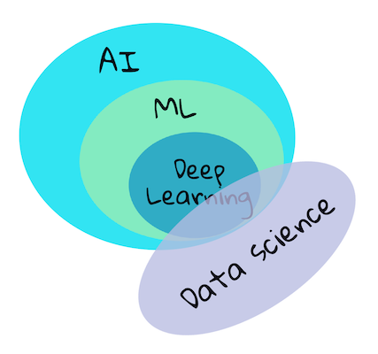

<!--
CO_OP_TRANSLATOR_METADATA:
{
  "original_hash": "73e9a7245aa57f00cd413ffd22c0ccb6",
  "translation_date": "2025-08-29T21:29:30+00:00",
  "source_file": "1-Introduction/1-intro-to-ML/README.md",
  "language_code": "br"
}
-->
# Introdução ao aprendizado de máquina

## [Quiz pré-aula](https://gray-sand-07a10f403.1.azurestaticapps.net/quiz/1/)

---

> 🎥 Clique na imagem acima para assistir a um vídeo curto sobre esta lição.

Bem-vindo a este curso sobre aprendizado de máquina clássico para iniciantes! Seja você completamente novo neste tópico ou um praticante experiente de ML buscando revisar alguma área, estamos felizes em tê-lo conosco! Queremos criar um ponto de partida amigável para seus estudos de ML e ficaremos felizes em avaliar, responder e incorporar seu [feedback](https://github.com/microsoft/ML-For-Beginners/discussions).

> 🎥 Clique na imagem acima para assistir a um vídeo: John Guttag do MIT apresenta o aprendizado de máquina.

---
## Começando com aprendizado de máquina

Antes de começar com este currículo, você precisa configurar seu computador e estar pronto para executar notebooks localmente.

- **Configure sua máquina com estes vídeos**. Use os links a seguir para aprender [como instalar Python](https://youtu.be/CXZYvNRIAKM) no seu sistema e [configurar um editor de texto](https://youtu.be/EU8eayHWoZg) para desenvolvimento.
- **Aprenda Python**. Também é recomendado ter um entendimento básico de [Python](https://docs.microsoft.com/learn/paths/python-language/?WT.mc_id=academic-77952-leestott), uma linguagem de programação útil para cientistas de dados que utilizamos neste curso.
- **Aprenda Node.js e JavaScript**. Também utilizamos JavaScript algumas vezes neste curso ao construir aplicativos web, então você precisará ter [node](https://nodejs.org) e [npm](https://www.npmjs.com/) instalados, além de [Visual Studio Code](https://code.visualstudio.com/) disponível para desenvolvimento em Python e JavaScript.
- **Crie uma conta no GitHub**. Já que você nos encontrou aqui no [GitHub](https://github.com), talvez já tenha uma conta, mas se não tiver, crie uma e depois faça um fork deste currículo para usar por conta própria. (Sinta-se à vontade para nos dar uma estrela também 😊)
- **Explore o Scikit-learn**. Familiarize-se com [Scikit-learn](https://scikit-learn.org/stable/user_guide.html), um conjunto de bibliotecas de ML que referenciamos nestas lições.

---
## O que é aprendizado de máquina?

O termo 'aprendizado de máquina' é um dos mais populares e frequentemente usados atualmente. Existe uma grande possibilidade de que você já tenha ouvido este termo pelo menos uma vez, caso tenha algum tipo de familiaridade com tecnologia, independentemente da área em que trabalha. No entanto, a mecânica do aprendizado de máquina é um mistério para a maioria das pessoas. Para um iniciante em aprendizado de máquina, o assunto pode parecer às vezes intimidante. Portanto, é importante entender o que realmente é aprendizado de máquina e aprender sobre ele passo a passo, por meio de exemplos práticos.

---
## A curva de hype

> O Google Trends mostra a recente 'curva de hype' do termo 'aprendizado de máquina'.

---
## Um universo misterioso

Vivemos em um universo cheio de mistérios fascinantes. Grandes cientistas como Stephen Hawking, Albert Einstein e muitos outros dedicaram suas vidas à busca de informações significativas que desvendassem os mistérios do mundo ao nosso redor. Esta é a condição humana de aprender: uma criança humana aprende coisas novas e descobre a estrutura de seu mundo ano após ano enquanto cresce até a idade adulta.

---
## O cérebro da criança

O cérebro e os sentidos de uma criança percebem os fatos ao seu redor e gradualmente aprendem os padrões ocultos da vida, o que ajuda a criança a criar regras lógicas para identificar padrões aprendidos. O processo de aprendizado do cérebro humano torna os humanos a criatura viva mais sofisticada deste mundo. Aprender continuamente ao descobrir padrões ocultos e depois inovar com base nesses padrões nos permite melhorar cada vez mais ao longo de nossas vidas. Essa capacidade de aprendizado e evolução está relacionada a um conceito chamado [plasticidade cerebral](https://www.simplypsychology.org/brain-plasticity.html). Superficialmente, podemos traçar algumas semelhanças motivacionais entre o processo de aprendizado do cérebro humano e os conceitos de aprendizado de máquina.

---
## O cérebro humano

O [cérebro humano](https://www.livescience.com/29365-human-brain.html) percebe coisas do mundo real, processa as informações percebidas, toma decisões racionais e realiza certas ações com base nas circunstâncias. Isso é o que chamamos de comportamento inteligente. Quando programamos uma réplica do processo de comportamento inteligente em uma máquina, isso é chamado de inteligência artificial (IA).

---
## Alguns termos

Embora os termos possam ser confundidos, aprendizado de máquina (ML) é um subconjunto importante da inteligência artificial. **ML está relacionado ao uso de algoritmos especializados para descobrir informações significativas e encontrar padrões ocultos a partir de dados percebidos, corroborando o processo de tomada de decisão racional**.

---
## IA, ML, Aprendizado Profundo

> Um diagrama mostrando as relações entre IA, ML, aprendizado profundo e ciência de dados. Infográfico por [Jen Looper](https://twitter.com/jenlooper) inspirado por [este gráfico](https://softwareengineering.stackexchange.com/questions/366996/distinction-between-ai-ml-neural-networks-deep-learning-and-data-mining).

---
## Conceitos abordados

Neste currículo, vamos abordar apenas os conceitos principais de aprendizado de máquina que um iniciante deve conhecer. Abordamos o que chamamos de 'aprendizado de máquina clássico', principalmente usando Scikit-learn, uma excelente biblioteca que muitos estudantes utilizam para aprender o básico. Para entender conceitos mais amplos de inteligência artificial ou aprendizado profundo, um conhecimento fundamental sólido de aprendizado de máquina é indispensável, e é isso que queremos oferecer aqui.

---
## Neste curso você aprenderá:

- conceitos principais de aprendizado de máquina
- a história do ML
- ML e justiça
- técnicas de regressão em ML
- técnicas de classificação em ML
- técnicas de agrupamento em ML
- técnicas de processamento de linguagem natural em ML
- técnicas de previsão de séries temporais em ML
- aprendizado por reforço
- aplicações reais de ML

---
## O que não abordaremos

- aprendizado profundo
- redes neurais
- IA

Para proporcionar uma melhor experiência de aprendizado, evitaremos as complexidades de redes neurais, 'aprendizado profundo' - construção de modelos com muitas camadas usando redes neurais - e IA, que discutiremos em um currículo diferente. Também ofereceremos um currículo futuro de ciência de dados para focar nesse aspecto deste campo mais amplo.

---
## Por que estudar aprendizado de máquina?

Aprendizado de máquina, do ponto de vista de sistemas, é definido como a criação de sistemas automatizados que podem aprender padrões ocultos a partir de dados para ajudar na tomada de decisões inteligentes.

Essa motivação é vagamente inspirada por como o cérebro humano aprende certas coisas com base nos dados que percebe do mundo exterior.

✅ Pense por um minuto por que uma empresa gostaria de usar estratégias de aprendizado de máquina em vez de criar um mecanismo baseado em regras codificadas.

---
## Aplicações do aprendizado de máquina

As aplicações do aprendizado de máquina estão agora em quase todos os lugares e são tão onipresentes quanto os dados que circulam em nossas sociedades, gerados por nossos smartphones, dispositivos conectados e outros sistemas. Considerando o imenso potencial dos algoritmos de aprendizado de máquina de última geração, pesquisadores têm explorado sua capacidade de resolver problemas reais multidimensionais e multidisciplinares com ótimos resultados positivos.

---
## Exemplos de ML aplicado

**Você pode usar aprendizado de máquina de várias maneiras**:

- Para prever a probabilidade de uma doença com base no histórico médico ou relatórios de um paciente.
- Para usar dados meteorológicos e prever eventos climáticos.
- Para entender o sentimento de um texto.
- Para detectar notícias falsas e impedir a propagação de propaganda.

Finanças, economia, ciência da terra, exploração espacial, engenharia biomédica, ciência cognitiva e até mesmo áreas das ciências humanas têm adaptado o aprendizado de máquina para resolver os problemas árduos e pesados em processamento de dados de seus domínios.

---
## Conclusão

O aprendizado de máquina automatiza o processo de descoberta de padrões ao encontrar insights significativos a partir de dados reais ou gerados. Ele tem se mostrado altamente valioso em aplicações de negócios, saúde e finanças, entre outras.

No futuro próximo, entender os fundamentos do aprendizado de máquina será essencial para pessoas de qualquer área devido à sua ampla adoção.

---
# 🚀 Desafio

Desenhe, no papel ou usando um aplicativo online como [Excalidraw](https://excalidraw.com/), sua compreensão das diferenças entre IA, ML, aprendizado profundo e ciência de dados. Adicione algumas ideias de problemas que cada uma dessas técnicas é boa em resolver.

# [Quiz pós-aula](https://gray-sand-07a10f403.1.azurestaticapps.net/quiz/2/)

---
# Revisão e Autoestudo

Para aprender mais sobre como trabalhar com algoritmos de ML na nuvem, siga este [Caminho de Aprendizado](https://docs.microsoft.com/learn/paths/create-no-code-predictive-models-azure-machine-learning/?WT.mc_id=academic-77952-leestott).

Faça um [Caminho de Aprendizado](https://docs.microsoft.com/learn/modules/introduction-to-machine-learning/?WT.mc_id=academic-77952-leestott) sobre os fundamentos de ML.

---
# Tarefa

[Prepare-se e comece](assignment.md)

---

**Aviso Legal**:  
Este documento foi traduzido utilizando o serviço de tradução por IA [Co-op Translator](https://github.com/Azure/co-op-translator). Embora nos esforcemos para garantir a precisão, esteja ciente de que traduções automáticas podem conter erros ou imprecisões. O documento original em seu idioma nativo deve ser considerado a fonte oficial. Para informações críticas, recomenda-se a tradução profissional feita por humanos. Não nos responsabilizamos por quaisquer mal-entendidos ou interpretações equivocadas decorrentes do uso desta tradução.