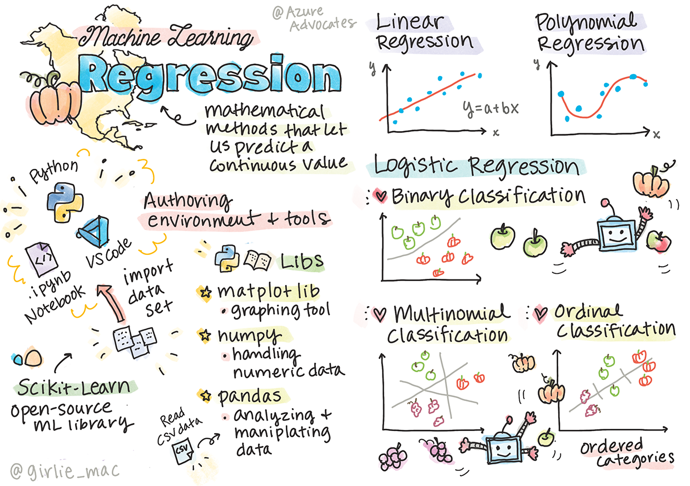
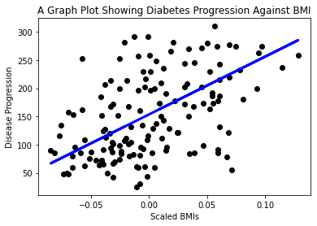

<!--
CO_OP_TRANSLATOR_METADATA:
{
  "original_hash": "6b1cb0e46d4c5b747eff6e3607642760",
  "translation_date": "2025-08-29T20:31:44+00:00",
  "source_file": "2-Regression/1-Tools/README.md",
  "language_code": "br"
}
-->
# Introdução ao Python e Scikit-learn para modelos de regressão



> Sketchnote por [Tomomi Imura](https://www.twitter.com/girlie_mac)

## [Quiz pré-aula](https://gray-sand-07a10f403.1.azurestaticapps.net/quiz/9/)

> ### [Esta lição está disponível em R!](../../../../2-Regression/1-Tools/solution/R/lesson_1.html)

## Introdução

Nestas quatro lições, você descobrirá como construir modelos de regressão. Vamos discutir para que eles servem em breve. Mas antes de começar, certifique-se de ter as ferramentas certas para iniciar o processo!

Nesta lição, você aprenderá a:

- Configurar seu computador para tarefas locais de aprendizado de máquina.
- Trabalhar com notebooks Jupyter.
- Usar Scikit-learn, incluindo instalação.
- Explorar regressão linear com um exercício prático.

## Instalações e configurações

[](https://youtu.be/-DfeD2k2Kj0 "ML para iniciantes - Configure suas ferramentas para criar modelos de aprendizado de máquina")

> 🎥 Clique na imagem acima para um vídeo curto sobre como configurar seu computador para ML.

1. **Instale o Python**. Certifique-se de que o [Python](https://www.python.org/downloads/) está instalado em seu computador. Você usará Python para muitas tarefas de ciência de dados e aprendizado de máquina. A maioria dos sistemas de computador já inclui uma instalação do Python. Também existem [Pacotes de Codificação Python](https://code.visualstudio.com/learn/educators/installers?WT.mc_id=academic-77952-leestott) úteis disponíveis para facilitar a configuração para alguns usuários.

   Algumas utilizações do Python, no entanto, exigem uma versão específica do software, enquanto outras exigem uma versão diferente. Por isso, é útil trabalhar dentro de um [ambiente virtual](https://docs.python.org/3/library/venv.html).

2. **Instale o Visual Studio Code**. Certifique-se de que o Visual Studio Code está instalado em seu computador. Siga estas instruções para [instalar o Visual Studio Code](https://code.visualstudio.com/) para a instalação básica. Você usará Python no Visual Studio Code neste curso, então pode ser útil revisar como [configurar o Visual Studio Code](https://docs.microsoft.com/learn/modules/python-install-vscode?WT.mc_id=academic-77952-leestott) para desenvolvimento em Python.

   > Familiarize-se com Python trabalhando nesta coleção de [módulos de aprendizado](https://docs.microsoft.com/users/jenlooper-2911/collections/mp1pagggd5qrq7?WT.mc_id=academic-77952-leestott)
   >
   > [](https://youtu.be/yyQM70vi7V8 "Configurar Python com Visual Studio Code")
   >
   > 🎥 Clique na imagem acima para um vídeo: usando Python no VS Code.

3. **Instale o Scikit-learn**, seguindo [estas instruções](https://scikit-learn.org/stable/install.html). Como você precisa garantir que está usando Python 3, é recomendado que use um ambiente virtual. Observe que, se estiver instalando esta biblioteca em um Mac M1, há instruções especiais na página vinculada acima.

4. **Instale o Jupyter Notebook**. Você precisará [instalar o pacote Jupyter](https://pypi.org/project/jupyter/).

## Seu ambiente de autoria de ML

Você usará **notebooks** para desenvolver seu código Python e criar modelos de aprendizado de máquina. Este tipo de arquivo é uma ferramenta comum para cientistas de dados e pode ser identificado por seu sufixo ou extensão `.ipynb`.

Notebooks são um ambiente interativo que permite ao desenvolvedor tanto codificar quanto adicionar notas e escrever documentação em torno do código, o que é bastante útil para projetos experimentais ou orientados à pesquisa.

[](https://youtu.be/7E-jC8FLA2E "ML para iniciantes - Configure Jupyter Notebooks para começar a construir modelos de regressão")

> 🎥 Clique na imagem acima para um vídeo curto sobre este exercício.

### Exercício - trabalhar com um notebook

Nesta pasta, você encontrará o arquivo _notebook.ipynb_.

1. Abra _notebook.ipynb_ no Visual Studio Code.

   Um servidor Jupyter será iniciado com Python 3+. Você encontrará áreas do notebook que podem ser `executadas`, pedaços de código. Você pode executar um bloco de código selecionando o ícone que parece um botão de play.

2. Selecione o ícone `md` e adicione um pouco de markdown, e o seguinte texto **# Bem-vindo ao seu notebook**.

   Em seguida, adicione algum código Python.

3. Digite **print('hello notebook')** no bloco de código.
4. Selecione a seta para executar o código.

   Você deve ver a declaração impressa:

    ```output
    hello notebook
    ```


Você pode intercalar seu código com comentários para auto-documentar o notebook.

✅ Pense por um momento como o ambiente de trabalho de um desenvolvedor web é diferente do de um cientista de dados.

## Começando com Scikit-learn

Agora que o Python está configurado em seu ambiente local e você está confortável com notebooks Jupyter, vamos nos familiarizar igualmente com o Scikit-learn (pronuncia-se `sci` como em `science`). O Scikit-learn fornece uma [API extensa](https://scikit-learn.org/stable/modules/classes.html#api-ref) para ajudá-lo a realizar tarefas de ML.

De acordo com seu [site](https://scikit-learn.org/stable/getting_started.html), "Scikit-learn é uma biblioteca de aprendizado de máquina de código aberto que suporta aprendizado supervisionado e não supervisionado. Também fornece várias ferramentas para ajuste de modelos, pré-processamento de dados, seleção e avaliação de modelos, e muitas outras utilidades."

Neste curso, você usará Scikit-learn e outras ferramentas para construir modelos de aprendizado de máquina para realizar o que chamamos de tarefas de 'aprendizado de máquina tradicional'. Evitamos deliberadamente redes neurais e aprendizado profundo, pois eles são melhor abordados em nosso próximo currículo 'IA para Iniciantes'.

O Scikit-learn torna simples construir modelos e avaliá-los para uso. Ele é focado principalmente em usar dados numéricos e contém vários conjuntos de dados prontos para uso como ferramentas de aprendizado. Também inclui modelos pré-construídos para os alunos experimentarem. Vamos explorar o processo de carregar dados pré-empacotados e usar um estimador para criar o primeiro modelo de ML com Scikit-learn usando alguns dados básicos.

## Exercício - seu primeiro notebook com Scikit-learn

> Este tutorial foi inspirado pelo [exemplo de regressão linear](https://scikit-learn.org/stable/auto_examples/linear_model/plot_ols.html#sphx-glr-auto-examples-linear-model-plot-ols-py) no site do Scikit-learn.

[](https://youtu.be/2xkXL5EUpS0 "ML para iniciantes - Seu Primeiro Projeto de Regressão Linear em Python")

> 🎥 Clique na imagem acima para um vídeo curto sobre este exercício.

No arquivo _notebook.ipynb_ associado a esta lição, limpe todas as células pressionando o ícone de 'lixeira'.

Nesta seção, você trabalhará com um pequeno conjunto de dados sobre diabetes que está embutido no Scikit-learn para fins de aprendizado. Imagine que você queria testar um tratamento para pacientes diabéticos. Modelos de aprendizado de máquina podem ajudá-lo a determinar quais pacientes responderiam melhor ao tratamento, com base em combinações de variáveis. Mesmo um modelo de regressão muito básico, quando visualizado, pode mostrar informações sobre variáveis que ajudariam a organizar seus ensaios clínicos teóricos.

✅ Existem muitos tipos de métodos de regressão, e qual você escolhe depende da resposta que está procurando. Se você quiser prever a altura provável de uma pessoa de uma determinada idade, usaria regressão linear, pois está buscando um **valor numérico**. Se estiver interessado em descobrir se um tipo de culinária deve ser considerado vegano ou não, estará buscando uma **atribuição de categoria**, então usaria regressão logística. Você aprenderá mais sobre regressão logística mais tarde. Pense um pouco sobre algumas perguntas que você pode fazer aos dados e qual desses métodos seria mais apropriado.

Vamos começar esta tarefa.

### Importar bibliotecas

Para esta tarefa, importaremos algumas bibliotecas:

- **matplotlib**. É uma ferramenta útil para [criação de gráficos](https://matplotlib.org/) e a usaremos para criar um gráfico de linha.
- **numpy**. [numpy](https://numpy.org/doc/stable/user/whatisnumpy.html) é uma biblioteca útil para lidar com dados numéricos em Python.
- **sklearn**. Esta é a biblioteca [Scikit-learn](https://scikit-learn.org/stable/user_guide.html).

Importe algumas bibliotecas para ajudar em suas tarefas.

1. Adicione as importações digitando o seguinte código:

   ```python
   import matplotlib.pyplot as plt
   import numpy as np
   from sklearn import datasets, linear_model, model_selection
   ```

   Acima, você está importando `matplotlib`, `numpy` e está importando `datasets`, `linear_model` e `model_selection` de `sklearn`. `model_selection` é usado para dividir dados em conjuntos de treinamento e teste.

### O conjunto de dados de diabetes

O [conjunto de dados de diabetes](https://scikit-learn.org/stable/datasets/toy_dataset.html#diabetes-dataset) embutido inclui 442 amostras de dados sobre diabetes, com 10 variáveis de características, algumas das quais incluem:

- age: idade em anos
- bmi: índice de massa corporal
- bp: pressão arterial média
- s1 tc: células T (um tipo de glóbulo branco)

✅ Este conjunto de dados inclui o conceito de 'sexo' como uma variável de característica importante para pesquisas sobre diabetes. Muitos conjuntos de dados médicos incluem este tipo de classificação binária. Pense um pouco sobre como categorizações como esta podem excluir certas partes da população de tratamentos.

Agora, carregue os dados X e y.

> 🎓 Lembre-se, este é aprendizado supervisionado, e precisamos de um alvo 'y' nomeado.

Em uma nova célula de código, carregue o conjunto de dados de diabetes chamando `load_diabetes()`. O parâmetro `return_X_y=True` indica que `X` será uma matriz de dados e `y` será o alvo da regressão.

1. Adicione alguns comandos de impressão para mostrar a forma da matriz de dados e seu primeiro elemento:

    ```python
    X, y = datasets.load_diabetes(return_X_y=True)
    print(X.shape)
    print(X[0])
    ```

    O que você está recebendo como resposta é uma tupla. O que você está fazendo é atribuir os dois primeiros valores da tupla a `X` e `y`, respectivamente. Saiba mais [sobre tuplas](https://wikipedia.org/wiki/Tuple).

    Você pode ver que esses dados têm 442 itens organizados em arrays de 10 elementos:

    ```text
    (442, 10)
    [ 0.03807591  0.05068012  0.06169621  0.02187235 -0.0442235  -0.03482076
    -0.04340085 -0.00259226  0.01990842 -0.01764613]
    ```

    ✅ Pense um pouco sobre a relação entre os dados e o alvo da regressão. A regressão linear prevê relações entre a característica X e a variável alvo y. Você consegue encontrar o [alvo](https://scikit-learn.org/stable/datasets/toy_dataset.html#diabetes-dataset) para o conjunto de dados de diabetes na documentação? O que este conjunto de dados está demonstrando, dado o alvo?

2. Em seguida, selecione uma parte deste conjunto de dados para plotar, escolhendo a 3ª coluna do conjunto de dados. Você pode fazer isso usando o operador `:` para selecionar todas as linhas e, em seguida, selecionar a 3ª coluna usando o índice (2). Você também pode remodelar os dados para serem uma matriz 2D - conforme necessário para plotagem - usando `reshape(n_rows, n_columns)`. Se um dos parâmetros for -1, a dimensão correspondente será calculada automaticamente.

   ```python
   X = X[:, 2]
   X = X.reshape((-1,1))
   ```

   ✅ A qualquer momento, imprima os dados para verificar sua forma.

3. Agora que você tem os dados prontos para serem plotados, pode ver se uma máquina pode ajudar a determinar uma divisão lógica entre os números neste conjunto de dados. Para fazer isso, você precisa dividir tanto os dados (X) quanto o alvo (y) em conjuntos de teste e treinamento. O Scikit-learn tem uma maneira simples de fazer isso; você pode dividir seus dados de teste em um ponto específico.

   ```python
   X_train, X_test, y_train, y_test = model_selection.train_test_split(X, y, test_size=0.33)
   ```

4. Agora você está pronto para treinar seu modelo! Carregue o modelo de regressão linear e treine-o com seus conjuntos de treinamento X e y usando `model.fit()`:

    ```python
    model = linear_model.LinearRegression()
    model.fit(X_train, y_train)
    ```

    ✅ `model.fit()` é uma função que você verá em muitas bibliotecas de ML, como TensorFlow.

5. Em seguida, crie uma previsão usando os dados de teste, utilizando a função `predict()`. Isso será usado para desenhar a linha entre os grupos de dados.

    ```python
    y_pred = model.predict(X_test)
    ```

6. Agora é hora de mostrar os dados em um gráfico. O Matplotlib é uma ferramenta muito útil para esta tarefa. Crie um gráfico de dispersão de todos os dados de teste X e y e use a previsão para desenhar uma linha no lugar mais apropriado, entre os agrupamentos de dados do modelo.

    ```python
    plt.scatter(X_test, y_test,  color='black')
    plt.plot(X_test, y_pred, color='blue', linewidth=3)
    plt.xlabel('Scaled BMIs')
    plt.ylabel('Disease Progression')
    plt.title('A Graph Plot Showing Diabetes Progression Against BMI')
    plt.show()
    ```

   
✅ Pense um pouco sobre o que está acontecendo aqui. Uma linha reta está passando por muitos pequenos pontos de dados, mas o que exatamente ela está fazendo? Você consegue perceber como deveria ser possível usar essa linha para prever onde um novo ponto de dados, ainda não visto, deveria se encaixar em relação ao eixo y do gráfico? Tente colocar em palavras o uso prático desse modelo.

Parabéns, você construiu seu primeiro modelo de regressão linear, fez uma previsão com ele e a exibiu em um gráfico!

---
## 🚀Desafio

Faça o gráfico de uma variável diferente deste conjunto de dados. Dica: edite esta linha: `X = X[:,2]`. Dado o alvo deste conjunto de dados, o que você consegue descobrir sobre a progressão do diabetes como uma doença?

## [Questionário pós-aula](https://gray-sand-07a10f403.1.azurestaticapps.net/quiz/10/)

## Revisão e Autoestudo

Neste tutorial, você trabalhou com regressão linear simples, em vez de regressão univariada ou múltipla. Leia um pouco sobre as diferenças entre esses métodos ou dê uma olhada [neste vídeo](https://www.coursera.org/lecture/quantifying-relationships-regression-models/linear-vs-nonlinear-categorical-variables-ai2Ef).

Leia mais sobre o conceito de regressão e pense em que tipos de perguntas podem ser respondidas por essa técnica. Faça este [tutorial](https://docs.microsoft.com/learn/modules/train-evaluate-regression-models?WT.mc_id=academic-77952-leestott) para aprofundar seu entendimento.

## Tarefa

[Um conjunto de dados diferente](assignment.md)

---

**Aviso Legal**:  
Este documento foi traduzido utilizando o serviço de tradução por IA [Co-op Translator](https://github.com/Azure/co-op-translator). Embora nos esforcemos para garantir a precisão, esteja ciente de que traduções automatizadas podem conter erros ou imprecisões. O documento original em seu idioma nativo deve ser considerado a fonte autoritativa. Para informações críticas, recomenda-se a tradução profissional realizada por humanos. Não nos responsabilizamos por quaisquer mal-entendidos ou interpretações equivocadas decorrentes do uso desta tradução.