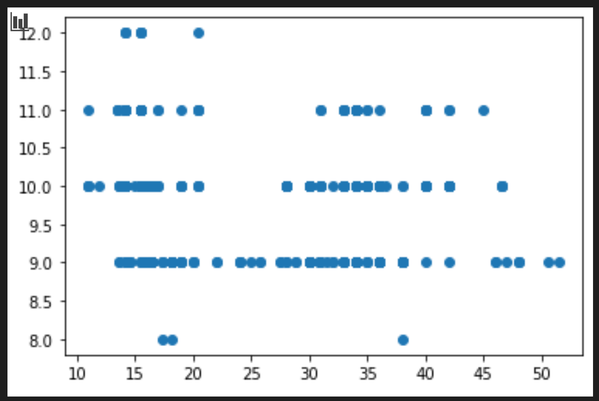
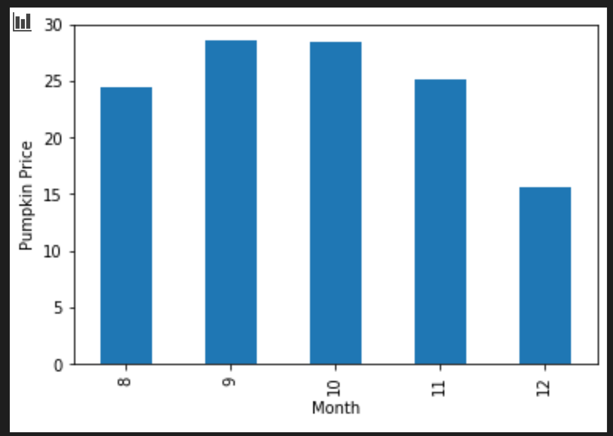

<!--
CO_OP_TRANSLATOR_METADATA:
{
  "original_hash": "a683e1fe430bb0d4a10b68f6ca15e0a6",
  "translation_date": "2025-08-29T20:35:59+00:00",
  "source_file": "2-Regression/2-Data/README.md",
  "language_code": "br"
}
-->
# Construir um modelo de regressão usando Scikit-learn: preparar e visualizar dados


Infográfico por [Dasani Madipalli](https://twitter.com/dasani_decoded)

## [Quiz pré-aula](https://gray-sand-07a10f403.1.azurestaticapps.net/quiz/11/)

> ### [Esta lição está disponível em R!](../../../../2-Regression/2-Data/solution/R/lesson_2.html)

## Introdução

Agora que você já configurou as ferramentas necessárias para começar a construir modelos de aprendizado de máquina com Scikit-learn, está pronto para começar a fazer perguntas sobre seus dados. Ao trabalhar com dados e aplicar soluções de aprendizado de máquina, é muito importante saber como fazer a pergunta certa para desbloquear adequadamente o potencial do seu conjunto de dados.

Nesta lição, você aprenderá:

- Como preparar seus dados para a construção de modelos.
- Como usar o Matplotlib para visualização de dados.

## Fazendo a pergunta certa sobre seus dados

A pergunta que você precisa responder determinará o tipo de algoritmos de aprendizado de máquina que você usará. E a qualidade da resposta que você obtém dependerá muito da natureza dos seus dados.

Dê uma olhada nos [dados](https://github.com/microsoft/ML-For-Beginners/blob/main/2-Regression/data/US-pumpkins.csv) fornecidos para esta lição. Você pode abrir este arquivo .csv no VS Code. Uma rápida olhada mostra imediatamente que há lacunas e uma mistura de dados numéricos e de texto. Há também uma coluna estranha chamada 'Package', onde os dados são uma mistura de 'sacks', 'bins' e outros valores. Os dados, na verdade, estão um pouco bagunçados.

[](https://youtu.be/5qGjczWTrDQ "ML para iniciantes - Como analisar e limpar um conjunto de dados")

> 🎥 Clique na imagem acima para assistir a um vídeo curto sobre como preparar os dados para esta lição.

De fato, não é muito comum receber um conjunto de dados completamente pronto para criar um modelo de aprendizado de máquina imediatamente. Nesta lição, você aprenderá como preparar um conjunto de dados bruto usando bibliotecas padrão do Python. Você também aprenderá várias técnicas para visualizar os dados.

## Estudo de caso: 'o mercado de abóboras'

Nesta pasta, você encontrará um arquivo .csv na pasta raiz `data` chamado [US-pumpkins.csv](https://github.com/microsoft/ML-For-Beginners/blob/main/2-Regression/data/US-pumpkins.csv), que inclui 1757 linhas de dados sobre o mercado de abóboras, organizados por cidade. Estes são dados brutos extraídos dos [Relatórios Padrão de Mercados de Culturas Especiais](https://www.marketnews.usda.gov/mnp/fv-report-config-step1?type=termPrice) distribuídos pelo Departamento de Agricultura dos Estados Unidos.

### Preparando os dados

Esses dados estão em domínio público. Eles podem ser baixados em vários arquivos separados, por cidade, no site do USDA. Para evitar muitos arquivos separados, concatenamos todos os dados das cidades em uma única planilha, ou seja, já _preparamos_ um pouco os dados. Agora, vamos dar uma olhada mais de perto nos dados.

### Os dados das abóboras - primeiras conclusões

O que você percebe sobre esses dados? Você já viu que há uma mistura de textos, números, lacunas e valores estranhos que precisam ser interpretados.

Que pergunta você pode fazer sobre esses dados, usando uma técnica de Regressão? Que tal "Prever o preço de uma abóbora à venda em um determinado mês"? Olhando novamente para os dados, há algumas mudanças que você precisa fazer para criar a estrutura de dados necessária para essa tarefa.

## Exercício - analisar os dados das abóboras

Vamos usar o [Pandas](https://pandas.pydata.org/), (o nome significa `Python Data Analysis`) uma ferramenta muito útil para manipular dados, para analisar e preparar esses dados de abóboras.

### Primeiro, verifique se há datas ausentes

Primeiro, você precisará tomar medidas para verificar se há datas ausentes:

1. Converta as datas para o formato de mês (essas são datas dos EUA, então o formato é `MM/DD/YYYY`).
2. Extraia o mês para uma nova coluna.

Abra o arquivo _notebook.ipynb_ no Visual Studio Code e importe a planilha para um novo dataframe do Pandas.

1. Use a função `head()` para visualizar as primeiras cinco linhas.

    ```python
    import pandas as pd
    pumpkins = pd.read_csv('../data/US-pumpkins.csv')
    pumpkins.head()
    ```

    ✅ Que função você usaria para visualizar as últimas cinco linhas?

1. Verifique se há dados ausentes no dataframe atual:

    ```python
    pumpkins.isnull().sum()
    ```

    Há dados ausentes, mas talvez isso não importe para a tarefa em questão.

1. Para tornar seu dataframe mais fácil de trabalhar, selecione apenas as colunas necessárias, usando a função `loc`, que extrai do dataframe original um grupo de linhas (passado como primeiro parâmetro) e colunas (passado como segundo parâmetro). A expressão `:` no caso abaixo significa "todas as linhas".

    ```python
    columns_to_select = ['Package', 'Low Price', 'High Price', 'Date']
    pumpkins = pumpkins.loc[:, columns_to_select]
    ```

### Segundo, determine o preço médio da abóbora

Pense em como determinar o preço médio de uma abóbora em um determinado mês. Quais colunas você escolheria para essa tarefa? Dica: você precisará de 3 colunas.

Solução: calcule a média das colunas `Low Price` e `High Price` para preencher a nova coluna Price, e converta a coluna Date para mostrar apenas o mês. Felizmente, de acordo com a verificação acima, não há dados ausentes para datas ou preços.

1. Para calcular a média, adicione o seguinte código:

    ```python
    price = (pumpkins['Low Price'] + pumpkins['High Price']) / 2

    month = pd.DatetimeIndex(pumpkins['Date']).month

    ```

   ✅ Sinta-se à vontade para imprimir quaisquer dados que desejar verificar usando `print(month)`.

2. Agora, copie seus dados convertidos para um novo dataframe do Pandas:

    ```python
    new_pumpkins = pd.DataFrame({'Month': month, 'Package': pumpkins['Package'], 'Low Price': pumpkins['Low Price'],'High Price': pumpkins['High Price'], 'Price': price})
    ```

    Imprimir seu dataframe mostrará um conjunto de dados limpo e organizado no qual você pode construir seu novo modelo de regressão.

### Mas espere! Há algo estranho aqui

Se você olhar para a coluna `Package`, verá que as abóboras são vendidas em muitas configurações diferentes. Algumas são vendidas em medidas de '1 1/9 bushel', outras em '1/2 bushel', algumas por unidade, algumas por peso, e outras em grandes caixas de larguras variadas.

> Parece que é muito difícil pesar abóboras de forma consistente

Analisando os dados originais, é interessante notar que qualquer coisa com `Unit of Sale` igual a 'EACH' ou 'PER BIN' também tem o tipo `Package` por polegada, por bin ou 'each'. Parece que é muito difícil pesar abóboras de forma consistente, então vamos filtrá-las selecionando apenas as abóboras com a string 'bushel' na coluna `Package`.

1. Adicione um filtro no topo do arquivo, logo após a importação inicial do .csv:

    ```python
    pumpkins = pumpkins[pumpkins['Package'].str.contains('bushel', case=True, regex=True)]
    ```

    Se você imprimir os dados agora, verá que está obtendo apenas as cerca de 415 linhas de dados contendo abóboras por bushel.

### Mas espere! Há mais uma coisa a fazer

Você percebeu que a quantidade de bushel varia por linha? Você precisa normalizar os preços para mostrar o preço por bushel, então faça alguns cálculos para padronizá-lo.

1. Adicione estas linhas após o bloco que cria o dataframe new_pumpkins:

    ```python
    new_pumpkins.loc[new_pumpkins['Package'].str.contains('1 1/9'), 'Price'] = price/(1 + 1/9)

    new_pumpkins.loc[new_pumpkins['Package'].str.contains('1/2'), 'Price'] = price/(1/2)
    ```

✅ De acordo com [The Spruce Eats](https://www.thespruceeats.com/how-much-is-a-bushel-1389308), o peso de um bushel depende do tipo de produto, pois é uma medida de volume. "Um bushel de tomates, por exemplo, deve pesar 56 libras... Folhas e verduras ocupam mais espaço com menos peso, então um bushel de espinafre pesa apenas 20 libras." É tudo bem complicado! Vamos evitar fazer uma conversão de bushel para libra e, em vez disso, precificar por bushel. Todo esse estudo sobre bushels de abóboras, no entanto, mostra como é muito importante entender a natureza dos seus dados!

Agora, você pode analisar os preços por unidade com base na medida de bushel. Se você imprimir os dados mais uma vez, verá como eles estão padronizados.

✅ Você percebeu que as abóboras vendidas por meio bushel são muito caras? Consegue descobrir por quê? Dica: abóboras pequenas são muito mais caras do que as grandes, provavelmente porque há muito mais delas por bushel, dado o espaço não utilizado ocupado por uma grande abóbora oca para torta.

## Estratégias de visualização

Parte do papel do cientista de dados é demonstrar a qualidade e a natureza dos dados com os quais está trabalhando. Para isso, eles frequentemente criam visualizações interessantes, como gráficos de dispersão, gráficos de barras e outros, mostrando diferentes aspectos dos dados. Dessa forma, eles conseguem mostrar visualmente relações e lacunas que, de outra forma, seriam difíceis de identificar.

[](https://youtu.be/SbUkxH6IJo0 "ML para iniciantes - Como visualizar dados com Matplotlib")

> 🎥 Clique na imagem acima para assistir a um vídeo curto sobre como visualizar os dados para esta lição.

As visualizações também podem ajudar a determinar a técnica de aprendizado de máquina mais apropriada para os dados. Um gráfico de dispersão que parece seguir uma linha, por exemplo, indica que os dados são um bom candidato para um exercício de regressão linear.

Uma biblioteca de visualização de dados que funciona bem em notebooks Jupyter é o [Matplotlib](https://matplotlib.org/) (que você também viu na lição anterior).

> Obtenha mais experiência com visualização de dados nestes [tutoriais](https://docs.microsoft.com/learn/modules/explore-analyze-data-with-python?WT.mc_id=academic-77952-leestott).

## Exercício - experimente o Matplotlib

Tente criar alguns gráficos básicos para exibir o novo dataframe que você acabou de criar. O que um gráfico de linha básico mostraria?

1. Importe o Matplotlib no topo do arquivo, logo após a importação do Pandas:

    ```python
    import matplotlib.pyplot as plt
    ```

1. Execute novamente todo o notebook para atualizar.
1. No final do notebook, adicione uma célula para plotar os dados como um gráfico de dispersão:

    ```python
    price = new_pumpkins.Price
    month = new_pumpkins.Month
    plt.scatter(price, month)
    plt.show()
    ```

    

    Este é um gráfico útil? Algo nele te surpreende?

    Não é particularmente útil, pois tudo o que faz é exibir seus dados como uma dispersão de pontos em um determinado mês.

### Torne-o útil

Para que os gráficos exibam dados úteis, geralmente é necessário agrupar os dados de alguma forma. Vamos tentar criar um gráfico onde o eixo y mostre os meses e os dados demonstrem a distribuição.

1. Adicione uma célula para criar um gráfico de barras agrupado:

    ```python
    new_pumpkins.groupby(['Month'])['Price'].mean().plot(kind='bar')
    plt.ylabel("Pumpkin Price")
    ```

    

    Este é um gráfico de dados mais útil! Parece indicar que o preço mais alto das abóboras ocorre em setembro e outubro. Isso corresponde à sua expectativa? Por quê?

---

## 🚀Desafio

Explore os diferentes tipos de visualização que o Matplotlib oferece. Quais tipos são mais apropriados para problemas de regressão?

## [Quiz pós-aula](https://gray-sand-07a10f403.1.azurestaticapps.net/quiz/12/)

## Revisão e Autoestudo

Dê uma olhada nas várias maneiras de visualizar dados. Faça uma lista das diferentes bibliotecas disponíveis e anote quais são melhores para determinados tipos de tarefas, por exemplo, visualizações 2D vs. 3D. O que você descobre?

## Tarefa

[Explorando visualizações](assignment.md)

---

**Aviso Legal**:  
Este documento foi traduzido utilizando o serviço de tradução por IA [Co-op Translator](https://github.com/Azure/co-op-translator). Embora nos esforcemos para garantir a precisão, esteja ciente de que traduções automatizadas podem conter erros ou imprecisões. O documento original em seu idioma nativo deve ser considerado a fonte autoritativa. Para informações críticas, recomenda-se a tradução profissional realizada por humanos. Não nos responsabilizamos por quaisquer mal-entendidos ou interpretações equivocadas decorrentes do uso desta tradução.