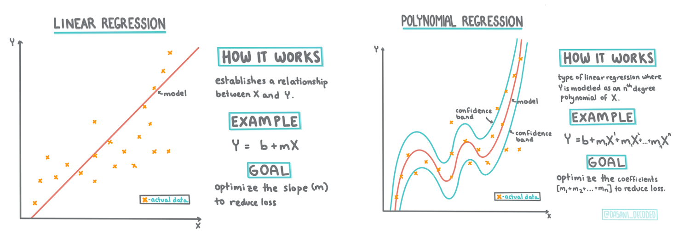
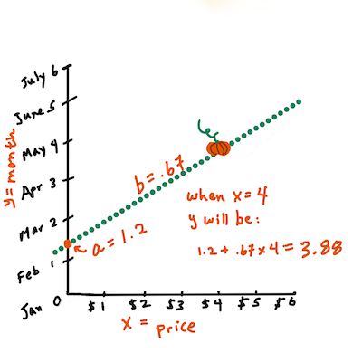

<!--
CO_OP_TRANSLATOR_METADATA:
{
  "original_hash": "2f88fbc741d792890ff2f1430fe0dae0",
  "translation_date": "2025-08-29T20:17:29+00:00",
  "source_file": "2-Regression/3-Linear/README.md",
  "language_code": "br"
}
-->
# Construir um modelo de regressão usando Scikit-learn: regressão de quatro maneiras


> Infográfico por [Dasani Madipalli](https://twitter.com/dasani_decoded)
## [Quiz pré-aula](https://gray-sand-07a10f403.1.azurestaticapps.net/quiz/13/)

> ### [Esta lição está disponível em R!](../../../../2-Regression/3-Linear/solution/R/lesson_3.html)
### Introdução 

Até agora, você explorou o que é regressão com dados de exemplo coletados do conjunto de dados de preços de abóbora que usaremos ao longo desta lição. Você também os visualizou usando Matplotlib.

Agora você está pronto para mergulhar mais fundo na regressão para aprendizado de máquina. Embora a visualização permita que você compreenda os dados, o verdadeiro poder do aprendizado de máquina vem do _treinamento de modelos_. Os modelos são treinados com dados históricos para capturar automaticamente as dependências dos dados e permitem prever resultados para novos dados que o modelo ainda não viu.

Nesta lição, você aprenderá mais sobre dois tipos de regressão: _regressão linear básica_ e _regressão polinomial_, juntamente com algumas das matemáticas subjacentes a essas técnicas. Esses modelos nos permitirão prever os preços das abóboras dependendo de diferentes dados de entrada.

[](https://youtu.be/CRxFT8oTDMg "ML para iniciantes - Entendendo a Regressão Linear")

> 🎥 Clique na imagem acima para um breve vídeo sobre regressão linear.

> Ao longo deste currículo, assumimos conhecimento mínimo de matemática e buscamos torná-lo acessível para estudantes de outras áreas. Fique atento a notas, 🧮 destaques, diagramas e outras ferramentas de aprendizado para ajudar na compreensão.

### Pré-requisito

Você já deve estar familiarizado com a estrutura dos dados de abóbora que estamos analisando. Você pode encontrá-los pré-carregados e pré-limpos no arquivo _notebook.ipynb_ desta lição. No arquivo, o preço da abóbora é exibido por alqueire em um novo data frame. Certifique-se de que pode executar esses notebooks em kernels no Visual Studio Code.

### Preparação

Como lembrete, você está carregando esses dados para fazer perguntas sobre eles.

- Qual é o melhor momento para comprar abóboras? 
- Qual preço posso esperar por uma caixa de abóboras em miniatura?
- Devo comprá-las em cestas de meio alqueire ou em caixas de 1 1/9 alqueire?
Vamos continuar explorando esses dados.

Na lição anterior, você criou um data frame do Pandas e o preencheu com parte do conjunto de dados original, padronizando os preços por alqueire. Ao fazer isso, no entanto, você só conseguiu reunir cerca de 400 pontos de dados e apenas para os meses de outono.

Dê uma olhada nos dados que pré-carregamos no notebook que acompanha esta lição. Os dados estão pré-carregados e um gráfico de dispersão inicial é traçado para mostrar os dados por mês. Talvez possamos obter um pouco mais de detalhes sobre a natureza dos dados ao limpá-los mais.

## Uma linha de regressão linear

Como você aprendeu na Lição 1, o objetivo de um exercício de regressão linear é ser capaz de traçar uma linha para:

- **Mostrar relações entre variáveis**. Mostrar a relação entre variáveis
- **Fazer previsões**. Fazer previsões precisas sobre onde um novo ponto de dados cairia em relação a essa linha. 
 
É típico da **Regressão de Mínimos Quadrados** traçar esse tipo de linha. O termo 'mínimos quadrados' significa que todos os pontos de dados ao redor da linha de regressão são elevados ao quadrado e depois somados. Idealmente, essa soma final é o menor possível, porque queremos um número baixo de erros, ou `mínimos quadrados`. 

Fazemos isso porque queremos modelar uma linha que tenha a menor distância cumulativa de todos os nossos pontos de dados. Também elevamos os termos ao quadrado antes de somá-los, pois estamos preocupados com sua magnitude, em vez de sua direção.

> **🧮 Mostre-me a matemática** 
> 
> Esta linha, chamada de _linha de melhor ajuste_, pode ser expressa por [uma equação](https://en.wikipedia.org/wiki/Simple_linear_regression): 
> 
> ```
> Y = a + bX
> ```
>
> `X` é a 'variável explicativa'. `Y` é a 'variável dependente'. A inclinação da linha é `b` e `a` é o intercepto no eixo Y, que se refere ao valor de `Y` quando `X = 0`. 
>
>
>
> Primeiro, calcule a inclinação `b`. Infográfico por [Jen Looper](https://twitter.com/jenlooper)
>
> Em outras palavras, referindo-se à pergunta original dos dados de abóbora: "prever o preço de uma abóbora por alqueire por mês", `X` se referiria ao preço e `Y` ao mês de venda. 
>
>
>
> Calcule o valor de Y. Se você está pagando cerca de $4, deve ser abril! Infográfico por [Jen Looper](https://twitter.com/jenlooper)
>
> A matemática que calcula a linha deve demonstrar a inclinação da linha, que também depende do intercepto, ou onde `Y` está situado quando `X = 0`.
>
> Você pode observar o método de cálculo desses valores no site [Math is Fun](https://www.mathsisfun.com/data/least-squares-regression.html). Também visite [este calculador de mínimos quadrados](https://www.mathsisfun.com/data/least-squares-calculator.html) para ver como os valores dos números impactam a linha.

## Correlação

Outro termo importante para entender é o **Coeficiente de Correlação** entre as variáveis X e Y fornecidas. Usando um gráfico de dispersão, você pode visualizar rapidamente esse coeficiente. Um gráfico com pontos de dados espalhados em uma linha organizada tem alta correlação, mas um gráfico com pontos de dados espalhados por toda parte entre X e Y tem baixa correlação.

Um bom modelo de regressão linear será aquele que tem um Coeficiente de Correlação alto (mais próximo de 1 do que de 0) usando o método de Mínimos Quadrados com uma linha de regressão.

✅ Execute o notebook que acompanha esta lição e observe o gráfico de dispersão de Mês para Preço. Os dados que associam Mês ao Preço das vendas de abóbora parecem ter alta ou baixa correlação, de acordo com sua interpretação visual do gráfico de dispersão? Isso muda se você usar uma medida mais detalhada em vez de `Mês`, como *dia do ano* (ou seja, número de dias desde o início do ano)?

No código abaixo, assumiremos que limpamos os dados e obtivemos um data frame chamado `new_pumpkins`, semelhante ao seguinte:

ID | Mês | DiaDoAno | Variedade | Cidade | Embalagem | Preço Baixo | Preço Alto | Preço
---|-----|----------|-----------|--------|-----------|-------------|------------|-------
70 | 9 | 267 | TIPO TORTA | BALTIMORE | 1 1/9 caixas de alqueire | 15.0 | 15.0 | 13.636364
71 | 9 | 267 | TIPO TORTA | BALTIMORE | 1 1/9 caixas de alqueire | 18.0 | 18.0 | 16.363636
72 | 10 | 274 | TIPO TORTA | BALTIMORE | 1 1/9 caixas de alqueire | 18.0 | 18.0 | 16.363636
73 | 10 | 274 | TIPO TORTA | BALTIMORE | 1 1/9 caixas de alqueire | 17.0 | 17.0 | 15.454545
74 | 10 | 281 | TIPO TORTA | BALTIMORE | 1 1/9 caixas de alqueire | 15.0 | 15.0 | 13.636364

> O código para limpar os dados está disponível em [`notebook.ipynb`](notebook.ipynb). Realizamos os mesmos passos de limpeza da lição anterior e calculamos a coluna `DiaDoAno` usando a seguinte expressão: 

```python
day_of_year = pd.to_datetime(pumpkins['Date']).apply(lambda dt: (dt-datetime(dt.year,1,1)).days)
```

Agora que você entende a matemática por trás da regressão linear, vamos criar um modelo de regressão para ver se conseguimos prever qual embalagem de abóboras terá os melhores preços. Alguém comprando abóboras para um campo de abóboras de feriado pode querer essa informação para otimizar suas compras de embalagens de abóboras para o campo.

## Procurando por Correlação

[](https://youtu.be/uoRq-lW2eQo "ML para iniciantes - Procurando por Correlação: A Chave para Regressão Linear")

> 🎥 Clique na imagem acima para um breve vídeo sobre correlação.

Na lição anterior, você provavelmente viu que o preço médio para diferentes meses se parece com isto:


Isso sugere que deve haver alguma correlação, e podemos tentar treinar um modelo de regressão linear para prever a relação entre `Mês` e `Preço`, ou entre `DiaDoAno` e `Preço`. Aqui está o gráfico de dispersão que mostra a última relação:

 

Vamos ver se há correlação usando a função `corr`:

```python
print(new_pumpkins['Month'].corr(new_pumpkins['Price']))
print(new_pumpkins['DayOfYear'].corr(new_pumpkins['Price']))
```

Parece que a correlação é bem pequena, -0.15 por `Mês` e -0.17 por `DiaDoAno`, mas pode haver outra relação importante. Parece que há diferentes agrupamentos de preços correspondendo a diferentes variedades de abóbora. Para confirmar essa hipótese, vamos plotar cada categoria de abóbora usando uma cor diferente. Passando um parâmetro `ax` para a função de plotagem `scatter`, podemos plotar todos os pontos no mesmo gráfico:

```python
ax=None
colors = ['red','blue','green','yellow']
for i,var in enumerate(new_pumpkins['Variety'].unique()):
    df = new_pumpkins[new_pumpkins['Variety']==var]
    ax = df.plot.scatter('DayOfYear','Price',ax=ax,c=colors[i],label=var)
```

 

Nossa investigação sugere que a variedade tem mais efeito no preço geral do que a data de venda. Podemos ver isso com um gráfico de barras:

```python
new_pumpkins.groupby('Variety')['Price'].mean().plot(kind='bar')
```

 

Vamos focar por enquanto apenas em uma variedade de abóbora, o 'tipo torta', e ver qual efeito a data tem no preço:

```python
pie_pumpkins = new_pumpkins[new_pumpkins['Variety']=='PIE TYPE']
pie_pumpkins.plot.scatter('DayOfYear','Price') 
```
 

Se agora calcularmos a correlação entre `Preço` e `DiaDoAno` usando a função `corr`, obteremos algo como `-0.27` - o que significa que treinar um modelo preditivo faz sentido.

> Antes de treinar um modelo de regressão linear, é importante garantir que nossos dados estejam limpos. A regressão linear não funciona bem com valores ausentes, portanto, faz sentido eliminar todas as células vazias:

```python
pie_pumpkins.dropna(inplace=True)
pie_pumpkins.info()
```

Outra abordagem seria preencher esses valores vazios com valores médios da coluna correspondente.

## Regressão Linear Simples

[](https://youtu.be/e4c_UP2fSjg "ML para iniciantes - Regressão Linear e Polinomial usando Scikit-learn")

> 🎥 Clique na imagem acima para um breve vídeo sobre regressão linear e polinomial.

Para treinar nosso modelo de Regressão Linear, usaremos a biblioteca **Scikit-learn**.

```python
from sklearn.linear_model import LinearRegression
from sklearn.metrics import mean_squared_error
from sklearn.model_selection import train_test_split
```

Começamos separando os valores de entrada (features) e a saída esperada (label) em arrays numpy separados:

```python
X = pie_pumpkins['DayOfYear'].to_numpy().reshape(-1,1)
y = pie_pumpkins['Price']
```

> Note que tivemos que realizar `reshape` nos dados de entrada para que o pacote de Regressão Linear os entendesse corretamente. A Regressão Linear espera um array 2D como entrada, onde cada linha do array corresponde a um vetor de características de entrada. No nosso caso, como temos apenas uma entrada, precisamos de um array com formato N×1, onde N é o tamanho do conjunto de dados.

Depois, precisamos dividir os dados em conjuntos de treino e teste, para que possamos validar nosso modelo após o treinamento:

```python
X_train, X_test, y_train, y_test = train_test_split(X, y, test_size=0.2, random_state=0)
```

Finalmente, treinar o modelo de Regressão Linear real leva apenas duas linhas de código. Definimos o objeto `LinearRegression` e ajustamos aos nossos dados usando o método `fit`:

```python
lin_reg = LinearRegression()
lin_reg.fit(X_train,y_train)
```

O objeto `LinearRegression` após o ajuste (`fit`) contém todos os coeficientes da regressão, que podem ser acessados usando a propriedade `.coef_`. No nosso caso, há apenas um coeficiente, que deve ser em torno de `-0.017`. Isso significa que os preços parecem cair um pouco com o tempo, mas não muito, cerca de 2 centavos por dia. Também podemos acessar o ponto de interseção da regressão com o eixo Y usando `lin_reg.intercept_` - será em torno de `21` no nosso caso, indicando o preço no início do ano.

Para ver quão preciso nosso modelo é, podemos prever preços em um conjunto de dados de teste e, em seguida, medir quão próximas nossas previsões estão dos valores esperados. Isso pode ser feito usando a métrica de erro quadrático médio (MSE), que é a média de todas as diferenças ao quadrado entre o valor esperado e o valor previsto.

```python
pred = lin_reg.predict(X_test)

mse = np.sqrt(mean_squared_error(y_test,pred))
print(f'Mean error: {mse:3.3} ({mse/np.mean(pred)*100:3.3}%)')
```
Nosso erro parece estar em torno de 2 pontos, o que equivale a ~17%. Não é muito bom. Outro indicador da qualidade do modelo é o **coeficiente de determinação**, que pode ser obtido assim:

```python
score = lin_reg.score(X_train,y_train)
print('Model determination: ', score)
```
Se o valor for 0, significa que o modelo não leva os dados de entrada em consideração e age como o *pior preditor linear*, que é simplesmente o valor médio do resultado. O valor 1 significa que podemos prever perfeitamente todos os resultados esperados. No nosso caso, o coeficiente está em torno de 0,06, o que é bastante baixo.

Também podemos plotar os dados de teste junto com a linha de regressão para entender melhor como a regressão funciona no nosso caso:

```python
plt.scatter(X_test,y_test)
plt.plot(X_test,pred)
```


## Regressão Polinomial

Outro tipo de Regressão Linear é a Regressão Polinomial. Embora às vezes haja uma relação linear entre as variáveis - quanto maior o volume da abóbora, maior o preço - às vezes essas relações não podem ser representadas como um plano ou linha reta.

✅ Aqui estão [alguns exemplos](https://online.stat.psu.edu/stat501/lesson/9/9.8) de dados que poderiam usar Regressão Polinomial.

Observe novamente a relação entre Data e Preço. Esse gráfico de dispersão parece que deveria ser analisado necessariamente por uma linha reta? Os preços não podem flutuar? Nesse caso, você pode tentar a regressão polinomial.

✅ Polinômios são expressões matemáticas que podem consistir em uma ou mais variáveis e coeficientes.

A regressão polinomial cria uma linha curva para ajustar melhor os dados não lineares. No nosso caso, se incluirmos uma variável `DayOfYear` ao quadrado nos dados de entrada, devemos ser capazes de ajustar nossos dados com uma curva parabólica, que terá um mínimo em um determinado ponto do ano.

O Scikit-learn inclui uma [API de pipeline](https://scikit-learn.org/stable/modules/generated/sklearn.pipeline.make_pipeline.html?highlight=pipeline#sklearn.pipeline.make_pipeline) útil para combinar diferentes etapas de processamento de dados. Um **pipeline** é uma cadeia de **estimadores**. No nosso caso, criaremos um pipeline que primeiro adiciona recursos polinomiais ao nosso modelo e, em seguida, treina a regressão:

```python
from sklearn.preprocessing import PolynomialFeatures
from sklearn.pipeline import make_pipeline

pipeline = make_pipeline(PolynomialFeatures(2), LinearRegression())

pipeline.fit(X_train,y_train)
```

Usar `PolynomialFeatures(2)` significa que incluiremos todos os polinômios de segundo grau dos dados de entrada. No nosso caso, isso significará apenas `DayOfYear`<sup>2</sup>, mas, dado duas variáveis de entrada X e Y, isso adicionará X<sup>2</sup>, XY e Y<sup>2</sup>. Também podemos usar polinômios de grau mais alto, se quisermos.

Os pipelines podem ser usados da mesma maneira que o objeto original `LinearRegression`, ou seja, podemos usar `fit` no pipeline e, em seguida, usar `predict` para obter os resultados da previsão. Aqui está o gráfico mostrando os dados de teste e a curva de aproximação:


Usando Regressão Polinomial, podemos obter um MSE ligeiramente menor e um coeficiente de determinação maior, mas não significativamente. Precisamos levar em conta outras características!

> Você pode ver que os preços mínimos das abóboras são observados em algum momento próximo ao Halloween. Como você explicaria isso?

🎃 Parabéns, você acabou de criar um modelo que pode ajudar a prever o preço de abóboras para torta. Você provavelmente pode repetir o mesmo procedimento para todos os tipos de abóbora, mas isso seria tedioso. Vamos aprender agora como levar em conta a variedade de abóbora no nosso modelo!

## Recursos Categóricos

No mundo ideal, queremos ser capazes de prever preços para diferentes variedades de abóbora usando o mesmo modelo. No entanto, a coluna `Variety` é um pouco diferente de colunas como `Month`, porque contém valores não numéricos. Essas colunas são chamadas de **categóricas**.

[](https://youtu.be/DYGliioIAE0 "ML para iniciantes - Previsões com Recursos Categóricos usando Regressão Linear")

> 🎥 Clique na imagem acima para um breve vídeo sobre o uso de recursos categóricos.

Aqui você pode ver como o preço médio depende da variedade:


Para levar a variedade em conta, primeiro precisamos convertê-la para forma numérica, ou **codificá-la**. Existem várias maneiras de fazer isso:

* A **codificação numérica simples** criará uma tabela de diferentes variedades e, em seguida, substituirá o nome da variedade por um índice nessa tabela. Essa não é a melhor ideia para regressão linear, porque a regressão linear leva o valor numérico real do índice e o adiciona ao resultado, multiplicando por algum coeficiente. No nosso caso, a relação entre o número do índice e o preço é claramente não linear, mesmo que garantamos que os índices sejam ordenados de alguma forma específica.
* A **codificação one-hot** substituirá a coluna `Variety` por 4 colunas diferentes, uma para cada variedade. Cada coluna conterá `1` se a linha correspondente for de uma determinada variedade e `0` caso contrário. Isso significa que haverá quatro coeficientes na regressão linear, um para cada variedade de abóbora, responsável pelo "preço inicial" (ou melhor, "preço adicional") para aquela variedade específica.

O código abaixo mostra como podemos codificar uma variedade usando one-hot:

```python
pd.get_dummies(new_pumpkins['Variety'])
```

 ID | FAIRYTALE | MINIATURE | MIXED HEIRLOOM VARIETIES | PIE TYPE
----|-----------|-----------|--------------------------|----------
70 | 0 | 0 | 0 | 1
71 | 0 | 0 | 0 | 1
... | ... | ... | ... | ...
1738 | 0 | 1 | 0 | 0
1739 | 0 | 1 | 0 | 0
1740 | 0 | 1 | 0 | 0
1741 | 0 | 1 | 0 | 0
1742 | 0 | 1 | 0 | 0

Para treinar a regressão linear usando a variedade codificada como one-hot como entrada, só precisamos inicializar os dados `X` e `y` corretamente:

```python
X = pd.get_dummies(new_pumpkins['Variety'])
y = new_pumpkins['Price']
```

O restante do código é o mesmo que usamos acima para treinar a Regressão Linear. Se você tentar, verá que o erro médio quadrático é aproximadamente o mesmo, mas obtemos um coeficiente de determinação muito maior (~77%). Para obter previsões ainda mais precisas, podemos levar em conta mais recursos categóricos, bem como recursos numéricos, como `Month` ou `DayOfYear`. Para obter um grande array de recursos, podemos usar `join`:

```python
X = pd.get_dummies(new_pumpkins['Variety']) \
        .join(new_pumpkins['Month']) \
        .join(pd.get_dummies(new_pumpkins['City'])) \
        .join(pd.get_dummies(new_pumpkins['Package']))
y = new_pumpkins['Price']
```

Aqui também levamos em conta `City` e o tipo de `Package`, o que nos dá um MSE de 2.84 (10%) e um coeficiente de determinação de 0.94!

## Juntando tudo

Para criar o melhor modelo, podemos usar dados combinados (categóricos codificados como one-hot + numéricos) do exemplo acima junto com a Regressão Polinomial. Aqui está o código completo para sua conveniência:

```python
# set up training data
X = pd.get_dummies(new_pumpkins['Variety']) \
        .join(new_pumpkins['Month']) \
        .join(pd.get_dummies(new_pumpkins['City'])) \
        .join(pd.get_dummies(new_pumpkins['Package']))
y = new_pumpkins['Price']

# make train-test split
X_train, X_test, y_train, y_test = train_test_split(X, y, test_size=0.2, random_state=0)

# setup and train the pipeline
pipeline = make_pipeline(PolynomialFeatures(2), LinearRegression())
pipeline.fit(X_train,y_train)

# predict results for test data
pred = pipeline.predict(X_test)

# calculate MSE and determination
mse = np.sqrt(mean_squared_error(y_test,pred))
print(f'Mean error: {mse:3.3} ({mse/np.mean(pred)*100:3.3}%)')

score = pipeline.score(X_train,y_train)
print('Model determination: ', score)
```

Isso deve nos dar o melhor coeficiente de determinação de quase 97% e MSE=2.23 (~8% de erro de previsão).

| Modelo | MSE | Determinação |
|--------|-----|--------------|
| `DayOfYear` Linear | 2.77 (17.2%) | 0.07 |
| `DayOfYear` Polinomial | 2.73 (17.0%) | 0.08 |
| `Variety` Linear | 5.24 (19.7%) | 0.77 |
| Todos os recursos Linear | 2.84 (10.5%) | 0.94 |
| Todos os recursos Polinomial | 2.23 (8.25%) | 0.97 |

🏆 Muito bem! Você criou quatro modelos de Regressão em uma única lição e melhorou a qualidade do modelo para 97%. Na seção final sobre Regressão, você aprenderá sobre Regressão Logística para determinar categorias.

---
## 🚀Desafio

Teste várias variáveis diferentes neste notebook para ver como a correlação corresponde à precisão do modelo.

## [Quiz pós-aula](https://gray-sand-07a10f403.1.azurestaticapps.net/quiz/14/)

## Revisão e Autoestudo

Nesta lição, aprendemos sobre Regressão Linear. Existem outros tipos importantes de Regressão. Leia sobre as técnicas Stepwise, Ridge, Lasso e Elasticnet. Um bom curso para aprender mais é o [curso de Aprendizado Estatístico de Stanford](https://online.stanford.edu/courses/sohs-ystatslearning-statistical-learning).

## Tarefa

[Construa um Modelo](assignment.md)

---

**Aviso Legal**:  
Este documento foi traduzido utilizando o serviço de tradução por IA [Co-op Translator](https://github.com/Azure/co-op-translator). Embora nos esforcemos para garantir a precisão, esteja ciente de que traduções automatizadas podem conter erros ou imprecisões. O documento original em seu idioma nativo deve ser considerado a fonte autoritativa. Para informações críticas, recomenda-se a tradução profissional realizada por humanos. Não nos responsabilizamos por quaisquer mal-entendidos ou interpretações equivocadas decorrentes do uso desta tradução.