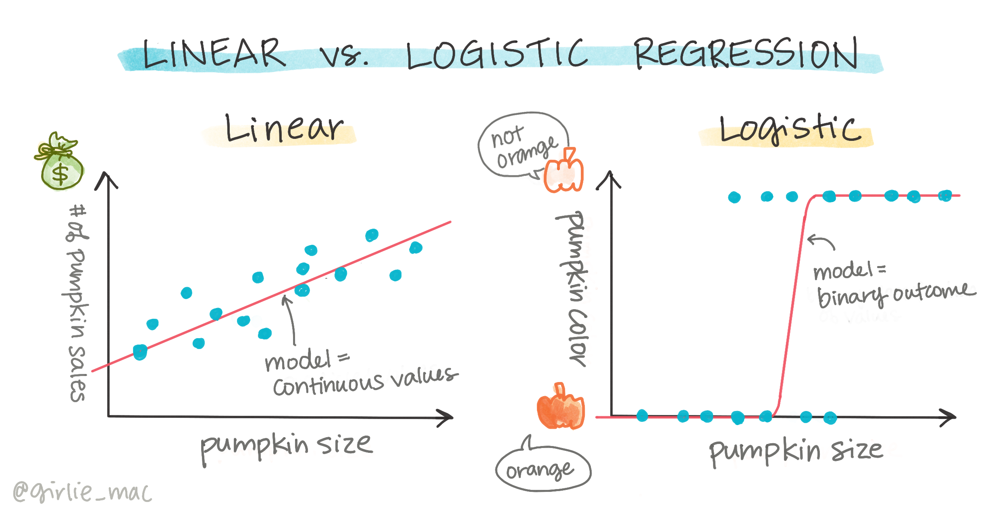
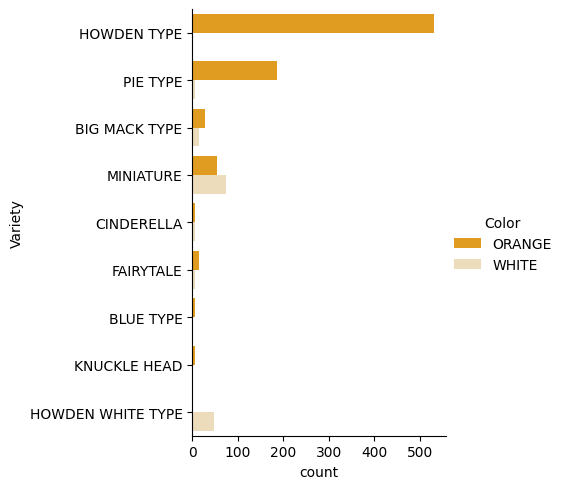
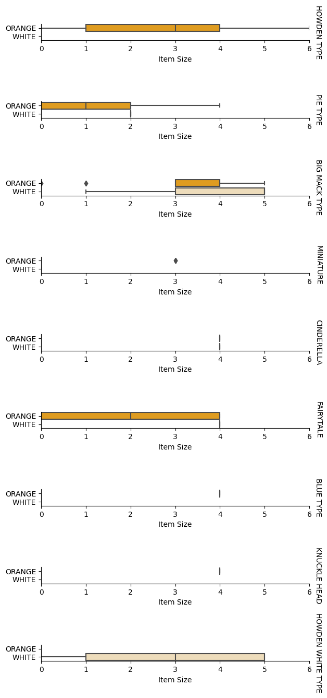
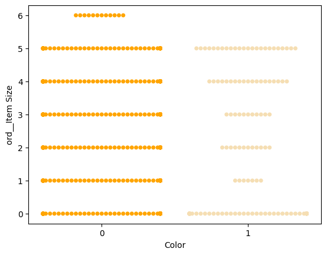
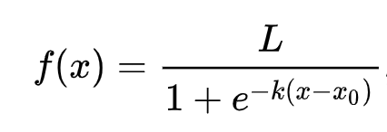
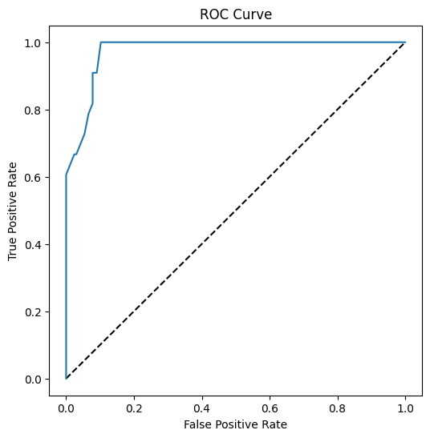

<!--
CO_OP_TRANSLATOR_METADATA:
{
  "original_hash": "72b5bae0879baddf6aafc82bb07b8776",
  "translation_date": "2025-08-29T20:25:42+00:00",
  "source_file": "2-Regression/4-Logistic/README.md",
  "language_code": "br"
}
-->
# Regressão logística para prever categorias



## [Quiz pré-aula](https://gray-sand-07a10f403.1.azurestaticapps.net/quiz/15/)

> ### [Esta lição está disponível em R!](../../../../2-Regression/4-Logistic/solution/R/lesson_4.html)

## Introdução

Nesta última lição sobre Regressão, uma das técnicas básicas _clássicas_ de ML, vamos explorar a Regressão Logística. Você usaria essa técnica para descobrir padrões e prever categorias binárias. Este doce é chocolate ou não? Esta doença é contagiosa ou não? Este cliente escolherá este produto ou não?

Nesta lição, você aprenderá:

- Uma nova biblioteca para visualização de dados
- Técnicas para regressão logística

✅ Aprofunde seu entendimento sobre como trabalhar com este tipo de regressão neste [módulo do Learn](https://docs.microsoft.com/learn/modules/train-evaluate-classification-models?WT.mc_id=academic-77952-leestott)

## Pré-requisito

Depois de trabalhar com os dados de abóboras, já estamos familiarizados o suficiente para perceber que há uma categoria binária com a qual podemos trabalhar: `Color`.

Vamos construir um modelo de regressão logística para prever, com base em algumas variáveis, _qual é a cor provável de uma abóbora_ (laranja 🎃 ou branca 👻).

> Por que estamos falando de classificação binária em uma lição sobre regressão? Apenas por conveniência linguística, já que a regressão logística é [na verdade um método de classificação](https://scikit-learn.org/stable/modules/linear_model.html#logistic-regression), embora baseado em um modelo linear. Aprenda sobre outras formas de classificar dados no próximo grupo de lições.

## Definir a pergunta

Para nossos propósitos, vamos expressar isso como um binário: 'Branca' ou 'Não Branca'. Há também uma categoria 'listrada' em nosso conjunto de dados, mas há poucas instâncias dela, então não a utilizaremos. Ela desaparece quando removemos valores nulos do conjunto de dados, de qualquer forma.

> 🎃 Curiosidade: às vezes chamamos abóboras brancas de abóboras 'fantasmas'. Elas não são muito fáceis de esculpir, então não são tão populares quanto as laranjas, mas têm uma aparência interessante! Assim, também poderíamos reformular nossa pergunta como: 'Fantasma' ou 'Não Fantasma'. 👻

## Sobre regressão logística

A regressão logística difere da regressão linear, que você aprendeu anteriormente, em alguns aspectos importantes.

[](https://youtu.be/KpeCT6nEpBY "ML para iniciantes - Entendendo Regressão Logística para Classificação em Machine Learning")

> 🎥 Clique na imagem acima para um breve vídeo sobre regressão logística.

### Classificação binária

A regressão logística não oferece os mesmos recursos que a regressão linear. A primeira oferece uma previsão sobre uma categoria binária ("branca ou não branca"), enquanto a segunda é capaz de prever valores contínuos, por exemplo, dado a origem de uma abóbora e o tempo de colheita, _quanto seu preço aumentará_.


> Infográfico por [Dasani Madipalli](https://twitter.com/dasani_decoded)

### Outras classificações

Existem outros tipos de regressão logística, incluindo multinomial e ordinal:

- **Multinomial**, que envolve mais de uma categoria - "Laranja, Branca e Listrada".
- **Ordinal**, que envolve categorias ordenadas, útil se quisermos ordenar nossos resultados logicamente, como nossas abóboras ordenadas por um número finito de tamanhos (mini,pequeno,médio,grande,xl,xxl).


### As variáveis NÃO precisam ser correlacionadas

Lembra como a regressão linear funcionava melhor com variáveis mais correlacionadas? A regressão logística é o oposto - as variáveis não precisam estar alinhadas. Isso funciona para este conjunto de dados, que tem correlações um tanto fracas.

### Você precisa de muitos dados limpos

A regressão logística fornecerá resultados mais precisos se você usar mais dados; nosso pequeno conjunto de dados não é ideal para esta tarefa, então tenha isso em mente.

[](https://youtu.be/B2X4H9vcXTs "ML para iniciantes - Análise e Preparação de Dados para Regressão Logística")

> 🎥 Clique na imagem acima para um breve vídeo sobre preparação de dados para regressão linear.

✅ Pense nos tipos de dados que se adaptariam bem à regressão logística.

## Exercício - organizar os dados

Primeiro, limpe os dados um pouco, removendo valores nulos e selecionando apenas algumas colunas:

1. Adicione o seguinte código:

    ```python
  
    columns_to_select = ['City Name','Package','Variety', 'Origin','Item Size', 'Color']
    pumpkins = full_pumpkins.loc[:, columns_to_select]

    pumpkins.dropna(inplace=True)
    ```

    Você sempre pode dar uma olhada no seu novo dataframe:

    ```python
    pumpkins.info
    ```

### Visualização - gráfico categórico

Agora que você carregou o [notebook inicial](./notebook.ipynb) com os dados de abóboras novamente e os limpou para preservar um conjunto de dados contendo algumas variáveis, incluindo `Color`, vamos visualizar o dataframe no notebook usando uma biblioteca diferente: [Seaborn](https://seaborn.pydata.org/index.html), que é construída sobre o Matplotlib que usamos anteriormente.

O Seaborn oferece algumas maneiras interessantes de visualizar seus dados. Por exemplo, você pode comparar distribuições dos dados para cada `Variety` e `Color` em um gráfico categórico.

1. Crie tal gráfico usando a função `catplot`, com os dados de abóboras `pumpkins`, e especificando um mapeamento de cores para cada categoria de abóbora (laranja ou branca):

    ```python
    import seaborn as sns
    
    palette = {
    'ORANGE': 'orange',
    'WHITE': 'wheat',
    }

    sns.catplot(
    data=pumpkins, y="Variety", hue="Color", kind="count",
    palette=palette, 
    )
    ```

    

    Observando os dados, você pode ver como os dados de `Color` se relacionam com `Variety`.

    ✅ Dado este gráfico categórico, quais são algumas explorações interessantes que você pode imaginar?

### Pré-processamento de dados: codificação de características e rótulos

Nosso conjunto de dados de abóboras contém valores de string para todas as suas colunas. Trabalhar com dados categóricos é intuitivo para humanos, mas não para máquinas. Os algoritmos de aprendizado de máquina funcionam bem com números. Por isso, a codificação é uma etapa muito importante na fase de pré-processamento de dados, pois permite transformar dados categóricos em dados numéricos, sem perder informações. Uma boa codificação leva à construção de um bom modelo.

Para a codificação de características, existem dois principais tipos de codificadores:

1. Codificador ordinal: é adequado para variáveis ordinais, que são variáveis categóricas cujos dados seguem uma ordem lógica, como a coluna `Item Size` em nosso conjunto de dados. Ele cria um mapeamento em que cada categoria é representada por um número, que é a ordem da categoria na coluna.

    ```python
    from sklearn.preprocessing import OrdinalEncoder

    item_size_categories = [['sml', 'med', 'med-lge', 'lge', 'xlge', 'jbo', 'exjbo']]
    ordinal_features = ['Item Size']
    ordinal_encoder = OrdinalEncoder(categories=item_size_categories)
    ```

2. Codificador categórico: é adequado para variáveis nominais, que são variáveis categóricas cujos dados não seguem uma ordem lógica, como todas as características diferentes de `Item Size` em nosso conjunto de dados. É uma codificação one-hot, o que significa que cada categoria é representada por uma coluna binária: a variável codificada é igual a 1 se a abóbora pertence àquela `Variety` e 0 caso contrário.

    ```python
    from sklearn.preprocessing import OneHotEncoder

    categorical_features = ['City Name', 'Package', 'Variety', 'Origin']
    categorical_encoder = OneHotEncoder(sparse_output=False)
    ```

Depois, `ColumnTransformer` é usado para combinar múltiplos codificadores em uma única etapa e aplicá-los às colunas apropriadas.

```python
    from sklearn.compose import ColumnTransformer
    
    ct = ColumnTransformer(transformers=[
        ('ord', ordinal_encoder, ordinal_features),
        ('cat', categorical_encoder, categorical_features)
        ])
    
    ct.set_output(transform='pandas')
    encoded_features = ct.fit_transform(pumpkins)
```

Por outro lado, para codificar o rótulo, usamos a classe `LabelEncoder` do scikit-learn, que é uma classe utilitária para ajudar a normalizar rótulos de forma que contenham apenas valores entre 0 e n_classes-1 (aqui, 0 e 1).

```python
    from sklearn.preprocessing import LabelEncoder

    label_encoder = LabelEncoder()
    encoded_label = label_encoder.fit_transform(pumpkins['Color'])
```

Depois de codificar as características e o rótulo, podemos mesclá-los em um novo dataframe `encoded_pumpkins`.

```python
    encoded_pumpkins = encoded_features.assign(Color=encoded_label)
```

✅ Quais são as vantagens de usar um codificador ordinal para a coluna `Item Size`?

### Analisar relações entre variáveis

Agora que pré-processamos nossos dados, podemos analisar as relações entre as características e o rótulo para ter uma ideia de quão bem o modelo será capaz de prever o rótulo com base nas características. 

A melhor maneira de realizar esse tipo de análise é plotando os dados. Usaremos novamente a função `catplot` do Seaborn para visualizar as relações entre `Item Size`, `Variety` e `Color` em um gráfico categórico. Para melhor plotar os dados, usaremos a coluna codificada `Item Size` e a coluna não codificada `Variety`.

```python
    palette = {
    'ORANGE': 'orange',
    'WHITE': 'wheat',
    }
    pumpkins['Item Size'] = encoded_pumpkins['ord__Item Size']

    g = sns.catplot(
        data=pumpkins,
        x="Item Size", y="Color", row='Variety',
        kind="box", orient="h",
        sharex=False, margin_titles=True,
        height=1.8, aspect=4, palette=palette,
    )
    g.set(xlabel="Item Size", ylabel="").set(xlim=(0,6))
    g.set_titles(row_template="{row_name}")
```



### Usar um gráfico de dispersão (swarm plot)

Como `Color` é uma categoria binária (Branca ou Não), ela precisa de '[uma abordagem especializada](https://seaborn.pydata.org/tutorial/categorical.html?highlight=bar) para visualização'. Existem outras maneiras de visualizar a relação dessa categoria com outras variáveis.

Você pode visualizar variáveis lado a lado com gráficos do Seaborn.

1. Experimente um gráfico de dispersão ('swarm') para mostrar a distribuição de valores:

    ```python
    palette = {
    0: 'orange',
    1: 'wheat'
    }
    sns.swarmplot(x="Color", y="ord__Item Size", data=encoded_pumpkins, palette=palette)
    ```

    

**Atenção**: o código acima pode gerar um aviso, já que o Seaborn pode falhar ao representar tal quantidade de pontos de dados em um gráfico de dispersão. Uma solução possível é diminuir o tamanho do marcador, usando o parâmetro 'size'. No entanto, esteja ciente de que isso pode afetar a legibilidade do gráfico.

> **🧮 Mostre-me a Matemática**
>
> A regressão logística baseia-se no conceito de 'máxima verossimilhança' usando [funções sigmoides](https://wikipedia.org/wiki/Sigmoid_function). Uma 'Função Sigmoide' em um gráfico parece uma forma de 'S'. Ela pega um valor e o mapeia para algo entre 0 e 1. Sua curva também é chamada de 'curva logística'. Sua fórmula é assim:
>
> 
>
> onde o ponto médio da sigmoide encontra-se no ponto 0 de x, L é o valor máximo da curva e k é a inclinação da curva. Se o resultado da função for maior que 0,5, o rótulo em questão será classificado como '1' da escolha binária. Caso contrário, será classificado como '0'.

## Construir seu modelo

Construir um modelo para encontrar essas classificações binárias é surpreendentemente simples no Scikit-learn.

[](https://youtu.be/MmZS2otPrQ8 "ML para iniciantes - Regressão Logística para classificação de dados")

> 🎥 Clique na imagem acima para um breve vídeo sobre como construir um modelo de regressão linear.

1. Selecione as variáveis que deseja usar em seu modelo de classificação e divida os conjuntos de treinamento e teste chamando `train_test_split()`:

    ```python
    from sklearn.model_selection import train_test_split
    
    X = encoded_pumpkins[encoded_pumpkins.columns.difference(['Color'])]
    y = encoded_pumpkins['Color']

    X_train, X_test, y_train, y_test = train_test_split(X, y, test_size=0.2, random_state=0)
    
    ```

2. Agora você pode treinar seu modelo, chamando `fit()` com seus dados de treinamento, e imprimir o resultado:

    ```python
    from sklearn.metrics import f1_score, classification_report 
    from sklearn.linear_model import LogisticRegression

    model = LogisticRegression()
    model.fit(X_train, y_train)
    predictions = model.predict(X_test)

    print(classification_report(y_test, predictions))
    print('Predicted labels: ', predictions)
    print('F1-score: ', f1_score(y_test, predictions))
    ```

    Veja o desempenho do seu modelo. Não é ruim, considerando que você tem apenas cerca de 1000 linhas de dados:

    ```output
                       precision    recall  f1-score   support
    
                    0       0.94      0.98      0.96       166
                    1       0.85      0.67      0.75        33
    
        accuracy                                0.92       199
        macro avg           0.89      0.82      0.85       199
        weighted avg        0.92      0.92      0.92       199
    
        Predicted labels:  [0 0 0 0 0 0 0 0 0 0 0 0 0 0 0 0 0 0 0 0 1 0 0 1 0 0 0 0 0 0 0 0 1 0 0 0 0
        0 0 0 0 0 1 0 1 0 0 1 0 0 0 0 0 1 0 1 0 1 0 1 0 0 0 0 0 0 0 0 0 0 0 0 0 0
        1 0 0 0 0 0 0 0 1 0 0 0 0 0 0 0 1 0 0 0 0 0 0 0 0 1 0 1 0 0 0 0 0 0 0 1 0
        0 0 0 0 0 0 0 0 0 0 0 0 0 0 0 0 0 0 0 0 0 1 0 0 0 0 0 0 0 0 1 0 0 0 1 1 0
        0 0 0 0 1 0 0 0 0 0 1 0 0 0 0 0 0 0 0 0 0 0 0 0 0 0 0 0 0 0 0 0 0 0 0 0 1
        0 0 0 1 0 0 0 0 0 0 0 0 1 1]
        F1-score:  0.7457627118644068
    ```

## Melhor compreensão por meio de uma matriz de confusão

Embora você possa obter um relatório de desempenho [termos](https://scikit-learn.org/stable/modules/generated/sklearn.metrics.classification_report.html?highlight=classification_report#sklearn.metrics.classification_report) imprimindo os itens acima, talvez seja mais fácil entender seu modelo usando uma [matriz de confusão](https://scikit-learn.org/stable/modules/model_evaluation.html#confusion-matrix) para ajudar a entender como o modelo está se saindo.

> 🎓 Uma '[matriz de confusão](https://wikipedia.org/wiki/Confusion_matrix)' (ou 'matriz de erro') é uma tabela que expressa os verdadeiros vs. falsos positivos e negativos do seu modelo, avaliando assim a precisão das previsões.

1. Para usar uma matriz de confusão, chame `confusion_matrix()`:

    ```python
    from sklearn.metrics import confusion_matrix
    confusion_matrix(y_test, predictions)
    ```

    Veja a matriz de confusão do seu modelo:

    ```output
    array([[162,   4],
           [ 11,  22]])
    ```

No Scikit-learn, as linhas (eixo 0) da matriz de confusão são os rótulos reais e as colunas (eixo 1) são os rótulos previstos.

|       |   0   |   1   |
| :---: | :---: | :---: |
|   0   |  TN   |  FP   |
|   1   |  FN   |  TP   |

O que está acontecendo aqui? Digamos que nosso modelo seja solicitado a classificar abóboras entre duas categorias binárias, categoria 'branca' e categoria 'não branca'.

- Se o modelo prevê uma abóbora como não branca e ela realmente pertence à categoria 'não branca', chamamos isso de verdadeiro negativo, mostrado pelo número no canto superior esquerdo.
- Se o modelo prevê uma abóbora como branca e ela realmente pertence à categoria 'não branca', chamamos isso de falso negativo, mostrado pelo número no canto inferior esquerdo.
- Se o modelo prevê uma abóbora como não branca e ela realmente pertence à categoria 'branca', chamamos isso de falso positivo, mostrado pelo número no canto superior direito.
- Se o modelo prevê uma abóbora como branca e ela realmente pertence à categoria 'branca', chamamos isso de verdadeiro positivo, mostrado pelo número no canto inferior direito.

Como você deve ter adivinhado, é preferível ter um número maior de verdadeiros positivos e verdadeiros negativos e um número menor de falsos positivos e falsos negativos, o que implica que o modelo está se saindo melhor.
Como a matriz de confusão se relaciona com precisão e recall? Lembre-se, o relatório de classificação mostrado acima indicou precisão (0,85) e recall (0,67).

Precisão = tp / (tp + fp) = 22 / (22 + 4) = 0,8461538461538461

Recall = tp / (tp + fn) = 22 / (22 + 11) = 0,6666666666666666

✅ P: De acordo com a matriz de confusão, como o modelo se saiu? R: Não foi ruim; há um bom número de verdadeiros negativos, mas também alguns falsos negativos.

Vamos revisitar os termos que vimos anteriormente com a ajuda do mapeamento de TP/TN e FP/FN na matriz de confusão:

🎓 Precisão: TP/(TP + FP) A fração de instâncias relevantes entre as instâncias recuperadas (por exemplo, quais rótulos foram bem rotulados).

🎓 Recall: TP/(TP + FN) A fração de instâncias relevantes que foram recuperadas, independentemente de estarem bem rotuladas ou não.

🎓 f1-score: (2 * precisão * recall)/(precisão + recall) Uma média ponderada entre precisão e recall, sendo o melhor 1 e o pior 0.

🎓 Suporte: O número de ocorrências de cada rótulo recuperado.

🎓 Precisão geral (Accuracy): (TP + TN)/(TP + TN + FP + FN) A porcentagem de rótulos previstos corretamente para uma amostra.

🎓 Macro Avg: O cálculo da média não ponderada das métricas para cada rótulo, sem levar em conta o desequilíbrio entre os rótulos.

🎓 Weighted Avg: O cálculo da média das métricas para cada rótulo, levando em conta o desequilíbrio entre os rótulos ao ponderá-los pelo suporte (o número de instâncias verdadeiras para cada rótulo).

✅ Você consegue pensar em qual métrica deve observar se quiser que seu modelo reduza o número de falsos negativos?

## Visualizar a curva ROC deste modelo

[](https://youtu.be/GApO575jTA0 "ML para iniciantes - Analisando o desempenho da regressão logística com curvas ROC")

> 🎥 Clique na imagem acima para um breve vídeo sobre curvas ROC.

Vamos fazer mais uma visualização para ver a chamada curva 'ROC':

```python
from sklearn.metrics import roc_curve, roc_auc_score
import matplotlib
import matplotlib.pyplot as plt
%matplotlib inline

y_scores = model.predict_proba(X_test)
fpr, tpr, thresholds = roc_curve(y_test, y_scores[:,1])

fig = plt.figure(figsize=(6, 6))
plt.plot([0, 1], [0, 1], 'k--')
plt.plot(fpr, tpr)
plt.xlabel('False Positive Rate')
plt.ylabel('True Positive Rate')
plt.title('ROC Curve')
plt.show()
```

Usando Matplotlib, plote a [Curva Característica de Operação do Receptor](https://scikit-learn.org/stable/auto_examples/model_selection/plot_roc.html?highlight=roc) ou ROC do modelo. As curvas ROC são frequentemente usadas para visualizar o desempenho de um classificador em termos de seus verdadeiros positivos versus falsos positivos. "As curvas ROC geralmente apresentam a taxa de verdadeiros positivos no eixo Y e a taxa de falsos positivos no eixo X." Assim, a inclinação da curva e o espaço entre a linha do ponto médio e a curva são importantes: você quer uma curva que rapidamente suba e ultrapasse a linha. No nosso caso, há falsos positivos no início, e então a linha sobe e ultrapassa adequadamente:



Por fim, use a API [`roc_auc_score`](https://scikit-learn.org/stable/modules/generated/sklearn.metrics.roc_auc_score.html?highlight=roc_auc#sklearn.metrics.roc_auc_score) do Scikit-learn para calcular a 'Área Sob a Curva' (AUC):

```python
auc = roc_auc_score(y_test,y_scores[:,1])
print(auc)
```

O resultado é `0,9749908725812341`. Dado que a AUC varia de 0 a 1, você quer um valor alto, já que um modelo que é 100% correto em suas previsões terá uma AUC de 1; neste caso, o modelo está _muito bom_.

Em futuras lições sobre classificações, você aprenderá como iterar para melhorar os resultados do seu modelo. Mas, por enquanto, parabéns! Você concluiu estas lições sobre regressão!

---
## 🚀Desafio

Há muito mais para explorar sobre regressão logística! Mas a melhor maneira de aprender é experimentando. Encontre um conjunto de dados que se preste a este tipo de análise e construa um modelo com ele. O que você aprende? dica: experimente [Kaggle](https://www.kaggle.com/search?q=logistic+regression+datasets) para conjuntos de dados interessantes.

## [Quiz pós-aula](https://gray-sand-07a10f403.1.azurestaticapps.net/quiz/16/)

## Revisão e Autoestudo

Leia as primeiras páginas [deste artigo de Stanford](https://web.stanford.edu/~jurafsky/slp3/5.pdf) sobre alguns usos práticos da regressão logística. Pense em tarefas que são mais adequadas para um ou outro tipo de regressão entre as que estudamos até agora. O que funcionaria melhor?

## Tarefa

[Repetindo esta regressão](assignment.md)

---

**Aviso Legal**:  
Este documento foi traduzido utilizando o serviço de tradução por IA [Co-op Translator](https://github.com/Azure/co-op-translator). Embora nos esforcemos para garantir a precisão, esteja ciente de que traduções automatizadas podem conter erros ou imprecisões. O documento original em seu idioma nativo deve ser considerado a fonte autoritativa. Para informações críticas, recomenda-se a tradução profissional realizada por humanos. Não nos responsabilizamos por quaisquer mal-entendidos ou interpretações equivocadas decorrentes do uso desta tradução.