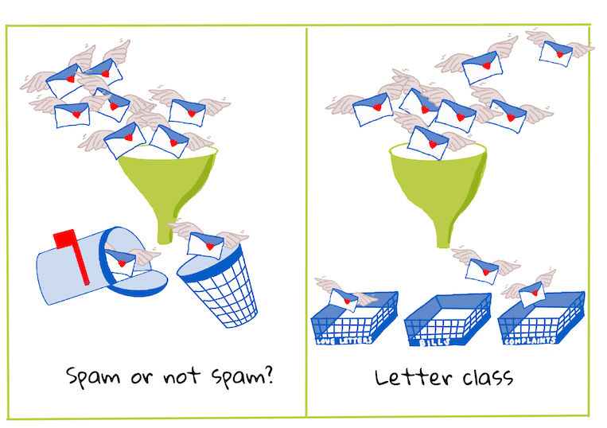
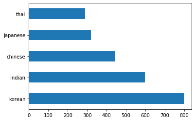
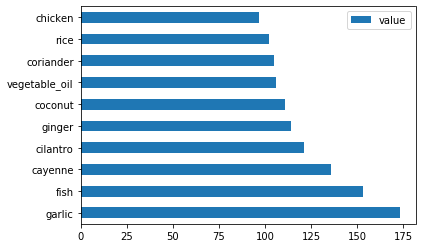
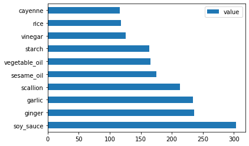
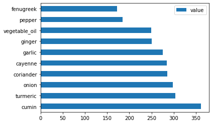

<!--
CO_OP_TRANSLATOR_METADATA:
{
  "original_hash": "76438ce4e5d48982d48f1b55c981caac",
  "translation_date": "2025-08-29T21:52:39+00:00",
  "source_file": "4-Classification/1-Introduction/README.md",
  "language_code": "br"
}
-->
# Introdução à classificação

Nestas quatro lições, você explorará um dos focos fundamentais do aprendizado de máquina clássico - _classificação_. Vamos utilizar vários algoritmos de classificação com um conjunto de dados sobre as brilhantes culinárias da Ásia e da Índia. Espero que você esteja com fome!


> Celebre as culinárias pan-asiáticas nestas lições! Imagem por [Jen Looper](https://twitter.com/jenlooper)

Classificação é uma forma de [aprendizado supervisionado](https://wikipedia.org/wiki/Supervised_learning) que tem muito em comum com técnicas de regressão. Se o aprendizado de máquina é sobre prever valores ou nomes para coisas usando conjuntos de dados, então a classificação geralmente se divide em dois grupos: _classificação binária_ e _classificação multiclasse_.

[](https://youtu.be/eg8DJYwdMyg "Introdução à classificação")

> 🎥 Clique na imagem acima para assistir a um vídeo: John Guttag, do MIT, apresenta a classificação

Lembre-se:

- **Regressão linear** ajudou você a prever relações entre variáveis e fazer previsões precisas sobre onde um novo ponto de dados se encaixaria em relação a essa linha. Por exemplo, você poderia prever _qual seria o preço de uma abóbora em setembro vs. dezembro_.
- **Regressão logística** ajudou você a descobrir "categorias binárias": neste ponto de preço, _essa abóbora é laranja ou não-laranja_?

A classificação utiliza vários algoritmos para determinar outras maneiras de identificar o rótulo ou a classe de um ponto de dados. Vamos trabalhar com esses dados de culinária para ver se, ao observar um grupo de ingredientes, conseguimos determinar sua origem culinária.

## [Pré-quiz da aula](https://gray-sand-07a10f403.1.azurestaticapps.net/quiz/19/)

> ### [Esta lição está disponível em R!](../../../../4-Classification/1-Introduction/solution/R/lesson_10.html)

### Introdução

A classificação é uma das atividades fundamentais do pesquisador de aprendizado de máquina e do cientista de dados. Desde a classificação básica de um valor binário ("este e-mail é spam ou não?") até a classificação e segmentação complexa de imagens usando visão computacional, é sempre útil ser capaz de organizar dados em classes e fazer perguntas sobre eles.

Para descrever o processo de forma mais científica, seu método de classificação cria um modelo preditivo que permite mapear a relação entre variáveis de entrada e variáveis de saída.



> Problemas binários vs. multiclasse para algoritmos de classificação resolverem. Infográfico por [Jen Looper](https://twitter.com/jenlooper)

Antes de começar o processo de limpar nossos dados, visualizá-los e prepará-los para nossas tarefas de aprendizado de máquina, vamos aprender um pouco sobre as várias maneiras pelas quais o aprendizado de máquina pode ser usado para classificar dados.

Derivada da [estatística](https://wikipedia.org/wiki/Statistical_classification), a classificação usando aprendizado de máquina clássico utiliza características, como `smoker`, `weight` e `age`, para determinar a _probabilidade de desenvolver X doença_. Como uma técnica de aprendizado supervisionado semelhante aos exercícios de regressão que você realizou anteriormente, seus dados são rotulados e os algoritmos de aprendizado de máquina usam esses rótulos para classificar e prever classes (ou 'características') de um conjunto de dados e atribuí-las a um grupo ou resultado.

✅ Tire um momento para imaginar um conjunto de dados sobre culinárias. O que um modelo multiclasse seria capaz de responder? O que um modelo binário seria capaz de responder? E se você quisesse determinar se uma determinada culinária provavelmente usa feno-grego? E se você quisesse ver se, dado um presente de uma sacola de supermercado cheia de anis-estrelado, alcachofras, couve-flor e raiz-forte, você poderia criar um prato típico indiano?

[](https://youtu.be/GuTeDbaNoEU "Cestas misteriosas malucas")

> 🎥 Clique na imagem acima para assistir a um vídeo. Toda a premissa do programa 'Chopped' é a 'cesta misteriosa', onde os chefs têm que fazer um prato com uma escolha aleatória de ingredientes. Certamente um modelo de aprendizado de máquina teria ajudado!

## Olá 'classificador'

A pergunta que queremos fazer sobre este conjunto de dados de culinária é, na verdade, uma **pergunta multiclasse**, já que temos várias possíveis culinárias nacionais para trabalhar. Dado um lote de ingredientes, a qual dessas muitas classes os dados pertencem?

O Scikit-learn oferece vários algoritmos diferentes para classificar dados, dependendo do tipo de problema que você deseja resolver. Nas próximas duas lições, você aprenderá sobre alguns desses algoritmos.

## Exercício - limpar e balancear seus dados

A primeira tarefa, antes de começar este projeto, é limpar e **balancear** seus dados para obter melhores resultados. Comece com o arquivo em branco _notebook.ipynb_ na raiz desta pasta.

A primeira coisa a instalar é o [imblearn](https://imbalanced-learn.org/stable/). Este é um pacote do Scikit-learn que permitirá balancear melhor os dados (você aprenderá mais sobre essa tarefa em breve).

1. Para instalar o `imblearn`, execute `pip install`, assim:

    ```python
    pip install imblearn
    ```

1. Importe os pacotes necessários para importar seus dados e visualizá-los, além de importar `SMOTE` do `imblearn`.

    ```python
    import pandas as pd
    import matplotlib.pyplot as plt
    import matplotlib as mpl
    import numpy as np
    from imblearn.over_sampling import SMOTE
    ```

    Agora você está pronto para importar os dados.

1. A próxima tarefa será importar os dados:

    ```python
    df  = pd.read_csv('../data/cuisines.csv')
    ```

   Usar `read_csv()` lerá o conteúdo do arquivo csv _cusines.csv_ e o colocará na variável `df`.

1. Verifique o formato dos dados:

    ```python
    df.head()
    ```

   As primeiras cinco linhas se parecem com isto:

    ```output
    |     | Unnamed: 0 | cuisine | almond | angelica | anise | anise_seed | apple | apple_brandy | apricot | armagnac | ... | whiskey | white_bread | white_wine | whole_grain_wheat_flour | wine | wood | yam | yeast | yogurt | zucchini |
    | --- | ---------- | ------- | ------ | -------- | ----- | ---------- | ----- | ------------ | ------- | -------- | --- | ------- | ----------- | ---------- | ----------------------- | ---- | ---- | --- | ----- | ------ | -------- |
    | 0   | 65         | indian  | 0      | 0        | 0     | 0          | 0     | 0            | 0       | 0        | ... | 0       | 0           | 0          | 0                       | 0    | 0    | 0   | 0     | 0      | 0        |
    | 1   | 66         | indian  | 1      | 0        | 0     | 0          | 0     | 0            | 0       | 0        | ... | 0       | 0           | 0          | 0                       | 0    | 0    | 0   | 0     | 0      | 0        |
    | 2   | 67         | indian  | 0      | 0        | 0     | 0          | 0     | 0            | 0       | 0        | ... | 0       | 0           | 0          | 0                       | 0    | 0    | 0   | 0     | 0      | 0        |
    | 3   | 68         | indian  | 0      | 0        | 0     | 0          | 0     | 0            | 0       | 0        | ... | 0       | 0           | 0          | 0                       | 0    | 0    | 0   | 0     | 0      | 0        |
    | 4   | 69         | indian  | 0      | 0        | 0     | 0          | 0     | 0            | 0       | 0        | ... | 0       | 0           | 0          | 0                       | 0    | 0    | 0   | 0     | 1      | 0        |
    ```

1. Obtenha informações sobre esses dados chamando `info()`:

    ```python
    df.info()
    ```

    Sua saída se parece com:

    ```output
    <class 'pandas.core.frame.DataFrame'>
    RangeIndex: 2448 entries, 0 to 2447
    Columns: 385 entries, Unnamed: 0 to zucchini
    dtypes: int64(384), object(1)
    memory usage: 7.2+ MB
    ```

## Exercício - aprendendo sobre culinárias

Agora o trabalho começa a ficar mais interessante. Vamos descobrir a distribuição dos dados por culinária.

1. Plote os dados como barras chamando `barh()`:

    ```python
    df.cuisine.value_counts().plot.barh()
    ```

    

    Há um número finito de culinárias, mas a distribuição dos dados é desigual. Você pode corrigir isso! Antes de fazer isso, explore um pouco mais.

1. Descubra quanto dado está disponível por culinária e imprima:

    ```python
    thai_df = df[(df.cuisine == "thai")]
    japanese_df = df[(df.cuisine == "japanese")]
    chinese_df = df[(df.cuisine == "chinese")]
    indian_df = df[(df.cuisine == "indian")]
    korean_df = df[(df.cuisine == "korean")]
    
    print(f'thai df: {thai_df.shape}')
    print(f'japanese df: {japanese_df.shape}')
    print(f'chinese df: {chinese_df.shape}')
    print(f'indian df: {indian_df.shape}')
    print(f'korean df: {korean_df.shape}')
    ```

    A saída se parece com isto:

    ```output
    thai df: (289, 385)
    japanese df: (320, 385)
    chinese df: (442, 385)
    indian df: (598, 385)
    korean df: (799, 385)
    ```

## Descobrindo ingredientes

Agora você pode se aprofundar nos dados e aprender quais são os ingredientes típicos por culinária. Você deve limpar dados recorrentes que criam confusão entre culinárias, então vamos aprender sobre esse problema.

1. Crie uma função `create_ingredient()` em Python para criar um dataframe de ingredientes. Essa função começará removendo uma coluna inútil e classificará os ingredientes por sua contagem:

    ```python
    def create_ingredient_df(df):
        ingredient_df = df.T.drop(['cuisine','Unnamed: 0']).sum(axis=1).to_frame('value')
        ingredient_df = ingredient_df[(ingredient_df.T != 0).any()]
        ingredient_df = ingredient_df.sort_values(by='value', ascending=False,
        inplace=False)
        return ingredient_df
    ```

   Agora você pode usar essa função para ter uma ideia dos dez ingredientes mais populares por culinária.

1. Chame `create_ingredient()` e plote chamando `barh()`:

    ```python
    thai_ingredient_df = create_ingredient_df(thai_df)
    thai_ingredient_df.head(10).plot.barh()
    ```

    

1. Faça o mesmo para os dados japoneses:

    ```python
    japanese_ingredient_df = create_ingredient_df(japanese_df)
    japanese_ingredient_df.head(10).plot.barh()
    ```

    

1. Agora para os ingredientes chineses:

    ```python
    chinese_ingredient_df = create_ingredient_df(chinese_df)
    chinese_ingredient_df.head(10).plot.barh()
    ```

    

1. Plote os ingredientes indianos:

    ```python
    indian_ingredient_df = create_ingredient_df(indian_df)
    indian_ingredient_df.head(10).plot.barh()
    ```

    

1. Finalmente, plote os ingredientes coreanos:

    ```python
    korean_ingredient_df = create_ingredient_df(korean_df)
    korean_ingredient_df.head(10).plot.barh()
    ```

    

1. Agora, remova os ingredientes mais comuns que criam confusão entre culinárias distintas, chamando `drop()`:

   Todo mundo adora arroz, alho e gengibre!

    ```python
    feature_df= df.drop(['cuisine','Unnamed: 0','rice','garlic','ginger'], axis=1)
    labels_df = df.cuisine #.unique()
    feature_df.head()
    ```

## Balancear o conjunto de dados

Agora que você limpou os dados, use o [SMOTE](https://imbalanced-learn.org/dev/references/generated/imblearn.over_sampling.SMOTE.html) - "Técnica de Superamostragem de Minoria Sintética" - para balanceá-los.

1. Chame `fit_resample()`, essa estratégia gera novas amostras por interpolação.

    ```python
    oversample = SMOTE()
    transformed_feature_df, transformed_label_df = oversample.fit_resample(feature_df, labels_df)
    ```

    Ao balancear seus dados, você terá melhores resultados ao classificá-los. Pense em uma classificação binária. Se a maior parte dos seus dados pertence a uma classe, um modelo de aprendizado de máquina vai prever essa classe com mais frequência, apenas porque há mais dados para ela. Balancear os dados corrige esse desequilíbrio.

1. Agora você pode verificar os números de rótulos por ingrediente:

    ```python
    print(f'new label count: {transformed_label_df.value_counts()}')
    print(f'old label count: {df.cuisine.value_counts()}')
    ```

    Sua saída se parece com isto:

    ```output
    new label count: korean      799
    chinese     799
    indian      799
    japanese    799
    thai        799
    Name: cuisine, dtype: int64
    old label count: korean      799
    indian      598
    chinese     442
    japanese    320
    thai        289
    Name: cuisine, dtype: int64
    ```

    Os dados estão limpos, balanceados e muito deliciosos!

1. O último passo é salvar seus dados balanceados, incluindo rótulos e características, em um novo dataframe que pode ser exportado para um arquivo:

    ```python
    transformed_df = pd.concat([transformed_label_df,transformed_feature_df],axis=1, join='outer')
    ```

1. Você pode dar mais uma olhada nos dados usando `transformed_df.head()` e `transformed_df.info()`. Salve uma cópia desses dados para uso em lições futuras:

    ```python
    transformed_df.head()
    transformed_df.info()
    transformed_df.to_csv("../data/cleaned_cuisines.csv")
    ```

    Este novo CSV pode agora ser encontrado na pasta de dados raiz.

---

## 🚀Desafio

Este currículo contém vários conjuntos de dados interessantes. Explore as pastas `data` e veja se alguma contém conjuntos de dados que seriam apropriados para classificação binária ou multiclasse. Que perguntas você faria a esse conjunto de dados?

## [Pós-quiz da aula](https://gray-sand-07a10f403.1.azurestaticapps.net/quiz/20/)

## Revisão e Autoestudo

Explore a API do SMOTE. Para quais casos de uso ele é mais adequado? Que problemas ele resolve?

## Tarefa 

[Explore métodos de classificação](assignment.md)

---

**Aviso Legal**:  
Este documento foi traduzido utilizando o serviço de tradução por IA [Co-op Translator](https://github.com/Azure/co-op-translator). Embora nos esforcemos para garantir a precisão, esteja ciente de que traduções automatizadas podem conter erros ou imprecisões. O documento original em seu idioma nativo deve ser considerado a fonte autoritativa. Para informações críticas, recomenda-se a tradução profissional realizada por humanos. Não nos responsabilizamos por quaisquer mal-entendidos ou interpretações equivocadas decorrentes do uso desta tradução.