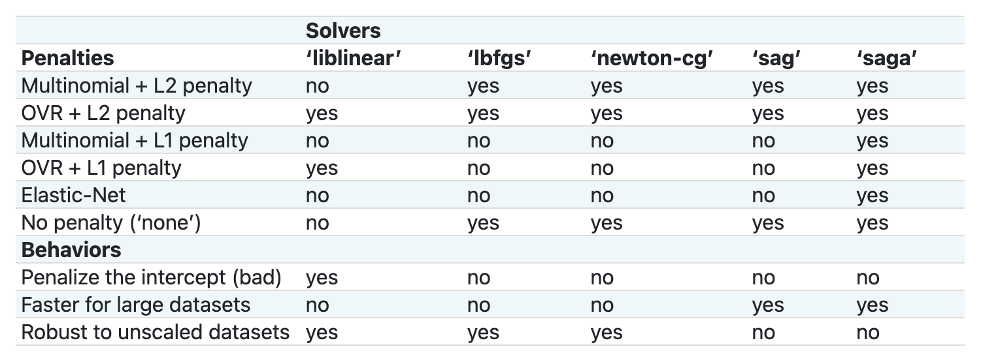

<!--
CO_OP_TRANSLATOR_METADATA:
{
  "original_hash": "9579f42e3ff5114c58379cc9e186a828",
  "translation_date": "2025-08-29T21:42:47+00:00",
  "source_file": "4-Classification/2-Classifiers-1/README.md",
  "language_code": "br"
}
-->
# Classificadores de culinária 1

Nesta lição, você usará o conjunto de dados que salvou na última lição, cheio de dados equilibrados e limpos sobre culinárias.

Você usará este conjunto de dados com uma variedade de classificadores para _prever uma culinária nacional com base em um grupo de ingredientes_. Enquanto faz isso, aprenderá mais sobre algumas das maneiras pelas quais os algoritmos podem ser utilizados para tarefas de classificação.

## [Quiz pré-aula](https://gray-sand-07a10f403.1.azurestaticapps.net/quiz/21/)
# Preparação

Assumindo que você completou [Lição 1](../1-Introduction/README.md), certifique-se de que um arquivo _cleaned_cuisines.csv_ exista na pasta raiz `/data` para estas quatro lições.

## Exercício - prever uma culinária nacional

1. Trabalhando na pasta _notebook.ipynb_ desta lição, importe esse arquivo junto com a biblioteca Pandas:

    ```python
    import pandas as pd
    cuisines_df = pd.read_csv("../data/cleaned_cuisines.csv")
    cuisines_df.head()
    ```

    Os dados se parecem com isto:

|     | Unnamed: 0 | cuisine | almond | angelica | anise | anise_seed | apple | apple_brandy | apricot | armagnac | ... | whiskey | white_bread | white_wine | whole_grain_wheat_flour | wine | wood | yam | yeast | yogurt | zucchini |
| --- | ---------- | ------- | ------ | -------- | ----- | ---------- | ----- | ------------ | ------- | -------- | --- | ------- | ----------- | ---------- | ----------------------- | ---- | ---- | --- | ----- | ------ | -------- |
| 0   | 0          | indian  | 0      | 0        | 0     | 0          | 0     | 0            | 0       | 0        | ... | 0       | 0           | 0          | 0                       | 0    | 0    | 0   | 0     | 0      | 0        |
| 1   | 1          | indian  | 1      | 0        | 0     | 0          | 0     | 0            | 0       | 0        | ... | 0       | 0           | 0          | 0                       | 0    | 0    | 0   | 0     | 0      | 0        |
| 2   | 2          | indian  | 0      | 0        | 0     | 0          | 0     | 0            | 0       | 0        | ... | 0       | 0           | 0          | 0                       | 0    | 0    | 0   | 0     | 0      | 0        |
| 3   | 3          | indian  | 0      | 0        | 0     | 0          | 0     | 0            | 0       | 0        | ... | 0       | 0           | 0          | 0                       | 0    | 0    | 0   | 0     | 0      | 0        |
| 4   | 4          | indian  | 0      | 0        | 0     | 0          | 0     | 0            | 0       | 0        | ... | 0       | 0           | 0          | 0                       | 0    | 0    | 0   | 0     | 1      | 0        |
  

1. Agora, importe mais algumas bibliotecas:

    ```python
    from sklearn.linear_model import LogisticRegression
    from sklearn.model_selection import train_test_split, cross_val_score
    from sklearn.metrics import accuracy_score,precision_score,confusion_matrix,classification_report, precision_recall_curve
    from sklearn.svm import SVC
    import numpy as np
    ```

1. Divida as coordenadas X e y em dois dataframes para treinamento. `cuisine` pode ser o dataframe de rótulos:

    ```python
    cuisines_label_df = cuisines_df['cuisine']
    cuisines_label_df.head()
    ```

    Ele se parecerá com isto:

    ```output
    0    indian
    1    indian
    2    indian
    3    indian
    4    indian
    Name: cuisine, dtype: object
    ```

1. Remova a coluna `Unnamed: 0` e a coluna `cuisine`, chamando `drop()`. Salve o restante dos dados como características treináveis:

    ```python
    cuisines_feature_df = cuisines_df.drop(['Unnamed: 0', 'cuisine'], axis=1)
    cuisines_feature_df.head()
    ```

    Suas características se parecem com isto:

|      | almond | angelica | anise | anise_seed | apple | apple_brandy | apricot | armagnac | artemisia | artichoke |  ... | whiskey | white_bread | white_wine | whole_grain_wheat_flour | wine | wood |  yam | yeast | yogurt | zucchini |
| ---: | -----: | -------: | ----: | ---------: | ----: | -----------: | ------: | -------: | --------: | --------: | ---: | ------: | ----------: | ---------: | ----------------------: | ---: | ---: | ---: | ----: | -----: | -------: |
|    0 |      0 |        0 |     0 |          0 |     0 |            0 |       0 |        0 |         0 |         0 |  ... |       0 |           0 |          0 |                       0 |    0 |    0 |    0 |     0 |      0 |        0 | 0 |
|    1 |      1 |        0 |     0 |          0 |     0 |            0 |       0 |        0 |         0 |         0 |  ... |       0 |           0 |          0 |                       0 |    0 |    0 |    0 |     0 |      0 |        0 | 0 |
|    2 |      0 |        0 |     0 |          0 |     0 |            0 |       0 |        0 |         0 |         0 |  ... |       0 |           0 |          0 |                       0 |    0 |    0 |    0 |     0 |      0 |        0 | 0 |
|    3 |      0 |        0 |     0 |          0 |     0 |            0 |       0 |        0 |         0 |         0 |  ... |       0 |           0 |          0 |                       0 |    0 |    0 |    0 |     0 |      0 |        0 | 0 |
|    4 |      0 |        0 |     0 |          0 |     0 |            0 |       0 |        0 |         0 |         0 |  ... |       0 |           0 |          0 |                       0 |    0 |    0 |    0 |     0 |      1 |        0 | 0 |

Agora você está pronto para treinar seu modelo!

## Escolhendo seu classificador

Agora que seus dados estão limpos e prontos para treinamento, você precisa decidir qual algoritmo usar para a tarefa.

O Scikit-learn agrupa classificação sob Aprendizado Supervisionado, e nessa categoria você encontrará muitas maneiras de classificar. [A variedade](https://scikit-learn.org/stable/supervised_learning.html) pode parecer bastante confusa à primeira vista. Os seguintes métodos incluem técnicas de classificação:

- Modelos Lineares
- Máquinas de Vetores de Suporte
- Descida de Gradiente Estocástica
- Vizinhos Mais Próximos
- Processos Gaussianos
- Árvores de Decisão
- Métodos de Conjunto (voting Classifier)
- Algoritmos multiclasses e multi-saída (classificação multiclasses e multilabel, classificação multiclasses-multioutput)

> Você também pode usar [redes neurais para classificar dados](https://scikit-learn.org/stable/modules/neural_networks_supervised.html#classification), mas isso está fora do escopo desta lição.

### Qual classificador escolher?

Então, qual classificador você deve escolher? Muitas vezes, testar vários e procurar um bom resultado é uma maneira de experimentar. O Scikit-learn oferece uma [comparação lado a lado](https://scikit-learn.org/stable/auto_examples/classification/plot_classifier_comparison.html) em um conjunto de dados criado, comparando KNeighbors, SVC de duas maneiras, GaussianProcessClassifier, DecisionTreeClassifier, RandomForestClassifier, MLPClassifier, AdaBoostClassifier, GaussianNB e QuadraticDiscrinationAnalysis, mostrando os resultados visualizados:


> Gráficos gerados na documentação do Scikit-learn

> O AutoML resolve esse problema de forma prática ao executar essas comparações na nuvem, permitindo que você escolha o melhor algoritmo para seus dados. Experimente [aqui](https://docs.microsoft.com/learn/modules/automate-model-selection-with-azure-automl/?WT.mc_id=academic-77952-leestott)

### Uma abordagem melhor

Uma maneira melhor do que adivinhar aleatoriamente, no entanto, é seguir as ideias deste [guia de referência de ML](https://docs.microsoft.com/azure/machine-learning/algorithm-cheat-sheet?WT.mc_id=academic-77952-leestott) para download. Aqui, descobrimos que, para nosso problema multiclasses, temos algumas opções:


> Uma seção do Guia de Algoritmos da Microsoft, detalhando opções de classificação multiclasses

✅ Baixe este guia, imprima e pendure na sua parede!

### Raciocínio

Vamos ver se conseguimos raciocinar sobre diferentes abordagens, dadas as restrições que temos:

- **Redes neurais são muito pesadas**. Dado nosso conjunto de dados limpo, mas minimalista, e o fato de que estamos executando o treinamento localmente via notebooks, redes neurais são muito pesadas para esta tarefa.
- **Nenhum classificador de duas classes**. Não usamos um classificador de duas classes, então isso exclui o one-vs-all.
- **Árvore de decisão ou regressão logística podem funcionar**. Uma árvore de decisão pode funcionar, ou regressão logística para dados multiclasses.
- **Árvores de decisão impulsionadas multiclasses resolvem outro problema**. A árvore de decisão impulsionada multiclasses é mais adequada para tarefas não paramétricas, por exemplo, tarefas projetadas para construir rankings, então não é útil para nós.

### Usando Scikit-learn 

Usaremos o Scikit-learn para analisar nossos dados. No entanto, existem muitas maneiras de usar regressão logística no Scikit-learn. Veja os [parâmetros para passar](https://scikit-learn.org/stable/modules/generated/sklearn.linear_model.LogisticRegression.html?highlight=logistic%20regressio#sklearn.linear_model.LogisticRegression).  

Essencialmente, há dois parâmetros importantes - `multi_class` e `solver` - que precisamos especificar ao pedir ao Scikit-learn para realizar uma regressão logística. O valor de `multi_class` aplica um certo comportamento. O valor do solver é o algoritmo a ser usado. Nem todos os solvers podem ser combinados com todos os valores de `multi_class`.

De acordo com a documentação, no caso multiclasses, o algoritmo de treinamento:

- **Usa o esquema one-vs-rest (OvR)**, se a opção `multi_class` estiver configurada como `ovr`
- **Usa a perda de entropia cruzada**, se a opção `multi_class` estiver configurada como `multinomial`. (Atualmente, a opção `multinomial` é suportada apenas pelos solvers ‘lbfgs’, ‘sag’, ‘saga’ e ‘newton-cg’.)

> 🎓 O 'esquema' aqui pode ser 'ovr' (one-vs-rest) ou 'multinomial'. Como a regressão logística foi projetada para suportar classificação binária, esses esquemas permitem que ela lide melhor com tarefas de classificação multiclasses. [fonte](https://machinelearningmastery.com/one-vs-rest-and-one-vs-one-for-multi-class-classification/)

> 🎓 O 'solver' é definido como "o algoritmo a ser usado no problema de otimização". [fonte](https://scikit-learn.org/stable/modules/generated/sklearn.linear_model.LogisticRegression.html?highlight=logistic%20regressio#sklearn.linear_model.LogisticRegression).

O Scikit-learn oferece esta tabela para explicar como os solvers lidam com diferentes desafios apresentados por diferentes tipos de estruturas de dados:



## Exercício - dividir os dados

Podemos focar na regressão logística para nosso primeiro teste de treinamento, já que você aprendeu sobre ela recentemente em uma lição anterior.
Divida seus dados em grupos de treinamento e teste chamando `train_test_split()`:

```python
X_train, X_test, y_train, y_test = train_test_split(cuisines_feature_df, cuisines_label_df, test_size=0.3)
```

## Exercício - aplicar regressão logística

Como você está usando o caso multiclasses, precisa escolher qual _esquema_ usar e qual _solver_ configurar. Use LogisticRegression com uma configuração multiclasses e o solver **liblinear** para treinar.

1. Crie uma regressão logística com multi_class configurado como `ovr` e o solver configurado como `liblinear`:

    ```python
    lr = LogisticRegression(multi_class='ovr',solver='liblinear')
    model = lr.fit(X_train, np.ravel(y_train))
    
    accuracy = model.score(X_test, y_test)
    print ("Accuracy is {}".format(accuracy))
    ```

    ✅ Experimente um solver diferente, como `lbfgs`, que frequentemente é configurado como padrão
> Nota, use a função Pandas [`ravel`](https://pandas.pydata.org/pandas-docs/stable/reference/api/pandas.Series.ravel.html) para achatar seus dados quando necessário.
A precisão é boa em mais de **80%**!

1. Você pode ver este modelo em ação testando uma linha de dados (#50):

    ```python
    print(f'ingredients: {X_test.iloc[50][X_test.iloc[50]!=0].keys()}')
    print(f'cuisine: {y_test.iloc[50]}')
    ```

    O resultado é exibido:

   ```output
   ingredients: Index(['cilantro', 'onion', 'pea', 'potato', 'tomato', 'vegetable_oil'], dtype='object')
   cuisine: indian
   ```

   ✅ Experimente um número de linha diferente e verifique os resultados.

1. Indo mais a fundo, você pode verificar a precisão desta previsão:

    ```python
    test= X_test.iloc[50].values.reshape(-1, 1).T
    proba = model.predict_proba(test)
    classes = model.classes_
    resultdf = pd.DataFrame(data=proba, columns=classes)
    
    topPrediction = resultdf.T.sort_values(by=[0], ascending = [False])
    topPrediction.head()
    ```

    O resultado é exibido - culinária indiana é sua melhor aposta, com boa probabilidade:

    |          |        0 |
    | -------: | -------: |
    |   indian | 0.715851 |
    |  chinese | 0.229475 |
    | japanese | 0.029763 |
    |   korean | 0.017277 |
    |     thai | 0.007634 |

    ✅ Você consegue explicar por que o modelo tem tanta certeza de que se trata de uma culinária indiana?

1. Obtenha mais detalhes imprimindo um relatório de classificação, como você fez nas lições de regressão:

    ```python
    y_pred = model.predict(X_test)
    print(classification_report(y_test,y_pred))
    ```

    |              | precisão | recall | f1-score | suporte |
    | ------------ | -------- | ------ | -------- | ------- |
    | chinese      | 0.73     | 0.71   | 0.72     | 229     |
    | indian       | 0.91     | 0.93   | 0.92     | 254     |
    | japanese     | 0.70     | 0.75   | 0.72     | 220     |
    | korean       | 0.86     | 0.76   | 0.81     | 242     |
    | thai         | 0.79     | 0.85   | 0.82     | 254     |
    | accuracy     | 0.80     | 1199   |          |         |
    | macro avg    | 0.80     | 0.80   | 0.80     | 1199    |
    | weighted avg | 0.80     | 0.80   | 0.80     | 1199    |

## 🚀Desafio

Nesta lição, você usou seus dados limpos para construir um modelo de aprendizado de máquina que pode prever uma culinária nacional com base em uma série de ingredientes. Reserve um tempo para explorar as muitas opções que o Scikit-learn oferece para classificar dados. Aprofunde-se no conceito de 'solver' para entender o que acontece nos bastidores.

## [Quiz pós-aula](https://gray-sand-07a10f403.1.azurestaticapps.net/quiz/22/)

## Revisão & Autoestudo

Explore um pouco mais a matemática por trás da regressão logística nesta [lição](https://people.eecs.berkeley.edu/~russell/classes/cs194/f11/lectures/CS194%20Fall%202011%20Lecture%2006.pdf).
## Tarefa 

[Estude os solvers](assignment.md)

---

**Aviso Legal**:  
Este documento foi traduzido utilizando o serviço de tradução por IA [Co-op Translator](https://github.com/Azure/co-op-translator). Embora nos esforcemos para garantir a precisão, esteja ciente de que traduções automáticas podem conter erros ou imprecisões. O documento original em seu idioma nativo deve ser considerado a fonte oficial. Para informações críticas, recomenda-se a tradução profissional realizada por humanos. Não nos responsabilizamos por quaisquer mal-entendidos ou interpretações equivocadas decorrentes do uso desta tradução.