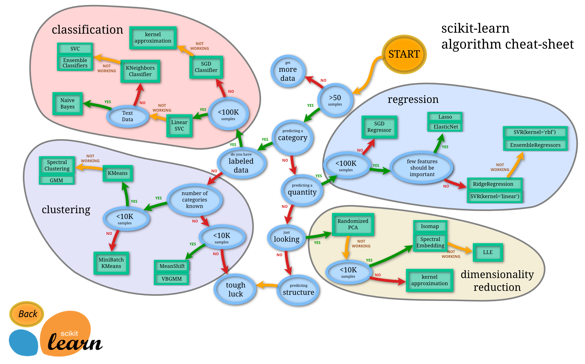

<!--
CO_OP_TRANSLATOR_METADATA:
{
  "original_hash": "808a71076f76ae8f5458862a8edd9215",
  "translation_date": "2025-08-29T21:49:23+00:00",
  "source_file": "4-Classification/3-Classifiers-2/README.md",
  "language_code": "br"
}
-->
# Classificadores de Culinária 2

Nesta segunda lição de classificação, você explorará mais maneiras de classificar dados numéricos. Você também aprenderá sobre as implicações de escolher um classificador em vez de outro.

## [Questionário pré-aula](https://gray-sand-07a10f403.1.azurestaticapps.net/quiz/23/)

### Pré-requisito

Assumimos que você completou as lições anteriores e possui um conjunto de dados limpo na sua pasta `data`, chamado _cleaned_cuisines.csv_, na raiz desta pasta de 4 lições.

### Preparação

Carregamos seu arquivo _notebook.ipynb_ com o conjunto de dados limpo e o dividimos em dataframes X e y, prontos para o processo de construção do modelo.

## Um mapa de classificação

Anteriormente, você aprendeu sobre as várias opções disponíveis para classificar dados usando o guia da Microsoft. O Scikit-learn oferece um guia semelhante, mas mais detalhado, que pode ajudar ainda mais a restringir seus estimadores (outro termo para classificadores):


> Dica: [visite este mapa online](https://scikit-learn.org/stable/tutorial/machine_learning_map/) e clique ao longo do caminho para ler a documentação.

### O plano

Este mapa é muito útil quando você tem uma compreensão clara dos seus dados, pois você pode 'caminhar' pelos caminhos até uma decisão:

- Temos >50 amostras
- Queremos prever uma categoria
- Temos dados rotulados
- Temos menos de 100 mil amostras
- ✨ Podemos escolher um Linear SVC
- Se isso não funcionar, já que temos dados numéricos
    - Podemos tentar um ✨ KNeighbors Classifier 
      - Se isso não funcionar, tentar ✨ SVC e ✨ Ensemble Classifiers

Este é um caminho muito útil a seguir.

## Exercício - dividir os dados

Seguindo este caminho, devemos começar importando algumas bibliotecas para usar.

1. Importe as bibliotecas necessárias:

    ```python
    from sklearn.neighbors import KNeighborsClassifier
    from sklearn.linear_model import LogisticRegression
    from sklearn.svm import SVC
    from sklearn.ensemble import RandomForestClassifier, AdaBoostClassifier
    from sklearn.model_selection import train_test_split, cross_val_score
    from sklearn.metrics import accuracy_score,precision_score,confusion_matrix,classification_report, precision_recall_curve
    import numpy as np
    ```

1. Divida seus dados de treinamento e teste:

    ```python
    X_train, X_test, y_train, y_test = train_test_split(cuisines_feature_df, cuisines_label_df, test_size=0.3)
    ```

## Classificador Linear SVC

O Support-Vector Clustering (SVC) é um membro da família de técnicas de ML chamadas Support-Vector Machines. Neste método, você pode escolher um 'kernel' para decidir como agrupar os rótulos. O parâmetro 'C' refere-se à 'regularização', que regula a influência dos parâmetros. O kernel pode ser um dos [vários](https://scikit-learn.org/stable/modules/generated/sklearn.svm.SVC.html#sklearn.svm.SVC); aqui o definimos como 'linear' para garantir que utilizamos o Linear SVC. A probabilidade, por padrão, é 'false'; aqui a definimos como 'true' para obter estimativas de probabilidade. Definimos o estado aleatório como '0' para embaralhar os dados e obter probabilidades.

### Exercício - aplicar um Linear SVC

Comece criando um array de classificadores. Você adicionará progressivamente a este array à medida que testamos.

1. Comece com um Linear SVC:

    ```python
    C = 10
    # Create different classifiers.
    classifiers = {
        'Linear SVC': SVC(kernel='linear', C=C, probability=True,random_state=0)
    }
    ```

2. Treine seu modelo usando o Linear SVC e imprima um relatório:

    ```python
    n_classifiers = len(classifiers)
    
    for index, (name, classifier) in enumerate(classifiers.items()):
        classifier.fit(X_train, np.ravel(y_train))
    
        y_pred = classifier.predict(X_test)
        accuracy = accuracy_score(y_test, y_pred)
        print("Accuracy (train) for %s: %0.1f%% " % (name, accuracy * 100))
        print(classification_report(y_test,y_pred))
    ```

    O resultado é muito bom:

    ```output
    Accuracy (train) for Linear SVC: 78.6% 
                  precision    recall  f1-score   support
    
         chinese       0.71      0.67      0.69       242
          indian       0.88      0.86      0.87       234
        japanese       0.79      0.74      0.76       254
          korean       0.85      0.81      0.83       242
            thai       0.71      0.86      0.78       227
    
        accuracy                           0.79      1199
       macro avg       0.79      0.79      0.79      1199
    weighted avg       0.79      0.79      0.79      1199
    ```

## Classificador K-Neighbors

O K-Neighbors faz parte da família de métodos de ML "neighbors", que podem ser usados tanto para aprendizado supervisionado quanto não supervisionado. Neste método, um número predefinido de pontos é criado e os dados são agrupados em torno desses pontos, de forma que rótulos generalizados possam ser previstos para os dados.

### Exercício - aplicar o classificador K-Neighbors

O classificador anterior foi bom e funcionou bem com os dados, mas talvez possamos obter uma melhor precisão. Tente um classificador K-Neighbors.

1. Adicione uma linha ao seu array de classificadores (adicione uma vírgula após o item Linear SVC):

    ```python
    'KNN classifier': KNeighborsClassifier(C),
    ```

    O resultado é um pouco pior:

    ```output
    Accuracy (train) for KNN classifier: 73.8% 
                  precision    recall  f1-score   support
    
         chinese       0.64      0.67      0.66       242
          indian       0.86      0.78      0.82       234
        japanese       0.66      0.83      0.74       254
          korean       0.94      0.58      0.72       242
            thai       0.71      0.82      0.76       227
    
        accuracy                           0.74      1199
       macro avg       0.76      0.74      0.74      1199
    weighted avg       0.76      0.74      0.74      1199
    ```

    ✅ Saiba mais sobre [K-Neighbors](https://scikit-learn.org/stable/modules/neighbors.html#neighbors)

## Classificador Support Vector

Os classificadores Support-Vector fazem parte da família de métodos de ML [Support-Vector Machine](https://wikipedia.org/wiki/Support-vector_machine), usados para tarefas de classificação e regressão. Os SVMs "mapeiam exemplos de treinamento para pontos no espaço" para maximizar a distância entre duas categorias. Dados subsequentes são mapeados neste espaço para que sua categoria possa ser prevista.

### Exercício - aplicar um classificador Support Vector

Vamos tentar obter uma precisão um pouco melhor com um classificador Support Vector.

1. Adicione uma vírgula após o item K-Neighbors e, em seguida, adicione esta linha:

    ```python
    'SVC': SVC(),
    ```

    O resultado é muito bom!

    ```output
    Accuracy (train) for SVC: 83.2% 
                  precision    recall  f1-score   support
    
         chinese       0.79      0.74      0.76       242
          indian       0.88      0.90      0.89       234
        japanese       0.87      0.81      0.84       254
          korean       0.91      0.82      0.86       242
            thai       0.74      0.90      0.81       227
    
        accuracy                           0.83      1199
       macro avg       0.84      0.83      0.83      1199
    weighted avg       0.84      0.83      0.83      1199
    ```

    ✅ Saiba mais sobre [Support-Vectors](https://scikit-learn.org/stable/modules/svm.html#svm)

## Classificadores Ensemble

Vamos seguir o caminho até o final, mesmo que o teste anterior tenha sido muito bom. Vamos tentar alguns 'Classificadores Ensemble', especificamente Random Forest e AdaBoost:

```python
  'RFST': RandomForestClassifier(n_estimators=100),
  'ADA': AdaBoostClassifier(n_estimators=100)
```

O resultado é muito bom, especialmente para Random Forest:

```output
Accuracy (train) for RFST: 84.5% 
              precision    recall  f1-score   support

     chinese       0.80      0.77      0.78       242
      indian       0.89      0.92      0.90       234
    japanese       0.86      0.84      0.85       254
      korean       0.88      0.83      0.85       242
        thai       0.80      0.87      0.83       227

    accuracy                           0.84      1199
   macro avg       0.85      0.85      0.84      1199
weighted avg       0.85      0.84      0.84      1199

Accuracy (train) for ADA: 72.4% 
              precision    recall  f1-score   support

     chinese       0.64      0.49      0.56       242
      indian       0.91      0.83      0.87       234
    japanese       0.68      0.69      0.69       254
      korean       0.73      0.79      0.76       242
        thai       0.67      0.83      0.74       227

    accuracy                           0.72      1199
   macro avg       0.73      0.73      0.72      1199
weighted avg       0.73      0.72      0.72      1199
```

✅ Saiba mais sobre [Classificadores Ensemble](https://scikit-learn.org/stable/modules/ensemble.html)

Este método de aprendizado de máquina "combina as previsões de vários estimadores base" para melhorar a qualidade do modelo. Em nosso exemplo, usamos Random Trees e AdaBoost.

- [Random Forest](https://scikit-learn.org/stable/modules/ensemble.html#forest), um método de média, constrói uma 'floresta' de 'árvores de decisão' com infusão de aleatoriedade para evitar overfitting. O parâmetro n_estimators é definido como o número de árvores.

- [AdaBoost](https://scikit-learn.org/stable/modules/generated/sklearn.ensemble.AdaBoostClassifier.html) ajusta um classificador a um conjunto de dados e, em seguida, ajusta cópias desse classificador ao mesmo conjunto de dados. Ele foca nos pesos dos itens classificados incorretamente e ajusta o ajuste para o próximo classificador corrigir.

---

## 🚀Desafio

Cada uma dessas técnicas possui um grande número de parâmetros que você pode ajustar. Pesquise os parâmetros padrão de cada uma e pense no que ajustar esses parâmetros significaria para a qualidade do modelo.

## [Questionário pós-aula](https://gray-sand-07a10f403.1.azurestaticapps.net/quiz/24/)

## Revisão e Autoestudo

Há muitos termos técnicos nessas lições, então reserve um momento para revisar [esta lista](https://docs.microsoft.com/dotnet/machine-learning/resources/glossary?WT.mc_id=academic-77952-leestott) de terminologia útil!

## Tarefa 

[Brincando com parâmetros](assignment.md)

---

**Aviso Legal**:  
Este documento foi traduzido utilizando o serviço de tradução por IA [Co-op Translator](https://github.com/Azure/co-op-translator). Embora nos esforcemos para garantir a precisão, esteja ciente de que traduções automatizadas podem conter erros ou imprecisões. O documento original em seu idioma nativo deve ser considerado a fonte autoritativa. Para informações críticas, recomenda-se a tradução profissional realizada por humanos. Não nos responsabilizamos por quaisquer mal-entendidos ou interpretações equivocadas decorrentes do uso desta tradução.