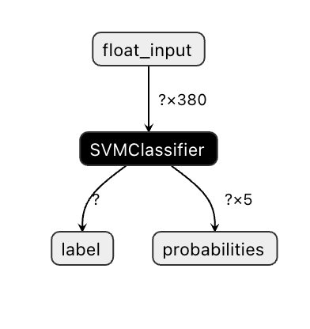
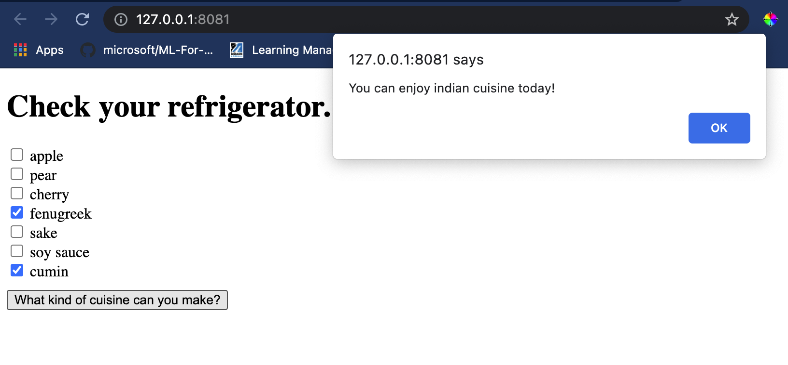

<!--
CO_OP_TRANSLATOR_METADATA:
{
  "original_hash": "ad2cf19d7490247558d20a6a59650d13",
  "translation_date": "2025-08-29T21:46:40+00:00",
  "source_file": "4-Classification/4-Applied/README.md",
  "language_code": "br"
}
-->
# Construir um Aplicativo Web de Recomendação de Culinária

Nesta lição, você irá construir um modelo de classificação utilizando algumas das técnicas aprendidas em lições anteriores e com o delicioso conjunto de dados de culinária usado ao longo desta série. Além disso, você criará um pequeno aplicativo web para usar um modelo salvo, aproveitando o runtime web do Onnx.

Uma das aplicações práticas mais úteis do aprendizado de máquina é a construção de sistemas de recomendação, e você pode dar o primeiro passo nessa direção hoje!

[](https://youtu.be/17wdM9AHMfg "ML Aplicado")

> 🎥 Clique na imagem acima para assistir ao vídeo: Jen Looper constrói um aplicativo web usando dados classificados de culinária

## [Quiz pré-aula](https://gray-sand-07a10f403.1.azurestaticapps.net/quiz/25/)

Nesta lição, você aprenderá:

- Como construir um modelo e salvá-lo no formato Onnx
- Como usar o Netron para inspecionar o modelo
- Como usar seu modelo em um aplicativo web para inferência

## Construa seu modelo

Construir sistemas de aprendizado de máquina aplicados é uma parte importante para aproveitar essas tecnologias em seus sistemas de negócios. Você pode usar modelos dentro de seus aplicativos web (e, assim, utilizá-los em um contexto offline, se necessário) usando o Onnx.

Em uma [lição anterior](../../3-Web-App/1-Web-App/README.md), você construiu um modelo de regressão sobre avistamentos de OVNIs, o "pickleou" e o utilizou em um aplicativo Flask. Embora essa arquitetura seja muito útil, trata-se de um aplicativo Python full-stack, e seus requisitos podem incluir o uso de uma aplicação JavaScript.

Nesta lição, você pode construir um sistema básico baseado em JavaScript para inferência. Primeiro, no entanto, você precisa treinar um modelo e convertê-lo para uso com o Onnx.

## Exercício - treinar modelo de classificação

Primeiro, treine um modelo de classificação usando o conjunto de dados de culinária limpo que utilizamos.

1. Comece importando bibliotecas úteis:

    ```python
    !pip install skl2onnx
    import pandas as pd 
    ```

    Você precisará de '[skl2onnx](https://onnx.ai/sklearn-onnx/)' para ajudar a converter seu modelo Scikit-learn para o formato Onnx.

1. Em seguida, trabalhe com seus dados da mesma forma que fez em lições anteriores, lendo um arquivo CSV usando `read_csv()`:

    ```python
    data = pd.read_csv('../data/cleaned_cuisines.csv')
    data.head()
    ```

1. Remova as duas primeiras colunas desnecessárias e salve os dados restantes como 'X':

    ```python
    X = data.iloc[:,2:]
    X.head()
    ```

1. Salve os rótulos como 'y':

    ```python
    y = data[['cuisine']]
    y.head()
    
    ```

### Inicie a rotina de treinamento

Usaremos a biblioteca 'SVC', que apresenta boa precisão.

1. Importe as bibliotecas apropriadas do Scikit-learn:

    ```python
    from sklearn.model_selection import train_test_split
    from sklearn.svm import SVC
    from sklearn.model_selection import cross_val_score
    from sklearn.metrics import accuracy_score,precision_score,confusion_matrix,classification_report
    ```

1. Separe os conjuntos de treinamento e teste:

    ```python
    X_train, X_test, y_train, y_test = train_test_split(X,y,test_size=0.3)
    ```

1. Construa um modelo de classificação SVC como fez na lição anterior:

    ```python
    model = SVC(kernel='linear', C=10, probability=True,random_state=0)
    model.fit(X_train,y_train.values.ravel())
    ```

1. Agora, teste seu modelo chamando `predict()`:

    ```python
    y_pred = model.predict(X_test)
    ```

1. Imprima um relatório de classificação para verificar a qualidade do modelo:

    ```python
    print(classification_report(y_test,y_pred))
    ```

    Como vimos antes, a precisão é boa:

    ```output
                    precision    recall  f1-score   support
    
         chinese       0.72      0.69      0.70       257
          indian       0.91      0.87      0.89       243
        japanese       0.79      0.77      0.78       239
          korean       0.83      0.79      0.81       236
            thai       0.72      0.84      0.78       224
    
        accuracy                           0.79      1199
       macro avg       0.79      0.79      0.79      1199
    weighted avg       0.79      0.79      0.79      1199
    ```

### Converta seu modelo para Onnx

Certifique-se de fazer a conversão com o número correto de tensores. Este conjunto de dados possui 380 ingredientes listados, então você precisa anotar esse número em `FloatTensorType`:

1. Converta usando um número de tensor de 380.

    ```python
    from skl2onnx import convert_sklearn
    from skl2onnx.common.data_types import FloatTensorType
    
    initial_type = [('float_input', FloatTensorType([None, 380]))]
    options = {id(model): {'nocl': True, 'zipmap': False}}
    ```

1. Crie o arquivo onx e salve como **model.onnx**:

    ```python
    onx = convert_sklearn(model, initial_types=initial_type, options=options)
    with open("./model.onnx", "wb") as f:
        f.write(onx.SerializeToString())
    ```

    > Nota: você pode passar [opções](https://onnx.ai/sklearn-onnx/parameterized.html) no seu script de conversão. Neste caso, passamos 'nocl' como True e 'zipmap' como False. Como este é um modelo de classificação, você tem a opção de remover o ZipMap, que produz uma lista de dicionários (não necessária). `nocl` refere-se à inclusão de informações de classe no modelo. Reduza o tamanho do seu modelo definindo `nocl` como 'True'.

Executar o notebook inteiro agora criará um modelo Onnx e o salvará nesta pasta.

## Visualize seu modelo

Modelos Onnx não são muito visíveis no Visual Studio Code, mas há um software gratuito muito bom que muitos pesquisadores usam para visualizar o modelo e garantir que ele foi construído corretamente. Baixe o [Netron](https://github.com/lutzroeder/Netron) e abra seu arquivo model.onnx. Você poderá visualizar seu modelo simples, com seus 380 inputs e o classificador listado:



O Netron é uma ferramenta útil para visualizar seus modelos.

Agora você está pronto para usar este modelo interessante em um aplicativo web. Vamos construir um aplicativo que será útil quando você olhar para sua geladeira e tentar descobrir quais combinações de ingredientes restantes podem ser usadas para cozinhar um prato específico, conforme determinado pelo seu modelo.

## Construa um aplicativo web de recomendação

Você pode usar seu modelo diretamente em um aplicativo web. Essa arquitetura também permite que você o execute localmente e até mesmo offline, se necessário. Comece criando um arquivo `index.html` na mesma pasta onde você armazenou seu arquivo `model.onnx`.

1. Neste arquivo _index.html_, adicione a seguinte marcação:

    ```html
    <!DOCTYPE html>
    <html>
        <header>
            <title>Cuisine Matcher</title>
        </header>
        <body>
            ...
        </body>
    </html>
    ```

1. Agora, dentro das tags `body`, adicione uma pequena marcação para exibir uma lista de caixas de seleção refletindo alguns ingredientes:

    ```html
    <h1>Check your refrigerator. What can you create?</h1>
            <div id="wrapper">
                <div class="boxCont">
                    <input type="checkbox" value="4" class="checkbox">
                    <label>apple</label>
                </div>
            
                <div class="boxCont">
                    <input type="checkbox" value="247" class="checkbox">
                    <label>pear</label>
                </div>
            
                <div class="boxCont">
                    <input type="checkbox" value="77" class="checkbox">
                    <label>cherry</label>
                </div>
    
                <div class="boxCont">
                    <input type="checkbox" value="126" class="checkbox">
                    <label>fenugreek</label>
                </div>
    
                <div class="boxCont">
                    <input type="checkbox" value="302" class="checkbox">
                    <label>sake</label>
                </div>
    
                <div class="boxCont">
                    <input type="checkbox" value="327" class="checkbox">
                    <label>soy sauce</label>
                </div>
    
                <div class="boxCont">
                    <input type="checkbox" value="112" class="checkbox">
                    <label>cumin</label>
                </div>
            </div>
            <div style="padding-top:10px">
                <button onClick="startInference()">What kind of cuisine can you make?</button>
            </div> 
    ```

    Observe que cada caixa de seleção recebe um valor. Isso reflete o índice onde o ingrediente é encontrado de acordo com o conjunto de dados. A maçã, por exemplo, nesta lista alfabética, ocupa a quinta coluna, então seu valor é '4', já que começamos a contar a partir de 0. Você pode consultar a [planilha de ingredientes](../../../../4-Classification/data/ingredient_indexes.csv) para descobrir o índice de um determinado ingrediente.

    Continuando seu trabalho no arquivo index.html, adicione um bloco de script onde o modelo é chamado após o fechamento final de `</div>`.

1. Primeiro, importe o [Onnx Runtime](https://www.onnxruntime.ai/):

    ```html
    <script src="https://cdn.jsdelivr.net/npm/onnxruntime-web@1.9.0/dist/ort.min.js"></script> 
    ```

    > O Onnx Runtime é usado para permitir a execução de seus modelos Onnx em uma ampla gama de plataformas de hardware, incluindo otimizações e uma API para uso.

1. Uma vez que o Runtime esteja no lugar, você pode chamá-lo:

    ```html
    <script>
        const ingredients = Array(380).fill(0);
        
        const checks = [...document.querySelectorAll('.checkbox')];
        
        checks.forEach(check => {
            check.addEventListener('change', function() {
                // toggle the state of the ingredient
                // based on the checkbox's value (1 or 0)
                ingredients[check.value] = check.checked ? 1 : 0;
            });
        });

        function testCheckboxes() {
            // validate if at least one checkbox is checked
            return checks.some(check => check.checked);
        }

        async function startInference() {

            let atLeastOneChecked = testCheckboxes()

            if (!atLeastOneChecked) {
                alert('Please select at least one ingredient.');
                return;
            }
            try {
                // create a new session and load the model.
                
                const session = await ort.InferenceSession.create('./model.onnx');

                const input = new ort.Tensor(new Float32Array(ingredients), [1, 380]);
                const feeds = { float_input: input };

                // feed inputs and run
                const results = await session.run(feeds);

                // read from results
                alert('You can enjoy ' + results.label.data[0] + ' cuisine today!')

            } catch (e) {
                console.log(`failed to inference ONNX model`);
                console.error(e);
            }
        }
               
    </script>
    ```

Neste código, várias coisas estão acontecendo:

1. Você criou um array de 380 valores possíveis (1 ou 0) para serem definidos e enviados ao modelo para inferência, dependendo de quais caixas de seleção de ingredientes estão marcadas.
2. Você criou um array de caixas de seleção e uma maneira de determinar se elas foram marcadas em uma função `init` que é chamada quando o aplicativo é iniciado. Quando uma caixa de seleção é marcada, o array `ingredients` é alterado para refletir o ingrediente escolhido.
3. Você criou uma função `testCheckboxes` que verifica se alguma caixa de seleção foi marcada.
4. Você usa a função `startInference` quando o botão é pressionado e, se alguma caixa de seleção estiver marcada, inicia a inferência.
5. A rotina de inferência inclui:
   1. Configurar um carregamento assíncrono do modelo
   2. Criar uma estrutura Tensor para enviar ao modelo
   3. Criar 'feeds' que refletem o input `float_input` que você criou ao treinar seu modelo (você pode usar o Netron para verificar esse nome)
   4. Enviar esses 'feeds' ao modelo e aguardar uma resposta

## Teste seu aplicativo

Abra uma sessão de terminal no Visual Studio Code na pasta onde seu arquivo index.html está localizado. Certifique-se de ter o [http-server](https://www.npmjs.com/package/http-server) instalado globalmente e digite `http-server` no prompt. Um localhost será aberto e você poderá visualizar seu aplicativo web. Verifique qual culinária é recomendada com base em vários ingredientes:



Parabéns, você criou um aplicativo web de 'recomendação' com alguns campos. Dedique algum tempo para expandir este sistema!

## 🚀Desafio

Seu aplicativo web é muito básico, então continue a expandi-lo usando os ingredientes e seus índices do arquivo de dados [ingredient_indexes](../../../../4-Classification/data/ingredient_indexes.csv). Quais combinações de sabores funcionam para criar um prato típico de uma determinada culinária?

## [Quiz pós-aula](https://gray-sand-07a10f403.1.azurestaticapps.net/quiz/26/)

## Revisão e Autoestudo

Embora esta lição tenha apenas tocado na utilidade de criar um sistema de recomendação para ingredientes alimentares, esta área de aplicações de aprendizado de máquina é muito rica em exemplos. Leia mais sobre como esses sistemas são construídos:

- https://www.sciencedirect.com/topics/computer-science/recommendation-engine
- https://www.technologyreview.com/2014/08/25/171547/the-ultimate-challenge-for-recommendation-engines/
- https://www.technologyreview.com/2015/03/23/168831/everything-is-a-recommendation/

## Tarefa 

[Construa um novo recomendador](assignment.md)

---

**Aviso Legal**:  
Este documento foi traduzido utilizando o serviço de tradução por IA [Co-op Translator](https://github.com/Azure/co-op-translator). Embora nos esforcemos para garantir a precisão, esteja ciente de que traduções automatizadas podem conter erros ou imprecisões. O documento original em seu idioma nativo deve ser considerado a fonte autoritativa. Para informações críticas, recomenda-se a tradução profissional realizada por humanos. Não nos responsabilizamos por quaisquer mal-entendidos ou interpretações equivocadas decorrentes do uso desta tradução.