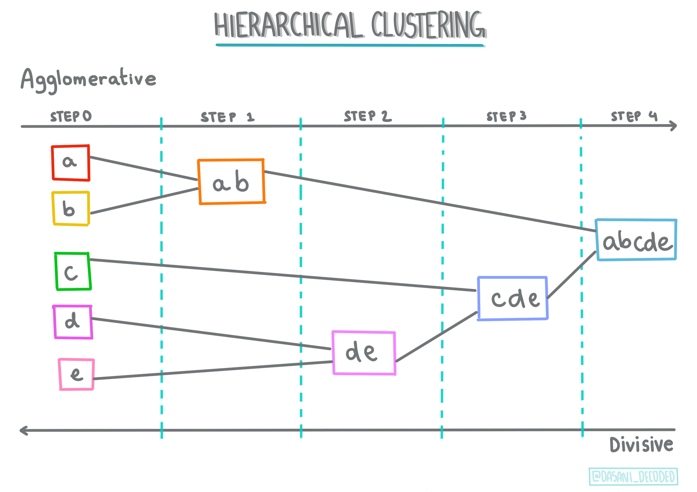
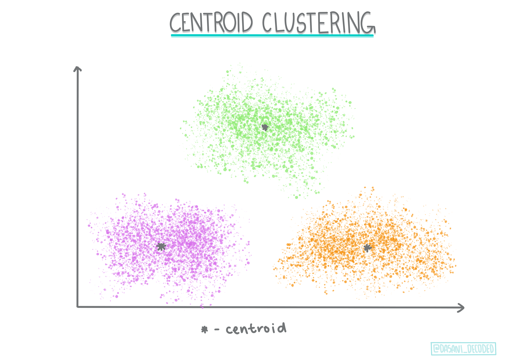
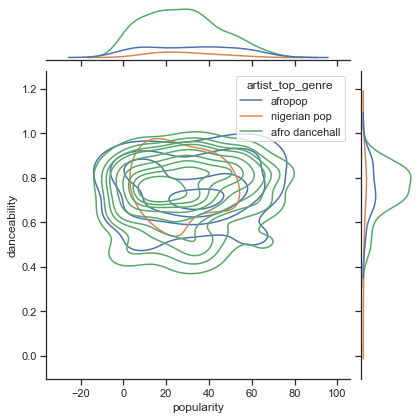
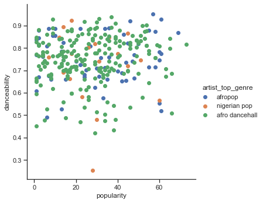

<!--
CO_OP_TRANSLATOR_METADATA:
{
  "original_hash": "0ab69b161efd7a41d325ee28b29415d7",
  "translation_date": "2025-08-29T21:01:01+00:00",
  "source_file": "5-Clustering/1-Visualize/README.md",
  "language_code": "br"
}
-->
# Introdução à clusterização

Clusterização é um tipo de [Aprendizado Não Supervisionado](https://wikipedia.org/wiki/Aprendizado_n%C3%A3o_supervisionado) que parte do pressuposto de que um conjunto de dados não está rotulado ou que suas entradas não estão associadas a saídas predefinidas. Ele utiliza diversos algoritmos para analisar dados não rotulados e fornecer agrupamentos com base nos padrões identificados nos dados.

[](https://youtu.be/ty2advRiWJM "No One Like You por PSquare")

> 🎥 Clique na imagem acima para assistir ao vídeo. Enquanto você estuda aprendizado de máquina com clusterização, aproveite algumas faixas de Dance Hall nigeriano - esta é uma música muito bem avaliada de 2014 por PSquare.

## [Quiz pré-aula](https://gray-sand-07a10f403.1.azurestaticapps.net/quiz/27/)

### Introdução

[Clusterização](https://link.springer.com/referenceworkentry/10.1007%2F978-0-387-30164-8_124) é muito útil para exploração de dados. Vamos ver se ela pode ajudar a descobrir tendências e padrões na forma como o público nigeriano consome música.

✅ Reserve um momento para pensar sobre os usos da clusterização. Na vida real, clusterização acontece sempre que você tem uma pilha de roupas e precisa separar as peças de cada membro da família 🧦👕👖🩲. Em ciência de dados, clusterização ocorre ao tentar analisar as preferências de um usuário ou determinar as características de qualquer conjunto de dados não rotulado. De certa forma, clusterização ajuda a dar sentido ao caos, como uma gaveta de meias.

[](https://youtu.be/esmzYhuFnds "Introdução à Clusterização")

> 🎥 Clique na imagem acima para assistir ao vídeo: John Guttag do MIT apresenta clusterização.

No ambiente profissional, clusterização pode ser usada para determinar coisas como segmentação de mercado, identificando quais faixas etárias compram quais itens, por exemplo. Outro uso seria a detecção de anomalias, talvez para identificar fraudes em um conjunto de dados de transações de cartão de crédito. Ou você pode usar clusterização para identificar tumores em um lote de exames médicos.

✅ Pense por um momento sobre como você pode ter encontrado clusterização 'na prática', em um ambiente bancário, de e-commerce ou de negócios.

> 🎓 Curiosamente, a análise de clusters teve origem nos campos de Antropologia e Psicologia na década de 1930. Você consegue imaginar como ela pode ter sido usada?

Alternativamente, você poderia usá-la para agrupar resultados de busca - por links de compras, imagens ou avaliações, por exemplo. Clusterização é útil quando você tem um grande conjunto de dados que deseja reduzir e sobre o qual deseja realizar uma análise mais detalhada. Assim, a técnica pode ser usada para aprender sobre os dados antes de construir outros modelos.

✅ Uma vez que seus dados estão organizados em clusters, você atribui a eles um Id de cluster, e essa técnica pode ser útil para preservar a privacidade de um conjunto de dados; você pode se referir a um ponto de dados pelo seu Id de cluster, em vez de usar dados identificáveis mais reveladores. Consegue pensar em outros motivos para usar um Id de cluster em vez de outros elementos do cluster para identificá-lo?

Aprofunde seu entendimento sobre técnicas de clusterização neste [módulo de aprendizado](https://docs.microsoft.com/learn/modules/train-evaluate-cluster-models?WT.mc_id=academic-77952-leestott).

## Começando com clusterização

[Scikit-learn oferece uma ampla variedade](https://scikit-learn.org/stable/modules/clustering.html) de métodos para realizar clusterização. O tipo que você escolhe dependerá do seu caso de uso. De acordo com a documentação, cada método tem diferentes benefícios. Aqui está uma tabela simplificada dos métodos suportados pelo Scikit-learn e seus casos de uso apropriados:

| Nome do método                | Caso de uso                                                           |
| :---------------------------- | :-------------------------------------------------------------------- |
| K-Means                       | propósito geral, indutivo                                             |
| Propagação de afinidade       | muitos clusters desiguais, indutivo                                  |
| Mean-shift                    | muitos clusters desiguais, indutivo                                  |
| Clusterização espectral       | poucos clusters iguais, transdutivo                                  |
| Clusterização hierárquica Ward | muitos clusters restritos, transdutivo                              |
| Clusterização aglomerativa    | muitos clusters restritos, distâncias não euclidianas, transdutivo   |
| DBSCAN                        | geometria não plana, clusters desiguais, transdutivo                 |
| OPTICS                        | geometria não plana, clusters desiguais com densidade variável, transdutivo |
| Misturas Gaussianas           | geometria plana, indutivo                                            |
| BIRCH                         | grande conjunto de dados com outliers, indutivo                     |

> 🎓 Como criamos clusters tem muito a ver com como agrupamos os pontos de dados. Vamos explorar alguns termos:
>
> 🎓 ['Transdutivo' vs. 'indutivo'](https://wikipedia.org/wiki/Transduction_(machine_learning))
> 
> Inferência transdutiva é derivada de casos de treinamento observados que mapeiam para casos de teste específicos. Inferência indutiva é derivada de casos de treinamento que mapeiam para regras gerais que só então são aplicadas aos casos de teste.
> 
> Um exemplo: Imagine que você tem um conjunto de dados parcialmente rotulado. Alguns itens são 'discos', outros 'CDs', e alguns estão em branco. Sua tarefa é fornecer rótulos para os itens em branco. Se você escolher uma abordagem indutiva, treinaria um modelo procurando por 'discos' e 'CDs', e aplicaria esses rótulos aos dados não rotulados. Essa abordagem teria dificuldade em classificar itens que na verdade são 'fitas cassete'. Uma abordagem transdutiva, por outro lado, lida com esses dados desconhecidos de forma mais eficaz, agrupando itens semelhantes e aplicando um rótulo ao grupo. Nesse caso, os clusters poderiam refletir 'coisas musicais redondas' e 'coisas musicais quadradas'.
> 
> 🎓 ['Geometria não plana' vs. 'plana'](https://datascience.stackexchange.com/questions/52260/terminology-flat-geometry-in-the-context-of-clustering)
> 
> Derivado da terminologia matemática, geometria não plana vs. plana refere-se à medida de distâncias entre pontos por métodos geométricos 'planos' ([Euclidianos](https://wikipedia.org/wiki/Geometria_euclidiana)) ou 'não planos' (não Euclidianos).
>
>'Plana' neste contexto refere-se à geometria Euclidiana (partes da qual são ensinadas como 'geometria plana'), e 'não plana' refere-se à geometria não Euclidiana. O que a geometria tem a ver com aprendizado de máquina? Bem, como dois campos enraizados na matemática, deve haver uma maneira comum de medir distâncias entre pontos em clusters, e isso pode ser feito de forma 'plana' ou 'não plana', dependendo da natureza dos dados. [Distâncias Euclidianas](https://wikipedia.org/wiki/Dist%C3%A2ncia_euclidiana) são medidas como o comprimento de um segmento de linha entre dois pontos. [Distâncias não Euclidianas](https://wikipedia.org/wiki/Geometria_n%C3%A3o_euclidiana) são medidas ao longo de uma curva. Se seus dados, visualizados, parecem não existir em um plano, você pode precisar usar um algoritmo especializado para lidar com eles.
>

> Infográfico por [Dasani Madipalli](https://twitter.com/dasani_decoded)
> 
> 🎓 ['Distâncias'](https://web.stanford.edu/class/cs345a/slides/12-clustering.pdf)
> 
> Clusters são definidos por sua matriz de distâncias, ou seja, as distâncias entre pontos. Essa distância pode ser medida de algumas maneiras. Clusters Euclidianos são definidos pela média dos valores dos pontos e contêm um 'centroide' ou ponto central. As distâncias são medidas pela distância até esse centroide. Distâncias não Euclidianas referem-se a 'clustroids', o ponto mais próximo de outros pontos. Clustroids, por sua vez, podem ser definidos de várias maneiras.
> 
> 🎓 ['Restrito'](https://wikipedia.org/wiki/Constrained_clustering)
> 
> [Clusterização Restrita](https://web.cs.ucdavis.edu/~davidson/Publications/ICDMTutorial.pdf) introduz aprendizado 'semi-supervisionado' neste método não supervisionado. As relações entre pontos são marcadas como 'não pode vincular' ou 'deve vincular', então algumas regras são impostas ao conjunto de dados.
>
>Um exemplo: Se um algoritmo é liberado em um lote de dados não rotulados ou semi-rotulados, os clusters que ele produz podem ser de baixa qualidade. No exemplo acima, os clusters podem agrupar 'coisas musicais redondas', 'coisas musicais quadradas', 'coisas triangulares' e 'biscoitos'. Se forem dadas algumas restrições ou regras para seguir ("o item deve ser feito de plástico", "o item precisa ser capaz de produzir música"), isso pode ajudar a 'restringir' o algoritmo a fazer escolhas melhores.
> 
> 🎓 'Densidade'
> 
> Dados que são 'ruidosos' são considerados 'densos'. As distâncias entre pontos em cada um de seus clusters podem, ao serem examinadas, provar ser mais ou menos densas, ou 'aglomeradas', e assim esses dados precisam ser analisados com o método de clusterização apropriado. [Este artigo](https://www.kdnuggets.com/2020/02/understanding-density-based-clustering.html) demonstra a diferença entre usar K-Means clustering vs. algoritmos HDBSCAN para explorar um conjunto de dados ruidoso com densidade de cluster desigual.

## Algoritmos de clusterização

Existem mais de 100 algoritmos de clusterização, e seu uso depende da natureza dos dados em questão. Vamos discutir alguns dos principais:

- **Clusterização hierárquica**. Se um objeto é classificado por sua proximidade a um objeto próximo, em vez de um mais distante, os clusters são formados com base na distância de seus membros para outros objetos. A clusterização aglomerativa do Scikit-learn é hierárquica.

   
   > Infográfico por [Dasani Madipalli](https://twitter.com/dasani_decoded)

- **Clusterização por centroide**. Este algoritmo popular exige a escolha de 'k', ou o número de clusters a serem formados, após o qual o algoritmo determina o ponto central de um cluster e reúne dados ao redor desse ponto. [K-means clustering](https://wikipedia.org/wiki/K-means_clustering) é uma versão popular de clusterização por centroide. O centro é determinado pela média mais próxima, daí o nome. A distância quadrada do cluster é minimizada.

   
   > Infográfico por [Dasani Madipalli](https://twitter.com/dasani_decoded)

- **Clusterização baseada em distribuição**. Baseada em modelagem estatística, a clusterização baseada em distribuição centra-se em determinar a probabilidade de um ponto de dados pertencer a um cluster e atribuí-lo de acordo. Métodos de mistura Gaussianas pertencem a este tipo.

- **Clusterização baseada em densidade**. Pontos de dados são atribuídos a clusters com base em sua densidade, ou seu agrupamento ao redor uns dos outros. Pontos de dados distantes do grupo são considerados outliers ou ruídos. DBSCAN, Mean-shift e OPTICS pertencem a este tipo de clusterização.

- **Clusterização baseada em grade**. Para conjuntos de dados multidimensionais, uma grade é criada e os dados são divididos entre as células da grade, criando assim clusters.

## Exercício - agrupe seus dados

Clusterização como técnica é muito auxiliada por uma boa visualização, então vamos começar visualizando nossos dados musicais. Este exercício nos ajudará a decidir qual dos métodos de clusterização devemos usar de forma mais eficaz para a natureza desses dados.

1. Abra o arquivo [_notebook.ipynb_](https://github.com/microsoft/ML-For-Beginners/blob/main/5-Clustering/1-Visualize/notebook.ipynb) nesta pasta.

1. Importe o pacote `Seaborn` para uma boa visualização de dados.

    ```python
    !pip install seaborn
    ```

1. Adicione os dados das músicas do arquivo [_nigerian-songs.csv_](https://github.com/microsoft/ML-For-Beginners/blob/main/5-Clustering/data/nigerian-songs.csv). Carregue um dataframe com alguns dados sobre as músicas. Prepare-se para explorar esses dados importando as bibliotecas e exibindo os dados:

    ```python
    import matplotlib.pyplot as plt
    import pandas as pd
    
    df = pd.read_csv("../data/nigerian-songs.csv")
    df.head()
    ```

    Verifique as primeiras linhas de dados:

    |     | nome                     | álbum                        | artista              | gênero_principal_artista | data_lançamento | duração | popularidade | dançabilidade | acústica | energia | instrumentalidade | vivacidade | volume | discurso | tempo   | assinatura_tempo |
    | --- | ------------------------ | ---------------------------- | ------------------- | ------------------------ | ---------------- | ------- | ------------ | ------------- | -------- | ------- | ----------------- | ---------- | ------ | -------- | ------- | ---------------- |
    | 0   | Sparky                   | Mandy & The Jungle           | Cruel Santino       | r&b alternativo          | 2019             | 144000  | 48           | 0.666         | 0.851    | 0.42    | 0.534             | 0.11       | -6.699 | 0.0829   | 133.015 | 5                |
    | 1   | shuga rush               | EVERYTHING YOU HEARD IS TRUE | Odunsi (The Engine) | afropop                  | 2020             | 89488   | 30           | 0.71          | 0.0822   | 0.683   | 0.000169          | 0.101      | -5.64  | 0.36     | 129.993 | 3                |
| 2   | LITT!                    | LITT!                        | AYLØ                | indie r&b        | 2018         | 207758 | 40         | 0.836        | 0.272        | 0.564  | 0.000537         | 0.11     | -7.127   | 0.0424      | 130.005 | 4              |
| 3   | Confident / Feeling Cool | Enjoy Your Life              | Lady Donli          | nigerian pop     | 2019         | 175135 | 14         | 0.894        | 0.798        | 0.611  | 0.000187         | 0.0964   | -4.961   | 0.113       | 111.087 | 4              |
| 4   | wanted you               | rare.                        | Odunsi (The Engine) | afropop          | 2018         | 152049 | 25         | 0.702        | 0.116        | 0.833  | 0.91             | 0.348    | -6.044   | 0.0447      | 105.115 | 4              |

1. Obtenha algumas informações sobre o dataframe, chamando `info()`:

    ```python
    df.info()
    ```

   A saída será parecida com isso:

    ```output
    <class 'pandas.core.frame.DataFrame'>
    RangeIndex: 530 entries, 0 to 529
    Data columns (total 16 columns):
     #   Column            Non-Null Count  Dtype  
    ---  ------            --------------  -----  
     0   name              530 non-null    object 
     1   album             530 non-null    object 
     2   artist            530 non-null    object 
     3   artist_top_genre  530 non-null    object 
     4   release_date      530 non-null    int64  
     5   length            530 non-null    int64  
     6   popularity        530 non-null    int64  
     7   danceability      530 non-null    float64
     8   acousticness      530 non-null    float64
     9   energy            530 non-null    float64
     10  instrumentalness  530 non-null    float64
     11  liveness          530 non-null    float64
     12  loudness          530 non-null    float64
     13  speechiness       530 non-null    float64
     14  tempo             530 non-null    float64
     15  time_signature    530 non-null    int64  
    dtypes: float64(8), int64(4), object(4)
    memory usage: 66.4+ KB
    ```

1. Verifique novamente se há valores nulos, chamando `isnull()` e verificando se a soma é 0:

    ```python
    df.isnull().sum()
    ```

    Tudo certo:

    ```output
    name                0
    album               0
    artist              0
    artist_top_genre    0
    release_date        0
    length              0
    popularity          0
    danceability        0
    acousticness        0
    energy              0
    instrumentalness    0
    liveness            0
    loudness            0
    speechiness         0
    tempo               0
    time_signature      0
    dtype: int64
    ```

1. Descreva os dados:

    ```python
    df.describe()
    ```

    |       | release_date | length      | popularity | danceability | acousticness | energy   | instrumentalness | liveness | loudness  | speechiness | tempo      | time_signature |
    | ----- | ------------ | ----------- | ---------- | ------------ | ------------ | -------- | ---------------- | -------- | --------- | ----------- | ---------- | -------------- |
    | count | 530          | 530         | 530        | 530          | 530          | 530      | 530              | 530      | 530       | 530         | 530        | 530            |
    | mean  | 2015.390566  | 222298.1698 | 17.507547  | 0.741619     | 0.265412     | 0.760623 | 0.016305         | 0.147308 | -4.953011 | 0.130748    | 116.487864 | 3.986792       |
    | std   | 3.131688     | 39696.82226 | 18.992212  | 0.117522     | 0.208342     | 0.148533 | 0.090321         | 0.123588 | 2.464186  | 0.092939    | 23.518601  | 0.333701       |
    | min   | 1998         | 89488       | 0          | 0.255        | 0.000665     | 0.111    | 0                | 0.0283   | -19.362   | 0.0278      | 61.695     | 3              |
    | 25%   | 2014         | 199305      | 0          | 0.681        | 0.089525     | 0.669    | 0                | 0.07565  | -6.29875  | 0.0591      | 102.96125  | 4              |
    | 50%   | 2016         | 218509      | 13         | 0.761        | 0.2205       | 0.7845   | 0.000004         | 0.1035   | -4.5585   | 0.09795     | 112.7145   | 4              |
    | 75%   | 2017         | 242098.5    | 31         | 0.8295       | 0.403        | 0.87575  | 0.000234         | 0.164    | -3.331    | 0.177       | 125.03925  | 4              |
    | max   | 2020         | 511738      | 73         | 0.966        | 0.954        | 0.995    | 0.91             | 0.811    | 0.582     | 0.514       | 206.007    | 5              |

> 🤔 Se estamos trabalhando com clustering, um método não supervisionado que não requer dados rotulados, por que estamos mostrando esses dados com rótulos? Na fase de exploração de dados, eles são úteis, mas não são necessários para os algoritmos de clustering funcionarem. Você poderia simplesmente remover os cabeçalhos das colunas e se referir aos dados pelo número da coluna.

Observe os valores gerais dos dados. Note que a popularidade pode ser '0', o que indica músicas que não têm classificação. Vamos remover essas em breve.

1. Use um gráfico de barras para descobrir os gêneros mais populares:

    ```python
    import seaborn as sns
    
    top = df['artist_top_genre'].value_counts()
    plt.figure(figsize=(10,7))
    sns.barplot(x=top[:5].index,y=top[:5].values)
    plt.xticks(rotation=45)
    plt.title('Top genres',color = 'blue')
    ```

    

✅ Se você quiser ver mais valores no topo, altere o `[:5]` para um valor maior ou remova-o para ver todos.

Note que, quando o gênero principal é descrito como 'Missing', isso significa que o Spotify não o classificou, então vamos removê-lo.

1. Remova os dados ausentes filtrando-os:

    ```python
    df = df[df['artist_top_genre'] != 'Missing']
    top = df['artist_top_genre'].value_counts()
    plt.figure(figsize=(10,7))
    sns.barplot(x=top.index,y=top.values)
    plt.xticks(rotation=45)
    plt.title('Top genres',color = 'blue')
    ```

    Agora verifique novamente os gêneros:

    

1. De longe, os três principais gêneros dominam este conjunto de dados. Vamos nos concentrar em `afro dancehall`, `afropop` e `nigerian pop`, além de filtrar o conjunto de dados para remover qualquer coisa com um valor de popularidade 0 (o que significa que não foi classificado com uma popularidade no conjunto de dados e pode ser considerado ruído para nossos propósitos):

    ```python
    df = df[(df['artist_top_genre'] == 'afro dancehall') | (df['artist_top_genre'] == 'afropop') | (df['artist_top_genre'] == 'nigerian pop')]
    df = df[(df['popularity'] > 0)]
    top = df['artist_top_genre'].value_counts()
    plt.figure(figsize=(10,7))
    sns.barplot(x=top.index,y=top.values)
    plt.xticks(rotation=45)
    plt.title('Top genres',color = 'blue')
    ```

1. Faça um teste rápido para ver se os dados têm alguma correlação particularmente forte:

    ```python
    corrmat = df.corr(numeric_only=True)
    f, ax = plt.subplots(figsize=(12, 9))
    sns.heatmap(corrmat, vmax=.8, square=True)
    ```

    

    A única correlação forte é entre `energy` e `loudness`, o que não é muito surpreendente, dado que músicas altas geralmente são bastante energéticas. Fora isso, as correlações são relativamente fracas. Será interessante ver o que um algoritmo de clustering pode fazer com esses dados.

    > 🎓 Note que correlação não implica causalidade! Temos prova de correlação, mas nenhuma prova de causalidade. Um [site divertido](https://tylervigen.com/spurious-correlations) tem alguns visuais que enfatizam esse ponto.

Há alguma convergência neste conjunto de dados em torno da popularidade percebida de uma música e sua capacidade de dança? Um FacetGrid mostra que há círculos concêntricos que se alinham, independentemente do gênero. Poderia ser que os gostos nigerianos convergem em um certo nível de capacidade de dança para este gênero?

✅ Experimente diferentes pontos de dados (energia, loudness, speechiness) e mais ou diferentes gêneros musicais. O que você pode descobrir? Dê uma olhada na tabela `df.describe()` para ver a distribuição geral dos pontos de dados.

### Exercício - distribuição de dados

Esses três gêneros são significativamente diferentes na percepção de sua capacidade de dança, com base em sua popularidade?

1. Examine a distribuição de dados dos nossos três principais gêneros para popularidade e capacidade de dança ao longo de um eixo x e y dados.

    ```python
    sns.set_theme(style="ticks")
    
    g = sns.jointplot(
        data=df,
        x="popularity", y="danceability", hue="artist_top_genre",
        kind="kde",
    )
    ```

    Você pode descobrir círculos concêntricos em torno de um ponto geral de convergência, mostrando a distribuição dos pontos.

    > 🎓 Note que este exemplo usa um gráfico KDE (Kernel Density Estimate) que representa os dados usando uma curva de densidade de probabilidade contínua. Isso nos permite interpretar os dados ao trabalhar com múltiplas distribuições.

    Em geral, os três gêneros se alinham vagamente em termos de sua popularidade e capacidade de dança. Determinar clusters nesses dados vagamente alinhados será um desafio:

    

1. Crie um gráfico de dispersão:

    ```python
    sns.FacetGrid(df, hue="artist_top_genre", height=5) \
       .map(plt.scatter, "popularity", "danceability") \
       .add_legend()
    ```

    Um gráfico de dispersão dos mesmos eixos mostra um padrão semelhante de convergência.

    

Em geral, para clustering, você pode usar gráficos de dispersão para mostrar clusters de dados, então dominar esse tipo de visualização é muito útil. Na próxima lição, usaremos esses dados filtrados e aplicaremos o clustering k-means para descobrir grupos nesses dados que parecem se sobrepor de maneiras interessantes.

---

## 🚀Desafio

Em preparação para a próxima lição, faça um gráfico sobre os vários algoritmos de clustering que você pode descobrir e usar em um ambiente de produção. Que tipos de problemas o clustering está tentando resolver?

## [Questionário pós-aula](https://gray-sand-07a10f403.1.azurestaticapps.net/quiz/28/)

## Revisão e Autoestudo

Antes de aplicar algoritmos de clustering, como aprendemos, é uma boa ideia entender a natureza do seu conjunto de dados. Leia mais sobre este tópico [aqui](https://www.kdnuggets.com/2019/10/right-clustering-algorithm.html).

[Este artigo útil](https://www.freecodecamp.org/news/8-clustering-algorithms-in-machine-learning-that-all-data-scientists-should-know/) explica as diferentes formas como vários algoritmos de clustering se comportam, dados diferentes formatos de dados.

## Tarefa

[Pesquise outras visualizações para clustering](assignment.md)

---

**Aviso Legal**:  
Este documento foi traduzido utilizando o serviço de tradução por IA [Co-op Translator](https://github.com/Azure/co-op-translator). Embora nos esforcemos para garantir a precisão, esteja ciente de que traduções automatizadas podem conter erros ou imprecisões. O documento original em seu idioma nativo deve ser considerado a fonte autoritativa. Para informações críticas, recomenda-se a tradução profissional realizada por humanos. Não nos responsabilizamos por quaisquer mal-entendidos ou interpretações equivocadas decorrentes do uso desta tradução.