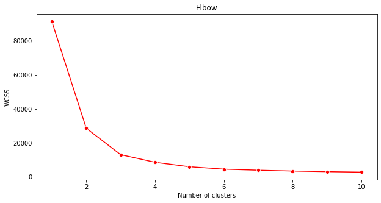
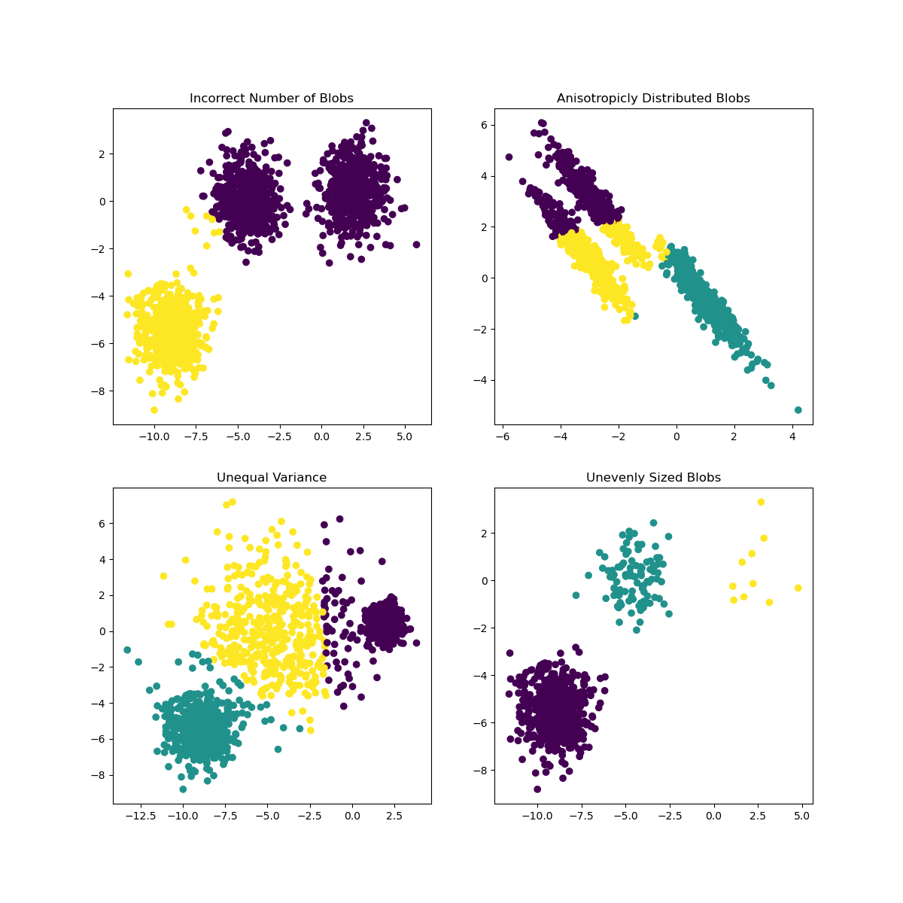

<!--
CO_OP_TRANSLATOR_METADATA:
{
  "original_hash": "085d571097d201810720df4cd379f8c2",
  "translation_date": "2025-08-29T21:06:22+00:00",
  "source_file": "5-Clustering/2-K-Means/README.md",
  "language_code": "br"
}
-->
# K-Means clustering

## [Pre-lecture quiz](https://gray-sand-07a10f403.1.azurestaticapps.net/quiz/29/)

Nesta lição, você aprenderá como criar clusters usando Scikit-learn e o conjunto de dados de música nigeriana que você importou anteriormente. Vamos abordar os fundamentos do K-Means para Clustering. Lembre-se de que, como você aprendeu na lição anterior, existem várias maneiras de trabalhar com clusters, e o método que você usa depende dos seus dados. Vamos experimentar o K-Means, pois é a técnica de clustering mais comum. Vamos começar!

Termos que você aprenderá:

- Pontuação de Silhouette
- Método do cotovelo
- Inércia
- Variância

## Introdução

[K-Means Clustering](https://wikipedia.org/wiki/K-means_clustering) é um método derivado do domínio de processamento de sinais. Ele é usado para dividir e particionar grupos de dados em 'k' clusters usando uma série de observações. Cada observação trabalha para agrupar um determinado ponto de dados mais próximo de sua 'média' mais próxima, ou o ponto central de um cluster.

Os clusters podem ser visualizados como [diagramas de Voronoi](https://wikipedia.org/wiki/Voronoi_diagram), que incluem um ponto (ou 'semente') e sua região correspondente.


> Infográfico por [Jen Looper](https://twitter.com/jenlooper)

O processo de clustering K-Means [é executado em três etapas](https://scikit-learn.org/stable/modules/clustering.html#k-means):

1. O algoritmo seleciona um número k de pontos centrais ao amostrar do conjunto de dados. Depois disso, ele entra em um loop:
    1. Ele atribui cada amostra ao centróide mais próximo.
    2. Ele cria novos centróides calculando o valor médio de todas as amostras atribuídas aos centróides anteriores.
    3. Em seguida, calcula a diferença entre os novos e antigos centróides e repete até que os centróides sejam estabilizados.

Uma desvantagem do uso do K-Means é que você precisará estabelecer 'k', ou seja, o número de centróides. Felizmente, o 'método do cotovelo' ajuda a estimar um bom valor inicial para 'k'. Você experimentará isso em breve.

## Pré-requisito

Você trabalhará no arquivo [_notebook.ipynb_](https://github.com/microsoft/ML-For-Beginners/blob/main/5-Clustering/2-K-Means/notebook.ipynb) desta lição, que inclui a importação de dados e a limpeza preliminar que você fez na última lição.

## Exercício - preparação

Comece revisando os dados das músicas.

1. Crie um boxplot, chamando `boxplot()` para cada coluna:

    ```python
    plt.figure(figsize=(20,20), dpi=200)
    
    plt.subplot(4,3,1)
    sns.boxplot(x = 'popularity', data = df)
    
    plt.subplot(4,3,2)
    sns.boxplot(x = 'acousticness', data = df)
    
    plt.subplot(4,3,3)
    sns.boxplot(x = 'energy', data = df)
    
    plt.subplot(4,3,4)
    sns.boxplot(x = 'instrumentalness', data = df)
    
    plt.subplot(4,3,5)
    sns.boxplot(x = 'liveness', data = df)
    
    plt.subplot(4,3,6)
    sns.boxplot(x = 'loudness', data = df)
    
    plt.subplot(4,3,7)
    sns.boxplot(x = 'speechiness', data = df)
    
    plt.subplot(4,3,8)
    sns.boxplot(x = 'tempo', data = df)
    
    plt.subplot(4,3,9)
    sns.boxplot(x = 'time_signature', data = df)
    
    plt.subplot(4,3,10)
    sns.boxplot(x = 'danceability', data = df)
    
    plt.subplot(4,3,11)
    sns.boxplot(x = 'length', data = df)
    
    plt.subplot(4,3,12)
    sns.boxplot(x = 'release_date', data = df)
    ```

    Esses dados estão um pouco ruidosos: ao observar cada coluna como um boxplot, você pode ver outliers.

    

Você poderia percorrer o conjunto de dados e remover esses outliers, mas isso tornaria os dados bastante reduzidos.

1. Por enquanto, escolha quais colunas você usará para o exercício de clustering. Escolha aquelas com intervalos semelhantes e codifique a coluna `artist_top_genre` como dados numéricos:

    ```python
    from sklearn.preprocessing import LabelEncoder
    le = LabelEncoder()
    
    X = df.loc[:, ('artist_top_genre','popularity','danceability','acousticness','loudness','energy')]
    
    y = df['artist_top_genre']
    
    X['artist_top_genre'] = le.fit_transform(X['artist_top_genre'])
    
    y = le.transform(y)
    ```

1. Agora você precisa escolher quantos clusters deseja segmentar. Você sabe que há 3 gêneros musicais que extraímos do conjunto de dados, então vamos tentar 3:

    ```python
    from sklearn.cluster import KMeans
    
    nclusters = 3 
    seed = 0
    
    km = KMeans(n_clusters=nclusters, random_state=seed)
    km.fit(X)
    
    # Predict the cluster for each data point
    
    y_cluster_kmeans = km.predict(X)
    y_cluster_kmeans
    ```

Você verá um array impresso com clusters previstos (0, 1 ou 2) para cada linha do dataframe.

1. Use esse array para calcular uma 'pontuação de silhouette':

    ```python
    from sklearn import metrics
    score = metrics.silhouette_score(X, y_cluster_kmeans)
    score
    ```

## Pontuação de Silhouette

Procure uma pontuação de silhouette mais próxima de 1. Essa pontuação varia de -1 a 1, e se a pontuação for 1, o cluster é denso e bem separado dos outros clusters. Um valor próximo de 0 representa clusters sobrepostos com amostras muito próximas do limite de decisão dos clusters vizinhos. [(Fonte)](https://dzone.com/articles/kmeans-silhouette-score-explained-with-python-exam)

Nossa pontuação é **0,53**, bem no meio. Isso indica que nossos dados não são particularmente adequados para esse tipo de clustering, mas vamos continuar.

### Exercício - construir um modelo

1. Importe `KMeans` e inicie o processo de clustering.

    ```python
    from sklearn.cluster import KMeans
    wcss = []
    
    for i in range(1, 11):
        kmeans = KMeans(n_clusters = i, init = 'k-means++', random_state = 42)
        kmeans.fit(X)
        wcss.append(kmeans.inertia_)
    
    ```

    Há algumas partes aqui que merecem explicação.

    > 🎓 range: Estas são as iterações do processo de clustering.

    > 🎓 random_state: "Determina a geração de números aleatórios para a inicialização dos centróides." [Fonte](https://scikit-learn.org/stable/modules/generated/sklearn.cluster.KMeans.html#sklearn.cluster.KMeans)

    > 🎓 WCSS: "soma dos quadrados dentro do cluster" mede a distância média ao quadrado de todos os pontos dentro de um cluster até o centróide do cluster. [Fonte](https://medium.com/@ODSC/unsupervised-learning-evaluating-clusters-bd47eed175ce).

    > 🎓 Inércia: Os algoritmos K-Means tentam escolher centróides para minimizar a 'inércia', "uma medida de quão coerentes internamente os clusters são." [Fonte](https://scikit-learn.org/stable/modules/clustering.html). O valor é adicionado à variável wcss em cada iteração.

    > 🎓 k-means++: No [Scikit-learn](https://scikit-learn.org/stable/modules/clustering.html#k-means), você pode usar a otimização 'k-means++', que "inicializa os centróides para serem (geralmente) distantes uns dos outros, levando a resultados provavelmente melhores do que a inicialização aleatória."

### Método do cotovelo

Anteriormente, você presumiu que, como segmentou 3 gêneros musicais, deveria escolher 3 clusters. Mas será que é isso mesmo?

1. Use o 'método do cotovelo' para ter certeza.

    ```python
    plt.figure(figsize=(10,5))
    sns.lineplot(x=range(1, 11), y=wcss, marker='o', color='red')
    plt.title('Elbow')
    plt.xlabel('Number of clusters')
    plt.ylabel('WCSS')
    plt.show()
    ```

    Use a variável `wcss` que você construiu na etapa anterior para criar um gráfico mostrando onde está a 'curva' no cotovelo, que indica o número ideal de clusters. Talvez seja **3**!

    

## Exercício - exibir os clusters

1. Tente o processo novamente, desta vez configurando três clusters, e exiba os clusters como um gráfico de dispersão:

    ```python
    from sklearn.cluster import KMeans
    kmeans = KMeans(n_clusters = 3)
    kmeans.fit(X)
    labels = kmeans.predict(X)
    plt.scatter(df['popularity'],df['danceability'],c = labels)
    plt.xlabel('popularity')
    plt.ylabel('danceability')
    plt.show()
    ```

1. Verifique a precisão do modelo:

    ```python
    labels = kmeans.labels_
    
    correct_labels = sum(y == labels)
    
    print("Result: %d out of %d samples were correctly labeled." % (correct_labels, y.size))
    
    print('Accuracy score: {0:0.2f}'. format(correct_labels/float(y.size)))
    ```

    A precisão deste modelo não é muito boa, e o formato dos clusters dá uma pista do porquê.

    

    Esses dados são muito desequilibrados, pouco correlacionados e há muita variância entre os valores das colunas para formar bons clusters. Na verdade, os clusters que se formam provavelmente são fortemente influenciados ou enviesados pelas três categorias de gêneros que definimos acima. Foi um processo de aprendizado!

    Na documentação do Scikit-learn, você pode ver que um modelo como este, com clusters não muito bem demarcados, tem um problema de 'variância':

    
    > Infográfico do Scikit-learn

## Variância

Variância é definida como "a média das diferenças ao quadrado em relação à média" [(Fonte)](https://www.mathsisfun.com/data/standard-deviation.html). No contexto deste problema de clustering, refere-se a dados em que os números do nosso conjunto tendem a divergir um pouco demais da média.

✅ Este é um ótimo momento para pensar em todas as maneiras de corrigir esse problema. Ajustar os dados um pouco mais? Usar colunas diferentes? Utilizar um algoritmo diferente? Dica: Experimente [escalar seus dados](https://www.mygreatlearning.com/blog/learning-data-science-with-k-means-clustering/) para normalizá-los e testar outras colunas.

> Experimente este '[calculador de variância](https://www.calculatorsoup.com/calculators/statistics/variance-calculator.php)' para entender melhor o conceito.

---

## 🚀Desafio

Passe algum tempo com este notebook ajustando os parâmetros. Você consegue melhorar a precisão do modelo limpando mais os dados (removendo outliers, por exemplo)? Você pode usar pesos para dar mais importância a determinadas amostras de dados. O que mais você pode fazer para criar clusters melhores?

Dica: Experimente escalar seus dados. Há código comentado no notebook que adiciona escalonamento padrão para fazer as colunas de dados se parecerem mais em termos de intervalo. Você descobrirá que, embora a pontuação de silhouette diminua, a 'curva' no gráfico do cotovelo se suaviza. Isso ocorre porque deixar os dados sem escala permite que dados com menos variância tenham mais peso. Leia um pouco mais sobre esse problema [aqui](https://stats.stackexchange.com/questions/21222/are-mean-normalization-and-feature-scaling-needed-for-k-means-clustering/21226#21226).

## [Post-lecture quiz](https://gray-sand-07a10f403.1.azurestaticapps.net/quiz/30/)

## Revisão e Autoestudo

Dê uma olhada em um simulador de K-Means [como este](https://user.ceng.metu.edu.tr/~akifakkus/courses/ceng574/k-means/). Você pode usar esta ferramenta para visualizar pontos de dados de amostra e determinar seus centróides. Você pode editar a aleatoriedade dos dados, o número de clusters e o número de centróides. Isso ajuda você a ter uma ideia de como os dados podem ser agrupados?

Além disso, confira [este material sobre K-Means](https://stanford.edu/~cpiech/cs221/handouts/kmeans.html) da Stanford.

## Tarefa

[Experimente diferentes métodos de clustering](assignment.md)

---

**Aviso Legal**:  
Este documento foi traduzido utilizando o serviço de tradução por IA [Co-op Translator](https://github.com/Azure/co-op-translator). Embora nos esforcemos para garantir a precisão, esteja ciente de que traduções automatizadas podem conter erros ou imprecisões. O documento original em seu idioma nativo deve ser considerado a fonte autoritativa. Para informações críticas, recomenda-se a tradução profissional realizada por humanos. Não nos responsabilizamos por quaisquer mal-entendidos ou interpretações equivocadas decorrentes do uso desta tradução.