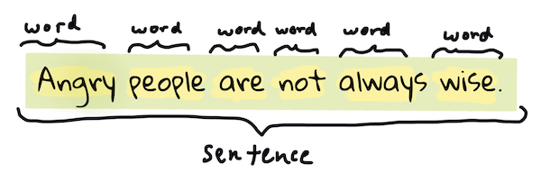

<!--
CO_OP_TRANSLATOR_METADATA:
{
  "original_hash": "6534e145d52a3890590d27be75386e5d",
  "translation_date": "2025-08-29T22:20:03+00:00",
  "source_file": "6-NLP/2-Tasks/README.md",
  "language_code": "br"
}
-->
# Tarefas e técnicas comuns de processamento de linguagem natural

Para a maioria das tarefas de *processamento de linguagem natural*, o texto a ser processado deve ser dividido, examinado e os resultados armazenados ou cruzados com regras e conjuntos de dados. Essas tarefas permitem ao programador derivar o _significado_, a _intenção_ ou apenas a _frequência_ de termos e palavras em um texto.

## [Quiz pré-aula](https://gray-sand-07a10f403.1.azurestaticapps.net/quiz/33/)

Vamos explorar técnicas comuns usadas no processamento de texto. Combinadas com aprendizado de máquina, essas técnicas ajudam a analisar grandes volumes de texto de forma eficiente. Antes de aplicar ML a essas tarefas, no entanto, vamos entender os problemas enfrentados por um especialista em PLN.

## Tarefas comuns em PLN

Existem diferentes maneiras de analisar um texto com o qual você está trabalhando. Há tarefas que você pode realizar e, por meio delas, é possível compreender o texto e tirar conclusões. Normalmente, essas tarefas são realizadas em sequência.

### Tokenização

Provavelmente, a primeira coisa que a maioria dos algoritmos de PLN precisa fazer é dividir o texto em tokens ou palavras. Embora isso pareça simples, lidar com pontuação e delimitadores de palavras e frases em diferentes idiomas pode ser complicado. Pode ser necessário usar vários métodos para determinar as demarcações.


> Tokenizando uma frase de **Orgulho e Preconceito**. Infográfico por [Jen Looper](https://twitter.com/jenlooper)

### Embeddings

[Word embeddings](https://wikipedia.org/wiki/Word_embedding) são uma maneira de converter seus dados textuais em valores numéricos. Os embeddings são feitos de forma que palavras com significados semelhantes ou usadas juntas fiquem agrupadas.


> "Tenho o maior respeito pelos seus nervos, eles são meus velhos amigos." - Word embeddings para uma frase de **Orgulho e Preconceito**. Infográfico por [Jen Looper](https://twitter.com/jenlooper)

✅ Experimente [esta ferramenta interessante](https://projector.tensorflow.org/) para explorar word embeddings. Clicar em uma palavra mostra clusters de palavras semelhantes: 'brinquedo' agrupa-se com 'disney', 'lego', 'playstation' e 'console'.

### Parsing e Marcação de Partes do Discurso

Cada palavra que foi tokenizada pode ser marcada como uma parte do discurso - um substantivo, verbo ou adjetivo. A frase `a rápida raposa vermelha pulou sobre o cachorro marrom preguiçoso` pode ser marcada como raposa = substantivo, pulou = verbo.


> Parsing de uma frase de **Orgulho e Preconceito**. Infográfico por [Jen Looper](https://twitter.com/jenlooper)

Parsing é reconhecer quais palavras estão relacionadas umas às outras em uma frase - por exemplo, `a rápida raposa vermelha pulou` é uma sequência de adjetivo-substantivo-verbo que é separada da sequência `cachorro marrom preguiçoso`.

### Frequência de Palavras e Frases

Um procedimento útil ao analisar um grande corpo de texto é construir um dicionário de cada palavra ou frase de interesse e quantas vezes ela aparece. A frase `a rápida raposa vermelha pulou sobre o cachorro marrom preguiçoso` tem uma frequência de 2 para a palavra "a".

Vamos observar um exemplo de texto onde contamos a frequência das palavras. O poema The Winners de Rudyard Kipling contém o seguinte verso:

```output
What the moral? Who rides may read.
When the night is thick and the tracks are blind
A friend at a pinch is a friend, indeed,
But a fool to wait for the laggard behind.
Down to Gehenna or up to the Throne,
He travels the fastest who travels alone.
```

Como as frequências de frases podem ser sensíveis ou não a maiúsculas, a frase `um amigo` tem uma frequência de 2, `o` tem uma frequência de 6 e `viaja` tem uma frequência de 2.

### N-grams

Um texto pode ser dividido em sequências de palavras de um comprimento definido, uma única palavra (unigrama), duas palavras (bigrama), três palavras (trigrama) ou qualquer número de palavras (n-gramas).

Por exemplo, `a rápida raposa vermelha pulou sobre o cachorro marrom preguiçoso` com um n-grama de 2 produz os seguintes n-gramas:

1. a rápida  
2. rápida raposa  
3. raposa vermelha  
4. vermelha pulou  
5. pulou sobre  
6. sobre o  
7. o cachorro  
8. cachorro marrom  
9. marrom preguiçoso  

Pode ser mais fácil visualizar isso como uma janela deslizante sobre a frase. Aqui está para n-gramas de 3 palavras, o n-grama está em negrito em cada frase:

1.   <u>**a rápida raposa**</u> vermelha pulou sobre o cachorro marrom preguiçoso  
2.   a **<u>rápida raposa vermelha</u>** pulou sobre o cachorro marrom preguiçoso  
3.   a rápida **<u>raposa vermelha pulou</u>** sobre o cachorro marrom preguiçoso  
4.   a rápida raposa **<u>vermelha pulou sobre</u>** o cachorro marrom preguiçoso  
5.   a rápida raposa vermelha **<u>pulou sobre o</u>** cachorro marrom preguiçoso  
6.   a rápida raposa vermelha pulou **<u>sobre o cachorro</u>** marrom preguiçoso  
7.   a rápida raposa vermelha pulou sobre <u>**o cachorro marrom**</u> preguiçoso  
8.   a rápida raposa vermelha pulou sobre o **<u>cachorro marrom preguiçoso</u>**


> Valor de N-grama de 3: Infográfico por [Jen Looper](https://twitter.com/jenlooper)

### Extração de Frases Nominais

Na maioria das frases, há um substantivo que é o sujeito ou objeto da frase. Em inglês, ele geralmente pode ser identificado por ter 'a', 'an' ou 'the' antes dele. Identificar o sujeito ou objeto de uma frase extraindo a 'frase nominal' é uma tarefa comum em PLN ao tentar entender o significado de uma frase.

✅ Na frase "Não consigo fixar a hora, ou o local, ou o olhar ou as palavras, que lançaram a base. Faz muito tempo. Eu já estava no meio antes de perceber que tinha começado.", você consegue identificar as frases nominais?

Na frase `a rápida raposa vermelha pulou sobre o cachorro marrom preguiçoso`, há 2 frases nominais: **rápida raposa vermelha** e **cachorro marrom preguiçoso**.

### Análise de Sentimento

Uma frase ou texto pode ser analisado para determinar o sentimento, ou quão *positivo* ou *negativo* ele é. O sentimento é medido em *polaridade* e *objetividade/subjetividade*. A polaridade é medida de -1.0 a 1.0 (negativo a positivo) e de 0.0 a 1.0 (mais objetivo a mais subjetivo).

✅ Mais tarde, você aprenderá que existem diferentes maneiras de determinar o sentimento usando aprendizado de máquina, mas uma delas é ter uma lista de palavras e frases categorizadas como positivas ou negativas por um especialista humano e aplicar esse modelo ao texto para calcular uma pontuação de polaridade. Você consegue ver como isso funcionaria em algumas circunstâncias e menos em outras?

### Flexão

A flexão permite que você pegue uma palavra e obtenha sua forma singular ou plural.

### Lematização

Um *lema* é a raiz ou palavra-base para um conjunto de palavras, por exemplo, *voou*, *voa*, *voando* têm como lema o verbo *voar*.

Também existem bancos de dados úteis disponíveis para pesquisadores de PLN, notavelmente:

### WordNet

[WordNet](https://wordnet.princeton.edu/) é um banco de dados de palavras, sinônimos, antônimos e muitos outros detalhes para cada palavra em vários idiomas. É incrivelmente útil ao tentar construir traduções, verificadores ortográficos ou ferramentas linguísticas de qualquer tipo.

## Bibliotecas de PLN

Felizmente, você não precisa construir todas essas técnicas sozinho, pois existem excelentes bibliotecas Python disponíveis que tornam o processamento de linguagem natural muito mais acessível para desenvolvedores que não são especializados em PLN ou aprendizado de máquina. As próximas lições incluem mais exemplos dessas bibliotecas, mas aqui você aprenderá alguns exemplos úteis para ajudá-lo na próxima tarefa.

### Exercício - usando a biblioteca `TextBlob`

Vamos usar uma biblioteca chamada TextBlob, pois ela contém APIs úteis para lidar com esses tipos de tarefas. TextBlob "se baseia nos ombros gigantes do [NLTK](https://nltk.org) e do [pattern](https://github.com/clips/pattern), e funciona bem com ambos." Ela possui uma quantidade considerável de ML embutida em sua API.

> Nota: Um [Guia Rápido](https://textblob.readthedocs.io/en/dev/quickstart.html#quickstart) útil está disponível para TextBlob e é recomendado para desenvolvedores Python experientes.

Ao tentar identificar *frases nominais*, o TextBlob oferece várias opções de extratores para encontrá-las.

1. Dê uma olhada no `ConllExtractor`.

    ```python
    from textblob import TextBlob
    from textblob.np_extractors import ConllExtractor
    # import and create a Conll extractor to use later 
    extractor = ConllExtractor()
    
    # later when you need a noun phrase extractor:
    user_input = input("> ")
    user_input_blob = TextBlob(user_input, np_extractor=extractor)  # note non-default extractor specified
    np = user_input_blob.noun_phrases                                    
    ```

    > O que está acontecendo aqui? [ConllExtractor](https://textblob.readthedocs.io/en/dev/api_reference.html?highlight=Conll#textblob.en.np_extractors.ConllExtractor) é "Um extrator de frases nominais que usa chunk parsing treinado com o corpus de treinamento ConLL-2000." ConLL-2000 refere-se à Conferência de 2000 sobre Aprendizado Computacional de Linguagem Natural. Cada ano, a conferência hospedava um workshop para resolver um problema desafiador de PLN, e em 2000 foi o chunking de substantivos. Um modelo foi treinado no Wall Street Journal, com "as seções 15-18 como dados de treinamento (211727 tokens) e a seção 20 como dados de teste (47377 tokens)". Você pode conferir os procedimentos usados [aqui](https://www.clips.uantwerpen.be/conll2000/chunking/) e os [resultados](https://ifarm.nl/erikt/research/np-chunking.html).

### Desafio - melhorando seu bot com PLN

Na lição anterior, você construiu um bot de perguntas e respostas muito simples. Agora, você tornará Marvin um pouco mais simpático analisando sua entrada para detectar o sentimento e imprimindo uma resposta correspondente. Você também precisará identificar uma `noun_phrase` e perguntar sobre ela.

Seus passos ao construir um bot conversacional melhor:

1. Imprima instruções orientando o usuário sobre como interagir com o bot.  
2. Inicie o loop:  
   1. Aceite a entrada do usuário.  
   2. Se o usuário pedir para sair, encerre.  
   3. Processe a entrada do usuário e determine a resposta de sentimento apropriada.  
   4. Se uma frase nominal for detectada no sentimento, pluralize-a e peça mais informações sobre esse tópico.  
   5. Imprima a resposta.  
3. Volte ao passo 2.

Aqui está o trecho de código para determinar o sentimento usando TextBlob. Observe que há apenas quatro *gradientes* de resposta de sentimento (você pode adicionar mais, se quiser):

```python
if user_input_blob.polarity <= -0.5:
  response = "Oh dear, that sounds bad. "
elif user_input_blob.polarity <= 0:
  response = "Hmm, that's not great. "
elif user_input_blob.polarity <= 0.5:
  response = "Well, that sounds positive. "
elif user_input_blob.polarity <= 1:
  response = "Wow, that sounds great. "
```

Aqui está um exemplo de saída para guiá-lo (a entrada do usuário está nas linhas que começam com >):

```output
Hello, I am Marvin, the friendly robot.
You can end this conversation at any time by typing 'bye'
After typing each answer, press 'enter'
How are you today?
> I am ok
Well, that sounds positive. Can you tell me more?
> I went for a walk and saw a lovely cat
Well, that sounds positive. Can you tell me more about lovely cats?
> cats are the best. But I also have a cool dog
Wow, that sounds great. Can you tell me more about cool dogs?
> I have an old hounddog but he is sick
Hmm, that's not great. Can you tell me more about old hounddogs?
> bye
It was nice talking to you, goodbye!
```

Uma possível solução para a tarefa está [aqui](https://github.com/microsoft/ML-For-Beginners/blob/main/6-NLP/2-Tasks/solution/bot.py).

✅ Verificação de Conhecimento

1. Você acha que as respostas simpáticas poderiam 'enganar' alguém a pensar que o bot realmente os entende?  
2. Identificar a frase nominal torna o bot mais 'crível'?  
3. Por que extrair uma 'frase nominal' de uma frase seria algo útil?  

---

Implemente o bot na verificação de conhecimento anterior e teste-o com um amigo. Ele consegue enganá-lo? Você consegue tornar seu bot mais 'crível'?

## 🚀Desafio

Escolha uma tarefa na verificação de conhecimento anterior e tente implementá-la. Teste o bot com um amigo. Ele consegue enganá-lo? Você consegue tornar seu bot mais 'crível'?

## [Quiz pós-aula](https://gray-sand-07a10f403.1.azurestaticapps.net/quiz/34/)

## Revisão e Autoestudo

Nas próximas lições, você aprenderá mais sobre análise de sentimento. Pesquise essa técnica interessante em artigos como os do [KDNuggets](https://www.kdnuggets.com/tag/nlp).

## Tarefa

[Faça um bot responder](assignment.md)

---

**Aviso Legal**:  
Este documento foi traduzido utilizando o serviço de tradução por IA [Co-op Translator](https://github.com/Azure/co-op-translator). Embora nos esforcemos para garantir a precisão, esteja ciente de que traduções automatizadas podem conter erros ou imprecisões. O documento original em seu idioma nativo deve ser considerado a fonte autoritativa. Para informações críticas, recomenda-se a tradução profissional realizada por humanos. Não nos responsabilizamos por quaisquer mal-entendidos ou interpretações equivocadas decorrentes do uso desta tradução.