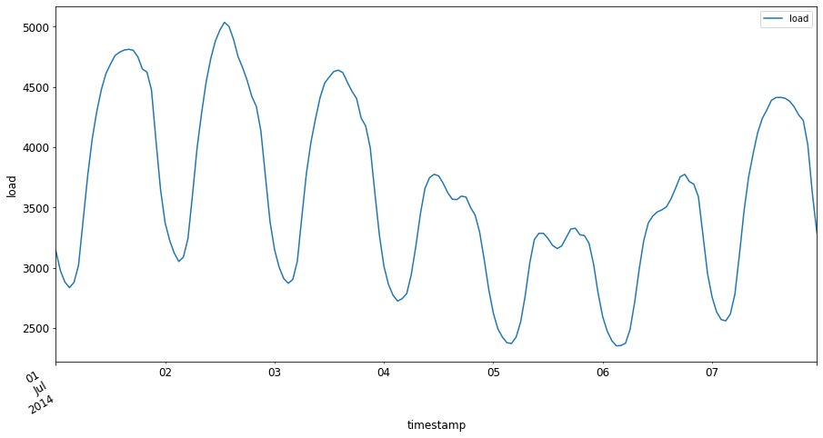

<!--
CO_OP_TRANSLATOR_METADATA:
{
  "original_hash": "3150d40f36a77857316ecaed5f31e856",
  "translation_date": "2025-08-29T20:45:56+00:00",
  "source_file": "7-TimeSeries/1-Introduction/README.md",
  "language_code": "br"
}
-->
# Introdução à previsão de séries temporais


> Sketchnote por [Tomomi Imura](https://www.twitter.com/girlie_mac)

Nesta lição e na próxima, você aprenderá um pouco sobre previsão de séries temporais, uma parte interessante e valiosa do repertório de um cientista de ML, que é um pouco menos conhecida do que outros tópicos. A previsão de séries temporais é como uma espécie de "bola de cristal": com base no desempenho passado de uma variável, como preço, você pode prever seu valor potencial futuro.

[](https://youtu.be/cBojo1hsHiI "Introdução à previsão de séries temporais")

> 🎥 Clique na imagem acima para assistir a um vídeo sobre previsão de séries temporais

## [Quiz pré-aula](https://gray-sand-07a10f403.1.azurestaticapps.net/quiz/41/)

É um campo útil e interessante, com valor real para os negócios, dado seu uso direto em problemas de precificação, inventário e questões de cadeia de suprimentos. Embora técnicas de aprendizado profundo tenham começado a ser usadas para obter mais insights e prever melhor o desempenho futuro, a previsão de séries temporais ainda é um campo amplamente informado por técnicas clássicas de ML.

> O útil currículo de séries temporais da Penn State pode ser encontrado [aqui](https://online.stat.psu.edu/stat510/lesson/1)

## Introdução

Suponha que você gerencie uma rede de parquímetros inteligentes que fornecem dados sobre com que frequência eles são usados e por quanto tempo ao longo do tempo.

> E se você pudesse prever, com base no desempenho passado do parquímetro, seu valor futuro de acordo com as leis de oferta e demanda?

Prever com precisão quando agir para alcançar seu objetivo é um desafio que pode ser enfrentado com a previsão de séries temporais. Não deixaria as pessoas felizes serem cobradas mais caro em horários de pico enquanto procuram uma vaga, mas seria uma maneira eficaz de gerar receita para limpar as ruas!

Vamos explorar alguns dos tipos de algoritmos de séries temporais e começar um notebook para limpar e preparar alguns dados. Os dados que você analisará são retirados da competição de previsão GEFCom2014. Eles consistem em 3 anos de valores horários de carga elétrica e temperatura entre 2012 e 2014. Dado os padrões históricos de carga elétrica e temperatura, você pode prever valores futuros de carga elétrica.

Neste exemplo, você aprenderá como prever um passo de tempo à frente, usando apenas dados históricos de carga. Antes de começar, no entanto, é útil entender o que está acontecendo nos bastidores.

## Algumas definições

Ao se deparar com o termo "séries temporais", é importante entender seu uso em diferentes contextos.

🎓 **Séries temporais**

Em matemática, "uma série temporal é uma série de pontos de dados indexados (ou listados ou plotados) em ordem temporal. Mais comumente, uma série temporal é uma sequência tomada em pontos de tempo sucessivos e igualmente espaçados." Um exemplo de série temporal é o valor de fechamento diário do [Índice Dow Jones Industrial](https://wikipedia.org/wiki/Time_series). O uso de gráficos de séries temporais e modelagem estatística é frequentemente encontrado em processamento de sinais, previsão do tempo, previsão de terremotos e outros campos onde eventos ocorrem e pontos de dados podem ser plotados ao longo do tempo.

🎓 **Análise de séries temporais**

A análise de séries temporais é a análise dos dados de séries temporais mencionados acima. Os dados de séries temporais podem assumir formas distintas, incluindo "séries temporais interrompidas", que detectam padrões na evolução de uma série temporal antes e depois de um evento interruptor. O tipo de análise necessária para a série temporal depende da natureza dos dados. Os dados de séries temporais podem assumir a forma de séries de números ou caracteres.

A análise a ser realizada utiliza uma variedade de métodos, incluindo domínio da frequência e domínio do tempo, linear e não linear, entre outros. [Saiba mais](https://www.itl.nist.gov/div898/handbook/pmc/section4/pmc4.htm) sobre as várias maneiras de analisar esse tipo de dado.

🎓 **Previsão de séries temporais**

A previsão de séries temporais é o uso de um modelo para prever valores futuros com base em padrões exibidos por dados previamente coletados à medida que ocorreram no passado. Embora seja possível usar modelos de regressão para explorar dados de séries temporais, com índices de tempo como variáveis x em um gráfico, esses dados são melhor analisados usando tipos especiais de modelos.

Os dados de séries temporais são uma lista de observações ordenadas, diferentemente de dados que podem ser analisados por regressão linear. O mais comum é o ARIMA, um acrônimo para "Autoregressive Integrated Moving Average" (Média Móvel Integrada Autorregressiva).

[Modelos ARIMA](https://online.stat.psu.edu/stat510/lesson/1/1.1) "relacionam o valor presente de uma série a valores passados e erros de previsão passados." Eles são mais apropriados para analisar dados no domínio do tempo, onde os dados estão ordenados ao longo do tempo.

> Existem vários tipos de modelos ARIMA, que você pode aprender [aqui](https://people.duke.edu/~rnau/411arim.htm) e que serão abordados na próxima lição.

Na próxima lição, você construirá um modelo ARIMA usando [Séries Temporais Univariadas](https://itl.nist.gov/div898/handbook/pmc/section4/pmc44.htm), que se concentram em uma variável que muda seu valor ao longo do tempo. Um exemplo desse tipo de dado é [este conjunto de dados](https://itl.nist.gov/div898/handbook/pmc/section4/pmc4411.htm), que registra a concentração mensal de CO2 no Observatório Mauna Loa:

|   CO2   | YearMonth | Year  | Month |
| :-----: | :-------: | :---: | :---: |
| 330.62  |  1975.04  | 1975  |   1   |
| 331.40  |  1975.13  | 1975  |   2   |
| 331.87  |  1975.21  | 1975  |   3   |
| 333.18  |  1975.29  | 1975  |   4   |
| 333.92  |  1975.38  | 1975  |   5   |
| 333.43  |  1975.46  | 1975  |   6   |
| 331.85  |  1975.54  | 1975  |   7   |
| 330.01  |  1975.63  | 1975  |   8   |
| 328.51  |  1975.71  | 1975  |   9   |
| 328.41  |  1975.79  | 1975  |  10   |
| 329.25  |  1975.88  | 1975  |  11   |
| 330.97  |  1975.96  | 1975  |  12   |

✅ Identifique a variável que muda ao longo do tempo neste conjunto de dados.

## Características dos dados de séries temporais a considerar

Ao analisar dados de séries temporais, você pode notar que eles possuem [certas características](https://online.stat.psu.edu/stat510/lesson/1/1.1) que precisam ser levadas em conta e mitigadas para entender melhor seus padrões. Se você considerar os dados de séries temporais como um possível "sinal" que deseja analisar, essas características podem ser vistas como "ruído". Muitas vezes, será necessário reduzir esse "ruído" compensando algumas dessas características usando técnicas estatísticas.

Aqui estão alguns conceitos que você deve conhecer para trabalhar com séries temporais:

🎓 **Tendências**

Tendências são definidas como aumentos e diminuições mensuráveis ao longo do tempo. [Leia mais](https://machinelearningmastery.com/time-series-trends-in-python). No contexto de séries temporais, trata-se de como usar e, se necessário, remover tendências de suas séries temporais.

🎓 **[Sazonalidade](https://machinelearningmastery.com/time-series-seasonality-with-python/)**

Sazonalidade é definida como flutuações periódicas, como picos de vendas durante feriados, por exemplo. [Veja](https://itl.nist.gov/div898/handbook/pmc/section4/pmc443.htm) como diferentes tipos de gráficos exibem sazonalidade nos dados.

🎓 **Outliers**

Outliers são pontos de dados que estão muito distantes da variação padrão dos dados.

🎓 **Ciclo de longo prazo**

Independentemente da sazonalidade, os dados podem exibir um ciclo de longo prazo, como uma recessão econômica que dura mais de um ano.

🎓 **Variância constante**

Ao longo do tempo, alguns dados exibem flutuações constantes, como o uso de energia durante o dia e a noite.

🎓 **Mudanças abruptas**

Os dados podem exibir uma mudança abrupta que pode exigir análise adicional. O fechamento repentino de negócios devido à COVID, por exemplo, causou mudanças nos dados.

✅ Aqui está um [exemplo de gráfico de séries temporais](https://www.kaggle.com/kashnitsky/topic-9-part-1-time-series-analysis-in-python) mostrando os gastos diários com moeda em jogos ao longo de alguns anos. Você consegue identificar alguma das características listadas acima nesses dados?


## Exercício - começando com dados de uso de energia

Vamos começar criando um modelo de séries temporais para prever o uso futuro de energia com base no uso passado.

> Os dados neste exemplo são retirados da competição de previsão GEFCom2014. Eles consistem em 3 anos de valores horários de carga elétrica e temperatura entre 2012 e 2014.
>
> Tao Hong, Pierre Pinson, Shu Fan, Hamidreza Zareipour, Alberto Troccoli e Rob J. Hyndman, "Probabilistic energy forecasting: Global Energy Forecasting Competition 2014 and beyond", International Journal of Forecasting, vol.32, no.3, pp 896-913, julho-setembro, 2016.

1. Na pasta `working` desta lição, abra o arquivo _notebook.ipynb_. Comece adicionando bibliotecas que ajudarão a carregar e visualizar os dados:

    ```python
    import os
    import matplotlib.pyplot as plt
    from common.utils import load_data
    %matplotlib inline
    ```

    Observe que você está usando os arquivos da pasta `common` incluída, que configuram seu ambiente e lidam com o download dos dados.

2. Em seguida, examine os dados como um dataframe chamando `load_data()` e `head()`:

    ```python
    data_dir = './data'
    energy = load_data(data_dir)[['load']]
    energy.head()
    ```

    Você pode ver que há duas colunas representando data e carga:

    |                     |  load  |
    | :-----------------: | :----: |
    | 2012-01-01 00:00:00 | 2698.0 |
    | 2012-01-01 01:00:00 | 2558.0 |
    | 2012-01-01 02:00:00 | 2444.0 |
    | 2012-01-01 03:00:00 | 2402.0 |
    | 2012-01-01 04:00:00 | 2403.0 |

3. Agora, plote os dados chamando `plot()`:

    ```python
    energy.plot(y='load', subplots=True, figsize=(15, 8), fontsize=12)
    plt.xlabel('timestamp', fontsize=12)
    plt.ylabel('load', fontsize=12)
    plt.show()
    ```

    

4. Agora, plote a primeira semana de julho de 2014, fornecendo-a como entrada para o `energy` no padrão `[from date]: [to date]`:

    ```python
    energy['2014-07-01':'2014-07-07'].plot(y='load', subplots=True, figsize=(15, 8), fontsize=12)
    plt.xlabel('timestamp', fontsize=12)
    plt.ylabel('load', fontsize=12)
    plt.show()
    ```

    

    Um gráfico bonito! Observe esses gráficos e veja se consegue determinar alguma das características listadas acima. O que podemos deduzir ao visualizar os dados?

Na próxima lição, você criará um modelo ARIMA para gerar algumas previsões.

---

## 🚀Desafio

Faça uma lista de todas as indústrias e áreas de estudo que você consegue pensar que se beneficiariam da previsão de séries temporais. Você consegue pensar em uma aplicação dessas técnicas nas artes? Na econometria? Na ecologia? No varejo? Na indústria? Nas finanças? Onde mais?

## [Quiz pós-aula](https://gray-sand-07a10f403.1.azurestaticapps.net/quiz/42/)

## Revisão e Autoestudo

Embora não sejam abordadas aqui, redes neurais às vezes são usadas para aprimorar métodos clássicos de previsão de séries temporais. Leia mais sobre elas [neste artigo](https://medium.com/microsoftazure/neural-networks-for-forecasting-financial-and-economic-time-series-6aca370ff412).

## Tarefa

[Visualize mais séries temporais](assignment.md)

---

**Aviso Legal**:  
Este documento foi traduzido utilizando o serviço de tradução por IA [Co-op Translator](https://github.com/Azure/co-op-translator). Embora nos esforcemos para garantir a precisão, esteja ciente de que traduções automáticas podem conter erros ou imprecisões. O documento original em seu idioma nativo deve ser considerado a fonte oficial. Para informações críticas, recomenda-se a tradução profissional feita por humanos. Não nos responsabilizamos por quaisquer mal-entendidos ou interpretações equivocadas decorrentes do uso desta tradução.