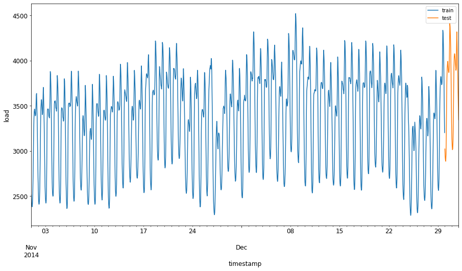

<!--
CO_OP_TRANSLATOR_METADATA:
{
  "original_hash": "2f400075e003e749fdb0d6b3b4787a99",
  "translation_date": "2025-08-29T20:41:21+00:00",
  "source_file": "7-TimeSeries/2-ARIMA/README.md",
  "language_code": "br"
}
-->
# Previsão de séries temporais com ARIMA

Na lição anterior, você aprendeu um pouco sobre previsão de séries temporais e carregou um conjunto de dados mostrando as flutuações de carga elétrica ao longo de um período de tempo.

[](https://youtu.be/IUSk-YDau10 "Introdução ao ARIMA")

> 🎥 Clique na imagem acima para assistir a um vídeo: Uma breve introdução aos modelos ARIMA. O exemplo é feito em R, mas os conceitos são universais.

## [Quiz pré-aula](https://gray-sand-07a10f403.1.azurestaticapps.net/quiz/43/)

## Introdução

Nesta lição, você descobrirá uma maneira específica de construir modelos com [ARIMA: *A*uto*R*egressive *I*ntegrated *M*oving *A*verage](https://wikipedia.org/wiki/Autoregressive_integrated_moving_average). Os modelos ARIMA são particularmente adequados para ajustar dados que apresentam [não-estacionariedade](https://wikipedia.org/wiki/Stationary_process).

## Conceitos gerais

Para trabalhar com ARIMA, há alguns conceitos que você precisa conhecer:

- 🎓 **Estacionariedade**. No contexto estatístico, estacionariedade refere-se a dados cuja distribuição não muda ao serem deslocados no tempo. Dados não estacionários, por outro lado, apresentam flutuações devido a tendências que precisam ser transformadas para serem analisadas. A sazonalidade, por exemplo, pode introduzir flutuações nos dados e pode ser eliminada por meio de um processo de 'diferença sazonal'.

- 🎓 **[Diferença](https://wikipedia.org/wiki/Autoregressive_integrated_moving_average#Differencing)**. Diferençar dados, novamente no contexto estatístico, refere-se ao processo de transformar dados não estacionários para torná-los estacionários, removendo sua tendência não constante. "A diferença remove as mudanças no nível de uma série temporal, eliminando tendência e sazonalidade e, consequentemente, estabilizando a média da série temporal." [Artigo de Shixiong et al](https://arxiv.org/abs/1904.07632)

## ARIMA no contexto de séries temporais

Vamos explorar as partes do ARIMA para entender melhor como ele nos ajuda a modelar séries temporais e fazer previsões com base nelas.

- **AR - de AutoRegressivo**. Modelos autoregressivos, como o nome sugere, olham 'para trás' no tempo para analisar valores anteriores em seus dados e fazer suposições sobre eles. Esses valores anteriores são chamados de 'lags'. Um exemplo seria dados que mostram vendas mensais de lápis. O total de vendas de cada mês seria considerado uma 'variável evolutiva' no conjunto de dados. Este modelo é construído como "a variável evolutiva de interesse é regredida em seus próprios valores defasados (ou seja, anteriores)." [wikipedia](https://wikipedia.org/wiki/Autoregressive_integrated_moving_average)

- **I - de Integrado**. Diferentemente dos modelos semelhantes 'ARMA', o 'I' no ARIMA refere-se ao seu aspecto *[integrado](https://wikipedia.org/wiki/Order_of_integration)*. Os dados são 'integrados' quando etapas de diferenciação são aplicadas para eliminar a não-estacionariedade.

- **MA - de Média Móvel**. O aspecto de [média móvel](https://wikipedia.org/wiki/Moving-average_model) deste modelo refere-se à variável de saída que é determinada observando os valores atuais e passados dos lags.

Resumindo: ARIMA é usado para ajustar um modelo ao formato especial de dados de séries temporais da forma mais precisa possível.

## Exercício - construir um modelo ARIMA

Abra a pasta [_/working_](https://github.com/microsoft/ML-For-Beginners/tree/main/7-TimeSeries/2-ARIMA/working) nesta lição e encontre o arquivo [_notebook.ipynb_](https://github.com/microsoft/ML-For-Beginners/blob/main/7-TimeSeries/2-ARIMA/working/notebook.ipynb).

1. Execute o notebook para carregar a biblioteca Python `statsmodels`; você precisará dela para modelos ARIMA.

1. Carregue as bibliotecas necessárias.

1. Agora, carregue várias outras bibliotecas úteis para plotar dados:

    ```python
    import os
    import warnings
    import matplotlib.pyplot as plt
    import numpy as np
    import pandas as pd
    import datetime as dt
    import math

    from pandas.plotting import autocorrelation_plot
    from statsmodels.tsa.statespace.sarimax import SARIMAX
    from sklearn.preprocessing import MinMaxScaler
    from common.utils import load_data, mape
    from IPython.display import Image

    %matplotlib inline
    pd.options.display.float_format = '{:,.2f}'.format
    np.set_printoptions(precision=2)
    warnings.filterwarnings("ignore") # specify to ignore warning messages
    ```

1. Carregue os dados do arquivo `/data/energy.csv` em um dataframe do Pandas e dê uma olhada:

    ```python
    energy = load_data('./data')[['load']]
    energy.head(10)
    ```

1. Plote todos os dados de energia disponíveis de janeiro de 2012 a dezembro de 2014. Não deve haver surpresas, pois vimos esses dados na última lição:

    ```python
    energy.plot(y='load', subplots=True, figsize=(15, 8), fontsize=12)
    plt.xlabel('timestamp', fontsize=12)
    plt.ylabel('load', fontsize=12)
    plt.show()
    ```

    Agora, vamos construir um modelo!

### Criar conjuntos de dados de treinamento e teste

Agora que seus dados estão carregados, você pode separá-los em conjuntos de treinamento e teste. Você treinará seu modelo no conjunto de treinamento. Como de costume, após o modelo terminar o treinamento, você avaliará sua precisão usando o conjunto de teste. Você precisa garantir que o conjunto de teste cubra um período posterior ao conjunto de treinamento para garantir que o modelo não obtenha informações de períodos futuros.

1. Aloque um período de dois meses de 1º de setembro a 31 de outubro de 2014 para o conjunto de treinamento. O conjunto de teste incluirá o período de dois meses de 1º de novembro a 31 de dezembro de 2014:

    ```python
    train_start_dt = '2014-11-01 00:00:00'
    test_start_dt = '2014-12-30 00:00:00'
    ```

    Como esses dados refletem o consumo diário de energia, há um forte padrão sazonal, mas o consumo é mais semelhante ao consumo em dias mais recentes.

1. Visualize as diferenças:

    ```python
    energy[(energy.index < test_start_dt) & (energy.index >= train_start_dt)][['load']].rename(columns={'load':'train'}) \
        .join(energy[test_start_dt:][['load']].rename(columns={'load':'test'}), how='outer') \
        .plot(y=['train', 'test'], figsize=(15, 8), fontsize=12)
    plt.xlabel('timestamp', fontsize=12)
    plt.ylabel('load', fontsize=12)
    plt.show()
    ```

    

    Portanto, usar uma janela de tempo relativamente pequena para treinar os dados deve ser suficiente.

    > Nota: Como a função que usamos para ajustar o modelo ARIMA utiliza validação dentro da amostra durante o ajuste, omitiremos os dados de validação.

### Preparar os dados para treinamento

Agora, você precisa preparar os dados para treinamento realizando filtragem e escalonamento dos dados. Filtre seu conjunto de dados para incluir apenas os períodos de tempo e colunas necessários e escale para garantir que os dados sejam projetados no intervalo 0,1.

1. Filtre o conjunto de dados original para incluir apenas os períodos de tempo mencionados por conjunto e apenas a coluna necessária 'load' mais a data:

    ```python
    train = energy.copy()[(energy.index >= train_start_dt) & (energy.index < test_start_dt)][['load']]
    test = energy.copy()[energy.index >= test_start_dt][['load']]

    print('Training data shape: ', train.shape)
    print('Test data shape: ', test.shape)
    ```

    Você pode ver a forma dos dados:

    ```output
    Training data shape:  (1416, 1)
    Test data shape:  (48, 1)
    ```

1. Escale os dados para estarem no intervalo (0, 1).

    ```python
    scaler = MinMaxScaler()
    train['load'] = scaler.fit_transform(train)
    train.head(10)
    ```

1. Visualize os dados originais vs. os dados escalados:

    ```python
    energy[(energy.index >= train_start_dt) & (energy.index < test_start_dt)][['load']].rename(columns={'load':'original load'}).plot.hist(bins=100, fontsize=12)
    train.rename(columns={'load':'scaled load'}).plot.hist(bins=100, fontsize=12)
    plt.show()
    ```

    

    > Os dados originais

    

    > Os dados escalados

1. Agora que você calibrou os dados escalados, pode escalar os dados de teste:

    ```python
    test['load'] = scaler.transform(test)
    test.head()
    ```

### Implementar ARIMA

É hora de implementar o ARIMA! Agora você usará a biblioteca `statsmodels` que instalou anteriormente.

Agora você precisa seguir várias etapas:

   1. Defina o modelo chamando `SARIMAX()` e passando os parâmetros do modelo: parâmetros p, d e q, e parâmetros P, D e Q.
   2. Prepare o modelo para os dados de treinamento chamando a função fit().
   3. Faça previsões chamando a função `forecast()` e especificando o número de passos (o `horizon`) para prever.

> 🎓 Para que servem todos esses parâmetros? Em um modelo ARIMA, há 3 parâmetros usados para ajudar a modelar os principais aspectos de uma série temporal: sazonalidade, tendência e ruído. Esses parâmetros são:

`p`: o parâmetro associado ao aspecto autoregressivo do modelo, que incorpora valores *passados*.
`d`: o parâmetro associado à parte integrada do modelo, que afeta a quantidade de *diferença* (🎓 lembre-se de diferença 👆?) a ser aplicada a uma série temporal.
`q`: o parâmetro associado à parte de média móvel do modelo.

> Nota: Se seus dados tiverem um aspecto sazonal - como este -, usamos um modelo ARIMA sazonal (SARIMA). Nesse caso, você precisa usar outro conjunto de parâmetros: `P`, `D` e `Q`, que descrevem as mesmas associações que `p`, `d` e `q`, mas correspondem aos componentes sazonais do modelo.

1. Comece definindo seu valor de horizonte preferido. Vamos tentar 3 horas:

    ```python
    # Specify the number of steps to forecast ahead
    HORIZON = 3
    print('Forecasting horizon:', HORIZON, 'hours')
    ```

    Selecionar os melhores valores para os parâmetros de um modelo ARIMA pode ser desafiador, pois é um processo um tanto subjetivo e demorado. Você pode considerar usar uma função `auto_arima()` da biblioteca [`pyramid`](https://alkaline-ml.com/pmdarima/0.9.0/modules/generated/pyramid.arima.auto_arima.html).

1. Por enquanto, tente algumas seleções manuais para encontrar um bom modelo.

    ```python
    order = (4, 1, 0)
    seasonal_order = (1, 1, 0, 24)

    model = SARIMAX(endog=train, order=order, seasonal_order=seasonal_order)
    results = model.fit()

    print(results.summary())
    ```

    Uma tabela de resultados é impressa.

Você construiu seu primeiro modelo! Agora precisamos encontrar uma maneira de avaliá-lo.

### Avaliar seu modelo

Para avaliar seu modelo, você pode realizar a chamada validação `walk forward`. Na prática, modelos de séries temporais são re-treinados cada vez que novos dados ficam disponíveis. Isso permite que o modelo faça a melhor previsão em cada etapa de tempo.

Começando no início da série temporal usando essa técnica, treine o modelo no conjunto de dados de treinamento. Em seguida, faça uma previsão para o próximo passo de tempo. A previsão é avaliada em relação ao valor conhecido. O conjunto de treinamento é então expandido para incluir o valor conhecido e o processo é repetido.

> Nota: Você deve manter a janela do conjunto de treinamento fixa para um treinamento mais eficiente, de modo que, toda vez que adicionar uma nova observação ao conjunto de treinamento, remova a observação do início do conjunto.

Esse processo fornece uma estimativa mais robusta de como o modelo se comportará na prática. No entanto, isso tem o custo computacional de criar tantos modelos. Isso é aceitável se os dados forem pequenos ou se o modelo for simples, mas pode ser um problema em escala.

A validação walk-forward é o padrão ouro para avaliação de modelos de séries temporais e é recomendada para seus próprios projetos.

1. Primeiro, crie um ponto de dados de teste para cada passo do HORIZON.

    ```python
    test_shifted = test.copy()

    for t in range(1, HORIZON+1):
        test_shifted['load+'+str(t)] = test_shifted['load'].shift(-t, freq='H')

    test_shifted = test_shifted.dropna(how='any')
    test_shifted.head(5)
    ```

    |            |          | load | load+1 | load+2 |
    | ---------- | -------- | ---- | ------ | ------ |
    | 2014-12-30 | 00:00:00 | 0.33 | 0.29   | 0.27   |
    | 2014-12-30 | 01:00:00 | 0.29 | 0.27   | 0.27   |
    | 2014-12-30 | 02:00:00 | 0.27 | 0.27   | 0.30   |
    | 2014-12-30 | 03:00:00 | 0.27 | 0.30   | 0.41   |
    | 2014-12-30 | 04:00:00 | 0.30 | 0.41   | 0.57   |

    Os dados são deslocados horizontalmente de acordo com seu ponto de horizonte.

1. Faça previsões nos seus dados de teste usando essa abordagem de janela deslizante em um loop do tamanho do comprimento dos dados de teste:

    ```python
    %%time
    training_window = 720 # dedicate 30 days (720 hours) for training

    train_ts = train['load']
    test_ts = test_shifted

    history = [x for x in train_ts]
    history = history[(-training_window):]

    predictions = list()

    order = (2, 1, 0)
    seasonal_order = (1, 1, 0, 24)

    for t in range(test_ts.shape[0]):
        model = SARIMAX(endog=history, order=order, seasonal_order=seasonal_order)
        model_fit = model.fit()
        yhat = model_fit.forecast(steps = HORIZON)
        predictions.append(yhat)
        obs = list(test_ts.iloc[t])
        # move the training window
        history.append(obs[0])
        history.pop(0)
        print(test_ts.index[t])
        print(t+1, ': predicted =', yhat, 'expected =', obs)
    ```

    Você pode observar o treinamento ocorrendo:

    ```output
    2014-12-30 00:00:00
    1 : predicted = [0.32 0.29 0.28] expected = [0.32945389435989236, 0.2900626678603402, 0.2739480752014323]

    2014-12-30 01:00:00
    2 : predicted = [0.3  0.29 0.3 ] expected = [0.2900626678603402, 0.2739480752014323, 0.26812891674127126]

    2014-12-30 02:00:00
    3 : predicted = [0.27 0.28 0.32] expected = [0.2739480752014323, 0.26812891674127126, 0.3025962399283795]
    ```

1. Compare as previsões com a carga real:

    ```python
    eval_df = pd.DataFrame(predictions, columns=['t+'+str(t) for t in range(1, HORIZON+1)])
    eval_df['timestamp'] = test.index[0:len(test.index)-HORIZON+1]
    eval_df = pd.melt(eval_df, id_vars='timestamp', value_name='prediction', var_name='h')
    eval_df['actual'] = np.array(np.transpose(test_ts)).ravel()
    eval_df[['prediction', 'actual']] = scaler.inverse_transform(eval_df[['prediction', 'actual']])
    eval_df.head()
    ```

    Saída
    |     |            | timestamp | h   | prediction | actual   |
    | --- | ---------- | --------- | --- | ---------- | -------- |
    | 0   | 2014-12-30 | 00:00:00  | t+1 | 3,008.74   | 3,023.00 |
    | 1   | 2014-12-30 | 01:00:00  | t+1 | 2,955.53   | 2,935.00 |
    | 2   | 2014-12-30 | 02:00:00  | t+1 | 2,900.17   | 2,899.00 |
    | 3   | 2014-12-30 | 03:00:00  | t+1 | 2,917.69   | 2,886.00 |
    | 4   | 2014-12-30 | 04:00:00  | t+1 | 2,946.99   | 2,963.00 |

    Observe a previsão dos dados horários, comparada à carga real. Quão precisa é essa previsão?

### Verificar a precisão do modelo

Verifique a precisão do seu modelo testando seu erro percentual absoluto médio (MAPE) em todas as previsões.
> **🧮 Mostre-me a matemática**
>
> 
>
> [MAPE](https://www.linkedin.com/pulse/what-mape-mad-msd-time-series-allameh-statistics/) é usado para mostrar a precisão da previsão como uma razão definida pela fórmula acima. A diferença entre o valor real e o previsto é dividida pelo valor real.  
> "O valor absoluto nesta fórmula é somado para cada ponto previsto no tempo e dividido pelo número de pontos ajustados n." [wikipedia](https://wikipedia.org/wiki/Mean_absolute_percentage_error)
1. Expressar a equação em código:

    ```python
    if(HORIZON > 1):
        eval_df['APE'] = (eval_df['prediction'] - eval_df['actual']).abs() / eval_df['actual']
        print(eval_df.groupby('h')['APE'].mean())
    ```

1. Calcular o MAPE de um passo:

    ```python
    print('One step forecast MAPE: ', (mape(eval_df[eval_df['h'] == 't+1']['prediction'], eval_df[eval_df['h'] == 't+1']['actual']))*100, '%')
    ```

    MAPE da previsão de um passo:  0.5570581332313952 %

1. Imprimir o MAPE da previsão de múltiplos passos:

    ```python
    print('Multi-step forecast MAPE: ', mape(eval_df['prediction'], eval_df['actual'])*100, '%')
    ```

    ```output
    Multi-step forecast MAPE:  1.1460048657704118 %
    ```

    Um número baixo é o ideal: considere que uma previsão com um MAPE de 10 está errada em 10%.

1. Mas, como sempre, é mais fácil visualizar esse tipo de medida de precisão, então vamos plotar:

    ```python
     if(HORIZON == 1):
        ## Plotting single step forecast
        eval_df.plot(x='timestamp', y=['actual', 'prediction'], style=['r', 'b'], figsize=(15, 8))

    else:
        ## Plotting multi step forecast
        plot_df = eval_df[(eval_df.h=='t+1')][['timestamp', 'actual']]
        for t in range(1, HORIZON+1):
            plot_df['t+'+str(t)] = eval_df[(eval_df.h=='t+'+str(t))]['prediction'].values

        fig = plt.figure(figsize=(15, 8))
        ax = plt.plot(plot_df['timestamp'], plot_df['actual'], color='red', linewidth=4.0)
        ax = fig.add_subplot(111)
        for t in range(1, HORIZON+1):
            x = plot_df['timestamp'][(t-1):]
            y = plot_df['t+'+str(t)][0:len(x)]
            ax.plot(x, y, color='blue', linewidth=4*math.pow(.9,t), alpha=math.pow(0.8,t))

        ax.legend(loc='best')

    plt.xlabel('timestamp', fontsize=12)
    plt.ylabel('load', fontsize=12)
    plt.show()
    ```

    

🏆 Um gráfico muito bom, mostrando um modelo com ótima precisão. Parabéns!

---

## 🚀Desafio

Explore as formas de testar a precisão de um modelo de série temporal. Nós abordamos o MAPE nesta lição, mas existem outros métodos que você poderia usar? Pesquise sobre eles e faça anotações. Um documento útil pode ser encontrado [aqui](https://otexts.com/fpp2/accuracy.html)

## [Quiz pós-aula](https://gray-sand-07a10f403.1.azurestaticapps.net/quiz/44/)

## Revisão & Estudo Autônomo

Esta lição aborda apenas os fundamentos de Previsão de Séries Temporais com ARIMA. Reserve um tempo para aprofundar seu conhecimento explorando [este repositório](https://microsoft.github.io/forecasting/) e seus diversos tipos de modelos para aprender outras formas de construir modelos de séries temporais.

## Tarefa

[Um novo modelo ARIMA](assignment.md)

---

**Aviso Legal**:  
Este documento foi traduzido utilizando o serviço de tradução por IA [Co-op Translator](https://github.com/Azure/co-op-translator). Embora nos esforcemos para garantir a precisão, esteja ciente de que traduções automatizadas podem conter erros ou imprecisões. O documento original em seu idioma nativo deve ser considerado a fonte autoritativa. Para informações críticas, recomenda-se a tradução profissional realizada por humanos. Não nos responsabilizamos por quaisquer mal-entendidos ou interpretações equivocadas decorrentes do uso desta tradução.