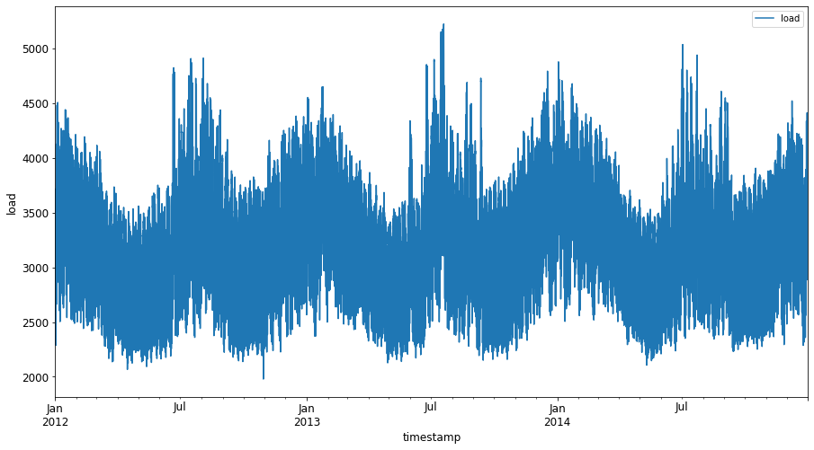
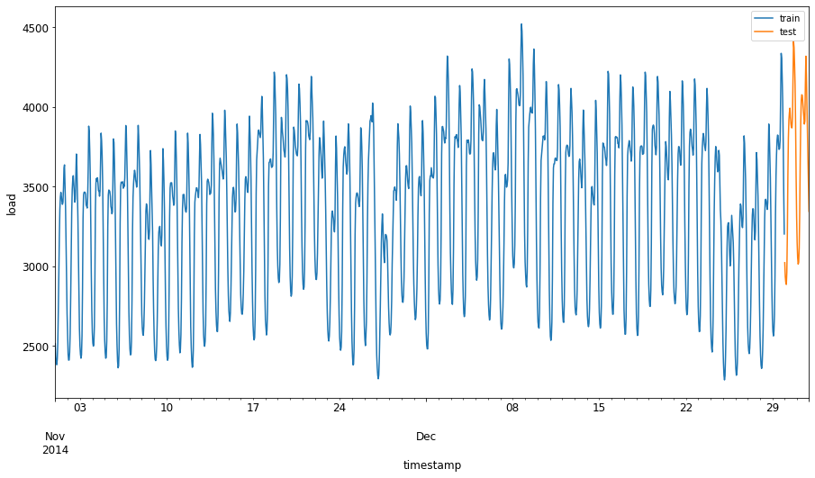
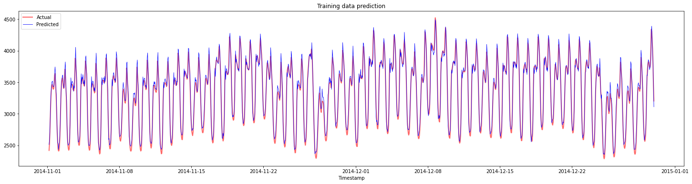
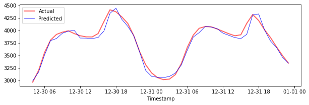

<!--
CO_OP_TRANSLATOR_METADATA:
{
  "original_hash": "f80e513b3279869e7661e3190cc83076",
  "translation_date": "2025-08-29T20:50:19+00:00",
  "source_file": "7-TimeSeries/3-SVR/README.md",
  "language_code": "br"
}
-->
# Previsão de Séries Temporais com Support Vector Regressor

Na lição anterior, você aprendeu como usar o modelo ARIMA para fazer previsões de séries temporais. Agora, você verá o modelo Support Vector Regressor, que é um modelo de regressão usado para prever dados contínuos.

## [Questionário pré-aula](https://gray-sand-07a10f403.1.azurestaticapps.net/quiz/51/) 

## Introdução

Nesta lição, você descobrirá uma maneira específica de construir modelos com [**SVM**: **S**upport **V**ector **M**achine](https://en.wikipedia.org/wiki/Support-vector_machine) para regressão, ou **SVR: Support Vector Regressor**. 

### SVR no contexto de séries temporais [^1]

Antes de entender a importância do SVR na previsão de séries temporais, aqui estão alguns conceitos importantes que você precisa saber:

- **Regressão:** Técnica de aprendizado supervisionado para prever valores contínuos a partir de um conjunto de entradas. A ideia é ajustar uma curva (ou linha) no espaço de características que tenha o maior número de pontos de dados. [Clique aqui](https://en.wikipedia.org/wiki/Regression_analysis) para mais informações.
- **Support Vector Machine (SVM):** Um tipo de modelo de aprendizado supervisionado usado para classificação, regressão e detecção de outliers. O modelo é um hiperplano no espaço de características, que no caso de classificação atua como um limite, e no caso de regressão atua como a linha de melhor ajuste. No SVM, uma função Kernel é geralmente usada para transformar o conjunto de dados em um espaço de maior número de dimensões, para que possam ser facilmente separáveis. [Clique aqui](https://en.wikipedia.org/wiki/Support-vector_machine) para mais informações sobre SVMs.
- **Support Vector Regressor (SVR):** Um tipo de SVM, usado para encontrar a linha de melhor ajuste (que no caso do SVM é um hiperplano) que tenha o maior número de pontos de dados.

### Por que SVR? [^1]

Na última lição, você aprendeu sobre o ARIMA, que é um método estatístico linear muito bem-sucedido para prever dados de séries temporais. No entanto, em muitos casos, os dados de séries temporais apresentam *não-linearidade*, que não pode ser mapeada por modelos lineares. Nesses casos, a capacidade do SVM de considerar a não-linearidade nos dados para tarefas de regressão torna o SVR bem-sucedido na previsão de séries temporais.

## Exercício - construir um modelo SVR

Os primeiros passos para a preparação dos dados são os mesmos da lição anterior sobre [ARIMA](https://github.com/microsoft/ML-For-Beginners/tree/main/7-TimeSeries/2-ARIMA). 

Abra a pasta [_/working_](https://github.com/microsoft/ML-For-Beginners/tree/main/7-TimeSeries/3-SVR/working) nesta lição e encontre o arquivo [_notebook.ipynb_](https://github.com/microsoft/ML-For-Beginners/blob/main/7-TimeSeries/3-SVR/working/notebook.ipynb). [^2]

1. Execute o notebook e importe as bibliotecas necessárias: [^2]

   ```python
   import sys
   sys.path.append('../../')
   ```

   ```python
   import os
   import warnings
   import matplotlib.pyplot as plt
   import numpy as np
   import pandas as pd
   import datetime as dt
   import math
   
   from sklearn.svm import SVR
   from sklearn.preprocessing import MinMaxScaler
   from common.utils import load_data, mape
   ```

2. Carregue os dados do arquivo `/data/energy.csv` em um dataframe do Pandas e visualize-os: [^2]

   ```python
   energy = load_data('../../data')[['load']]
   ```

3. Plote todos os dados de energia disponíveis de janeiro de 2012 a dezembro de 2014: [^2]

   ```python
   energy.plot(y='load', subplots=True, figsize=(15, 8), fontsize=12)
   plt.xlabel('timestamp', fontsize=12)
   plt.ylabel('load', fontsize=12)
   plt.show()
   ```

   

   Agora, vamos construir nosso modelo SVR.

### Criar conjuntos de treinamento e teste

Agora que seus dados estão carregados, você pode separá-los em conjuntos de treino e teste. Em seguida, você remodelará os dados para criar um conjunto de dados baseado em etapas de tempo, que será necessário para o SVR. Você treinará seu modelo no conjunto de treino. Após o treinamento do modelo, você avaliará sua precisão no conjunto de treino, no conjunto de teste e, em seguida, no conjunto de dados completo para verificar o desempenho geral. É necessário garantir que o conjunto de teste cubra um período posterior ao conjunto de treino para evitar que o modelo obtenha informações de períodos futuros [^2] (uma situação conhecida como *Overfitting*).

1. Alocar um período de dois meses, de 1º de setembro a 31 de outubro de 2014, para o conjunto de treino. O conjunto de teste incluirá o período de dois meses de 1º de novembro a 31 de dezembro de 2014: [^2]

   ```python
   train_start_dt = '2014-11-01 00:00:00'
   test_start_dt = '2014-12-30 00:00:00'
   ```

2. Visualize as diferenças: [^2]

   ```python
   energy[(energy.index < test_start_dt) & (energy.index >= train_start_dt)][['load']].rename(columns={'load':'train'}) \
       .join(energy[test_start_dt:][['load']].rename(columns={'load':'test'}), how='outer') \
       .plot(y=['train', 'test'], figsize=(15, 8), fontsize=12)
   plt.xlabel('timestamp', fontsize=12)
   plt.ylabel('load', fontsize=12)
   plt.show()
   ```

   

### Preparar os dados para treinamento

Agora, você precisa preparar os dados para o treinamento, realizando filtragem e escalonamento dos dados. Filtre seu conjunto de dados para incluir apenas os períodos e colunas necessários, e escale para garantir que os dados sejam projetados no intervalo 0,1.

1. Filtre o conjunto de dados original para incluir apenas os períodos mencionados por conjunto e apenas a coluna necessária 'load', além da data: [^2]

   ```python
   train = energy.copy()[(energy.index >= train_start_dt) & (energy.index < test_start_dt)][['load']]
   test = energy.copy()[energy.index >= test_start_dt][['load']]
   
   print('Training data shape: ', train.shape)
   print('Test data shape: ', test.shape)
   ```

   ```output
   Training data shape:  (1416, 1)
   Test data shape:  (48, 1)
   ```
   
2. Escale os dados de treino para estarem no intervalo (0, 1): [^2]

   ```python
   scaler = MinMaxScaler()
   train['load'] = scaler.fit_transform(train)
   ```
   
4. Agora, escale os dados de teste: [^2]

   ```python
   test['load'] = scaler.transform(test)
   ```

### Criar dados com etapas de tempo [^1]

Para o SVR, você transforma os dados de entrada para o formato `[batch, timesteps]`. Assim, você remodela os dados existentes `train_data` e `test_data` de forma que haja uma nova dimensão que se refira às etapas de tempo.

```python
# Converting to numpy arrays
train_data = train.values
test_data = test.values
```

Neste exemplo, usamos `timesteps = 5`. Assim, as entradas para o modelo são os dados das primeiras 4 etapas de tempo, e a saída será os dados da 5ª etapa de tempo.

```python
timesteps=5
```

Convertendo os dados de treino para tensor 2D usando compreensão de listas aninhadas:

```python
train_data_timesteps=np.array([[j for j in train_data[i:i+timesteps]] for i in range(0,len(train_data)-timesteps+1)])[:,:,0]
train_data_timesteps.shape
```

```output
(1412, 5)
```

Convertendo os dados de teste para tensor 2D:

```python
test_data_timesteps=np.array([[j for j in test_data[i:i+timesteps]] for i in range(0,len(test_data)-timesteps+1)])[:,:,0]
test_data_timesteps.shape
```

```output
(44, 5)
```

Selecionando entradas e saídas dos dados de treino e teste:

```python
x_train, y_train = train_data_timesteps[:,:timesteps-1],train_data_timesteps[:,[timesteps-1]]
x_test, y_test = test_data_timesteps[:,:timesteps-1],test_data_timesteps[:,[timesteps-1]]

print(x_train.shape, y_train.shape)
print(x_test.shape, y_test.shape)
```

```output
(1412, 4) (1412, 1)
(44, 4) (44, 1)
```

### Implementar SVR [^1]

Agora, é hora de implementar o SVR. Para saber mais sobre essa implementação, você pode consultar [esta documentação](https://scikit-learn.org/stable/modules/generated/sklearn.svm.SVR.html). Para nossa implementação, seguimos estas etapas:

  1. Definir o modelo chamando `SVR()` e passando os hiperparâmetros do modelo: kernel, gamma, c e epsilon
  2. Preparar o modelo para os dados de treino chamando a função `fit()`
  3. Fazer previsões chamando a função `predict()`

Agora criamos um modelo SVR. Aqui usamos o [kernel RBF](https://scikit-learn.org/stable/modules/svm.html#parameters-of-the-rbf-kernel) e definimos os hiperparâmetros gamma, C e epsilon como 0.5, 10 e 0.05, respectivamente.

```python
model = SVR(kernel='rbf',gamma=0.5, C=10, epsilon = 0.05)
```

#### Ajustar o modelo aos dados de treino [^1]

```python
model.fit(x_train, y_train[:,0])
```

```output
SVR(C=10, cache_size=200, coef0=0.0, degree=3, epsilon=0.05, gamma=0.5,
    kernel='rbf', max_iter=-1, shrinking=True, tol=0.001, verbose=False)
```

#### Fazer previsões com o modelo [^1]

```python
y_train_pred = model.predict(x_train).reshape(-1,1)
y_test_pred = model.predict(x_test).reshape(-1,1)

print(y_train_pred.shape, y_test_pred.shape)
```

```output
(1412, 1) (44, 1)
```

Você construiu seu SVR! Agora precisamos avaliá-lo.

### Avaliar seu modelo [^1]

Para avaliação, primeiro escalaremos os dados de volta para nossa escala original. Em seguida, para verificar o desempenho, plotaremos o gráfico de séries temporais original e previsto, e também imprimiremos o resultado do MAPE.

Escale a saída prevista e original:

```python
# Scaling the predictions
y_train_pred = scaler.inverse_transform(y_train_pred)
y_test_pred = scaler.inverse_transform(y_test_pred)

print(len(y_train_pred), len(y_test_pred))
```

```python
# Scaling the original values
y_train = scaler.inverse_transform(y_train)
y_test = scaler.inverse_transform(y_test)

print(len(y_train), len(y_test))
```

#### Verificar o desempenho do modelo nos dados de treino e teste [^1]

Extraímos os timestamps do conjunto de dados para mostrar no eixo x do nosso gráfico. Observe que estamos usando os primeiros ```timesteps-1``` valores como entrada para a primeira saída, então os timestamps para a saída começarão depois disso.

```python
train_timestamps = energy[(energy.index < test_start_dt) & (energy.index >= train_start_dt)].index[timesteps-1:]
test_timestamps = energy[test_start_dt:].index[timesteps-1:]

print(len(train_timestamps), len(test_timestamps))
```

```output
1412 44
```

Plote as previsões para os dados de treino:

```python
plt.figure(figsize=(25,6))
plt.plot(train_timestamps, y_train, color = 'red', linewidth=2.0, alpha = 0.6)
plt.plot(train_timestamps, y_train_pred, color = 'blue', linewidth=0.8)
plt.legend(['Actual','Predicted'])
plt.xlabel('Timestamp')
plt.title("Training data prediction")
plt.show()
```



Imprima o MAPE para os dados de treino:

```python
print('MAPE for training data: ', mape(y_train_pred, y_train)*100, '%')
```

```output
MAPE for training data: 1.7195710200875551 %
```

Plote as previsões para os dados de teste:

```python
plt.figure(figsize=(10,3))
plt.plot(test_timestamps, y_test, color = 'red', linewidth=2.0, alpha = 0.6)
plt.plot(test_timestamps, y_test_pred, color = 'blue', linewidth=0.8)
plt.legend(['Actual','Predicted'])
plt.xlabel('Timestamp')
plt.show()
```



Imprima o MAPE para os dados de teste:

```python
print('MAPE for testing data: ', mape(y_test_pred, y_test)*100, '%')
```

```output
MAPE for testing data:  1.2623790187854018 %
```

🏆 Você obteve um resultado muito bom no conjunto de dados de teste!

### Verificar o desempenho do modelo no conjunto de dados completo [^1]

```python
# Extracting load values as numpy array
data = energy.copy().values

# Scaling
data = scaler.transform(data)

# Transforming to 2D tensor as per model input requirement
data_timesteps=np.array([[j for j in data[i:i+timesteps]] for i in range(0,len(data)-timesteps+1)])[:,:,0]
print("Tensor shape: ", data_timesteps.shape)

# Selecting inputs and outputs from data
X, Y = data_timesteps[:,:timesteps-1],data_timesteps[:,[timesteps-1]]
print("X shape: ", X.shape,"\nY shape: ", Y.shape)
```

```output
Tensor shape:  (26300, 5)
X shape:  (26300, 4) 
Y shape:  (26300, 1)
```

```python
# Make model predictions
Y_pred = model.predict(X).reshape(-1,1)

# Inverse scale and reshape
Y_pred = scaler.inverse_transform(Y_pred)
Y = scaler.inverse_transform(Y)
```

```python
plt.figure(figsize=(30,8))
plt.plot(Y, color = 'red', linewidth=2.0, alpha = 0.6)
plt.plot(Y_pred, color = 'blue', linewidth=0.8)
plt.legend(['Actual','Predicted'])
plt.xlabel('Timestamp')
plt.show()
```


```python
print('MAPE: ', mape(Y_pred, Y)*100, '%')
```

```output
MAPE:  2.0572089029888656 %
```

🏆 Gráficos muito bons, mostrando um modelo com boa precisão. Parabéns!

---

## 🚀Desafio

- Tente ajustar os hiperparâmetros (gamma, C, epsilon) ao criar o modelo e avalie os dados para ver qual conjunto de hiperparâmetros oferece os melhores resultados no conjunto de dados de teste. Para saber mais sobre esses hiperparâmetros, você pode consultar o documento [aqui](https://scikit-learn.org/stable/modules/svm.html#parameters-of-the-rbf-kernel). 
- Tente usar diferentes funções kernel para o modelo e analise seus desempenhos no conjunto de dados. Um documento útil pode ser encontrado [aqui](https://scikit-learn.org/stable/modules/svm.html#kernel-functions).
- Tente usar diferentes valores para `timesteps` para o modelo observar e fazer previsões.

## [Questionário pós-aula](https://gray-sand-07a10f403.1.azurestaticapps.net/quiz/52/)

## Revisão e Autoestudo

Esta lição foi para introduzir a aplicação do SVR para Previsão de Séries Temporais. Para ler mais sobre SVR, você pode consultar [este blog](https://www.analyticsvidhya.com/blog/2020/03/support-vector-regression-tutorial-for-machine-learning/). Esta [documentação sobre scikit-learn](https://scikit-learn.org/stable/modules/svm.html) fornece uma explicação mais abrangente sobre SVMs em geral, [SVRs](https://scikit-learn.org/stable/modules/svm.html#regression) e também outros detalhes de implementação, como as diferentes [funções kernel](https://scikit-learn.org/stable/modules/svm.html#kernel-functions) que podem ser usadas e seus parâmetros.

## Tarefa

[Um novo modelo SVR](assignment.md)

## Créditos

[^1]: O texto, código e saída nesta seção foram contribuídos por [@AnirbanMukherjeeXD](https://github.com/AnirbanMukherjeeXD)  
[^2]: O texto, código e saída nesta seção foram retirados de [ARIMA](https://github.com/microsoft/ML-For-Beginners/tree/main/7-TimeSeries/2-ARIMA)

---

**Aviso Legal**:  
Este documento foi traduzido utilizando o serviço de tradução por IA [Co-op Translator](https://github.com/Azure/co-op-translator). Embora nos esforcemos para garantir a precisão, esteja ciente de que traduções automatizadas podem conter erros ou imprecisões. O documento original em seu idioma nativo deve ser considerado a fonte autoritativa. Para informações críticas, recomenda-se a tradução profissional realizada por humanos. Não nos responsabilizamos por quaisquer mal-entendidos ou interpretações equivocadas decorrentes do uso desta tradução.