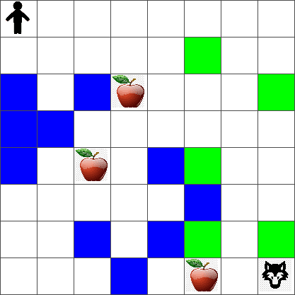
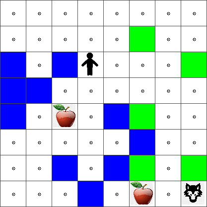

<!--
CO_OP_TRANSLATOR_METADATA:
{
  "original_hash": "0ffe994d1cc881bdeb49226a064116e5",
  "translation_date": "2025-08-29T22:07:39+00:00",
  "source_file": "8-Reinforcement/1-QLearning/README.md",
  "language_code": "br"
}
-->
# Introdução ao Aprendizado por Reforço e Q-Learning


> Sketchnote por [Tomomi Imura](https://www.twitter.com/girlie_mac)

O aprendizado por reforço envolve três conceitos importantes: o agente, alguns estados e um conjunto de ações por estado. Ao executar uma ação em um estado específico, o agente recebe uma recompensa. Imagine novamente o jogo de computador Super Mario. Você é o Mario, está em um nível do jogo, parado ao lado de um penhasco. Acima de você há uma moeda. Você, sendo o Mario, em um nível do jogo, em uma posição específica... esse é o seu estado. Mover um passo para a direita (uma ação) o levará para o penhasco, o que lhe daria uma pontuação numérica baixa. No entanto, pressionar o botão de pular permitiria que você marcasse um ponto e permanecesse vivo. Esse é um resultado positivo e deve lhe conceder uma pontuação numérica positiva.

Usando aprendizado por reforço e um simulador (o jogo), você pode aprender a jogar para maximizar a recompensa, que é permanecer vivo e marcar o maior número de pontos possível.

[](https://www.youtube.com/watch?v=lDq_en8RNOo)

> 🎥 Clique na imagem acima para ouvir Dmitry falar sobre Aprendizado por Reforço

## [Pré-quiz da aula](https://gray-sand-07a10f403.1.azurestaticapps.net/quiz/45/)

## Pré-requisitos e Configuração

Nesta lição, experimentaremos alguns códigos em Python. Você deve ser capaz de executar o código do Jupyter Notebook desta lição, seja no seu computador ou em algum lugar na nuvem.

Você pode abrir [o notebook da lição](https://github.com/microsoft/ML-For-Beginners/blob/main/8-Reinforcement/1-QLearning/notebook.ipynb) e acompanhar esta lição para construir.

> **Nota:** Se você estiver abrindo este código na nuvem, também precisará buscar o arquivo [`rlboard.py`](https://github.com/microsoft/ML-For-Beginners/blob/main/8-Reinforcement/1-QLearning/rlboard.py), que é usado no código do notebook. Adicione-o ao mesmo diretório do notebook.

## Introdução

Nesta lição, exploraremos o mundo de **[Pedro e o Lobo](https://pt.wikipedia.org/wiki/Pedro_e_o_Lobo)**, inspirado por um conto musical de fadas de um compositor russo, [Sergei Prokofiev](https://pt.wikipedia.org/wiki/Sergei_Prokofiev). Usaremos o **Aprendizado por Reforço** para permitir que Pedro explore seu ambiente, colete maçãs saborosas e evite encontrar o lobo.

O **Aprendizado por Reforço** (RL) é uma técnica de aprendizado que nos permite aprender o comportamento ideal de um **agente** em algum **ambiente** realizando muitos experimentos. Um agente nesse ambiente deve ter algum **objetivo**, definido por uma **função de recompensa**.

## O ambiente

Para simplificar, vamos considerar o mundo de Pedro como um tabuleiro quadrado de tamanho `largura` x `altura`, como este:



Cada célula neste tabuleiro pode ser:

* **chão**, onde Pedro e outras criaturas podem andar.
* **água**, onde obviamente não se pode andar.
* uma **árvore** ou **grama**, um lugar onde você pode descansar.
* uma **maçã**, que representa algo que Pedro ficaria feliz em encontrar para se alimentar.
* um **lobo**, que é perigoso e deve ser evitado.

Há um módulo Python separado, [`rlboard.py`](https://github.com/microsoft/ML-For-Beginners/blob/main/8-Reinforcement/1-QLearning/rlboard.py), que contém o código para trabalhar com este ambiente. Como este código não é importante para entender nossos conceitos, importaremos o módulo e o usaremos para criar o tabuleiro de exemplo (bloco de código 1):

```python
from rlboard import *

width, height = 8,8
m = Board(width,height)
m.randomize(seed=13)
m.plot()
```

Este código deve imprimir uma imagem do ambiente semelhante à acima.

## Ações e política

No nosso exemplo, o objetivo de Pedro seria encontrar uma maçã, evitando o lobo e outros obstáculos. Para isso, ele pode essencialmente andar até encontrar uma maçã.

Portanto, em qualquer posição, ele pode escolher entre uma das seguintes ações: para cima, para baixo, para a esquerda e para a direita.

Definiremos essas ações como um dicionário e as mapearemos para pares de alterações de coordenadas correspondentes. Por exemplo, mover para a direita (`R`) corresponderia a um par `(1,0)`. (bloco de código 2):

```python
actions = { "U" : (0,-1), "D" : (0,1), "L" : (-1,0), "R" : (1,0) }
action_idx = { a : i for i,a in enumerate(actions.keys()) }
```

Resumindo, a estratégia e o objetivo deste cenário são os seguintes:

- **A estratégia**, do nosso agente (Pedro) é definida por uma chamada **política**. Uma política é uma função que retorna a ação em qualquer estado dado. No nosso caso, o estado do problema é representado pelo tabuleiro, incluindo a posição atual do jogador.

- **O objetivo**, do aprendizado por reforço é eventualmente aprender uma boa política que nos permita resolver o problema de forma eficiente. No entanto, como base, vamos considerar a política mais simples chamada **caminhada aleatória**.

## Caminhada aleatória

Vamos primeiro resolver nosso problema implementando uma estratégia de caminhada aleatória. Com a caminhada aleatória, escolheremos aleatoriamente a próxima ação entre as ações permitidas, até alcançarmos a maçã (bloco de código 3).

1. Implemente a caminhada aleatória com o código abaixo:

    ```python
    def random_policy(m):
        return random.choice(list(actions))
    
    def walk(m,policy,start_position=None):
        n = 0 # number of steps
        # set initial position
        if start_position:
            m.human = start_position 
        else:
            m.random_start()
        while True:
            if m.at() == Board.Cell.apple:
                return n # success!
            if m.at() in [Board.Cell.wolf, Board.Cell.water]:
                return -1 # eaten by wolf or drowned
            while True:
                a = actions[policy(m)]
                new_pos = m.move_pos(m.human,a)
                if m.is_valid(new_pos) and m.at(new_pos)!=Board.Cell.water:
                    m.move(a) # do the actual move
                    break
            n+=1
    
    walk(m,random_policy)
    ```

    A chamada para `walk` deve retornar o comprimento do caminho correspondente, que pode variar de uma execução para outra.

1. Execute o experimento de caminhada várias vezes (digamos, 100) e imprima as estatísticas resultantes (bloco de código 4):

    ```python
    def print_statistics(policy):
        s,w,n = 0,0,0
        for _ in range(100):
            z = walk(m,policy)
            if z<0:
                w+=1
            else:
                s += z
                n += 1
        print(f"Average path length = {s/n}, eaten by wolf: {w} times")
    
    print_statistics(random_policy)
    ```

    Observe que o comprimento médio de um caminho é em torno de 30-40 passos, o que é bastante, dado que a distância média até a maçã mais próxima é de cerca de 5-6 passos.

    Você também pode ver como é o movimento de Pedro durante a caminhada aleatória:

    

## Função de recompensa

Para tornar nossa política mais inteligente, precisamos entender quais movimentos são "melhores" do que outros. Para isso, precisamos definir nosso objetivo.

O objetivo pode ser definido em termos de uma **função de recompensa**, que retornará algum valor de pontuação para cada estado. Quanto maior o número, melhor a função de recompensa. (bloco de código 5)

```python
move_reward = -0.1
goal_reward = 10
end_reward = -10

def reward(m,pos=None):
    pos = pos or m.human
    if not m.is_valid(pos):
        return end_reward
    x = m.at(pos)
    if x==Board.Cell.water or x == Board.Cell.wolf:
        return end_reward
    if x==Board.Cell.apple:
        return goal_reward
    return move_reward
```

Uma coisa interessante sobre funções de recompensa é que, na maioria dos casos, *só recebemos uma recompensa substancial no final do jogo*. Isso significa que nosso algoritmo deve, de alguma forma, lembrar os "bons" passos que levam a uma recompensa positiva no final e aumentar sua importância. Da mesma forma, todos os movimentos que levam a maus resultados devem ser desencorajados.

## Q-Learning

O algoritmo que discutiremos aqui é chamado de **Q-Learning**. Neste algoritmo, a política é definida por uma função (ou uma estrutura de dados) chamada de **Q-Table**. Ela registra a "qualidade" de cada uma das ações em um estado dado.

É chamada de Q-Table porque muitas vezes é conveniente representá-la como uma tabela ou matriz multidimensional. Como nosso tabuleiro tem dimensões `largura` x `altura`, podemos representar a Q-Table usando um array numpy com forma `largura` x `altura` x `len(actions)`: (bloco de código 6)

```python
Q = np.ones((width,height,len(actions)),dtype=np.float)*1.0/len(actions)
```

Observe que inicializamos todos os valores da Q-Table com um valor igual, no nosso caso - 0.25. Isso corresponde à política de "caminhada aleatória", porque todos os movimentos em cada estado são igualmente bons. Podemos passar a Q-Table para a função `plot` para visualizar a tabela no tabuleiro: `m.plot(Q)`.



No centro de cada célula há uma "seta" que indica a direção preferida de movimento. Como todas as direções são iguais, é exibido um ponto.

Agora precisamos executar a simulação, explorar nosso ambiente e aprender uma melhor distribuição de valores na Q-Table, o que nos permitirá encontrar o caminho para a maçã muito mais rapidamente.

## Essência do Q-Learning: Equação de Bellman

Uma vez que começamos a nos mover, cada ação terá uma recompensa correspondente, ou seja, teoricamente podemos selecionar a próxima ação com base na maior recompensa imediata. No entanto, na maioria dos estados, o movimento não alcançará nosso objetivo de chegar à maçã, e assim não podemos decidir imediatamente qual direção é melhor.

> Lembre-se de que não é o resultado imediato que importa, mas sim o resultado final, que obteremos no final da simulação.

Para levar em conta essa recompensa atrasada, precisamos usar os princípios da **[programação dinâmica](https://pt.wikipedia.org/wiki/Programa%C3%A7%C3%A3o_din%C3%A2mica)**, que nos permitem pensar sobre nosso problema de forma recursiva.

Suponha que estamos agora no estado *s*, e queremos nos mover para o próximo estado *s'*. Ao fazer isso, receberemos a recompensa imediata *r(s,a)*, definida pela função de recompensa, mais alguma recompensa futura. Se supusermos que nossa Q-Table reflete corretamente a "atratividade" de cada ação, então no estado *s'* escolheremos uma ação *a* que corresponda ao valor máximo de *Q(s',a')*. Assim, a melhor recompensa futura possível que poderíamos obter no estado *s* será definida como `max`

## Verificando a política

Como a Q-Table lista a "atratividade" de cada ação em cada estado, é bastante fácil usá-la para definir a navegação eficiente em nosso mundo. No caso mais simples, podemos selecionar a ação correspondente ao maior valor da Q-Table: (bloco de código 9)

```python
def qpolicy_strict(m):
        x,y = m.human
        v = probs(Q[x,y])
        a = list(actions)[np.argmax(v)]
        return a

walk(m,qpolicy_strict)
```

> Se você executar o código acima várias vezes, pode perceber que, às vezes, ele "trava", e você precisa pressionar o botão STOP no notebook para interrompê-lo. Isso acontece porque podem existir situações em que dois estados "apontam" um para o outro em termos de Q-Value ótimo, fazendo com que o agente fique se movendo entre esses estados indefinidamente.

## 🚀Desafio

> **Tarefa 1:** Modifique a função `walk` para limitar o comprimento máximo do caminho a um certo número de passos (digamos, 100) e observe o código acima retornar esse valor de tempos em tempos.

> **Tarefa 2:** Modifique a função `walk` para que ela não volte aos lugares onde já esteve anteriormente. Isso evitará que `walk` entre em um loop, no entanto, o agente ainda pode acabar "preso" em um local do qual não consegue escapar.

## Navegação

Uma política de navegação melhor seria aquela que usamos durante o treinamento, que combina exploração e aproveitamento. Nessa política, selecionamos cada ação com uma certa probabilidade, proporcional aos valores na Q-Table. Essa estratégia ainda pode fazer com que o agente volte a uma posição já explorada, mas, como você pode ver no código abaixo, resulta em um caminho médio muito curto até o local desejado (lembre-se de que `print_statistics` executa a simulação 100 vezes): (bloco de código 10)

```python
def qpolicy(m):
        x,y = m.human
        v = probs(Q[x,y])
        a = random.choices(list(actions),weights=v)[0]
        return a

print_statistics(qpolicy)
```

Após executar este código, você deve obter um comprimento médio de caminho muito menor do que antes, na faixa de 3-6.

## Investigando o processo de aprendizado

Como mencionamos, o processo de aprendizado é um equilíbrio entre exploração e aproveitamento do conhecimento adquirido sobre a estrutura do espaço do problema. Vimos que os resultados do aprendizado (a capacidade de ajudar um agente a encontrar um caminho curto até o objetivo) melhoraram, mas também é interessante observar como o comprimento médio do caminho se comporta durante o processo de aprendizado:

## Os aprendizados podem ser resumidos como:

- **O comprimento médio do caminho aumenta**. O que vemos aqui é que, no início, o comprimento médio do caminho aumenta. Isso provavelmente ocorre porque, quando não sabemos nada sobre o ambiente, é mais provável que fiquemos presos em estados ruins, como água ou lobo. À medida que aprendemos mais e começamos a usar esse conhecimento, conseguimos explorar o ambiente por mais tempo, mas ainda não sabemos muito bem onde estão as maçãs.

- **O comprimento do caminho diminui à medida que aprendemos mais**. Uma vez que aprendemos o suficiente, torna-se mais fácil para o agente alcançar o objetivo, e o comprimento do caminho começa a diminuir. No entanto, ainda estamos abertos à exploração, então frequentemente nos desviamos do melhor caminho e exploramos novas opções, tornando o caminho mais longo do que o ideal.

- **O comprimento aumenta abruptamente**. O que também observamos nesse gráfico é que, em algum momento, o comprimento aumentou abruptamente. Isso indica a natureza estocástica do processo e que, em algum momento, podemos "estragar" os coeficientes da Q-Table ao sobrescrevê-los com novos valores. Isso idealmente deve ser minimizado diminuindo a taxa de aprendizado (por exemplo, no final do treinamento, ajustamos os valores da Q-Table apenas por um pequeno valor).

No geral, é importante lembrar que o sucesso e a qualidade do processo de aprendizado dependem significativamente de parâmetros, como taxa de aprendizado, decaimento da taxa de aprendizado e fator de desconto. Esses parâmetros são frequentemente chamados de **hiperparâmetros**, para distingui-los dos **parâmetros**, que otimizamos durante o treinamento (por exemplo, os coeficientes da Q-Table). O processo de encontrar os melhores valores de hiperparâmetros é chamado de **otimização de hiperparâmetros**, e isso merece um tópico à parte.

## [Quiz pós-aula](https://gray-sand-07a10f403.1.azurestaticapps.net/quiz/46/)

## Tarefa 
[Um Mundo Mais Realista](assignment.md)

---

**Aviso Legal**:  
Este documento foi traduzido utilizando o serviço de tradução por IA [Co-op Translator](https://github.com/Azure/co-op-translator). Embora nos esforcemos para garantir a precisão, esteja ciente de que traduções automatizadas podem conter erros ou imprecisões. O documento original em seu idioma nativo deve ser considerado a fonte autoritativa. Para informações críticas, recomenda-se a tradução profissional realizada por humanos. Não nos responsabilizamos por quaisquer mal-entendidos ou interpretações equivocadas decorrentes do uso desta tradução.