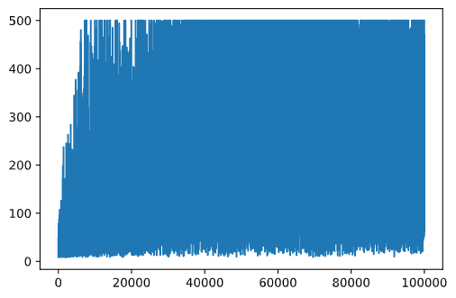

<!--
CO_OP_TRANSLATOR_METADATA:
{
  "original_hash": "9660fbd80845c59c15715cb418cd6e23",
  "translation_date": "2025-08-29T22:14:26+00:00",
  "source_file": "8-Reinforcement/2-Gym/README.md",
  "language_code": "br"
}
-->
## Pré-requisitos

Nesta lição, utilizaremos uma biblioteca chamada **OpenAI Gym** para simular diferentes **ambientes**. Você pode executar o código desta lição localmente (por exemplo, no Visual Studio Code), caso em que a simulação será aberta em uma nova janela. Ao executar o código online, pode ser necessário fazer alguns ajustes no código, conforme descrito [aqui](https://towardsdatascience.com/rendering-openai-gym-envs-on-binder-and-google-colab-536f99391cc7).

## OpenAI Gym

Na lição anterior, as regras do jogo e o estado eram definidos pela classe `Board`, que criamos manualmente. Aqui, utilizaremos um **ambiente de simulação** especial, que simulará a física por trás do equilíbrio do pêndulo. Um dos ambientes de simulação mais populares para treinar algoritmos de aprendizado por reforço é chamado de [Gym](https://gym.openai.com/), mantido pela [OpenAI](https://openai.com/). Usando este Gym, podemos criar diferentes **ambientes**, desde simulações de pêndulos até jogos de Atari.

> **Nota**: Você pode ver outros ambientes disponíveis no OpenAI Gym [aqui](https://gym.openai.com/envs/#classic_control).

Primeiro, vamos instalar o Gym e importar as bibliotecas necessárias (bloco de código 1):

```python
import sys
!{sys.executable} -m pip install gym 

import gym
import matplotlib.pyplot as plt
import numpy as np
import random
```

## Exercício - inicializar um ambiente de CartPole

Para trabalhar com o problema de equilíbrio do pêndulo, precisamos inicializar o ambiente correspondente. Cada ambiente está associado a:

- **Espaço de observação**, que define a estrutura das informações que recebemos do ambiente. No problema do pêndulo, recebemos a posição do pêndulo, a velocidade e outros valores.

- **Espaço de ação**, que define as ações possíveis. No nosso caso, o espaço de ação é discreto e consiste em duas ações: **esquerda** e **direita**. (bloco de código 2)

1. Para inicializar, digite o seguinte código:

    ```python
    env = gym.make("CartPole-v1")
    print(env.action_space)
    print(env.observation_space)
    print(env.action_space.sample())
    ```

Para entender como o ambiente funciona, vamos executar uma simulação curta de 100 passos. Em cada passo, fornecemos uma das ações a serem realizadas - nesta simulação, selecionamos aleatoriamente uma ação do `action_space`.

1. Execute o código abaixo e veja o que acontece.

    ✅ Lembre-se de que é preferível executar este código em uma instalação local do Python! (bloco de código 3)

    ```python
    env.reset()
    
    for i in range(100):
       env.render()
       env.step(env.action_space.sample())
    env.close()
    ```

    Você deve ver algo semelhante a esta imagem:

    

1. Durante a simulação, precisamos obter observações para decidir como agir. Na verdade, a função step retorna as observações atuais, uma função de recompensa e um indicador `done` que mostra se faz sentido continuar a simulação ou não: (bloco de código 4)

    ```python
    env.reset()
    
    done = False
    while not done:
       env.render()
       obs, rew, done, info = env.step(env.action_space.sample())
       print(f"{obs} -> {rew}")
    env.close()
    ```

    Você verá algo como isto na saída do notebook:

    ```text
    [ 0.03403272 -0.24301182  0.02669811  0.2895829 ] -> 1.0
    [ 0.02917248 -0.04828055  0.03248977  0.00543839] -> 1.0
    [ 0.02820687  0.14636075  0.03259854 -0.27681916] -> 1.0
    [ 0.03113408  0.34100283  0.02706215 -0.55904489] -> 1.0
    [ 0.03795414  0.53573468  0.01588125 -0.84308041] -> 1.0
    ...
    [ 0.17299878  0.15868546 -0.20754175 -0.55975453] -> 1.0
    [ 0.17617249  0.35602306 -0.21873684 -0.90998894] -> 1.0
    ```

    O vetor de observação retornado em cada passo da simulação contém os seguintes valores:
    - Posição do carrinho
    - Velocidade do carrinho
    - Ângulo do pêndulo
    - Taxa de rotação do pêndulo

1. Obtenha os valores mínimos e máximos desses números: (bloco de código 5)

    ```python
    print(env.observation_space.low)
    print(env.observation_space.high)
    ```

    Você também pode notar que o valor da recompensa em cada passo da simulação é sempre 1. Isso ocorre porque nosso objetivo é sobreviver o maior tempo possível, ou seja, manter o pêndulo em uma posição razoavelmente vertical pelo maior período de tempo.

    ✅ Na verdade, a simulação do CartPole é considerada resolvida se conseguirmos obter uma recompensa média de 195 em 100 tentativas consecutivas.

## Discretização do estado

No Q-Learning, precisamos construir uma Q-Table que define o que fazer em cada estado. Para isso, o estado precisa ser **discreto**, ou seja, deve conter um número finito de valores discretos. Assim, precisamos de alguma forma **discretizar** nossas observações, mapeando-as para um conjunto finito de estados.

Existem algumas maneiras de fazer isso:

- **Dividir em intervalos**. Se conhecemos o intervalo de um determinado valor, podemos dividi-lo em um número de **intervalos** e, em seguida, substituir o valor pelo número do intervalo ao qual ele pertence. Isso pode ser feito usando o método [`digitize`](https://numpy.org/doc/stable/reference/generated/numpy.digitize.html) do numpy. Nesse caso, saberemos exatamente o tamanho do estado, pois ele dependerá do número de intervalos que selecionarmos para a digitalização.

✅ Podemos usar interpolação linear para trazer os valores para algum intervalo finito (por exemplo, de -20 a 20) e, em seguida, converter os números em inteiros arredondando-os. Isso nos dá um pouco menos de controle sobre o tamanho do estado, especialmente se não conhecermos os intervalos exatos dos valores de entrada. Por exemplo, no nosso caso, 2 dos 4 valores não têm limites superiores/inferiores, o que pode resultar em um número infinito de estados.

No nosso exemplo, usaremos a segunda abordagem. Como você pode notar mais tarde, apesar de os valores não terem limites definidos, eles raramente assumem valores fora de certos intervalos finitos, tornando os estados com valores extremos muito raros.

1. Aqui está a função que pegará a observação do nosso modelo e produzirá uma tupla de 4 valores inteiros: (bloco de código 6)

    ```python
    def discretize(x):
        return tuple((x/np.array([0.25, 0.25, 0.01, 0.1])).astype(np.int))
    ```

1. Vamos também explorar outro método de discretização usando intervalos: (bloco de código 7)

    ```python
    def create_bins(i,num):
        return np.arange(num+1)*(i[1]-i[0])/num+i[0]
    
    print("Sample bins for interval (-5,5) with 10 bins\n",create_bins((-5,5),10))
    
    ints = [(-5,5),(-2,2),(-0.5,0.5),(-2,2)] # intervals of values for each parameter
    nbins = [20,20,10,10] # number of bins for each parameter
    bins = [create_bins(ints[i],nbins[i]) for i in range(4)]
    
    def discretize_bins(x):
        return tuple(np.digitize(x[i],bins[i]) for i in range(4))
    ```

1. Agora, execute uma simulação curta e observe esses valores discretos do ambiente. Sinta-se à vontade para testar tanto `discretize` quanto `discretize_bins` e veja se há alguma diferença.

    ✅ `discretize_bins` retorna o número do intervalo, que começa em 0. Assim, para valores da variável de entrada próximos de 0, ele retorna o número do meio do intervalo (10). Em `discretize`, não nos preocupamos com o intervalo dos valores de saída, permitindo que sejam negativos, de modo que os valores do estado não são deslocados, e 0 corresponde a 0. (bloco de código 8)

    ```python
    env.reset()
    
    done = False
    while not done:
       #env.render()
       obs, rew, done, info = env.step(env.action_space.sample())
       #print(discretize_bins(obs))
       print(discretize(obs))
    env.close()
    ```

    ✅ Descomente a linha que começa com `env.render` se quiser ver como o ambiente é executado. Caso contrário, você pode executá-lo em segundo plano, o que é mais rápido. Usaremos essa execução "invisível" durante nosso processo de Q-Learning.

## Estrutura da Q-Table

Na lição anterior, o estado era um simples par de números de 0 a 8, e, portanto, era conveniente representar a Q-Table como um tensor numpy com formato 8x8x2. Se usarmos a discretização por intervalos, o tamanho do nosso vetor de estado também será conhecido, então podemos usar a mesma abordagem e representar o estado como um array com formato 20x20x10x10x2 (aqui, 2 é a dimensão do espaço de ação, e as primeiras dimensões correspondem ao número de intervalos que selecionamos para cada parâmetro no espaço de observação).

No entanto, às vezes as dimensões precisas do espaço de observação não são conhecidas. No caso da função `discretize`, nunca podemos ter certeza de que nosso estado permanecerá dentro de certos limites, porque alguns dos valores originais não têm limites. Assim, usaremos uma abordagem ligeiramente diferente e representaremos a Q-Table como um dicionário.

1. Use o par *(state, action)* como chave do dicionário, e o valor corresponderá ao valor da entrada na Q-Table. (bloco de código 9)

    ```python
    Q = {}
    actions = (0,1)
    
    def qvalues(state):
        return [Q.get((state,a),0) for a in actions]
    ```

    Aqui também definimos uma função `qvalues()`, que retorna uma lista de valores da Q-Table para um estado dado que corresponde a todas as ações possíveis. Se a entrada não estiver presente na Q-Table, retornaremos 0 como padrão.

## Vamos começar o Q-Learning

Agora estamos prontos para ensinar Peter a equilibrar!

1. Primeiro, vamos definir alguns hiperparâmetros: (bloco de código 10)

    ```python
    # hyperparameters
    alpha = 0.3
    gamma = 0.9
    epsilon = 0.90
    ```

    Aqui, `alpha` é a **taxa de aprendizado**, que define em que medida devemos ajustar os valores atuais da Q-Table em cada passo. Na lição anterior, começamos com 1 e depois reduzimos `alpha` para valores menores durante o treinamento. Neste exemplo, manteremos constante apenas para simplificar, e você pode experimentar ajustar os valores de `alpha` mais tarde.

    `gamma` é o **fator de desconto**, que mostra em que medida devemos priorizar a recompensa futura em relação à recompensa atual.

    `epsilon` é o **fator de exploração/exploração**, que determina se devemos preferir explorar ou explorar mais. Em nosso algoritmo, em `epsilon` por cento dos casos, selecionaremos a próxima ação de acordo com os valores da Q-Table, e no restante dos casos executaremos uma ação aleatória. Isso nos permitirá explorar áreas do espaço de busca que nunca vimos antes.

    ✅ Em termos de equilíbrio - escolher uma ação aleatória (exploração) agiria como um empurrão aleatório na direção errada, e o pêndulo teria que aprender a recuperar o equilíbrio desses "erros".

### Melhorar o algoritmo

Podemos também fazer duas melhorias no nosso algoritmo da lição anterior:

- **Calcular a recompensa cumulativa média**, ao longo de várias simulações. Imprimiremos o progresso a cada 5000 iterações e faremos a média da recompensa cumulativa nesse período de tempo. Isso significa que, se obtivermos mais de 195 pontos, podemos considerar o problema resolvido, com qualidade ainda maior do que a exigida.

- **Calcular o resultado cumulativo médio máximo**, `Qmax`, e armazenaremos a Q-Table correspondente a esse resultado. Quando você executar o treinamento, notará que, às vezes, o resultado cumulativo médio começa a cair, e queremos manter os valores da Q-Table que correspondem ao melhor modelo observado durante o treinamento.

1. Colete todas as recompensas cumulativas em cada simulação no vetor `rewards` para posterior plotagem. (bloco de código 11)

    ```python
    def probs(v,eps=1e-4):
        v = v-v.min()+eps
        v = v/v.sum()
        return v
    
    Qmax = 0
    cum_rewards = []
    rewards = []
    for epoch in range(100000):
        obs = env.reset()
        done = False
        cum_reward=0
        # == do the simulation ==
        while not done:
            s = discretize(obs)
            if random.random()<epsilon:
                # exploitation - chose the action according to Q-Table probabilities
                v = probs(np.array(qvalues(s)))
                a = random.choices(actions,weights=v)[0]
            else:
                # exploration - randomly chose the action
                a = np.random.randint(env.action_space.n)
    
            obs, rew, done, info = env.step(a)
            cum_reward+=rew
            ns = discretize(obs)
            Q[(s,a)] = (1 - alpha) * Q.get((s,a),0) + alpha * (rew + gamma * max(qvalues(ns)))
        cum_rewards.append(cum_reward)
        rewards.append(cum_reward)
        # == Periodically print results and calculate average reward ==
        if epoch%5000==0:
            print(f"{epoch}: {np.average(cum_rewards)}, alpha={alpha}, epsilon={epsilon}")
            if np.average(cum_rewards) > Qmax:
                Qmax = np.average(cum_rewards)
                Qbest = Q
            cum_rewards=[]
    ```

O que você pode notar a partir desses resultados:

- **Perto do nosso objetivo**. Estamos muito próximos de alcançar o objetivo de obter 195 recompensas cumulativas em mais de 100 execuções consecutivas da simulação, ou talvez já tenhamos alcançado! Mesmo que obtenhamos números menores, ainda não sabemos, porque fazemos a média em 5000 execuções, e apenas 100 execuções são necessárias no critério formal.

- **A recompensa começa a cair**. Às vezes, a recompensa começa a cair, o que significa que podemos "destruir" valores já aprendidos na Q-Table com novos valores que pioram a situação.

Essa observação é mais claramente visível se plotarmos o progresso do treinamento.

## Plotando o progresso do treinamento

Durante o treinamento, coletamos o valor da recompensa cumulativa em cada uma das iterações no vetor `rewards`. Veja como ele fica quando o plotamos contra o número de iterações:

```python
plt.plot(rewards)
```



A partir deste gráfico, não é possível dizer muita coisa, porque, devido à natureza do processo de treinamento estocástico, a duração das sessões de treinamento varia muito. Para dar mais sentido a este gráfico, podemos calcular a **média móvel** ao longo de uma série de experimentos, digamos 100. Isso pode ser feito convenientemente usando `np.convolve`: (bloco de código 12)

```python
def running_average(x,window):
    return np.convolve(x,np.ones(window)/window,mode='valid')

plt.plot(running_average(rewards,100))
```


## Variando os hiperparâmetros

Para tornar o aprendizado mais estável, faz sentido ajustar alguns de nossos hiperparâmetros durante o treinamento. Em particular:

- **Para a taxa de aprendizado**, `alpha`, podemos começar com valores próximos de 1 e, em seguida, diminuir o parâmetro gradualmente. Com o tempo, obteremos boas probabilidades na Q-Table, e, assim, devemos ajustá-las levemente, em vez de sobrescrevê-las completamente com novos valores.

- **Aumentar epsilon**. Podemos querer aumentar o `epsilon` lentamente, para explorar menos e explorar mais. Provavelmente faz sentido começar com um valor menor de `epsilon` e aumentá-lo gradualmente até quase 1.
> **Tarefa 1**: Experimente ajustar os valores dos hiperparâmetros e veja se consegue alcançar uma recompensa acumulada maior. Você está conseguindo acima de 195?
> **Tarefa 2**: Para resolver formalmente o problema, você precisa alcançar uma recompensa média de 195 em 100 execuções consecutivas. Meça isso durante o treinamento e certifique-se de que você resolveu o problema formalmente!

## Vendo o resultado em ação

Seria interessante realmente ver como o modelo treinado se comporta. Vamos rodar a simulação e seguir a mesma estratégia de seleção de ações usada durante o treinamento, amostrando de acordo com a distribuição de probabilidade na Q-Table: (bloco de código 13)

```python
obs = env.reset()
done = False
while not done:
   s = discretize(obs)
   env.render()
   v = probs(np.array(qvalues(s)))
   a = random.choices(actions,weights=v)[0]
   obs,_,done,_ = env.step(a)
env.close()
```

Você deve ver algo como isto:


---

## 🚀Desafio

> **Tarefa 3**: Aqui, estávamos usando a cópia final da Q-Table, que pode não ser a melhor. Lembre-se de que armazenamos a Q-Table com melhor desempenho na variável `Qbest`! Tente o mesmo exemplo com a Q-Table de melhor desempenho copiando `Qbest` para `Q` e veja se você percebe alguma diferença.

> **Tarefa 4**: Aqui, não estávamos selecionando a melhor ação em cada passo, mas sim amostrando com a distribuição de probabilidade correspondente. Faria mais sentido sempre selecionar a melhor ação, com o maior valor na Q-Table? Isso pode ser feito usando a função `np.argmax` para descobrir o número da ação correspondente ao maior valor na Q-Table. Implemente essa estratégia e veja se isso melhora o equilíbrio.

## [Quiz pós-aula](https://gray-sand-07a10f403.1.azurestaticapps.net/quiz/48/)

## Tarefa
[Treine um Mountain Car](assignment.md)

## Conclusão

Agora aprendemos como treinar agentes para alcançar bons resultados apenas fornecendo a eles uma função de recompensa que define o estado desejado do jogo e dando-lhes a oportunidade de explorar inteligentemente o espaço de busca. Aplicamos com sucesso o algoritmo de Q-Learning nos casos de ambientes discretos e contínuos, mas com ações discretas.

É importante também estudar situações em que o estado das ações também é contínuo e quando o espaço de observação é muito mais complexo, como a imagem da tela de um jogo Atari. Nesses problemas, muitas vezes precisamos usar técnicas de aprendizado de máquina mais poderosas, como redes neurais, para alcançar bons resultados. Esses tópicos mais avançados serão abordados em nosso próximo curso de IA avançada.

---

**Aviso Legal**:  
Este documento foi traduzido utilizando o serviço de tradução por IA [Co-op Translator](https://github.com/Azure/co-op-translator). Embora nos esforcemos para garantir a precisão, esteja ciente de que traduções automatizadas podem conter erros ou imprecisões. O documento original em seu idioma nativo deve ser considerado a fonte autoritativa. Para informações críticas, recomenda-se a tradução profissional realizada por humanos. Não nos responsabilizamos por quaisquer mal-entendidos ou interpretações equivocadas decorrentes do uso desta tradução.