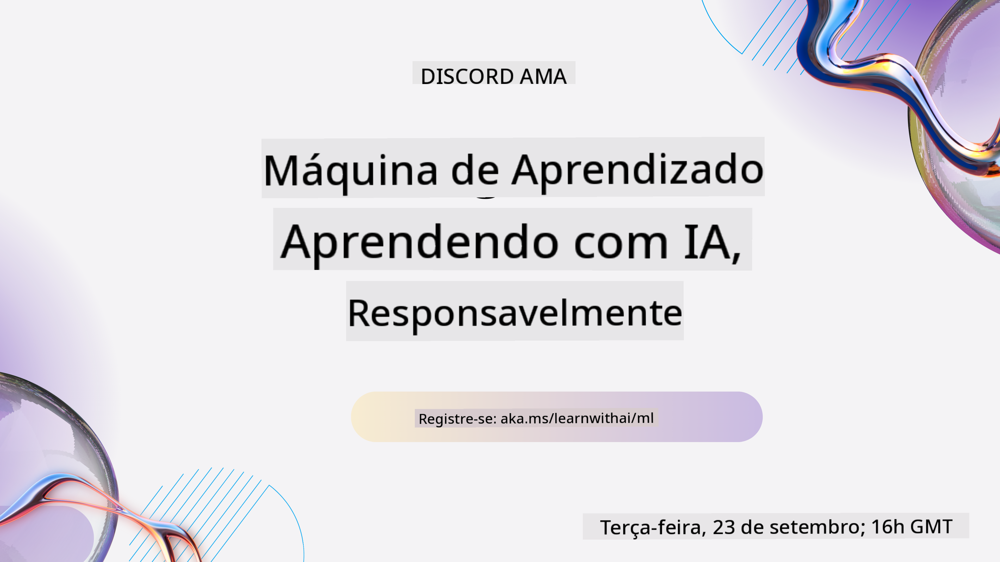

<!--
CO_OP_TRANSLATOR_METADATA:
{
  "original_hash": "735a01983e2c4c2b2698d0cee2c19d7a",
  "translation_date": "2025-10-11T10:40:34+00:00",
  "source_file": "README.md",
  "language_code": "br"
}
-->
  
  
  
  
  

  
  
  

### 🌐 Suporte Multilíngue

#### Suporte via GitHub Action (Automatizado e Sempre Atualizado)

<!-- TABELA DE LÍNGUAS DO TRADUTOR CO-OP INÍCIO -->
[Árabe](../ar/README.md) | [Bengali](../bn/README.md) | [Búlgaro](../bg/README.md) | [Birmanês (Myanmar)](../my/README.md) | [Chinês (Simplificado)](../zh/README.md) | [Chinês (Tradicional, Hong Kong)](../hk/README.md) | [Chinês (Tradicional, Macau)](../mo/README.md) | [Chinês (Tradicional, Taiwan)](../tw/README.md) | [Croata](../hr/README.md) | [Tcheco](../cs/README.md) | [Dinamarquês](../da/README.md) | [Holandês](../nl/README.md) | [Estoniano](../et/README.md) | [Finlandês](../fi/README.md) | [Francês](../fr/README.md) | [Alemão](../de/README.md) | [Grego](../el/README.md) | [Hebraico](../he/README.md) | [Hindi](../hi/README.md) | [Húngaro](../hu/README.md) | [Indonésio](../id/README.md) | [Italiano](../it/README.md) | [Japonês](../ja/README.md) | [Coreano](../ko/README.md) | [Lituano](../lt/README.md) | [Malaio](../ms/README.md) | [Marathi](../mr/README.md) | [Nepalês](../ne/README.md) | [Norueguês](../no/README.md) | [Persa (Farsi)](../fa/README.md) | [Polonês](../pl/README.md) | [Português (Brasil)](./README.md) | [Português (Portugal)](../pt/README.md) | [Punjabi (Gurmukhi)](../pa/README.md) | [Romeno](../ro/README.md) | [Russo](../ru/README.md) | [Sérvio (Cirílico)](../sr/README.md) | [Eslovaco](../sk/README.md) | [Esloveno](../sl/README.md) | [Espanhol](../es/README.md) | [Suaíli](../sw/README.md) | [Sueco](../sv/README.md) | [Tagalo (Filipino)](../tl/README.md) | [Tâmil](../ta/README.md) | [Tailandês](../th/README.md) | [Turco](../tr/README.md) | [Ucraniano](../uk/README.md) | [Urdu](../ur/README.md) | [Vietnamita](../vi/README.md)  
<!-- TABELA DE LÍNGUAS DO TRADUTOR CO-OP FIM -->

#### Junte-se à Nossa Comunidade

Estamos realizando uma série de aprendizado no Discord com IA. Saiba mais e junte-se a nós no [Learn with AI Series](https://aka.ms/learnwithai/discord) de 18 a 30 de setembro de 2025. Você aprenderá dicas e truques para usar o GitHub Copilot em Ciência de Dados.

# Machine Learning para Iniciantes - Um Currículo

> 🌍 Viaje pelo mundo enquanto exploramos Machine Learning por meio de culturas globais 🌍

Os Cloud Advocates da Microsoft têm o prazer de oferecer um currículo de 12 semanas e 26 aulas sobre **Machine Learning**. Neste curso, você aprenderá sobre o que às vezes é chamado de **machine learning clássico**, utilizando principalmente a biblioteca Scikit-learn e evitando o aprendizado profundo, que é abordado em nosso [currículo de IA para Iniciantes](https://aka.ms/ai4beginners). Combine essas aulas com nosso [currículo de Ciência de Dados para Iniciantes](https://aka.ms/ds4beginners), também!

Viaje conosco pelo mundo enquanto aplicamos essas técnicas clássicas a dados de várias regiões do globo. Cada aula inclui questionários antes e depois da aula, instruções escritas para completar a lição, uma solução, uma tarefa e muito mais. Nossa pedagogia baseada em projetos permite que você aprenda enquanto constrói, uma maneira comprovada de fixar novos conhecimentos.

**✍️ Agradecimentos especiais aos nossos autores** Jen Looper, Stephen Howell, Francesca Lazzeri, Tomomi Imura, Cassie Breviu, Dmitry Soshnikov, Chris Noring, Anirban Mukherjee, Ornella Altunyan, Ruth Yakubu e Amy Boyd  

**🎨 Agradecimentos também aos nossos ilustradores** Tomomi Imura, Dasani Madipalli e Jen Looper  

**🙏 Agradecimentos especiais 🙏 aos nossos autores, revisores e colaboradores de conteúdo Microsoft Student Ambassador**, notavelmente Rishit Dagli, Muhammad Sakib Khan Inan, Rohan Raj, Alexandru Petrescu, Abhishek Jaiswal, Nawrin Tabassum, Ioan Samuila e Snigdha Agarwal  

**🤩 Gratidão extra aos Microsoft Student Ambassadors Eric Wanjau, Jasleen Sondhi e Vidushi Gupta pelas nossas aulas de R!**

# Começando

Siga estes passos:  
1. **Faça um Fork do Repositório**: Clique no botão "Fork" no canto superior direito desta página.  
2. **Clone o Repositório**: `git clone https://github.com/microsoft/ML-For-Beginners.git`  

> [Encontre todos os recursos adicionais para este curso em nossa coleção no Microsoft Learn](https://learn.microsoft.com/en-us/collections/qrqzamz1nn2wx3?WT.mc_id=academic-77952-bethanycheum)  

> 🔧 **Precisa de ajuda?** Confira nosso [Guia de Solução de Problemas](TROUBLESHOOTING.md) para soluções de problemas comuns com instalação, configuração e execução das aulas.

**[Estudantes](https://aka.ms/student-page)**, para usar este currículo, faça um fork do repositório inteiro para sua própria conta do GitHub e complete os exercícios sozinho ou em grupo:

- Comece com um questionário pré-aula.  
- Leia a aula e complete as atividades, pausando e refletindo em cada verificação de conhecimento.  
- Tente criar os projetos compreendendo as lições em vez de apenas executar o código da solução; no entanto, esse código está disponível nas pastas `/solution` em cada lição baseada em projeto.  
- Faça o questionário pós-aula.  
- Complete o desafio.  
- Complete a tarefa.  
- Após concluir um grupo de lições, visite o [Fórum de Discussão](https://github.com/microsoft/ML-For-Beginners/discussions) e "aprenda em voz alta" preenchendo a rubrica PAT apropriada. Um 'PAT' é uma Ferramenta de Avaliação de Progresso que é uma rubrica que você preenche para aprofundar seu aprendizado. Você também pode reagir a outros PATs para aprendermos juntos.

> Para estudos adicionais, recomendamos seguir esses módulos e trilhas de aprendizado do [Microsoft Learn](https://docs.microsoft.com/en-us/users/jenlooper-2911/collections/k7o7tg1gp306q4?WT.mc_id=academic-77952-leestott).

**Professores**, incluímos [algumas sugestões](for-teachers.md) sobre como usar este currículo.

---

## Vídeos explicativos

Algumas das aulas estão disponíveis em formato de vídeo curto. Você pode encontrar todos eles integrados nas aulas ou na [playlist ML for Beginners no canal Microsoft Developer no YouTube](https://aka.ms/ml-beginners-videos) clicando na imagem abaixo.

---

## Conheça a Equipe

**Gif por** [Mohit Jaisal](https://linkedin.com/in/mohitjaisal)

> 🎥 Clique na imagem acima para assistir a um vídeo sobre o projeto e as pessoas que o criaram!

---

## Pedagogia

Escolhemos dois princípios pedagógicos ao construir este currículo: garantir que ele seja **baseado em projetos práticos** e que inclua **questionários frequentes**. Além disso, este currículo possui um **tema comum** para dar coesão ao conteúdo.

Ao alinhar o conteúdo com projetos, o processo se torna mais envolvente para os estudantes e a retenção dos conceitos é aumentada. Além disso, um questionário de baixa pressão antes da aula direciona a atenção do estudante para o aprendizado de um tópico, enquanto um segundo questionário após a aula garante uma maior retenção. Este currículo foi projetado para ser flexível e divertido, podendo ser realizado total ou parcialmente. Os projetos começam pequenos e se tornam progressivamente mais complexos ao longo do ciclo de 12 semanas. Este currículo também inclui um posfácio sobre aplicações reais de ML, que pode ser usado como crédito extra ou como base para discussões.

> Encontre nosso [Código de Conduta](CODE_OF_CONDUCT.md), [Contribuições](CONTRIBUTING.md), [Traduções](TRANSLATIONS.md) e diretrizes de [Solução de Problemas](TROUBLESHOOTING.md). Agradecemos seu feedback construtivo!

## Cada aula inclui

- Sketchnote opcional  
- Vídeo complementar opcional  
- Vídeo explicativo (apenas algumas aulas)  
- [Questionário de aquecimento pré-aula](https://ff-quizzes.netlify.app/en/ml/)  
- Aula escrita  
- Para aulas baseadas em projetos, guias passo a passo sobre como construir o projeto  
- Verificações de conhecimento  
- Um desafio  
- Leituras complementares  
- Tarefa  
- [Questionário pós-aula](https://ff-quizzes.netlify.app/en/ml/)  

> **Nota sobre os idiomas**: Estas aulas são escritas principalmente em Python, mas muitas também estão disponíveis em R. Para completar uma aula em R, vá até a pasta `/solution` e procure pelas aulas em R. Elas incluem uma extensão .rmd que representa um arquivo **R Markdown**, que pode ser definido como uma incorporação de `blocos de código` (de R ou outras linguagens) e um `cabeçalho YAML` (que orienta como formatar saídas como PDF) em um `documento Markdown`. Assim, serve como uma estrutura de autoria exemplar para ciência de dados, pois permite combinar seu código, seus resultados e seus pensamentos, permitindo que você os registre em Markdown. Além disso, documentos R Markdown podem ser renderizados em formatos de saída como PDF, HTML ou Word.

> **Nota sobre os questionários**: Todos os questionários estão contidos na [pasta Quiz App](../../quiz-app), totalizando 52 questionários com três perguntas cada. Eles estão vinculados dentro das aulas, mas o aplicativo de questionários pode ser executado localmente; siga as instruções na pasta `quiz-app` para hospedar localmente ou implantar no Azure.

| Número da Aula |                             Tópico                              |                   Agrupamento de Aulas                   | Objetivos de Aprendizado                                                                                                         |                                                              Aula Vinculada                                                               |                        Autor                        |
| :------------: | :-------------------------------------------------------------: | :-----------------------------------------------------: | ------------------------------------------------------------------------------------------------------------------------------- | :----------------------------------------------------------------------------------------------------------------------------------------: | :--------------------------------------------------: |
|      01       |                Introdução ao aprendizado de máquina                |      [Introdução](1-Introduction/README.md)       | Aprenda os conceitos básicos por trás do aprendizado de máquina                                                                 |                                             [Aula](1-Introduction/1-intro-to-ML/README.md)                                             |                       Muhammad                       |
|      02       |                A História do aprendizado de máquina                |      [Introdução](1-Introduction/README.md)       | Aprenda a história por trás deste campo                                                                                         |                                            [Aula](1-Introduction/2-history-of-ML/README.md)                                            |                     Jen e Amy                      |
|      03       |                 Justiça e aprendizado de máquina                  |      [Introdução](1-Introduction/README.md)       | Quais são as questões filosóficas importantes sobre justiça que os alunos devem considerar ao construir e aplicar modelos de aprendizado de máquina? |                                              [Aula](1-Introduction/3-fairness/README.md)                                               |                        Tomomi                        |
|      04       |                Técnicas para aprendizado de máquina                 |      [Introdução](1-Introduction/README.md)       | Quais técnicas os pesquisadores de aprendizado de máquina utilizam para construir modelos?                                                                       |                                          [Aula](1-Introduction/4-techniques-of-ML/README.md)                                           |                    Chris e Jen                     |
|      05       |                   Introdução à regressão                   |        [Regressão](2-Regression/README.md)         | Comece com Python e Scikit-learn para modelos de regressão                                                                  |         [Python](2-Regression/1-Tools/README.md) • [R](../../2-Regression/1-Tools/solution/R/lesson_1.html)         |      Jen • Eric Wanjau       |
|      06       |                Preços de abóbora na América do Norte 🎃                |        [Regressão](2-Regression/README.md)         | Visualize e limpe os dados em preparação para aprendizado de máquina                                                                                  |          [Python](2-Regression/2-Data/README.md) • [R](../../2-Regression/2-Data/solution/R/lesson_2.html)          |      Jen • Eric Wanjau       |
|      07       |                Preços de abóbora na América do Norte 🎃                |        [Regressão](2-Regression/README.md)         | Construa modelos de regressão linear e polinomial                                                                                   |        [Python](2-Regression/3-Linear/README.md) • [R](../../2-Regression/3-Linear/solution/R/lesson_3.html)        |      Jen e Dmitry • Eric Wanjau       |
|      08       |                Preços de abóbora na América do Norte 🎃                |        [Regressão](2-Regression/README.md)         | Construa um modelo de regressão logística                                                                                               |     [Python](2-Regression/4-Logistic/README.md) • [R](../../2-Regression/4-Logistic/solution/R/lesson_4.html)      |      Jen • Eric Wanjau       |
|      09       |                          Um aplicativo web 🔌                          |           [Aplicativo Web](3-Web-App/README.md)            | Construa um aplicativo web para usar seu modelo treinado                                                                                       |                                                 [Python](3-Web-App/1-Web-App/README.md)                                                  |                         Jen                          |
|      10       |                 Introdução à classificação                 |    [Classificação](4-Classification/README.md)     | Limpe, prepare e visualize seus dados; introdução à classificação                                                            | [Python](4-Classification/1-Introduction/README.md) • [R](../../4-Classification/1-Introduction/solution/R/lesson_10.html)  | Jen e Cassie • Eric Wanjau |
|      11       |             Deliciosas culinárias asiáticas e indianas 🍜             |    [Classificação](4-Classification/README.md)     | Introdução aos classificadores                                                                                                     | [Python](4-Classification/2-Classifiers-1/README.md) • [R](../../4-Classification/2-Classifiers-1/solution/R/lesson_11.html) | Jen e Cassie • Eric Wanjau |
|      12       |             Deliciosas culinárias asiáticas e indianas 🍜             |    [Classificação](4-Classification/README.md)     | Mais classificadores                                                                                                                | [Python](4-Classification/3-Classifiers-2/README.md) • [R](../../4-Classification/3-Classifiers-2/solution/R/lesson_12.html) | Jen e Cassie • Eric Wanjau |
|      13       |             Deliciosas culinárias asiáticas e indianas 🍜             |    [Classificação](4-Classification/README.md)     | Construa um aplicativo web de recomendação usando seu modelo                                                                                    |                                              [Python](4-Classification/4-Applied/README.md)                                              |                         Jen                          |
|      14       |                   Introdução à clusterização                   |        [Clusterização](5-Clustering/README.md)         | Limpe, prepare e visualize seus dados; introdução à clusterização                                                                |         [Python](5-Clustering/1-Visualize/README.md) • [R](../../5-Clustering/1-Visualize/solution/R/lesson_14.html)         |      Jen • Eric Wanjau       |
|      15       |              Explorando gostos musicais nigerianos 🎧              |        [Clusterização](5-Clustering/README.md)         | Explore o método de clusterização K-Means                                                                                           |           [Python](5-Clustering/2-K-Means/README.md) • [R](../../5-Clustering/2-K-Means/solution/R/lesson_15.html)           |      Jen • Eric Wanjau       |
|      16       |        Introdução ao processamento de linguagem natural ☕️         |   [Processamento de linguagem natural](6-NLP/README.md)    | Aprenda o básico sobre NLP construindo um bot simples                                                                             |                                             [Python](6-NLP/1-Introduction-to-NLP/README.md)                                              |                       Stephen                        |
|      17       |                      Tarefas comuns de NLP ☕️                      |   [Processamento de linguagem natural](6-NLP/README.md)    | Aprofunde seu conhecimento em NLP entendendo tarefas comuns ao lidar com estruturas de linguagem                          |                                                    [Python](6-NLP/2-Tasks/README.md)                                                     |                       Stephen                        |
|      18       |             Tradução e análise de sentimentos ♥️              |   [Processamento de linguagem natural](6-NLP/README.md)    | Tradução e análise de sentimentos com Jane Austen                                                                             |                                            [Python](6-NLP/3-Translation-Sentiment/README.md)                                             |                       Stephen                        |
|      19       |                  Hotéis românticos da Europa ♥️                  |   [Processamento de linguagem natural](6-NLP/README.md)    | Análise de sentimentos com avaliações de hotéis 1                                                                                         |                                               [Python](6-NLP/4-Hotel-Reviews-1/README.md)                                                |                       Stephen                        |
|      20       |                  Hotéis românticos da Europa ♥️                  |   [Processamento de linguagem natural](6-NLP/README.md)    | Análise de sentimentos com avaliações de hotéis 2                                                                                         |                                               [Python](6-NLP/5-Hotel-Reviews-2/README.md)                                                |                       Stephen                        |
|      21       |            Introdução à previsão de séries temporais             |        [Séries temporais](7-TimeSeries/README.md)        | Introdução à previsão de séries temporais                                                                                         |                                             [Python](7-TimeSeries/1-Introduction/README.md)                                              |                      Francesca                       |
|      22       | ⚡️ Uso de energia mundial ⚡️ - previsão de séries temporais com ARIMA |        [Séries temporais](7-TimeSeries/README.md)        | Previsão de séries temporais com ARIMA                                                                                              |                                                 [Python](7-TimeSeries/2-ARIMA/README.md)                                                 |                      Francesca                       |
|      23       |  ⚡️ Uso de energia mundial ⚡️ - previsão de séries temporais com SVR  |        [Séries temporais](7-TimeSeries/README.md)        | Previsão de séries temporais com Support Vector Regressor                                                                           |                                                  [Python](7-TimeSeries/3-SVR/README.md)                                                  |                       Anirban                        |
|      24       |             Introdução ao aprendizado por reforço             | [Aprendizado por reforço](8-Reinforcement/README.md) | Introdução ao aprendizado por reforço com Q-Learning                                                                          |                                             [Python](8-Reinforcement/1-QLearning/README.md)                                              |                        Dmitry                        |
|      25       |                 Ajude Peter a evitar o lobo! 🐺                  | [Aprendizado por reforço](8-Reinforcement/README.md) | Aprendizado por reforço com Gym                                                                                                      |                                                [Python](8-Reinforcement/2-Gym/README.md)                                                 |                        Dmitry                        |
|  Pós-escrito   |            Cenários e aplicações reais de aprendizado de máquina            |      [ML no Mundo Real](9-Real-World/README.md)       | Aplicações interessantes e reveladoras de aprendizado de máquina clássico                                                               |                                             [Aula](9-Real-World/1-Applications/README.md)                                              |                         Equipe                         |
|  Pós-escrito   |            Depuração de modelos de aprendizado de máquina usando o painel RAI          |      [ML no Mundo Real](9-Real-World/README.md)       | Depuração de modelos de aprendizado de máquina usando componentes do painel de IA responsável                                                              |                                             [Aula](9-Real-World/2-Debugging-ML-Models/README.md)                                              |                         Ruth Yakubu                       |

> [encontre todos os recursos adicionais para este curso em nossa coleção no Microsoft Learn](https://learn.microsoft.com/en-us/collections/qrqzamz1nn2wx3?WT.mc_id=academic-77952-bethanycheum)

## Acesso offline

Você pode executar esta documentação offline usando [Docsify](https://docsify.js.org/#/). Faça um fork deste repositório, [instale o Docsify](https://docsify.js.org/#/quickstart) em sua máquina local e, na pasta raiz deste repositório, digite `docsify serve`. O site será servido na porta 3000 do seu localhost: `localhost:3000`.

## PDFs

Encontre um PDF do currículo com links [aqui](https://microsoft.github.io/ML-For-Beginners/pdf/readme.pdf).

## 🎒 Outros Cursos 

Nossa equipe produz outros cursos! Confira:

- [Edge AI para Iniciantes](https://aka.ms/edgeai-for-beginners)
- [Agentes de IA para Iniciantes](https://aka.ms/ai-agents-beginners)
- [IA Generativa para Iniciantes](https://aka.ms/genai-beginners)
- [IA Generativa para Iniciantes .NET](https://github.com/microsoft/Generative-AI-for-beginners-dotnet)
- [IA Generativa com JavaScript](https://github.com/microsoft/generative-ai-with-javascript)
- [IA Generativa com Java](https://github.com/microsoft/Generative-AI-for-beginners-java)
- [IA para Iniciantes](https://aka.ms/ai-beginners)
- [Ciência de Dados para Iniciantes](https://aka.ms/datascience-beginners)
- [Aprendizado de Máquina para Iniciantes](https://aka.ms/ml-beginners)
- [Cibersegurança para Iniciantes](https://github.com/microsoft/Security-101) 
- [Desenvolvimento Web para Iniciantes](https://aka.ms/webdev-beginners)
- [IoT para Iniciantes](https://aka.ms/iot-beginners)
- [Desenvolvimento XR para Iniciantes](https://github.com/microsoft/xr-development-for-beginners)
- [Dominando o GitHub Copilot para Programação em Parceria](https://github.com/microsoft/Mastering-GitHub-Copilot-for-Paired-Programming)
- [Dominando o GitHub Copilot para Desenvolvedores C#/.NET](https://github.com/microsoft/mastering-github-copilot-for-dotnet-csharp-developers)
- [Escolha Sua Própria Aventura com Copilot](https://github.com/microsoft/CopilotAdventures)

## Obtendo Ajuda

Se você ficar preso ou tiver dúvidas sobre como construir aplicativos de IA, junte-se:

Se você tiver feedback sobre produtos ou erros ao construir, visite:

---

**Aviso Legal**:  
Este documento foi traduzido utilizando o serviço de tradução por IA [Co-op Translator](https://github.com/Azure/co-op-translator). Embora nos esforcemos para garantir a precisão, é importante estar ciente de que traduções automatizadas podem conter erros ou imprecisões. O documento original em seu idioma nativo deve ser considerado a fonte oficial. Para informações críticas, recomenda-se a tradução profissional realizada por humanos. Não nos responsabilizamos por quaisquer mal-entendidos ou interpretações incorretas decorrentes do uso desta tradução.