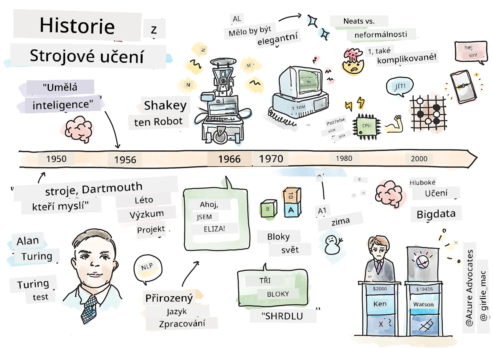
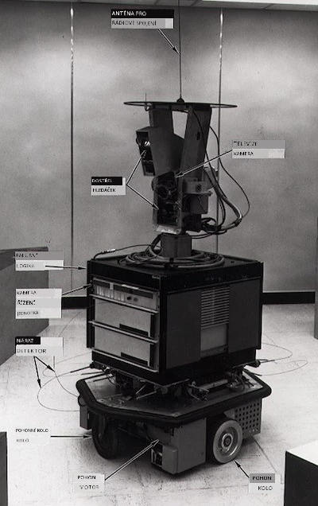
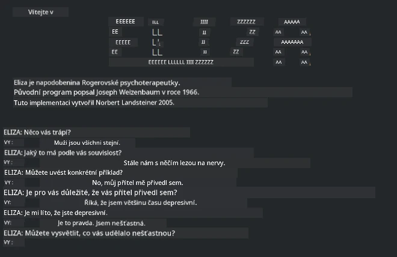

# Historie strojového učení

> Sketchnote od [Tomomi Imura](https://www.twitter.com/girlie_mac)

## [Kvíz před lekcí](https://ff-quizzes.netlify.app/en/ml/)

---

> 🎥 Klikněte na obrázek výše pro krátké video s průchodem touto lekcí.

V této lekci si projdeme hlavní milníky v historii strojového učení a umělé inteligence.

Historie umělé inteligence (AI) jako oboru je úzce spjata s historií strojového učení, protože algoritmy a výpočetní pokroky, které stojí za ML, přispěly k rozvoji AI. Je užitečné si zapamatovat, že zatímco tyto obory jako samostatné oblasti výzkumu začaly krystalizovat v 50. letech, důležité [algoritmické, statistické, matematické, výpočetní a technické objevy](https://wikipedia.org/wiki/Timeline_of_machine_learning) předcházely a překrývaly toto období. Ve skutečnosti lidé přemýšlejí o těchto otázkách [stovky let](https://wikipedia.org/wiki/History_of_artificial_intelligence): tento článek pojednává o historických intelektuálních základech myšlenky „myslícího stroje“.

---
## Pozoruhodné objevy

- 1763, 1812 [Bayesův teorém](https://wikipedia.org/wiki/Bayes%27_theorem) a jeho předchůdci. Tento teorém a jeho aplikace jsou základem odvozování, popisující pravděpodobnost výskytu události na základě předchozích znalostí.
- 1805 [Teorie nejmenších čtverců](https://wikipedia.org/wiki/Least_squares) francouzského matematika Adriena-Marie Legendre. Tuto teorii, o které se dozvíte v naší jednotce Regrese, pomáhá při přizpůsobování dat.
- 1913 [Markovovy řetězce](https://wikipedia.org/wiki/Markov_chain), pojmenované po ruském matematikovi Andreji Markovovi, slouží k popisu posloupnosti možných událostí na základě předchozího stavu.
- 1957 [Perceptron](https://wikipedia.org/wiki/Perceptron) je typ lineárního klasifikátoru vynalezený americkým psychologem Frankem Rosenblattem, který stojí za pokroky v hlubokém učení.

---

- 1967 [Algoritmus nejbližšího souseda](https://wikipedia.org/wiki/Nearest_neighbor) byl původně navržen pro mapování tras. V kontextu ML se používá k detekci vzorců.
- 1970 [Backpropagation](https://wikipedia.org/wiki/Backpropagation) se používá k tréninku [dopředných neuronových sítí](https://wikipedia.org/wiki/Feedforward_neural_network).
- 1982 [Rekurentní neuronové sítě](https://wikipedia.org/wiki/Recurrent_neural_network) jsou umělé neuronové sítě odvozené z dopředných neuronových sítí, které vytvářejí časové grafy.

✅ Udělejte malý průzkum. Které další data v historii ML a AI vám připadají klíčová?

---
## 1950: Stroje, které myslí

Alan Turing, skutečně pozoruhodná osobnost, která byla [veřejností v roce 2019](https://wikipedia.org/wiki/Icons:_The_Greatest_Person_of_the_20th_Century) zvolena největším vědcem 20. století, je připisován za položení základů konceptu „stroje, který může myslet“. Potýkal se s odpůrci a svou potřebou empirických důkazů tohoto konceptu částečně vytvořením [Turingova testu](https://www.bbc.com/news/technology-18475646), který budete zkoumat v našich lekcích NLP.

---
## 1956: Letní výzkumný projekt Dartmouthu

"Letní výzkumný projekt Dartmouthu o umělé inteligenci byl klíčovou událostí pro umělou inteligenci jako obor," a právě zde byl vytvořen termín „umělá inteligence“ ([zdroj](https://250.dartmouth.edu/highlights/artificial-intelligence-ai-coined-dartmouth)).

> Každý aspekt učení nebo jakákoli jiná vlastnost inteligence může být v zásadě tak přesně popsána, že stroj ji může simulovat.

---

Vedoucí výzkumník, profesor matematiky John McCarthy, doufal, „že bude postupovat na základě domněnky, že každý aspekt učení nebo jakákoli jiná vlastnost inteligence může být v zásadě tak přesně popsána, že stroj ji může simulovat.“ Účastníky byli další významní vědci v oboru, včetně Marvina Minskyho.

Workshop je připisován za zahájení a povzbuzení několika diskusí, včetně „vzestupu symbolických metod, systémů zaměřených na omezené oblasti (rané expertní systémy) a odvozovacích systémů oproti induktivním systémům.“ ([zdroj](https://wikipedia.org/wiki/Dartmouth_workshop)).

---
## 1956 - 1974: „Zlatá léta“

Od 50. let do poloviny 70. let panoval optimismus v naději, že AI vyřeší mnoho problémů. V roce 1967 Marvin Minsky sebevědomě prohlásil, že „do jedné generace ... bude problém vytvoření ‚umělé inteligence‘ podstatně vyřešen.“ (Minsky, Marvin (1967), Výpočet: konečné a nekonečné stroje, Englewood Cliffs, N.J.: Prentice-Hall)

Výzkum zpracování přirozeného jazyka rozkvétal, vyhledávání bylo zdokonalené a zesílené a vznikl koncept „mikrosvětů“, kde se jednoduché úkoly plnily pomocí běžných jazykových pokynů.

---

Výzkum byl dobře financován vládními agenturami, byly učiněny pokroky ve výpočetní technice a algoritmech a byly postaveny prototypy inteligentních strojů. Některé z těchto strojů zahrnují:

* [Shakey, robot](https://wikipedia.org/wiki/Shakey_the_robot), který mohl manévrovat a rozhodovat, jak úkoly „inteligentně“ vykonávat.

    
    > Shakey v roce 1972

---

* Eliza, raný „chatterbot“, mohla konverzovat s lidmi a fungovat jako primitivní „terapeut“. O Elize se dozvíte více v lekcích NLP.

    
    > Verze Elizy, chatbot

---

* „Blocks world“ byl příkladem mikrosvěta, kde se mohly bloky skládat a třídit, a experimentovalo se zde s učením strojů přijímat rozhodnutí. Pokroky postavené na knihovnách jako [SHRDLU](https://wikipedia.org/wiki/SHRDLU) pomohly posunout dopředu zpracování jazyka.

    

    > 🎥 Klikněte na obrázek výše pro video: Blocks world s SHRDLU

---
## 1974 - 1980: „Zima AI“

Do poloviny 70. let se ukázalo, že složitost vytváření „inteligentních strojů“ byla podceněna a sliby přes dostupný výpočetní výkon byly nadsazeny. Financování vyschlo a důvěra v obor poklesla. Mezi faktory ovlivňujícími důvěru patřily:
---
- **Omezení**. Výpočetní výkon byl příliš omezený.
- **Kombinatorická exploze**. Počet parametrů, které bylo třeba natrénovat, rostl exponenciálně, jak se od počítačů vyžadovalo více, bez paralelního vývoje výpočetního výkonu a schopností.
- **Nedostatek dat**. Nedostatek dat ztěžoval testování, vývoj a zdokonalování algoritmů.
- **Ptáme se na správné otázky?**. Začaly být zpochybňovány samotné otázky, které byly kladeny. Výzkumníci čelili kritice svých přístupů:
  - Turingovy testy byly zpochybňovány například díky „čínské místnosti“, která tvrdila, že „programování digitálního počítače může způsobit, že to vypadá, že rozumí jazyku, ale nemůže dosáhnout skutečného porozumění.“ ([zdroj](https://plato.stanford.edu/entries/chinese-room/))
  - Etika zavádění umělých inteligencí, jako byl „terapeut“ ELIZA, byla zpochybňována.

---

Současně se formovaly různé školy AI. Byla vytvořena dichotomie mezi přístupy ["nepořádné" vs. "uklizené AI"](https://wikipedia.org/wiki/Neats_and_scruffies). _Nepošloučasné_ laboratoře upravovaly programy hodiny, dokud nedosáhly požadovaných výsledků. _Uklizené_ laboratoře se „zaměřovaly na logiku a formální řešení problémů“. ELIZA a SHRDLU byly známé _nepořádné_ systémy. V 80. letech, s narůstající poptávkou po reprodukovatelnosti ML systémů, _uklizený_ přístup postupně získal prvenství, protože jeho výsledky jsou lépe vysvětlitelné.

---
## 1980s Expertní systémy

S růstem oboru se jeho přínos pro podnikání stal jasnějším, a v 80. letech také vzrostla proliferace „expertních systémů“. „Expertní systémy patřily mezi první opravdu úspěšné formy softwaru umělé inteligence (AI).“ ([zdroj](https://wikipedia.org/wiki/Expert_system)).

Tento typ systému je vlastně _hybridní_, částečně se skládá z pravidlového motoru definujícího podnikatelské požadavky, a inferenčního motoru, který využívá pravidlový systém k odvození nových faktů.

Tato éra zaznamenala také rostoucí pozornost věnovanou neuronovým sítím.

---
## 1987 - 1993: „Chlazení AI“

Proliferace specializovaného hardwaru pro expertní systémy se nešťastně stala příliš specializovanou. Vzestup osobních počítačů také konkuroval těmto velkým, specializovaným, centralizovaným systémům. Demokracie výpočetní techniky začala, a nakonec vytvořila cestu pro moderní explozi velkých dat.

---
## 1993 - 2011

Tato epocha znamenala novou éru pro ML a AI, aby mohly řešit některé problémy způsobené dříve nedostatkem dat a výpočetního výkonu. Množství dat začalo rychle růst a stalo se více dostupné, k lepšímu i horšímu, zejména s příchodem chytrých telefonů kolem roku 2007. Výpočetní výkon vzrostl exponenciálně a algoritmy se vyvíjely paralelně. Obor začal získávat zralost, jak se volné dny minulosti začaly ukotvovat jako skutečná disciplína.

---
## Nyní

Dnes strojové učení a AI zasahují téměř do každé části našich životů. Tato éra vyžaduje pečlivé pochopení rizik a možných dopadů těchto algoritmů na lidské životy. Jak uvedl Brad Smith z Microsoftu: „Informační technologie vyvolávají otázky, které se dotýkají základních ochran lidských práv, jako je soukromí a svoboda projevu. Tyto otázky zvyšují odpovědnost technologických společností, které tyto produkty vytvářejí. Z našeho pohledu také vyžadují promyšlenou vládní regulaci a rozvoj norem týkajících se přijatelných použití“ ([zdroj](https://www.technologyreview.com/2019/12/18/102365/the-future-of-ais-impact-on-society/)).

---

Ještě se uvidí, co budoucnost přinese, ale je důležité porozumět těmto počítačovým systémům a softwaru a algoritmům, na kterých běží. Doufáme, že vám tento učební plán pomůže získat lepší porozumění, abyste si mohli udělat vlastní názor.

> 🎥 Klikněte na obrázek výše pro video: Yann LeCun diskutuje historii hlubokého učení v této přednášce

---
## 🚀Výzva

Ponořte se do některého z těchto historických okamžiků a zjistěte více o lidech za nimi. Jsou to fascinující postavy a žádný vědecký objev nevznikl v kulturním vakuu. Co objevíte?

## [Kvíz po lekci](https://ff-quizzes.netlify.app/en/ml/)

---
## Přehled & Samostudium

Zde jsou položky ke sledování a poslechu:

[Tento podcast, kde Amy Boyd diskutuje vývoj AI](http://runasradio.com/Shows/Show/739)

---

## Zadání

[Vytvořte časovou osu](assignment.md)

---

<!-- CO-OP TRANSLATOR DISCLAIMER START -->
**Prohlášení o omezení odpovědnosti**:
Tento dokument byl přeložen pomocí AI překladatelské služby [Co-op Translator](https://github.com/Azure/co-op-translator). Přestože usilujeme o co největší přesnost, mějte prosím na paměti, že automatizované překlady mohou obsahovat chyby nebo nepřesnosti. Originální dokument v jeho mateřském jazyce by měl být považován za autoritativní zdroj. Pro kritické informace se doporučuje profesionální lidský překlad. Nejsme odpovědní za jakékoli nedorozumění nebo nesprávné interpretace vzniklé použitím tohoto překladu.
<!-- CO-OP TRANSLATOR DISCLAIMER END -->