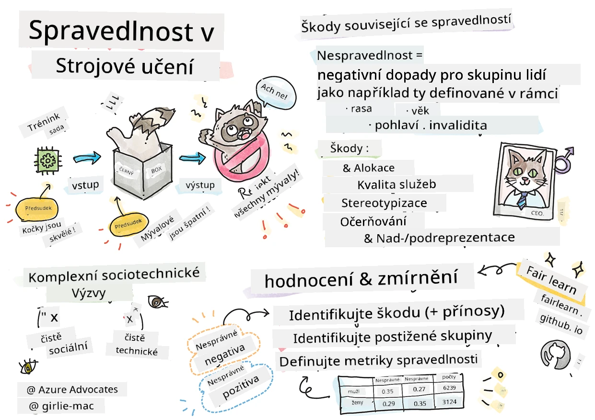

# Tvorba řešení strojového učení s odpovědnou umělou inteligencí
 

> Náčrt od [Tomomi Imura](https://www.twitter.com/girlie_mac)

## [Přednáškový kvíz](https://ff-quizzes.netlify.app/en/ml/)
 
## Úvod

V tomto kurzu začnete objevovat, jak strojové učení ovlivňuje náš každodenní život. Již nyní jsou systémy a modely zapojeny do každodenních rozhodovacích úloh, jako jsou zdravotnické diagnózy, schvalování půjček nebo detekce podvodů. Je proto důležité, aby tyto modely fungovaly dobře a poskytovaly výsledky, kterým lze důvěřovat. Stejně jako jakýkoli software, i AI systémy mohou nesplnit očekávání nebo mít nežádoucí výsledek. Proto je zásadní být schopen pochopit a vysvětlit chování AI modelu.

Představte si, co se stane, když data, která používáte k vytvoření těchto modelů, postrádají určité demografické skupiny, jako je rasa, pohlaví, politický názor, náboženství, nebo tyto skupiny nepoměrně reprezentují. Co když je výstup modelu interpretován tak, že preferuje nějakou demografickou skupinu? Jaký má to důsledek pro aplikaci? Navíc, co když má model nežádoucí výsledek a ubližuje lidem? Kdo je odpovědný za chování AI systému? To jsou některé otázky, které v tomto kurzu prozkoumáme.

V této lekci si:

- Zvýšíte povědomí o důležitosti spravedlnosti ve strojovém učení a škodách souvisejících se spravedlností.
- Se seznámíte s praxí zkoumání odlehlých případů a neobvyklých scénářů pro zajištění spolehlivosti a bezpečnosti
- Získáte pochopení potřeby posílit každého navrhováním inkluzivních systémů
- Prozkoumáte, jak je zásadní chránit soukromí a bezpečnost dat a lidí
- Uvidíte důležitost přístupu s otevřenou schránkou ke vysvětlení chování AI modelů
- Budete si vědomi, jak je odpovědnost nezbytná pro budování důvěry v AI systémy

## Předpoklady

Jako předpoklad prosím absolvujte "Principy odpovědné AI" v Learning Path a podívejte se na video níže na toto téma:

Dozvíte se více o odpovědné AI tím, že budete sledovat tento [Learning Path](https://docs.microsoft.com/learn/modules/responsible-ai-principles/?WT.mc_id=academic-77952-leestott)

> 🎥 Klikněte na obrázek výše pro video: Přístup Microsoftu k odpovědné AI

## Spravedlnost

AI systémy by měly zacházet se všemi spravedlivě a vyhnout se tomu, aby ovlivňovaly podobné skupiny lidí různými způsoby. Například, když AI systémy poskytují doporučení ohledně lékařské léčby, žádostí o půjčku nebo zaměstnání, měly by všem s podobnými příznaky, finanční situací nebo profesní kvalifikací doporučit to samé. Každý z nás jako lidé nosí s sebou zděděné předsudky, které ovlivňují naše rozhodnutí a činy. Tyto předsudky mohou být patrné v datech, která používáme k tréninku AI systémů. Taková manipulace se někdy děje neúmyslně. Často je obtížné si vědomě uvědomit, kdy data zkreslujete.

**„Nespravedlnost“** zahrnuje negativní dopady, nebo „škody“ pro skupinu lidí, například definovanou podle rasy, pohlaví, věku nebo zdravotního postižení. Hlavní škody související se spravedlností lze klasifikovat jako:

- **Přidělení**, pokud je například preferováno nějaké pohlaví nebo etnikum.
- **Kvalita služby**. Pokud trénujete data pro jeden specifický scénář, ale realita je mnohem složitější, vede to k špatně fungující službě. Například dávkovač tekutého mýdla, který nedokázal rozpoznat lidi s tmavou pokožkou. [Reference](https://gizmodo.com/why-cant-this-soap-dispenser-identify-dark-skin-1797931773)
- **Ošklivé označování**. Nespravedlivé kritizování a označování něčeho nebo někoho. Například technologie značkování obrázků neslavně označila obrázky tmavé pleti lidí jako gorily.
- **Nadměrné nebo nedostatečné zastoupení**. Myšlenka, že určitá skupina není vidět v určité profesi, a každá služba nebo funkce, která toto podporuje, přispívá ke škodě.
- **Stereotypizace**. Přiřazování dané skupině předem určených atributů. Například jazykový překladový systém mezi angličtinou a turečtinou může mít nepřesnosti kvůli slovům s genderově stereotypními asociacemi.

> překlad do turečtiny

> překlad zpět do angličtiny

Při návrhu a testování AI systémů musíme zajistit, aby AI byla spravedlivá a nebyla naprogramována k rozhodnutím s předsudky nebo diskriminačním rozhodnutím, která jsou lidským bytostem také zakázána. Zajištění spravedlnosti v AI a strojovém učení je stále složitou sociotechnickou výzvou.

### Spolehlivost a bezpečnost

Aby AI systémy vyvolaly důvěru, musí být spolehlivé, bezpečné a konzistentní za normálních i neočekávaných podmínek. Je důležité vědět, jak se AI systémy budou chovat v různých situacích, zejména pokud jde o odlehlé případy. Při vytváření AI řešení je třeba věnovat značnou pozornost tomu, jak zvládat širokou škálu okolností, se kterými se AI řešení mohou setkat. Například samořiditelné auto musí klást bezpečnost lidí na první místo. Výsledkem je, že AI, která auto pohání, musí zvážit všechny možné scénáře, jako je noc, bouřky nebo sněhové vánice, děti přebíhající přes ulici, domácí mazlíčci, silniční práce atd. Jak dobře může AI systém spolehlivě a bezpečně zvládnout širokou škálu podmínek odráží míru předvídavosti, kterou vědec zabývající se daty nebo vývojář AI při návrhu či testování systému zohlednil.

> [🎥 Klikněte zde pro video: ](https://www.microsoft.com/videoplayer/embed/RE4vvIl)

### Inkluzivita

AI systémy by měly být navrženy tak, aby zapojily a posílily každého. Při návrhu a implementaci AI systémů identifikují datoví vědci a vývojáři AI případné bariéry v systému, které by mohly neúmyslně vyloučit lidi. Například na světě je 1 miliarda lidí s postižením. Díky pokroku AI mají oni snadnější přístup k širokému spektru informací a příležitostí ve svém každodenním životě. Odstraňováním bariér se vytvářejí příležitosti k inovacím a vývoji AI produktů s lepšími zkušenostmi, které prospívají všem.

> [🎥 Klikněte zde pro video: inkluzivita v AI](https://www.microsoft.com/videoplayer/embed/RE4vl9v)

### Bezpečnost a soukromí

AI systémy by měly být bezpečné a respektovat soukromí lidí. Lidé mají menší důvěru ve systémy, které ohrožují jejich soukromí, informace nebo životy. Při tréninku strojových učících se modelů spoléháme na data, abychom dosáhli co nejlepších výsledků. Při tom je třeba zvažovat původ dat a jejich integritu. Například zda data uživatel zadal, nebo zda jsou veřejně dostupná. Dále je během práce s daty klíčové vyvíjet AI systémy, které mohou chránit důvěrné informace a odolávat útokům. Jak AI získává na významu, ochrana soukromí a zabezpečení důležitých osobních a obchodních informací se stává stále kritičtější a složitější. Otázky soukromí a zabezpečení dat vyžadují zvláštní pozornost u AI, protože přístup k datům je nezbytný pro AI systémy, aby mohly přesně a informovaně předpovídat a rozhodovat o lidech.

> [🎥 Klikněte zde pro video: bezpečnost v AI](https://www.microsoft.com/videoplayer/embed/RE4voJF)

- Jako odvětví jsme dosáhli významných pokroků v oblasti soukromí a bezpečnosti, významně podpořených regulacemi jako GDPR (Obecné nařízení o ochraně osobních údajů).
- Přesto u AI systémů musíme uznat napětí mezi potřebou více osobních dat, aby systémy byly osobnější a efektivnější – a ochranou soukromí.
- Stejně jako při vzniku připojených počítačů s internetem sledujeme výrazný nárůst bezpečnostních problémů souvisejících s AI.
- Současně jsme také viděli, že AI se používá ke zlepšení bezpečnosti. Například většina moderních antivirových skenerů je dnes řízena AI heuristikami.
- Musíme zajistit, aby naše procesy datové vědy harmonicky splývaly s nejnovějšími praktikami ochrany soukromí a bezpečnosti.

### Transparentnost
AI systémy by měly být pochopitelné. Klíčovou součástí transparentnosti je vysvětlování chování AI systémů a jejich komponent. Zlepšení porozumění AI systémům vyžaduje, aby zainteresované strany rozuměly jak a proč fungují, aby mohly identifikovat možné problémy s výkonem, bezpečnostní a soukromí rizika, předsudky, výlučné praktiky nebo nežádoucí výsledky. Také věříme, že ti, kdo AI systémy používají, by měli být upřímní a otevření ohledně toho, kdy, proč a jak se rozhodli je nasadit. A také o omezeních systémů, které používají. Například pokud banka používá AI systém na podporu svých rozhodnutí o půjčkách pro spotřebitele, je důležité zkoumat výsledky a pochopit, která data ovlivňují doporučení systému. Vlády začínají regulovat AI napříč odvětvími, a proto musí datoví vědci a organizace vysvětlit, zda AI systém splňuje regulatorní požadavky, zejména pokud dojde k nežádoucímu výsledku.

> [🎥 Klikněte zde pro video: transparentnost v AI](https://www.microsoft.com/videoplayer/embed/RE4voJF)

- Protože AI systémy jsou tak složité, je obtížné pochopit, jak fungují, a interpretovat výsledky.
- Tento nedostatek porozumění ovlivňuje způsob, jakým jsou tyto systémy spravovány, zaváděny a dokumentovány.
- Tento nedostatek porozumění ovlivňuje nade vše rozhodnutí učiněná na základě výsledků, které tyto systémy produkují.

### Odpovědnost
 
Lidé, kteří navrhují a zavádějí AI systémy, musí být odpovědní za to, jak jejich systémy fungují. Potřeba odpovědnosti je zvlášť důležitá u citlivých technologií, jako je rozpoznávání obličejů. Nedávno vzrostla poptávka po technologii rozpoznávání obličejů, zejména ze strany orgánů činných v trestním řízení, které vidí potenciál této technologie pro použití, například při hledání pohřešovaných dětí. Nicméně tyto technologie by mohly být potenciálně použity vládou k ohrožení základních svobod občanů například umožněním trvalého sledování konkrétních jednotlivců. Proto je třeba, aby datoví vědci a organizace nesli odpovědnost za to, jak jejich AI systém ovlivňuje jednotlivce nebo společnost.

> 🎥 Klikněte na obrázek výše pro video: Varování před masovým sledováním pomocí rozpoznávání obličejů

Nakonec jedna z největších otázek pro naši generaci, jako první generaci, která přináší AI do společnosti, je, jak zajistit, aby počítače zůstaly odpovědné vůči lidem a jak zajistit, aby lidé, kteří počítače navrhují, zůstali odpovědní vůči všem ostatním.

## Hodnocení dopadů

Před tréninkem strojového učícího modelu je důležité provést hodnocení dopadů, aby se pochopil účel AI systému; jaké je jeho zamýšlené použití; kde bude nasazen; a kdo s ním bude interagovat. Tyto informace jsou užitečné pro hodnotitele nebo testery systému, kteří potřebují vědět, jaké faktory zvážit při identifikaci potenciálních rizik a očekávaných důsledků.

Následují oblasti zaměření při provádění hodnocení dopadů:

* **Nepříznivý dopad na jednotlivce**. Být si vědom jakýchkoli omezení nebo požadavků, nepodporovaného použití nebo jakýchkoli známých omezení, která brání výkonu systému, je nezbytné, aby se zajistilo, že systém nebude používán způsobem, který by mohl způsobit škody jednotlivcům.
* **Požadavky na data**. Pochopení toho, jak a kde systém bude data používat, umožňuje hodnotitelům prozkoumat požadavky na data, na které je třeba dbát (např. regulace GDPR nebo HIPAA). Dále je třeba zkontrolovat, zda je zdroj nebo množství dat dostačující pro trénink.
* **Shrnutí dopadů**. Shromáždit seznam potenciálních škod, které by mohly vzniknout použitím systému. Během životního cyklu ML pravidelně kontrolovat, zda jsou zjištěné problémy zmírněny nebo řešeny.
* **Platné cíle** pro každý ze šesti základních principů. Zhodnotit, zda jsou cíle z každého z principů splněny a zda jsou nějaké mezery.

## Ladění s odpovědnou AI

Podobně jako ladění softwarové aplikace je ladění AI systému nezbytným postupem identifikace a řešení problémů v systému. Existuje mnoho faktorů, které by mohly způsobit, že model nebude fungovat podle očekávání nebo odpovědně. Většina tradičních metrik výkonnosti modelu jsou kvantitativní agregáty výkonu modelu, které však nejsou dostačující k analýze toho, jak model porušuje principy odpovědné AI. Navíc je model strojového učení černá skříňka, která ztěžuje pochopení toho, co ovlivňuje jeho výsledek, nebo poskytnutí vysvětlení, když udělá chybu. Později v tomto kurzu se naučíme používat řídicí panel Responsible AI k ladění AI systémů. Tento řídicí panel poskytuje komplexní nástroj pro datové vědce a vývojáře AI k provádění:

* **Analýza chyb**. Identifikovat rozložení chyb modelu, které mohou ovlivnit spravedlnost nebo spolehlivost systému.
* **Přehled modelu**. Objevit, kde existují rozdíly ve výkonu modelu napříč datovými kohortami.
* **Analýza dat**. Pochopit rozložení dat a identifikovat možné předsudky v datech, které by mohly vést k problémům se spravedlností, inkluzivitou a spolehlivostí.
* **Interpretovatelnost modelu**. Porozumět tomu, co ovlivňuje nebo určuje předpovědi modelu. To pomáhá při vysvětlování chování modelu, což je důležité pro transparentnost a odpovědnost.

## 🚀 Výzva
 
Abychom zabránili vzniku škod již v zárodku, měli bychom:

- mít rozmanitost zázemí a názorů mezi lidmi pracujícími na systémech
- investovat do datových sad, které odrážejí rozmanitost naší společnosti
- vyvíjet lepší metody během celého životního cyklu strojového učení pro detekci a opravu odpovědné AI, když k ní dojde

Zamyslete se nad reálnými scénáři, kde je nedůvěryhodnost modelu evidentní při tvorbě a používání modelu. Co dalšího bychom měli zvážit?

## [Povídkový kvíz](https://ff-quizzes.netlify.app/en/ml/)

## Recenze a samostudium
 

V této lekci jste se naučili základy konceptů spravedlnosti a nespravedlnosti v oblasti strojového učení.  
 
Podívejte se na tento workshop, ve kterém se do těchto témat ponoříte hlouběji: 

- V úsilí o odpovědnou AI: Převádění principů do praxe od Besmiry Nushi, Mehrnoosh Sameki a Amita Sharma

> 🎥 Klikněte na obrázek výše pro video: RAI Toolbox: Open source rámec pro vytváření odpovědné AI od Besmiry Nushi, Mehrnoosh Sameki a Amita Sharma

Také si přečtěte: 

- Centrum zdrojů pro odpovědnou AI Microsoftu: [Responsible AI Resources – Microsoft AI](https://www.microsoft.com/ai/responsible-ai-resources?activetab=pivot1%3aprimaryr4) 

- Výzkumná skupina FATE Microsoftu: [FATE: Fairness, Accountability, Transparency, and Ethics in AI - Microsoft Research](https://www.microsoft.com/research/theme/fate/) 

RAI Toolbox: 

- [GitHub repozitář Responsible AI Toolbox](https://github.com/microsoft/responsible-ai-toolbox)

Přečtěte si o nástrojích Azure Machine Learning pro zajištění spravedlnosti:

- [Azure Machine Learning](https://docs.microsoft.com/azure/machine-learning/concept-fairness-ml?WT.mc_id=academic-77952-leestott) 

## Úkol

[Prozkoumejte RAI Toolbox](assignment.md)

---

<!-- CO-OP TRANSLATOR DISCLAIMER START -->
**Prohlášení o omezení odpovědnosti**:
Tento dokument byl přeložen pomocí AI překladatelské služby [Co-op Translator](https://github.com/Azure/co-op-translator). Přestože usilujeme o co největší přesnost, mějte prosím na paměti, že automatizované překlady mohou obsahovat chyby nebo nepřesnosti. Originální dokument v jeho mateřském jazyce by měl být považován za autoritativní zdroj. Pro kritické informace se doporučuje profesionální lidský překlad. Nejsme odpovědní za jakékoli nedorozumění nebo nesprávné interpretace vzniklé použitím tohoto překladu.
<!-- CO-OP TRANSLATOR DISCLAIMER END -->